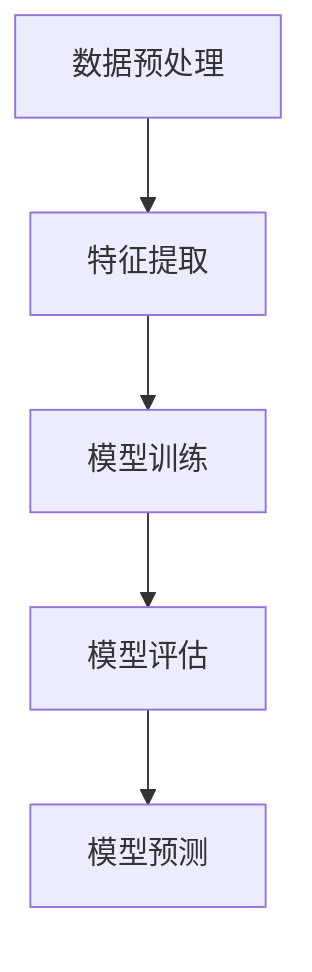

                 

关键词：监督学习、机器学习、深度学习、算法原理、代码实现、实战案例

> 摘要：本文将深入探讨监督学习的基本原理、算法实现以及实战应用。通过理论讲解和实际代码案例，帮助读者理解监督学习在实际问题中的应用，掌握从数据预处理到模型训练再到预测的全流程。

## 1. 背景介绍

监督学习（Supervised Learning）是机器学习中最基础也是最广泛应用的一种学习方法。它通过利用带有标签的训练数据，学习数据特征与标签之间的映射关系，以便在新的数据上做出预测。监督学习的核心目标是使模型能够在未知数据上实现高精度的预测。

监督学习可以分为两大类：回归（Regression）和分类（Classification）。回归问题旨在预测连续值，而分类问题则预测离散标签。两者在算法原理和实现上有所不同，但基本流程是相似的，都需要通过训练模型来捕捉数据特征和标签之间的关系。

监督学习在许多领域都有广泛应用，如图像识别、自然语言处理、推荐系统等。随着深度学习的兴起，监督学习的方法也在不断地发展和改进，例如卷积神经网络（CNN）和循环神经网络（RNN）等深度学习模型，在监督学习任务中取得了显著的成果。

## 2. 核心概念与联系

### 2.1 监督学习的核心概念

监督学习涉及以下几个核心概念：

- **训练集（Training Set）**：用于训练模型的原始数据集，其中包含了输入特征和对应的标签。
- **测试集（Test Set）**：用于评估模型性能的数据集，模型未参与训练。
- **预测（Prediction）**：模型在未知数据上根据学到的特征与标签关系作出的预测。
- **准确性（Accuracy）**：模型预测正确的样本数占总样本数的比例，是评估分类模型性能的一个指标。
- **均方误差（Mean Squared Error, MSE）**：用于评估回归模型性能的一个指标，表示预测值与真实值之间平均平方误差。

### 2.2 监督学习的架构

以下是监督学习的架构图，它展示了模型训练、测试和预测的流程：



### 2.3 监督学习的流程

监督学习的流程可以分为以下几个步骤：

1. **数据收集**：收集包含标签的数据集。
2. **数据预处理**：清洗数据，处理缺失值和异常值，标准化或归一化数据。
3. **特征提取**：从数据中提取有用的特征。
4. **模型训练**：利用训练数据训练模型，学习特征与标签之间的关系。
5. **模型评估**：利用测试数据评估模型性能。
6. **模型预测**：利用训练好的模型对新数据进行预测。

## 3. 核心算法原理 & 具体操作步骤

### 3.1 算法原理概述

监督学习算法主要包括以下几类：

1. **线性模型**：如线性回归（Linear Regression）、逻辑回归（Logistic Regression）等。
2. **树模型**：如决策树（Decision Tree）、随机森林（Random Forest）等。
3. **支持向量机**：如线性支持向量机（Linear SVM）、核化支持向量机（Kernel SVM）等。
4. **神经网络**：如多层感知机（MLP）、卷积神经网络（CNN）、循环神经网络（RNN）等。

### 3.2 算法步骤详解

1. **数据收集与预处理**：收集数据并清洗，包括缺失值处理、异常值处理、数据标准化等。
2. **特征提取**：根据数据特点选择合适的特征提取方法，如主成分分析（PCA）、特征选择等。
3. **模型选择**：根据任务类型（回归或分类）选择合适的模型。
4. **模型训练**：利用训练数据训练模型，调整模型参数。
5. **模型评估**：利用测试数据评估模型性能，如准确性、MSE等。
6. **模型优化**：根据评估结果调整模型参数，提高模型性能。
7. **模型预测**：利用训练好的模型对新数据进行预测。

### 3.3 算法优缺点

- **线性模型**：简单易懂，计算效率高，但拟合能力较弱。
- **树模型**：易于解释，能够处理非线性数据，但容易过拟合。
- **支持向量机**：在处理高维数据时表现良好，但计算复杂度高。
- **神经网络**：强大的拟合能力，能够处理复杂非线性问题，但训练过程复杂，容易过拟合。

### 3.4 算法应用领域

监督学习广泛应用于各个领域，如：

- **图像识别**：使用卷积神经网络（CNN）进行物体识别、人脸识别等。
- **自然语言处理**：使用循环神经网络（RNN）进行文本分类、情感分析等。
- **推荐系统**：使用协同过滤算法（Collaborative Filtering）进行商品推荐、电影推荐等。
- **医疗诊断**：使用深度学习模型进行疾病诊断、医学图像分析等。

## 4. 数学模型和公式 & 详细讲解 & 举例说明

### 4.1 数学模型构建

监督学习的数学模型主要涉及以下几类：

1. **线性回归模型**：
   $$y = \beta_0 + \beta_1x$$

2. **逻辑回归模型**：
   $$P(y=1) = \frac{1}{1 + e^{-(\beta_0 + \beta_1x)}}$$

3. **决策树模型**：
   $$y = f(x) = \prod_{i=1}^{n} g(x_i)$$
   其中，$g(x_i)$ 是关于 $x_i$ 的函数。

4. **神经网络模型**：
   $$y = \sigma(\sum_{i=1}^{n} \beta_i x_i)$$
   其中，$\sigma$ 是激活函数。

### 4.2 公式推导过程

以线性回归模型为例，推导过程如下：

1. **损失函数**：
   $$L(\theta) = \sum_{i=1}^{m} (y_i - \theta_0 - \theta_1x_i)^2$$

2. **梯度下降**：
   $$\theta_0 := \theta_0 - \alpha \frac{\partial L(\theta)}{\partial \theta_0}$$
   $$\theta_1 := \theta_1 - \alpha \frac{\partial L(\theta)}{\partial \theta_1}$$
   其中，$\alpha$ 是学习率。

3. **最优解**：
   $$\theta_0 = \frac{1}{m} \sum_{i=1}^{m} (y_i - \theta_1x_i)$$
   $$\theta_1 = \frac{1}{m} \sum_{i=1}^{m} (y_i - \theta_0x_i)x_i$$

### 4.3 案例分析与讲解

以一个简单的线性回归为例，数据集包含 $m=100$ 个样本，每个样本包含 $x$ 和 $y$ 两个特征。

1. **数据预处理**：将数据集分为训练集和测试集，并标准化数据。

2. **模型选择**：选择线性回归模型。

3. **模型训练**：使用梯度下降法训练模型。

4. **模型评估**：计算训练集和测试集的均方误差（MSE）。

5. **模型预测**：使用训练好的模型对新数据进行预测。

## 5. 项目实践：代码实例和详细解释说明

### 5.1 开发环境搭建

在本文中，我们将使用 Python 语言和 Scikit-learn 库进行监督学习实战。首先，需要安装 Python 和 Scikit-learn：

```bash
pip install python
pip install scikit-learn
```

### 5.2 源代码详细实现

以下是一个简单的线性回归案例：

```python
# 导入相关库
import numpy as np
from sklearn.linear_model import LinearRegression
from sklearn.model_selection import train_test_split
from sklearn.metrics import mean_squared_error

# 生成数据集
np.random.seed(0)
m = 100
x = np.random.rand(m, 1)
y = 2 + 3 * x + np.random.randn(m, 1)

# 数据预处理
x_train, x_test, y_train, y_test = train_test_split(x, y, test_size=0.2, random_state=0)

# 模型选择
model = LinearRegression()

# 模型训练
model.fit(x_train, y_train)

# 模型评估
y_pred = model.predict(x_test)
mse = mean_squared_error(y_test, y_pred)
print("MSE:", mse)

# 模型预测
new_data = np.array([[0.5]])
prediction = model.predict(new_data)
print("Prediction:", prediction)
```

### 5.3 代码解读与分析

1. **数据生成**：我们首先生成了一个包含100个样本的数据集，每个样本由一个特征 $x$ 和一个标签 $y$ 组成。

2. **数据预处理**：使用 Scikit-learn 中的 `train_test_split` 函数将数据集分为训练集和测试集，并使用 `mean_squared_error` 函数计算均方误差。

3. **模型选择**：我们选择了 Scikit-learn 中的 `LinearRegression` 类来创建线性回归模型。

4. **模型训练**：使用 `fit` 方法训练模型，模型会自动计算最佳参数。

5. **模型评估**：使用训练集和测试集评估模型性能。

6. **模型预测**：使用训练好的模型对新数据进行预测。

## 6. 实际应用场景

监督学习在实际应用中具有广泛的应用，以下是一些常见的应用场景：

- **图像识别**：使用卷积神经网络（CNN）对图像进行分类，如人脸识别、物体识别等。
- **自然语言处理**：使用循环神经网络（RNN）进行文本分类、情感分析等。
- **推荐系统**：使用协同过滤算法进行商品推荐、电影推荐等。
- **医疗诊断**：使用深度学习模型进行疾病诊断、医学图像分析等。

## 7. 工具和资源推荐

### 7.1 学习资源推荐

- **书籍**：《统计学习方法》（李航）、《机器学习》（周志华）等。
- **在线课程**：Coursera、Udacity、edX 等平台上的机器学习课程。
- **博客**：机器学习社区、GitHub 上的机器学习项目等。

### 7.2 开发工具推荐

- **Python**：Python 是机器学习的首选编程语言，拥有丰富的机器学习库。
- **Scikit-learn**：Python 中的机器学习库，提供丰富的算法和工具。
- **TensorFlow**：Google 开发的深度学习框架，适用于复杂深度学习模型的开发。

### 7.3 相关论文推荐

- **“A Study on Deep Convolutional Neural Networks for Image Classification”**：介绍了深度卷积神经网络在图像分类中的应用。
- **“Recurrent Neural Network Based Language Model”**：介绍了循环神经网络在自然语言处理中的应用。

## 8. 总结：未来发展趋势与挑战

### 8.1 研究成果总结

监督学习作为机器学习的基础，已经取得了显著的成果。特别是在深度学习领域，卷积神经网络（CNN）和循环神经网络（RNN）在图像识别、自然语言处理等领域取得了突破性的进展。

### 8.2 未来发展趋势

- **模型压缩与优化**：为了提高模型的计算效率和部署性能，模型压缩与优化将成为研究重点。
- **联邦学习**：在保护用户隐私的同时，实现大规模数据协同学习。
- **多模态学习**：结合多种数据模态，提高模型的泛化能力。

### 8.3 面临的挑战

- **数据隐私**：如何保护用户隐私，实现安全的数据共享和协同学习。
- **模型解释性**：提高模型的解释性，使模型决策过程更加透明。
- **可解释性**：如何解释深度学习模型的决策过程，提高模型的可靠性。

### 8.4 研究展望

监督学习在人工智能领域具有广阔的应用前景，未来将不断有新的算法和技术涌现，推动人工智能的发展。

## 9. 附录：常见问题与解答

### 9.1 如何选择合适的监督学习算法？

选择合适的监督学习算法取决于任务类型、数据特点和计算资源。一般来说，线性模型适合处理简单任务，树模型适合处理非线性任务，神经网络适合处理复杂任务。

### 9.2 监督学习中的过拟合是什么？

过拟合是指模型在训练数据上表现得很好，但在测试数据上表现较差，即模型对训练数据的拟合过度，缺乏泛化能力。

### 9.3 如何解决过拟合问题？

解决过拟合问题可以通过以下方法：

- **增加训练数据**：增加训练数据的数量，提高模型的泛化能力。
- **正则化**：通过正则化方法（如 L1、L2 正则化）限制模型复杂度。
- **交叉验证**：使用交叉验证方法评估模型性能，避免过拟合。

<|im_sep|>作者：禅与计算机程序设计艺术 / Zen and the Art of Computer Programming<|im_sep|>

