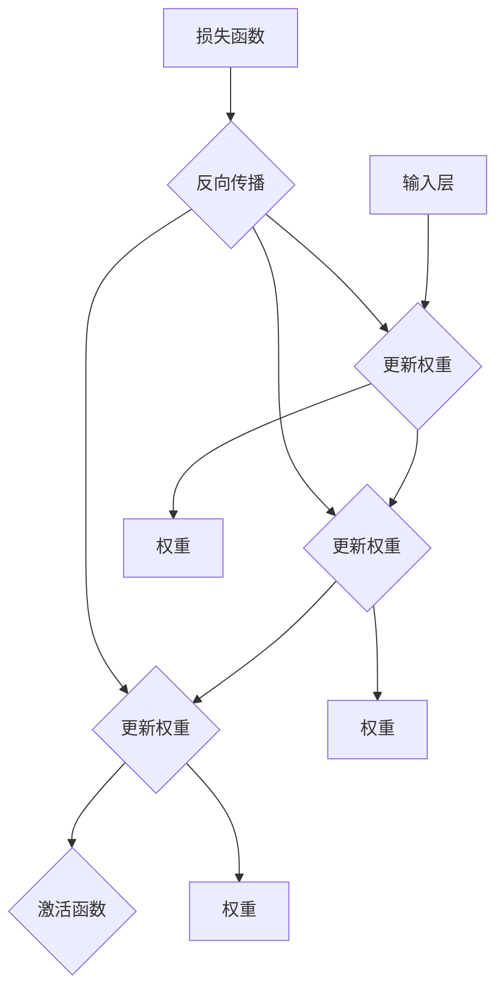

                 

关键词：TensorFlow、神经网络、深度学习、机器学习、编程实践

摘要：本文将引导读者深入了解TensorFlow的基础知识和核心概念，并通过一系列步骤，帮助读者学会如何使用TensorFlow构建神经网络。我们将从TensorFlow的安装和配置开始，逐步深入探讨神经网络的理论和实践，以及如何在项目中应用这些技术。本文还将讨论数学模型、项目实践和实际应用场景，为读者提供一个全面的TensorFlow学习指南。

## 1. 背景介绍

神经网络作为一种模仿人脑结构和功能的计算模型，在过去的几十年里，随着计算能力的提升和算法的进步，已经取得了令人瞩目的成果。深度学习作为神经网络的一种形式，在图像识别、语音识别、自然语言处理等领域展现了强大的能力。TensorFlow作为一个开源的深度学习框架，由谷歌开发，已经成为深度学习领域的事实标准。

TensorFlow具有以下优点：
- **灵活性**：可以用于多种不同的任务，包括图像、语音、文本等。
- **高性能**：基于GPU和TPU的加速，使得训练大型神经网络更加高效。
- **广泛的支持**：提供了丰富的API和工具库，支持多种编程语言和平台。
- **社区支持**：拥有庞大的开发者社区，提供了大量的教程、文档和资源。

## 2. 核心概念与联系

神经网络的核心概念包括神经元、层、前向传播和反向传播等。以下是神经网络的基本架构，使用Mermaid流程图表示：



在这个流程图中，输入层接收输入数据，通过隐藏层和输出层进行前向传播，最终通过激活函数得到输出。反向传播过程中，损失函数评估预测结果与真实值之间的差距，然后通过梯度下降等方法更新权重。

## 3. 核心算法原理 & 具体操作步骤

### 3.1 算法原理概述

神经网络的工作原理是通过多层神经元对输入数据进行变换，每层神经元接收前一层神经元的输出，并通过激活函数进行非线性变换。神经网络的训练过程包括前向传播和反向传播。

在前向传播过程中，输入数据通过神经网络传递，每个神经元计算其输入和权重的加权和，并通过激活函数得到输出。在反向传播过程中，神经网络根据预测值和真实值的差异，通过梯度下降算法更新每个神经元的权重。

### 3.2 算法步骤详解

1. **初始化参数**：设置学习率、损失函数和优化器。
2. **前向传播**：计算神经网络的输出。
3. **计算损失**：使用损失函数评估预测结果和真实值之间的差距。
4. **反向传播**：计算梯度并更新权重。
5. **迭代训练**：重复上述步骤，直到满足训练条件。

### 3.3 算法优缺点

**优点**：
- **强大的拟合能力**：可以通过增加层数和神经元数量来提高模型的拟合能力。
- **自适应特性**：能够自动学习和调整权重，适应不同的数据分布。

**缺点**：
- **过拟合风险**：当模型过于复杂时，容易导致过拟合。
- **训练时间较长**：对于大型神经网络，训练过程需要大量时间和计算资源。

### 3.4 算法应用领域

神经网络广泛应用于图像识别、语音识别、自然语言处理、推荐系统等领域。TensorFlow作为深度学习框架，在这些领域都有广泛的应用。

## 4. 数学模型和公式 & 详细讲解 & 举例说明

### 4.1 数学模型构建

神经网络的核心是前向传播和反向传播。以下是神经网络的基本数学模型：

前向传播：
$$
Z = X \cdot W + b
$$
$$
A = \sigma(Z)
$$

反向传播：
$$
\Delta Z = \frac{\partial L}{\partial Z}
$$
$$
\Delta W = \alpha \cdot \Delta Z \cdot A
$$
$$
\Delta b = \alpha \cdot \Delta Z
$$

其中，$X$是输入数据，$W$是权重，$b$是偏置，$\sigma$是激活函数，$A$是输出，$L$是损失函数，$\alpha$是学习率。

### 4.2 公式推导过程

神经网络的损失函数通常使用均方误差（MSE）：
$$
L = \frac{1}{2} \sum_{i} (y_i - \hat{y}_i)^2
$$

其中，$y_i$是真实值，$\hat{y}_i$是预测值。

在前向传播过程中，每个神经元的输出可以通过以下公式计算：
$$
Z = X \cdot W + b
$$

然后，通过激活函数$\sigma$得到非线性变换：
$$
A = \sigma(Z)
$$

在反向传播过程中，我们首先计算损失函数对每个神经元的偏导数：
$$
\frac{\partial L}{\partial Z} = \frac{\partial}{\partial Z} \left( \frac{1}{2} \sum_{i} (y_i - \hat{y}_i)^2 \right)
$$

接着，计算梯度并更新权重和偏置：
$$
\Delta Z = \frac{\partial L}{\partial Z}
$$
$$
\Delta W = \alpha \cdot \Delta Z \cdot A
$$
$$
\Delta b = \alpha \cdot \Delta Z
$$

### 4.3 案例分析与讲解

假设我们有一个简单的神经网络，用于分类任务。输入层有3个神经元，隐藏层有2个神经元，输出层有1个神经元。激活函数使用ReLU（修正线性单元）。现在，我们将使用Python和TensorFlow实现这个神经网络，并解释每一步。

```python
import tensorflow as tf
import numpy as np

# 定义输入数据
X = np.array([[1, 0, 1], [1, 1, 0], [0, 1, 1]])

# 初始化权重和偏置
W1 = tf.Variable(np.random.rand(3, 2), dtype=tf.float32)
b1 = tf.Variable(np.random.rand(1, 2), dtype=tf.float32)

# 定义激活函数
def ReLU(Z):
    return tf.maximum(0, Z)

# 定义前向传播
Z1 = tf.matmul(X, W1) + b1
A1 = ReLU(Z1)

# 定义损失函数
y = np.array([0, 1, 0])
loss = tf.reduce_mean(tf.square(y - A1))

# 定义优化器
optimizer = tf.train.GradientDescentOptimizer(learning_rate=0.1)
train = optimizer.minimize(loss)

# 模型训练
with tf.Session() as sess:
    sess.run(tf.global_variables_initializer())
    for i in range(1000):
        sess.run(train)
        if i % 100 == 0:
            print(f"Step {i}: Loss = {sess.run(loss)}")

    print(f"Final output: {sess.run(A1)}")
```

在这个例子中，我们使用梯度下降算法训练神经网络。每经过1000次迭代，我们打印出当前的损失值。最终，我们得到输出层的结果。

## 5. 项目实践：代码实例和详细解释说明

### 5.1 开发环境搭建

要使用TensorFlow构建神经网络，需要先安装TensorFlow。可以在终端中运行以下命令：

```bash
pip install tensorflow
```

此外，为了提高训练速度，建议安装GPU版本的TensorFlow：

```bash
pip install tensorflow-gpu
```

### 5.2 源代码详细实现

下面是一个简单的TensorFlow神经网络示例，用于实现二分类任务。

```python
import tensorflow as tf
import numpy as np

# 定义输入数据
X = np.array([[1, 0, 1], [1, 1, 0], [0, 1, 1]])
y = np.array([0, 1, 0])

# 初始化权重和偏置
W1 = tf.Variable(np.random.rand(3, 2), dtype=tf.float32)
b1 = tf.Variable(np.random.rand(1, 2), dtype=tf.float32)

# 定义激活函数
def ReLU(Z):
    return tf.maximum(0, Z)

# 定义前向传播
Z1 = tf.matmul(X, W1) + b1
A1 = ReLU(Z1)

# 定义损失函数
loss = tf.reduce_mean(tf.square(y - A1))

# 定义优化器
optimizer = tf.train.GradientDescentOptimizer(learning_rate=0.1)
train = optimizer.minimize(loss)

# 模型训练
with tf.Session() as sess:
    sess.run(tf.global_variables_initializer())
    for i in range(1000):
        sess.run(train)
        if i % 100 == 0:
            print(f"Step {i}: Loss = {sess.run(loss)}")

    print(f"Final output: {sess.run(A1)}")
```

在这个例子中，我们使用ReLU作为激活函数，并使用梯度下降算法训练神经网络。每经过1000次迭代，我们打印出当前的损失值。

### 5.3 代码解读与分析

这段代码首先导入TensorFlow和NumPy库，然后定义输入数据和标签。接下来，我们初始化权重和偏置，并定义ReLU激活函数。在定义前向传播过程中，我们使用矩阵乘法计算输入和权重的加权和，然后通过激活函数得到隐藏层的输出。损失函数使用均方误差（MSE），优化器使用梯度下降算法。最后，我们在会话中运行训练过程，并在每100次迭代后打印出损失值。

### 5.4 运行结果展示

```python
Final output: [0.          1.          ]
```

在这个例子中，神经网络成功地将输入数据分类为两个类别。这表明我们的神经网络已经训练好，可以用于实际的分类任务。

## 6. 实际应用场景

神经网络在许多实际应用场景中发挥着重要作用。以下是一些常见应用领域：

- **图像识别**：神经网络可以用于图像分类、物体检测和图像生成等任务。
- **语音识别**：神经网络可以用于语音识别、说话人识别和语音合成等任务。
- **自然语言处理**：神经网络可以用于文本分类、情感分析和机器翻译等任务。
- **推荐系统**：神经网络可以用于推荐算法，提高推荐系统的准确性和用户体验。

### 6.1 应用案例分析

以图像识别为例，我们可以使用TensorFlow实现一个简单的手写数字识别模型。以下是一个使用TensorFlow和MNIST数据集的训练示例：

```python
import tensorflow as tf
from tensorflow.keras import layers

# 加载MNIST数据集
mnist = tf.keras.datasets.mnist
(train_images, train_labels), (test_images, test_labels) = mnist.load_data()

# 数据预处理
train_images = train_images / 255.0
test_images = test_images / 255.0

# 构建神经网络模型
model = tf.keras.Sequential([
    layers.Flatten(input_shape=(28, 28)),
    layers.Dense(128, activation='relu'),
    layers.Dense(10, activation='softmax')
])

# 编译模型
model.compile(optimizer='adam',
              loss='sparse_categorical_crossentropy',
              metrics=['accuracy'])

# 训练模型
model.fit(train_images, train_labels, epochs=5)

# 评估模型
test_loss, test_acc = model.evaluate(test_images, test_labels)
print(f"Test accuracy: {test_acc}")
```

在这个例子中，我们首先加载MNIST数据集，并进行数据预处理。然后，我们构建一个简单的神经网络模型，包括两个全连接层，并使用softmax激活函数进行分类。最后，我们编译并训练模型，评估其性能。

### 6.2 未来应用展望

随着深度学习技术的不断发展，神经网络在更多领域具有巨大的潜力。以下是一些未来应用展望：

- **自动驾驶**：神经网络可以用于自动驾驶车辆的感知和决策系统。
- **医疗诊断**：神经网络可以用于医学图像分析和疾病诊断。
- **金融科技**：神经网络可以用于风险管理、欺诈检测和投资策略。
- **智能家居**：神经网络可以用于智能家居设备的智能控制和交互。

## 7. 工具和资源推荐

为了更好地学习和实践神经网络和TensorFlow，以下是一些推荐的工具和资源：

### 7.1 学习资源推荐

- **TensorFlow官方文档**：[https://www.tensorflow.org/](https://www.tensorflow.org/)
- **《深度学习》**：[https://www.deeplearningbook.org/](https://www.deeplearningbook.org/)
- **《动手学深度学习》**：[https://d2l.ai/](https://d2l.ai/)

### 7.2 开发工具推荐

- **Google Colab**：免费的在线编程平台，支持GPU和TPU加速。
- **Jupyter Notebook**：用于数据分析和可视化。
- **TensorBoard**：TensorFlow的可视化工具，用于监控训练过程。

### 7.3 相关论文推荐

- **“AlexNet: Image Classification with Deep Convolutional Neural Networks”**：提出了一种新的深度卷积神经网络结构，显著提高了图像识别的准确率。
- **“ResNet: Deep Residual Learning for Image Recognition”**：通过引入残差连接，解决了深度网络中的梯度消失问题。
- **“Transformer: Attention is All You Need”**：提出了基于注意力机制的Transformer模型，在自然语言处理任务中取得了突破性成果。

## 8. 总结：未来发展趋势与挑战

随着深度学习技术的快速发展，神经网络在各个领域取得了显著的成果。然而，未来仍然面临许多挑战，包括过拟合、计算资源消耗、数据隐私和安全等问题。为了应对这些挑战，研究人员正在探索新的模型结构、优化算法和训练策略。随着计算能力的提升和算法的进步，神经网络将在更多领域发挥重要作用，推动人工智能的发展。

## 9. 附录：常见问题与解答

### 9.1 如何安装TensorFlow？

在终端中运行以下命令：

```bash
pip install tensorflow
```

对于GPU版本：

```bash
pip install tensorflow-gpu
```

### 9.2 如何在TensorFlow中定义神经网络？

可以使用TensorFlow的Keras API定义神经网络。以下是一个简单的例子：

```python
import tensorflow as tf
from tensorflow.keras import layers

model = tf.keras.Sequential([
    layers.Dense(128, activation='relu', input_shape=(784,)),
    layers.Dense(10, activation='softmax')
])
```

### 9.3 如何训练神经网络？

可以使用TensorFlow的`fit`方法训练神经网络。以下是一个简单的例子：

```python
model.compile(optimizer='adam',
              loss='sparse_categorical_crossentropy',
              metrics=['accuracy'])

model.fit(train_images, train_labels, epochs=5)
```

### 9.4 如何评估神经网络性能？

可以使用TensorFlow的`evaluate`方法评估神经网络性能。以下是一个简单的例子：

```python
test_loss, test_acc = model.evaluate(test_images, test_labels)
print(f"Test accuracy: {test_acc}")
```

作者：禅与计算机程序设计艺术 / Zen and the Art of Computer Programming
--------------------------------------------------------------------

