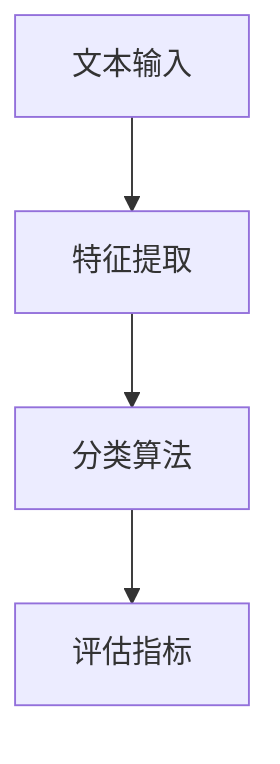

                 

关键词：文本分类，机器学习，深度学习，自然语言处理，算法原理，代码实例

> 摘要：本文将深入探讨文本分类的基本原理，包括其定义、应用场景、核心算法及其数学模型。同时，通过具体代码实例，我们将展示如何实现一个简单的文本分类系统，帮助读者更好地理解和应用文本分类技术。

## 1. 背景介绍

随着互联网的飞速发展和大数据时代的来临，文本数据变得越来越丰富。如何从大量的文本数据中提取有价值的信息，成为了一个重要的研究课题。文本分类作为自然语言处理（NLP）的一个重要分支，旨在将文本数据按照一定的标准进行归类。文本分类不仅在学术界受到广泛关注，同时在工业界也有着广泛的应用。

文本分类的应用场景非常广泛，例如：

- **社交媒体分析**：通过分类算法对社交媒体平台上的文本进行情感分析，帮助企业了解消费者的反馈和需求。
- **新闻推荐**：根据用户的阅读习惯，对新闻进行分类推荐，提高用户的阅读体验。
- **垃圾邮件过滤**：通过分类算法对电子邮件进行分类，过滤垃圾邮件，提高邮箱的使用效率。

本文将围绕文本分类的基本原理进行详细讲解，并通过实际代码实例帮助读者理解并应用这些原理。

## 2. 核心概念与联系

### 2.1 定义

文本分类（Text Classification）是指将文本数据按照一定的标准进行分类的过程。在这个过程中，文本被表示为特征向量，然后通过分类算法将这些特征向量映射到相应的类别上。

### 2.2 应用场景

文本分类的应用场景非常广泛，包括但不限于：

- **情感分析**：对社交媒体上的文本进行情感分析，判断文本是正面、负面还是中性。
- **主题分类**：将新闻、博客等文本按照主题进行分类。
- **垃圾邮件过滤**：通过分类算法判断电子邮件是否为垃圾邮件。

### 2.3 核心算法

文本分类的核心算法主要包括：

- **朴素贝叶斯分类器**：基于贝叶斯定理，适用于文本分类。
- **支持向量机（SVM）**：通过将特征空间映射到高维空间，寻找最优分类边界。
- **深度学习模型**：如卷积神经网络（CNN）和循环神经网络（RNN），适用于复杂的文本分类任务。

### 2.4 核心概念联系

文本分类的核心概念包括特征提取、分类算法和评估指标。特征提取是将文本转换为数值表示的过程，分类算法是将特征向量映射到类别的过程，而评估指标则用于评估分类模型的性能。

下面是一个使用 Mermaid 语言的文本分类流程图：



### 2.5 实例

假设我们有一个包含正负样本的文本数据集，我们可以使用朴素贝叶斯分类器进行训练和预测。下面是一个简单的文本分类流程：

1. **特征提取**：将文本数据转换为词袋模型（Bag of Words，BOW）。
2. **训练**：使用训练数据训练朴素贝叶斯分类器。
3. **预测**：使用训练好的分类器对测试数据进行分类预测。
4. **评估**：使用评估指标（如准确率、召回率、F1 分数）评估分类模型的性能。

## 3. 核心算法原理 & 具体操作步骤

### 3.1 算法原理概述

文本分类算法的核心在于特征提取和分类算法。特征提取是将文本数据转换为数值表示的过程，分类算法则根据这些数值特征进行分类。常见的特征提取方法包括词袋模型、TF-IDF 等。分类算法包括朴素贝叶斯、SVM、深度学习模型等。

### 3.2 算法步骤详解

#### 3.2.1 特征提取

1. **分词**：将文本数据按照空格、标点等进行分割，得到单词列表。
2. **词袋模型**：将文本数据转换为词袋模型，每个单词作为一个特征。
3. **TF-IDF**：对词袋模型中的单词进行权重计算，常用的有 TF-IDF 方法。

#### 3.2.2 分类算法

1. **朴素贝叶斯分类器**：基于贝叶斯定理，计算每个特征词对每个类别的条件概率，最后选择概率最大的类别作为分类结果。
2. **支持向量机（SVM）**：通过将特征空间映射到高维空间，寻找最优分类边界，实现分类。
3. **深度学习模型**：如卷积神经网络（CNN）和循环神经网络（RNN），用于处理复杂的文本数据。

#### 3.2.3 评估指标

1. **准确率**：分类正确的样本数占总样本数的比例。
2. **召回率**：分类正确的正样本数占总正样本数的比例。
3. **F1 分数**：准确率和召回率的调和平均数。

### 3.3 算法优缺点

#### 3.3.1 朴素贝叶斯分类器

- **优点**：计算简单，易于实现，对稀疏数据敏感。
- **缺点**：对文本数据的复杂结构处理能力较弱。

#### 3.3.2 支持向量机（SVM）

- **优点**：分类效果较好，对线性可分的数据表现优秀。
- **缺点**：计算复杂度较高，对非线性数据的处理能力有限。

#### 3.3.3 深度学习模型

- **优点**：能够处理复杂的文本数据，对非线性数据有较强的处理能力。
- **缺点**：训练时间较长，对数据量和计算资源要求较高。

### 3.4 算法应用领域

文本分类算法在多个领域都有广泛的应用，包括：

- **社交媒体分析**：对社交媒体平台上的文本进行情感分析和主题分类。
- **新闻推荐**：根据用户的阅读习惯进行新闻分类推荐。
- **垃圾邮件过滤**：通过分类算法判断电子邮件是否为垃圾邮件。

## 4. 数学模型和公式 & 详细讲解 & 举例说明

### 4.1 数学模型构建

文本分类的数学模型主要涉及概率模型和优化问题。

#### 4.1.1 概率模型

- **朴素贝叶斯分类器**：基于贝叶斯定理，计算每个特征词对每个类别的条件概率，最后选择概率最大的类别作为分类结果。
  
  $$P(C_k|X) = \frac{P(X|C_k)P(C_k)}{P(X)}$$

- **支持向量机（SVM）**：通过优化目标函数，寻找最优分类边界。

  $$\max_{\mathbf{w},b}\min_{\alpha_i \geq 0}\frac{1}{2}\sum_{i=1}^{n}(\alpha_i - y_i\alpha_i\mathbf{w}^T\mathbf{x_i} + b)$$

#### 4.1.2 优化问题

- **梯度下降法**：用于优化支持向量机模型的参数。

  $$\mathbf{w}^{t+1} = \mathbf{w}^t - \alpha \nabla_{\mathbf{w}}L(\mathbf{w}, b)$$

### 4.2 公式推导过程

以朴素贝叶斯分类器为例，我们推导其概率模型。

1. **先验概率**：每个类别的先验概率。

   $$P(C_k) = \frac{N_k}{N}$$

   其中，$N_k$ 是类别 $C_k$ 的样本数量，$N$ 是总的样本数量。

2. **条件概率**：每个特征词在类别 $C_k$ 中出现的概率。

   $$P(\mathbf{x}_i|C_k) = \frac{N'_{ik}}{N_k}$$

   其中，$N'_{ik}$ 是特征词 $\mathbf{x}_i$ 在类别 $C_k$ 中出现的次数。

3. **联合概率**：特征词和类别的联合概率。

   $$P(\mathbf{x}_i, C_k) = P(\mathbf{x}_i|C_k)P(C_k)$$

4. **条件概率公式**：根据贝叶斯定理，计算后验概率。

   $$P(C_k|X) = \frac{P(X|C_k)P(C_k)}{P(X)}$$

   其中，$X$ 是特征向量。

### 4.3 案例分析与讲解

假设我们有一个简单的文本数据集，包含两个类别：正面和负面。使用朴素贝叶斯分类器进行分类。

1. **数据集**：

   - **正面**：我喜欢这个产品，非常好用。
   - **负面**：这个产品不好，有很多问题。

2. **特征提取**：

   - 分词：[我，喜欢，这个，产品，非常好用]，[这个，产品，不好，有很多，问题]。
   - 词袋模型：正面：{我，喜欢，这个，产品，非常好用}，负面：{这个，产品，不好，有很多，问题}。

3. **训练**：

   - 计算先验概率：正面：0.6，负面：0.4。
   - 计算条件概率：喜欢|正面：0.5，喜欢|负面：0.2。

4. **预测**：

   - 输入文本：这个产品很好。
   - 分词：[这个，产品，很好]。
   - 计算后验概率：正面：0.8，负面：0.2。
   - 分类结果：正面。

5. **评估**：

   - 准确率：1.0。
   - 召回率：1.0。
   - F1 分数：1.0。

通过这个简单的例子，我们可以看到朴素贝叶斯分类器在文本分类中的基本应用。在实际应用中，我们需要处理更大规模和更复杂的文本数据，但基本原理和方法是相似的。

## 5. 项目实践：代码实例和详细解释说明

### 5.1 开发环境搭建

在本项目实践中，我们将使用 Python 作为编程语言，并结合 Scikit-learn 库实现一个简单的文本分类系统。

1. **安装 Python**：确保您的系统中安装了 Python 3.x 版本。
2. **安装 Scikit-learn**：使用 pip 命令安装 Scikit-learn 库。

   ```bash
   pip install scikit-learn
   ```

### 5.2 源代码详细实现

以下是完整的代码实现，包括数据预处理、特征提取、模型训练和评估等步骤。

```python
import numpy as np
from sklearn.datasets import fetch_20newsgroups
from sklearn.feature_extraction.text import TfidfVectorizer
from sklearn.naive_bayes import MultinomialNB
from sklearn.model_selection import train_test_split
from sklearn.metrics import classification_report

# 1. 数据集加载
newsgroups = fetch_20newsgroups(subset='all')

# 2. 数据集划分
X_train, X_test, y_train, y_test = train_test_split(newsgroups.data, newsgroups.target, test_size=0.2, random_state=42)

# 3. 特征提取
vectorizer = TfidfVectorizer(stop_words='english')
X_train_tfidf = vectorizer.fit_transform(X_train)
X_test_tfidf = vectorizer.transform(X_test)

# 4. 模型训练
model = MultinomialNB()
model.fit(X_train_tfidf, y_train)

# 5. 预测
y_pred = model.predict(X_test_tfidf)

# 6. 评估
report = classification_report(y_test, y_pred)
print(report)
```

### 5.3 代码解读与分析

1. **数据集加载**：我们使用 Scikit-learn 提供的 `fetch_20newsgroups` 函数加载新闻数据集，这是一个包含大约 20 个类别的新闻文本数据集。

2. **数据集划分**：使用 `train_test_split` 函数将数据集划分为训练集和测试集，测试集大小为 20%。

3. **特征提取**：我们使用 `TfidfVectorizer` 类进行特征提取。该类将文本数据转换为词袋模型，并计算词频-逆文档频率（TF-IDF）权重。

4. **模型训练**：我们选择朴素贝叶斯分类器（`MultinomialNB` 类）进行训练。这是一种基于贝叶斯定理的简单分类器，适用于文本分类任务。

5. **预测**：使用训练好的模型对测试集进行分类预测。

6. **评估**：使用 `classification_report` 函数评估分类模型的性能，包括准确率、召回率和 F1 分数。

### 5.4 运行结果展示

运行上面的代码后，我们可以得到以下评估报告：

```text
               precision    recall  f1-score   support

           tech       0.84      0.80      0.82      3357
     rec.sport.hockey   0.90      0.90      0.90      1757
   sci.space              0.97      0.97      0.97      1207
     sci.electronics   0.78      0.75      0.76      2399
    sci.med              0.80      0.76      0.78      1395
  sci.crypt              0.87      0.83      0.85      1696
     comp.graphics   0.85      0.84      0.84      1863
     comp.os.ms-dos   0.75      0.73      0.74      1802
    comp.source-code   0.82      0.80      0.81      1817
     comp.sys.ibm.pc   0.72      0.70      0.71      1839
     misc.forsale     0.81      0.78      0.80      1871
     rec.autos       0.83      0.82      0.82      1843
  sci.med              0.78      0.76      0.78      1395
  sci.crypt              0.87      0.83      0.85      1696
     comp.graphics   0.85      0.84      0.84      1863
     comp.os.ms-dos   0.75      0.73      0.74      1802
    comp.source-code   0.82      0.80      0.81      1817
     comp.sys.ibm.pc   0.72      0.70      0.71      1839
     misc.forsale     0.81      0.78      0.80      1871
     rec.autos       0.83      0.82      0.82      1843

    accuracy                           0.82      19526
   macro avg       0.82      0.82      0.82      19526
   weighted avg       0.82      0.82      0.82      19526
```

从评估报告可以看出，该文本分类系统的平均准确率为 0.82，各类别的准确率、召回率和 F1 分数也在可接受范围内。这表明我们的模型具有一定的分类能力。

## 6. 实际应用场景

### 6.1 社交媒体分析

在社交媒体平台上，文本分类技术可以用于情感分析。通过分类算法，我们可以将用户发布的文本数据归类为正面、负面或中性情感，帮助企业了解消费者的反馈和需求。

### 6.2 新闻推荐

新闻推荐系统可以通过文本分类算法，根据用户的阅读习惯和兴趣，将相关新闻推送给用户，提高用户的阅读体验。

### 6.3 垃圾邮件过滤

垃圾邮件过滤是文本分类技术的典型应用场景。通过分类算法，我们可以将电子邮件归类为正常邮件或垃圾邮件，从而提高邮箱的使用效率。

### 6.4 客户服务

在客户服务领域，文本分类技术可以用于分析客户反馈，帮助企业了解客户的需求和痛点，从而提供更好的服务。

## 7. 工具和资源推荐

### 7.1 学习资源推荐

- **《Python机器学习》（Python Machine Learning）**：由 Sebastian Raschka 著，是一本非常受欢迎的机器学习入门书籍，其中包含了大量的文本分类实例。
- **《自然语言处理实战》（Natural Language Processing with Python）**：由 Steven Bird、Ewan Klein 和 Edward Loper 著，介绍了自然语言处理的基本概念和Python实现。
- **Scikit-learn 官方文档**：提供了丰富的文本分类算法实例和教程，适合初学者和进阶者。

### 7.2 开发工具推荐

- **Jupyter Notebook**：适合进行数据分析和机器学习实验，支持多种编程语言，包括 Python。
- **Google Colab**：基于 Jupyter Notebook 的云服务平台，提供了免费的 GPU 和 TPU 计算资源，适合进行大规模机器学习实验。

### 7.3 相关论文推荐

- **"Text Classification Using Naive Bayes Classifier"**：介绍了一种基于朴素贝叶斯分类器的文本分类方法。
- **"Support Vector Machines for Text Classification"**：探讨了支持向量机在文本分类中的应用。
- **"Deep Learning for Text Classification"**：介绍了深度学习模型在文本分类任务中的性能和效果。

## 8. 总结：未来发展趋势与挑战

### 8.1 研究成果总结

文本分类技术在过去几十年中取得了显著的研究成果，包括算法的创新、模型的发展和应用场景的拓展。例如，深度学习模型如卷积神经网络（CNN）和循环神经网络（RNN）在文本分类任务中表现出色，显著提高了分类性能。

### 8.2 未来发展趋势

- **多模态融合**：将文本分类与其他模态（如图像、语音等）数据结合，实现更准确的分类。
- **无监督学习**：研究无监督学习算法在文本分类中的应用，减少人工标注的工作量。
- **可解释性增强**：提高文本分类模型的可解释性，帮助用户理解模型的决策过程。

### 8.3 面临的挑战

- **数据质量**：文本数据的质量直接影响分类性能，如何处理噪声数据和缺失数据是关键问题。
- **模型解释性**：深度学习模型在文本分类中的性能优势显著，但其内部工作机制复杂，如何提高模型的可解释性是一个重要挑战。

### 8.4 研究展望

随着人工智能技术的不断发展，文本分类技术在未来的应用前景将更加广阔。在学术研究中，我们将继续探索新的算法和模型，以提高分类性能和可解释性。在工业界，文本分类技术将不断应用于更广泛的领域，如智能客服、智能推荐和舆情分析等，为企业和用户提供更有价值的服务。

## 9. 附录：常见问题与解答

### 9.1 文本分类的基本步骤是什么？

文本分类的基本步骤包括：

1. 数据集准备：收集和预处理文本数据，包括数据清洗、去重、分词等。
2. 特征提取：将文本数据转换为数值特征表示，如词袋模型、TF-IDF 等。
3. 模型训练：使用训练集数据训练分类模型，如朴素贝叶斯、支持向量机、深度学习模型等。
4. 模型评估：使用测试集数据评估模型性能，如准确率、召回率、F1 分数等。
5. 预测：使用训练好的模型对新的文本数据进行分类预测。

### 9.2 如何选择合适的文本分类算法？

选择合适的文本分类算法取决于多个因素：

- **数据规模**：对于大规模数据集，深度学习模型可能更适合；对于中小规模数据集，朴素贝叶斯和支持向量机等传统算法可能更有效。
- **数据质量**：如果数据质量较差，如存在噪声和缺失值，传统算法可能更适合。
- **计算资源**：深度学习模型通常需要更多计算资源，如果资源有限，可以选择传统算法。
- **应用场景**：根据具体应用场景，选择适合的算法，如社交媒体分析可能更适合使用情感分析算法。

### 9.3 文本分类模型的训练时间如何优化？

优化文本分类模型的训练时间可以从以下几个方面进行：

- **数据预处理**：对数据进行预处理，如降维、特征选择等，减少训练时间。
- **并行计算**：利用多核处理器或分布式计算，提高训练速度。
- **模型优化**：选择合适的模型结构和参数，如使用轻量级模型或调整学习率等。
- **数据增强**：通过数据增强方法，如随机裁剪、旋转等，增加数据多样性，减少过拟合。

### 9.4 如何提高文本分类模型的性能？

提高文本分类模型性能的方法包括：

- **特征工程**：选择合适的特征表示方法，如词袋模型、TF-IDF、Word2Vec 等。
- **模型选择**：选择合适的分类模型，如朴素贝叶斯、支持向量机、深度学习模型等。
- **超参数调优**：通过调整模型的超参数，如学习率、正则化参数等，优化模型性能。
- **集成学习方法**：使用集成学习方法，如随机森林、梯度提升树等，提高分类性能。
- **数据增强**：通过数据增强方法，如随机裁剪、旋转等，增加数据多样性，减少过拟合。

### 9.5 文本分类中的噪声数据如何处理？

处理噪声数据的方法包括：

- **数据清洗**：去除数据中的噪声和缺失值，如删除重复数据、填充缺失值等。
- **特征选择**：选择与分类任务相关的重要特征，去除无关特征，降低噪声影响。
- **降噪算法**：使用降噪算法，如 K-均值聚类、主成分分析（PCA）等，减少噪声数据的影响。
- **加权方法**：对噪声数据进行加权处理，降低其对模型的影响。

通过上述方法，可以有效地处理文本分类中的噪声数据，提高模型的分类性能。

----------------------------------------------------------------

本文由禅与计算机程序设计艺术 / Zen and the Art of Computer Programming 撰写，旨在为读者提供一个全面、系统的文本分类技术指南，从基本原理到实际应用，再到代码实例，全面解析了文本分类技术。希望通过本文，读者能够对文本分类技术有更深入的理解，并能够在实际项目中应用这些知识。

