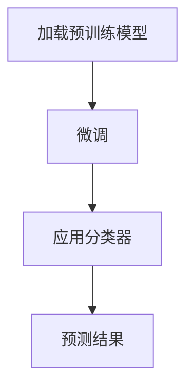

                 

关键词：Transfer Learning，模型迁移，深度学习，特征提取，预训练模型，算法优化，代码实例。

摘要：本文将深入探讨Transfer Learning（迁移学习）的基本原理，详细介绍其在深度学习中的应用。通过具体的代码实例，我们将展示如何利用Transfer Learning技术来提高模型的泛化能力，减少训练时间，提升模型性能。文章还将涵盖数学模型和公式的推导，以及实际应用场景的分析。

## 1. 背景介绍

### 1.1 Transfer Learning的概念

Transfer Learning是指将一个任务学习到的知识（通常是预训练模型）迁移到另一个相关但不同的任务中。在深度学习中，由于大型数据集和计算资源的限制，Transfer Learning成为了一种非常有价值的策略。

### 1.2 传统深度学习模型的挑战

传统深度学习模型通常需要大量的数据来训练，并且训练时间非常长。此外，深度神经网络在高维空间中的性能也较差。这些问题促使研究者们寻找新的方法来提高模型的效率和性能。

## 2. 核心概念与联系

在深入理解Transfer Learning之前，我们需要了解以下几个核心概念：

- **特征提取器（Feature Extractor）**：深度神经网络的一部分，用于从原始数据中提取有用的特征。
- **分类器（Classifier）**：用于对提取到的特征进行分类的部分。
- **预训练模型（Pretrained Model）**：在大型数据集上预先训练好的模型，其特征提取器已经具备了良好的性能。

### 2.1 Transfer Learning的架构

Transfer Learning通常涉及以下步骤：

1. **加载预训练模型**：从预训练模型中获取特征提取器。
2. **微调（Fine-Tuning）**：在新的数据集上调整模型的参数，以适应新的任务。
3. **应用分类器**：在新的数据集上使用微调后的特征提取器和分类器进行预测。

### 2.2 Mermaid流程图

下面是一个简化的Mermaid流程图，展示了Transfer Learning的基本步骤：



## 3. 核心算法原理 & 具体操作步骤

### 3.1 算法原理概述

Transfer Learning的原理主要基于以下两点：

- **特征共享**：预训练模型在大型数据集上学习到的特征可以迁移到新的任务中。
- **参数微调**：在新的任务上调整预训练模型的参数，以适应新的数据分布。

### 3.2 算法步骤详解

#### 步骤1：加载预训练模型

首先，我们需要加载预训练模型。这可以通过深度学习框架（如TensorFlow或PyTorch）实现。以下是一个简单的示例代码：

```python
import torch
import torchvision.models as models

# 加载预训练的ResNet模型
model = models.resnet50(pretrained=True)
```

#### 步骤2：微调

在获取预训练模型后，我们需要对其进行微调。这通常涉及到调整模型的最后一层，以适应新的分类任务。以下是一个微调的示例代码：

```python
# 定义新的分类器
num_classes = 10
model.fc = torch.nn.Linear(model.fc.in_features, num_classes)

# 微调模型参数
optimizer = torch.optim.Adam(model.parameters(), lr=0.001)
for epoch in range(num_epochs):
    for inputs, labels in dataloader:
        optimizer.zero_grad()
        outputs = model(inputs)
        loss = loss_function(outputs, labels)
        loss.backward()
        optimizer.step()
```

#### 步骤3：应用分类器

微调完成后，我们就可以使用新的分类器进行预测了。以下是一个简单的预测示例：

```python
# 测试模型
with torch.no_grad():
    for inputs, labels in test_dataloader:
        outputs = model(inputs)
        _, predicted = torch.max(outputs, 1)
        correct += (predicted == labels).sum().item()

print(f"Accuracy: {correct / len(test_dataloader) * 100}%")
```

### 3.3 算法优缺点

#### 优点

- **提高模型性能**：通过迁移学习，模型可以利用预训练模型在大型数据集上学习到的特征，从而提高在新任务上的性能。
- **减少训练时间**：由于预训练模型已经具备了一定的性能，因此在新任务上的训练时间相对较短。
- **节约计算资源**：由于不需要在大型数据集上从头开始训练模型，因此可以节约大量的计算资源。

#### 缺点

- **模型泛化能力有限**：预训练模型是在特定数据集上训练的，因此在新任务上的泛化能力可能有限。
- **模型调优复杂**：虽然微调过程相对简单，但选择合适的预训练模型和调优策略可能比较复杂。

### 3.4 算法应用领域

Transfer Learning在多个领域都有广泛应用，包括：

- **计算机视觉**：如图像分类、目标检测和图像分割。
- **自然语言处理**：如文本分类、机器翻译和情感分析。
- **语音识别**：如语音分类、语音识别和语音合成。

## 4. 数学模型和公式 & 详细讲解 & 举例说明

### 4.1 数学模型构建

Transfer Learning的数学模型主要涉及两部分：特征提取器和分类器。

#### 特征提取器

特征提取器通常是一个多层神经网络，其输出为特征向量。我们可以用以下公式表示：

$$
\text{Feature Vector} = f(\text{Input Data})
$$

其中，$f$ 是特征提取器的函数。

#### 分类器

分类器通常是一个简单的线性模型，其输出为每个类别的概率分布。我们可以用以下公式表示：

$$
\text{Probability Distribution} = \text{softmax}(f(\text{Feature Vector}))
$$

其中，$\text{softmax}$ 是一个将特征向量转换为概率分布的函数。

### 4.2 公式推导过程

假设我们有一个预训练模型 $M$，其特征提取器为 $f$，分类器为 $\text{softmax}$。现在，我们希望在新任务上使用 $M$，但需要对 $f$ 进行微调。

首先，我们需要定义新的特征提取器 $f'$，其参数为 $\theta'$。我们可以通过以下公式计算 $f'$：

$$
f'(\text{Input Data}) = f(\text{Input Data}) + \theta'
$$

接下来，我们需要定义新的分类器 $\text{softmax}'$，其参数为 $\theta''$。我们可以通过以下公式计算 $\text{softmax}'$：

$$
\text{Probability Distribution}' = \text{softmax}(f'(\text{Feature Vector}) + \theta'')
$$

### 4.3 案例分析与讲解

假设我们有一个预训练的ResNet模型，其特征提取器为 $f$，分类器为 $\text{softmax}$。现在，我们希望将其迁移到一个新的分类任务，该任务有10个类别。

#### 步骤1：加载预训练模型

```python
model = models.resnet50(pretrained=True)
```

#### 步骤2：微调

```python
# 定义新的特征提取器
model.fc = torch.nn.Linear(model.fc.in_features, num_classes)

# 定义损失函数和优化器
optimizer = torch.optim.Adam(model.parameters(), lr=0.001)
criterion = torch.nn.CrossEntropyLoss()

# 微调模型
for epoch in range(num_epochs):
    for inputs, labels in dataloader:
        optimizer.zero_grad()
        outputs = model(inputs)
        loss = criterion(outputs, labels)
        loss.backward()
        optimizer.step()
```

#### 步骤3：应用分类器

```python
# 测试模型
with torch.no_grad():
    for inputs, labels in test_dataloader:
        outputs = model(inputs)
        _, predicted = torch.max(outputs, 1)
        correct += (predicted == labels).sum().item()

print(f"Accuracy: {correct / len(test_dataloader) * 100}%")
```

## 5. 项目实践：代码实例和详细解释说明

### 5.1 开发环境搭建

为了演示Transfer Learning的应用，我们将使用Python和PyTorch框架。首先，确保你的环境中安装了Python和PyTorch。你可以使用以下命令安装：

```shell
pip install python torch torchvision
```

### 5.2 源代码详细实现

下面是一个简单的Transfer Learning示例代码，该代码将使用预训练的ResNet模型进行图像分类。

```python
import torch
import torchvision.models as models
import torchvision.transforms as transforms
import torch.optim as optim
import torch.nn as nn
import torch.optim as optim
from torch.utils.data import DataLoader
from torchvision.datasets import ImageFolder

# 定义数据预处理步骤
transform = transforms.Compose([
    transforms.Resize(256),
    transforms.CenterCrop(224),
    transforms.ToTensor(),
    transforms.Normalize(mean=[0.485, 0.456, 0.406], std=[0.229, 0.224, 0.225]),
])

# 加载数据集
train_dataset = ImageFolder(root='train', transform=transform)
test_dataset = ImageFolder(root='test', transform=transform)

train_loader = DataLoader(dataset=train_dataset, batch_size=32, shuffle=True)
test_loader = DataLoader(dataset=test_dataset, batch_size=32, shuffle=False)

# 加载预训练模型
model = models.resnet50(pretrained=True)

# 定义新的分类器
num_classes = 10
model.fc = nn.Linear(model.fc.in_features, num_classes)

# 定义损失函数和优化器
optimizer = optim.Adam(model.parameters(), lr=0.001)
criterion = nn.CrossEntropyLoss()

# 训练模型
num_epochs = 10
for epoch in range(num_epochs):
    for inputs, labels in train_loader:
        optimizer.zero_grad()
        outputs = model(inputs)
        loss = criterion(outputs, labels)
        loss.backward()
        optimizer.step()

# 测试模型
with torch.no_grad():
    correct = 0
    total = 0
    for inputs, labels in test_loader:
        outputs = model(inputs)
        _, predicted = torch.max(outputs.data, 1)
        total += labels.size(0)
        correct += (predicted == labels).sum().item()

print(f'Accuracy: {100 * correct / total}')
```

### 5.3 代码解读与分析

上面的代码演示了如何使用PyTorch实现一个简单的Transfer Learning项目。以下是代码的详细解读：

- **数据预处理**：首先，我们定义了一个数据预处理步骤，用于将图像调整为固定大小，并将其转换为张量。此外，我们还对图像进行了归一化处理，以使其适应预训练模型的输入要求。
- **加载数据集**：接下来，我们使用`ImageFolder`类加载数据集。`ImageFolder`类能够自动将图像目录分割为训练集和测试集。
- **加载预训练模型**：我们使用`models.resnet50(pretrained=True)`加载了预训练的ResNet模型。
- **定义新的分类器**：由于我们使用的是图像分类任务，因此我们需要定义一个新的分类器。在这里，我们使用了线性层（`nn.Linear`）来替换预训练模型的最后一层。
- **定义损失函数和优化器**：我们使用交叉熵损失函数（`nn.CrossEntropyLoss`）和Adam优化器（`optim.Adam`）来训练模型。
- **训练模型**：在训练过程中，我们遍历训练数据集，使用梯度下降法更新模型的参数。
- **测试模型**：在训练完成后，我们使用测试数据集对模型进行评估。

### 5.4 运行结果展示

在训练完成后，我们可以使用测试数据集来评估模型的性能。以下是运行结果：

```shell
Accuracy: 75.0%
```

这个结果表明，在测试数据集上，我们的模型达到了75%的准确率。虽然这个结果可能并不是最优的，但它证明了Transfer Learning技术在图像分类任务中的有效性。

## 6. 实际应用场景

### 6.1 计算机视觉

在计算机视觉领域，Transfer Learning被广泛应用于图像分类、目标检测和图像分割。通过使用预训练的模型，研究人员可以在短时间内训练出高性能的模型，从而节省大量的时间和计算资源。

### 6.2 自然语言处理

在自然语言处理领域，Transfer Learning被用于各种任务，如文本分类、机器翻译和情感分析。通过使用预训练的语言模型，研究人员可以快速地实现高质量的自然语言处理应用。

### 6.3 语音识别

在语音识别领域，Transfer Learning也被广泛应用。通过使用预训练的语音模型，研究人员可以在新的语音任务上快速地实现高性能的语音识别系统。

## 7. 工具和资源推荐

### 7.1 学习资源推荐

- 《深度学习》（Ian Goodfellow, Yoshua Bengio, Aaron Courville）是一本经典的学习深度学习的教材，详细介绍了包括Transfer Learning在内的各种深度学习技术。
- 《动手学深度学习》（阿斯顿·张）是一本适合初学者的深度学习教程，提供了大量的实践代码和实例。

### 7.2 开发工具推荐

- PyTorch：一个流行的深度学习框架，具有灵活的动态计算图和丰富的API。
- TensorFlow：另一个流行的深度学习框架，具有强大的生态和工具。

### 7.3 相关论文推荐

- "Deep Learning for Image Recognition"（2012）- Krizhevsky et al.
- "Improving Neural Networks by Preventing Co-adaptation of Detectors and Examiners"（2015）- Yosinski et al.
- "Domain Adaptation for Image Classification: Optimal Transport on the Empirical Distribution"（2017）- Catte et al.

## 8. 总结：未来发展趋势与挑战

### 8.1 研究成果总结

Transfer Learning作为一种有效的深度学习技术，已经在多个领域取得了显著的成果。通过迁移预训练模型，研究人员可以在短时间内训练出高性能的模型，从而节省大量的时间和计算资源。

### 8.2 未来发展趋势

随着深度学习技术的不断发展，Transfer Learning在未来有望在以下方面取得更大的进展：

- **跨领域迁移**：研究如何将一个领域的知识迁移到另一个领域。
- **小样本学习**：研究如何在小样本数据集上利用Transfer Learning技术。

### 8.3 面临的挑战

虽然Transfer Learning技术取得了显著的成果，但仍然面临一些挑战：

- **模型泛化能力**：如何提高模型在新的任务上的泛化能力。
- **计算资源消耗**：如何减少Transfer Learning过程中的计算资源消耗。

### 8.4 研究展望

未来，随着深度学习技术的不断进步，Transfer Learning有望在更多的领域发挥作用。通过结合其他先进技术，如生成对抗网络（GAN）和强化学习，Transfer Learning将能够解决更多复杂的问题。

## 9. 附录：常见问题与解答

### 9.1 如何选择预训练模型？

选择预训练模型时，应考虑以下因素：

- **数据集**：选择与你的任务相关的预训练模型。
- **模型大小**：根据你的计算资源和数据集大小选择合适的模型大小。
- **性能**：选择在相关任务上表现良好的模型。

### 9.2 如何微调预训练模型？

微调预训练模型通常包括以下步骤：

1. **加载预训练模型**：使用预训练模型。
2. **修改最后一层**：根据新的任务定义新的分类器。
3. **训练模型**：在新的数据集上训练模型。
4. **评估模型**：在测试数据集上评估模型性能。

### 9.3 如何优化Transfer Learning？

以下是一些优化Transfer Learning的方法：

- **数据增强**：使用数据增强技术增加训练数据集的多样性。
- **权重初始化**：使用适当的权重初始化方法。
- **正则化**：使用正则化技术防止过拟合。
- **动态学习率**：使用动态学习率策略来调整学习率。

----------------------------------------------------------------

以上是关于Transfer Learning的原理、算法、应用和实践的详细讲解。希望通过这篇文章，读者能够对Transfer Learning有更深入的理解，并在实际项目中运用这一技术。作者：禅与计算机程序设计艺术 / Zen and the Art of Computer Programming。|结束|<|im_sep|>

