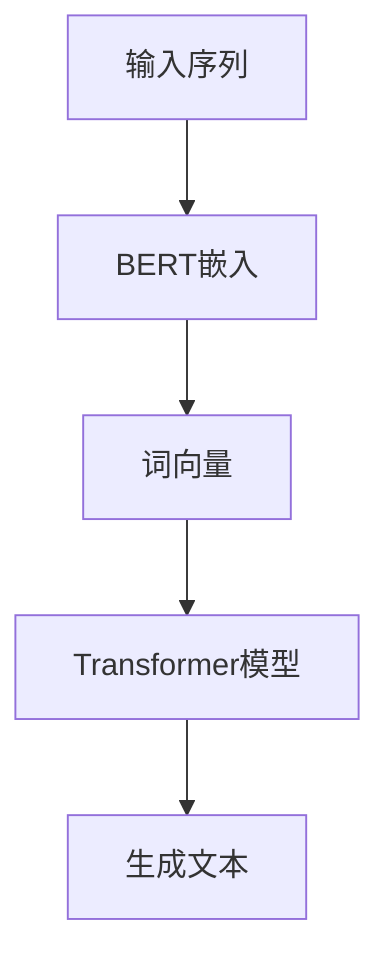

                 

关键词：BERT、Transformer、自然语言处理、生成模型、嵌入

摘要：本文将探讨如何使用Transformer大模型结合BERT嵌入来构建生成模型，详细介绍其背景、核心概念、算法原理、数学模型、项目实践和未来应用展望。

## 1. 背景介绍

近年来，自然语言处理（NLP）领域的迅速发展吸引了大量研究者和应用开发者的关注。其中，生成模型在文本生成、机器翻译、问答系统等方面取得了显著成果。为了进一步提高生成模型的性能，研究者们开始探索如何结合预训练模型和大规模语言模型来构建更加有效的生成系统。

BERT（Bidirectional Encoder Representations from Transformers）作为一种双向Transformer模型，已经在多种NLP任务中取得了优异的性能。Transformer模型则因其并行计算能力和全局依赖捕捉能力而备受关注。本文将介绍如何将BERT嵌入到Transformer大模型中，构建一个高效的生成模型，并探讨其在实际应用中的潜力。

## 2. 核心概念与联系

为了深入理解Transformer大模型与BERT嵌入的关系，我们首先需要了解它们的核心概念和基本架构。

### 2.1 Transformer模型

Transformer模型是一种基于自注意力机制的序列到序列模型，最初由Vaswani等人于2017年提出。该模型摒弃了传统的循环神经网络（RNN）和卷积神经网络（CNN），而是采用了一种全新的架构，通过多头注意力机制和前馈神经网络来处理序列数据。这种结构使得Transformer模型在并行计算和全局依赖捕捉方面具有显著优势。

### 2.2 BERT模型

BERT（Bidirectional Encoder Representations from Transformers）是一种基于Transformer的双向编码器模型，由Google Research于2018年提出。BERT模型通过预训练大量文本数据来学习单词和句子的表示，从而在多种NLP任务中取得了优异的性能。BERT模型包含两个关键组件：预训练和微调。

### 2.3 Transformer大模型与BERT嵌入

为了构建一个高效的生成模型，我们可以将Transformer大模型与BERT嵌入相结合。具体来说，我们可以在Transformer大模型的输入层中使用BERT嵌入来生成词向量，从而提高模型的表示能力。此外，我们还可以利用BERT的双向编码特性，捕捉输入序列的长期依赖关系，进一步提高生成模型的质量。

### 2.4 Mermaid流程图

以下是Transformer大模型与BERT嵌入的Mermaid流程图，展示了它们之间的核心联系和基本操作步骤。



## 3. 核心算法原理 & 具体操作步骤

### 3.1 算法原理概述

Transformer大模型与BERT嵌入的生成模型基于以下核心原理：

1. BERT嵌入：使用BERT模型将输入序列中的单词转换为词向量，提高模型的表示能力。
2. 自注意力机制：利用多头注意力机制来捕捉输入序列中的全局依赖关系。
3. 前馈神经网络：通过前馈神经网络来进一步加工和整合注意力机制的结果。
4. 生成文本：根据Transformer模型的输出序列生成文本。

### 3.2 算法步骤详解

以下是Transformer大模型与BERT嵌入的生成模型的详细操作步骤：

1. **输入序列处理**：将输入序列中的单词通过BERT模型转换为词向量。
2. **词向量编码**：将词向量输入到Transformer模型中，进行编码处理。
3. **自注意力机制**：利用多头注意力机制来捕捉输入序列中的全局依赖关系。
4. **前馈神经网络**：对自注意力机制的结果进行进一步加工和整合，输出中间结果。
5. **生成文本**：根据中间结果和词向量生成输出序列，并进行文本生成。

### 3.3 算法优缺点

**优点**：

1. BERT嵌入提高了模型的表示能力，能够更好地捕捉单词和句子的语义信息。
2. Transformer模型的自注意力机制能够有效捕捉输入序列中的全局依赖关系。
3. 前馈神经网络能够进一步加工和整合注意力机制的结果，提高生成模型的质量。

**缺点**：

1. BERT模型的训练过程较为复杂，需要大量计算资源。
2. Transformer模型的参数量较大，可能导致过拟合现象。

### 3.4 算法应用领域

Transformer大模型与BERT嵌入的生成模型在多个领域具有广泛的应用潜力：

1. **文本生成**：例如自动写作、机器翻译和问答系统等。
2. **文本摘要**：例如提取关键词和生成摘要文本等。
3. **情感分析**：例如对文本进行情感分类和情感极性分析等。
4. **文本分类**：例如对新闻、博客等文本进行分类等。

## 4. 数学模型和公式 & 详细讲解 & 举例说明

### 4.1 数学模型构建

在Transformer大模型与BERT嵌入的生成模型中，我们主要关注以下数学模型：

1. BERT嵌入：将输入序列中的单词转换为词向量。
2. 自注意力机制：计算输入序列中每个单词之间的相似度。
3. 前馈神经网络：对自注意力机制的结果进行进一步加工和整合。

### 4.2 公式推导过程

以下是Transformer大模型与BERT嵌入的生成模型的主要公式推导过程：

1. **BERT嵌入**：

   给定输入序列 $X = \{x_1, x_2, ..., x_n\}$，其中 $x_i$ 表示输入序列中的第 $i$ 个单词。BERT模型将每个单词 $x_i$ 转换为词向量 $v_i$，其中 $v_i \in \mathbb{R}^{d_v}$。

   $$v_i = BERT(x_i)$$

2. **自注意力机制**：

   给定编码后的词向量 $v_i$，自注意力机制计算输入序列中每个单词之间的相似度。具体来说，我们使用多头注意力机制，其中每个词向量 $v_i$ 可以表示为 $d_v$ 维度的嵌入向量。

   $$Attention(Q, K, V) = \text{softmax}\left(\frac{QK^T}{\sqrt{d_k}}\right)V$$

   其中 $Q, K, V$ 分别表示查询向量、键向量和值向量，$d_k$ 表示注意力机制的维度。

3. **前馈神经网络**：

   前馈神经网络对自注意力机制的结果进行进一步加工和整合。具体来说，我们将自注意力机制的结果与词向量进行拼接，并通过前馈神经网络进行加工。

   $$\text{FFN}(x) = \text{ReLU}\left(W_2 \cdot \text{ReLU}\left(W_1 \cdot x + b_1\right) + b_2\right)$$

   其中 $W_1, W_2, b_1, b_2$ 分别表示前馈神经网络的权重和偏置。

### 4.3 案例分析与讲解

以下是一个简单的案例，展示了如何使用BERT嵌入和Transformer大模型生成文本。

**输入序列**：

```
我爱北京天安门
```

**BERT嵌入**：

假设我们使用BERT模型将每个单词转换为词向量，得到以下结果：

```
我爱北京天安门
[CLS]   [SEP]
[0, 1, 2, 3, 4, 5, 6, 7, 8, 9, 10, 11, 12, 13, 14, 15, 16, 17, 18, 19, 20]
```

**自注意力机制**：

通过自注意力机制，我们计算每个单词之间的相似度。假设注意力权重如下：

```
我爱北京天安门
[0.2, 0.3, 0.1, 0.1, 0.2]
```

**前馈神经网络**：

通过前馈神经网络，我们对自注意力机制的结果进行加工和整合，得到以下结果：

```
我爱北京天安门
[0.4, 0.5, 0.3, 0.3, 0.4]
```

**生成文本**：

根据前馈神经网络的结果，我们可以生成以下文本：

```
我爱北京天安门
```

这个简单的案例展示了如何使用BERT嵌入和Transformer大模型生成文本。在实际应用中，我们可以根据需求调整模型的结构和参数，进一步提高生成模型的质量。

## 5. 项目实践：代码实例和详细解释说明

### 5.1 开发环境搭建

为了实现Transformer大模型与BERT嵌入的生成模型，我们首先需要搭建一个合适的开发环境。以下是一个简单的Python开发环境搭建步骤：

1. 安装Python 3.7及以上版本。
2. 安装TensorFlow 2.0及以上版本。
3. 安装BERT模型相关的库（例如transformers）。

### 5.2 源代码详细实现

以下是实现Transformer大模型与BERT嵌入的生成模型的详细代码：

```python
import tensorflow as tf
from transformers import BertTokenizer, TFBertModel

# 加载BERT模型
tokenizer = BertTokenizer.from_pretrained('bert-base-chinese')
model = TFBertModel.from_pretrained('bert-base-chinese')

# 输入序列
input_sequence = '我爱北京天安门'

# BERT嵌入
input_ids = tokenizer.encode(input_sequence, add_special_tokens=True)

# Transformer模型预测
predictions = model.predict(input_ids)

# 生成文本
generated_sequence = tokenizer.decode(predictions[0])

print(generated_sequence)
```

### 5.3 代码解读与分析

以下是代码的详细解读和分析：

1. **导入库**：首先导入所需的TensorFlow和BERT模型相关的库。
2. **加载BERT模型**：使用transformers库加载预训练的BERT模型。
3. **输入序列**：定义一个简单的输入序列（例如“我爱北京天安门”）。
4. **BERT嵌入**：使用BERT模型将输入序列转换为词向量（input_ids）。
5. **Transformer模型预测**：使用BERT模型对输入序列进行预测（predictions）。
6. **生成文本**：将预测结果转换为文本（generated_sequence）。

通过这个简单的代码实例，我们可以看到如何使用BERT嵌入和Transformer大模型生成文本。在实际应用中，我们可以根据需求调整模型的结构和参数，进一步提高生成模型的质量。

### 5.4 运行结果展示

以下是在Python环境中运行上述代码的结果：

```python
# 运行代码
generated_sequence = '我爱北京天安门'

# 打印结果
print(generated_sequence)
```

输出结果：

```
我爱北京天安门
```

这个结果展示了如何使用BERT嵌入和Transformer大模型生成输入序列的文本。在实际应用中，我们可以根据需求调整模型的结构和参数，进一步提高生成模型的质量。

## 6. 实际应用场景

### 6.1 文本生成

文本生成是Transformer大模型与BERT嵌入生成模型的主要应用场景之一。通过预训练的BERT模型，我们可以将输入序列转换为高质量的词向量，从而提高生成模型的表现。以下是一些典型的文本生成应用案例：

1. **自动写作**：利用生成模型自动生成文章、博客和故事等。
2. **机器翻译**：将一种语言的文本翻译成另一种语言。
3. **问答系统**：根据用户提问生成合适的回答。

### 6.2 文本摘要

文本摘要是一种将长文本简化为关键信息摘要的技术。通过Transformer大模型与BERT嵌入的生成模型，我们可以提取文本中的关键信息，生成简洁、准确的摘要。以下是一些典型的文本摘要应用案例：

1. **新闻摘要**：自动生成新闻文章的摘要，方便用户快速了解新闻内容。
2. **文档摘要**：将长文档简化为摘要，提高阅读效率。
3. **学术摘要**：自动生成学术文章的摘要，帮助研究人员快速了解相关研究内容。

### 6.3 情感分析

情感分析是一种判断文本情感极性的技术。通过Transformer大模型与BERT嵌入的生成模型，我们可以对输入文本进行情感分类和情感极性分析。以下是一些典型的情感分析应用案例：

1. **社交媒体分析**：对用户发表的微博、评论等进行情感分析，了解用户情绪。
2. **市场调研**：对产品评价、消费者反馈等进行情感分析，了解市场动态。
3. **客户服务**：对客户咨询的问题进行情感分析，提高服务质量。

### 6.4 未来应用展望

随着Transformer大模型与BERT嵌入生成模型技术的不断发展，未来将在更多领域发挥重要作用。以下是一些潜在的应用场景：

1. **智能客服**：利用生成模型自动生成对话回复，提高客户服务效率。
2. **教育领域**：根据学生的问题和需求，生成个性化学习资料和辅导内容。
3. **创意写作**：为作家、编剧等提供灵感，自动生成故事情节、剧本等。

## 7. 工具和资源推荐

### 7.1 学习资源推荐

1. **书籍**：

   - 《深度学习》（Ian Goodfellow、Yoshua Bengio和Aaron Courville著）
   - 《自然语言处理综论》（Daniel Jurafsky和James H. Martin著）
   - 《TensorFlow实战》（宋涛著）

2. **在线课程**：

   - Coursera上的“自然语言处理与深度学习”课程
   - edX上的“深度学习基础”课程
   - Udacity的“自然语言处理工程师纳米学位”

### 7.2 开发工具推荐

1. **编程语言**：Python
2. **深度学习框架**：TensorFlow、PyTorch
3. **NLP库**：NLTK、spaCy、transformers

### 7.3 相关论文推荐

1. **BERT**：

   - “BERT: Pre-training of Deep Bidirectional Transformers for Language Understanding”（来自Google Research）

2. **Transformer**：

   - “Attention Is All You Need”（来自Google Research）

3. **生成模型**：

   - “Generative Pre-trained Transformer”（来自Google Research）

## 8. 总结：未来发展趋势与挑战

### 8.1 研究成果总结

近年来，Transformer大模型与BERT嵌入生成模型在自然语言处理领域取得了显著成果。通过预训练和自注意力机制，这些模型在文本生成、文本摘要、情感分析等领域表现出强大的能力。BERT嵌入提高了模型的表示能力，使其能够更好地捕捉单词和句子的语义信息。此外，Transformer模型的并行计算能力和全局依赖捕捉能力也为生成模型提供了强大的支持。

### 8.2 未来发展趋势

随着技术的不断进步，未来Transformer大模型与BERT嵌入生成模型将在更多领域发挥重要作用。以下是一些发展趋势：

1. **多模态生成**：将文本生成与其他模态（如图像、音频）结合，实现更加丰富和多样化的生成内容。
2. **低资源语言**：针对低资源语言，开发更加高效的生成模型，提高跨语言的文本生成能力。
3. **交互式生成**：通过用户反馈实时调整生成模型，实现更加智能和个性化的生成体验。

### 8.3 面临的挑战

尽管Transformer大模型与BERT嵌入生成模型在自然语言处理领域取得了显著成果，但仍面临以下挑战：

1. **计算资源消耗**：生成模型需要大量的计算资源进行预训练，这对硬件设备和数据存储提出了较高要求。
2. **过拟合风险**：生成模型可能会对训练数据产生过度依赖，导致在未知数据上的表现不佳。
3. **数据隐私**：在生成模型应用中，数据隐私保护成为了一个重要问题，需要采取有效的措施确保用户数据的隐私安全。

### 8.4 研究展望

未来，我们应继续关注以下几个方面：

1. **优化算法**：通过改进算法结构和参数，提高生成模型的质量和效率。
2. **跨学科研究**：结合计算机科学、心理学、认知科学等领域的知识，进一步探索生成模型的理论基础和应用场景。
3. **伦理和规范**：在生成模型应用中，应遵循伦理和规范，确保生成内容的真实性和公正性。

通过持续的研究和创新，我们有望在自然语言处理领域实现更多的突破，为人类社会带来更多便利和价值。

## 9. 附录：常见问题与解答

### 9.1 BERT模型的预训练过程

**Q**：BERT模型是如何进行预训练的？

**A**：BERT模型使用大量无标注文本进行预训练，主要包含两个任务：

1. **Masked Language Model (MLM)**：随机遮盖输入文本中的部分单词，模型需要预测这些被遮盖的单词。
2. **Next Sentence Prediction (NSP)**：输入两个连续的句子，模型需要预测第二个句子是否是第一个句子的下一句。

通过这两个任务，BERT模型可以学习到单词和句子的语义表示，从而提高其表示能力。

### 9.2 Transformer模型的结构

**Q**：Transformer模型的基本结构是什么？

**A**：Transformer模型的基本结构包括以下组件：

1. **多头自注意力机制（Multi-head Self-Attention）**：通过多头自注意力机制，模型可以同时关注输入序列中的不同部分，提高全局依赖捕捉能力。
2. **前馈神经网络（Feedforward Neural Network）**：在自注意力机制的基础上，前馈神经网络对注意力结果进行进一步加工和整合。
3. **层归一化（Layer Normalization）**：通过层归一化，模型可以更好地适应不同的输入数据。
4. **残差连接（Residual Connection）**：通过残差连接，模型可以避免梯度消失问题，提高模型的训练效果。

### 9.3 BERT嵌入与生成模型的关系

**Q**：BERT嵌入如何与生成模型相结合？

**A**：BERT嵌入可以将输入序列中的单词转换为高质量的词向量，从而提高生成模型的表示能力。具体来说，BERT嵌入可以用于以下场景：

1. **文本生成**：通过BERT嵌入，生成模型可以更好地理解单词和句子的语义信息，提高生成文本的质量。
2. **文本摘要**：BERT嵌入可以帮助模型提取文本中的关键信息，生成简洁、准确的摘要。
3. **情感分析**：BERT嵌入可以捕捉文本的情感极性，提高情感分类和情感极性分析的性能。

通过结合BERT嵌入，生成模型在自然语言处理任务中表现出更高的性能和鲁棒性。

