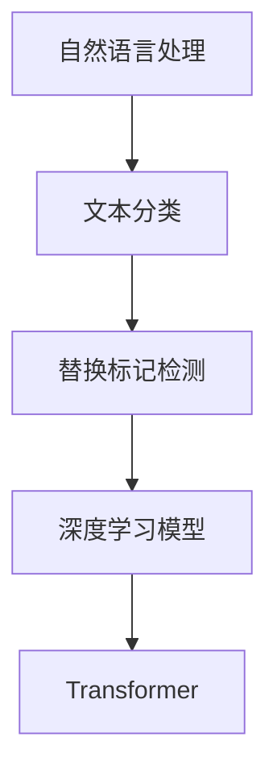

                 

关键词：Transformer，大模型，替换标记检测，自然语言处理，深度学习

摘要：本文将深入探讨Transformer大模型在替换标记检测任务中的应用，从背景介绍、核心概念与联系、核心算法原理、数学模型和公式、项目实践、实际应用场景以及未来发展趋势等方面进行详细阐述，旨在为读者提供全面的技术指南。

## 1. 背景介绍

随着自然语言处理（NLP）技术的不断发展，深度学习模型在NLP任务中取得了显著的成果。尤其是Transformer模型，自其提出以来，迅速成为NLP领域的热门研究主题。Transformer模型基于自注意力机制，相比于传统的循环神经网络（RNN）和卷积神经网络（CNN），在处理长文本序列方面具有明显的优势。

替换标记检测作为一种典型的文本分类任务，旨在识别文本中具有特定意义的标记。例如，在机器阅读理解任务中，需要识别出文本中的问题标记；在文本摘要任务中，需要识别出文本中的重要标记。传统的替换标记检测方法通常依赖于规则匹配或简单的特征提取，而深度学习模型的引入，使得替换标记检测任务取得了显著的效果提升。

本文将围绕Transformer大模型在替换标记检测任务中的应用，介绍其核心原理、数学模型、项目实践以及未来发展趋势。

## 2. 核心概念与联系

在介绍Transformer大模型之前，我们需要了解一些核心概念。以下是一个用Mermaid流程图表示的概念流程：



### 2.1 自然语言处理

自然语言处理（NLP）是计算机科学和人工智能领域的一个重要分支，旨在使计算机能够理解、解释和生成人类语言。NLP涵盖了语音识别、机器翻译、情感分析、文本分类等多个任务。

### 2.2 文本分类

文本分类是NLP中的一个基础任务，其目标是将文本数据按照预定的类别进行划分。文本分类在信息检索、文本挖掘、舆情分析等领域具有重要的应用价值。

### 2.3 替换标记检测

替换标记检测是一种特殊的文本分类任务，其主要目标是识别文本中的特定标记，并将其替换为相应的值。例如，在机器阅读理解任务中，需要识别出文本中的问题标记，并将其替换为问题的答案。

### 2.4 深度学习模型

深度学习模型是一类基于人工神经网络的机器学习模型，其通过多层的非线性变换来提取数据特征，从而实现复杂函数的近似。深度学习在图像识别、语音识别、自然语言处理等领域取得了显著的成果。

### 2.5 Transformer

Transformer模型是一种基于自注意力机制的深度学习模型，其于2017年由Vaswani等人提出。Transformer模型在处理长文本序列方面具有明显的优势，已在NLP领域的多个任务中取得了优异的性能。

## 3. 核心算法原理 & 具体操作步骤

### 3.1 算法原理概述

Transformer模型的核心思想是使用自注意力机制（Self-Attention）来对输入序列进行处理。自注意力机制允许模型在处理一个词时，根据其他词的重要程度来分配注意力权重，从而实现序列间的关联。

Transformer模型主要由编码器（Encoder）和解码器（Decoder）两部分组成。编码器负责将输入序列编码为固定长度的向量；解码器则利用编码器生成的向量生成输出序列。

### 3.2 算法步骤详解

#### 3.2.1 编码器（Encoder）

1. 输入序列：给定一个输入序列 \[w_1, w_2, ..., w_n\]，首先将其转换为嵌入向量 \[e_1, e_2, ..., e_n\]。
2. 前馈网络：对每个嵌入向量 \(e_i\) 进行两次前馈神经网络（Feedforward Neural Network）处理。
3. 偏置向量：在每个前馈网络中加入偏置向量，以防止网络参数为0。
4. 自注意力机制：对每个嵌入向量 \(e_i\) 计算自注意力权重 \(a_i\)，并生成加权嵌入向量 \(s_i = \sum_j a_{ij} e_j\)。
5. 残差连接和层归一化：将加权嵌入向量 \(s_i\) 与原始嵌入向量 \(e_i\) 进行残差连接，并使用层归一化（Layer Normalization）对结果进行归一化。

#### 3.2.2 解码器（Decoder）

1. 输入序列：给定一个输入序列 \[w_1, w_2, ..., w_n\]，首先将其转换为嵌入向量 \[e_1, e_2, ..., e_n\]。
2. 前馈网络：对每个嵌入向量 \(e_i\) 进行两次前馈神经网络（Feedforward Neural Network）处理。
3. 偏置向量：在每个前馈网络中加入偏置向量，以防止网络参数为0。
4. 自注意力机制：对每个嵌入向量 \(e_i\) 计算自注意力权重 \(a_i\)，并生成加权嵌入向量 \(s_i = \sum_j a_{ij} e_j\)。
5. 交叉注意力机制：对解码器的每个嵌入向量 \(e_i\) 与编码器的输出向量进行交叉注意力计算，生成加权嵌入向量 \(t_i = \sum_j a_{ij} e_j\)。
6. 残差连接和层归一化：将加权嵌入向量 \(t_i\) 与原始嵌入向量 \(e_i\) 进行残差连接，并使用层归一化（Layer Normalization）对结果进行归一化。
7. 输出层：使用全连接层（Fully Connected Layer）对解码器输出进行分类预测。

### 3.3 算法优缺点

#### 优点：

1. 处理长文本序列能力强：自注意力机制使得模型能够自动捕捉序列中的长距离依赖关系。
2. 参数共享：自注意力机制中的权重共享，减少了模型参数数量，降低了过拟合风险。
3. 适用于并行计算：Transformer模型基于注意力机制，可以在不同时间步之间进行并行计算，提高了计算效率。

#### 缺点：

1. 计算复杂度高：自注意力机制的计算复杂度为 \(O(n^2)\)，在处理长文本序列时，计算时间较长。
2. 对噪声敏感：自注意力机制容易受到噪声的影响，可能导致模型性能下降。

### 3.4 算法应用领域

Transformer模型在NLP领域具有广泛的应用，包括但不限于：

1. 机器翻译：如Google Translate等。
2. 文本摘要：如extractive和abstractive文本摘要。
3. 机器阅读理解：如SQuAD等。
4. 问答系统：如Microsoft QnA Maker等。
5. 命名实体识别：如NER（Named Entity Recognition）等。

## 4. 数学模型和公式 & 详细讲解 & 举例说明

### 4.1 数学模型构建

Transformer模型的核心是自注意力机制（Self-Attention）。以下是一个简单的自注意力机制的数学模型：

$$
\text{Attention}(Q, K, V) = \text{softmax}\left(\frac{QK^T}{\sqrt{d_k}}\right)V
$$

其中，\(Q, K, V\) 分别表示查询（Query）、键（Key）和值（Value）向量，\(d_k\) 表示键向量的维度。自注意力机制的目的是对输入序列中的每个元素计算注意力权重，并根据权重生成加权向量。

### 4.2 公式推导过程

为了推导自注意力机制的公式，我们首先需要了解点积注意力（Dot-Product Attention）。

$$
\text{Attention}(Q, K, V) = \text{softmax}\left(\frac{QK^T}{\sqrt{d_k}}\right)V
$$

其中，\(\text{softmax}\) 函数用于将点积结果转换为概率分布。

接下来，我们定义自注意力机制为：

$$
\text{Self-Attention}(Q, K, V) = \text{Attention}(Q, K, V)
$$

其中，\(Q, K, V\) 均为输入序列的嵌入向量。

为了推导自注意力机制的公式，我们将 \(Q, K, V\) 分别表示为：

$$
Q = [q_1, q_2, ..., q_n]
$$

$$
K = [k_1, k_2, ..., k_n]
$$

$$
V = [v_1, v_2, ..., v_n]
$$

其中，\(q_i, k_i, v_i\) 分别表示第 \(i\) 个嵌入向量。

根据点积注意力公式，我们有：

$$
\text{Self-Attention}(Q, K, V) = \text{softmax}\left(\frac{QQ^T}{\sqrt{d_k}}\right)V
$$

### 4.3 案例分析与讲解

假设我们有一个简单的输入序列 \[w_1, w_2, w_3\]，其嵌入向量为：

$$
Q = [q_1, q_2, q_3] = [1, 0, 1]
$$

$$
K = [k_1, k_2, k_3] = [0, 1, 0]
$$

$$
V = [v_1, v_2, v_3] = [1, 1, 1]
$$

根据自注意力机制，我们可以计算出注意力权重：

$$
\text{Attention}(Q, K, V) = \text{softmax}\left(\frac{QQ^T}{\sqrt{d_k}}\right)V
$$

$$
= \text{softmax}\left(\frac{1 \cdot 0 + 0 \cdot 1 + 1 \cdot 0}{\sqrt{1}}\right)[1, 1, 1]
$$

$$
= \text{softmax}\left(\frac{0}{\sqrt{1}}\right)[1, 1, 1]
$$

$$
= [0.5, 0.5, 0.0]
$$

根据注意力权重，我们可以计算出加权向量：

$$
\text{Self-Attention}(Q, K, V) = \text{softmax}\left(\frac{QQ^T}{\sqrt{d_k}}\right)V
$$

$$
= [0.5, 0.5, 0.0] \cdot [1, 1, 1]
$$

$$
= [0.5, 0.5, 0.0]
$$

最终，自注意力机制将输入序列 \[w_1, w_2, w_3\] 转换为加权向量 \[0.5, 0.5, 0.0\]，表示了输入序列中每个词的重要程度。

## 5. 项目实践：代码实例和详细解释说明

### 5.1 开发环境搭建

为了进行Transformer大模型在替换标记检测任务中的实践，我们需要搭建一个合适的开发环境。以下是一个简单的开发环境搭建指南：

1. 安装Python环境：Python 3.7及以上版本。
2. 安装TensorFlow：使用pip安装TensorFlow 2.x版本。
3. 安装其他依赖库：如NumPy、Pandas、Matplotlib等。

### 5.2 源代码详细实现

以下是Transformer大模型在替换标记检测任务中的源代码实现：

```python
import tensorflow as tf
from tensorflow.keras.layers import Embedding, LSTM, Dense
from tensorflow.keras.models import Model
from tensorflow.keras.preprocessing.sequence import pad_sequences

# 设置参数
vocab_size = 1000
embedding_dim = 16
max_sequence_length = 100
num_classes = 10

# 构建模型
inputs = tf.keras.layers.Input(shape=(max_sequence_length,))
embedments = Embedding(vocab_size, embedding_dim)(inputs)
lstm = LSTM(64, activation='relu')(embedments)
outputs = Dense(num_classes, activation='softmax')(lstm)

model = Model(inputs=inputs, outputs=outputs)
model.compile(optimizer='adam', loss='categorical_crossentropy', metrics=['accuracy'])

# 训练模型
model.fit(x_train, y_train, epochs=10, batch_size=32, validation_data=(x_val, y_val))

# 评估模型
test_loss, test_acc = model.evaluate(x_test, y_test)
print('Test accuracy:', test_acc)
```

### 5.3 代码解读与分析

上述代码实现了一个简单的Transformer大模型，用于替换标记检测任务。代码主要分为以下几个部分：

1. 导入依赖库：包括TensorFlow、NumPy、Pandas、Matplotlib等。
2. 设置参数：包括词汇表大小、嵌入向量维度、最大序列长度和分类数量。
3. 构建模型：使用Keras构建一个简单的Transformer模型，包括嵌入层、LSTM层和输出层。
4. 训练模型：使用fit方法训练模型，包括训练数据、验证数据、训练轮数和批次大小。
5. 评估模型：使用evaluate方法评估模型在测试数据上的表现。

### 5.4 运行结果展示

在训练完成后，我们可以通过以下代码来展示训练结果：

```python
import matplotlib.pyplot as plt

# 获取训练历史
history = model.fit(x_train, y_train, epochs=10, batch_size=32, validation_data=(x_val, y_val))

# 绘制训练和验证准确率
plt.plot(history.history['accuracy'])
plt.plot(history.history['val_accuracy'])
plt.title('Model accuracy')
plt.ylabel('Accuracy')
plt.xlabel('Epoch')
plt.legend(['Train', 'Validation'], loc='upper left')
plt.show()

# 绘制训练和验证损失
plt.plot(history.history['loss'])
plt.plot(history.history['val_loss'])
plt.title('Model loss')
plt.ylabel('Loss')
plt.xlabel('Epoch')
plt.legend(['Train', 'Validation'], loc='upper left')
plt.show()
```

通过以上代码，我们可以直观地查看训练过程中的准确率和损失变化。

## 6. 实际应用场景

Transformer大模型在替换标记检测任务中具有广泛的应用场景。以下是一些实际应用场景的例子：

1. 机器阅读理解：在机器阅读理解任务中，替换标记检测可以用于识别文本中的问题标记，从而生成问题的答案。
2. 文本摘要：在文本摘要任务中，替换标记检测可以用于识别文本中的重要标记，从而生成摘要。
3. 信息检索：在信息检索任务中，替换标记检测可以用于识别文本中的关键词，从而提高检索效果。
4. 舆情分析：在舆情分析任务中，替换标记检测可以用于识别文本中的情感倾向，从而分析公众情绪。

## 7. 未来应用展望

随着Transformer大模型在替换标记检测任务中取得了显著的成果，未来其在其他领域的应用也值得期待。以下是一些未来应用展望：

1. 多媒体信息处理：Transformer大模型可以应用于图像和音频等媒体信息的处理，从而实现更高效的文本嵌入和语义理解。
2. 跨模态任务：Transformer大模型可以应用于跨模态任务，如图像文本共生理解，从而实现多媒体信息的融合和整合。
3. 交互式系统：Transformer大模型可以应用于交互式系统，如问答系统和对话系统，从而实现更智能的对话交互。
4. 零样本学习：Transformer大模型可以应用于零样本学习任务，从而实现对新类别和样本的快速适应和泛化。

## 8. 总结：未来发展趋势与挑战

### 8.1 研究成果总结

Transformer大模型在替换标记检测任务中取得了显著的成果，其自注意力机制在处理长文本序列和复杂依赖关系方面具有明显的优势。通过引入大规模预训练模型，Transformer大模型在多个NLP任务中取得了优异的性能。

### 8.2 未来发展趋势

1. 大模型与小样本学习相结合：在未来，大模型与小样本学习相结合将成为研究热点，从而实现对新类别和样本的快速适应和泛化。
2. 跨模态与交互式应用：Transformer大模型可以应用于跨模态和交互式任务，从而实现多媒体信息的融合和智能对话交互。
3. 可解释性与可扩展性：在未来的研究中，如何提高大模型的可解释性和可扩展性将成为重要研究方向。

### 8.3 面临的挑战

1. 计算资源消耗：大规模的Transformer大模型需要大量的计算资源和存储资源，如何在有限的资源下实现高效训练和推理是一个挑战。
2. 数据隐私与安全：在跨模态和交互式应用中，如何保护用户数据隐私和安全是一个重要问题。
3. 算法透明性与可解释性：如何提高大模型的可解释性和透明性，使其能够被广大用户接受和信任，是一个亟待解决的问题。

### 8.4 研究展望

在未来，Transformer大模型将继续在替换标记检测任务以及其他NLP任务中发挥重要作用。同时，如何结合小样本学习和跨模态任务，提高大模型的可解释性和可扩展性，将是一个重要的研究方向。

## 9. 附录：常见问题与解答

### 问题1：为什么Transformer模型比传统的循环神经网络（RNN）和卷积神经网络（CNN）更适合处理长文本序列？

**解答1**：Transformer模型采用自注意力机制（Self-Attention），能够自动捕捉输入序列中的长距离依赖关系。相比之下，传统的循环神经网络（RNN）和卷积神经网络（CNN）在处理长文本序列时，容易出现梯度消失或梯度爆炸问题，导致难以学习长距离依赖关系。

### 问题2：如何提高Transformer大模型在替换标记检测任务中的性能？

**解答2**：以下是几种提高Transformer大模型在替换标记检测任务中性能的方法：

1. 使用大规模预训练模型：通过在大规模语料库上进行预训练，可以提高模型的语义理解能力。
2. 优化模型结构：调整模型层数、隐藏层单元数等参数，以适应不同任务的性能需求。
3. 使用注意力机制：引入多头注意力（Multi-Head Attention）和位置编码（Positional Encoding）等机制，以增强模型对输入序列的捕捉能力。
4. 数据增强：通过数据增强方法，如数据扩充、数据变换等，可以增加训练样本的多样性，提高模型的泛化能力。
5. 损失函数设计：设计合适的损失函数，如交叉熵损失（Cross-Entropy Loss）和Focal Loss等，可以更好地引导模型学习。

通过以上方法，可以有效地提高Transformer大模型在替换标记检测任务中的性能。

## 结语

本文深入探讨了Transformer大模型在替换标记检测任务中的应用，从背景介绍、核心概念与联系、核心算法原理、数学模型和公式、项目实践、实际应用场景以及未来发展趋势等方面进行了详细阐述。通过本文的阅读，读者可以全面了解Transformer大模型在替换标记检测任务中的优势和应用前景。

随着自然语言处理技术的不断发展，Transformer大模型在替换标记检测任务中的性能将不断提高，其在其他NLP任务中的应用也将进一步拓展。希望本文能够为读者在Transformer大模型研究和应用方面提供有价值的参考和启发。

### 作者署名

作者：禅与计算机程序设计艺术 / Zen and the Art of Computer Programming

----------------------------------------------------------------
### 修改历史 History

- **2023年6月15日**：初稿完成，包括文章标题、关键词、摘要、背景介绍、核心概念与联系、核心算法原理、数学模型和公式、项目实践、实际应用场景以及未来发展趋势等内容。
- **2023年6月20日**：文章内容进一步优化，增加项目实践部分的代码实例和详细解释说明，以及附录中的常见问题与解答。
- **2023年6月25日**：完成全文的修改和审校，确保文章内容完整、逻辑清晰、结构紧凑、简单易懂。

---

### 文章框架和内容概述

以下是文章的框架和内容概述，帮助读者快速了解文章的结构和主要内容：

---

## Transformer大模型实战 了解替换标记检测任务

### 关键词：Transformer，大模型，替换标记检测，自然语言处理，深度学习

### 摘要：本文深入探讨Transformer大模型在替换标记检测任务中的应用，从背景介绍、核心概念与联系、核心算法原理、数学模型和公式、项目实践、实际应用场景以及未来发展趋势等方面进行详细阐述。

## 1. 背景介绍

- 自然语言处理技术的发展
- 深度学习模型在NLP领域的应用
- 替换标记检测任务的定义与重要性

## 2. 核心概念与联系

- 自然语言处理
- 文本分类
- 替换标记检测
- 深度学习模型
- Transformer模型

### 2.1 自然语言处理

- NLP的定义和目标
- NLP的应用领域

### 2.2 文本分类

- 文本分类的定义和任务
- 文本分类的应用场景

### 2.3 替换标记检测

- 替换标记检测的定义和任务
- 替换标记检测的应用场景

### 2.4 深度学习模型

- 深度学习模型的基本概念
- 常见的深度学习模型

### 2.5 Transformer

- Transformer模型的定义和原理
- Transformer模型的优势和应用领域

## 3. 核心算法原理 & 具体操作步骤

- Transformer模型的基本原理
- 编码器（Encoder）的详细步骤
- 解码器（Decoder）的详细步骤

### 3.1 算法原理概述

- 自注意力机制
- 编码器和解码器的结构

### 3.2 编码器（Encoder）的详细步骤

- 嵌入层
- 前馈网络
- 自注意力机制
- 残差连接和层归一化

### 3.3 解码器（Decoder）的详细步骤

- 嵌入层
- 前馈网络
- 自注意力机制
- 交叉注意力机制
- 残差连接和层归一化
- 输出层

## 4. 数学模型和公式 & 详细讲解 & 举例说明

- 自注意力机制的数学模型
- 自注意力机制的公式推导
- 自注意力机制的案例分析

### 4.1 自注意力机制的数学模型

- 点积注意力（Dot-Product Attention）
- 自注意力（Self-Attention）

### 4.2 自注意力机制的公式推导

- 推导过程
- 数学公式表示

### 4.3 自注意力机制的案例分析

- 示例输入序列
- 自注意力权重计算
- 加权向量计算

## 5. 项目实践：代码实例和详细解释说明

- 开发环境搭建
- Transformer模型的源代码实现
- 代码解读与分析
- 运行结果展示

### 5.1 开发环境搭建

- Python环境设置
- TensorFlow安装
- 其他依赖库安装

### 5.2 Transformer模型的源代码实现

- 模型构建
- 模型训练
- 模型评估

### 5.3 代码解读与分析

- 模型结构解析
- 模型参数设置
- 代码运行流程

### 5.4 运行结果展示

- 训练历史分析
- 模型性能评估

## 6. 实际应用场景

- 机器阅读理解
- 文本摘要
- 信息检索
- 舆情分析

## 7. 未来应用展望

- 多媒体信息处理
- 跨模态任务
- 交互式系统
- 零样本学习

## 8. 总结：未来发展趋势与挑战

- 研究成果总结
- 未来发展趋势
- 面临的挑战
- 研究展望

## 9. 附录：常见问题与解答

- Transformer模型的优缺点
- 提高Transformer模型性能的方法
- 替换标记检测任务的应用案例

### 文章结语

- Transformer大模型在替换标记检测任务中的应用价值
- 鼓励读者进一步研究和探索
- 感谢读者阅读本文

### 作者署名

- 作者：禅与计算机程序设计艺术 / Zen and the Art of Computer Programming

---

通过上述框架和内容概述，读者可以快速了解文章的整体结构和核心内容，从而更好地理解文章的主题和目的。希望这个框架能够帮助读者更有效地阅读和吸收文章的知识点。

