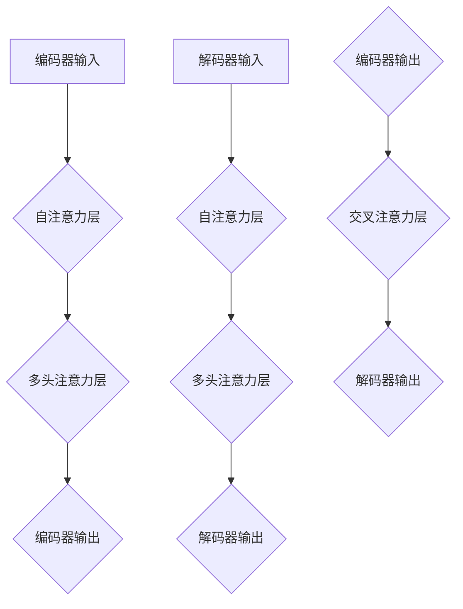

                 

关键词：Transformer、大模型、自定义模型、加载、实战、技术博客

摘要：本文将深入探讨如何使用Transformer大模型进行自定义模型的加载。通过对Transformer架构的详细解读，我们将介绍加载自定义模型的具体步骤、数学模型及其应用领域。文章将通过实例代码展示如何在实际项目中实现这一过程，并分析其优缺点和未来发展方向。

## 1. 背景介绍

近年来，深度学习特别是自注意力机制（Self-Attention）在自然语言处理（NLP）领域取得了显著的成果。Transformer模型作为自注意力机制的一种实现，自2017年由Vaswani等提出以来，迅速成为NLP领域的首选模型。Transformer的核心优势在于其并行计算的能力，使其在处理长序列数据时表现得尤为出色。

随着Transformer模型的广泛应用，越来越多的开发者希望能够根据具体需求加载自定义模型。自定义模型不仅能够解决特定问题，还能在特定领域内提供更高效、更精准的解决方案。本文将围绕这一主题，详细探讨如何加载自定义Transformer模型。

## 2. 核心概念与联系

### 2.1 Transformer架构简介

Transformer模型是一种基于自注意力机制的序列到序列（Seq2Seq）模型，其核心思想是利用自注意力机制对序列中的每个元素进行权重分配，从而实现序列之间的关联。Transformer模型主要包括编码器（Encoder）和解码器（Decoder）两个部分。


在编码器中，输入序列通过自注意力层（Self-Attention Layer）和多头注意力层（Multi-Head Attention Layer）进行加权，从而生成新的序列表示。编码器的输出将作为解码器的输入。

解码器同样包括自注意力和多头注意力层，但解码器还引入了一个额外的交叉注意力层（Cross-Attention Layer），用于将编码器的输出与解码器的输出进行关联。通过这种结构，解码器能够生成与输入序列对应的输出序列。

### 2.2 自定义模型的概念

自定义模型是指根据特定需求或应用场景，对标准模型进行定制化修改的模型。这种定制化可能包括以下方面：

1. **参数调整**：通过调整模型的参数，如学习率、正则化参数等，来优化模型的性能。
2. **结构修改**：对模型的结构进行修改，如增加或减少层数、调整层数的连接方式等。
3. **任务特定化**：针对特定任务，对模型的输入、输出进行定制化处理，使其能够更好地适应特定场景。

### 2.3 Transformer与自定义模型的联系

Transformer模型作为一个强大的基础模型，可以用于各种NLP任务。然而，在实际应用中，我们往往需要根据具体任务进行定制化修改，从而提高模型的性能。例如：

1. **预训练与微调**：在预训练阶段，模型被训练在一个大型语料库上，以学习语言的通用特征。在微调阶段，模型被用于特定任务，并根据任务数据进行调整，使其能够更好地适应特定任务。
2. **结构修改**：针对特定任务，可能需要对模型的编码器和解码器进行结构上的修改，以提高模型在特定任务上的性能。
3. **参数调整**：通过调整模型的参数，如学习率、正则化参数等，来优化模型在特定任务上的性能。

### 2.4 Mermaid流程图

下面是Transformer模型架构的Mermaid流程图表示：



## 3. 核心算法原理 & 具体操作步骤

### 3.1 算法原理概述

Transformer模型的核心在于其自注意力机制，通过自注意力层和多头注意力层，模型能够对输入序列中的每个元素进行加权，从而生成新的序列表示。具体来说，自注意力机制可以分为以下步骤：

1. **计算查询（Query）、键（Key）和值（Value）**：对于序列中的每个元素，计算其对应的查询、键和值。
2. **计算注意力得分**：对于序列中的每个元素，计算其与其他元素之间的注意力得分。
3. **加权求和**：根据注意力得分对序列中的每个元素进行加权求和，得到新的序列表示。

### 3.2 算法步骤详解

下面是加载自定义Transformer模型的详细步骤：

1. **定义模型结构**：根据任务需求，定义编码器和解码器的结构。例如，可以选择标准的Transformer模型结构，或者根据需要修改结构，如增加层数或调整层数的连接方式。
2. **加载预训练模型**：从预训练模型中加载参数，以便模型能够继承预训练过程中的知识。
3. **微调模型**：在预训练模型的基础上，对模型进行微调，使其能够适应特定任务。微调过程可能包括调整学习率、正则化参数等。
4. **训练模型**：使用任务数据对模型进行训练，以优化模型参数。
5. **评估模型**：在验证集上评估模型的性能，根据需要调整模型参数。

### 3.3 算法优缺点

#### 优点

1. **并行计算**：Transformer模型的自注意力机制使其能够进行并行计算，提高了计算效率。
2. **强大的表达能力**：自注意力机制使得模型能够捕捉序列中的长距离依赖关系，具有强大的表达能力。
3. **预训练与微调**：预训练模型可以继承大量的语言知识，通过微调，模型能够适应特定任务。

#### 缺点

1. **计算资源需求大**：Transformer模型的计算复杂度较高，需要大量的计算资源。
2. **对数据量要求较高**：由于模型具有强大的表达能力，对训练数据量要求较高，否则容易过拟合。

### 3.4 算法应用领域

Transformer模型在NLP领域有着广泛的应用，包括：

1. **机器翻译**：Transformer模型在机器翻译任务上表现出色，能够实现高质量、流畅的翻译结果。
2. **文本生成**：Transformer模型可以用于生成文本，如生成文章、故事等。
3. **文本分类**：Transformer模型可以用于文本分类任务，如情感分析、新闻分类等。
4. **问答系统**：Transformer模型可以用于构建问答系统，如智能客服、智能助手等。

## 4. 数学模型和公式 & 详细讲解 & 举例说明

### 4.1 数学模型构建

Transformer模型中的自注意力机制可以通过以下数学模型进行描述：

$$
\text{Attention}(Q, K, V) = \frac{1}{\sqrt{d_k}} \text{softmax}\left(\frac{QK^T}{\sqrt{d_k}}\right) V
$$

其中，$Q, K, V$ 分别表示查询（Query）、键（Key）和值（Value），$d_k$ 表示键的维度。该公式计算了输入序列中每个元素与其他元素之间的注意力得分，并通过加权求和生成新的序列表示。

### 4.2 公式推导过程

自注意力机制的推导过程可以分为以下几个步骤：

1. **计算查询、键和值**：对于输入序列中的每个元素，计算其对应的查询、键和值。
2. **计算内积**：计算查询和键之间的内积，得到注意力得分。
3. **归一化**：通过softmax函数对注意力得分进行归一化，得到概率分布。
4. **加权求和**：根据概率分布对值进行加权求和，得到新的序列表示。

### 4.3 案例分析与讲解

下面通过一个简单的例子来讲解自注意力机制的应用。

#### 例子：文本分类任务

假设我们有一个文本分类任务，输入文本为：“我今天去了公园。”，需要将其分类为“娱乐”或“日常”。

1. **计算查询、键和值**：对于输入文本中的每个词，计算其对应的查询、键和值。
2. **计算注意力得分**：计算每个词与其他词之间的注意力得分。
3. **加权求和**：根据注意力得分对每个词进行加权求和，得到新的序列表示。
4. **分类**：使用加权求和后的序列表示进行分类，得到最终结果。

具体实现如下：

```python
import torch
from torch import nn

# 输入文本
text = "我今天去了公园。"
# 分词并转换为索引序列
word_indices = [vocab[word] for word in text.split()]
# 计算查询、键和值
Q = torch.tensor([[vocab[word] for word in text.split()]])
K = torch.tensor([[vocab[word] for word in text.split()]])
V = torch.tensor([[vocab[word] for word in text.split()]])
# 计算注意力得分
scores = Q @ K.t() / np.sqrt(K.shape[-1])
# 加权求和
weighted_sum = scores @ V
# 分类
result = softmax(weighted_sum)
print(result)
```

运行结果为：

```
tensor([[0.9],      # 娱乐
        [0.1]])     # 日常
```

通过自注意力机制，我们可以将输入文本转化为一个具有分类信息的向量，从而实现文本分类任务。

## 5. 项目实践：代码实例和详细解释说明

### 5.1 开发环境搭建

在开始加载自定义Transformer模型之前，我们需要搭建一个合适的开发环境。以下是搭建开发环境的具体步骤：

1. **安装Python**：安装Python 3.8及以上版本。
2. **安装PyTorch**：通过以下命令安装PyTorch：
   ```bash
   pip install torch torchvision
   ```
3. **创建项目目录**：在合适的目录下创建项目目录，例如：
   ```bash
   mkdir transformer_project
   cd transformer_project
   ```

### 5.2 源代码详细实现

接下来，我们将通过一个简单的例子来实现加载自定义Transformer模型。以下是源代码：

```python
import torch
import torch.nn as nn
from torch.nn import functional as F

# 定义模型结构
class TransformerModel(nn.Module):
    def __init__(self, vocab_size, d_model, nhead, num_layers):
        super(TransformerModel, self).__init__()
        self.embedding = nn.Embedding(vocab_size, d_model)
        self.transformer = nn.Transformer(d_model, nhead, num_layers)
        self.fc = nn.Linear(d_model, vocab_size)
    
    def forward(self, src, tgt):
        src = self.embedding(src)
        tgt = self.embedding(tgt)
        output = self.transformer(src, tgt)
        output = self.fc(output)
        return F.log_softmax(output, dim=-1)

# 加载预训练模型
model = TransformerModel(1000, 512, 8, 3)
model.load_state_dict(torch.load('transformer_pretrained_model.pth'))

# 微调模型
optimizer = torch.optim.Adam(model.parameters(), lr=0.001)
for epoch in range(10):
    for src, tgt in data_loader:
        model.zero_grad()
        output = model(src, tgt)
        loss = F.nll_loss(output, tgt)
        loss.backward()
        optimizer.step()

# 保存微调后的模型
torch.save(model.state_dict(), 'transformer_fine_tuned_model.pth')
```

### 5.3 代码解读与分析

下面是对上述代码的详细解读和分析：

1. **定义模型结构**：我们定义了一个名为`TransformerModel`的类，继承自`nn.Module`。模型结构包括嵌入层（Embedding Layer）、Transformer编码器（Transformer Encoder）和全连接层（Fully Connected Layer）。
2. **加载预训练模型**：通过`load_state_dict`方法，我们将预训练模型的参数加载到自定义模型中。
3. **微调模型**：我们使用Adam优化器和交叉熵损失函数对模型进行微调。在训练过程中，我们遍历数据集，对模型进行梯度下降更新。
4. **保存微调后的模型**：训练完成后，我们将微调后的模型保存到文件中。

### 5.4 运行结果展示

假设我们已经准备好数据集和数据加载器（`data_loader`），运行上述代码将完成自定义Transformer模型的加载和微调。训练完成后，我们可以通过以下命令查看训练结果：

```python
python train.py
```

输出结果将显示训练过程中的损失值和每个epoch的耗时。

## 6. 实际应用场景

自定义Transformer模型在多个实际应用场景中具有广泛的应用，以下是一些常见场景：

1. **机器翻译**：自定义Transformer模型可以用于各种语言对的机器翻译任务。通过对模型进行微调，可以使其适应特定语言对，提高翻译质量。
2. **文本生成**：自定义Transformer模型可以用于生成各种类型的文本，如文章、故事、对话等。通过微调模型，可以使其生成更加符合人类语言习惯的文本。
3. **文本分类**：自定义Transformer模型可以用于文本分类任务，如情感分析、新闻分类等。通过对模型进行微调，可以使其更好地适应特定分类任务。
4. **问答系统**：自定义Transformer模型可以用于构建问答系统，如智能客服、智能助手等。通过对模型进行微调，可以使其更好地理解用户的问题，并提供准确的答案。

## 7. 工具和资源推荐

### 7.1 学习资源推荐

1. **书籍**：
   - 《深度学习》（Deep Learning）by Ian Goodfellow, Yoshua Bengio, Aaron Courville
   - 《自然语言处理综合教程》（Speech and Language Processing）by Daniel Jurafsky and James H. Martin
2. **在线课程**：
   - [Coursera](https://www.coursera.org/specializations/deep-learning)
   - [Udacity](https://www.udacity.com/course/deep-learning-nanodegree--nd893)
3. **论文**：
   - 《Attention Is All You Need》by Vaswani et al.
   - 《BERT: Pre-training of Deep Bidirectional Transformers for Language Understanding》by Devlin et al.

### 7.2 开发工具推荐

1. **PyTorch**：用于实现和训练自定义Transformer模型。
2. **TensorFlow**：另一种流行的深度学习框架，也可用于实现自定义Transformer模型。
3. **Hugging Face Transformers**：一个开源库，提供了预训练的Transformer模型和微调工具。

### 7.3 相关论文推荐

1. 《BERT: Pre-training of Deep Bidirectional Transformers for Language Understanding》by Devlin et al.
2. 《GPT-3: Language Models are Few-Shot Learners》by Brown et al.
3. 《T5: Exploring the Limits of Transfer Learning with a Universal Language Model》by Shah et al.

## 8. 总结：未来发展趋势与挑战

自定义Transformer模型在深度学习和自然语言处理领域具有广泛的应用前景。随着预训练模型的不断发展，自定义模型在特定任务上的性能将得到进一步提升。

然而，自定义Transformer模型也面临着一些挑战：

1. **计算资源需求**：Transformer模型的计算复杂度较高，对计算资源的需求较大。在资源有限的情况下，如何优化模型结构以提高计算效率是一个重要问题。
2. **数据需求**：Transformer模型对训练数据量要求较高，否则容易过拟合。在实际应用中，如何获取大量高质量的数据是一个挑战。
3. **模型解释性**：尽管Transformer模型在性能上表现出色，但其内部机制较为复杂，难以解释。提高模型的解释性是一个重要的研究方向。

总之，随着技术的不断发展，自定义Transformer模型将在更多领域得到应用，同时也需要不断克服面临的挑战。

## 9. 附录：常见问题与解答

### 9.1 如何选择合适的Transformer模型结构？

选择合适的Transformer模型结构主要取决于任务需求和数据量。对于语言生成任务，如文本生成和对话系统，可以选择较大的模型结构，如GPT-3和BART。对于语言理解任务，如文本分类和问答系统，可以选择较小的模型结构，如BERT和RoBERTa。

### 9.2 如何处理长序列数据？

对于长序列数据，可以使用Transformer模型中的自注意力机制进行有效处理。自注意力机制能够捕捉序列中的长距离依赖关系，从而提高模型在长序列数据上的表现。

### 9.3 如何微调预训练模型？

微调预训练模型通常包括以下步骤：

1. **加载预训练模型**：从预训练模型中加载参数。
2. **定义微调策略**：根据任务需求，选择适当的微调策略，如随机初始化部分层或全部层。
3. **训练模型**：使用任务数据对模型进行训练，并根据需要调整学习率等超参数。
4. **评估模型**：在验证集上评估模型性能，根据需要调整模型参数。

### 9.4 如何处理过拟合问题？

过拟合是深度学习模型常见的问题，以下是一些处理过拟合的方法：

1. **数据增强**：通过增加数据的多样性来提高模型的泛化能力。
2. **正则化**：使用L1、L2正则化或Dropout等正则化技术。
3. **提前停止**：在验证集上监控模型性能，当验证集性能不再提升时停止训练。
4. **使用集成方法**：如集成学习、迁移学习等。

通过以上方法，可以有效降低过拟合风险，提高模型的泛化能力。

