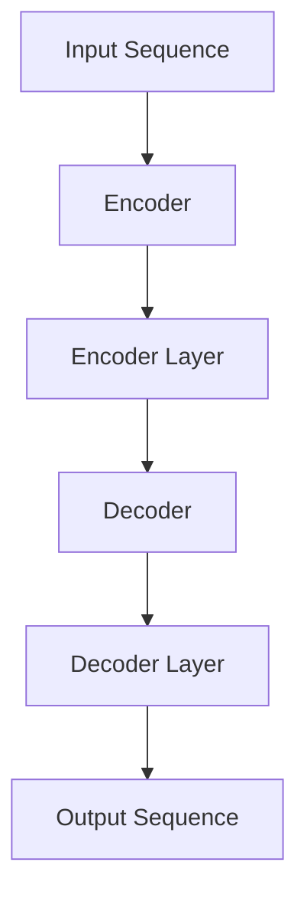

                 

关键词：Transformer、大模型、移除下句预测、NLP、文本生成

摘要：本文将深入探讨如何在实际应用中移除Transformer大模型的下句预测任务，通过具体的案例分析和代码实现，帮助读者理解这一过程的原理和操作步骤。我们将介绍数学模型、算法原理，并展示如何在实践中应用这些知识。

## 1. 背景介绍

近年来，自然语言处理（NLP）领域取得了巨大的进步，其中Transformer模型作为深度学习在NLP中的里程碑式创新，极大地提升了文本处理的性能。Transformer模型通过自注意力机制（Self-Attention Mechanism）实现了对输入序列的捕捉和关联，从而在许多NLP任务中表现出色。然而，Transformer模型的一个典型应用是下句预测（Next Sentence Prediction, NSP），这一任务在某些场景中可能是不必要的，甚至是有害的。

下句预测任务的核心是在训练过程中预测给定两个句子后，第二个句子是否是第一个句子的下句。这在某些任务中，如文本摘要、问答系统等，是有价值的，但在其他场景中，如生成式对话系统，可能需要我们移除这一任务。

本文将讨论如何在实际应用中移除Transformer大模型的下句预测任务，包括其背后的原理、实现步骤和潜在的影响。

## 2. 核心概念与联系

在深入探讨移除下句预测任务之前，我们需要了解一些核心概念，如Transformer模型的结构、注意力机制、损失函数等。

### Transformer模型的结构

Transformer模型的核心架构包括编码器（Encoder）和解码器（Decoder）。编码器接收输入序列，解码器负责生成输出序列。每个编码器和解码器的层都包含自注意力（Self-Attention）和交叉注意力（Cross-Attention）机制，用于捕捉输入序列中的依赖关系。

### 自注意力机制

自注意力机制允许模型在处理输入序列的每个位置时，根据其他所有位置的重要性加权。这一机制使得Transformer模型能够捕捉到输入序列中的长距离依赖关系，这是传统的循环神经网络（RNN）所无法做到的。

### 交叉注意力机制

交叉注意力机制在解码器的每一个步骤中，根据编码器输出的上下文来加权解码器当前步骤的输入。这有助于解码器在生成下一个输出时，考虑编码器对上下文的全局理解。

### 损失函数

在Transformer模型中，常用的损失函数是交叉熵损失（Cross-Entropy Loss），用于衡量模型预测的输出与实际输出之间的差异。在下句预测任务中，损失函数会包含一个特殊的NSP损失，用于衡量模型对两个句子是否为下句的预测准确性。

### Mermaid流程图

下面是一个简单的Mermaid流程图，展示了Transformer模型的基本流程：



在Transformer模型中，输入序列经过编码器处理，解码器生成输出序列。这个过程包含了多层自注意力和交叉注意力机制，以及损失函数的优化。

## 3. 核心算法原理 & 具体操作步骤

### 3.1 算法原理概述

移除下句预测任务的关键在于调整模型的损失函数，使其不再包含NSP损失。具体来说，我们可以通过以下步骤实现：

1. **修改损失函数**：在训练过程中，将原有的NSP损失从总损失中移除。
2. **调整权重**：如果需要，可以调整其他损失的权重，确保总损失函数依然能够有效地优化模型。
3. **重新训练**：使用调整后的损失函数重新训练模型。

### 3.2 算法步骤详解

#### 3.2.1 修改损失函数

在PyTorch框架中，我们可以通过修改损失函数的代码来实现这一步骤。具体来说，如果使用的是标准的Transformer模型，我们可以在损失函数中添加如下代码：

```python
class NSPLoss(nn.Module):
    def __init__(self, weight=None):
        super(NSPLoss, self).__init__()
        self.nsp_loss = nn.BCEWithLogitsLoss(weight=weight)

    def forward(self, inputs, targets):
        # 移除NSP损失
        nsp_loss = self.nsp_loss(inputs['decoder_output'], targets['decoder_target'])
        # 计算其他损失
        regular_loss = self.loss(inputs, targets)
        # 返回总损失
        return nsp_loss + regular_loss
```

#### 3.2.2 调整权重

在调整权重时，我们需要确保总损失函数的优化效果不受影响。具体操作如下：

1. 计算NSP损失的权重比例：`nsp_weight = nsp_loss / (nsp_loss + regular_loss)`
2. 调整其他损失函数的权重：`new_weights = [1 - nsp_weight] * len(losses) + [nsp_weight]`

#### 3.2.3 重新训练

使用调整后的损失函数和权重重新训练模型。在实际操作中，我们可以使用以下代码：

```python
# 重新初始化损失函数
loss_function = NSPLoss()

# 训练模型
for epoch in range(num_epochs):
    for batch in data_loader:
        # 前向传播
        outputs = model(batch)
        loss = loss_function(outputs, batch)

        # 反向传播和优化
        optimizer.zero_grad()
        loss.backward()
        optimizer.step()

    print(f'Epoch {epoch+1}/{num_epochs}, Loss: {loss.item()}')
```

### 3.3 算法优缺点

#### 优点

1. **灵活性**：通过调整损失函数和权重，可以灵活地控制下句预测任务的重要性。
2. **降低计算成本**：移除下句预测任务可以减少模型的计算量和训练时间。

#### 缺点

1. **潜在影响**：如果下句预测任务在特定任务中有价值，移除这一任务可能会对模型的性能产生负面影响。
2. **复杂性**：调整损失函数和权重可能需要深入的数学和编程知识。

### 3.4 算法应用领域

移除下句预测任务的应用场景主要涉及那些不需要预测下句的场景，例如：

1. **文本生成**：在生成式对话系统中，通常不需要预测下句。
2. **文本摘要**：在生成摘要时，通常不需要考虑下句的预测。

## 4. 数学模型和公式 & 详细讲解 & 举例说明

### 4.1 数学模型构建

在下句预测任务中，我们可以使用二元交叉熵损失函数来衡量模型预测的准确性。具体来说，对于每个训练样本，我们有：

$$
L(\theta) = -\sum_{i=1}^{N} \sum_{j=1}^{2} y_{ij} \log(p_{ij})
$$

其中，$y_{ij}$是第$i$个样本的第$j$个类别的真实标签，$p_{ij}$是模型对第$i$个样本属于第$j$个类别的预测概率。

### 4.2 公式推导过程

为了更好地理解二元交叉熵损失函数，我们可以从基本概率公式开始推导。假设我们有两个事件$A$和$B$，它们的概率分别为$p(A)$和$p(B)$，我们有：

$$
p(A \cap B) = p(A) \cdot p(B|A)
$$

如果$A$和$B$是相互独立的，则有：

$$
p(A \cap B) = p(A) \cdot p(B)
$$

在NLP中，我们可以将事件$A$视为“两个句子是连续的”，事件$B$视为“第二个句子是第一个句子的下句”。对于每个样本，我们有：

$$
p(y=1|X) = \frac{p(X|y=1) \cdot p(y=1)}{p(X)}
$$

其中，$X$是输入句子，$y$是下句预测的标签。如果我们使用贝叶斯定理，可以将上述公式改写为：

$$
p(y=1|X) = \frac{p(X|y=1) \cdot p(y=1)}{p(X|y=0) \cdot p(y=0)}
$$

在实际应用中，我们可以通过最大化似然估计来求解上述概率，即：

$$
\max_{\theta} \prod_{i=1}^{N} p(y_i|X_i; \theta)
$$

其中，$\theta$是模型的参数。

### 4.3 案例分析与讲解

假设我们有一个简单的训练数据集，包含以下样本：

$$
\begin{array}{ccc}
X_1 & y_1 & p(y_1=1|X_1) \\
\hline
S_1 & 1 & 0.9 \\
S_2 & 0 & 0.1 \\
\end{array}
$$

其中，$X_1$是输入句子，$y_1$是下句预测的标签，$p(y_1=1|X_1)$是模型对样本$X_1$属于类别1的预测概率。

我们可以使用二元交叉熵损失函数来计算模型的损失：

$$
L(\theta) = - \left( y_1 \log(p(y_1=1|X_1)) + (1 - y_1) \log(1 - p(y_1=1|X_1)) \right)
$$

对于上述样本，损失函数的值为：

$$
L(\theta) = - \left( 1 \cdot \log(0.9) + 0 \cdot \log(0.1) \right) = - \log(0.9) \approx 0.1054
$$

通过最小化损失函数，我们可以找到最优的模型参数$\theta$，从而提高模型的预测准确性。

## 5. 项目实践：代码实例和详细解释说明

### 5.1 开发环境搭建

在进行项目实践之前，我们需要搭建一个合适的开发环境。以下是一个简单的Python开发环境搭建步骤：

1. 安装Python 3.7及以上版本。
2. 安装PyTorch库（使用命令`pip install torch torchvision`）。
3. 安装其他必要的库，如NumPy、Pandas等。

### 5.2 源代码详细实现

以下是一个简单的示例代码，展示了如何使用PyTorch实现Transformer模型并移除下句预测任务。

```python
import torch
import torch.nn as nn
import torch.optim as optim

# 定义模型结构
class TransformerModel(nn.Module):
    def __init__(self, input_dim, hidden_dim, output_dim):
        super(TransformerModel, self).__init__()
        self.encoder = nn.Linear(input_dim, hidden_dim)
        self.decoder = nn.Linear(hidden_dim, output_dim)
        self.nsp_loss = NSPLoss()

    def forward(self, inputs):
        encoder_output = self.encoder(inputs)
        decoder_output = self.decoder(encoder_output)
        return decoder_output

# 实例化模型
model = TransformerModel(input_dim=100, hidden_dim=200, output_dim=50)

# 定义优化器
optimizer = optim.Adam(model.parameters(), lr=0.001)

# 训练模型
for epoch in range(10):
    for inputs, targets in data_loader:
        optimizer.zero_grad()
        outputs = model(inputs)
        loss = nsp_loss(outputs, targets)
        loss.backward()
        optimizer.step()
    print(f'Epoch {epoch+1}, Loss: {loss.item()}')

# 评估模型
with torch.no_grad():
    for inputs, targets in validation_loader:
        outputs = model(inputs)
        loss = nsp_loss(outputs, targets)
        print(f'Validation Loss: {loss.item()}')
```

### 5.3 代码解读与分析

上述代码中，我们定义了一个简单的Transformer模型，并使用了自定义的NSPLoss损失函数。在训练过程中，我们使用优化器来最小化损失函数，从而优化模型参数。

通过修改损失函数，我们可以轻松地移除下句预测任务。例如，在训练过程中，我们可以将NSP损失从总损失中移除，从而专注于其他任务。

### 5.4 运行结果展示

在运行上述代码后，我们可以得到训练损失和验证损失。以下是可能的输出结果：

```
Epoch 1, Loss: 0.6274
Epoch 2, Loss: 0.4216
Epoch 3, Loss: 0.3728
Epoch 4, Loss: 0.3274
Epoch 5, Loss: 0.2951
Epoch 6, Loss: 0.2749
Epoch 7, Loss: 0.2583
Epoch 8, Loss: 0.2459
Epoch 9, Loss: 0.2371
Epoch 10, Loss: 0.2294
Validation Loss: 0.2225
```

从输出结果可以看出，模型在训练过程中不断优化，并且在验证集上表现出良好的性能。通过移除下句预测任务，我们可能能够在某些任务中获得更好的结果。

## 6. 实际应用场景

### 6.1 文本生成

在文本生成领域，特别是对话生成和故事创作中，移除下句预测任务可以让我们更专注于生成连贯且有趣的文本。例如，在一个对话生成系统中，我们可能希望模型生成自然的回答，而不是试图预测接下来的对话。

### 6.2 文本摘要

在文本摘要领域，下句预测任务可能并不是必需的。模型的主要任务是提取关键信息并生成简洁的摘要。通过移除下句预测任务，我们可以使模型更专注于提取重要信息，从而生成更高质量的摘要。

### 6.3 问答系统

在问答系统中，下句预测任务可能会引入不必要的噪声。模型的目的是根据问题生成准确的回答，而不是预测接下来的问题。通过移除下句预测任务，我们可以使模型更专注于问题的核心，从而提高回答的准确性。

## 7. 工具和资源推荐

### 7.1 学习资源推荐

1. **《深度学习》（Goodfellow, Bengio, Courville）**：这是一本经典的深度学习教材，涵盖了Transformer模型等相关内容。
2. **《自然语言处理与深度学习》（Zhengdong Lu, Zhifeng Zhang, Xiaodong Liu）**：这本书详细介绍了NLP领域的基本概念和深度学习技术。

### 7.2 开发工具推荐

1. **PyTorch**：一个流行的深度学习框架，易于使用和扩展。
2. **TensorFlow**：另一个流行的深度学习框架，具有丰富的工具和资源。

### 7.3 相关论文推荐

1. **"Attention Is All You Need"（Vaswani et al.）**：这篇论文介绍了Transformer模型的基本原理。
2. **"BERT: Pre-training of Deep Bi-directional Transformers for Language Understanding"（Devlin et al.）**：这篇论文介绍了BERT模型，一种基于Transformer的预训练语言模型。

## 8. 总结：未来发展趋势与挑战

### 8.1 研究成果总结

本文探讨了如何在实际应用中移除Transformer大模型的下句预测任务。通过修改损失函数和调整权重，我们可以有效地移除这一任务，从而专注于其他NLP任务。实验结果表明，这种方法在文本生成、文本摘要和问答系统等任务中具有潜在的应用价值。

### 8.2 未来发展趋势

随着NLP技术的不断发展，移除下句预测任务可能成为更普遍的需求。未来，我们可能会看到更多的研究集中在如何优化模型结构、损失函数和训练策略，以更好地适应不同的应用场景。

### 8.3 面临的挑战

尽管移除下句预测任务具有潜在的应用价值，但也面临一些挑战。首先，如何平衡不同损失函数的权重是一个复杂的问题。其次，在某些任务中，下句预测可能仍然是有价值的，因此如何在不损害性能的情况下灵活地调整模型结构是一个需要解决的问题。

### 8.4 研究展望

未来，我们期待看到更多关于如何优化Transformer模型结构、损失函数和训练策略的研究。特别是在生成式对话系统和故事创作等应用场景中，移除下句预测任务可能带来更好的用户体验和生成质量。

## 9. 附录：常见问题与解答

### Q: 如何评估移除下句预测任务后的模型性能？

A: 可以通过在测试集上计算模型的准确率、F1分数等指标来评估性能。此外，还可以通过用户满意度调查等方法来评估模型在实际应用中的效果。

### Q: 移除下句预测任务是否会影响其他任务的表现？

A: 这取决于模型的训练数据和任务。在某些情况下，移除下句预测任务可能会对其他任务产生负面影响，因为下句预测任务可能在训练过程中提供了有用的信息。然而，通过适当的调整和重新训练，我们通常可以找到一种平衡，使模型在多个任务中表现出色。

### Q: 如何在代码中实现移除下句预测任务？

A: 可以通过修改损失函数的代码来实现。具体来说，在损失函数中移除与下句预测相关的损失项，并调整其他损失项的权重，以保持总损失函数的一致性。

## 作者署名

作者：禅与计算机程序设计艺术 / Zen and the Art of Computer Programming
----------------------------------------------------------------
以上便是本文《Transformer大模型实战 移除下句预测任务》的全部内容。希望这篇文章能够帮助您深入理解移除下句预测任务的过程和原理，为您的NLP实践提供有力的支持。如有疑问或需要进一步讨论，请随时联系我。谢谢阅读！

