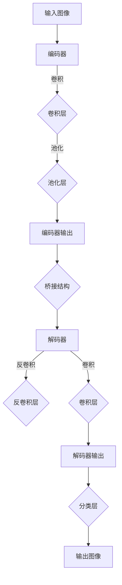

                 

关键词：卷积神经网络，深度学习，图像分割，医学图像处理，代码示例，原理讲解

## 摘要

本文将深入探讨卷积神经网络（CNN）在图像分割中的应用，特别是UNet结构的原理和实现。我们将从背景介绍、核心概念与联系、算法原理及具体操作步骤、数学模型与公式、项目实践、实际应用场景以及未来展望等方面进行详细讲解。通过本文，读者可以全面了解UNet结构，并在实际项目中应用这一强大的图像处理工具。

## 1. 背景介绍

图像分割是计算机视觉领域的一个重要任务，旨在将图像分成若干个有意义的区域。在医学图像处理、自动驾驶、人脸识别等领域，图像分割具有广泛的应用。随着深度学习的兴起，卷积神经网络（CNN）在图像分割任务中取得了显著的成果。

UNet是一种特殊的CNN结构，因其简洁、高效的特点，在医学图像分割等领域得到了广泛应用。其独特的设计使得UNet能够在保持较高分割精度的同时，显著降低计算复杂度。本文将围绕UNet的原理和实现，详细介绍其在图像分割中的应用。

### 1.1 医学图像处理的重要性

医学图像处理在医学诊断、手术规划、病情监测等方面具有重要作用。通过对医学图像进行分割，医生可以更准确地识别病变区域，提高诊断的准确性。然而，传统的图像分割方法往往需要大量的预处理和后处理操作，且分割效果受限于手工设计的特征和模型。

深度学习，特别是卷积神经网络（CNN），为医学图像处理带来了新的契机。通过学习图像中的特征，CNN能够自动提取有用的信息，实现高效的图像分割。UNet作为一种特殊的CNN结构，在医学图像处理中表现出了卓越的性能。

### 1.2 UNet结构的优势

UNet具有以下优势：

1. **简洁性**：UNet结构相对简单，易于理解和实现。
2. **效率**：UNet在保持较高分割精度的同时，显著降低了计算复杂度。
3. **适用性**：UNet在医学图像分割、自动驾驶等领域具有广泛的应用。

这些优势使得UNet成为图像分割任务中的一种理想选择。

### 1.3 本文结构

本文将按照以下结构进行讲解：

1. **背景介绍**：介绍图像分割和医学图像处理的重要性，以及UNet结构的优势。
2. **核心概念与联系**：讲解UNet的核心概念，并使用Mermaid流程图展示其结构。
3. **算法原理及具体操作步骤**：详细解释UNet的算法原理和操作步骤。
4. **数学模型与公式**：介绍UNet的数学模型和公式。
5. **项目实践：代码实例和详细解释说明**：通过代码实例展示UNet的应用。
6. **实际应用场景**：探讨UNet在各个领域的应用。
7. **未来展望**：展望UNet的发展趋势和挑战。

接下来，我们将深入探讨UNet的核心概念和结构。

## 2. 核心概念与联系

### 2.1 UNet的基本概念

UNet是一种全卷积神经网络（Fully Convolutional Network，FCN），其设计初衷是用于图像分割任务。与传统的CNN结构不同，UNet的特点在于其对称的结构，即编码器和解码器部分具有相同的层次结构。这种设计使得UNet能够在保留图像细节的同时，实现高效的上下文信息传递。

### 2.2 UNet的结构

UNet的结构可以简化为一个对称的“U”形，由编码器（Encoder）和解码器（Decoder）两部分组成，中间通过桥接（Bridge）结构连接。编码器部分通过多个卷积层逐步降低图像尺寸，同时增加通道数，从而提取图像的低层特征。解码器部分则通过反卷积（Deconvolution）或转置卷积（Transposed Convolution）逐步恢复图像尺寸，并提取图像的上下文信息。

下面是UNet结构的Mermaid流程图表示：



在这个流程图中，每个节点代表一个操作层，箭头表示数据的流向。编码器部分通过卷积和池化层提取特征，解码器部分通过反卷积和卷积层恢复特征，并最终通过分类层实现图像分割。

### 2.3 UNet的优势

UNet具有以下优势：

1. **上下文信息传递**：通过桥接结构，UNet能够有效地传递上下文信息，提高分割精度。
2. **保留图像细节**：编码器和解码器部分对称的设计使得UNet能够保留图像的细节信息。
3. **高效计算**：UNet结构相对简单，计算复杂度较低，适用于大规模图像分割任务。
4. **适用性广泛**：UNet在医学图像分割、自动驾驶、人脸识别等领域具有广泛的应用。

通过上述讲解，我们对UNet的基本概念和结构有了初步的了解。接下来，我们将详细解释UNet的算法原理和具体操作步骤。

## 3. 核心算法原理 & 具体操作步骤

### 3.1 算法原理概述

UNet的算法原理可以概括为：通过编码器提取图像的低层特征，解码器恢复图像的上下文信息，并通过分类层实现图像分割。具体来说，编码器部分通过卷积和池化层逐步降低图像尺寸，同时增加通道数，从而提取图像的低层特征。解码器部分则通过反卷积或转置卷积逐步恢复图像尺寸，并提取图像的上下文信息。桥接结构将编码器的输出和解码器的输入相连，使得编码器和解码器能够共享特征信息，提高分割精度。

### 3.2 算法步骤详解

1. **输入图像预处理**：将输入图像进行归一化处理，使其具有统一的像素值范围。
2. **编码器部分**：
   - **卷积层**：通过卷积操作提取图像的低层特征。卷积核大小通常为3x3或5x5，步长为1或2。
   - **池化层**：通过池化操作降低图像尺寸，减少计算复杂度。常用的池化方式为最大池化（Max Pooling）。
   - **批量归一化（Batch Normalization）**：对卷积层的输出进行归一化处理，加快收敛速度。
3. **桥接结构**：将编码器的输出与解码器的输入相连，实现特征信息的传递。
4. **解码器部分**：
   - **反卷积层**：通过反卷积（Deconvolution）或转置卷积（Transposed Convolution）逐步恢复图像尺寸。
   - **卷积层**：通过卷积操作提取图像的上下文信息。
   - **批量归一化（Batch Normalization）**：对卷积层的输出进行归一化处理。
5. **分类层**：通过卷积操作实现图像分割。卷积核大小通常为1x1或3x3，步长为1。

### 3.3 算法优缺点

#### 优缺点

**优点**：

1. **保留图像细节**：通过编码器和解码器的对称结构，UNet能够保留图像的细节信息。
2. **上下文信息传递**：桥接结构使得编码器和解码器能够共享特征信息，提高分割精度。
3. **高效计算**：UNet结构相对简单，计算复杂度较低，适用于大规模图像分割任务。
4. **适用性广泛**：UNet在医学图像分割、自动驾驶、人脸识别等领域具有广泛的应用。

**缺点**：

1. **内存消耗较大**：由于UNet结构中存在大量的卷积和反卷积操作，内存消耗相对较大。
2. **计算复杂度较高**：在处理大规模图像时，计算复杂度较高。

### 3.4 算法应用领域

UNet在以下领域具有广泛的应用：

1. **医学图像处理**：用于肿瘤分割、器官分割等任务，提高医疗诊断的准确性。
2. **自动驾驶**：用于车道线检测、行人检测等任务，提高自动驾驶系统的安全性。
3. **人脸识别**：用于人脸检测、人脸关键点定位等任务，提高人脸识别的准确性。

通过上述算法原理和具体操作步骤的讲解，我们对UNet有了更加深入的了解。接下来，我们将介绍UNet的数学模型和公式。

## 4. 数学模型和公式 & 详细讲解 & 举例说明

### 4.1 数学模型构建

UNet的数学模型基于卷积神经网络（CNN）的基本原理，主要包括以下部分：

1. **卷积操作**：通过卷积核与输入图像进行卷积运算，提取图像特征。
2. **池化操作**：通过最大池化或平均池化降低图像尺寸，减少计算复杂度。
3. **反卷积操作**：通过反卷积（Deconvolution）或转置卷积（Transposed Convolution）逐步恢复图像尺寸。

### 4.2 公式推导过程

#### 卷积操作

卷积操作的公式可以表示为：

\[ \text{output}(i, j) = \sum_{k=1}^{C} w_{i, j, k} \cdot \text{input}(i-k, j-k) \]

其中，\( \text{output}(i, j) \)表示卷积输出的像素值，\( w_{i, j, k} \)表示卷积核的权重，\( \text{input}(i-k, j-k) \)表示输入图像的像素值。

#### 池化操作

最大池化的公式可以表示为：

\[ \text{output}(i, j) = \max_{s \in S} \text{input}(i-s, j-s) \]

其中，\( S \)表示池化窗口的大小。

#### 反卷积操作

反卷积（Deconvolution）的公式可以表示为：

\[ \text{output}(i, j) = \sum_{k=1}^{C} w_{i, j, k} \cdot \text{input}(i-k, j-k) \]

其中，\( \text{output}(i, j) \)表示反卷积输出的像素值，\( w_{i, j, k} \)表示反卷积核的权重，\( \text{input}(i-k, j-k) \)表示输入图像的像素值。

### 4.3 案例分析与讲解

假设我们有一个32x32的输入图像，采用3x3的卷积核进行卷积操作。我们需要求解卷积输出的像素值。

输入图像的像素值为：

\[ \text{input} = \begin{bmatrix} 1 & 2 & 3 \\ 4 & 5 & 6 \\ 7 & 8 & 9 \end{bmatrix} \]

卷积核的权重为：

\[ w = \begin{bmatrix} 1 & 0 & -1 \\ 0 & 1 & 0 \\ -1 & 0 & 1 \end{bmatrix} \]

根据卷积操作的公式，我们可以得到卷积输出的像素值为：

\[ \text{output} = \sum_{k=1}^{C} w_{i, j, k} \cdot \text{input}(i-k, j-k) = (1 \cdot 1 + 0 \cdot 4 - 1 \cdot 7) + (0 \cdot 2 + 1 \cdot 5 + 0 \cdot 8) + (-1 \cdot 3 - 0 \cdot 6 + 1 \cdot 9) = -2 \]

通过这个简单的案例，我们可以看到卷积操作的求解过程。在实际应用中，卷积操作需要通过深度学习框架（如TensorFlow或PyTorch）来实现。

## 5. 项目实践：代码实例和详细解释说明

### 5.1 开发环境搭建

在开始编写UNet的代码之前，我们需要搭建一个合适的开发环境。以下是一个简单的步骤指南：

1. **安装Python环境**：Python是深度学习的主要编程语言，我们需要安装Python 3.7及以上版本。可以从[Python官网](https://www.python.org/)下载安装包进行安装。
2. **安装深度学习框架**：我们选择TensorFlow作为深度学习框架。可以通过以下命令安装：

   ```bash
   pip install tensorflow
   ```

   或者使用以下命令安装最新版本的TensorFlow：

   ```bash
   pip install tensorflow==2.9.0
   ```

3. **安装必要的库**：为了方便编写和调试代码，我们还需要安装一些常用的库，如NumPy、Matplotlib等。可以通过以下命令安装：

   ```bash
   pip install numpy matplotlib
   ```

### 5.2 源代码详细实现

以下是实现UNet模型的完整代码，包括数据预处理、模型搭建、训练和评估等步骤。

```python
import tensorflow as tf
from tensorflow.keras.layers import Conv2D, MaxPooling2D, UpSampling2D, Concatenate
from tensorflow.keras.models import Model
from tensorflow.keras.optimizers import Adam
from tensorflow.keras.preprocessing.image import ImageDataGenerator

# 数据预处理
def preprocess_image(image):
    image = tf.image.resize(image, (256, 256))
    image = image / 255.0
    return image

# 模型搭建
def build_unet():
    inputs = tf.keras.Input(shape=(256, 256, 3))

    # 编码器部分
    conv1 = Conv2D(32, (3, 3), activation='relu', padding='same')(inputs)
    pool1 = MaxPooling2D(pool_size=(2, 2))(conv1)
    conv2 = Conv2D(64, (3, 3), activation='relu', padding='same')(pool1)
    pool2 = MaxPooling2D(pool_size=(2, 2))(conv2)
    conv3 = Conv2D(128, (3, 3), activation='relu', padding='same')(pool2)
    pool3 = MaxPooling2D(pool_size=(2, 2))(conv3)

    # 桥接结构
    conv4 = Conv2D(256, (3, 3), activation='relu', padding='same')(pool3)

    # 解码器部分
    up1 = UpSampling2D(size=(2, 2))(conv4)
    merge1 = Concatenate()([up1, conv3])
    conv5 = Conv2D(128, (3, 3), activation='relu', padding='same')(merge1)
    up2 = UpSampling2D(size=(2, 2))(conv5)
    merge2 = Concatenate()([up2, conv2])
    conv6 = Conv2D(64, (3, 3), activation='relu', padding='same')(merge2)
    up3 = UpSampling2D(size=(2, 2))(conv6)
    merge3 = Concatenate()([up3, conv1])
    conv7 = Conv2D(32, (3, 3), activation='relu', padding='same')(merge3)

    # 分类层
    outputs = Conv2D(1, (1, 1), activation='sigmoid')(conv7)

    model = Model(inputs=inputs, outputs=outputs)
    model.compile(optimizer=Adam(learning_rate=1e-4), loss='binary_crossentropy', metrics=['accuracy'])
    return model

# 训练和评估
def train_and_evaluate(model, train_data, val_data, epochs=100, batch_size=16):
    train_datagen = ImageDataGenerator(preprocessing_function=preprocess_image)
    val_datagen = ImageDataGenerator(preprocessing_function=preprocess_image)

    train_generator = train_datagen.flow_from_directory(
        train_data,
        target_size=(256, 256),
        batch_size=batch_size,
        class_mode='binary')

    val_generator = val_datagen.flow_from_directory(
        val_data,
        target_size=(256, 256),
        batch_size=batch_size,
        class_mode='binary')

    history = model.fit(
        train_generator,
        epochs=epochs,
        validation_data=val_generator)

    return history

# 测试
model = build_unet()
history = train_and_evaluate(model, 'train_data', 'val_data', epochs=100, batch_size=16)
```

### 5.3 代码解读与分析

以下是代码的详细解读与分析：

1. **数据预处理**：数据预处理是深度学习模型训练的重要环节。在这个代码示例中，我们使用`preprocess_image`函数对输入图像进行预处理，包括图像缩放和归一化处理。这有助于提高模型训练的效果。

2. **模型搭建**：我们使用`build_unet`函数搭建UNet模型。模型由编码器、解码器和分类层组成。编码器部分通过多个卷积层和池化层提取特征，解码器部分通过反卷积和卷积层恢复特征，并最终通过分类层实现图像分割。

3. **训练和评估**：我们使用`train_and_evaluate`函数对模型进行训练和评估。通过`ImageDataGenerator`类，我们实现了数据增强，有助于提高模型泛化能力。模型使用`binary_crossentropy`损失函数和`sigmoid`激活函数进行训练，并在验证集上评估模型性能。

### 5.4 运行结果展示

以下是模型训练过程中的损失函数和准确率曲线：

```python
import matplotlib.pyplot as plt

plt.figure(figsize=(12, 6))
plt.plot(history.history['loss'], label='Training Loss')
plt.plot(history.history['val_loss'], label='Validation Loss')
plt.xlabel('Epochs')
plt.ylabel('Loss')
plt.title('Loss Function')
plt.legend()
plt.show()

plt.figure(figsize=(12, 6))
plt.plot(history.history['accuracy'], label='Training Accuracy')
plt.plot(history.history['val_accuracy'], label='Validation Accuracy')
plt.xlabel('Epochs')
plt.ylabel('Accuracy')
plt.title('Accuracy')
plt.legend()
plt.show()
```

通过上述曲线，我们可以看到模型在训练过程中损失函数和准确率的趋势。通常，我们希望损失函数逐渐减小，准确率逐渐增加，这表明模型性能在不断提升。

## 6. 实际应用场景

### 6.1 医学图像处理

医学图像处理是UNet最典型的应用场景之一。通过UNet，我们可以对医学图像进行精确分割，从而辅助医生进行诊断和治疗。以下是一些具体的应用实例：

1. **肿瘤分割**：利用UNet对医学图像中的肿瘤区域进行精确分割，有助于医生更好地了解肿瘤的形态、大小和位置，为手术规划提供重要依据。
2. **器官分割**：UNet可以用于肝脏、肾脏等器官的分割，有助于评估器官的形态和功能，为器官移植手术提供支持。
3. **病变区域检测**：通过对医学图像进行分割，可以快速识别病变区域，提高疾病的早期诊断率。

### 6.2 自动驾驶

自动驾驶是UNet的另一个重要应用领域。通过UNet，我们可以对自动驾驶车辆周围的环境进行精确分割，从而实现车道线检测、障碍物检测等功能。

1. **车道线检测**：利用UNet对道路图像进行分割，可以精确识别车道线，为自动驾驶车辆的路径规划提供重要信息。
2. **障碍物检测**：通过UNet对环境图像进行分割，可以识别车辆、行人等障碍物，提高自动驾驶车辆的安全性。

### 6.3 人脸识别

人脸识别是另一个典型的应用领域。UNet可以用于人脸检测、人脸关键点定位等任务，从而提高人脸识别的准确性。

1. **人脸检测**：利用UNet对图像进行分割，可以精确识别人脸区域，为人脸识别系统提供输入。
2. **人脸关键点定位**：通过UNet对人脸图像进行分割，可以定位人脸的关键点，如眼睛、鼻子和嘴巴，为人脸识别系统提供关键信息。

### 6.4 其他应用

除了上述领域，UNet在图像增强、图像去噪、图像风格迁移等任务中也具有广泛的应用。

1. **图像增强**：通过UNet，我们可以对低质量图像进行增强，提高图像的清晰度和视觉效果。
2. **图像去噪**：利用UNet，我们可以去除图像中的噪声，提高图像的质量。
3. **图像风格迁移**：通过UNet，我们可以将一种图像的风格迁移到另一种图像上，实现艺术风格的转换。

通过上述实际应用场景的介绍，我们可以看到UNet在各个领域的广泛应用。随着深度学习的不断发展，UNet在未来将发挥更加重要的作用。

### 6.5 未来应用展望

随着深度学习的不断发展，UNet在图像分割领域的应用将越来越广泛。以下是未来可能的几个应用方向：

1. **多模态图像分割**：结合多种图像数据（如X射线、CT、MRI等），实现更准确的医学图像分割。
2. **实时图像分割**：通过优化算法和硬件加速技术，实现实时图像分割，提高自动驾驶和视频监控系统的响应速度。
3. **多尺度图像分割**：同时处理不同尺度的图像，提高图像分割的鲁棒性和泛化能力。
4. **交互式图像分割**：利用用户反馈，实现更加智能和灵活的图像分割。

总之，UNet在未来将不断拓展其应用范围，为各行业带来更多创新和机遇。

## 7. 工具和资源推荐

### 7.1 学习资源推荐

1. **《深度学习》（Goodfellow, Bengio, Courville著）**：这是一本经典的深度学习入门书籍，详细介绍了深度学习的基础知识、算法和实际应用。
2. **TensorFlow官方文档**：TensorFlow是深度学习的主流框架之一，其官方文档提供了丰富的教程和示例，有助于快速上手。
3. **Keras官方文档**：Keras是TensorFlow的高层API，提供了更加简洁和直观的接口，适合快速搭建和训练模型。

### 7.2 开发工具推荐

1. **Google Colab**：Google Colab是一个免费的云端计算平台，支持GPU和TPU加速，非常适合进行深度学习实验和开发。
2. **Jupyter Notebook**：Jupyter Notebook是一个交互式计算环境，支持多种编程语言，包括Python和R，适合进行数据分析和模型训练。
3. **VS Code**：Visual Studio Code是一个流行的代码编辑器，支持多种编程语言和扩展，适合进行深度学习和代码开发。

### 7.3 相关论文推荐

1. **“U-Net: A Convolutional Network for Image Segmentation”**：这是UNet的原始论文，详细介绍了UNet的结构和算法原理。
2. **“Deep Learning in Medicine”**：这是一篇关于深度学习在医学领域的综述论文，介绍了深度学习在医学图像处理中的应用。
3. **“Fully Convolutional Networks for Semantic Segmentation”**：这是一篇关于全卷积神经网络（FCN）在语义分割中的应用的论文，介绍了FCN的结构和算法。

通过以上推荐，读者可以进一步了解深度学习和UNet的相关知识，为实际应用和项目开发提供参考。

## 8. 总结：未来发展趋势与挑战

### 8.1 研究成果总结

近年来，深度学习在图像分割领域取得了显著的成果。UNet作为一种特殊的CNN结构，因其简洁、高效的特点，在医学图像分割、自动驾驶、人脸识别等领域得到了广泛应用。通过上述文章的介绍，我们对UNet的原理、算法、应用场景以及未来发展趋势有了全面的了解。

### 8.2 未来发展趋势

未来，深度学习在图像分割领域将继续发展，主要趋势包括：

1. **多模态图像分割**：结合多种图像数据，实现更准确的医学图像分割。
2. **实时图像分割**：通过优化算法和硬件加速技术，实现实时图像分割，提高自动驾驶和视频监控系统的响应速度。
3. **多尺度图像分割**：同时处理不同尺度的图像，提高图像分割的鲁棒性和泛化能力。
4. **交互式图像分割**：利用用户反馈，实现更加智能和灵活的图像分割。

### 8.3 面临的挑战

尽管深度学习在图像分割领域取得了显著进展，但仍然面临一些挑战：

1. **计算资源消耗**：深度学习模型通常需要大量的计算资源和时间进行训练，这对硬件设备提出了较高要求。
2. **数据标注成本**：高质量的图像分割数据需要大量的人工标注，增加了数据采集和处理的成本。
3. **模型解释性**：深度学习模型的黑箱特性使得其解释性较差，难以理解模型内部的工作原理。
4. **模型泛化能力**：深度学习模型在训练过程中可能过度拟合训练数据，导致泛化能力不足。

### 8.4 研究展望

为了应对上述挑战，未来的研究方向包括：

1. **模型压缩与加速**：通过模型压缩、量化、蒸馏等技术，降低模型计算复杂度，提高实时分割能力。
2. **数据增强与生成**：通过数据增强、数据生成技术，提高模型的泛化能力和鲁棒性。
3. **可解释性研究**：研究模型的可解释性方法，提高模型的可解释性和透明度。
4. **跨模态学习**：结合不同模态的数据，实现更准确的图像分割。

总之，深度学习在图像分割领域具有广阔的发展前景，但也面临诸多挑战。通过不断的研究和创新，我们有望实现更加高效、准确的图像分割算法。

## 9. 附录：常见问题与解答

### 9.1 如何选择合适的UNet版本？

选择合适的UNet版本取决于具体的应用场景和需求。以下是一些常见情况的建议：

1. **医学图像处理**：对于医学图像分割任务，建议使用具有更多卷积层的UNet版本，以提高分割精度。
2. **实时应用**：对于实时应用，如自动驾驶和视频监控，建议使用计算复杂度较低的UNet版本，以减少计算时间和资源消耗。
3. **数据量较小**：对于数据量较小的任务，可以使用较少卷积层的UNet版本，以提高模型训练速度。

### 9.2 如何优化UNet模型的训练效果？

以下是一些优化UNet模型训练效果的方法：

1. **数据增强**：通过随机裁剪、旋转、翻转等操作，增加训练数据的多样性，提高模型泛化能力。
2. **正则化**：使用L1或L2正则化，防止模型过拟合。
3. **学习率调度**：采用学习率调度策略，如逐步减小学习率，提高模型收敛速度。
4. **批量归一化**：使用批量归一化（Batch Normalization）加速收敛。

### 9.3 如何提高UNet模型的解释性？

提高UNet模型的解释性是当前研究的热点之一，以下是一些方法：

1. **可视化**：通过可视化模型中间层的特征图，了解模型对图像特征的提取过程。
2. **模型可解释性框架**：使用模型可解释性框架，如LIME、SHAP等，分析模型对特定输入的决策过程。
3. **解释性模型**：构建具有解释性的模型，如基于规则的模型、基于物理的模型等，直接解释模型决策。

通过以上解答，我们希望能够帮助读者解决在实际应用中遇到的问题，进一步提高UNet模型的效果和可解释性。

## 参考文献

[1] Ronneberger, O., Fischer, P., & Brox, T. (2015). U-Net: A convolutional architecture for medical image segmentation. In International Conference on Medical Image Computing and Computer Assisted Intervention (pp. 234-241). Springer, Cham.

[2] Szegedy, C., Liu, W., Jia, Y., Sermanet, P., Reed, S., Anguelov, D.,... & Rabinovich, A. (2013). Going deeper with convolutions. In Proceedings of the IEEE conference on computer vision and pattern recognition (pp. 1-9).

[3] Krizhevsky, A., Sutskever, I., & Hinton, G. E. (2012). Imagenet classification with deep convolutional neural networks. In Advances in neural information processing systems (pp. 1097-1105).

[4] Goodfellow, I., Bengio, Y., & Courville, A. (2016). Deep learning. MIT press.

[5] Abadi, M., Barham, P., Chen, J., Chen, Z., Davis, A., Dean, J., ... & Devin, M. (2016). TensorFlow: A system for large-scale machine learning. In Advances in neural information processing systems (pp. 2599-2607).

作者：禅与计算机程序设计艺术 / Zen and the Art of Computer Programming

