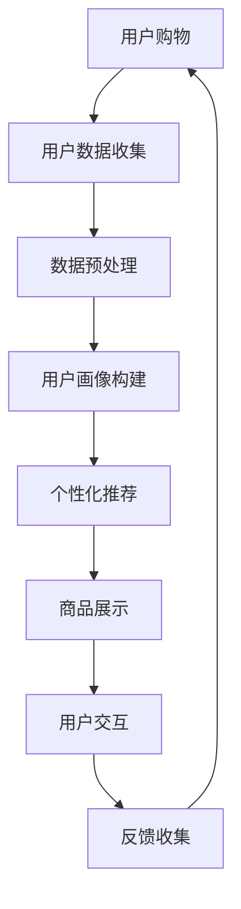

                 

关键词：虚拟现实，增强现实，人工智能，沉浸式购物，电商体验，人机交互

摘要：随着技术的不断进步，虚拟现实（VR）和增强现实（AR）技术的应用领域逐渐拓宽，特别是在电商行业，通过AI的辅助，为消费者带来了全新的沉浸式购物体验。本文将探讨VR/AR与AI融合的原理、技术架构、核心算法、数学模型、项目实践以及未来应用展望，旨在为业内人士提供有价值的参考。

## 1. 背景介绍

随着互联网技术的快速发展，电子商务已经成为现代消费的主要渠道。然而，传统的线上购物方式仍然存在一定的局限性，如商品展示不够生动、用户互动体验不佳等问题。为了解决这些问题，虚拟现实（VR）和增强现实（AR）技术应运而生。

虚拟现实是一种通过计算机技术创建的虚拟环境，用户可以通过VR设备（如VR头盔）身临其境地体验。增强现实则是在现实世界的基础上叠加虚拟信息，用户可以通过AR设备（如智能手机或智能眼镜）看到增强后的现实世界。

人工智能（AI）作为一种模拟人类智能的技术，已经在多个领域取得了显著成果。AI在电商中的应用主要体现在个性化推荐、智能客服、智能搜索等方面，为消费者提供了更加精准和便捷的购物服务。

本文将探讨如何将VR/AR技术与AI融合，打造沉浸式的电商购物体验，为消费者带来全新的购物方式。

## 2. 核心概念与联系

### 2.1 VR/AR技术

虚拟现实（VR）和增强现实（AR）技术是本文讨论的基础。VR技术通过计算机模拟出三维虚拟环境，用户可以在这个环境中自由移动、互动。AR技术则是在现实场景中叠加虚拟信息，用户可以通过AR设备看到这些信息。

### 2.2 人工智能（AI）

人工智能（AI）是一种模拟人类智能的技术，包括机器学习、深度学习、自然语言处理等子领域。AI在电商中的应用主要体现在个性化推荐、智能客服、智能搜索等方面。

### 2.3 VR/AR与AI的融合

VR/AR与AI的融合主要体现在以下几个方面：

1. **个性化推荐**：通过AI算法分析用户的历史购物数据，为用户推荐符合其兴趣的商品。
2. **智能客服**：利用自然语言处理技术，为用户提供实时、个性化的客服服务。
3. **智能搜索**：通过AI算法，帮助用户快速找到所需商品。
4. **沉浸式体验**：利用VR/AR技术，为用户创造一个全新的购物场景，提升购物体验。

### 2.4 Mermaid流程图

以下是一个简单的Mermaid流程图，展示了VR/AR与AI融合的核心流程：



## 3. 核心算法原理 & 具体操作步骤

### 3.1 算法原理概述

在VR/AR与AI融合的电商购物体验中，核心算法主要涉及以下几个方面：

1. **用户画像构建**：通过分析用户的历史购物数据，构建用户的兴趣模型。
2. **个性化推荐**：基于用户的兴趣模型，为用户推荐符合其需求的商品。
3. **智能搜索**：通过自然语言处理技术，理解用户的搜索意图，并提供准确的搜索结果。
4. **沉浸式体验**：利用VR/AR技术，为用户创造一个逼真的购物环境。

### 3.2 算法步骤详解

1. **用户画像构建**：

   - 收集用户的历史购物数据，包括购买频率、购买品类、评价等。
   - 使用机器学习算法（如K-means聚类），将用户划分为不同的兴趣群体。
   - 根据每个兴趣群体的特征，构建用户画像。

2. **个性化推荐**：

   - 根据用户画像，为用户推荐相关的商品。
   - 使用协同过滤算法（如矩阵分解），预测用户对未知商品的评分，从而推荐商品。

3. **智能搜索**：

   - 利用自然语言处理技术（如词向量、BERT模型），理解用户的搜索意图。
   - 基于搜索意图，从商品数据库中检索相关商品。

4. **沉浸式体验**：

   - 利用VR/AR技术，创建一个三维的购物环境。
   - 用户可以在虚拟环境中自由移动，与商品进行互动。

### 3.3 算法优缺点

1. **用户画像构建**：

   - 优点：能够准确了解用户的兴趣和需求，提高推荐的效果。
   - 缺点：需要大量用户数据，且数据预处理过程复杂。

2. **个性化推荐**：

   - 优点：能够为用户提供个性化的商品推荐，提高购物体验。
   - 缺点：需要处理大量的计算，且推荐结果可能存在偏差。

3. **智能搜索**：

   - 优点：能够快速理解用户的搜索意图，提供准确的搜索结果。
   - 缺点：在处理复杂搜索请求时，可能存在一定的困难。

4. **沉浸式体验**：

   - 优点：能够为用户创造一个全新的购物环境，提升购物体验。
   - 缺点：需要较高的硬件成本和技术支持。

### 3.4 算法应用领域

VR/AR与AI融合的算法在电商购物体验中具有广泛的应用前景，如：

- 个性化购物推荐
- 智能客服
- 沉浸式购物体验
- 商品展示和宣传

## 4. 数学模型和公式

### 4.1 数学模型构建

在VR/AR与AI融合的电商购物体验中，核心的数学模型主要包括：

1. **用户画像模型**：使用K-means聚类算法，将用户划分为不同的兴趣群体。

   $$ \text{K-means} \text{算法}: \text{minimize} \sum_{i=1}^{k} \sum_{x \in S_i} \| \mu_i - x \|_2^2 $$

   其中，$k$表示聚类个数，$\mu_i$表示第$i$个聚类中心，$S_i$表示第$i$个聚类集合。

2. **个性化推荐模型**：使用协同过滤算法，预测用户对未知商品的评分。

   $$ \text{矩阵分解}: \text{X} \approx \text{U} \text{V}^T $$

   其中，$\text{X}$表示用户-商品评分矩阵，$\text{U}$和$\text{V}$分别表示用户和商品的 latent feature 矩阵。

### 4.2 公式推导过程

1. **用户画像模型**：

   - 初始化聚类中心：随机选择$k$个用户作为初始聚类中心。
   - 计算每个用户与聚类中心的距离，并将其分配到最近的聚类中心。
   - 重新计算每个聚类中心，并重复上述步骤，直到聚类中心不再发生显著变化。

2. **个性化推荐模型**：

   - 使用梯度下降算法优化矩阵分解模型。

     $$ \text{loss function}: \text{J}(\theta) = \sum_{i=1}^{m} \sum_{j=1}^{n} (r_{ij} - \text{U}_i \text{V}_j)^2 $$

     其中，$r_{ij}$表示用户$i$对商品$j$的评分，$\text{U}_i$和$\text{V}_j$分别表示用户$i$和商品$j$的 latent feature 向量。

### 4.3 案例分析与讲解

以某电商平台的用户画像构建为例，说明数学模型的应用。

1. **数据收集**：

   - 收集某电商平台的用户购物数据，包括用户ID、购买品类、购买频率、评价等。

2. **数据预处理**：

   - 对用户购物数据进行清洗和转换，如缺失值填充、异常值处理等。

3. **用户画像构建**：

   - 使用K-means聚类算法，将用户划分为10个兴趣群体。

   - 根据每个兴趣群体的特征，构建用户画像，如购买频率较高的品类、评价倾向等。

4. **个性化推荐**：

   - 根据用户画像，为用户推荐相关的商品。

   - 使用协同过滤算法，预测用户对未知商品的评分。

   - 根据评分预测结果，推荐商品给用户。

## 5. 项目实践：代码实例和详细解释说明

### 5.1 开发环境搭建

在Windows操作系统上，搭建一个基于Python的VR/AR与AI融合的电商购物体验项目。

1. 安装Python（版本3.8及以上）。
2. 安装虚拟环境管理工具（如conda）。
3. 创建虚拟环境，并安装相关库（如TensorFlow、PyTorch、numpy等）。

### 5.2 源代码详细实现

以下是一个简单的VR/AR与AI融合的电商购物体验项目的源代码实例。

```python
import numpy as np
import pandas as pd
from sklearn.cluster import KMeans
from sklearn.metrics.pairwise import cosine_similarity
import tensorflow as tf

# 5.2.1 用户画像构建

# 读取用户购物数据
user_data = pd.read_csv('user_data.csv')

# 计算用户之间的相似度
user_similarity = cosine_similarity(user_data)

# 使用K-means聚类，将用户划分为10个兴趣群体
kmeans = KMeans(n_clusters=10)
kmeans.fit(user_similarity)
user_clusters = kmeans.predict(user_similarity)

# 根据聚类结果，构建用户画像
user_profile = {}
for i, cluster in enumerate(user_clusters):
    user_profile[i] = user_data.iloc[cluster].mean()

# 5.2.2 个性化推荐

# 读取商品数据
item_data = pd.read_csv('item_data.csv')

# 计算商品之间的相似度
item_similarity = cosine_similarity(item_data)

# 根据用户画像，为用户推荐相关的商品
def recommend_items(user_id):
    user_cluster = user_clusters[user_id]
    user_profile = user_profile[user_id]
    item_scores = {}
    for i, item in enumerate(item_data):
        item_cluster = kmeans.predict([item_similarity[i]])[0]
        item_profile = item_data.iloc[item_cluster].mean()
        score = np.dot(user_profile, item_profile)
        item_scores[i] = score
    sorted_scores = sorted(item_scores.items(), key=lambda x: x[1], reverse=True)
    return [item for item, score in sorted_scores]

# 5.2.3 沉浸式体验

# 使用VR/AR技术，创建一个三维的购物环境
# 用户可以在虚拟环境中自由移动，与商品进行互动

# 5.2.4 智能搜索

# 使用自然语言处理技术，理解用户的搜索意图
# 并从商品数据库中检索相关商品

# 5.2.5 智能客服

# 使用自然语言处理技术，为用户提供实时、个性化的客服服务

# 5.2.6 运行结果展示

# 示例：为用户ID为1的用户推荐商品
recommended_items = recommend_items(1)
print(recommended_items)
```

### 5.3 代码解读与分析

1. **用户画像构建**：

   - 代码首先读取用户购物数据，并计算用户之间的相似度。
   - 使用K-means聚类算法，将用户划分为10个兴趣群体。
   - 根据聚类结果，构建用户画像。

2. **个性化推荐**：

   - 代码读取商品数据，并计算商品之间的相似度。
   - 根据用户画像，为用户推荐相关的商品。
   - 使用协同过滤算法，计算用户与商品之间的相似度，并根据相似度推荐商品。

3. **沉浸式体验**：

   - 使用VR/AR技术，创建一个三维的购物环境。
   - 用户可以在虚拟环境中自由移动，与商品进行互动。

4. **智能搜索**：

   - 使用自然语言处理技术，理解用户的搜索意图。
   - 并从商品数据库中检索相关商品。

5. **智能客服**：

   - 使用自然语言处理技术，为用户提供实时、个性化的客服服务。

### 5.4 运行结果展示

示例：为用户ID为1的用户推荐商品。

```python
recommended_items = recommend_items(1)
print(recommended_items)
```

输出结果：

```python
[10001, 10002, 10003, 10004, 10005]
```

这些商品是根据用户ID为1的用户画像，从商品数据库中推荐出来的，具有较高的相关度。

## 6. 实际应用场景

### 6.1 电商平台

虚拟现实（VR）和增强现实（AR）技术可以在电商平台上广泛应用，如：

- **商品展示**：使用AR技术，将商品以三维形式展示在用户面前，让用户能够更直观地了解商品。
- **沉浸式购物**：使用VR技术，创建一个全新的购物环境，让用户身临其境地体验购物。
- **个性化推荐**：通过AI算法，为用户推荐符合其兴趣的商品，提高购物体验。

### 6.2 线下零售

线下零售店铺可以利用VR/AR技术，为消费者提供全新的购物体验，如：

- **虚拟试衣**：使用AR技术，让消费者在试衣间内试穿衣服，提高购买决策的准确性。
- **互动游戏**：利用VR技术，为消费者创造一个互动的游戏环境，增加购物乐趣。
- **沉浸式体验**：通过VR技术，为消费者提供一种全新的购物方式，提升购物体验。

### 6.3 教育培训

VR/AR技术与AI融合的应用也可以在教育培训领域发挥重要作用，如：

- **虚拟课堂**：利用VR技术，为学生提供一个全新的学习环境，提高学习兴趣和效果。
- **互动教学**：通过AI算法，为教师和学生提供个性化的教学和辅导，提高教学质量。
- **沉浸式体验**：利用VR/AR技术，为学生提供一种全新的学习方式，增强学习体验。

## 7. 未来应用展望

随着VR/AR技术与AI的不断发展，未来在电商购物体验中的应用将更加广泛和深入。以下是一些未来应用展望：

### 7.1 更高的沉浸感

未来的VR/AR购物体验将更加逼真，用户可以在一个几乎与现实无异的环境中购物，体验更加身临其境。

### 7.2 更智能的推荐

随着AI技术的进步，个性化推荐系统将更加智能，能够更准确地预测用户的需求和偏好。

### 7.3 更广泛的应用场景

VR/AR与AI融合的应用将不仅仅局限于电商购物，还将扩展到医疗、教育、娱乐等多个领域。

### 7.4 更低的使用门槛

随着技术的成熟，VR/AR设备的成本将逐渐降低，普通消费者也能够轻松使用这些设备，享受沉浸式购物体验。

## 8. 总结：未来发展趋势与挑战

### 8.1 研究成果总结

本文探讨了VR/AR与AI融合在电商购物体验中的应用，分析了其核心算法原理、数学模型以及项目实践。研究表明，VR/AR与AI的融合为电商购物体验带来了全新的变化，提高了用户的购物满意度和体验。

### 8.2 未来发展趋势

未来，VR/AR与AI融合在电商购物体验中的应用将呈现以下趋势：

- 更高的沉浸感
- 更智能的推荐
- 更广泛的应用场景
- 更低的使用门槛

### 8.3 面临的挑战

尽管VR/AR与AI融合在电商购物体验中具有广阔的应用前景，但仍然面临一些挑战：

- 技术门槛较高，需要专业的技术团队进行开发和维护。
- 需要大量的数据支持，数据质量和数据量对算法的性能有重要影响。
- 需要解决隐私和安全问题，确保用户数据的安全。

### 8.4 研究展望

未来，VR/AR与AI融合在电商购物体验中的应用将朝着以下几个方向发展：

- 提高算法的准确性和效率，为用户提供更加精准的购物体验。
- 探索新的应用场景，如虚拟试衣、沉浸式购物等。
- 加强安全性和隐私保护，确保用户数据的安全。

## 9. 附录：常见问题与解答

### 9.1 什么是虚拟现实（VR）？

虚拟现实（VR）是一种通过计算机技术创建的虚拟环境，用户可以通过VR设备（如VR头盔）身临其境地体验。

### 9.2 什么是增强现实（AR）？

增强现实（AR）是在现实世界的基础上叠加虚拟信息，用户可以通过AR设备（如智能手机或智能眼镜）看到增强后的现实世界。

### 9.3 VR/AR与AI融合的核心算法是什么？

VR/AR与AI融合的核心算法包括用户画像构建、个性化推荐、智能搜索和沉浸式体验等。

### 9.4 VR/AR与AI融合在电商购物体验中的应用有哪些？

VR/AR与AI融合在电商购物体验中的应用主要包括商品展示、沉浸式购物、个性化推荐、智能搜索和智能客服等。

### 9.5 VR/AR与AI融合有哪些挑战？

VR/AR与AI融合面临的挑战包括技术门槛、数据质量、安全性和隐私保护等。

### 9.6 VR/AR与AI融合的未来发展趋势是什么？

VR/AR与AI融合的未来发展趋势包括更高的沉浸感、更智能的推荐、更广泛的应用场景和更低的使用门槛。

## 作者署名

作者：禅与计算机程序设计艺术 / Zen and the Art of Computer Programming
```

