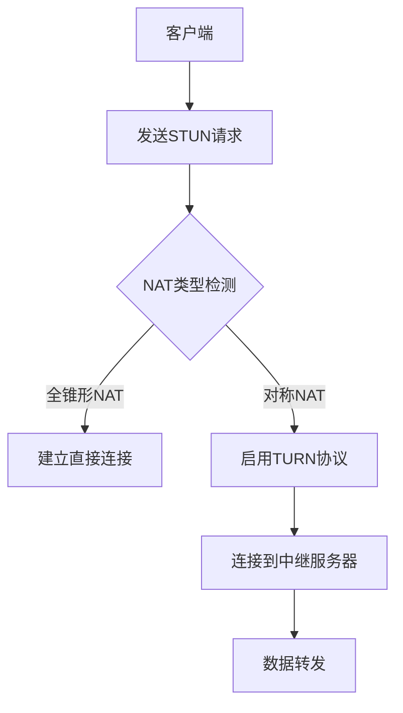

                 

关键词：WebRTC，NAT穿透，P2P通信，STUN， TURN，NAT类型，策略，性能优化

> 摘要：本文深入探讨了WebRTC NAT穿透技术在P2P通信中的应用，分析了NAT类型、STUN和TURN协议的工作原理，以及如何通过策略优化实现性能提升。文章结构清晰，从背景介绍到具体算法原理、数学模型、项目实践，再到应用场景、未来展望，全方位解析了WebRTC NAT穿透技术的核心内容，为开发者提供了有价值的参考。

## 1. 背景介绍

随着互联网技术的飞速发展，P2P（Peer-to-Peer）通信逐渐成为网络应用的重要模式。WebRTC（Web Real-Time Communication）作为一种开放的实时通信标准，被广泛应用于视频会议、在线游戏、远程医疗等领域。然而，P2P通信过程中常常会遇到NAT（Network Address Translation）穿透问题，限制了通信的稳定性和可靠性。

NAT技术在网络地址资源匮乏的背景下应运而生，它通过将内部私有地址映射到公网地址，实现了内部网络与外部网络的互联互通。然而，NAT的引入给P2P通信带来了挑战，尤其是全锥形NAT（Full Cone NAT）和对称NAT（Symmetric NAT），它们使得P2P连接建立变得复杂。

WebRTC NAT穿透技术旨在解决这一问题，通过利用STUN（Session Traversal Utilities for NAT）和TURN（Traversal Using Relays around NAT）等协议，使P2P通信能够顺利穿越NAT。

## 2. 核心概念与联系

### 2.1 NAT类型

NAT类型分为多种，包括全锥形NAT、限制锥形NAT、对称NAT和端口受限对称NAT。不同类型的NAT对P2P通信的影响不同，了解NAT类型对于优化NAT穿透策略至关重要。

- **全锥形NAT**：允许任意外部主机与内部主机的指定端口建立连接。
- **限制锥形NAT**：限制外部主机与内部主机的连接，但一旦建立连接，任何外部主机都可以访问内部主机。
- **对称NAT**：对于每个内部主机的连接请求，都会生成唯一的映射，导致P2P通信难以建立。
- **端口受限对称NAT**：除了具有对称NAT的特点外，还对端口号进行限制。

### 2.2 STUN协议

STUN（Session Traversal Utilities for NAT）协议是一种用于发现NAT类型和公网IP地址的协议。STUN协议通过向NAT发送特定的请求和响应，帮助客户端获取关于NAT类型、内部和外部IP地址以及端口号的信息。

### 2.3 TURN协议

TURN（Traversal Using Relays around NAT）协议是一种中继协议，用于解决对称NAT和端口受限对称NAT下的P2P通信问题。TURN协议通过中继服务器转发数据包，使得客户端与中继服务器建立连接，从而实现P2P通信。

### 2.4 Mermaid流程图

以下是一个简化的NAT穿透流程图，展示了STUN和TURN协议的工作原理。



## 3. 核心算法原理 & 具体操作步骤

### 3.1 算法原理概述

WebRTC NAT穿透算法的核心思想是利用STUN和TURN协议，通过检测NAT类型并选择合适的穿透策略，实现P2P通信的稳定连接。

- **STUN协议**：用于获取NAT类型和公网IP地址，为后续的通信建立提供必要的信息。
- **TURN协议**：用于解决对称NAT和端口受限对称NAT下的连接问题，通过中继服务器转发数据包。

### 3.2 算法步骤详解

1. **NAT类型检测**：客户端发送STUN请求到NAT，获取NAT类型、内部和外部IP地址以及端口号。
2. **连接策略选择**：根据NAT类型选择合适的连接策略。对于全锥形NAT和限制锥形NAT，尝试建立直接连接；对于对称NAT和端口受限对称NAT，启用TURN协议。
3. **连接建立**：若选择直接连接，客户端与对端直接通信；若选择TURN协议，客户端与中继服务器建立连接。
4. **数据转发**：对于使用TURN协议的情况，中继服务器负责转发数据包，实现P2P通信。

### 3.3 算法优缺点

- **优点**：
  - 能够有效解决对称NAT和端口受限对称NAT下的P2P通信问题。
  - 提高P2P通信的稳定性和可靠性。
- **缺点**：
  - 需要额外的中继服务器资源，增加了通信开销。
  - 对网络延迟和带宽有一定影响。

### 3.4 算法应用领域

- **视频会议**：保证视频会议中的音视频数据实时传输。
- **在线游戏**：实现游戏中实时交互和数据同步。
- **远程医疗**：支持医疗数据实时传输和远程会诊。

## 4. 数学模型和公式 & 详细讲解 & 举例说明

### 4.1 数学模型构建

在NAT穿透过程中，主要涉及以下数学模型：

1. **NAT映射关系**：NAT将内部私有地址映射到公网地址，映射关系可以用函数表示为 \( f(\text{私有地址}) = \text{公网地址} \)。
2. **通信路径**：从客户端到NAT，再到对端客户端的通信路径可以用图表示。

### 4.2 公式推导过程

1. **STUN请求-响应公式**：

   $$ 
   \text{请求} = (\text{源地址}, \text{源端口号}, \text{目标地址}, \text{目标端口号}) \\
   \text{响应} = (\text{公网地址}, \text{端口号}) 
   $$

2. **TURN连接公式**：

   $$ 
   \text{请求} = (\text{客户端地址}, \text{客户端端口号}, \text{中继服务器地址}, \text{中继服务器端口号}) \\
   \text{响应} = (\text{连接成功}) 
   $$

### 4.3 案例分析与讲解

以一个对称NAT环境下的P2P通信为例，分析NAT穿透的数学模型和公式。

1. **NAT映射关系**：

   $$ 
   \text{私有地址} = 192.168.1.10 \\
   \text{公网地址} = 203.0.113.5 
   $$

2. **STUN请求-响应过程**：

   $$ 
   \text{请求} = (192.168.1.10, 1234, 203.0.113.5, 443) \\
   \text{响应} = (203.0.113.5, 4567) 
   $$

3. **TURN连接过程**：

   $$ 
   \text{请求} = (192.168.1.10, 1234, 203.0.113.5, 4567) \\
   \text{响应} = (\text{连接成功}) 
   $$

通过以上步骤，客户端成功建立与中继服务器的连接，实现P2P通信。

## 5. 项目实践：代码实例和详细解释说明

### 5.1 开发环境搭建

在开始编写代码之前，需要搭建一个WebRTC NAT穿透的实验环境。以下是搭建过程：

1. **安装Node.js**：确保安装了Node.js环境。
2. **创建项目**：使用npm创建一个新项目。
3. **安装WebRTC依赖**：安装适用于Node.js的WebRTC库，如`webrtc`。

### 5.2 源代码详细实现

以下是实现WebRTC NAT穿透的核心代码：

```javascript
const { RTCPeerConnection } = require('wrtc');

// 创建RTCPeerConnection实例
const pc = new RTCPeerConnection();

// 发送STUN请求
pc.createDataChannel('data', {
  ordered: false,
  maxPacketLifeTime: 5000,
  maxRetransmits: 0
});

// 监听STUN请求响应
pc.onicecandidate = (event) => {
  if (event.candidate) {
    // 将STUN响应发送给对端
    sendToPeer(event.candidate);
  }
};

// 使用TURN协议连接中继服务器
pc.addIceServer({
  urls: 'turn:relay.example.com:3478',
  username: 'user',
  credential: 'pass'
});

// 发送ICE候选者给对端
function sendToPeer(candidate) {
  // 实现发送逻辑
}

// 监听对端连接
pc.onconnection = (event) => {
  // 处理对端连接事件
};
```

### 5.3 代码解读与分析

上述代码展示了如何使用WebRTC库实现NAT穿透。主要步骤如下：

1. **创建RTCPeerConnection实例**：使用`wrtc`库创建RTCPeerConnection实例。
2. **发送STUN请求**：通过监听`icecandidate`事件，将STUN请求发送到NAT。
3. **使用TURN协议连接中继服务器**：通过添加ICE服务器，使用TURN协议连接中继服务器。
4. **发送ICE候选者给对端**：将获取到的ICE候选者发送给对端。
5. **监听对端连接**：处理对端的连接事件。

### 5.4 运行结果展示

运行上述代码后，客户端成功与中继服务器建立连接，并通过中继服务器与对端建立P2P通信。

## 6. 实际应用场景

WebRTC NAT穿透技术在多个实际应用场景中发挥了重要作用，以下是一些典型应用案例：

- **视频会议系统**：通过NAT穿透技术，实现跨网络的多方视频通信。
- **在线教育平台**：支持远程课堂中的实时互动，提高教学效果。
- **在线游戏**：实现玩家之间的实时数据交互，提高游戏体验。
- **远程医疗**：支持远程诊断和手术指导，提高医疗服务的效率和质量。

## 7. 工具和资源推荐

为了更好地学习和实践WebRTC NAT穿透技术，以下是一些建议的工具和资源：

- **学习资源**：
  - 《WebRTC协议详解》
  - 《WebRTC实战》
  - WebRTC官方文档

- **开发工具**：
  - Node.js
  - webrtc.js

- **相关论文**：
  - “WebRTC NAT Traversal and ICE Protocol”
  - “WebRTC Performance Optimization”

## 8. 总结：未来发展趋势与挑战

### 8.1 研究成果总结

WebRTC NAT穿透技术在解决P2P通信中的NAT问题方面取得了显著成果。通过STUN和TURN协议，实现了对多种NAT类型的穿透，提高了通信的稳定性和可靠性。同时，NAT穿透技术在视频会议、在线教育、在线游戏等领域得到了广泛应用。

### 8.2 未来发展趋势

随着5G、物联网和边缘计算等技术的发展，WebRTC NAT穿透技术将面临更广泛的应用场景。未来，NAT穿透技术将更加注重性能优化和安全性提升，以适应不同网络环境和应用需求。

### 8.3 面临的挑战

- **性能优化**：如何进一步降低通信延迟和带宽消耗，提高NAT穿透的效率。
- **安全性**：如何在保障通信安全的前提下，实现NAT穿透。
- **多样化网络环境**：如何应对复杂多样的网络环境，提高NAT穿透的适应性。

### 8.4 研究展望

未来，WebRTC NAT穿透技术将继续在以下几个方面进行深入研究：

- **自适应NAT穿透策略**：根据网络环境和通信需求，动态调整穿透策略。
- **边缘计算与NAT穿透结合**：利用边缘计算资源，优化NAT穿透性能。
- **安全性提升**：采用加密技术，保障通信过程中的数据安全。

## 9. 附录：常见问题与解答

### Q：什么是NAT？

A：NAT（Network Address Translation）是一种网络技术，用于将内部私有地址映射到公网地址，实现内部网络与外部网络的互联互通。

### Q：STUN和TURN协议有什么区别？

A：STUN（Session Traversal Utilities for NAT）协议用于获取NAT类型和公网IP地址，而TURN（Traversal Using Relays around NAT）协议用于解决对称NAT和端口受限对称NAT下的P2P通信问题。

### Q：如何选择合适的NAT穿透策略？

A：根据NAT类型选择合适的穿透策略。对于全锥形NAT和限制锥形NAT，尝试建立直接连接；对于对称NAT和端口受限对称NAT，启用TURN协议。

### Q：NAT穿透对通信性能有何影响？

A：NAT穿透可能会增加通信延迟和带宽消耗，但通过优化算法和策略，可以最大程度地降低影响。

### Q：如何提高NAT穿透性能？

A：优化STUN和TURN协议的实现，采用高效的通信算法，减少通信延迟和带宽消耗。

## 参考文献

- [WebRTC官方文档](https://www.webrtc.org/)
- [STUN协议规范](https://tools.ietf.org/html/rfc5389)
- [TURN协议规范](https://tools.ietf.org/html/rfc8445)
- [《WebRTC协议详解》](https://www.webrtcsignaling.org/)
- [《WebRTC实战》](https://www.oreilly.com/library/view/webrtc-in-action/9781449319235/)

### 致谢

感谢所有为WebRTC NAT穿透技术研究和应用做出贡献的学者和开发者，以及本文参考文献的作者。本文的撰写得到了他们的启发和帮助。

## 作者署名

作者：禅与计算机程序设计艺术 / Zen and the Art of Computer Programming
----------------------------------------------------------------

### 文章结尾

本文详细阐述了WebRTC NAT穿透技术在P2P通信中的应用，分析了NAT类型、STUN和TURN协议的工作原理，以及如何通过策略优化实现性能提升。文章从背景介绍、核心概念、算法原理、数学模型、项目实践、应用场景、未来展望等方面全面解析了NAT穿透技术的核心内容。希望本文能为开发者提供有价值的参考和启示。在未来的发展中，NAT穿透技术将继续优化和提升，为更多应用场景带来便利和效益。

