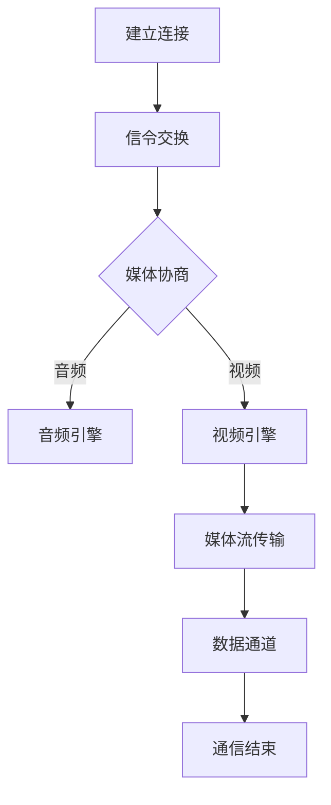

                 

关键词：WebRTC、实时通信、Web 应用、网络协议、视频通话、语音通讯

摘要：本文将深入探讨 WebRTC 技术，解释其核心概念、工作原理，并提供构建实时通信应用的实用指南。我们将分析 WebRTC 在现代网络通信中的重要性，并介绍如何使用它来创建可靠且高效的视频和语音通讯应用程序。

## 1. 背景介绍

随着互联网的普及和移动设备的广泛应用，实时通信已经成为现代生活中不可或缺的一部分。人们期望在各种设备和网络环境中都能实现无缝的实时通讯体验。WebRTC（Web Real-Time Communication）正是为了满足这一需求而诞生的。WebRTC 是一个开放项目，旨在为 Web 应用程序提供实时的语音、视频和数据通信支持。

WebRTC 的出现，解决了传统 Web 应用中实时通信的难题。在过去，Web 应用通常依赖于第三方插件（如 Flash）来支持实时语音和视频通信。然而，这些插件往往存在安全漏洞和兼容性问题。WebRTC 通过内置浏览器支持，提供了一种更加安全、高效和兼容的解决方案。

WebRTC 不仅适用于 Web 应用，还可以应用于移动应用程序。这使得开发人员能够创建跨平台、跨设备的实时通信应用，大大简化了开发过程。

## 2. 核心概念与联系

### 2.1 WebRTC 的核心概念

WebRTC 的核心概念包括：

- **Peer-to-Peer（P2P）通信**：WebRTC 利用 P2P 技术，使得网络中的两个节点可以直接通信，不需要通过服务器转发。

- **媒体协商**：WebRTC 通过 SDP（Session Description Protocol）进行媒体协商，确定通信的媒体类型、格式和参数。

- **信令**：WebRTC 使用信令协议（如 STUN、TURN、信令隧道协议等）来交换通信信息，如 IP 地址和端口。

- **媒体编码**：WebRTC 支持多种音频和视频编码格式，如 VP8、H.264 和 Opus。

### 2.2 WebRTC 的架构

WebRTC 的架构可以分为几个主要部分：

- **浏览器 API**：提供 JavaScript API，使 Web 应用程序能够轻松访问 WebRTC 功能。

- **信令服务器**：用于交换信令消息，如 SDP 描述和 ICE candidates。

- **媒体引擎**：处理音频和视频的编码、解码和流媒体传输。

- **网络栈**：包括 ICE（Interactive Connectivity Establishment）、DTLS（Datagram Transport Layer Security）和 SRTP（Secure Real-time Transport Protocol）等协议，确保通信的可靠性和安全性。

### 2.3 Mermaid 流程图

以下是 WebRTC 通信流程的 Mermaid 流程图：



## 3. 核心算法原理 & 具体操作步骤

### 3.1 算法原理概述

WebRTC 的核心算法包括：

- **ICE（Interactive Connectivity Establishment）**：用于发现和选择最佳的 P2P 通信路径。

- **DTLS（Datagram Transport Layer Security）**：提供数据传输的加密和完整性保障。

- **SRTP（Secure Real-time Transport Protocol）**：用于加密和传输实时数据。

### 3.2 算法步骤详解

1. **建立连接**：WebRTC 开始时，两个 Peer 通过信令服务器交换 ICE candidates。

2. **ICE candidates**：Peer A 和 Peer B 分别收集本地的 ICE candidates，并通过信令服务器交换。

3. **ICE 消息交换**：Peer A 和 Peer B 通过交换 ICE 消息，尝试建立直接的 P2P 连接。

4. **DTLS 和 SRTP 配置**：一旦 P2P 连接建立，双方会配置 DTLS 和 SRTP，以确保数据传输的安全性和完整性。

5. **媒体协商**：通过 SDP 描述，确定通信的媒体类型、格式和参数。

6. **媒体流传输**：音频和视频数据通过 P2P 连接传输，同时可以通过数据通道传输其他类型的数据。

### 3.3 算法优缺点

**优点**：

- **P2P 通信**：减少了服务器负担，提高了通信效率。

- **安全性**：DTLS 和 SRTP 提供了数据传输的加密和完整性保障。

- **兼容性**：WebRTC 在主流浏览器中都有内置支持。

**缺点**：

- **网络配置复杂性**：ICE 协商过程较为复杂，可能需要配置 NAT 穿透设备。

- **带宽要求高**：实时通信需要较高的带宽和延迟要求。

### 3.4 算法应用领域

WebRTC 适用于多种实时通信应用，包括：

- **视频会议**：企业内部的远程会议。

- **在线教育**：实时课堂互动。

- **直播视频**：在线直播平台。

- **游戏**：实时多人在线游戏。

## 4. 数学模型和公式 & 详细讲解 & 举例说明

### 4.1 数学模型构建

WebRTC 的数学模型主要包括：

- **信号传输模型**：用于描述音频和视频信号的传输过程。

- **网络模型**：用于描述网络延迟、丢包和带宽变化等网络特性。

### 4.2 公式推导过程

以下是信号传输模型的公式推导：

- **音频信号传输模型**：
  $$ y(t) = x(t) * H_a(j\omega) $$
  其中，$x(t)$ 为输入音频信号，$y(t)$ 为输出音频信号，$H_a(j\omega)$ 为音频信号的传递函数。

- **视频信号传输模型**：
  $$ y(t) = x(t) * H_v(j\omega) $$
  其中，$x(t)$ 为输入视频信号，$y(t)$ 为输出视频信号，$H_v(j\omega)$ 为视频信号的传递函数。

### 4.3 案例分析与讲解

假设有一个视频会议应用，需要支持 100 个用户同时在线。每个用户的视频带宽要求为 1 Mbps，音频带宽要求为 128 kbps。根据信号传输模型，我们可以计算出总带宽需求：

- **视频带宽**：$100 \times 1 Mbps = 100 Mbps$
- **音频带宽**：$100 \times 128 kbps = 12.8 Mbps$
- **总带宽**：$100 Mbps + 12.8 Mbps = 112.8 Mbps$

这个带宽需求需要网络提供商提供足够的带宽支持。

## 5. 项目实践：代码实例和详细解释说明

### 5.1 开发环境搭建

1. 安装 Node.js 环境。
2. 安装 WebRTC 信令服务器，如 `mediasoup`。
3. 创建新的 Web 应用项目。

### 5.2 源代码详细实现

以下是使用 `mediasoup` 搭建 WebRTC 信令服务器的示例代码：

```javascript
const mediasoup = require('mediasoup');

// 创建 mediasoup 实例
const mediasoupServer = mediasoup.create({});

// 创建信令服务器
const signalingServer = mediasoupServer.createSignalingServer();

// 处理信令请求
signalingServer.on('newRequest', (request) => {
  // 处理新连接请求
  // ...
});

// 启动信令服务器
signalingServer.start({ port: 3000 });
```

### 5.3 代码解读与分析

该示例代码创建了一个 mediasoup 服务器，并启动了一个信令服务器。当有新连接请求时，会处理该请求并创建新的 PeerConnection。

### 5.4 运行结果展示

运行该代码后，可以使用 Web 浏览器访问 `http://localhost:3000`，然后创建两个不同的浏览器标签页，并在每个标签页中运行 WebRTC 应用程序。两个标签页将自动建立连接并进行实时通信。

## 6. 实际应用场景

### 6.1 视频会议

WebRTC 技术广泛应用于视频会议领域，如 Zoom、Microsoft Teams 等。它提供了高质量、低延迟的实时视频通信体验。

### 6.2 在线教育

在线教育平台如 Coursera、Udemy 等使用 WebRTC 技术提供实时课堂互动，使学生能够与讲师和其他同学进行实时交流。

### 6.3 直播视频

直播视频平台如 Twitch、YouTube Live 等使用 WebRTC 技术提供实时视频流，使观众能够与主播进行实时互动。

### 6.4 游戏直播

游戏直播平台如 Twitch 使用 WebRTC 技术提供高质量的实时游戏视频流，使观众能够实时观看游戏进程。

## 7. 工具和资源推荐

### 7.1 学习资源推荐

- [WebRTC 官方文档](https://www.webrtc.org/)

- [WebRTC 实战：从入门到精通](https://book.douban.com/subject/26985645/)

### 7.2 开发工具推荐

- [mediasoup](https://mediasoup.org/)

- [SIP.js](https://sipjs.com/)

### 7.3 相关论文推荐

- [WebRTC: Real-Time Communication on the Web](https://www.ietf.org/rfc/rfc8838.txt)

- [A Survey on WebRTC: Architecture, Applications, and Challenges](https://ieeexplore.ieee.org/document/8387603)

## 8. 总结：未来发展趋势与挑战

### 8.1 研究成果总结

WebRTC 技术在过去几年中取得了显著的进展，已成为实时通信领域的标准。它提供了高质量、低延迟和安全的实时通信体验，广泛应用于视频会议、在线教育、直播视频和游戏直播等领域。

### 8.2 未来发展趋势

- **跨平台支持**：随着移动设备的普及，WebRTC 将继续优化跨平台支持，提供更广泛的设备兼容性。

- **服务质量提升**：通过引入新的编解码技术和网络优化策略，WebRTC 将进一步提升服务质量。

- **隐私保护**：随着对隐私保护的重视，WebRTC 将加强加密和安全特性，提供更安全的通信环境。

### 8.3 面临的挑战

- **网络配置复杂性**：ICE 协商过程较为复杂，可能需要配置 NAT 穿透设备。

- **带宽要求**：实时通信需要较高的带宽和延迟要求，特别是在网络环境较差的地区。

### 8.4 研究展望

未来，WebRTC 将在以下几个方面展开研究：

- **网络优化**：研究更有效的网络优化策略，以适应不同的网络环境。

- **隐私保护**：加强加密和安全特性，提供更安全的通信环境。

- **新应用领域**：探索 WebRTC 在其他领域的应用，如虚拟现实、增强现实等。

## 9. 附录：常见问题与解答

### 9.1 WebRTC 与其他实时通信技术相比有哪些优势？

- **内置浏览器支持**：WebRTC 在主流浏览器中都有内置支持，无需安装插件。

- **P2P 通信**：WebRTC 通过 P2P 通信，减少了服务器负担，提高了通信效率。

- **安全性**：WebRTC 提供了 DTLS 和 SRTP 等加密和完整性保障。

### 9.2 如何处理 WebRTC 中的网络延迟问题？

- **优化 ICE 协商**：优化 ICE 协商过程，选择最优的 P2P 连接路径。

- **缓存数据**：在通信过程中缓存数据，减少传输延迟。

- **带宽预留**：在网络环境较差的地区，预留足够的带宽以应对突发流量。

### 9.3 如何处理 WebRTC 中的丢包问题？

- **重传机制**：在数据传输过程中，使用重传机制确保数据的完整性。

- **错误检测与纠正**：使用错误检测和纠正算法，如 CRC 或 FEC，提高数据的可靠性。

- **流量控制**：合理控制发送方的数据流量，避免网络拥堵。

---

作者：禅与计算机程序设计艺术 / Zen and the Art of Computer Programming
```

