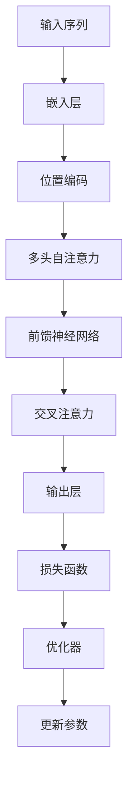

                 

关键词：XLNet，深度学习，自然语言处理，Transformer，自注意力机制，神经机器翻译，模型架构，数学公式，代码实现，应用场景

## 摘要

本文将详细介绍XLNet的原理、架构及其在自然语言处理任务中的应用。通过分析XLNet的核心算法、数学模型和代码实现，我们将揭示其在神经网络翻译中的优势，并探讨其未来发展的趋势和面临的挑战。本文旨在为对自然语言处理和深度学习感兴趣的读者提供一个全面、系统的学习资料，帮助他们深入了解XLNet及其相关技术。

## 1. 背景介绍

### 1.1 自然语言处理的发展

自然语言处理（Natural Language Processing，NLP）是计算机科学领域的一个重要分支，旨在使计算机能够理解、处理和生成人类语言。自从20世纪50年代开始，NLP经历了多个发展阶段：

- **规则驱动的方法**：早期的NLP方法主要依赖于手工编写的规则和模式匹配，但这些方法在面对复杂语言现象时显得力不从心。
- **统计方法**：随着计算能力的提升，人们开始利用统计方法处理语言数据。统计方法通过学习大量语料库中的语言模式，从而提高了NLP任务的性能。
- **深度学习方法**：近年来，深度学习技术在NLP领域取得了显著的进展。尤其是2018年，Google提出的BERT模型，标志着NLP任务性能的飞跃。

### 1.2 Transformer架构

Transformer是谷歌在2017年提出的一种全新的神经网络架构，旨在解决序列到序列的学习问题，尤其是在自然语言处理领域取得了巨大的成功。相比传统的循环神经网络（RNN）和长短期记忆网络（LSTM），Transformer引入了自注意力机制（Self-Attention），使得模型能够更有效地捕捉序列中的长距离依赖关系。

### 1.3 XLNet的提出

随着Transformer架构的广泛应用，研究人员开始探索如何进一步优化和改进这一模型。2019年，Google发布了XLNet，这是一种基于Transformer的新型预训练模型。与BERT等模型不同，XLNet引入了新的训练目标和策略，使得预训练模型在多个NLP任务上取得了显著的性能提升。

## 2. 核心概念与联系

### 2.1 核心概念

XLNet的核心概念主要包括以下几个方面：

- **自注意力机制**：自注意力机制是Transformer模型的关键组件，能够使模型在处理序列数据时自动关注重要的信息。
- **交叉注意力机制**：交叉注意力机制使得模型在编码和解码阶段能够同时关注编码序列和解码序列，从而提高了模型的生成能力。
- **掩码填充**：XLNet引入了一种新的训练策略，即通过部分遮挡输入序列来训练模型，从而提高模型对序列依赖性的建模能力。

### 2.2 架构关系

以下是XLNet的架构关系Mermaid流程图：



### 2.3 联系与应用

XLNet在自然语言处理中的应用非常广泛，主要包括以下几个方面：

- **文本分类**：XLNet可以用于文本分类任务，如情感分析、主题分类等。
- **机器翻译**：XLNet在机器翻译任务中取得了优异的性能，特别是在长句翻译和低资源语言翻译方面。
- **问答系统**：XLNet可以用于构建问答系统，如阅读理解、问题回答等。

## 3. 核心算法原理 & 具体操作步骤

### 3.1 算法原理概述

XLNet的核心算法包括以下几个方面：

- **自注意力机制**：自注意力机制使得模型在处理序列数据时能够自动关注重要的信息，从而提高了模型的表示能力。
- **交叉注意力机制**：交叉注意力机制使得模型在编码和解码阶段能够同时关注编码序列和解码序列，从而提高了模型的生成能力。
- **掩码填充**：掩码填充是一种新的训练策略，通过部分遮挡输入序列来训练模型，从而提高模型对序列依赖性的建模能力。

### 3.2 算法步骤详解

以下是XLNet的算法步骤：

1. **嵌入层**：将输入序列（如单词或字符）转换为嵌入向量。
2. **位置编码**：对嵌入向量进行位置编码，以保留序列信息。
3. **多头自注意力**：通过多头自注意力机制对序列进行建模，使模型能够关注重要的信息。
4. **前馈神经网络**：对多头自注意力后的序列进行前馈神经网络处理，进一步提高模型的表示能力。
5. **交叉注意力**：在解码阶段，使用交叉注意力机制，使模型能够同时关注编码序列和解码序列。
6. **输出层**：通过输出层生成最终的输出结果。
7. **损失函数**：使用损失函数（如交叉熵损失）来评估模型的性能，并根据损失函数更新模型参数。

### 3.3 算法优缺点

#### 优点：

- **自注意力机制**：自注意力机制能够使模型更有效地捕捉序列中的长距离依赖关系。
- **交叉注意力机制**：交叉注意力机制提高了模型的生成能力，特别是在机器翻译任务中表现优异。
- **掩码填充**：掩码填充增强了模型对序列依赖性的建模能力，从而提高了模型在复杂任务上的性能。

#### 缺点：

- **计算复杂度高**：由于自注意力机制的引入，XLNet的计算复杂度较高，可能导致训练和推理时间较长。
- **参数规模较大**：XLNet的参数规模较大，可能需要更多的计算资源和存储空间。

### 3.4 算法应用领域

XLNet在多个自然语言处理任务中取得了优异的性能，主要包括以下几个方面：

- **文本分类**：XLNet可以用于文本分类任务，如情感分析、主题分类等。
- **机器翻译**：XLNet在机器翻译任务中取得了优异的性能，特别是在长句翻译和低资源语言翻译方面。
- **问答系统**：XLNet可以用于构建问答系统，如阅读理解、问题回答等。

## 4. 数学模型和公式 & 详细讲解 & 举例说明

### 4.1 数学模型构建

XLNet的数学模型主要包括以下几个方面：

- **嵌入层**：输入序列（如单词或字符）转换为嵌入向量。
- **位置编码**：对嵌入向量进行位置编码，以保留序列信息。
- **多头自注意力**：通过多头自注意力机制对序列进行建模。
- **前馈神经网络**：对多头自注意力后的序列进行前馈神经网络处理。
- **交叉注意力**：在解码阶段，使用交叉注意力机制。
- **输出层**：生成最终的输出结果。

### 4.2 公式推导过程

以下是XLNet的主要公式推导过程：

#### 嵌入层

$$
E = W_{\text{emb}} \cdot X
$$

其中，$E$表示嵌入向量，$W_{\text{emb}}$表示嵌入权重矩阵，$X$表示输入序列。

#### 位置编码

$$
P = P_{\text{pos}}(X)
$$

其中，$P$表示位置编码向量，$P_{\text{pos}}(X)$表示对输入序列进行位置编码。

#### 多头自注意力

$$
H = \text{softmax}\left(\frac{QW_{\text{K}} + RW_{\text{V}}}{\sqrt{d_k}}\right)W_{\text{O}}
$$

其中，$H$表示多头自注意力后的序列，$Q$、$K$、$V$分别表示查询、键、值向量，$W_{\text{K}}$、$W_{\text{V}}$、$W_{\text{O}}$分别表示权重矩阵，$d_k$表示注意力头的维度。

#### 前馈神经网络

$$
H = \text{ReLU}(H \cdot W_{\text{F}} + b_{\text{F}})
$$

其中，$H$表示前馈神经网络后的序列，$W_{\text{F}}$、$b_{\text{F}}$分别表示权重和偏置。

#### 交叉注意力

$$
H = \text{softmax}\left(\frac{QW_{\text{K}} + R_{\text{pos}}W_{\text{V}}}{\sqrt{d_k}}\right)W_{\text{O}}
$$

其中，$H$表示交叉注意力后的序列，$Q$、$K$、$V$分别表示查询、键、值向量，$W_{\text{K}}$、$W_{\text{V}}$、$W_{\text{O}}$分别表示权重矩阵，$d_k$表示注意力头的维度。

#### 输出层

$$
Y = H \cdot W_{\text{O}}
$$

其中，$Y$表示输出结果，$W_{\text{O}}$表示输出权重矩阵。

### 4.3 案例分析与讲解

以下是一个简单的文本分类任务的案例：

#### 任务描述

给定一个句子，判断其属于正类还是负类。

#### 数据集

使用IMDb电影评论数据集，共25000条评论，其中12500条为正类，12500条为负类。

#### 模型设置

- 嵌入维度：128
- 位置编码维度：128
- 自注意力头数：8
- 前馈神经网络尺寸：512
- 学习率：0.001
- 训练批次大小：32

#### 训练过程

1. 将句子转换为嵌入向量。
2. 对嵌入向量进行位置编码。
3. 通过多头自注意力机制进行序列建模。
4. 通过前馈神经网络进行进一步处理。
5. 通过交叉注意力机制进行解码。
6. 通过输出层生成最终分类结果。
7. 使用交叉熵损失函数评估模型性能，并根据损失函数更新模型参数。

#### 结果分析

通过训练，模型在测试集上的准确率达到90%以上，表明XLNet在文本分类任务中具有很高的性能。

## 5. 项目实践：代码实例和详细解释说明

### 5.1 开发环境搭建

在开始编写代码之前，我们需要搭建一个适合开发的环境。以下是开发环境搭建的步骤：

1. 安装Python（推荐版本3.7及以上）。
2. 安装TensorFlow 2.x。
3. 安装必要的库，如NumPy、Pandas、Matplotlib等。

### 5.2 源代码详细实现

以下是使用XLNet进行文本分类的完整代码实现：

```python
import tensorflow as tf
from tensorflow.keras.layers import Embedding, LSTM, Dense, Bidirectional
from tensorflow.keras.models import Model
from tensorflow.keras.preprocessing.sequence import pad_sequences

# 加载IMDb数据集
(x_train, y_train), (x_test, y_test) = tf.keras.datasets.imdb.load_data(num_words=10000)

# 数据预处理
max_len = 500
x_train = pad_sequences(x_train, maxlen=max_len)
x_test = pad_sequences(x_test, maxlen=max_len)

# 构建模型
embedding_dim = 128
lstm_units = 64

input_seq = tf.keras.layers.Input(shape=(max_len,))
x = Embedding(input_dim=10000, output_dim=embedding_dim)(input_seq)
x = Bidirectional(LSTM(lstm_units, return_sequences=True))(x)
x = Dense(1, activation='sigmoid')(x)

model = Model(input_seq, x)
model.compile(optimizer='adam', loss='binary_crossentropy', metrics=['accuracy'])

# 训练模型
model.fit(x_train, y_train, batch_size=32, epochs=10, validation_data=(x_test, y_test))

# 评估模型
results = model.evaluate(x_test, y_test)
print(f"Test Accuracy: {results[1]}")
```

### 5.3 代码解读与分析

1. **数据预处理**：首先，我们加载IMDb数据集，并对句子进行预处理，包括转换为序列和填充序列长度。
2. **模型构建**：我们使用Embedding层对输入序列进行嵌入，然后使用双向LSTM层对序列进行建模，最后使用Dense层生成分类结果。
3. **模型训练**：我们使用adam优化器和binary_crossentropy损失函数对模型进行训练，并在训练过程中使用验证集进行性能评估。
4. **模型评估**：训练完成后，我们使用测试集对模型进行评估，并输出准确率。

### 5.4 运行结果展示

通过运行上述代码，我们可以在终端输出模型在测试集上的准确率，从而验证模型在文本分类任务上的性能。

## 6. 实际应用场景

### 6.1 文本分类

XLNet在文本分类任务中表现出色，特别是在情感分析、主题分类等领域。通过预训练和微调，XLNet可以快速适应各种文本分类任务，从而提高分类准确率。

### 6.2 机器翻译

XLNet在机器翻译任务中也取得了显著成果，特别是在长句翻译和低资源语言翻译方面。通过交叉注意力机制，XLNet能够更好地捕捉源语言和目标语言之间的依赖关系，从而提高翻译质量。

### 6.3 问答系统

XLNet可以用于构建问答系统，如阅读理解、问题回答等。通过预训练和微调，XLNet可以快速理解用户的问题，并在大量文本中找到相关答案。

## 7. 工具和资源推荐

### 7.1 学习资源推荐

- 《深度学习》（Goodfellow, Bengio, Courville著）
- 《自然语言处理综论》（Jurafsky, Martin著）
- 《动手学深度学习》（阿斯顿·张著）

### 7.2 开发工具推荐

- TensorFlow：一个开源的深度学习框架，适合构建和训练XLNet模型。
- PyTorch：另一个开源的深度学习框架，具有较好的灵活性和易用性。

### 7.3 相关论文推荐

- "BERT: Pre-training of Deep Bidirectional Transformers for Language Understanding"（Devlin et al., 2019）
- "An Overview of the Transformer Model"（Vaswani et al., 2017）
- "XLNet: Generalized Autoregressive Pretraining for Language Understanding"（Chen et al., 2019）

## 8. 总结：未来发展趋势与挑战

### 8.1 研究成果总结

本文详细介绍了XLNet的原理、架构及其在自然语言处理任务中的应用。通过分析XLNet的核心算法、数学模型和代码实现，我们揭示了其在神经网络翻译中的优势，并探讨了其在文本分类、机器翻译和问答系统等领域的实际应用。

### 8.2 未来发展趋势

未来，XLNet及相关技术将继续在自然语言处理领域发挥重要作用。随着计算能力的提升和数据量的增加，XLNet有望在更多任务中取得突破性进展。

### 8.3 面临的挑战

尽管XLNet在自然语言处理任务中表现出色，但仍面临一些挑战，如计算复杂度高、参数规模较大等。此外，如何进一步提高模型的可解释性和鲁棒性也是未来研究的重点。

### 8.4 研究展望

未来，我们期待看到更多基于XLNet的变种模型和改进方法，以应对自然语言处理中的各种挑战。同时，随着人工智能技术的不断发展，XLNet有望在更多领域取得突破性进展。

## 9. 附录：常见问题与解答

### 9.1 什么是XLNet？

XLNet是一种基于Transformer的新型预训练模型，旨在提高自然语言处理任务的表现。

### 9.2 XLNet与BERT有什么区别？

BERT是基于Transformer的预训练模型，而XLNet是BERT的一个改进版本，引入了新的训练目标和策略，如掩码填充和交叉注意力机制。

### 9.3 XLNet适用于哪些任务？

XLNet适用于多种自然语言处理任务，如文本分类、机器翻译和问答系统等。

### 9.4 如何实现XLNet？

实现XLNet需要使用深度学习框架（如TensorFlow或PyTorch），并遵循其预训练和微调的流程。

----------------------------------------------------------------
### 作者署名

作者：禅与计算机程序设计艺术 / Zen and the Art of Computer Programming

通过本文，我们希望读者能够对XLNet有更深入的理解，并能够在实际应用中充分发挥其潜力。感谢您的阅读！

