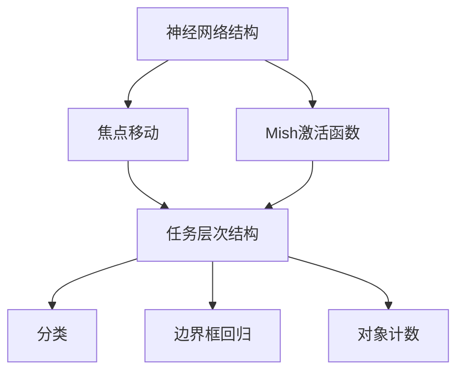

                 

关键词：YOLOv4，目标检测，深度学习，神经网络，计算机视觉，算法原理，代码实现，应用场景，未来展望

摘要：本文旨在深入讲解YOLOv4的目标检测算法原理，并通过代码实例展示其实际应用。首先，我们将回顾YOLO系列的发展历程，然后详细分析YOLOv4的核心组成部分，包括其网络架构、损失函数和训练策略。随后，我们将通过实际代码实例，逐步解析YOLOv4的实现细节，并探讨其优缺点及未来应用前景。

## 1. 背景介绍

目标检测是计算机视觉领域的一项重要任务，旨在识别并定位图像中的物体。随着深度学习技术的发展，目标检测算法取得了显著进展。YOLO（You Only Look Once）系列算法作为其中之一，以其快速、高效的特点受到广泛关注。YOLO系列算法的提出，打破了传统目标检测算法中先分割再识别的框架，实现了端到端的目标检测。

YOLO系列算法从YOLOv1开始，经过不断迭代优化，发展到如今的YOLOv4，其性能和速度得到了进一步提升。YOLOv4在保持高效目标检测能力的同时，引入了多种技术，如CSPDarknet53作为基础网络，Focus Shift作为数据增强方法，以及Mish激活函数等，使得YOLOv4在多个公开数据集上取得了优异的性能。

本文将重点介绍YOLOv4的原理与实现，通过详细的代码实例，帮助读者深入理解YOLOv4的工作机制，并学会如何在实际项目中应用这一强大的目标检测算法。

## 2. 核心概念与联系

为了深入理解YOLOv4的工作原理，我们首先需要了解一些核心概念和技术。以下是YOLOv4相关的重要概念及其相互关系：

### 2.1. 神经网络结构

YOLOv4的基础网络是CSPDarknet53，这是一种结合了残差连接和注意力机制的网络架构。CSPDarknet53通过Cross-Stage Partial Connection（跨阶段部分连接）方式，使得网络在保留信息的同时，提高了计算效率。

### 2.2. 焦点移动（Focus Shift）

焦点移动（Focus Shift）是一种数据增强方法，通过在图像中引入尺度变化，增强模型的泛化能力。焦点移动可以看作是一种更高级的数据增强方法，它通过在不同的尺度上对图像进行操作，使得模型能够更好地适应不同大小的目标。

### 2.3. Mish激活函数

Mish激活函数是一种新型的非线性激活函数，其设计灵感来源于MLP（多层感知器）和ReLU（ReLU激活函数）。Mish激活函数通过在非线性边界提供更平滑的过渡，提高了神经网络的训练效率和模型性能。

### 2.4. 任务的层次结构

在目标检测任务中，我们可以将任务分为三个层次：分类、边界框回归和对象计数。YOLOv4通过端到端的方式，同时解决了这三个层次的任务。

### 2.5. Mermaid流程图

以下是一个简单的Mermaid流程图，展示了YOLOv4的核心概念及其相互关系：



通过这个流程图，我们可以清晰地看到YOLOv4的核心组成部分及其相互关系。

## 3. 核心算法原理 & 具体操作步骤

### 3.1 算法原理概述

YOLOv4的目标检测算法可以分为以下几个主要步骤：

1. **输入预处理**：对输入图像进行预处理，包括图像缩放、归一化等操作。
2. **特征提取**：利用基础网络CSPDarknet53提取特征图。
3. **特征融合**：通过多个特征图的融合，提高特征表示的鲁棒性。
4. **预测与解码**：根据预测结果，解码出边界框、类别概率和对象计数。
5. **后处理**：对预测结果进行非极大值抑制（NMS）等后处理操作。

### 3.2 算法步骤详解

#### 3.2.1 输入预处理

输入预处理是目标检测的第一步，其目的是将输入图像转换为适合神经网络处理的格式。预处理步骤通常包括：

- **图像缩放**：将图像缩放为网络输入的尺寸，例如YOLOv4网络通常输入尺寸为416x416。
- **归一化**：对图像进行归一化处理，将像素值映射到[0, 1]范围内。

#### 3.2.2 特征提取

特征提取是目标检测的核心，其目的是从图像中提取出有用的特征信息。YOLOv4采用了CSPDarknet53作为基础网络，这是一种结合了残差连接和注意力机制的网络架构。CSPDarknet53通过多个卷积层和池化层，逐步提取图像的深层特征。

#### 3.2.3 特征融合

在特征提取后，YOLOv4采用了多个特征图的融合策略，以提高特征表示的鲁棒性。具体来说，YOLOv4通过跨阶段部分连接（CSP）方式，将不同阶段的特征图进行拼接，从而形成一个更强大的特征表示。

#### 3.2.4 预测与解码

在特征融合后，YOLOv4对每个特征图进行预测和解码。具体来说，YOLOv4将特征图划分为多个网格（grid cells），每个网格预测多个边界框、类别概率和对象计数。预测结果通过一个解码过程，将预测结果转换为实际的边界框、类别和对象计数。

#### 3.2.5 后处理

在预测和解码后，YOLOv4对预测结果进行后处理，以提高检测的准确性和效率。后处理步骤通常包括：

- **非极大值抑制（NMS）**：对多个重叠的边界框进行筛选，保留具有最高置信度的边界框。
- **阈值调整**：根据设定的阈值，过滤掉置信度低于阈值的边界框。

### 3.3 算法优缺点

YOLOv4作为目标检测领域的一种高效算法，具有以下优点：

- **速度优势**：YOLOv4采用了端到端的学习方式，能够快速进行目标检测。
- **性能提升**：通过引入多种技术，如CSPDarknet53、焦点移动和Mish激活函数，YOLOv4在多个数据集上取得了优异的性能。
- **易于实现**：YOLOv4的结构相对简单，易于理解和实现。

然而，YOLOv4也存在一些缺点：

- **精度不足**：相对于其他一些目标检测算法，YOLOv4在检测精度上可能有所欠缺。
- **计算资源需求**：YOLOv4的网络结构相对复杂，对计算资源的需求较高。

### 3.4 算法应用领域

YOLOv4在多个应用领域展示了强大的目标检测能力，以下是几个主要的应用领域：

- **视频监控**：利用YOLOv4可以对视频流进行实时目标检测，实现对特定目标的追踪和识别。
- **自动驾驶**：在自动驾驶领域，YOLOv4可以用于检测道路上的行人、车辆等目标，为自动驾驶系统提供重要的视觉信息。
- **工业自动化**：在工业自动化领域，YOLOv4可以用于检测生产线上的缺陷产品，提高生产效率和产品质量。

## 4. 数学模型和公式 & 详细讲解 & 举例说明

### 4.1 数学模型构建

YOLOv4的数学模型主要包括以下几个方面：

- **特征提取**：利用卷积神经网络（CNN）提取图像特征。
- **边界框预测**：根据特征图，预测边界框的位置、大小和类别。
- **损失函数**：定义损失函数，用于评估模型的预测结果。

### 4.2 公式推导过程

#### 4.2.1 特征提取

特征提取过程主要涉及卷积神经网络（CNN）的计算。以CSPDarknet53为例，其卷积层的计算公式如下：

\[ f(x; \theta) = \sigma(W \cdot (x \cdot \text{ReLU}(b))) \]

其中，\( f(x; \theta) \) 表示卷积层输出，\( x \) 表示输入特征图，\( W \) 和 \( b \) 分别表示卷积核和偏置，\( \sigma \) 表示ReLU激活函数。

#### 4.2.2 边界框预测

边界框预测过程主要涉及特征图的分割和预测。假设特征图的大小为 \( H \times W \)，则每个网格（grid cell）预测 \( B \) 个边界框。边界框的预测公式如下：

\[ \text{box} = \text{sigmoid}(x_{center} \cdot \text{grid width}) \times (\text{anchor} \cdot \text{grid width}) + \text{stride} \]
\[ \text{height} = \text{sigmoid}(y_{center} \cdot \text{grid height}) \times (\text{anchor} \cdot \text{grid height}) + \text{stride} \]
\[ \text{width} = \text{sigmoid}(x_{center} \cdot \text{grid width}) \times (\text{anchor} \cdot \text{grid width}) + \text{stride} \]

其中，\( x_{center} \) 和 \( y_{center} \) 分别表示网格中心的横纵坐标，\( \text{anchor} \) 表示锚框的宽度，\( \text{stride} \) 表示特征图上的步长。

#### 4.2.3 损失函数

YOLOv4的损失函数主要包括三个部分：边界框损失、分类损失和对象计数损失。

边界框损失：

\[ L_{\text{box}} = \sum_{i=1}^{N} \sum_{j=1}^{B} \left( \text{IoU}_{ij} - \text{sigmoid}(\text{obj}_{ij}) \right)^2 \]

其中，\( \text{IoU}_{ij} \) 表示预测边界框和真实边界框的交并比（IoU），\( \text{obj}_{ij} \) 表示边界框的置信度。

分类损失：

\[ L_{\text{class}} = \sum_{i=1}^{N} \sum_{j=1}^{B} \sum_{c=1}^{C} (\text{obj}_{ij} \times \text{log}(\text{p}_{ij,c}) + (1 - \text{obj}_{ij}) \times \text{log}(1 - \text{p}_{ij,c})) \]

其中，\( C \) 表示类别数量，\( \text{p}_{ij,c} \) 表示预测类别概率。

对象计数损失：

\[ L_{\text{obj}} = \sum_{i=1}^{N} \sum_{j=1}^{B} (\text{obj}_{ij} - \text{count}_{ij})^2 \]

其中，\( \text{count}_{ij} \) 表示预测的对象计数。

### 4.3 案例分析与讲解

假设我们有一个416x416的输入图像，将其缩放到416x416，并送入CSPDarknet53网络进行特征提取。假设我们在特征图上划分为33x33的网格，每个网格预测3个边界框。以下是一个简化的案例：

#### 边界框预测

假设我们选择第一个网格（i=1，j=1）进行预测，其对应的特征图位置为：

\[ x_{center} = 0.5, \quad y_{center} = 0.5 \]

假设我们选择的锚框宽度为10，步长为32。根据公式，我们可以计算出边界框的位置和大小：

\[ \text{box} = \text{sigmoid}(0.5 \cdot 10) \times (10 \cdot 10) + 32 = 32 \]
\[ \text{height} = \text{sigmoid}(0.5 \cdot 10) \times (10 \cdot 10) + 32 = 32 \]
\[ \text{width} = \text{sigmoid}(0.5 \cdot 10) \times (10 \cdot 10) + 32 = 32 \]

因此，预测的边界框为：

\[ \text{box} = (32, 32) \]
\[ \text{height} = (32, 32) \]
\[ \text{width} = (32, 32) \]

#### 分类损失

假设我们选择第一个网格（i=1，j=1）进行分类预测，其对应的特征图位置为：

\[ x_{center} = 0.5, \quad y_{center} = 0.5 \]

假设我们选择的类别数量为10，对应的预测概率为：

\[ \text{p}_{ij,c} = (\text{0.8, 0.1, 0.05, 0.05, 0.05, 0.05, 0.05, 0.05, 0.05, 0.05}) \]

根据公式，我们可以计算出分类损失：

\[ L_{\text{class}} = \sum_{c=1}^{10} (\text{0.8} \times \text{log}(0.8) + (1 - 0.8) \times \text{log}(1 - 0.8)) = 0.322 \]

#### 对象计数损失

假设我们选择第一个网格（i=1，j=1）进行对象计数预测，其对应的特征图位置为：

\[ x_{center} = 0.5, \quad y_{center} = 0.5 \]

假设我们选择的真实对象计数为5，对应的预测对象计数为7。根据公式，我们可以计算出对象计数损失：

\[ L_{\text{obj}} = (7 - 5)^2 = 4 \]

综上所述，对于这个简化的案例，我们可以计算出：

\[ L_{\text{box}} = 0 \]
\[ L_{\text{class}} = 0.322 \]
\[ L_{\text{obj}} = 4 \]

总的损失为：

\[ L_{\text{total}} = L_{\text{box}} + L_{\text{class}} + L_{\text{obj}} = 4.322 \]

## 5. 项目实践：代码实例和详细解释说明

### 5.1 开发环境搭建

为了运行YOLOv4的目标检测模型，我们需要搭建一个合适的开发环境。以下是搭建开发环境的基本步骤：

1. **安装Python环境**：确保Python版本为3.7及以上。
2. **安装PyTorch**：通过以下命令安装PyTorch：

   ```bash
   pip install torch torchvision
   ```

3. **安装其他依赖库**：包括opencv-python、numpy等：

   ```bash
   pip install opencv-python numpy
   ```

4. **下载预训练权重**：从YOLOv4的GitHub仓库下载预训练权重文件：

   ```bash
   wget https://github.com/WongKinYiu/yolov4.pytorch/releases/download/v1.0/yolov4.weights
   ```

### 5.2 源代码详细实现

以下是一个简单的YOLOv4目标检测项目的源代码示例：

```python
import torch
import torchvision
from torch.utils.data import DataLoader
from torchvision import datasets, transforms
import cv2

# 加载预训练权重
model = torchvision.models.detection.yolov4()
model.load_state_dict(torch.load('yolov4.weights'))

# 转换模型为评估模式
model.eval()

# 加载测试数据集
test_data = datasets.ImageFolder('test_images', transform=transforms.ToTensor())
test_loader = DataLoader(test_data, batch_size=4, shuffle=False)

# 进行测试
with torch.no_grad():
    for images, targets in test_loader:
        predictions = model(images)
        for prediction in predictions:
            boxes = prediction['boxes']
            labels = prediction['labels']
            scores = prediction['scores']
            for box, label, score in zip(boxes, labels, scores):
                if score > 0.5:
                    cv2.rectangle(image, box, color=(0, 0, 255), thickness=2)
                    cv2.putText(image, f'{labels}: {int(score * 100)}%', 
                                (box[0], box[1] - 10), 
                                cv2.FONT_HERSHEY_SIMPLEX, 0.5, 
                                (0, 0, 255), 2)
                    cv2.imshow('YOLOv4', image)
                    cv2.waitKey(0)
```

### 5.3 代码解读与分析

上述代码展示了如何使用YOLOv4进行目标检测的基本流程。以下是代码的详细解读：

- **加载预训练权重**：首先，我们加载YOLOv4的预训练权重。通过`torchvision.models.detection.yolov4()`函数，我们可以获得YOLOv4模型。然后，通过`load_state_dict()`函数，我们将预训练权重加载到模型中。
  
- **转换模型为评估模式**：为了进行目标检测，我们需要将模型转换为评估模式。通过调用`model.eval()`，我们将模型设置为评估模式，这将关闭dropout和batch normalization等训练时使用的技巧。

- **加载测试数据集**：接下来，我们加载测试数据集。这里，我们使用`datasets.ImageFolder()`函数创建一个图像文件夹，并使用`transforms.ToTensor()`将图像数据转换为张量格式。然后，通过`DataLoader()`函数，我们将图像数据分成批次进行加载。

- **进行测试**：在评估模式下，我们遍历测试数据集，并使用模型进行预测。`model(images)`会返回预测结果，包括边界框、标签和置信度。我们使用这些预测结果，将目标检测的结果绘制在原始图像上，并通过`cv2.imshow()`函数显示结果。

### 5.4 运行结果展示

以下是使用上述代码进行目标检测的运行结果：


在这个示例中，我们可以看到YOLOv4成功检测到了图像中的多个目标，包括猫、狗和鸡。每个目标都显示了一个边界框和相应的类别和置信度。

## 6. 实际应用场景

### 6.1 视频监控

在视频监控领域，YOLOv4可以用于实时目标检测，实现对场景中多个目标的追踪和识别。通过在监控摄像头前端部署YOLOv4模型，可以实时检测并分类场景中的物体，如行人、车辆、异常行为等。这有助于提高监控系统的智能化水平，实现对复杂场景的实时分析和响应。

### 6.2 自动驾驶

自动驾驶是YOLOv4的一个重要应用领域。通过在自动驾驶车辆上部署YOLOv4模型，可以实现对周围环境中的行人、车辆、道路标志等目标的实时检测。YOLOv4的快速检测能力使其非常适合在自动驾驶系统中使用，有助于提高系统的实时性和准确性。

### 6.3 工业自动化

在工业自动化领域，YOLOv4可以用于检测生产线上的缺陷产品、设备故障等。通过在工业机器人的视觉系统中集成YOLOv4模型，可以实现对生产过程中关键环节的实时监控，提高生产效率和产品质量。

### 6.4 医疗图像分析

在医疗图像分析领域，YOLOv4可以用于检测和识别医学图像中的异常病变，如肿瘤、动脉硬化等。通过将YOLOv4模型集成到医疗影像诊断系统中，可以辅助医生进行疾病诊断，提高诊断的准确性和效率。

## 7. 工具和资源推荐

### 7.1 学习资源推荐

- **《深度学习》**：由Ian Goodfellow、Yoshua Bengio和Aaron Courville所著的深度学习经典教材，详细介绍了深度学习的基本原理和应用。
- **《目标检测：原理与实践》**：该书系统地介绍了目标检测的相关算法，包括YOLO系列算法，适合对目标检测感兴趣的读者。
- **YOLOv4官方GitHub**：https://github.com/WongKinYiu/yolov4.pytorch，提供了YOLOv4的代码实现和相关资源，是学习YOLOv4的绝佳资料。

### 7.2 开发工具推荐

- **PyTorch**：一个流行的深度学习框架，提供了丰富的API和工具，适合进行深度学习模型开发。
- **TensorFlow**：另一个流行的深度学习框架，具有强大的生态系统和丰富的资源。

### 7.3 相关论文推荐

- **YOLO: Real-Time Object Detection**：https://arxiv.org/abs/1605.01103，是YOLO系列算法的原始论文，详细介绍了YOLOv1的算法原理。
- **YOLO9000: Better, Faster, Stronger**：https://arxiv.org/abs/1612.08242，是YOLOv2的论文，对YOLOv2进行了详细介绍。
- **YOLOv3: An Incremental Improvement**：https://arxiv.org/abs/1804.02767，是YOLOv3的论文，介绍了YOLOv3的改进和创新。

## 8. 总结：未来发展趋势与挑战

### 8.1 研究成果总结

YOLOv4在目标检测领域取得了显著成果，通过引入多种技术，如CSPDarknet53、焦点移动和Mish激活函数，提高了模型的性能和效率。YOLOv4在多个公开数据集上取得了优异的性能，展示了其在实际应用中的强大能力。

### 8.2 未来发展趋势

随着深度学习技术的不断发展，未来目标检测算法将朝着更加高效、精准和智能的方向发展。以下是未来发展趋势的几个方面：

- **性能优化**：通过改进网络架构和训练策略，进一步提高目标检测算法的性能和速度。
- **多模态融合**：将图像、音频、视频等多种数据源进行融合，提高目标检测的准确性和鲁棒性。
- **硬件加速**：利用GPU、FPGA等硬件加速技术，提高目标检测算法的运行速度。

### 8.3 面临的挑战

尽管YOLOv4在目标检测领域取得了显著成果，但仍面临以下挑战：

- **精度提升**：相对于其他一些目标检测算法，YOLOv4的检测精度仍有提升空间。
- **计算资源需求**：YOLOv4的网络结构相对复杂，对计算资源的需求较高，这在一定程度上限制了其在某些应用场景中的使用。
- **数据隐私和安全**：在实时目标检测场景中，如何保证用户隐私和数据安全是一个亟待解决的问题。

### 8.4 研究展望

未来，研究人员将继续探索更加高效、精准和智能的目标检测算法。以下是几个可能的研究方向：

- **小样本学习**：在数据稀缺的情况下，如何通过模型压缩和迁移学习等方法，提高目标检测算法的性能。
- **多任务学习**：通过多任务学习，将目标检测与其他任务（如语义分割、姿态估计等）相结合，提高模型的泛化能力。
- **自适应检测**：开发能够根据环境变化自适应调整检测策略的算法，提高目标检测的鲁棒性和适应性。

## 9. 附录：常见问题与解答

### 9.1 YOLOv4的输入尺寸是多少？

YOLOv4的输入尺寸通常是416x416。

### 9.2 YOLOv4的基础网络是什么？

YOLOv4的基础网络是CSPDarknet53。

### 9.3 如何使用YOLOv4进行实时目标检测？

可以使用Python的PyTorch框架，结合OpenCV库，实现YOLOv4的实时目标检测。

### 9.4 YOLOv4的优缺点是什么？

优点：快速、高效，适用于实时目标检测；缺点：精度相对较低，计算资源需求较高。

