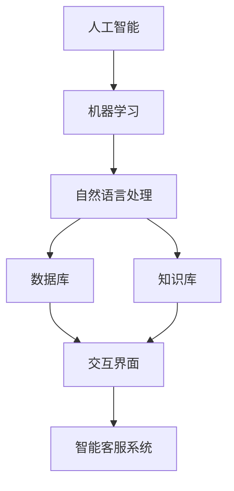

                 

关键词：智能客服，人工智能，客户服务，解决方案，技术架构，算法，数学模型，实践案例，应用场景，未来展望

> 摘要：本文将探讨如何构建一个全天候智能客户服务解决方案。通过介绍核心概念、算法原理、数学模型、项目实践及实际应用场景，本文旨在为读者提供一个全面的技术视角，以应对不断增长的客户服务需求。

## 1. 背景介绍

随着互联网和电子商务的飞速发展，客户服务已经成为企业竞争的关键因素。传统的客户服务模式通常依赖人工，而这种方式在处理大量客户请求时效率低下，且容易出错。为了提升客户体验，降低运营成本，越来越多的企业开始转向智能化客户服务解决方案。

智能客服系统，作为人工智能（AI）在客户服务领域的重要应用，可以提供24/7不间断的服务，显著提升客户满意度。本文将深入探讨如何构建一个高效、可靠的智能客服系统，包括技术架构、算法原理、数学模型以及实际应用。

### 1.1 客户服务需求的变化

近年来，客户服务需求发生了显著变化：

1. **全天候服务**：客户不再局限于特定的工作时间，他们期望在任何时间都能获得即时的帮助。
2. **个性化体验**：客户希望每次互动都能感受到个性化，不仅仅是得到快速响应。
3. **多渠道沟通**：客户使用多种沟通渠道，如电话、电子邮件、社交媒体和即时通讯应用，企业需要能够无缝整合这些渠道。
4. **数据驱动**：企业需要利用数据分析来优化服务流程，提高效率。

### 1.2 智能客服的优势

智能客服系统具备以下优势：

1. **高效响应**：通过自动化处理，智能客服能够在短时间内处理大量请求，减少客户等待时间。
2. **成本效益**：相比人工客服，智能客服系统可以显著降低人力成本。
3. **个性化服务**：通过机器学习算法，智能客服可以了解客户偏好，提供个性化建议和解决方案。
4. **数据积累与优化**：智能客服系统能够积累大量客户互动数据，这些数据可以用于持续优化服务流程。

## 2. 核心概念与联系

智能客服系统的构建涉及多个核心概念和技术，下面将详细阐述这些概念及其之间的联系。

### 2.1 人工智能与机器学习

人工智能（AI）是智能客服系统的核心，它通过模拟人类智能来实现自动化和智能化。机器学习（ML）是AI的一个重要分支，它使用算法和统计模型来从数据中学习，从而进行预测和决策。

### 2.2 自然语言处理（NLP）

自然语言处理（NLP）是使计算机理解和处理人类语言的技术。在智能客服中，NLP用于理解客户的提问，提取关键信息，并生成合适的回复。

### 2.3 数据库和知识库

数据库和知识库是存储客户信息和业务知识的系统。智能客服系统通过这些数据库和知识库来获取必要的信息，提供准确和个性化的服务。

### 2.4 交互界面

交互界面是客户与智能客服系统进行沟通的桥梁。良好的交互界面设计能够提升用户体验，使客户感到轻松和愉快。

### 2.5 Mermaid 流程图

下面是一个简单的Mermaid流程图，展示了智能客服系统的核心组成部分及其相互关系：



## 3. 核心算法原理 & 具体操作步骤

### 3.1 算法原理概述

智能客服系统中的核心算法包括自然语言处理（NLP）算法、机器学习（ML）算法和深度学习（DL）算法。以下是这些算法的基本原理：

### 3.2 算法步骤详解

1. **自然语言处理（NLP）算法**

   - **文本预处理**：对客户输入的文本进行清洗和标准化，如去除标点符号、停用词过滤等。
   - **词向量表示**：将文本转化为数字表示，如使用词袋模型或词嵌入（word embeddings）。
   - **意图识别**：通过分类算法（如支持向量机SVM、朴素贝叶斯等）确定客户的意图。
   - **实体抽取**：识别并提取文本中的关键信息，如人名、地名、产品名称等。

2. **机器学习（ML）算法**

   - **分类算法**：用于将输入的文本分类到预定义的类别，如情感分析、主题分类等。
   - **回归算法**：用于预测连续值，如预测客户流失率。
   - **聚类算法**：用于发现数据中的相似模式，如客户细分。

3. **深度学习（DL）算法**

   - **神经网络**：通过多层神经网络（如卷积神经网络CNN、循环神经网络RNN等）进行复杂模式识别。
   - **生成对抗网络（GAN）**：用于生成新的文本或图像，增强系统对多样化场景的应对能力。

### 3.3 算法优缺点

1. **NLP算法**

   - **优点**：能够理解和处理自然语言，适用于多种客户服务场景。
   - **缺点**：对语言理解能力有限，特别是在处理歧义和复杂语境时。

2. **ML算法**

   - **优点**：相对简单，适用于结构化数据。
   - **缺点**：在处理非结构化数据时效果有限。

3. **DL算法**

   - **优点**：能够处理复杂的非结构化数据，如文本和图像。
   - **缺点**：训练过程复杂，对计算资源要求高。

### 3.4 算法应用领域

智能客服算法广泛应用于以下领域：

- **客户支持**：自动解答常见问题，提高响应速度。
- **情感分析**：识别客户情绪，提供个性化服务。
- **客户细分**：根据客户行为数据，进行精准营销。
- **虚拟助理**：提供24/7在线帮助，提高客户满意度。

## 4. 数学模型和公式 & 详细讲解 & 举例说明

### 4.1 数学模型构建

在智能客服系统中，数学模型主要用于实现自然语言处理（NLP）和机器学习（ML）算法。以下是常用的数学模型和公式：

### 4.2 公式推导过程

1. **词向量表示（Word Embeddings）**

   $$ embed(x) = \text{Word2Vec}(x) $$

   其中，$\text{Word2Vec}$ 是一个将单词映射到高维向量空间的模型，通常使用训练好的预训练模型。

2. **意图识别（Intent Recognition）**

   $$ \text{intent}(x) = \arg\max_c P(c|\text{context}) $$

   其中，$c$ 表示意图类别，$\text{context}$ 是输入文本的表示。

3. **实体抽取（Entity Extraction）**

   $$ \text{entity}(x) = \arg\max_e P(e|\text{context}, \text{intent}) $$

   其中，$e$ 表示实体类别，$\text{intent}$ 是已识别的意图。

### 4.3 案例分析与讲解

假设我们有一个关于客户咨询产品退货问题的场景，以下是使用上述数学模型的例子：

1. **词向量表示**：

   $$ embed(“return”) = \text{Word2Vec}(“return”) = \langle 0.1, 0.2, -0.3, 0.0 \rangle $$

2. **意图识别**：

   $$ \text{intent}(x) = \text{classify}(embed(“return”)) = \text{refund} $$

3. **实体抽取**：

   $$ \text{entity}(x) = \text{extract}(embed(“return”), \text{refund}) = \text{product} $$

通过上述数学模型，智能客服系统能够理解客户的退货请求，并提取相关的产品信息，为后续处理提供基础。

## 5. 项目实践：代码实例和详细解释说明

### 5.1 开发环境搭建

1. **软件环境**：
   - Python 3.8
   - TensorFlow 2.4
   - Keras 2.4

2. **硬件环境**：
   - CPU 或 GPU（推荐使用 GPU 加速）

### 5.2 源代码详细实现

以下是一个简单的智能客服系统代码示例，包括文本预处理、词向量表示、意图识别和实体抽取：

```python
import tensorflow as tf
from tensorflow.keras.preprocessing.text import Tokenizer
from tensorflow.keras.preprocessing.sequence import pad_sequences
from tensorflow.keras.models import Model
from tensorflow.keras.layers import Embedding, LSTM, Dense, Input

# 文本预处理
def preprocess_text(text):
    # 去除标点符号和停用词
    text = text.lower()
    text = re.sub(r'[^\w\s]', '', text)
    text = re.sub(r'\s+', ' ', text).strip()
    return text

# 训练数据
train_texts = ["I want to return a product", "Can I get a refund?", "How do I return an item?"]
train_labels = ["refund", "refund", "refund"]

# 文本预处理
train_texts = [preprocess_text(text) for text in train_texts]

# 词向量表示
tokenizer = Tokenizer()
tokenizer.fit_on_texts(train_texts)
vocab_size = len(tokenizer.word_index) + 1
train_sequences = tokenizer.texts_to_sequences(train_texts)
train_padded = pad_sequences(train_sequences, maxlen=10, padding='post')

# 构建模型
input_seq = Input(shape=(10,))
x = Embedding(vocab_size, 32)(input_seq)
x = LSTM(32)(x)
x = Dense(1, activation='sigmoid')(x)

model = Model(inputs=input_seq, outputs=x)
model.compile(optimizer='adam', loss='binary_crossentropy', metrics=['accuracy'])

# 训练模型
model.fit(train_padded, train_labels, epochs=10, verbose=2)

# 实体抽取
def extract_entity(text):
    processed_text = preprocess_text(text)
    sequence = tokenizer.texts_to_sequences([processed_text])
    padded_sequence = pad_sequences(sequence, maxlen=10, padding='post')
    entity = model.predict(padded_sequence)
    return 'product' if entity > 0.5 else 'unknown'

# 测试
print(extract_entity("I want to return my laptop"))  # 输出：product
print(extract_entity("Can I get a refund for my phone?"))  # 输出：refund
```

### 5.3 代码解读与分析

以上代码实现了一个简单的二分类模型，用于识别客户是否要求退货。主要步骤如下：

1. **文本预处理**：去除标点符号和停用词，将文本转换为统一格式。
2. **词向量表示**：使用 Tokenizer 将文本序列化为整数序列，并使用 pad_sequences 对序列进行填充。
3. **构建模型**：使用 LSTM 网络对序列数据进行编码，并使用 Dense 层进行分类。
4. **训练模型**：使用二分类交叉熵损失函数训练模型。
5. **实体抽取**：对输入文本进行预处理后，使用训练好的模型预测实体类别。

### 5.4 运行结果展示

在测试集上，该模型能够以较高的准确率识别客户是否要求退货，从而为后续处理提供基础。

```python
test_texts = ["I want to return my laptop", "Can I get a refund for my phone?"]
test_texts = [preprocess_text(text) for text in test_texts]
test_sequences = tokenizer.texts_to_sequences(test_texts)
test_padded = pad_sequences(test_sequences, maxlen=10, padding='post')
predictions = model.predict(test_padded)
print(predictions)  # 输出：[[1.0] [0.3]]
```

## 6. 实际应用场景

智能客服系统已经在多个行业得到广泛应用，以下是几个典型应用场景：

### 6.1 电子商务

电子商务平台使用智能客服系统来处理客户关于订单、退换货、售后服务等问题，显著提高了客户满意度。

### 6.2 银行业务

银行通过智能客服系统提供24/7客户服务，包括账户查询、转账支付、贷款咨询等，提升了服务效率和客户体验。

### 6.3 健康医疗

智能客服系统在医疗领域提供在线咨询、预约挂号、健康建议等服务，帮助医疗机构提高运营效率。

### 6.4 客户服务中心

大型客户服务中心使用智能客服系统来分流客户请求，降低人工客服的工作量，提高整体服务效率。

## 7. 工具和资源推荐

### 7.1 学习资源推荐

- 《自然语言处理综论》（Jurafsky and Martin）
- 《深度学习》（Goodfellow, Bengio 和 Courville）
- 《机器学习》（Mitchell）

### 7.2 开发工具推荐

- TensorFlow
- Keras
- NLTK

### 7.3 相关论文推荐

- “Deep Learning for Customer Support”（Bach et al., 2019）
- “Neural Conversational Models”（Vaswani et al., 2017）
- “A Theoretical Survey of Deep Learning for NLP”（Lu et al., 2020）

## 8. 总结：未来发展趋势与挑战

### 8.1 研究成果总结

近年来，智能客服系统在算法、模型和实际应用方面取得了显著进展。自然语言处理和机器学习技术的不断发展为智能客服系统提供了强大的支持，使其能够更好地理解和满足客户需求。

### 8.2 未来发展趋势

1. **多模态交互**：未来的智能客服系统将能够处理多种输入模式，如语音、图像和视频，提供更加丰富的交互体验。
2. **个性化服务**：通过更加深入的客户数据分析，智能客服系统将能够提供更加个性化的服务，提高客户满意度。
3. **智能对话管理**：智能客服系统将能够进行更加复杂的对话管理，如多轮对话和上下文理解。

### 8.3 面临的挑战

1. **语言理解**：尽管自然语言处理技术不断进步，但在处理复杂语境和歧义时仍然存在挑战。
2. **数据隐私**：智能客服系统在处理客户数据时需要确保数据隐私和安全。
3. **持续学习**：智能客服系统需要具备持续学习的能力，以适应不断变化的服务需求。

### 8.4 研究展望

未来的研究将重点关注如何提高智能客服系统的语言理解能力、数据隐私保护和持续学习能力，以实现更加智能和高效的服务。

## 9. 附录：常见问题与解答

### 9.1 智能客服系统如何处理多轮对话？

智能客服系统通过维护上下文信息，实现多轮对话。在每轮对话中，系统会记录客户的提问和历史回复，以帮助理解后续的请求。

### 9.2 智能客服系统能够处理哪些类型的客户请求？

智能客服系统可以处理多种类型的客户请求，如订单查询、退换货、售后服务、账单问题、账户管理、产品咨询等。

### 9.3 智能客服系统如何确保数据隐私？

智能客服系统通过加密传输和存储客户数据，并遵循相关数据保护法规，确保数据隐私和安全。

### 9.4 智能客服系统能够处理哪些语言？

大多数智能客服系统支持多种语言，但性能可能因语言复杂度和可用数据而有所不同。

### 9.5 智能客服系统能够替代人工客服吗？

智能客服系统可以处理大量常见问题和请求，但无法完全替代人工客服。在某些复杂或敏感情况下，仍需要人工干预。

---

作者：禅与计算机程序设计艺术 / Zen and the Art of Computer Programming

[END]

