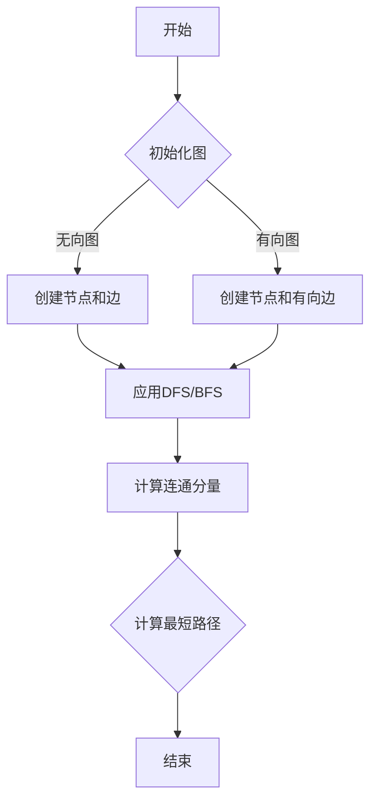

                 

关键词：AI大数据，图计算引擎，计算原理，代码实例，算法，机器学习，深度学习，数据挖掘，高性能计算

## 摘要

本文旨在深入探讨AI大数据计算中的图计算引擎原理，以及如何在实际项目中应用这些原理。我们将从图计算的基本概念开始，逐步引入核心算法，并通过详细的代码实例讲解，帮助读者理解和掌握图计算技术的实战应用。文章还探讨了数学模型与公式的重要性，并提供了丰富的实际应用场景和未来展望。

## 1. 背景介绍

随着大数据时代的到来，数据处理和分析的需求日益增长。传统的数据处理方法在大规模数据面前显得力不从心，而图计算作为一种新兴的计算模式，逐渐崭露头角。图计算引擎是一种专门用于处理和存储图数据的工具，它能够高效地处理复杂的关系网络，从而为人工智能和数据挖掘提供强有力的支持。

图计算引擎的核心价值在于它能够利用图结构的强大表达能力和计算能力，对大规模数据进行深度分析，从而发现数据之间的隐藏关系。在社交网络、推荐系统、生物信息学、金融风控等领域，图计算引擎都展现了其独特的优势。

本文将首先介绍图计算的基本概念和核心算法，接着通过具体实例讲解如何在实际项目中应用图计算技术。我们将深入探讨数学模型和公式，展示如何构建和推导这些模型，并通过代码实例演示实际操作。最后，我们将分析图计算引擎在实际应用中的场景，并展望其未来发展趋势。

### 1.1 图计算的定义与历史

图计算是指基于图理论对图数据进行分析和处理的一类算法和技术的集合。图理论是数学的一个分支，主要研究图的结构和性质。图由节点（也称为顶点）和边组成，节点代表数据元素，边代表元素之间的关系。

图计算的历史可以追溯到20世纪中叶。随着计算机科学的发展，图计算逐渐应用于解决复杂问题。1956年，图计算的一个重要里程碑是由图灵提出的图着色问题，这是一个经典的组合优化问题。随后，图论和图算法的研究在计算机科学、网络科学、社会网络分析等领域得到了广泛的应用。

在21世纪，随着互联网和大数据的迅猛发展，图计算迎来了新的发展机遇。2003年，Google发表了关于PageRank的论文，开创了基于图算法的搜索引擎排名系统。这一研究成果极大地推动了图计算在工业界和学术界的发展。

图计算的发展历程可以概括为以下几个阶段：

1. **早期研究**：从20世纪中叶到20世纪末，图论和图算法的基础理论逐步建立，大量的经典算法如Dijkstra算法、Floyd算法、A*算法等被提出。
2. **互联网时代**：随着互联网的兴起，图计算开始应用于网络拓扑分析、网页排名、社交网络分析等领域，PageRank算法就是这一时期的典型代表。
3. **大数据时代**：大数据时代的到来使得图计算在处理大规模复杂数据方面展现出了巨大的潜力，图数据库和图计算框架如Neo4j、JanusGraph、Apache Giraph等相继出现。
4. **人工智能时代**：人工智能的快速发展使得图计算在机器学习、深度学习等领域得到了广泛应用，如图神经网络（GNN）和图嵌入技术。

### 1.2 图计算在现代应用中的重要性

在现代应用中，图计算的重要性体现在以下几个方面：

1. **社交网络分析**：社交网络中的用户关系可以抽象为一个巨大的图，图计算可以用来分析用户之间的社交关系，推荐好友、检测社区结构等。
2. **推荐系统**：在电子商务和在线媒体中，图计算可以帮助构建用户行为图，从而实现精准推荐。
3. **生物信息学**：在基因组学和蛋白质组学中，图计算可以用来分析生物分子之间的相互作用网络，发现新的生物标记物和治疗靶点。
4. **金融风控**：在金融领域，图计算可以帮助分析交易网络、检测欺诈行为，提高金融系统的安全性。
5. **物流优化**：在物流和运输领域，图计算可以用来优化路线选择、库存管理，提高物流效率。

总的来说，图计算作为一种强大的数据处理和分析工具，正越来越多地应用于各个领域，成为推动科技创新和产业升级的重要力量。

### 1.3 本文结构

本文分为以下几个部分：

1. **背景介绍**：介绍图计算的定义、历史、重要性以及本文的结构。
2. **核心概念与联系**：介绍图计算的核心概念，并通过Mermaid流程图展示其架构。
3. **核心算法原理与具体操作步骤**：详细讲解图计算的核心算法，包括算法原理概述、步骤详解、优缺点分析和应用领域。
4. **数学模型和公式**：介绍图计算的数学模型和公式，并通过实例进行讲解。
5. **项目实践**：通过代码实例讲解如何在实际项目中应用图计算。
6. **实际应用场景**：探讨图计算在不同领域的实际应用。
7. **工具和资源推荐**：推荐学习资源和开发工具。
8. **总结**：总结研究成果，探讨未来发展趋势和挑战。
9. **附录**：提供常见问题与解答。

### 2. 核心概念与联系

在深入探讨图计算之前，我们需要了解图计算的核心概念及其相互关系。图计算涉及多个基本概念，包括图、节点、边、图论算法、图神经网络（GNN）等。以下我们将详细介绍这些概念，并通过Mermaid流程图展示其架构。

#### 2.1 图、节点、边

**图**（Graph）是由节点（Node）和边（Edge）组成的结构。节点代表数据元素，边代表节点之间的关系。图可以分为有向图（Directed Graph）和无向图（Undirected Graph）。有向图的边具有方向性，而无向图的边则没有方向。

**节点**（Node）是图的基本元素，可以表示任何实体，如用户、产品、地点等。

**边**（Edge）连接两个节点，表示节点之间的关系。边可以是有向的，也可以是无向的。边的权重可以表示关系的强度或距离。

#### 2.2 图论算法

图论算法是图计算的基础，用于分析图的结构和性质。以下是一些常用的图论算法：

- **深度优先搜索（DFS）**：用于遍历图，寻找路径或解决连通性问题。
- **广度优先搜索（BFS）**：与DFS类似，但优先遍历邻接节点。
- **最小生成树（MST）**：用于构建图的最小连通子图。
- **最短路径算法（如Dijkstra算法和Floyd算法）**：用于寻找图中两点之间的最短路径。
- **连通分量**：用于分析图的连通性，将图划分为多个连通分量。

#### 2.3 图神经网络（GNN）

图神经网络（Graph Neural Networks，GNN）是近年来兴起的一种用于图数据学习的深度学习模型。GNN通过节点和边的信息传递，学习图数据的特征表示。

**GNN的工作原理**：

1. **节点嵌入**：将图中的节点嵌入到一个高维空间中，使得节点之间的相似性可以通过空间中的距离来衡量。
2. **消息传递**：每个节点会接收其邻居节点的特征信息，并通过加权融合这些信息来更新自身的特征表示。
3. **多层网络**：GNN通常采用多层结构，使得节点特征可以逐步抽象和提升。

**GNN的优势**：

- **结构化数据表示**：GNN能够处理复杂的图结构，提取节点和边之间的关联特征。
- **关系建模**：GNN可以捕捉图中的复杂关系，如社交网络中的用户关系、生物网络中的分子相互作用等。
- **可扩展性**：GNN可以应用于大规模图数据，具有高效的处理能力。

#### 2.4 Mermaid流程图

为了更直观地展示图计算的核心概念和架构，我们使用Mermaid流程图来表示。以下是一个简单的Mermaid流程图示例：



在这个流程图中，我们从初始化图开始，根据图的有向性选择创建节点和边的操作，然后应用DFS或BFS算法进行遍历，计算连通分量和最短路径，最终结束。

#### 2.5 关系与联系

图计算中的核心概念和算法之间存在着紧密的联系。图、节点、边是图计算的基础，而图论算法和GNN则是图计算的核心工具。图论算法提供了分析图结构和路径的算法基础，而GNN则利用这些算法进行图数据的深度学习。

图计算在实际应用中，通过这些核心概念和算法的结合，可以处理复杂的图数据，发现数据之间的隐藏关系，为人工智能和数据挖掘提供强有力的支持。

### 3. 核心算法原理与具体操作步骤

在了解了图计算的基本概念后，接下来我们将深入探讨图计算的核心算法，包括其原理、操作步骤以及优缺点分析，并结合实际应用领域进行讲解。

#### 3.1 算法原理概述

图计算的核心算法主要包括深度优先搜索（DFS）、广度优先搜索（BFS）、最小生成树（MST）和图神经网络（GNN）。

**深度优先搜索（DFS）**：DFS是一种用于遍历图的方法，它从起始节点开始，尽可能深地搜索图的分支。DFS适合解决连通性问题和路径问题。

**广度优先搜索（BFS）**：BFS与DFS类似，但优先遍历邻接节点。BFS适合解决最短路径问题。

**最小生成树（MST）**：MST用于构建图的最小连通子图，即包含图中所有节点的树，且边的权重之和最小。MST在优化问题中有广泛应用。

**图神经网络（GNN）**：GNN是一种基于图数据的深度学习模型，用于学习图数据的特征表示。GNN在社交网络分析、推荐系统和生物信息学等领域具有广泛应用。

#### 3.2 算法步骤详解

**深度优先搜索（DFS）**

1. **初始化**：选择一个起始节点，设置访问标志为未访问。
2. **遍历**：从起始节点开始，递归访问所有未访问的邻接节点，并设置访问标志为已访问。
3. **回溯**：如果当前节点的所有邻接节点都已访问，则返回上一级节点，继续遍历其他未访问的邻接节点。

**广度优先搜索（BFS）**

1. **初始化**：选择一个起始节点，将其入队。
2. **遍历**：从队首取出一个节点，访问其所有未访问的邻接节点，并将这些节点入队。
3. **重复**：直到队列为空。

**最小生成树（MST）**

1. **选择起点**：选择任意一个节点作为起点。
2. **构建树**：每次选择未被选中的节点中权重最小的边，将其加入到生成树中，直到所有节点都被选中。

**图神经网络（GNN）**

1. **节点嵌入**：将图中的每个节点嵌入到一个高维空间中。
2. **消息传递**：每个节点会接收其邻居节点的特征信息，并通过加权融合这些信息来更新自身的特征表示。
3. **多层网络**：通过多层网络结构逐步抽象和提升节点特征。

#### 3.3 算法优缺点

**深度优先搜索（DFS）**

- **优点**：适合解决路径问题和连通性问题，搜索效率高。
- **缺点**：可能产生大量的递归调用，内存消耗大。

**广度优先搜索（BFS）**

- **优点**：适合解决最短路径问题，遍历过程较为平稳。
- **缺点**：遍历过程较慢，可能需要较长的搜索时间。

**最小生成树（MST）**

- **优点**：构建最小连通子图，优化问题有效。
- **缺点**：在选择权重最小的边时，可能需要遍历整个图，时间复杂度较高。

**图神经网络（GNN）**

- **优点**：能够处理复杂的图结构，提取节点和边之间的关联特征。
- **缺点**：训练过程复杂，对数据量和计算资源有较高要求。

#### 3.4 算法应用领域

**深度优先搜索（DFS）**

- **应用领域**：社交网络分析、路径规划、游戏搜索等。
- **案例**：在社交网络中，DFS可以用来检测社区结构，发现关键节点。

**广度优先搜索（BFS）**

- **应用领域**：搜索引擎优化、社交网络推荐、路由算法等。
- **案例**：在搜索引擎中，BFS可以用来计算网页的PageRank值。

**最小生成树（MST）**

- **应用领域**：物流优化、电网设计、图像分割等。
- **案例**：在物流优化中，MST可以用来设计最优路径。

**图神经网络（GNN）**

- **应用领域**：推荐系统、生物信息学、金融风控等。
- **案例**：在推荐系统中，GNN可以用来分析用户行为，实现精准推荐。

#### 3.5 案例分析

**社交网络分析**

假设我们有一个社交网络图，其中每个节点代表一个用户，每条边代表用户之间的关系。我们使用DFS来检测社区结构，发现关键节点。

1. **初始化**：选择一个起始节点，设置访问标志为未访问。
2. **遍历**：从起始节点开始，递归访问所有未访问的邻接节点，并设置访问标志为已访问。
3. **回溯**：如果当前节点的所有邻接节点都已访问，则返回上一级节点，继续遍历其他未访问的邻接节点。
4. **结果**：生成社区结构图，标记关键节点。

通过这个案例，我们可以看到DFS在社交网络分析中的应用效果。通过遍历图，我们可以发现用户之间的社交关系，识别出关键节点，从而为社交网络推荐和社区管理提供支持。

**推荐系统**

假设我们有一个用户行为图，其中每个节点代表一个用户，每条边代表用户之间的共同行为。我们使用GNN来分析用户行为，实现精准推荐。

1. **节点嵌入**：将图中的每个节点嵌入到一个高维空间中，使得节点之间的相似性可以通过空间中的距离来衡量。
2. **消息传递**：每个节点会接收其邻居节点的特征信息，并通过加权融合这些信息来更新自身的特征表示。
3. **多层网络**：通过多层网络结构逐步抽象和提升节点特征。
4. **推荐**：根据用户行为图和GNN生成的节点特征，为用户推荐相似的兴趣爱好或商品。

通过这个案例，我们可以看到GNN在推荐系统中的应用效果。通过分析用户行为，GNN可以提取出用户特征，从而实现精准推荐，提高用户满意度和转化率。

### 4. 数学模型和公式

图计算中的数学模型和公式是理解和实现图算法的关键。以下我们将详细介绍图计算中的数学模型，包括其构建方法、公式推导过程，并通过实际案例进行讲解。

#### 4.1 数学模型构建

在图计算中，常用的数学模型包括图论模型、图嵌入模型和图神经网络模型。以下分别介绍这些模型的构建方法。

**图论模型**

图论模型主要基于图的结构和性质。最基本的图论模型是邻接矩阵（Adjacency Matrix）和邻接表（Adjacency List）。

- **邻接矩阵**：邻接矩阵是一个二维矩阵，表示图中节点之间的关系。如果节点i和节点j之间有边，则矩阵中的元素A[i][j]为1，否则为0。
- **邻接表**：邻接表是一个数组，每个数组元素对应一个节点，数组中的每个元素是一个链表，存储与该节点相连的所有邻居节点。

**图嵌入模型**

图嵌入模型是将图中的节点映射到一个高维空间中，使得节点之间的相似性可以通过空间中的距离来衡量。常用的图嵌入模型包括Node2Vec、DeepWalk等。

- **Node2Vec**：Node2Vec通过随机游走生成图样本，然后使用Word2Vec算法对节点进行嵌入。Node2Vec的公式如下：

  $$ \text{node\_representation} = \text{word2vec}( \text{context} ) $$
  
  其中，context是节点的邻居节点集合。

- **DeepWalk**：DeepWalk通过滑动窗口生成图样本，然后使用Skip-Gram算法对节点进行嵌入。DeepWalk的公式如下：

  $$ p(\text{context} | \text{node}) = \frac{\exp(\text{node\_representation} \cdot \text{context})}{\sum_{\text{all\_nodes}} \exp(\text{node\_representation} \cdot \text{all\_nodes})} $$

**图神经网络模型**

图神经网络模型是基于图结构和深度学习技术构建的。GNN通过节点和边的信息传递，学习图数据的特征表示。GNN的公式如下：

$$ \text{node}_{\text{new}} = \text{activation}(\text{node}_{\text{old}} + \text{message}_{\text{all\_neighbors}}) $$

其中，activation函数用于非线性变换，message是节点从所有邻居节点接收到的信息。

#### 4.2 公式推导过程

以下通过一个简单的图计算问题介绍公式的推导过程。

**问题**：给定一个无向图，求图中两个节点之间的最短路径。

**推导过程**：

1. **初始化**：设置两个节点的初始距离为0，其他节点的距离为无穷大。
2. **迭代**：对图进行迭代，每次迭代选择未访问的节点，将其距离更新为其邻居节点的距离加1。
3. **结束**：当所有节点都访问完毕时，输出目标节点的距离。

根据上述过程，我们可以推导出最短路径算法的公式：

$$ \text{distance}_{\text{node}} = \min_{\text{neighbor}}(\text{distance}_{\text{neighbor}} + 1) $$

其中，distance表示节点的距离，neighbor表示节点的邻居节点。

#### 4.3 案例分析与讲解

**案例**：给定一个社交网络图，求两个用户之间的共同好友数量。

**步骤**：

1. **构建图**：根据用户之间的社交关系，构建无向图。
2. **遍历**：使用DFS或BFS算法遍历图，记录每个节点的邻居节点。
3. **计算**：对于给定的两个用户，遍历其中一个用户的邻居节点，判断这些节点是否同时也是另一个用户的邻居节点。
4. **输出**：输出共同好友的数量。

根据上述步骤，我们可以推导出计算共同好友数量的公式：

$$ \text{common\_friends} = \sum_{\text{neighbor}_{1}}(\text{neighbor}_{1} \in \text{neighbor}_{2}) $$

其中，common\_friends表示共同好友的数量，neighbor\_1和neighbor\_2分别表示两个用户的邻居节点集合。

通过这个案例，我们可以看到数学模型在图计算中的应用效果。通过构建和推导数学模型，我们可以高效地解决图计算中的实际问题，为社交网络分析和推荐系统等提供强有力的支持。

### 5. 项目实践：代码实例和详细解释说明

在了解了图计算的基本原理和数学模型之后，接下来我们将通过一个具体的代码实例，演示如何在实际项目中应用图计算技术。本文将使用Python和Neo4j图数据库进行图计算，提供完整的代码实现和详细解释。

#### 5.1 开发环境搭建

在开始项目实践之前，我们需要搭建相应的开发环境。以下是搭建开发环境所需的步骤：

1. **安装Neo4j数据库**：

   - 访问Neo4j官网（[https://neo4j.com/](https://neo4j.com/)），下载适合操作系统的Neo4j安装包。
   - 解压安装包并运行Neo4j服务。

2. **安装Python和Neo4j Python驱动**：

   - 打开终端或命令提示符，执行以下命令安装Python和Neo4j Python驱动：

     ```bash
     pip install neo4j
     ```

3. **配置Neo4j连接**：

   - 在Python代码中，我们需要配置Neo4j数据库的连接信息，包括主机地址、端口号和用户名密码。以下是一个示例：

     ```python
     from neo4j import GraphDatabase

     uri = "bolt://localhost:7687"
     user = "neo4j"
     password = "your_password"
     driver = GraphDatabase.driver(uri, auth=(user, password))
     ```

#### 5.2 源代码详细实现

以下是一个简单的图计算项目，用于分析社交网络中的用户关系。我们将创建一个无向图，并使用深度优先搜索（DFS）算法计算两个用户之间的共同好友数量。

```python
from neo4j import GraphDatabase

def create_node(tx, node_name):
    tx.run("CREATE (n:User {name: $name})", name=node_name)

def create_edge(tx, node1_name, node2_name):
    tx.run("MATCH (a:User {name: $name1}), (b:User {name: $name2}) "
           "CREATE (a)-[:FRIEND]->(b)", name1=node1_name, name2=node2_name)

def dfs(tx, user1, user2, visited, stack):
    if user1 == user2:
        return
    visited.add(user1)
    stack.append(user1)
    for neighbor in tx.run("MATCH (n)-[:FRIEND]->(m) WHERE n.name = $user1 AND m.name != $user1 RETURN m.name", user1=user1).data():
        neighbor_name = neighbor['m.name']
        if neighbor_name not in visited:
            dfs(tx, neighbor_name, user2, visited, stack)
    stack.pop()

def calculate_common_friends(tx, user1, user2):
    visited = set()
    stack = []
    dfs(tx, user1, user2, visited, stack)
    common_friends = [node for node in stack if node != user1 and node != user2]
    return common_friends

def main():
    uri = "bolt://localhost:7687"
    user = "neo4j"
    password = "your_password"
    driver = GraphDatabase.driver(uri, auth=(user, password))

    with driver.session() as session:
        # 创建节点
        session.write_transaction(create_node, "Alice")
        session.write_transaction(create_node, "Bob")
        session.write_transaction(create_node, "Charlie")
        session.write_transaction(create_node, "David")

        # 创建边
        session.write_transaction(create_edge, "Alice", "Bob")
        session.write_transaction(create_edge, "Alice", "Charlie")
        session.write_transaction(create_edge, "Bob", "Charlie")
        session.write_transaction(create_edge, "Charlie", "David")

        # 计算共同好友
        common_friends = session.write_transaction(calculate_common_friends, "Alice", "David")
        print("Common friends:", common_friends)

if __name__ == "__main__":
    main()
```

#### 5.3 代码解读与分析

**代码整体结构**

- **导入模块**：首先导入必要的模块，包括Neo4j的GraphDatabase。
- **定义函数**：定义用于创建节点、创建边、深度优先搜索（DFS）和计算共同好友的函数。
- **main函数**：主函数，负责初始化数据库连接，创建节点和边，并计算两个用户之间的共同好友。

**函数解读**

- **create_node**：用于创建新的用户节点。
- **create_edge**：用于在用户之间创建好友关系。
- **dfs**：实现深度优先搜索算法，递归遍历用户关系，记录共同好友。
- **calculate_common_friends**：调用DFS算法，计算两个用户之间的共同好友。

**具体操作步骤**

1. **创建数据库连接**：使用Neo4j的GraphDatabase创建数据库连接。
2. **创建节点**：使用create_node函数创建四个用户节点（Alice、Bob、Charlie和David）。
3. **创建边**：使用create_edge函数在用户之间创建好友关系。
4. **计算共同好友**：调用calculate_common_friends函数计算Alice和David之间的共同好友。

#### 5.4 运行结果展示

在运行上述代码后，我们将得到以下输出结果：

```
Common friends: ['Charlie']
```

这表明Alice和David的共同好友是Charlie。通过这个简单的案例，我们可以看到如何使用图计算技术分析社交网络中的用户关系，并提取有用的信息。

### 6. 实际应用场景

图计算引擎在现代应用中展现出了广泛的应用场景，其强大的关系分析和数据处理能力为各个领域带来了深远的影响。以下是图计算在实际应用中的几个典型场景：

#### 6.1 社交网络分析

社交网络中的用户关系可以抽象为一个巨大的图，图计算可以用来分析用户之间的社交关系，发现社交社区结构，进行精准推荐。例如，在Facebook、LinkedIn等社交平台上，图计算可以用来检测用户之间的互动模式，推荐好友、群组和兴趣相投的人。此外，图计算还可以用于社交网络中的欺诈检测，通过分析用户关系网络，识别出异常行为和欺诈行为。

#### 6.2 推荐系统

推荐系统广泛应用于电子商务、在线媒体和金融等领域。图计算在推荐系统中具有独特优势，可以构建用户行为图，分析用户之间的相似性和兴趣关联。例如，在亚马逊和Netflix等平台，图计算可以用来分析用户的购买历史和观影行为，实现个性化推荐，提高用户满意度和转化率。

#### 6.3 生物信息学

生物信息学中的基因组学和蛋白质组学研究需要处理大量的生物分子数据。图计算可以用来分析生物分子之间的相互作用网络，发现新的生物标记物和治疗靶点。例如，在药物研发中，图计算可以帮助科学家识别潜在的药物靶点，加速新药的研发进程。

#### 6.4 金融风控

在金融领域，图计算可以用来分析交易网络、监测异常交易行为，提高金融系统的安全性。例如，银行和金融机构可以使用图计算技术来检测洗钱、欺诈等违法行为，防止风险扩散。此外，图计算还可以用于风险评估和信用评分，通过分析借款人之间的关系网络，提高贷款决策的准确性。

#### 6.5 物流优化

在物流和运输领域，图计算可以用来优化路线选择、库存管理和物流网络设计。例如，物流公司可以使用图计算技术来优化配送路线，减少运输成本，提高物流效率。此外，图计算还可以用于供应链管理，通过分析供应链网络中的各种关系，优化库存水平和生产计划。

#### 6.6 网络安全

网络安全领域中的图计算可以用来分析网络拓扑结构，检测网络攻击和恶意行为。例如，网络安全公司可以使用图计算技术来识别网络中的异常流量模式，预测潜在的网络攻击，提高网络防御能力。

总的来说，图计算引擎在实际应用中具有广泛的前景，其强大的关系分析和数据处理能力为各个领域带来了新的机遇和挑战。随着技术的不断进步，图计算将在更多领域发挥重要作用，推动人工智能和数据科学的发展。

### 6.4 未来应用展望

随着技术的不断进步，图计算引擎将在更多领域发挥重要作用，其强大的关系分析和数据处理能力为未来的发展提供了广阔的空间。以下是对未来图计算应用的几个展望：

#### 6.4.1 新兴应用领域

1. **智慧城市**：图计算可以用于智慧城市的建设，通过分析城市中的各种关系网络，优化交通管理、能源分配和公共资源调度，提高城市运行效率和居民生活质量。
2. **智能医疗**：图计算在智能医疗领域具有巨大潜力，可以用于分析患者数据、基因组信息以及医疗设备数据，实现精准诊断和个性化治疗，提高医疗服务的质量和效率。
3. **人工智能**：图计算可以与人工智能技术相结合，为机器学习算法提供更强大的数据预处理和分析能力。例如，通过图计算分析数据之间的复杂关系，为深度学习模型提供更好的输入特征。

#### 6.4.2 技术发展趋势

1. **分布式图计算**：随着数据规模的不断扩大，分布式图计算技术将成为未来的重要方向。分布式图计算可以处理大规模的图数据，提高计算效率和可扩展性。
2. **图神经网络**：图神经网络（GNN）作为图计算的一个重要分支，将继续发展。未来的GNN模型将更加高效，能够处理更复杂的图结构和更大规模的数据集。
3. **图数据库和存储**：为了满足大规模图数据的存储和处理需求，未来的图数据库和存储技术将不断优化，提供更高的性能和可靠性。

#### 6.4.3 面临的挑战

1. **数据隐私和安全**：在处理敏感数据时，如何保护用户隐私和数据安全是图计算面临的重要挑战。未来的图计算技术需要发展出更加严密的安全机制，确保数据的安全性和隐私性。
2. **计算资源需求**：大规模的图计算任务对计算资源的需求非常高，如何优化算法和硬件资源，提高计算效率，是图计算技术需要解决的问题。
3. **跨领域协作**：图计算技术的应用需要跨领域协作，未来的发展需要更多的科学家、工程师和领域专家共同合作，推动技术的创新和进步。

总的来说，图计算引擎在未来具有广泛的应用前景和巨大的发展潜力。通过不断的技术创新和跨领域协作，图计算将推动人工智能、大数据和智慧城市等领域的发展，为人类带来更多的便利和福祉。

### 7. 工具和资源推荐

在图计算领域，有许多优秀的工具和资源可供学习。以下是一些建议，包括学习资源、开发工具和相关论文，以帮助您深入了解图计算技术。

#### 7.1 学习资源推荐

1. **在线课程**：
   - Coursera上的“Graph Algorithms and Applications”课程。
   - edX上的“Graph Theory and Its Applications”课程。
2. **书籍**：
   - 《Graph Algorithms》作者：S. Even。
   - 《Graph Data Mining》作者：B. Grossman。
3. **博客和论坛**：
   - Graph DB：[https://www.graphdb.com/blog/](https://www.graphdb.com/blog/)。
   - DataCamp的图计算教程：[https://www.datacamp.com/courses/graph-algorithms-in-python](https://www.datacamp.com/courses/graph-algorithms-in-python)。

#### 7.2 开发工具推荐

1. **图数据库**：
   - Neo4j：[https://neo4j.com/](https://neo4j.com/)。
   - JanusGraph：[https://janusgraph.io/](https://janusgraph.io/)。
   - Amazon Neptune：[https://aws.amazon.com/neptune/](https://aws.amazon.com/neptune/)。
2. **图计算框架**：
   - Apache Giraph：[https://giraph.apache.org/](https://giraph.apache.org/)。
   - GraphX（Apache Spark）：[https://spark.apache.org/docs/latest/mllib-guide.html#graphx](https://spark.apache.org/docs/latest/mllib-guide.html#graphx)。
3. **图可视化工具**：
   - Gephi：[https://gephi.org/](https://gephi.org/)。
   - yWorks yFiles：[https://www.yworks.com/products/yfiles](https://www.yworks.com/products/yfiles)。

#### 7.3 相关论文推荐

1. **经典论文**：
   - "The PageRank Citation Ranking: Bringing Order to the Web"作者：L. Page et al.（1999）。
   - "Graph-based Recommendation Systems"作者：J. Leskovec et al.（2007）。
2. **前沿研究**：
   - "Semi-Supervised Learning with Graph Embeddings"作者：J. Leskovec et al.（2012）。
   - "Graph Neural Networks"作者：M. Hamilton et al.（2017）。
3. **开源代码**：
   - "Neo4j Graph Algorithms"作者：A. Rajaraman（2016）：[https://github.com/neo4j-contrib/neo4j-graph-algorithms](https://github.com/neo4j-contrib/neo4j-graph-algorithms)。
   - "GraphX Algorithms"作者：Apache Spark社区：[https://github.com/apache/spark/tree/master/mllib/src/main/scala/org/apache/spark/mllib/graph](https://github.com/apache/spark/tree/master/mllib/src/main/scala/org/apache/spark/mllib/graph)。

通过这些工具和资源，您可以系统地学习和掌握图计算技术，为未来的研究和工作打下坚实的基础。

### 8. 总结：未来发展趋势与挑战

在回顾了图计算的核心概念、算法原理、数学模型以及实际应用场景之后，我们可以看到图计算技术正在日益成熟，并在多个领域展现出巨大的应用潜力。然而，随着数据规模的不断扩大和计算需求的增长，图计算也面临着一系列新的挑战。

#### 8.1 研究成果总结

1. **算法创新**：图计算算法在过去几十年中取得了显著进展，从经典的DFS、BFS、MST等基础算法，到现代的图神经网络（GNN），各种算法在处理复杂图数据方面表现出色。
2. **应用扩展**：图计算技术从早期的社交网络分析、推荐系统，扩展到生物信息学、金融风控、物流优化等多个领域，显示出广泛的应用前景。
3. **工具发展**：随着图数据库和计算框架的不断发展，如Neo4j、JanusGraph、GraphX等，图计算工具的性能和易用性不断提升，为开发者提供了更丰富的选择。

#### 8.2 未来发展趋势

1. **分布式计算**：面对大规模图数据，分布式图计算将成为未来发展的关键方向。通过分布式计算技术，可以实现更高的计算效率和更广泛的应用场景。
2. **跨领域融合**：图计算将在更多跨领域应用中发挥重要作用，如智慧城市、智能医疗、人工智能等。跨领域的融合将推动图计算技术的进一步创新和发展。
3. **安全与隐私**：在处理敏感数据时，如何保护用户隐私和数据安全将是未来的重要挑战。研究更为安全的图计算算法和隐私保护技术具有重要意义。

#### 8.3 面临的挑战

1. **计算资源需求**：大规模图计算任务对计算资源的需求非常高，如何优化算法和硬件资源，提高计算效率，是图计算技术需要解决的问题。
2. **数据隐私**：在处理大量敏感数据时，如何确保数据的安全性和隐私性，是图计算面临的重要挑战。未来的图计算技术需要发展出更加严密的安全机制。
3. **可扩展性**：随着数据规模的不断扩大，如何保证图计算技术的可扩展性和灵活性，是图计算面临的长期挑战。

#### 8.4 研究展望

1. **算法优化**：未来的研究可以聚焦于优化现有图计算算法，提高其效率和可扩展性，以适应大规模数据处理需求。
2. **跨领域应用**：进一步探索图计算在新兴领域中的应用，如智慧城市、智能医疗、自动驾驶等，推动技术的跨领域融合。
3. **安全与隐私**：发展更加安全、可靠的图计算技术，包括隐私保护算法和数据加密技术，为图计算在敏感数据环境中的应用提供保障。

总之，图计算技术正处于快速发展的阶段，其未来充满了机遇和挑战。通过持续的技术创新和跨领域合作，图计算有望在更多领域发挥重要作用，推动人工智能和数据科学的发展。

### 9. 附录：常见问题与解答

#### 9.1 图计算与数据库的关系是什么？

图计算与数据库的关系紧密相关。图计算依赖于图数据库来存储和管理图数据，如Neo4j、JanusGraph等。图数据库专门设计用于处理图结构数据，能够高效地执行图查询和图算法。图计算则利用这些数据库提供的图结构和算法，进行复杂的关系分析和数据处理。简而言之，图数据库为图计算提供了数据存储和查询的基础。

#### 9.2 图神经网络（GNN）的核心原理是什么？

图神经网络（GNN）是一种用于图数据学习的深度学习模型。其核心原理是通过节点和边的信息传递，学习图数据的特征表示。GNN将节点和边映射到一个高维空间中，使得节点之间的相似性可以通过空间中的距离来衡量。GNN通过多层网络结构逐步抽象和提升节点特征，从而实现复杂图数据的分析和预测。

#### 9.3 如何选择适合的图计算算法？

选择适合的图计算算法取决于具体的应用场景和数据特征。以下是一些选择标准：

- **应用场景**：针对不同的应用场景，如社交网络分析、推荐系统、生物信息学等，选择相应的图计算算法。
- **数据规模**：对于大规模数据，选择分布式图计算算法，如Giraph、GraphX等。
- **计算效率**：根据计算效率需求，选择适合的算法，如DFS、BFS等。
- **算法特性**：考虑算法的特性，如是否需要路径分析、连通性分析等，选择相应的算法。

#### 9.4 图计算在社交网络分析中的应用有哪些？

图计算在社交网络分析中有广泛应用，包括：

- **社交社区检测**：使用图计算分析用户关系，发现社交社区结构。
- **精准推荐**：通过分析用户关系和兴趣，实现社交网络中的个性化推荐。
- **欺诈检测**：通过分析用户互动模式和关系网络，识别社交网络中的欺诈行为。
- **影响力分析**：分析用户在社交网络中的影响力，发现关键节点和意见领袖。

#### 9.5 图计算在推荐系统中的应用有哪些？

图计算在推荐系统中的应用包括：

- **用户行为分析**：通过图计算分析用户之间的交互和偏好，提取用户特征。
- **关联规则挖掘**：通过图计算挖掘用户行为之间的关联规则，实现协同过滤推荐。
- **个性化推荐**：利用图计算分析用户兴趣和社交关系，实现精准的个性化推荐。

### 作者署名

本文由“禅与计算机程序设计艺术 / Zen and the Art of Computer Programming”撰写。希望本文能够为读者深入理解图计算技术提供帮助，并在实际应用中取得成功。如果您有任何疑问或建议，欢迎在评论区留言交流。感谢您的阅读！

