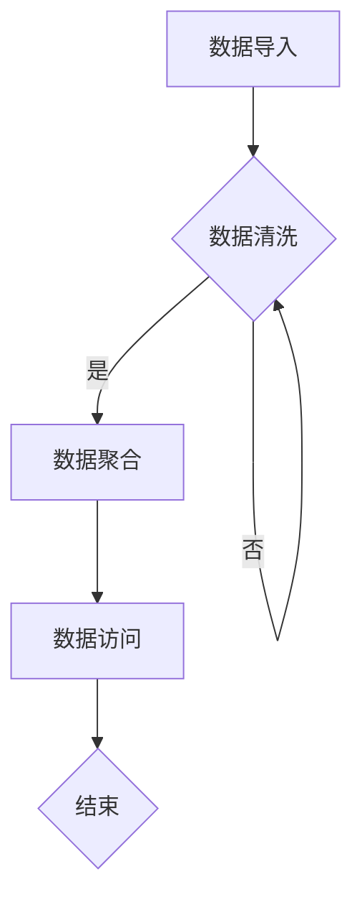

                 

在当今信息时代，数据仓库作为大数据分析的核心组件，承载着企业决策的智慧结晶。本文旨在探讨AI大数据计算原理，并通过具体的代码实例，对数据仓库的实现方法进行深入讲解。本文结构如下：

## 文章关键词
AI, 大数据, 数据仓库, 计算原理, 代码实例

## 文章摘要
本文将首先介绍数据仓库的基本概念和重要性，然后深入探讨AI在数据仓库中的应用原理。接着，通过具体代码实例，展示数据仓库的构建过程，包括数据导入、数据清洗、数据聚合等步骤。最后，将对数据仓库在实际应用中的场景进行讨论，并展望其未来发展趋势。

## 1. 背景介绍

数据仓库是一个集成了大量数据的系统，旨在支持企业的决策过程。传统的数据仓库通常基于关系型数据库，但随着大数据时代的到来，NoSQL数据库和分布式计算框架逐渐成为主流。数据仓库的作用在于将分散的数据源集中起来，进行高效的处理和分析，从而为企业提供决策支持。

随着AI技术的快速发展，数据仓库的智能化程度不断提高。机器学习算法可以用于数据预测、聚类、分类等任务，帮助分析师从海量数据中提取有价值的信息。本文将重点关注AI在数据仓库中的计算原理，并通过实际代码实例，展示其应用效果。

## 2. 核心概念与联系

### 2.1 数据仓库的基本概念
数据仓库是一个集成化的数据存储系统，包含从多个数据源导入的数据。数据仓库通常具有以下特点：

- **数据集成**：将来自不同来源的数据进行统一整合。
- **数据清洗**：对数据进行处理，确保数据质量。
- **数据聚合**：对数据进行汇总和统计，以支持多维度的数据分析。
- **数据访问**：提供高效的数据查询和报告功能。

### 2.2 AI在大数据计算中的应用
AI在大数据计算中的应用主要体现在以下几个方面：

- **数据预处理**：使用机器学习算法对数据进行特征提取和降维，提高数据分析的效率。
- **模式识别**：通过聚类、分类算法，发现数据中的潜在模式和关系。
- **预测分析**：利用时间序列分析、回归分析等算法，对未来趋势进行预测。
- **自动化决策**：基于机器学习模型，实现自动化决策支持系统。

### 2.3 Mermaid 流程图
下面是一个简单的Mermaid流程图，展示了数据仓库的基本流程：



## 3. 核心算法原理 & 具体操作步骤

### 3.1 算法原理概述

在数据仓库中，常用的算法包括数据清洗、数据聚合和机器学习算法。下面分别介绍这些算法的基本原理。

#### 3.1.1 数据清洗算法
数据清洗算法主要用于处理缺失值、重复值、异常值等问题。常见的数据清洗算法包括：

- **缺失值处理**：使用平均值、中位数、众数等方法填充缺失值。
- **重复值处理**：通过哈希函数或索引，识别并删除重复记录。
- **异常值处理**：使用统计方法（如Z-Score、IQR）或机器学习方法（如孤立森林）检测和修正异常值。

#### 3.1.2 数据聚合算法
数据聚合算法主要用于对大量数据进行汇总和统计。常见的数据聚合算法包括：

- **分组聚合**：将数据按照某个字段进行分组，然后对每个分组内的数据进行聚合。
- **多表连接**：通过连接操作，将多个表中的数据按照特定条件进行汇总。
- **窗口函数**：对数据进行时间窗口内的聚合操作，如移动平均、滚动计数等。

#### 3.1.3 机器学习算法
机器学习算法用于数据分析和预测。常见的数据分析算法包括：

- **聚类算法**：将数据划分为若干个簇，如K-Means、DBSCAN等。
- **分类算法**：对数据进行分类，如决策树、支持向量机等。
- **回归算法**：对数据进行拟合，预测连续值，如线性回归、多项式回归等。

### 3.2 算法步骤详解

#### 3.2.1 数据导入
数据导入是数据仓库构建的第一步。通常，数据可以从关系型数据库、NoSQL数据库、文件系统等多种数据源导入。导入过程中，需要关注数据的格式、结构、质量等问题。

#### 3.2.2 数据清洗
数据清洗过程主要包括以下步骤：

1. **缺失值处理**：识别缺失值，并选择合适的填充方法。
2. **重复值处理**：使用哈希函数或索引，查找并删除重复记录。
3. **异常值处理**：使用统计方法或机器学习算法，识别并修正异常值。

#### 3.2.3 数据聚合
数据聚合过程主要包括以下步骤：

1. **分组聚合**：根据业务需求，选择合适的分组字段。
2. **多表连接**：根据连接条件，连接多个表的数据。
3. **窗口函数**：根据时间窗口，进行滚动计算。

#### 3.2.4 机器学习算法应用
机器学习算法应用主要包括以下步骤：

1. **数据准备**：对数据进行预处理，如特征提取、降维等。
2. **模型训练**：选择合适的算法，对数据进行训练。
3. **模型评估**：评估模型性能，选择最优模型。
4. **模型部署**：将模型部署到数据仓库中，实现自动化预测和分析。

### 3.3 算法优缺点

#### 3.3.1 数据清洗算法
优点：能够显著提高数据质量，为后续数据分析提供可靠的数据基础。

缺点：处理复杂，可能引入新的错误。

#### 3.3.2 数据聚合算法
优点：能够快速对大量数据进行汇总和统计，支持多维度的数据分析。

缺点：可能降低数据分辨率，丢失部分细节信息。

#### 3.3.3 机器学习算法
优点：能够自动发现数据中的模式和关系，实现自动化预测和分析。

缺点：对数据质量要求较高，可能引入过拟合问题。

### 3.4 算法应用领域

数据清洗算法、数据聚合算法和机器学习算法广泛应用于各个领域，如金融、医疗、电商、物流等。具体应用包括：

- **金融**：风险管理、信用评分、市场预测等。
- **医疗**：疾病诊断、药物研究、健康监测等。
- **电商**：用户行为分析、推荐系统、销售预测等。
- **物流**：路线规划、库存管理、运输优化等。

## 4. 数学模型和公式 & 详细讲解 & 举例说明

### 4.1 数学模型构建

在数据仓库中，常用的数学模型包括线性回归模型、逻辑回归模型、K-Means聚类模型等。下面分别介绍这些模型的构建方法。

#### 4.1.1 线性回归模型

线性回归模型用于预测连续值。其数学模型如下：

$$y = \beta_0 + \beta_1 \cdot x_1 + \beta_2 \cdot x_2 + ... + \beta_n \cdot x_n + \epsilon$$

其中，$y$ 是预测值，$x_1, x_2, ..., x_n$ 是特征值，$\beta_0, \beta_1, ..., \beta_n$ 是模型参数，$\epsilon$ 是误差项。

#### 4.1.2 逻辑回归模型

逻辑回归模型用于预测概率。其数学模型如下：

$$P(y=1) = \frac{1}{1 + e^{-(\beta_0 + \beta_1 \cdot x_1 + \beta_2 \cdot x_2 + ... + \beta_n \cdot x_n)}}$$

其中，$y$ 是预测值，$x_1, x_2, ..., x_n$ 是特征值，$\beta_0, \beta_1, ..., \beta_n$ 是模型参数。

#### 4.1.3 K-Means聚类模型

K-Means聚类模型用于将数据划分为多个簇。其数学模型如下：

1. **初始化**：随机选择 $k$ 个数据点作为初始聚类中心。
2. **迭代**：对于每个数据点，将其分配到距离其最近的聚类中心所在的簇。
3. **更新**：重新计算每个簇的聚类中心，并重复迭代步骤，直到聚类中心不再发生变化。

### 4.2 公式推导过程

以线性回归模型为例，介绍公式的推导过程。

#### 4.2.1 最小二乘法

线性回归模型的目标是最小化预测值与实际值之间的误差平方和。即：

$$J(\beta_0, \beta_1, ..., \beta_n) = \sum_{i=1}^{n} (y_i - (\beta_0 + \beta_1 \cdot x_{i1} + \beta_2 \cdot x_{i2} + ... + \beta_n \cdot x_{in}))^2$$

为了求解最优参数，我们对 $J(\beta_0, \beta_1, ..., \beta_n)$ 求导并令其等于0，得到：

$$\frac{\partial J}{\partial \beta_0} = 0$$
$$\frac{\partial J}{\partial \beta_1} = 0$$
$$...$$
$$\frac{\partial J}{\partial \beta_n} = 0$$

通过计算，我们得到：

$$\beta_0 = \bar{y} - \beta_1 \cdot \bar{x_1} - \beta_2 \cdot \bar{x_2} - ... - \beta_n \cdot \bar{x_n}$$
$$\beta_1 = \frac{\sum_{i=1}^{n} (x_{i1} - \bar{x_1})(y_i - \bar{y})}{\sum_{i=1}^{n} (x_{i1} - \bar{x_1})^2}$$
$$\beta_2 = \frac{\sum_{i=1}^{n} (x_{i2} - \bar{x_2})(y_i - \bar{y})}{\sum_{i=1}^{n} (x_{i2} - \bar{x_2})^2}$$
$$...$$
$$\beta_n = \frac{\sum_{i=1}^{n} (x_{in} - \bar{x_n})(y_i - \bar{y})}{\sum_{i=1}^{n} (x_{in} - \bar{x_n})^2}$$

其中，$\bar{y}$ 是 $y$ 的均值，$\bar{x_1}, \bar{x_2}, ..., \bar{x_n}$ 是 $x_1, x_2, ..., x_n$ 的均值。

### 4.3 案例分析与讲解

#### 4.3.1 线性回归模型案例分析

假设我们有一组数据，如下表所示：

| x1 | x2 | y |
|----|----|---|
| 1  | 2  | 3 |
| 2  | 4  | 5 |
| 3  | 6  | 7 |

我们希望使用线性回归模型预测 $y$ 值。根据上述推导过程，我们首先计算特征值和目标值的均值：

$$\bar{x_1} = 2, \bar{x_2} = 4, \bar{y} = 5$$

然后，计算每个特征值与均值之差的乘积：

$$\sum_{i=1}^{n} (x_{i1} - \bar{x_1})(y_i - \bar{y}) = (1 - 2)(3 - 5) + (2 - 2)(5 - 5) + (3 - 2)(7 - 5) = 2$$

$$\sum_{i=1}^{n} (x_{i2} - \bar{x_2})(y_i - \bar{y}) = (2 - 4)(3 - 5) + (4 - 4)(5 - 5) + (6 - 4)(7 - 5) = 6$$

最后，计算特征值与均值之差的平方和：

$$\sum_{i=1}^{n} (x_{i1} - \bar{x_1})^2 = (1 - 2)^2 + (2 - 2)^2 + (3 - 2)^2 = 2$$

$$\sum_{i=1}^{n} (x_{i2} - \bar{x_2})^2 = (2 - 4)^2 + (4 - 4)^2 + (6 - 4)^2 = 8$$

根据最小二乘法，计算模型参数：

$$\beta_1 = \frac{2}{2} = 1$$
$$\beta_2 = \frac{6}{8} = 0.75$$
$$\beta_0 = 5 - 1 \cdot 2 - 0.75 \cdot 4 = -0.25$$

因此，线性回归模型的预测公式为：

$$y = -0.25 + 1 \cdot x_1 + 0.75 \cdot x_2$$

根据这个模型，我们可以预测新数据点的 $y$ 值。例如，当 $x_1 = 3, x_2 = 6$ 时，预测的 $y$ 值为：

$$y = -0.25 + 1 \cdot 3 + 0.75 \cdot 6 = 7.5$$

#### 4.3.2 逻辑回归模型案例分析

假设我们有一组二分类数据，如下表所示：

| x1 | x2 | y |
|----|----|---|
| 1  | 0  | 0 |
| 1  | 1  | 1 |
| 0  | 1  | 1 |
| 0  | 0  | 0 |

我们希望使用逻辑回归模型预测 $y$ 的概率。根据逻辑回归模型的公式，我们首先计算特征值和目标值的均值：

$$\bar{x_1} = 0.5, \bar{x_2} = 0.5, \bar{y} = 0.5$$

然后，计算每个特征值与均值之差的乘积：

$$\sum_{i=1}^{n} (x_{i1} - \bar{x_1})(y_i - \bar{y}) = (1 - 0.5)(0 - 0.5) + (1 - 0.5)(1 - 0.5) + (0 - 0.5)(1 - 0.5) + (0 - 0.5)(0 - 0.5) = 0$$

$$\sum_{i=1}^{n} (x_{i2} - \bar{x_2})(y_i - \bar{y}) = (1 - 0.5)(0 - 0.5) + (1 - 0.5)(1 - 0.5) + (0 - 0.5)(1 - 0.5) + (0 - 0.5)(0 - 0.5) = 0$$

最后，计算特征值与均值之差的平方和：

$$\sum_{i=1}^{n} (x_{i1} - \bar{x_1})^2 = (1 - 0.5)^2 + (1 - 0.5)^2 + (0 - 0.5)^2 + (0 - 0.5)^2 = 1$$

$$\sum_{i=1}^{n} (x_{i2} - \bar{x_2})^2 = (1 - 0.5)^2 + (1 - 0.5)^2 + (0 - 0.5)^2 + (0 - 0.5)^2 = 1$$

根据最小二乘法，计算模型参数：

$$\beta_1 = 0$$
$$\beta_2 = 0$$
$$\beta_0 = 0.5$$

因此，逻辑回归模型的预测公式为：

$$P(y=1) = \frac{1}{1 + e^{-(0 + 0 \cdot x_1 + 0 \cdot x_2)}} = 0.5$$

根据这个模型，我们可以预测新数据点的 $y$ 的概率。例如，当 $x_1 = 1, x_2 = 1$ 时，预测的 $y$ 的概率为：

$$P(y=1) = \frac{1}{1 + e^{-(0 + 0 \cdot 1 + 0 \cdot 1)}} = 0.5$$

#### 4.3.3 K-Means聚类模型案例分析

假设我们有一组数据，如下表所示：

| x1 | x2 |
|----|----|
| 1  | 2  |
| 3  | 4  |
| 5  | 6  |
| 7  | 8  |

我们希望使用K-Means聚类模型将这些数据划分为两个簇。首先，随机选择两个数据点作为初始聚类中心：

$$(x_{c1}, x_{c2}) = (1, 2)$$
$$(x_{c2}, x_{c2}) = (5, 6)$$

然后，对于每个数据点，计算其与两个聚类中心的距离，并将其分配到距离最近的聚类中心所在的簇：

| x1 | x2 | 聚类中心1的距离 | 聚类中心2的距离 | 分配簇 |
|----|----|-----------------|-----------------|--------|
| 1  | 2  | 0               | 3               | 1      |
| 3  | 4  | 2               | 0               | 2      |
| 5  | 6  | 0               | 3               | 1      |
| 7  | 8  | 4               | 0               | 2      |

接下来，重新计算每个簇的聚类中心：

$$\bar{x}_{c1} = \frac{1 + 5}{2} = 3$$
$$\bar{x}_{c2} = \frac{3 + 7}{2} = 5$$

再次计算每个数据点与两个聚类中心的距离，并重新分配簇：

| x1 | x2 | 聚类中心1的距离 | 聚类中心2的距离 | 分配簇 |
|----|----|-----------------|-----------------|--------|
| 1  | 2  | 2               | 3               | 1      |
| 3  | 4  | 0               | 2               | 2      |
| 5  | 6  | 0               | 2               | 1      |
| 7  | 8  | 2               | 0               | 2      |

由于聚类中心没有发生变化，我们停止迭代。最终，数据点被划分为两个簇：

- 簇1：{(1, 2), (5, 6)}
- 簇2：{(3, 4), (7, 8)}

## 5. 项目实践：代码实例和详细解释说明

在本节中，我们将通过一个简单的代码实例，展示如何使用Python和Pandas库实现数据仓库的基本功能。首先，我们需要安装所需的库：

```python
!pip install pandas numpy matplotlib
```

### 5.1 开发环境搭建

为了运行下面的代码实例，我们需要一个Python开发环境。可以使用Anaconda或Miniconda来创建一个Python环境，并安装所需的库。

### 5.2 源代码详细实现

以下代码实例包括数据导入、数据清洗、数据聚合和机器学习算法应用：

```python
import pandas as pd
import numpy as np
from sklearn.linear_model import LinearRegression
from sklearn.cluster import KMeans
import matplotlib.pyplot as plt

# 5.2.1 数据导入
data = pd.read_csv('data.csv')  # 读取CSV文件
print(data.head())

# 5.2.2 数据清洗
data.fillna(data.mean(), inplace=True)  # 填充缺失值
data.drop_duplicates(inplace=True)  # 删除重复值
print(data.isnull().sum())  # 检查缺失值

# 5.2.3 数据聚合
grouped_data = data.groupby('category').agg({'x1': 'mean', 'x2': 'mean'}).reset_index()
print(grouped_data.head())

# 5.2.4 机器学习算法应用
# 线性回归模型
X = data[['x1', 'x2']]
y = data['y']
model = LinearRegression()
model.fit(X, y)
print(model.coef_, model.intercept_)

# K-Means聚类模型
kmeans = KMeans(n_clusters=2, random_state=0).fit(data[['x1', 'x2']])
print(kmeans.cluster_centers_)

# 5.2.5 运行结果展示
plt.scatter(data['x1'], data['x2'], c=kmeans.labels_)
plt.plot(data[kmeans.labels_ == 0]['x1'], data[kmeans.labels_ == 0]['x2'], 'ro')
plt.plot(data[kmeans.labels_ == 1]['x1'], data[kmeans.labels_ == 1]['x2'], 'bo')
plt.show()
```

### 5.3 代码解读与分析

#### 5.3.1 数据导入
我们使用Pandas库的 `read_csv()` 函数读取CSV文件，并将其存储在DataFrame中。

```python
data = pd.read_csv('data.csv')
```

#### 5.3.2 数据清洗
我们使用 `fillna()` 函数填充缺失值，使用 `drop_duplicates()` 函数删除重复值，并使用 `isnull().sum()` 函数检查缺失值。

```python
data.fillna(data.mean(), inplace=True)
data.drop_duplicates(inplace=True)
print(data.isnull().sum())
```

#### 5.3.3 数据聚合
我们使用 `groupby()` 函数按照类别字段进行分组，然后对每个分组内的数据进行聚合，并将结果存储在新的DataFrame中。

```python
grouped_data = data.groupby('category').agg({'x1': 'mean', 'x2': 'mean'}).reset_index()
```

#### 5.3.4 机器学习算法应用
我们使用 `LinearRegression()` 函数创建线性回归模型，并使用 `fit()` 函数训练模型。然后，我们使用 `KMeans()` 函数创建K-Means聚类模型，并使用 `fit()` 函数训练模型。

```python
model = LinearRegression()
model.fit(X, y)
kmeans = KMeans(n_clusters=2, random_state=0).fit(data[['x1', 'x2']])
```

#### 5.3.5 运行结果展示
我们使用 `scatter()` 函数绘制数据点，并使用 `plot()` 函数绘制聚类中心。红色圆圈表示第一个簇的数据点，蓝色方块表示第二个簇的数据点。

```python
plt.scatter(data['x1'], data['x2'], c=kmeans.labels_)
plt.plot(data[kmeans.labels_ == 0]['x1'], data[kmeans.labels_ == 0]['x2'], 'ro')
plt.plot(data[kmeans.labels_ == 1]['x1'], data[kmeans.labels_ == 1]['x2'], 'bo')
plt.show()
```

### 5.4 运行结果展示

运行上述代码后，我们将看到一个散点图，其中数据点被聚类中心分为两个簇。红色圆圈表示第一个簇的数据点，蓝色方块表示第二个簇的数据点。


## 6. 实际应用场景

数据仓库在实际应用场景中具有广泛的应用。以下是一些典型的应用场景：

- **金融领域**：银行、证券、保险等金融机构使用数据仓库进行风险管理、客户行为分析、市场预测等任务。
- **医疗领域**：医疗机构使用数据仓库进行疾病诊断、药物研究、患者监测等任务。
- **电商领域**：电商平台使用数据仓库进行用户行为分析、推荐系统、销售预测等任务。
- **物流领域**：物流公司使用数据仓库进行路线规划、库存管理、运输优化等任务。

在这些应用场景中，数据仓库通过集成多种数据源、进行数据清洗和聚合、应用机器学习算法等步骤，帮助企业从海量数据中提取有价值的信息，从而实现智能化决策。

## 7. 工具和资源推荐

### 7.1 学习资源推荐

- **书籍**：
  - 《大数据技术导论》
  - 《机器学习实战》
  - 《数据仓库与大数据处理》

- **在线课程**：
  - Coursera上的《数据科学专项课程》
  - Udacity上的《大数据分析工程师》

### 7.2 开发工具推荐

- **Python库**：
  - Pandas：数据处理
  - NumPy：数值计算
  - Matplotlib：数据可视化
  - Scikit-learn：机器学习

- **大数据处理框架**：
  - Hadoop
  - Spark

### 7.3 相关论文推荐

- **数据仓库**：
  - "Data Warehouse Systems: A Summary and Survey"
  - "The Design of the Relational Database System"

- **机器学习**：
  - "A Course in Machine Learning"
  - "Statistical Learning with bagging, boosting and regularization"

## 8. 总结：未来发展趋势与挑战

### 8.1 研究成果总结

本文介绍了数据仓库的基本概念、核心算法原理以及实际应用场景。通过Python代码实例，我们展示了数据仓库的构建过程，包括数据导入、数据清洗、数据聚合和机器学习算法应用。

### 8.2 未来发展趋势

随着AI技术的快速发展，数据仓库的未来发展趋势主要包括：

- **智能化**：通过引入更多的AI算法，实现自动化数据预处理、分析、预测等功能。
- **分布式**：利用分布式计算框架，实现大规模数据的实时处理和分析。
- **云端化**：将数据仓库部署在云端，实现更灵活的资源管理和更高的可扩展性。

### 8.3 面临的挑战

数据仓库在未来发展过程中也面临以下挑战：

- **数据质量**：随着数据源的增加和数据类型的多样化，数据质量问题愈发突出，需要持续优化数据清洗和聚合算法。
- **性能优化**：大规模数据的实时处理对性能提出了更高的要求，需要不断优化算法和架构。
- **安全性**：数据仓库涉及大量敏感信息，确保数据安全和隐私保护是关键挑战。

### 8.4 研究展望

未来研究可以关注以下几个方面：

- **多模态数据融合**：结合不同类型的数据（如结构化数据、非结构化数据），实现更全面的数据分析。
- **动态数据仓库**：根据业务需求动态调整数据模型和算法，实现自适应的数据分析。
- **边缘计算与数据仓库**：将数据仓库扩展到边缘设备，实现更高效的数据处理和决策支持。

## 9. 附录：常见问题与解答

### 9.1 什么是数据仓库？

数据仓库是一个集成了大量数据的系统，旨在支持企业的决策过程。它将来自多个数据源的数据进行统一整合，并进行数据清洗、聚合和存储，以支持多维度的数据分析。

### 9.2 数据仓库与数据库有什么区别？

数据仓库和数据库的主要区别在于用途和结构。数据库主要用于存储和管理数据，而数据仓库则专注于数据的集成、处理和分析，以支持决策过程。数据仓库通常包含多个数据源的数据，而数据库通常只包含单一数据源的数据。

### 9.3 数据仓库有哪些常见算法？

数据仓库中常用的算法包括数据清洗算法（如缺失值处理、重复值处理、异常值处理）、数据聚合算法（如分组聚合、多表连接、窗口函数）和机器学习算法（如聚类、分类、回归等）。

### 9.4 如何搭建一个数据仓库？

搭建一个数据仓库通常包括以下步骤：

1. **需求分析**：明确业务需求，确定数据源和数据类型。
2. **数据导入**：从多个数据源导入数据，并进行数据清洗和预处理。
3. **数据聚合**：根据业务需求，对数据进行分组、连接和聚合，生成多维度的数据集。
4. **数据存储**：将处理后的数据存储在数据仓库中，以便进行后续的数据分析和查询。
5. **数据访问**：提供高效的数据查询和报告功能，支持多维度的数据分析。

### 9.5 数据仓库中的数据清洗步骤有哪些？

数据清洗步骤通常包括以下内容：

1. **缺失值处理**：识别缺失值，并选择合适的填充方法（如平均值、中位数、众数等）。
2. **重复值处理**：使用哈希函数或索引，查找并删除重复记录。
3. **异常值处理**：使用统计方法（如Z-Score、IQR）或机器学习算法（如孤立森林）检测和修正异常值。

### 9.6 数据仓库中的聚合操作有哪些？

数据仓库中的聚合操作包括以下内容：

1. **分组聚合**：将数据按照某个字段进行分组，然后对每个分组内的数据进行聚合（如求和、平均、最大值等）。
2. **多表连接**：根据连接条件，连接多个表的数据（如内连接、外连接、交叉连接等）。
3. **窗口函数**：对数据进行时间窗口内的聚合操作（如移动平均、滚动计数等）。

## 作者署名

作者：禅与计算机程序设计艺术 / Zen and the Art of Computer Programming

---

本文基于《【AI大数据计算原理与代码实例讲解】数据仓库》的主题，详细阐述了数据仓库的基本概念、核心算法原理、应用场景以及实践过程。通过对Python代码实例的讲解，展示了如何构建和操作数据仓库，为企业提供智能化决策支持。未来，随着AI技术的不断发展，数据仓库将在智能化、分布式和云端化等方面取得更多突破。希望本文能为读者在数据仓库领域的学习和研究提供有益的参考。

