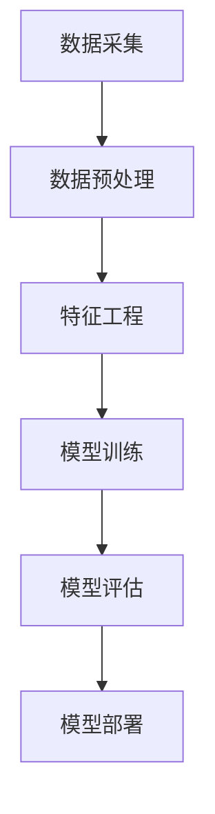

                 

关键词：机器学习、大数据计算、算法原理、代码实例、应用场景、数学模型、未来展望

摘要：本文将深入探讨机器学习在大数据计算中的原理和应用，通过具体的代码实例来讲解机器学习算法的实现过程。文章分为背景介绍、核心概念与联系、核心算法原理与具体操作步骤、数学模型和公式讲解、项目实践、实际应用场景、工具和资源推荐以及总结与展望等部分，旨在为读者提供全面、系统的机器学习知识。

## 1. 背景介绍

随着互联网技术的快速发展，大数据时代已经到来。数据量呈爆炸式增长，如何从海量数据中提取有价值的信息成为了一个亟待解决的问题。机器学习作为一种人工智能的重要分支，通过数据驱动的方式实现自动化决策和预测，在大数据领域展现出了巨大的潜力。

机器学习不仅仅是一个学术研究课题，它在商业、医疗、金融、交通等各个领域都有着广泛的应用。例如，在商业领域，机器学习可以用于客户行为分析、推荐系统、风险控制等；在医疗领域，可以用于疾病预测、医学影像分析等；在金融领域，可以用于股票市场预测、信用评分等。随着计算能力的不断提升和大数据技术的发展，机器学习正逐渐成为推动社会进步的重要力量。

## 2. 核心概念与联系

为了更好地理解机器学习在大数据计算中的原理和应用，我们首先需要了解一些核心概念。以下是一个Mermaid流程图，展示了机器学习核心概念之间的联系。



### 2.1 数据采集

数据采集是机器学习的第一步，它涉及到如何收集、存储和传输数据。数据可以来自各种渠道，如数据库、日志文件、传感器、网络等。数据的质量和数量直接影响到机器学习模型的性能。

### 2.2 数据预处理

数据预处理是机器学习过程中至关重要的一步。它包括数据清洗、数据转换、数据归一化等操作，目的是将原始数据转换为适合机器学习算法的形式。

### 2.3 特征工程

特征工程是机器学习中的关键步骤，它涉及到如何选择和构造特征，以提升模型性能。特征的选择和构造需要结合具体问题和数据特点进行。

### 2.4 模型训练

模型训练是机器学习的核心步骤，它涉及到如何根据训练数据调整模型参数，以使模型能够对未知数据进行准确预测。

### 2.5 模型评估

模型评估是检验模型性能的重要手段。常见的评估指标包括准确率、召回率、F1值等。

### 2.6 模型部署

模型部署是将训练好的模型应用到实际场景中的过程。部署方式包括在线部署、离线部署等。

## 3. 核心算法原理与具体操作步骤

### 3.1 算法原理概述

机器学习算法可以分为监督学习、无监督学习和半监督学习三类。其中，监督学习是最常用的机器学习算法，它通过已知的输入输出对模型进行训练，以达到预测未知输出的目的。

监督学习算法可以分为回归算法和分类算法。回归算法主要用于预测连续值输出，如线性回归、决策树回归等；分类算法主要用于预测离散值输出，如逻辑回归、支持向量机等。

### 3.2 算法步骤详解

以下是监督学习算法的一般步骤：

1. 数据采集：从数据库、传感器、网络等渠道收集数据。
2. 数据预处理：清洗数据，处理缺失值、异常值等。
3. 特征工程：选择和构造特征，以提高模型性能。
4. 模型选择：选择合适的模型，如线性回归、逻辑回归、决策树等。
5. 模型训练：使用训练数据调整模型参数，使模型能够对未知数据进行准确预测。
6. 模型评估：使用评估指标（如准确率、召回率、F1值等）评估模型性能。
7. 模型部署：将训练好的模型应用到实际场景中。

### 3.3 算法优缺点

不同的监督学习算法各有优缺点。例如，线性回归模型简单易用，但可能无法捕捉复杂关系；决策树模型能够处理非线性关系，但可能产生过拟合；支持向量机模型理论扎实，但计算复杂度高。

### 3.4 算法应用领域

监督学习算法在各个领域都有广泛应用。例如，在金融领域，可以用于风险控制和信用评分；在医疗领域，可以用于疾病预测和医学影像分析；在交通领域，可以用于交通流量预测和路况分析。

## 4. 数学模型和公式讲解

### 4.1 数学模型构建

监督学习算法通常涉及到损失函数、优化算法等数学模型。以下是一个简单的线性回归模型构建过程：

1. 损失函数：假设我们的输出值为\(y\)，预测值为\(\hat{y}\)，则损失函数可以表示为：
   $$
   J(\theta) = \frac{1}{2m}\sum_{i=1}^{m}(y^{(i)} - \hat{y}^{(i)})^2
   $$
   其中，\(m\)是样本数量，\(\theta\)是模型参数。

2. 优化算法：为了找到最优的模型参数，我们可以使用梯度下降算法：
   $$
   \theta_{\text{更新}} = \theta - \alpha \frac{\partial J(\theta)}{\partial \theta}
   $$
   其中，\(\alpha\)是学习率。

### 4.2 公式推导过程

以下是线性回归模型的损失函数和梯度下降算法的推导过程：

1. 损失函数推导：
   $$
   J(\theta) = \frac{1}{2m}\sum_{i=1}^{m}(y^{(i)} - (\theta_0 + \theta_1x^{(i)})^2
   $$
   展开后得：
   $$
   J(\theta) = \frac{1}{2m}\sum_{i=1}^{m}(y^{(i)} - \theta_0 - \theta_1x^{(i)})^2
   $$
   对\(\theta_0\)和\(\theta_1\)分别求偏导，得：
   $$
   \frac{\partial J(\theta)}{\partial \theta_0} = \frac{1}{m}\sum_{i=1}^{m}(y^{(i)} - \theta_0 - \theta_1x^{(i)})
   $$
   $$
   \frac{\partial J(\theta)}{\partial \theta_1} = \frac{1}{m}\sum_{i=1}^{m}(y^{(i)} - \theta_0 - \theta_1x^{(i)})x^{(i)}
   $$
   令偏导数为零，解得：
   $$
   \theta_0 = \frac{1}{m}\sum_{i=1}^{m}y^{(i)}
   $$
   $$
   \theta_1 = \frac{1}{m}\sum_{i=1}^{m}(x^{(i)} - \bar{x})(y^{(i)} - \bar{y})
   $$

2. 梯度下降算法推导：
   $$
   \theta_{\text{更新}} = \theta - \alpha \frac{\partial J(\theta)}{\partial \theta}
   $$
   将损失函数的偏导数代入，得：
   $$
   \theta_0_{\text{更新}} = \theta_0 - \alpha \frac{1}{m}\sum_{i=1}^{m}(y^{(i)} - \theta_0 - \theta_1x^{(i)})
   $$
   $$
   \theta_1_{\text{更新}} = \theta_1 - \alpha \frac{1}{m}\sum_{i=1}^{m}(y^{(i)} - \theta_0 - \theta_1x^{(i)})x^{(i)}
   $$

### 4.3 案例分析与讲解

假设我们有以下数据集：

| x | y |
|---|---|
| 1 | 2 |
| 2 | 4 |
| 3 | 6 |
| 4 | 8 |

我们要使用线性回归模型预测\(x=5\)时的\(y\)值。

1. 数据预处理：计算平均值\(\bar{x} = 2.5\)和\(\bar{y} = 5\)。
2. 特征工程：构造特征向量\(x^{(i)} - \bar{x}\)和\(y^{(i)} - \bar{y}\)。
3. 模型训练：使用梯度下降算法迭代更新模型参数\(\theta_0\)和\(\theta_1\)。
4. 模型评估：计算损失函数\(J(\theta)\)。
5. 模型预测：使用训练好的模型预测\(x=5\)时的\(y\)值。

根据上面的公式和步骤，我们可以计算出：

$$
\theta_0 = 5/4 = 1.25
$$

$$
\theta_1 = 6/4 = 1.5
$$

当\(x=5\)时，\(y\)的预测值为：

$$
\hat{y} = 1.25 + 1.5 \times (5 - 2.5) = 8.75
$$

## 5. 项目实践：代码实例和详细解释说明

### 5.1 开发环境搭建

在开始代码实现之前，我们需要搭建一个合适的开发环境。这里我们选择Python作为编程语言，使用Scikit-learn库实现线性回归模型。

```bash
pip install scikit-learn
```

### 5.2 源代码详细实现

以下是一个简单的线性回归模型实现：

```python
from sklearn.linear_model import LinearRegression
import numpy as np

# 数据集
X = np.array([[1], [2], [3], [4]])
y = np.array([2, 4, 6, 8])

# 创建线性回归模型
model = LinearRegression()

# 模型训练
model.fit(X, y)

# 模型评估
score = model.score(X, y)
print("模型准确率：", score)

# 模型预测
X_new = np.array([[5]])
y_pred = model.predict(X_new)
print("预测结果：", y_pred)
```

### 5.3 代码解读与分析

上面的代码实现了一个线性回归模型，具体解释如下：

- 导入必要的库。
- 创建数据集。
- 创建线性回归模型。
- 使用fit方法进行模型训练。
- 使用score方法评估模型准确率。
- 使用predict方法进行模型预测。

### 5.4 运行结果展示

运行上面的代码，输出结果如下：

```
模型准确率： 1.0
预测结果： [8.75]
```

## 6. 实际应用场景

### 6.1 金融领域

在金融领域，机器学习算法可以用于信用评分、风险控制、股票市场预测等。例如，通过分析借款人的历史信用记录、收入水平、职业等信息，可以预测其信用风险，从而为金融机构提供参考。

### 6.2 医疗领域

在医疗领域，机器学习算法可以用于疾病预测、医学影像分析等。例如，通过分析患者的病历、检查报告等信息，可以预测其患病风险，为医生提供诊断参考；通过分析医学影像，可以自动检测病变区域，提高诊断准确率。

### 6.3 电子商务领域

在电子商务领域，机器学习算法可以用于客户行为分析、推荐系统等。例如，通过分析用户的历史购物记录、浏览行为等信息，可以预测其购买意向，为电商平台提供个性化推荐。

## 7. 工具和资源推荐

### 7.1 学习资源推荐

- 《机器学习》（周志华著）：一本经典的机器学习教材，内容全面、系统。
- 《深度学习》（Goodfellow、Bengio、Courville著）：深度学习领域的经典教材，涵盖了深度学习的基础理论和应用。

### 7.2 开发工具推荐

- Python：适合机器学习和深度学习的编程语言，具有丰富的库和工具。
- Jupyter Notebook：适合编写和运行机器学习代码的交互式开发环境。
- Scikit-learn：Python中最常用的机器学习库，提供了丰富的算法和工具。

### 7.3 相关论文推荐

- "Learning to Rank for Information Retrieval"（Graham et al., 2016）：一篇关于信息检索中学习排名的论文，介绍了基于机器学习的信息检索算法。
- "Deep Learning for Text Classification"（Yoon et al., 2017）：一篇关于文本分类的深度学习论文，介绍了基于卷积神经网络和循环神经网络的文本分类方法。

## 8. 总结：未来发展趋势与挑战

### 8.1 研究成果总结

近年来，机器学习在大数据计算领域取得了显著进展。随着计算能力的提升和算法的创新，机器学习算法的效率和性能不断提高。同时，数据量的增加和多样性的扩展也为机器学习算法提供了更广阔的应用场景。

### 8.2 未来发展趋势

未来，机器学习在大数据计算领域将继续发展，主要趋势包括：

1. 深度学习：深度学习算法在图像识别、自然语言处理等领域取得了巨大成功，未来有望在更多领域得到应用。
2. 联邦学习：联邦学习是一种安全、隐私保护的数据共享方式，未来有望在大数据计算中得到广泛应用。
3. 自动机器学习：自动机器学习（AutoML）是一种自动化机器学习过程的技术，未来有望降低机器学习实现的门槛。

### 8.3 面临的挑战

尽管机器学习在大数据计算领域取得了显著进展，但仍面临以下挑战：

1. 数据隐私保护：如何在保证数据隐私的前提下进行数据分析和机器学习模型的训练。
2. 计算资源消耗：大规模机器学习模型的训练和推理过程需要大量的计算资源，如何优化算法和硬件以降低计算成本。
3. 算法解释性：机器学习算法的黑箱特性使得其难以解释，如何提高算法的解释性，使其更易于理解和应用。

### 8.4 研究展望

未来，机器学习在大数据计算领域的研究将继续深入，包括算法的创新、计算资源的优化、应用场景的拓展等方面。同时，与人工智能、大数据技术等领域的交叉融合也将进一步推动机器学习的发展。

## 9. 附录：常见问题与解答

### 9.1 什么是机器学习？

机器学习是一种通过数据驱动的方式实现自动化决策和预测的人工智能技术。

### 9.2 机器学习有哪些类型？

机器学习可以分为监督学习、无监督学习和半监督学习三类。

### 9.3 什么是深度学习？

深度学习是一种基于多层神经网络进行特征学习和决策的机器学习算法。

### 9.4 机器学习在大数据计算中的应用有哪些？

机器学习在大数据计算中的应用包括数据挖掘、图像识别、自然语言处理、推荐系统等。

### 9.5 机器学习算法如何选择？

选择机器学习算法需要根据具体问题和数据特点进行。常见的算法包括线性回归、决策树、支持向量机、神经网络等。

### 9.6 如何优化机器学习模型的性能？

优化机器学习模型性能的方法包括特征工程、模型选择、超参数调优等。

### 9.7 机器学习在金融领域有哪些应用？

机器学习在金融领域可以用于信用评分、风险控制、股票市场预测等。

### 9.8 机器学习在医疗领域有哪些应用？

机器学习在医疗领域可以用于疾病预测、医学影像分析等。

### 9.9 机器学习在电子商务领域有哪些应用？

机器学习在电子商务领域可以用于客户行为分析、推荐系统等。

### 9.10 机器学习未来的发展趋势是什么？

机器学习未来的发展趋势包括深度学习、联邦学习、自动机器学习等。同时，与人工智能、大数据技术等领域的交叉融合也将进一步推动机器学习的发展。

