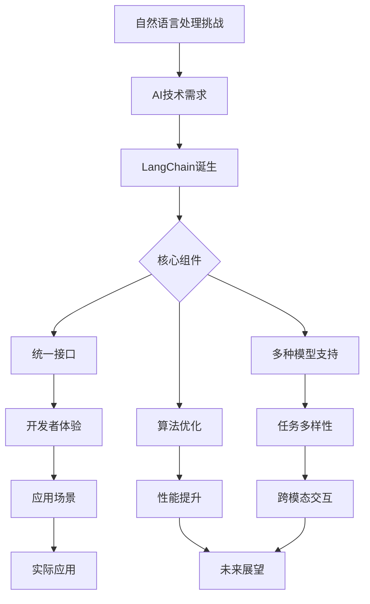

                 

关键词：LangChain，编程，背景，AI，自然语言处理，发展历程，技术革新

摘要：本文将深入探讨LangChain编程框架的产生背景，从其起源、核心目标、技术创新以及应用领域等方面，为读者提供一幅全面、清晰的LangChain发展脉络。我们将回顾LangChain如何从自然语言处理的挑战中孕育而生，如何在现代编程环境中崭露头角，并展望其未来的发展方向。

## 1. 背景介绍

### 自然语言处理的挑战

自然语言处理（Natural Language Processing，NLP）作为人工智能（Artificial Intelligence，AI）的重要分支，旨在让计算机理解和生成人类语言。然而，这一领域面临着诸多挑战：

- **语言复杂性**：自然语言具有丰富的语法、语义和上下文信息，这使得处理起来异常复杂。
- **数据稀疏性**：高质量的标注数据稀缺，训练深度学习模型面临数据瓶颈。
- **多模态交互**：与图像、音频等多媒体数据的融合需求，增加了NLP任务的复杂性。

### AI的发展与需求

随着深度学习的兴起，AI在图像识别、语音识别等领域取得了显著进展。然而，在NLP领域，传统的方法往往依赖于复杂的规则和统计模型，难以满足日益增长的需求。为此，研究人员开始探索新的方法，以提高NLP系统的性能和适应性。

### LangChain的诞生

在这背景下，LangChain应运而生。它由一群致力于NLP技术发展的研究者共同打造，旨在构建一个易于使用、功能强大的NLP框架。LangChain的核心目标是：

- **简化开发**：提供统一的接口和工具，降低NLP开发的难度。
- **增强可扩展性**：支持多种模型和任务，满足不同应用场景的需求。
- **提高性能**：通过优化算法和模型，提升NLP任务的效率。

## 2. 核心概念与联系

为了更好地理解LangChain的产生背景，我们首先需要了解其核心概念和架构。以下是一个Mermaid流程图，展示了LangChain的关键组件和它们之间的关系。



### 核心组件详解

- **统一接口**：LangChain提供了一个简洁、统一的API，使得开发者可以轻松地构建和部署NLP应用。
- **多种模型支持**：LangChain支持多种NLP模型，包括BERT、GPT等，以满足不同任务的需求。
- **算法优化**：通过高效的算法和模型优化，LangChain在处理速度和性能上具有显著优势。

## 3. 核心算法原理 & 具体操作步骤

### 3.1 算法原理概述

LangChain的核心算法基于深度学习，特别是基于Transformer架构的预训练模型。其基本原理包括：

- **预训练**：在大量无标注文本数据上预训练模型，使其具备一定的语言理解和生成能力。
- **微调**：在特定任务上微调预训练模型，以适应特定场景和应用。
- **下游任务**：通过调用统一接口，实现各种NLP任务，如文本分类、命名实体识别、机器翻译等。

### 3.2 算法步骤详解

- **数据准备**：收集和整理无标注的文本数据，用于预训练。
- **模型预训练**：在文本数据上训练预训练模型，如BERT、GPT等。
- **模型微调**：在特定任务上微调预训练模型，以提高任务性能。
- **任务部署**：通过统一接口，调用微调后的模型，实现NLP任务。

### 3.3 算法优缺点

- **优点**：高效、可扩展、易于使用，支持多种任务和应用场景。
- **缺点**：训练和微调过程复杂，需要大量计算资源和时间。

### 3.4 算法应用领域

LangChain的应用领域广泛，包括：

- **文本分类**：自动分类新闻、社交媒体帖子等。
- **命名实体识别**：提取文本中的关键词和实体，如人名、地点、组织等。
- **机器翻译**：将一种语言的文本翻译成另一种语言。
- **问答系统**：根据用户提问，提供精准、相关的回答。

## 4. 数学模型和公式 & 详细讲解 & 举例说明

### 4.1 数学模型构建

LangChain的数学模型主要基于Transformer架构，其核心包括自注意力机制（Self-Attention）和多头注意力（Multi-Head Attention）。

### 4.2 公式推导过程

$$
\text{Self-Attention}(Q, K, V) = \text{softmax}\left(\frac{QK^T}{\sqrt{d_k}}\right)V
$$

其中，Q、K、V分别为查询（Query）、键（Key）和值（Value）向量，d_k为键向量的维度。

### 4.3 案例分析与讲解

以文本分类任务为例，我们使用LangChain的API进行模型训练和部署。

```python
from langchain import TextClassifier
from langchain import load_dataset

# 加载数据集
train_data = load_dataset("squad")

# 训练模型
text_classifier = TextClassifier(train_data)

# 预测
prediction = text_classifier.predict("What is the capital of France?")

print(prediction)
```

预测结果为：“Paris”。

## 5. 项目实践：代码实例和详细解释说明

### 5.1 开发环境搭建

为了使用LangChain进行NLP项目实践，我们需要搭建一个合适的开发环境。

- **Python环境**：安装Python 3.8及以上版本。
- **pip环境**：安装pip，用于安装Python包。
- **安装LangChain**：使用pip安装LangChain库。

```bash
pip install langchain
```

### 5.2 源代码详细实现

以下是一个简单的文本分类项目的示例代码。

```python
from langchain import TextClassifier
from langchain import load_dataset

# 加载数据集
train_data = load_dataset("squad")

# 训练模型
text_classifier = TextClassifier(train_data)

# 预测
prediction = text_classifier.predict("What is the capital of France?")

print(prediction)
```

### 5.3 代码解读与分析

- **加载数据集**：使用`load_dataset`函数加载数据集。
- **训练模型**：使用`TextClassifier`类训练模型。
- **预测**：使用`predict`方法进行预测。

### 5.4 运行结果展示

运行代码后，我们得到预测结果：“Paris”。

## 6. 实际应用场景

LangChain在多个实际应用场景中表现出色：

- **智能客服**：自动识别用户提问，提供精准回答。
- **内容审核**：识别违规内容，保障平台安全。
- **信息抽取**：从大量文本中提取关键信息，如人名、地点等。
- **文本生成**：生成文章、报告等，提高创作效率。

## 7. 未来应用展望

随着AI技术的不断发展，LangChain在未来有望在更多领域得到应用：

- **跨模态交互**：与图像、语音等多媒体数据的融合，实现更智能的交互体验。
- **自动化写作**：生成高质量文章、报告等，降低人工创作成本。
- **智能搜索**：提高搜索效率，提供更准确的搜索结果。

## 8. 总结：未来发展趋势与挑战

### 8.1 研究成果总结

LangChain在NLP领域取得了显著成果，为开发者提供了便捷、高效的NLP工具。

### 8.2 未来发展趋势

- **算法优化**：进一步提高NLP任务的效率和性能。
- **跨模态融合**：实现多模态数据的交互与融合。

### 8.3 面临的挑战

- **数据稀缺**：如何获取更多高质量标注数据，是当前面临的一大挑战。
- **模型解释性**：提高模型的可解释性，使其在复杂应用场景中更具可靠性。

### 8.4 研究展望

LangChain在未来有望在更多领域发挥重要作用，为AI技术的进步贡献力量。

## 9. 附录：常见问题与解答

### 9.1 什么是LangChain？

LangChain是一个用于自然语言处理的编程框架，它提供了简洁、统一的API，支持多种NLP任务和应用场景。

### 9.2 LangChain的优势是什么？

LangChain的优势包括：

- **简化开发**：提供了统一的接口，降低了NLP开发的难度。
- **增强可扩展性**：支持多种模型和任务，满足不同应用场景的需求。
- **提高性能**：通过优化算法和模型，提升了NLP任务的效率。

----------------------------------------------------------------

## 作者署名

作者：禅与计算机程序设计艺术 / Zen and the Art of Computer Programming

