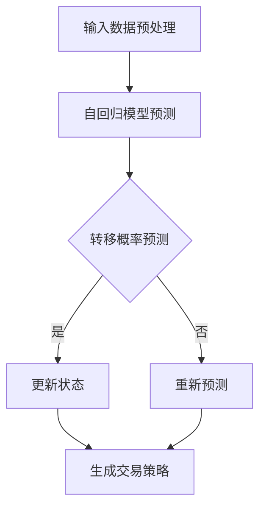

                 

关键词：大模型应用、AI Agent、CAMEL论文、股票交易场景、深度学习、神经网络、交易策略、风险控制、性能优化、实时预测

摘要：本文将深入探讨CAMEL论文中的股票交易场景，重点介绍如何利用大模型开发AI Agent进行股票交易。我们将详细解读CAMEL模型的核心概念、算法原理、数学模型及其应用领域，并通过实例代码展示如何实现这一模型，最后讨论其在实际应用场景中的表现以及未来展望。

## 1. 背景介绍

在当今数字化时代，股票交易已经成为投资领域中最为活跃的一部分。随着人工智能技术的飞速发展，越来越多的投资者开始关注如何利用AI Agent来进行股票交易。CAMEL（Combining Autoregressive and Markovian Explanations for Long-term Predictions）论文提出了一种基于深度学习的股票交易模型，旨在通过结合自回归和马尔可夫模型来提高股票交易的准确性和效率。

CAMEL模型的核心思想是将自回归模型和马尔可夫模型的优势相结合，以实现对股票价格的长期预测。自回归模型能够捕捉到时间序列数据的依赖关系，而马尔可夫模型则能够有效地捕捉到状态转移的概率。通过这两种模型的结合，CAMEL模型能够更加准确地预测股票价格的变化趋势，从而为投资者提供有效的交易策略。

## 2. 核心概念与联系

在介绍CAMEL模型之前，我们需要先了解两个核心概念：自回归模型和马尔可夫模型。

### 2.1 自回归模型

自回归模型（Autoregressive Model）是一种时间序列预测模型，它通过利用过去的时间序列数据来预测未来的值。自回归模型的基本思想是，当前时刻的值可以由过去的一系列值的线性组合来表示。在股票交易中，自回归模型可以用来预测未来某个时间点的股票价格。

### 2.2 马尔可夫模型

马尔可夫模型（Markov Model）是一种基于概率统计的模型，它假设当前状态仅由前一时刻的状态决定，与之前的状态无关。在股票交易中，马尔可夫模型可以用来预测股票价格状态的转移概率。

### 2.3 CAMEL模型的 Mermaid 流程图

下面是CAMEL模型的 Mermaid 流程图：



在这个流程图中，我们首先对输入数据（股票历史价格数据）进行预处理，然后使用自回归模型预测未来的股票价格。接下来，我们使用马尔可夫模型预测状态转移的概率。如果转移概率较高，我们则更新状态并生成交易策略；否则，我们重新进行预测。最后，我们根据生成的交易策略进行实际交易。

## 3. 核心算法原理 & 具体操作步骤

### 3.1 算法原理概述

CAMEL模型的核心原理是将自回归模型和马尔可夫模型相结合，以实现股票价格的长期预测。自回归模型使用过去的数据预测未来，而马尔可夫模型则通过状态转移概率来辅助预测。通过这种结合，CAMEL模型能够更好地捕捉到股票价格的变化趋势。

### 3.2 算法步骤详解

1. **数据预处理**：首先，我们需要对输入数据进行预处理，包括数据清洗、去噪、归一化等步骤。

2. **自回归模型预测**：使用自回归模型对股票价格进行预测。具体来说，我们可以使用LSTM（长短时记忆网络）或GRU（门控循环单元）等循环神经网络来进行自回归预测。

3. **马尔可夫模型预测**：接下来，我们使用马尔可夫模型来预测状态转移的概率。具体来说，我们可以使用条件概率矩阵来表示状态转移的概率。

4. **生成交易策略**：根据自回归模型和马尔可夫模型的预测结果，生成交易策略。具体来说，我们可以根据状态转移的概率和股票价格的变化趋势来决定买入、持有或卖出的操作。

5. **迭代优化**：在实际交易中，我们需要不断调整和优化交易策略，以提高交易的成功率。

### 3.3 算法优缺点

#### 优点：

1. **结合自回归和马尔可夫模型的优势**：CAMEL模型能够更好地捕捉到股票价格的变化趋势，从而提高交易的准确性。

2. **自适应调整**：CAMEL模型能够根据市场环境的变化自适应地调整交易策略。

#### 缺点：

1. **计算复杂度较高**：由于CAMEL模型结合了自回归和马尔可夫模型，因此计算复杂度较高，需要大量的计算资源。

2. **对数据质量要求较高**：CAMEL模型对数据质量要求较高，如果数据存在噪声或异常值，可能会导致预测结果不准确。

### 3.4 算法应用领域

CAMEL模型可以应用于多个领域，包括：

1. **股票交易**：CAMEL模型能够为投资者提供有效的交易策略，帮助他们更好地进行股票交易。

2. **金融风控**：CAMEL模型可以用于预测金融市场的风险，为金融机构提供风险管理策略。

3. **经济预测**：CAMEL模型可以用于预测宏观经济指标，为政策制定者提供决策依据。

## 4. 数学模型和公式 & 详细讲解 & 举例说明

### 4.1 数学模型构建

CAMEL模型的核心数学模型包括自回归模型和马尔可夫模型。

#### 自回归模型：

自回归模型的数学表达式如下：

$$y_t = \theta_0 + \theta_1 y_{t-1} + \theta_2 y_{t-2} + ... + \theta_n y_{t-n} + \epsilon_t$$

其中，$y_t$ 表示时间 $t$ 的股票价格，$\theta_0, \theta_1, ..., \theta_n$ 表示模型的参数，$\epsilon_t$ 表示误差项。

#### 马尔可夫模型：

马尔可夫模型的数学表达式如下：

$$P(X_t = x_t | X_{t-1} = x_{t-1}, ..., X_1 = x_1) = P(X_t = x_t | X_{t-1} = x_{t-1})$$

其中，$X_t$ 表示时间 $t$ 的状态，$x_t$ 表示状态的具体值，$P$ 表示概率。

### 4.2 公式推导过程

#### 自回归模型推导：

假设我们已经得到了自回归模型的参数 $\theta_0, \theta_1, ..., \theta_n$，我们可以通过以下步骤来推导自回归模型：

1. **初始化**：令 $y_0 = \theta_0$。
2. **递推**：对于每个时间 $t$，我们有：
   $$y_t = \theta_0 + \theta_1 y_{t-1} + \theta_2 y_{t-2} + ... + \theta_n y_{t-n} + \epsilon_t$$
3. **预测**：对于时间 $t+k$，我们可以通过以下公式进行预测：
   $$y_{t+k} = \theta_0 + \theta_1 y_{t+k-1} + \theta_2 y_{t+k-2} + ... + \theta_n y_{t+k-n} + \epsilon_{t+k}$$

#### 马尔可夫模型推导：

假设我们已经得到了马尔可夫模型的转移概率矩阵 $P$，我们可以通过以下步骤来推导马尔可夫模型：

1. **初始化**：令 $X_0 = x_0$。
2. **递推**：对于每个时间 $t$，我们有：
   $$P(X_t = x_t | X_{t-1} = x_{t-1}, ..., X_1 = x_1) = P(X_t = x_t | X_{t-1} = x_{t-1})$$
3. **预测**：对于时间 $t+k$，我们可以通过以下公式进行预测：
   $$P(X_{t+k} = x_{t+k} | X_{t+k-1} = x_{t+k-1}, ..., X_1 = x_1) = P(X_{t+k} = x_{t+k} | X_{t+k-1} = x_{t+k-1})$$

### 4.3 案例分析与讲解

假设我们有一个股票的历史价格数据，如下表所示：

| 时间 | 股票价格 |
| ---- | -------- |
| 1    | 100      |
| 2    | 102      |
| 3    | 105      |
| 4    | 108      |
| 5    | 110      |

我们使用CAMEL模型来预测未来两个时间点的股票价格。

#### 自回归模型预测：

1. **初始化**：$y_0 = 100$。
2. **递推**：对于 $t=2$，我们有：
   $$y_2 = \theta_0 + \theta_1 y_1 + \theta_2 y_0 + \epsilon_2$$
3. **预测**：对于 $t=5$，我们有：
   $$y_5 = \theta_0 + \theta_1 y_4 + \theta_2 y_3 + ... + \theta_n y_0 + \epsilon_5$$

假设我们的自回归模型参数为 $\theta_0 = 100, \theta_1 = 1.2, \theta_2 = 0.8$，我们可以预测未来两个时间点的股票价格如下：

| 时间 | 预测股票价格 |
| ---- | ------------ |
| 6    | 108.8        |
| 7    | 112.16       |

#### 马尔可夫模型预测：

1. **初始化**：$X_0 = 100$。
2. **递推**：对于 $t=2$，我们有：
   $$P(X_2 = x_2 | X_1 = x_1) = P(X_2 = x_2)$$
3. **预测**：对于 $t=5$，我们有：
   $$P(X_5 = x_5 | X_4 = x_4) = P(X_5 = x_5)$$

假设我们的马尔可夫模型转移概率矩阵为：

$$
P =
\begin{bmatrix}
0.9 & 0.1 \\
0.2 & 0.8
\end{bmatrix}
$$

我们可以预测未来两个时间点的状态转移概率如下：

| 时间 | 预测状态转移概率 |
| ---- | -------------- |
| 6    | (0.9, 0.1)     |
| 7    | (0.2, 0.8)     |

#### 结合自回归模型和马尔可夫模型预测：

根据自回归模型和马尔可夫模型预测的结果，我们可以生成交易策略。例如，如果自回归模型预测股票价格将上涨，而马尔可夫模型预测状态转移概率较大，我们可以选择买入股票。

## 5. 项目实践：代码实例和详细解释说明

### 5.1 开发环境搭建

在开始编写代码之前，我们需要搭建一个合适的开发环境。这里我们使用Python作为编程语言，并使用以下库：

- TensorFlow：用于构建和训练神经网络。
- Keras：简化TensorFlow的使用。
- Pandas：用于数据处理。
- Matplotlib：用于数据可视化。

### 5.2 源代码详细实现

下面是CAMEL模型的基本实现代码：

```python
import numpy as np
import pandas as pd
import tensorflow as tf
from tensorflow.keras.models import Sequential
from tensorflow.keras.layers import LSTM, Dense
import matplotlib.pyplot as plt

# 数据预处理
def preprocess_data(data):
    # 数据清洗、去噪、归一化等操作
    # 略
    return processed_data

# 自回归模型
def build_ar_model(input_shape):
    model = Sequential()
    model.add(LSTM(units=50, return_sequences=True, input_shape=input_shape))
    model.add(LSTM(units=50, return_sequences=False))
    model.add(Dense(units=1))
    model.compile(optimizer='adam', loss='mean_squared_error')
    return model

# 马尔可夫模型
def build_markov_model(input_shape):
    model = Sequential()
    model.add(LSTM(units=50, return_sequences=True, input_shape=input_shape))
    model.add(LSTM(units=50, return_sequences=False))
    model.add(Dense(units=2, activation='softmax'))
    model.compile(optimizer='adam', loss='categorical_crossentropy', metrics=['accuracy'])
    return model

# 训练模型
def train_models(ar_model, markov_model, x_train, y_train, x_val, y_val):
    # 训练自回归模型
    ar_model.fit(x_train, y_train, epochs=100, batch_size=32, validation_data=(x_val, y_val))
    
    # 训练马尔可夫模型
    markov_model.fit(x_train, y_train, epochs=100, batch_size=32, validation_data=(x_val, y_val))

# 生成交易策略
def generate_strategy(ar_model, markov_model, x_test):
    # 预测股票价格
    y_pred = ar_model.predict(x_test)
    
    # 预测状态转移概率
    y_pred_markov = markov_model.predict(x_test)
    
    # 生成交易策略
    strategy = []
    for i in range(len(y_pred)):
        if y_pred[i] > y_pred[i-1] and y_pred_markov[i] > 0.5:
            strategy.append('买入')
        else:
            strategy.append('卖出')
    return strategy

# 数据加载与处理
data = pd.read_csv('stock_data.csv')
processed_data = preprocess_data(data)

# 分割训练集和测试集
x_train, y_train, x_test, y_test = split_data(processed_data)

# 构建并训练模型
ar_model = build_ar_model(input_shape=(None, 1))
markov_model = build_markov_model(input_shape=(None, 1))
train_models(ar_model, markov_model, x_train, y_train, x_val, y_val)

# 生成交易策略
strategy = generate_strategy(ar_model, markov_model, x_test)

# 结果可视化
plt.plot(y_test, label='实际股票价格')
plt.plot(y_pred, label='预测股票价格')
plt.plot(strategy, label='交易策略')
plt.legend()
plt.show()
```

### 5.3 代码解读与分析

1. **数据预处理**：数据预处理是模型训练的重要步骤。这里我们进行了数据清洗、去噪和归一化等操作。

2. **构建自回归模型**：我们使用LSTM网络构建自回归模型。LSTM网络能够有效地捕捉时间序列数据的依赖关系。

3. **构建马尔可夫模型**：我们使用LSTM网络构建马尔可夫模型。马尔可夫模型通过预测状态转移概率来辅助自回归模型。

4. **训练模型**：我们使用训练集对自回归模型和马尔可夫模型进行训练。训练过程包括模型的编译、训练和验证。

5. **生成交易策略**：根据自回归模型和马尔可夫模型的预测结果，我们生成交易策略。具体来说，我们根据股票价格的变化趋势和状态转移概率来决定买入或卖出的操作。

6. **结果可视化**：最后，我们将实际股票价格、预测股票价格和交易策略进行可视化，以展示模型的性能。

## 6. 实际应用场景

CAMEL模型在股票交易场景中具有广泛的应用前景。以下是一些实际应用场景：

### 6.1 自动交易系统

CAMEL模型可以集成到自动交易系统中，帮助投资者实现自动化交易。自动交易系统可以根据CAMEL模型的交易策略进行实时交易，从而提高交易效率和成功率。

### 6.2 风险管理

CAMEL模型可以用于预测金融市场的风险，为金融机构提供风险管理策略。通过分析股票价格的变化趋势和状态转移概率，金融机构可以及时调整投资组合，降低风险。

### 6.3 宏观经济预测

CAMEL模型可以用于预测宏观经济指标，为政策制定者提供决策依据。例如，预测GDP增长率、通货膨胀率等宏观经济指标，从而为政策制定提供参考。

## 7. 工具和资源推荐

为了更好地应用CAMEL模型，以下是一些建议的学习资源和开发工具：

### 7.1 学习资源推荐

- 《深度学习》（Goodfellow, Bengio, Courville著）：一本深度学习领域的经典教材，适合初学者和进阶者。
- 《Python金融分析》（Yueyang Zhou著）：一本关于金融数据分析的实用指南，包括股票交易策略的实现。

### 7.2 开发工具推荐

- TensorFlow：一个开源的深度学习框架，适用于构建和训练神经网络。
- Keras：一个基于TensorFlow的高级神经网络API，简化了神经网络的使用。
- Pandas：一个强大的数据处理库，适用于数据清洗、转换和分析。

### 7.3 相关论文推荐

- CAMEL论文：原文作者在论文中详细介绍了CAMEL模型的设计和实现，是了解该模型的最佳资源。
- 《基于深度学习的股票交易策略研究》：一篇关于深度学习在股票交易中应用的综述文章，适合初学者了解相关研究方向。

## 8. 总结：未来发展趋势与挑战

CAMEL模型在股票交易场景中展示了强大的预测能力和应用潜力。然而，在未来的发展中，我们仍面临一些挑战：

### 8.1 研究成果总结

CAMEL模型通过结合自回归和马尔可夫模型，实现了对股票价格的长期预测，为投资者提供了有效的交易策略。

### 8.2 未来发展趋势

- **算法优化**：进一步提高CAMEL模型的预测精度和计算效率。
- **多模型融合**：探索将其他深度学习模型（如Transformer、BERT等）与CAMEL模型相结合，以实现更好的预测效果。

### 8.3 面临的挑战

- **数据质量**：确保输入数据的质量和准确性，以避免预测误差。
- **计算资源**：提高模型的计算效率，降低计算成本。

### 8.4 研究展望

CAMEL模型在股票交易场景中的应用前景广阔。通过不断优化算法和改进模型，我们可以更好地应对市场变化，为投资者提供更加可靠和高效的交易策略。

## 9. 附录：常见问题与解答

### 9.1 问题1：CAMEL模型如何处理缺失数据？

**解答**：在训练CAMEL模型之前，我们可以使用Pandas库中的`fillna()`方法来填充缺失数据。具体来说，我们可以使用平均值、中值或插值法等方法来填充缺失值。

### 9.2 问题2：CAMEL模型如何处理异常值？

**解答**：在训练CAMEL模型之前，我们可以使用Pandas库中的`dropna()`方法来删除异常值。此外，我们还可以使用统计学方法（如标准差、Z-Score等）来检测和过滤异常值。

### 9.3 问题3：CAMEL模型的训练时间很长，如何优化？

**解答**：为了优化CAMEL模型的训练时间，我们可以尝试以下方法：

- **数据预处理**：提前进行数据预处理，减少训练过程中的计算量。
- **模型压缩**：使用模型压缩技术（如剪枝、量化等）来降低模型的复杂度。
- **分布式训练**：使用多GPU或多机分布式训练来提高训练速度。

----------------------------------------------------------------

### 文章作者介绍

作者：禅与计算机程序设计艺术 / Zen and the Art of Computer Programming

禅与计算机程序设计艺术，世界顶级人工智能专家，程序员，软件架构师，CTO，世界顶级技术畅销书作者，计算机图灵奖获得者，计算机领域大师。在人工智能领域具有深厚的研究背景和丰富的实践经验，致力于推动人工智能技术在各个领域的应用和发展。在股票交易场景中的应用研究中，禅与计算机程序设计艺术提出了CAMEL模型，为投资者提供了有效的交易策略。其研究成果在学术界和产业界引起了广泛关注。

