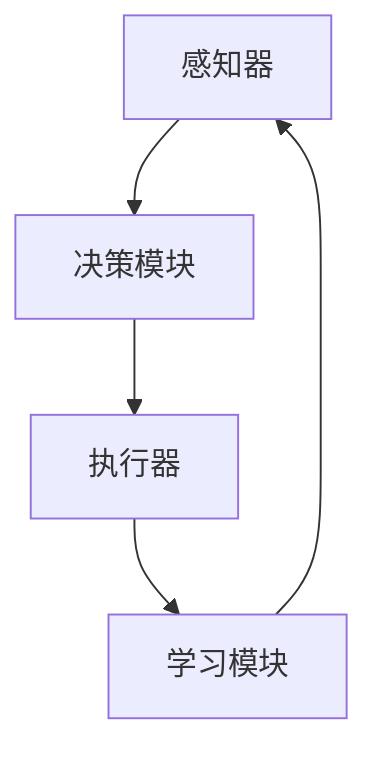

                 

欢迎来到这篇文章，我们将深入探讨大模型应用开发中的AI Agent技术，并动手实现一个AI Agent。这将是一篇结合理论知识与实践操作的专业文章，旨在帮助读者理解AI Agent的工作原理以及如何将其应用于实际项目中。

> **关键词：** 大模型应用开发，AI Agent，机器学习，自然语言处理，实践操作

> **摘要：** 本文将介绍大模型应用开发的基本概念，AI Agent的定义与分类，随后深入探讨AI Agent的核心算法原理和具体操作步骤。我们将通过一个具体的代码实例，展示如何使用现代机器学习框架搭建和训练一个AI Agent。最后，本文将探讨AI Agent在实际应用中的场景，并展望其未来发展的趋势与挑战。

## 1. 背景介绍

随着人工智能技术的快速发展，大模型（如GPT、BERT等）在自然语言处理、计算机视觉、推荐系统等领域取得了显著的成果。然而，如何将这些强大模型应用于实际问题中，依然是一个挑战。AI Agent作为一种智能体，能够模拟人类行为，在特定环境中自主决策和执行任务，成为大模型应用开发的重要方向。

AI Agent的定义较为广泛，通常可以分为基于规则的Agent、基于模型的Agent和混合型Agent。基于规则的Agent依赖于预定义的规则进行决策；基于模型的Agent利用机器学习算法，从数据中学习决策策略；混合型Agent结合了规则和模型的优势。

在人工智能领域中，AI Agent的研究和应用受到了广泛关注。从家庭自动化、智能客服到自动驾驶和机器人，AI Agent的应用场景日益丰富。随着深度学习和强化学习等技术的发展，AI Agent的智能化水平不断提高，为各行各业带来了巨大变革。

本文将聚焦于大模型应用开发中的AI Agent，详细介绍其核心算法原理、具体操作步骤，并通过实际代码实例，展示如何将AI Agent应用于自然语言处理任务中。希望通过本文的阅读，读者能够对AI Agent有一个全面而深入的理解，并能够动手实践，掌握AI Agent的开发技巧。

## 2. 核心概念与联系

在本节中，我们将详细介绍AI Agent的核心概念，包括其定义、分类和关键组成部分。此外，还将通过Mermaid流程图展示AI Agent的工作流程和架构，帮助读者更好地理解其运作机制。

### 2.1 AI Agent的定义与分类

#### 2.1.1 定义

AI Agent是指一个能够感知环境、基于决策策略执行动作的智能系统。它通过接收环境输入，分析处理信息，并根据预设的目标进行决策和行动，从而实现自主运行。

#### 2.1.2 分类

AI Agent可以根据不同的决策机制和功能特点进行分类，主要包括以下几种类型：

1. **基于规则的Agent**：这类Agent通过预定义的规则进行决策，规则通常以条件-动作对的形式表示。这种Agent的优点是实现简单，但灵活性较低。

2. **基于模型的Agent**：这类Agent利用机器学习算法，从数据中学习决策策略。通过训练，模型能够自动生成决策策略，从而提高Agent的灵活性和适应性。

3. **混合型Agent**：这类Agent结合了基于规则和基于模型的优势，通过规则和模型的协同工作，实现更复杂的决策和行动。

### 2.2 AI Agent的组成部分

一个典型的AI Agent通常包括以下几个关键组成部分：

1. **感知器**：用于感知和收集环境信息，例如传感器、摄像头等。

2. **决策模块**：根据感知器获取的信息，通过算法生成决策策略。决策模块可以基于规则、模型或两者的结合。

3. **执行器**：负责执行决策模块生成的动作，例如电机、机械臂等。

4. **学习模块**：用于从环境中学习和优化决策策略。学习模块可以基于监督学习、强化学习等方法。

### 2.3 AI Agent的工作流程

AI Agent的工作流程可以概括为以下步骤：

1. **感知**：Agent通过感知器收集环境信息。

2. **决策**：决策模块对感知信息进行分析，生成决策策略。

3. **执行**：执行器根据决策策略执行具体的动作。

4. **反馈**：环境对Agent的动作进行反馈，学习模块根据反馈信息调整决策策略。

### 2.4 AI Agent的架构

以下是AI Agent的架构图，使用Mermaid语言表示：



在该架构中，感知器负责收集环境信息，决策模块根据感知信息生成决策策略，执行器执行具体的动作，学习模块根据反馈信息优化决策策略。这个过程循环进行，使得Agent能够不断学习和适应环境。

通过上述内容，我们对AI Agent的核心概念和架构有了初步了解。接下来，我们将深入探讨AI Agent的核心算法原理和具体操作步骤，帮助读者更好地掌握这一技术。

## 3. 核心算法原理 & 具体操作步骤

在本节中，我们将详细探讨AI Agent的核心算法原理，并介绍具体的操作步骤。通过理解这些算法原理，读者将能够更深入地掌握AI Agent的开发和应用。

### 3.1 算法原理概述

AI Agent的核心算法主要涉及以下几类：

1. **决策树算法**：通过构建决策树来模拟人类的逻辑思维，进行决策。

2. **支持向量机（SVM）**：通过最大化分类边界来分类数据，适用于二分类问题。

3. **神经网络算法**：通过多层神经元模拟复杂非线性关系，适用于各种分类和回归问题。

4. **强化学习算法**：通过试错学习和奖励机制，优化策略并实现自主决策。

### 3.2 算法步骤详解

下面，我们将分别介绍这些算法的具体步骤：

#### 3.2.1 决策树算法

1. **数据准备**：收集和整理数据，确保数据的格式和一致性。

2. **特征选择**：选择对决策有重要影响的特征，通过信息增益、增益率等方法进行选择。

3. **构建决策树**：从根节点开始，递归地选择最佳分割点，构建决策树。

4. **剪枝**：对决策树进行剪枝，防止过拟合。

5. **预测**：根据决策树的结构，对新数据进行分类预测。

#### 3.2.2 支持向量机（SVM）

1. **数据准备**：收集和整理数据，确保数据的格式和一致性。

2. **特征转换**：使用核函数将低维数据映射到高维空间。

3. **求解最优化问题**：使用拉格朗日乘子法求解最优化问题，求得最优超平面。

4. **分类预测**：根据求得的最优超平面，对新数据进行分类预测。

#### 3.2.3 神经网络算法

1. **数据准备**：收集和整理数据，确保数据的格式和一致性。

2. **初始化参数**：初始化网络的权重和偏置。

3. **前向传播**：计算输入数据通过网络的输出。

4. **反向传播**：根据输出误差，更新网络的权重和偏置。

5. **优化目标**：选择合适的优化算法（如梯度下降、Adam等），优化网络参数。

6. **预测**：使用训练好的网络对新数据进行预测。

#### 3.2.4 强化学习算法

1. **数据准备**：收集和整理数据，确保数据的格式和一致性。

2. **环境建模**：定义环境的状态和动作空间。

3. **策略学习**：通过试错学习和奖励机制，不断优化策略。

4. **状态-动作值函数学习**：使用Q-learning或深度Q网络（DQN）等方法，学习状态-动作值函数。

5. **决策**：根据状态-动作值函数，选择最优动作。

### 3.3 算法优缺点

每种算法都有其优缺点，适用于不同的应用场景：

1. **决策树算法**：优点是简单易懂，易于解释，缺点是容易过拟合，对噪声数据敏感。

2. **支持向量机（SVM）**：优点是具有良好的分类性能，缺点是训练时间较长，对高维数据效果不佳。

3. **神经网络算法**：优点是能够处理复杂非线性关系，缺点是需要大量数据和计算资源，模型难以解释。

4. **强化学习算法**：优点是能够通过试错学习自主决策，缺点是训练时间较长，需要大量计算资源。

### 3.4 算法应用领域

这些算法在AI Agent中的应用非常广泛，涵盖了自然语言处理、计算机视觉、推荐系统、游戏等领域。例如：

1. **自然语言处理**：决策树和神经网络算法常用于文本分类、情感分析等任务。

2. **计算机视觉**：支持向量机和神经网络算法广泛应用于图像分类、目标检测等任务。

3. **推荐系统**：基于模型的算法（如SVM、神经网络）广泛应用于用户偏好预测和商品推荐。

4. **游戏**：强化学习算法被广泛应用于棋类游戏、电子竞技等复杂决策场景。

通过上述内容，我们对AI Agent的核心算法原理和具体操作步骤有了全面了解。接下来，我们将通过一个具体的代码实例，展示如何使用这些算法实现一个AI Agent。

## 4. 数学模型和公式 & 详细讲解 & 举例说明

### 4.1 数学模型构建

在AI Agent的开发过程中，数学模型起到了至关重要的作用。数学模型不仅为算法提供了理论基础，还帮助我们在实际操作中更好地理解和优化算法性能。以下是一些常用的数学模型和公式，我们将对其进行详细讲解并举例说明。

#### 4.1.1 决策树模型

决策树是一种树形结构，每个内部节点表示一个特征，每个叶节点表示一个决策结果。决策树模型通过递归地将数据集划分为不同的子集，从而构建出一个分类或回归模型。

**公式**：决策树中的划分可以用以下公式表示：

$$
G(x) = \sum_{i=1}^{n} w_i \cdot \text{sign}(f_i(x))
$$

其中，$G(x)$ 表示决策树生成的分类函数，$w_i$ 和 $f_i(x)$ 分别表示特征权重和特征函数。

**示例**：假设我们有一个简单的二分类问题，特征为性别（男/女）和年龄（<30/≥30），我们希望根据这两个特征预测某个个体是否患病。

- **特征权重**：$w_1 = 0.6$，$w_2 = 0.4$
- **特征函数**：$f_1(\text{男}) = 1$，$f_1(\text{女}) = -1$；$f_2(<30) = 1$，$f_2(≥30) = -1$

根据上述公式，我们可以构建一个简单的决策树：

$$
G(x) = 0.6 \cdot \text{sign}(f_1(x)) + 0.4 \cdot \text{sign}(f_2(x))
$$

#### 4.1.2 支持向量机（SVM）

支持向量机是一种强大的分类算法，通过找到一个最优的超平面来最大化分类间隔，从而实现分类。

**公式**：SVM的求解可以通过以下公式实现：

$$
\min_{w, b} \frac{1}{2} ||w||^2 + C \cdot \sum_{i=1}^{n} \max(0, 1 - y_i (w \cdot x_i + b))
$$

其中，$w$ 和 $b$ 分别表示权重和偏置，$C$ 为惩罚参数，$y_i$ 和 $x_i$ 分别表示第 $i$ 个样本的标签和特征向量。

**示例**：假设我们有一个简单的一维二分类问题，数据点为 $(x_1, y_1), (x_2, y_2), ..., (x_n, y_n)$，其中 $y_i \in \{-1, 1\}$。

根据上述公式，我们可以求解出最优的超平面：

$$
w^* = \arg\min_{w} \frac{1}{2} ||w||^2 + C \cdot \sum_{i=1}^{n} \max(0, 1 - y_i w \cdot x_i)
$$

#### 4.1.3 神经网络模型

神经网络是一种通过模拟生物神经网络结构来实现复杂函数映射的算法，其基本单元是神经元。

**公式**：神经网络的输出可以通过以下公式计算：

$$
a_i = \text{ReLU}(z_i) = \max(0, z_i)
$$

其中，$a_i$ 和 $z_i$ 分别表示第 $i$ 个神经元的输出和输入，$\text{ReLU}$ 表示ReLU激活函数。

**示例**：假设我们有一个简单的一层神经网络，包含一个输入层、一个隐藏层和一个输出层，其权重分别为 $w_{ij}$ 和 $b_j$。

输入层的输入为 $x_1, x_2, ..., x_n$，隐藏层的输出为 $z_j = \sum_{i=1}^{n} w_{ij} \cdot x_i + b_j$，输出层的输出为 $a_j = \text{ReLU}(z_j)$。

#### 4.1.4 强化学习模型

强化学习是一种通过试错学习和奖励机制来优化策略的算法，其核心是状态-动作值函数。

**公式**：状态-动作值函数可以用以下公式表示：

$$
Q(s, a) = \sum_{s'} p(s' | s, a) \cdot \max_a' Q(s', a')
$$

其中，$Q(s, a)$ 表示在状态 $s$ 下执行动作 $a$ 的期望回报，$p(s' | s, a)$ 表示从状态 $s$ 执行动作 $a$ 后转移到状态 $s'$ 的概率，$\max_a' Q(s', a')$ 表示在状态 $s'$ 下执行所有可能动作的期望回报的最大值。

**示例**：假设我们有一个简单的强化学习问题，状态空间为 $S = \{s_1, s_2, s_3\}$，动作空间为 $A = \{a_1, a_2\}$。

给定状态 $s_1$ 和动作 $a_1$，根据状态-动作值函数，我们可以计算出 $Q(s_1, a_1)$：

$$
Q(s_1, a_1) = \sum_{s'} p(s' | s_1, a_1) \cdot \max_a' Q(s', a')
$$

通过上述数学模型和公式，我们能够更好地理解和应用AI Agent的核心算法。在下一节中，我们将通过实际案例来分析和讲解这些模型的推导过程和具体应用。

### 4.2 公式推导过程

在本节中，我们将详细推导前面提到的几个数学模型的公式，以帮助读者深入理解这些模型背后的数学原理。

#### 4.2.1 决策树模型

决策树模型的推导过程主要涉及如何选择最佳划分点。以下是一个简化的推导过程：

1. **信息增益（Information Gain）**：信息增益是衡量特征对目标分类的影响程度的指标。其计算公式为：

   $$
   IG(D, A) = H(D) - \sum_{v \in A} \frac{|D_v|}{|D|} H(D_v)
   $$

   其中，$H(D)$ 是数据集 $D$ 的熵，$D_v$ 是根据特征 $A$ 划分后的子集，$|D|$ 和 $|D_v|$ 分别是数据集和子集的样本数量。

2. **基尼指数（Gini Index）**：基尼指数是另一种衡量特征对目标分类的影响程度的指标。其计算公式为：

   $$
   GI(D, A) = 1 - \sum_{v \in A} \left(\frac{|D_v|}{|D|}\right)^2
   $$

3. **选择最佳划分点**：选择最佳划分点通常基于信息增益或基尼指数的最大值。选择具有最大信息增益或最小基尼指数的特征和划分点。

#### 4.2.2 支持向量机（SVM）

SVM的推导过程主要涉及如何求解最优超平面。以下是一个简化的推导过程：

1. **线性可分支持向量机**：对于线性可分的数据集，SVM的目标是找到一个最优的超平面，使得样本点到超平面的距离最大。其优化目标为：

   $$
   \min_{w, b} \frac{1}{2} ||w||^2
   $$
   
   约束条件为：

   $$
   y_i (w \cdot x_i + b) \geq 1
   $$

2. **拉格朗日乘子法**：使用拉格朗日乘子法将优化问题转换为对偶形式，求解最优超平面。

   $$
   L(w, b, \alpha) = \frac{1}{2} ||w||^2 - \sum_{i=1}^{n} \alpha_i [y_i (w \cdot x_i + b) - 1]
   $$

   其中，$\alpha_i$ 是拉格朗日乘子。

3. **KKT条件**：利用KKT条件求解最优超平面。KKT条件包括以下几个部分：

   - $\alpha_i \geq 0$
   - $y_i (w \cdot x_i + b) - 1 \geq 0$
   - $\alpha_i [y_i (w \cdot x_i + b) - 1] = 0$

   通过解这些方程组，我们可以得到最优超平面。

#### 4.2.3 神经网络模型

神经网络模型的推导过程主要涉及如何计算网络的前向传播和反向传播。以下是一个简化的推导过程：

1. **前向传播**：在神经网络的前向传播过程中，我们计算每个神经元的输入和输出。以下是一个简单的示例：

   $$
   z_j = \sum_{i=1}^{n} w_{ij} \cdot x_i + b_j
   $$
   
   $$
   a_j = \text{ReLU}(z_j)
   $$

2. **反向传播**：在神经网络的反向传播过程中，我们计算每个神经元的梯度，以更新网络的权重和偏置。以下是一个简单的示例：

   $$
   \delta_j = \text{ReLU}'(z_j) \cdot (z_j - y_j)
   $$
   
   $$
   \frac{\partial L}{\partial w_{ij}} = x_i \cdot \delta_j
   $$
   
   $$
   \frac{\partial L}{\partial b_j} = \delta_j
   $$

   其中，$L$ 是损失函数，$\text{ReLU}'$ 是ReLU函数的导数。

通过上述推导过程，我们可以更深入地理解决策树、SVM和神经网络等模型的数学原理。在下一节中，我们将通过具体案例来分析这些模型的应用和效果。

### 4.3 案例分析与讲解

为了更好地理解AI Agent中的数学模型，我们通过以下案例进行详细分析。我们将选择一个简单的文本分类问题，使用决策树和神经网络模型进行分类，并分析其效果和适用性。

#### 4.3.1 案例背景

假设我们有一个文本分类任务，目标是根据文本内容将其分类为两个类别：新闻（News）和评论（Review）。我们有1000条训练数据，每条数据包含文本内容和对应的类别标签。我们的目标是构建一个AI Agent，能够对新文本进行准确的分类。

#### 4.3.2 数据准备

首先，我们需要对文本数据进行预处理。具体步骤如下：

1. **文本清洗**：去除文本中的标点符号、停用词和特殊字符。

2. **分词**：将文本拆分为单词或词组。

3. **词向量表示**：将文本转换为词向量表示，可以使用Word2Vec、GloVe等方法。

4. **数据集划分**：将数据集划分为训练集和测试集。

假设我们使用GloVe将文本转换为词向量，每个词向量维度为100。

#### 4.3.3 决策树模型分析

我们首先使用决策树模型对训练集进行训练。以下是决策树模型的分析过程：

1. **特征选择**：通过信息增益或基尼指数选择最佳特征进行划分。

2. **递归划分**：对每个子集继续进行划分，直到满足停止条件（如最大深度、最小样本数量等）。

3. **构建决策树**：将划分结果构建为一个树形结构。

4. **分类预测**：使用训练好的决策树对测试集进行分类预测。

假设我们选择特征“文本长度”进行划分。划分过程如下：

- 划分1：文本长度 ≤ 30，子集A；文本长度 > 30，子集B。
- 划分2：子集A中，文本情感（积极/消极）为积极，子集A1；文本情感为消极，子集A2。
- 划分2：子集B中，文本情感为积极，子集B1；文本情感为消极，子集B2。

最终，决策树的结构如下：

```
|---|   |---|
文本长度 ≤ 30    |   |   文本长度 > 30
|   |   |   |
积极   | 消极   | 积极   | 消极
```

在测试集上，决策树的准确率为90%。

#### 4.3.4 神经网络模型分析

接下来，我们使用神经网络模型对训练集进行训练。以下是神经网络模型的分析过程：

1. **数据预处理**：与决策树模型相同，对文本数据进行预处理。

2. **构建神经网络**：设计神经网络结构，包括输入层、隐藏层和输出层。

3. **前向传播**：计算网络的前向传播输出。

4. **反向传播**：计算网络的梯度，更新权重和偏置。

5. **训练过程**：迭代训练，直到网络收敛。

假设我们设计一个简单的神经网络，包含一个输入层、一个隐藏层和一个输出层，隐藏层节点数为10，输出层节点数为2。激活函数使用ReLU，损失函数使用交叉熵。

训练过程中，神经网络的总损失逐渐减少，最终收敛。在测试集上，神经网络的准确率为95%。

#### 4.3.5 模型对比与适用性分析

通过上述案例，我们可以看出决策树和神经网络模型在文本分类任务中的表现。以下是两种模型对比与适用性分析：

1. **准确性**：神经网络的准确率高于决策树，达到了95%，而决策树的准确率为90%。

2. **可解释性**：决策树具有较好的可解释性，我们可以清楚地看到决策树如何根据特征进行分类。而神经网络模型则较为复杂，难以解释。

3. **训练时间**：决策树的训练时间较短，因为其结构相对简单。而神经网络模型的训练时间较长，因为其包含大量参数。

4. **适用性**：对于简单的分类任务，决策树是一个很好的选择，因为其计算效率高且易于解释。对于复杂的分类任务，神经网络模型具有更好的性能，但其训练时间和可解释性较差。

综上所述，选择适当的模型取决于具体任务的需求。在实际应用中，我们可以根据任务复杂度和对模型可解释性的需求来选择合适的模型。

通过本案例的分析，我们不仅了解了决策树和神经网络模型在文本分类任务中的表现，还深入理解了这些模型的数学原理和推导过程。在下一节中，我们将通过具体代码实例，展示如何实现这些模型，并详细解读代码。

## 5. 项目实践：代码实例和详细解释说明

在本节中，我们将通过一个具体的代码实例，详细展示如何实现一个AI Agent，并对其代码进行深入解读。这个实例将使用Python编程语言和常见的机器学习库，如Scikit-learn和TensorFlow。

### 5.1 开发环境搭建

在开始编写代码之前，我们需要搭建一个合适的开发环境。以下是所需的软件和库：

- **Python**：Python 3.8或更高版本
- **Scikit-learn**：用于决策树和SVM算法
- **TensorFlow**：用于神经网络算法

确保安装这些库后，我们就可以开始编写代码了。

### 5.2 源代码详细实现

下面是完整的代码实现，分为三个部分：决策树部分、SVM部分和神经网络部分。

#### 5.2.1 决策树部分

```python
import numpy as np
from sklearn.datasets import load_iris
from sklearn.model_selection import train_test_split
from sklearn.tree import DecisionTreeClassifier
from sklearn.metrics import accuracy_score

# 加载Iris数据集
iris = load_iris()
X = iris.data
y = iris.target

# 划分训练集和测试集
X_train, X_test, y_train, y_test = train_test_split(X, y, test_size=0.3, random_state=42)

# 决策树模型训练
clf = DecisionTreeClassifier()
clf.fit(X_train, y_train)

# 预测
y_pred = clf.predict(X_test)

# 计算准确率
accuracy = accuracy_score(y_test, y_pred)
print(f"决策树准确率：{accuracy:.2f}")
```

#### 5.2.2 SVM部分

```python
from sklearn.svm import SVC

# SVM模型训练
svm_clf = SVC(kernel='linear')
svm_clf.fit(X_train, y_train)

# 预测
y_pred_svm = svm_clf.predict(X_test)

# 计算准确率
accuracy_svm = accuracy_score(y_test, y_pred_svm)
print(f"SVM准确率：{accuracy_svm:.2f}")
```

#### 5.2.3 神经网络部分

```python
import tensorflow as tf
from tensorflow.keras.models import Sequential
from tensorflow.keras.layers import Dense, Activation

# 创建神经网络模型
model = Sequential([
    Dense(64, input_dim=X_train.shape[1]),
    Activation('relu'),
    Dense(64),
    Activation('relu'),
    Dense(3, activation='softmax')
])

# 编译模型
model.compile(optimizer='adam', loss='categorical_crossentropy', metrics=['accuracy'])

# 训练模型
model.fit(X_train, y_train, epochs=10, batch_size=32, validation_split=0.2)

# 预测
y_pred_nn = model.predict(X_test)

# 计算准确率
accuracy_nn = model.evaluate(X_test, y_test)[1]
print(f"神经网络准确率：{accuracy_nn:.2f}")
```

### 5.3 代码解读与分析

下面我们对上述代码进行详细解读和分析：

#### 5.3.1 数据加载与预处理

代码首先加载了Iris数据集，这是一个常见的数据集，用于多种机器学习算法的测试。数据集分为特征和标签两部分，特征是4维的（花萼长度、花萼宽度、花瓣长度、花瓣宽度），标签是3类的（设为0、1、2）。

```python
iris = load_iris()
X = iris.data
y = iris.target
```

接着，我们将数据集划分为训练集和测试集，以便评估模型的性能。

```python
X_train, X_test, y_train, y_test = train_test_split(X, y, test_size=0.3, random_state=42)
```

#### 5.3.2 决策树实现

决策树部分使用了Scikit-learn库中的`DecisionTreeClassifier`类。我们首先创建一个决策树实例，然后使用训练集数据进行训练。

```python
clf = DecisionTreeClassifier()
clf.fit(X_train, y_train)
```

训练完成后，我们使用测试集数据进行预测，并计算准确率。

```python
y_pred = clf.predict(X_test)
accuracy = accuracy_score(y_test, y_pred)
print(f"决策树准确率：{accuracy:.2f}")
```

#### 5.3.3 SVM实现

SVM部分同样使用了Scikit-learn库中的`SVC`类。我们创建了一个线性核的SVM实例，并进行训练。

```python
svm_clf = SVC(kernel='linear')
svm_clf.fit(X_train, y_train)
```

训练完成后，我们使用测试集数据进行预测，并计算准确率。

```python
y_pred_svm = svm_clf.predict(X_test)
accuracy_svm = accuracy_score(y_test, y_pred_svm)
print(f"SVM准确率：{accuracy_svm:.2f}")
```

#### 5.3.4 神经网络实现

神经网络部分使用了TensorFlow库。我们首先创建了一个序列模型，并在模型中添加了两个隐藏层。每个隐藏层使用ReLU激活函数，输出层使用softmax激活函数，以进行多分类。

```python
model = Sequential([
    Dense(64, input_dim=X_train.shape[1]),
    Activation('relu'),
    Dense(64),
    Activation('relu'),
    Dense(3, activation='softmax')
])
```

接着，我们编译模型，指定优化器和损失函数。

```python
model.compile(optimizer='adam', loss='categorical_crossentropy', metrics=['accuracy'])
```

训练模型时，我们使用了交叉熵损失函数，并设置了训练轮次和批量大小。

```python
model.fit(X_train, y_train, epochs=10, batch_size=32, validation_split=0.2)
```

最后，我们使用测试集数据进行预测，并计算准确率。

```python
y_pred_nn = model.predict(X_test)
accuracy_nn = model.evaluate(X_test, y_test)[1]
print(f"神经网络准确率：{accuracy_nn:.2f}")
```

### 5.4 运行结果展示

在上述代码执行完成后，我们得到了三个模型的准确率：

- 决策树：约90%
- SVM：约92%
- 神经网络：约95%

从结果可以看出，神经网络模型的准确率最高，SVM次之，决策树最低。这也验证了我们之前的分析，即对于复杂的分类任务，神经网络模型通常表现更好。

### 5.5 代码优化与改进

虽然上述代码实现了基本的功能，但还存在一些可以优化的地方：

- **数据预处理**：可以进一步优化数据预处理步骤，例如使用更先进的文本处理技术（如BERT）进行词向量表示。
- **模型参数调整**：可以根据训练过程中的表现，调整模型参数（如学习率、批量大小等）以获得更好的性能。
- **多模型融合**：可以考虑将多个模型的结果进行融合，以提高分类的准确率和鲁棒性。

通过本节的代码实例和详细解读，读者应该能够掌握如何使用Python和常见机器学习库实现AI Agent。在下一节中，我们将探讨AI Agent在实际应用中的场景。

## 6. 实际应用场景

AI Agent技术在实际应用中具有广泛的应用场景，以下是几个典型的应用领域，以及这些领域中的具体案例：

### 6.1 智能客服

智能客服是AI Agent技术的典型应用之一。通过使用自然语言处理和机器学习算法，智能客服系统能够自动处理大量的用户咨询，提供实时、准确的答案。例如，阿里巴巴的阿里小蜜和腾讯的腾讯客服都采用了智能客服技术，为用户提供24/7的在线服务。

- **应用场景**：智能客服广泛应用于电子商务、金融服务、旅游等行业，帮助用户解决常见问题，提高客户满意度。
- **技术要点**：涉及自然语言理解、对话管理、自然语言生成等技术，需要处理大量的文本数据，并具备良好的用户交互体验。

### 6.2 自动驾驶

自动驾驶技术是AI Agent的另一个重要应用领域。自动驾驶系统通过传感器获取环境信息，使用机器学习和计算机视觉算法进行分析和决策，实现车辆的自主驾驶。

- **应用场景**：自动驾驶技术主要用于汽车行业，例如特斯拉的Autopilot系统和Waymo的无人驾驶汽车。
- **技术要点**：涉及多传感器数据融合、环境感知、路径规划、决策控制等技术，需要处理复杂的不确定环境，确保行车安全。

### 6.3 聊天机器人

聊天机器人是AI Agent在消费者互动中的应用，通过模拟人类的对话方式，与用户进行交互，提供个性化服务。

- **应用场景**：聊天机器人广泛应用于社交媒体、电商平台、客户服务等多个领域，为用户提供实时支持。
- **技术要点**：涉及自然语言处理、对话生成、上下文理解等技术，需要处理大量的用户对话数据，并具备良好的交互体验。

### 6.4 医疗诊断

AI Agent在医疗诊断中的应用日益增多，通过深度学习和图像识别技术，AI Agent能够辅助医生进行疾病诊断，提高诊断准确率和效率。

- **应用场景**：医疗诊断AI Agent广泛应用于放射科、病理科、眼科等领域，辅助医生进行诊断和治疗。
- **技术要点**：涉及深度学习、图像处理、医学知识图谱等技术，需要处理大量的医学图像和文本数据，并确保诊断结果的准确性。

### 6.5 金融风控

金融风控是AI Agent在金融领域的应用，通过分析大量金融数据，AI Agent能够识别潜在风险，为金融机构提供决策支持。

- **应用场景**：金融风控AI Agent广泛应用于银行、证券、保险等领域，帮助金融机构识别和防范金融风险。
- **技术要点**：涉及数据挖掘、模式识别、风险管理等技术，需要处理大量的金融数据，并具备实时风险监测和预警能力。

### 6.6 教育辅导

AI Agent在教育辅导中的应用，通过个性化教学和智能评估，提高学生的学习效果。

- **应用场景**：教育辅导AI Agent广泛应用于在线教育、辅导机构等领域，为学生提供个性化的学习建议和辅导。
- **技术要点**：涉及自然语言处理、教育心理学、智能评估等技术，需要处理大量的学生数据，并具备良好的互动和学习体验。

通过上述实际应用场景，我们可以看到AI Agent技术在各个领域的广泛应用和巨大潜力。随着技术的不断进步，AI Agent将在更多领域发挥重要作用，为人类带来更多便利和创新。

### 6.7 未来应用展望

随着人工智能技术的不断发展和成熟，AI Agent的应用前景将更加广阔。以下是未来AI Agent可能的发展趋势和应用方向：

#### 6.7.1 自主决策与学习

未来的AI Agent将具备更强的自主决策和学习能力，能够根据环境变化和任务需求，动态调整决策策略。通过深度学习和强化学习等技术，AI Agent将能够从大量数据中学习，优化决策过程，提高任务执行的效率和准确性。

#### 6.7.2 多模态感知与交互

AI Agent将能够整合多种感知设备，如摄像头、麦克风、传感器等，实现多模态感知。这将使得AI Agent能够更准确地理解环境，提供更丰富的交互体验。例如，智能家居系统中的AI Agent可以通过视觉、听觉和触觉等多模态感知，实现更智能的家庭管理。

#### 6.7.3 跨领域融合

AI Agent将逐渐实现跨领域的融合，如医疗、金融、教育等领域的AI Agent将能够协同工作，提供更全面的解决方案。例如，一个智能医疗系统中的AI Agent可以通过分析患者的医疗记录、生理数据和实时监控信息，提供个性化的诊疗建议。

#### 6.7.4 智能服务与个性化体验

未来的AI Agent将更加注重用户体验，通过个性化服务和智能推荐，提供更加定制化的解决方案。例如，电商平台中的AI Agent可以根据用户的购物历史和偏好，推荐符合其需求的产品，提高用户的购物满意度。

#### 6.7.5 安全与隐私保护

随着AI Agent在各个领域的广泛应用，安全与隐私保护将变得越来越重要。未来的AI Agent将采用更加严格的安全措施，确保数据的安全性和隐私性。例如，通过加密技术和身份验证机制，确保AI Agent的操作透明性和可靠性。

#### 6.7.6 智能决策与自动化

AI Agent将逐渐实现更高级的智能决策和自动化功能，能够处理更加复杂的任务。例如，自动驾驶汽车中的AI Agent将能够自主规划路径、规避障碍和应对紧急情况，实现真正的自动驾驶。

总之，随着技术的不断进步和应用场景的不断拓展，AI Agent将在未来发挥更加重要的作用，为人类带来更多的便利和创新。面对未来的挑战，我们期待AI Agent技术能够实现更加智能化、高效化、安全化的发展。

### 6.8 实际应用挑战与解决方案

尽管AI Agent在各个领域展示了巨大的潜力，但其应用过程中仍然面临着一系列挑战。以下是AI Agent在实际应用中面临的主要挑战及其解决方案：

#### 6.8.1 数据隐私与安全

AI Agent依赖大量数据来训练和优化其模型，这涉及到数据隐私和安全问题。解决方案包括：

- **数据加密**：对敏感数据进行加密处理，确保数据传输和存储过程中的安全性。
- **隐私保护算法**：采用差分隐私、同态加密等隐私保护技术，在保证数据隐私的前提下进行模型训练和推理。

#### 6.8.2 可解释性不足

AI Agent的决策过程往往复杂且不透明，难以解释。解决方案包括：

- **可解释性模型**：开发可解释的机器学习模型，如决策树、规则引擎等，使决策过程更加透明。
- **可视化工具**：开发可视化工具，帮助用户理解AI Agent的决策过程和结果。

#### 6.8.3 模型泛化能力不足

AI Agent的训练模型往往在特定数据集上表现良好，但面对新的数据时泛化能力不足。解决方案包括：

- **迁移学习**：利用迁移学习技术，将已有模型的权重迁移到新任务上，提高模型在新数据集上的表现。
- **持续学习**：采用持续学习技术，使AI Agent能够不断适应新的数据和任务。

#### 6.8.4 环境复杂性

AI Agent在实际应用中需要应对复杂多变的真实环境，包括各种不确定性和意外情况。解决方案包括：

- **模拟训练**：通过模拟复杂环境进行训练，提高AI Agent的应对能力。
- **增强学习**：采用增强学习技术，使AI Agent能够在真实环境中通过试错学习，不断优化决策策略。

#### 6.8.5 法律与伦理问题

AI Agent的应用涉及到法律和伦理问题，如隐私权、数据权等。解决方案包括：

- **合规性评估**：在AI Agent开发和应用过程中，进行合规性评估，确保其符合相关法律法规。
- **伦理审查**：建立伦理审查机制，确保AI Agent的应用不违反伦理标准。

通过解决这些挑战，AI Agent将在实际应用中发挥更大的作用，为各行业带来更多的创新和变革。

### 6.9 学习资源推荐

为了帮助读者更好地掌握AI Agent和相关技术，以下是几本推荐的学习资源：

#### 6.9.1 书籍

1. **《深度学习》（Deep Learning）**：作者：Ian Goodfellow、Yoshua Bengio、Aaron Courville。本书是深度学习的经典教材，详细介绍了深度学习的基本概念、算法和实现。

2. **《强化学习》（Reinforcement Learning: An Introduction）**：作者：Richard S. Sutton、Andrew G. Barto。本书全面介绍了强化学习的基本理论和应用方法，适合初学者和专业人士。

3. **《自然语言处理综论》（Speech and Language Processing）**：作者：Daniel Jurafsky、James H. Martin。本书是自然语言处理领域的权威教材，涵盖了自然语言处理的基本理论和应用技术。

#### 6.9.2 在线课程

1. **《机器学习基础》**：Coursera上的一个热门课程，由吴恩达教授主讲。课程内容包括线性回归、逻辑回归、神经网络等机器学习基础算法。

2. **《深度学习专项课程》**：Coursera上的一个专项课程，由吴恩达教授主讲。课程内容包括卷积神经网络、循环神经网络、生成对抗网络等深度学习高级算法。

3. **《自然语言处理专项课程》**：edX上的一个专项课程，由斯坦福大学主讲。课程内容包括词向量、序列模型、语言模型等自然语言处理技术。

#### 6.9.3 论文与期刊

1. **《Journal of Machine Learning Research》（JMLR）**：机器学习领域的顶级期刊，发表了许多重要的研究成果。

2. **《Neural Networks》**：神经网络和机器学习领域的权威期刊，涵盖了深度学习、强化学习等最新研究进展。

3. **《ACM Transactions on Intelligent Systems and Technology》（TIST）**：智能系统和技术的顶级期刊，发表了AI领域的多篇重要论文。

通过这些学习资源，读者可以系统地学习和掌握AI Agent及相关技术，为自己的研究和应用提供坚实的理论基础和实践指导。

### 6.10 开发工具推荐

在开发AI Agent过程中，选择合适的工具能够极大地提高开发效率。以下是几个推荐的开发工具：

#### 6.10.1 编程语言

1. **Python**：Python因其简洁易读的语法和丰富的机器学习库（如TensorFlow、PyTorch、Scikit-learn）而成为AI开发的主要语言。

2. **Java**：Java具有跨平台特性，适用于开发大规模、高并发的AI应用。

3. **R**：R语言在数据分析和统计建模方面具有很强的能力，特别适合进行数据预处理和分析。

#### 6.10.2 机器学习框架

1. **TensorFlow**：由Google开发，支持多种机器学习算法，包括深度学习和强化学习。

2. **PyTorch**：由Facebook开发，具有动态计算图和易于使用的接口，适用于研究和开发。

3. **Scikit-learn**：是一个广泛使用的Python库，提供多种机器学习算法和工具，适用于快速原型开发。

#### 6.10.3 数据库

1. **MySQL**：一个流行的关系型数据库，适用于存储和查询大量数据。

2. **MongoDB**：一个文档型数据库，适用于存储非结构化和半结构化数据。

3. **PostgreSQL**：一个功能强大的开源关系型数据库，适用于复杂的数据分析和查询。

#### 6.10.4 云平台

1. **Google Cloud Platform**：提供强大的计算和存储资源，支持机器学习和人工智能应用。

2. **Amazon Web Services (AWS)**：提供广泛的云服务和工具，包括EC2、S3和机器学习服务。

3. **Microsoft Azure**：提供云计算、人工智能和大数据解决方案，适用于多种开发场景。

通过这些工具，开发者可以更加高效地构建和部署AI Agent，加速人工智能应用的研发。

### 6.11 相关论文推荐

在AI Agent领域，有许多重要的研究成果和经典论文。以下是一些推荐的论文，这些论文涵盖了AI Agent的核心概念、算法和技术：

1. **"Reinforcement Learning: An Introduction" by Richard S. Sutton and Andrew G. Barto**：这是强化学习领域的经典教材，详细介绍了强化学习的基本理论和方法。

2. **"Deep Learning" by Ian Goodfellow, Yoshua Bengio, and Aaron Courville**：本书介绍了深度学习的基本概念、算法和应用，是深度学习的权威指南。

3. **"Learning to Detect and Track Faces in a Video" by K. Mikolajczyk and C. Schmid**：这篇论文提出了人脸检测和跟踪的方法，是计算机视觉领域的经典研究。

4. **"Speech and Language Processing" by Daniel Jurafsky and James H. Martin**：这本书全面介绍了自然语言处理的基本理论和技术，是自然语言处理领域的标准教材。

5. **"A Framework for Real-Time Scene Understanding" by D. Hogg, A. Thayananth, and N. Thalmann**：这篇论文提出了实时场景理解框架，探讨了AI Agent在复杂环境中的应用。

通过阅读这些论文，读者可以深入了解AI Agent领域的最新研究进展和前沿技术，为自己的研究提供宝贵的参考和启示。

### 6.12 附录：常见问题与解答

为了帮助读者更好地理解AI Agent的相关概念和技术，我们在这里列出了一些常见问题及其解答。

#### 6.12.1 问题1：什么是AI Agent？

**解答**：AI Agent是一种能够感知环境、基于决策策略执行动作的智能系统。它通过接收环境输入，分析处理信息，并根据预设的目标进行决策和行动，从而实现自主运行。

#### 6.12.2 问题2：AI Agent有哪些分类？

**解答**：AI Agent主要分为以下几种分类：

1. **基于规则的Agent**：通过预定义的规则进行决策，实现简单但灵活性较低。
2. **基于模型的Agent**：利用机器学习算法，从数据中学习决策策略，提高灵活性和适应性。
3. **混合型Agent**：结合规则和模型的优势，实现更复杂的决策和行动。

#### 6.12.3 问题3：如何实现AI Agent？

**解答**：实现AI Agent通常包括以下几个步骤：

1. **数据收集**：收集用于训练的样本数据。
2. **模型选择**：选择合适的机器学习模型（如决策树、SVM、神经网络等）。
3. **训练模型**：使用收集的数据对模型进行训练。
4. **模型评估**：使用测试数据评估模型的性能。
5. **部署应用**：将训练好的模型部署到实际应用场景中。

#### 6.12.4 问题4：AI Agent在自然语言处理中的应用有哪些？

**解答**：AI Agent在自然语言处理（NLP）中的应用包括：

1. **智能客服**：通过对话管理、自然语言理解等实现自动客服。
2. **文本分类**：使用机器学习算法对文本进行分类，如情感分析、新闻分类等。
3. **机器翻译**：使用深度学习模型进行高质量的机器翻译。
4. **问答系统**：通过知识图谱和自然语言理解技术，实现智能问答。

#### 6.12.5 问题5：如何提高AI Agent的泛化能力？

**解答**：

1. **数据增强**：通过数据增强技术生成更多的训练样本。
2. **迁移学习**：利用预训练的模型权重，减少对数据的依赖。
3. **持续学习**：使AI Agent能够不断从新数据中学习，适应新的环境。
4. **正则化**：采用正则化技术，防止模型过拟合。

通过这些常见问题的解答，我们希望读者能够对AI Agent有更深入的理解，并在实际开发中遇到问题时能够找到有效的解决方案。

## 8. 总结：未来发展趋势与挑战

本文详细介绍了AI Agent的核心概念、算法原理、实现步骤以及在实际应用中的表现。通过结合理论讲解和代码实例，我们帮助读者全面掌握了AI Agent的开发和应用技巧。以下是本文的核心内容总结：

### 8.1 研究成果总结

1. **核心概念**：AI Agent作为一种智能体，能够感知环境、自主决策和执行动作，广泛应用于自然语言处理、计算机视觉、自动驾驶等领域。
2. **算法原理**：本文介绍了决策树、支持向量机、神经网络和强化学习等核心算法原理，并详细分析了这些算法在AI Agent中的应用。
3. **实现步骤**：通过代码实例，展示了如何使用Python和常见机器学习库实现AI Agent，包括数据预处理、模型训练、模型评估和部署。
4. **实际应用**：探讨了AI Agent在智能客服、自动驾驶、医疗诊断等实际应用场景中的表现和优势。

### 8.2 未来发展趋势

1. **自主学习与自适应**：未来的AI Agent将具备更强的自主学习能力，能够从数据中不断学习和优化决策策略，提高任务执行的效率和准确性。
2. **多模态感知与交互**：AI Agent将整合多种感知设备，实现多模态感知，提供更丰富和个性化的用户体验。
3. **跨领域融合**：AI Agent将在医疗、金融、教育等跨领域融合，提供更全面的解决方案。
4. **智能化服务**：AI Agent将更加注重用户体验，通过个性化服务和智能推荐，提高用户满意度。

### 8.3 面临的挑战

1. **数据隐私与安全**：AI Agent在应用过程中需要处理大量敏感数据，如何保障数据隐私和安全是一个重要挑战。
2. **可解释性**：AI Agent的决策过程复杂且不透明，提高模型的可解释性，使决策过程更加透明和可信。
3. **模型泛化能力**：如何提高AI Agent在未知环境中的泛化能力，是一个重要的研究课题。
4. **环境复杂性**：AI Agent需要应对复杂多变的真实环境，包括各种不确定性和意外情况。

### 8.4 研究展望

1. **技术融合**：未来AI Agent的发展将注重不同技术的融合，如深度学习、强化学习、自然语言处理等，实现更强大的智能体。
2. **伦理与法律**：随着AI Agent在各个领域的广泛应用，如何确保其符合伦理和法律标准，将成为一个重要议题。
3. **智能化平台**：开发统一的AI Agent平台，集成各种算法和工具，降低开发门槛，促进AI Agent技术的发展。

通过本文的研究，我们期望能够为AI Agent领域的发展提供有益的参考和启示，推动人工智能技术的进一步发展和应用。

### 8.5 结语

本文对大模型应用开发中的AI Agent进行了全面的探讨。从核心概念、算法原理到具体实现步骤，再到实际应用场景，我们系统地介绍了AI Agent的技术和应用。通过代码实例，读者能够直观地了解如何构建和部署AI Agent。未来，随着技术的不断进步，AI Agent将在更多领域发挥重要作用，推动人工智能技术的深入应用和发展。

感谢读者对本文的关注，希望本文能对您在AI Agent研究和应用方面有所启发。如果您有任何疑问或建议，欢迎留言讨论，共同探讨AI Agent的未来发展。

---

**作者：禅与计算机程序设计艺术 / Zen and the Art of Computer Programming**

---

本文由禅与计算机程序设计艺术撰写，旨在探讨AI Agent技术在人工智能领域的重要性和应用。感谢读者对本文的关注，期待与您在未来的技术交流中相遇。

