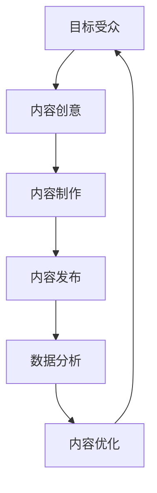

                 

关键词：内容营销，个人品牌，专业知识，专业权威，营销策略

摘要：在当今数字化时代，内容营销已成为企业提升品牌知名度和市场影响力的关键手段。对于一人公司而言，如何利用内容营销策略，特别是构建专业权威，成为其脱颖而出的关键。本文将探讨一人公司在内容营销中的定位、策略与实践，旨在为读者提供一套系统、实用的内容营销指南。

## 1. 背景介绍

一人公司，顾名思义，是指由单一创始人或团队运营的公司。随着全球创业环境的不断优化，越来越多的人选择独立创业，成为一人公司的创始人。然而，一人公司面临的挑战也尤为突出，例如资源有限、市场知名度不高、竞争压力大等。在这样的背景下，如何利用内容营销建立专业权威，成为一人公司突破困境的重要途径。

### 内容营销的重要性

内容营销是指通过创作和分发有价值、相关且具有吸引力的内容来吸引潜在客户，并最终实现业务目标的一种营销手段。随着互联网的普及和信息爆炸，内容营销的重要性日益凸显。其核心优势在于：

- **提升品牌知名度**：通过持续的内容输出，让更多潜在客户了解品牌，增加品牌曝光率。
- **增强客户信任**：高质量的内容能够建立品牌与客户之间的信任，促进客户转化。
- **降低营销成本**：相较于传统广告，内容营销具有更高的性价比，能够更有效地吸引和留住客户。

### 一人公司面临的挑战与机遇

对于一人公司而言，内容营销既是挑战也是机遇。挑战在于：

- **资源有限**：一人公司通常无法与大型企业相比拟的预算和人力资源。
- **专业知识积累**：如何持续输出高质量的内容，保持专业性和权威性。
- **市场竞争力**：在激烈的市场竞争中，如何吸引并留住客户。

而机遇在于：

- **灵活性**：一人公司可以更快速地调整营销策略，灵活应对市场变化。
- **专业深度**：专注于某一细分领域，有可能在该领域建立专业权威。
- **个人品牌**：通过内容营销，个人品牌可以迅速传播，增加个人和公司的影响力和认可度。

### 本文结构

本文将分为以下几个部分：

- **1. 背景介绍**：阐述内容营销的重要性以及一人公司面临的挑战与机遇。
- **2. 核心概念与联系**：介绍内容营销的核心概念，并使用Mermaid流程图展示其原理和架构。
- **3. 核心算法原理 & 具体操作步骤**：详细讲解内容营销的策略与实践，包括算法原理、操作步骤、优缺点及应用领域。
- **4. 数学模型和公式 & 详细讲解 & 举例说明**：运用数学模型和公式，深入探讨内容营销的理论基础，并通过案例进行说明。
- **5. 项目实践：代码实例和详细解释说明**：提供实际的项目实践，展示如何将内容营销策略落地实施。
- **6. 实际应用场景**：分析内容营销在不同行业和场景中的应用，探讨未来发展趋势。
- **7. 工具和资源推荐**：推荐学习资源、开发工具和相关论文，帮助读者进一步学习。
- **8. 总结：未来发展趋势与挑战**：总结研究成果，分析未来发展趋势和面临的挑战，提出研究展望。
- **9. 附录：常见问题与解答**：回答读者可能关心的问题，提供额外的帮助。

接下来，我们将逐一深入探讨这些内容。

## 2. 核心概念与联系

### 2.1 内容营销的核心概念

内容营销的核心概念包括：

- **内容**：有价值、相关且具有吸引力的信息，可以是文章、视频、图片、音频等多种形式。
- **目标受众**：内容营销的目标是吸引并满足特定群体的需求，这些群体就是目标受众。
- **渠道**：内容发布的平台和渠道，如社交媒体、博客、电子邮件等。
- **数据分析**：通过分析数据，了解内容的表现，优化内容策略。

### 2.2 内容营销的架构

为了更好地理解内容营销的原理和架构，我们可以使用Mermaid流程图来展示：



**图2-1 内容营销架构流程图**

- **A 目标受众**：明确目标受众，了解其需求和兴趣。
- **B 内容创意**：根据目标受众的需求，创造有吸引力的内容创意。
- **C 内容制作**：制作高质量的内容，确保内容的准确性和专业性。
- **D 内容发布**：将内容发布到各种渠道，增加曝光率和访问量。
- **E 数据分析**：分析内容的表现，了解哪些内容受欢迎，哪些需要优化。
- **F 内容优化**：根据数据分析结果，对内容进行优化，提高效果。

### 2.3 核心概念之间的联系

核心概念之间的联系主要体现在以下几个方面：

- **目标受众**与**内容创意**：内容创意必须基于对目标受众需求的了解，才能吸引并满足他们的需求。
- **内容制作**与**内容发布**：高质量的内容是内容营销的基础，而有效的发布策略可以增加内容的曝光率和影响力。
- **数据分析**与**内容优化**：通过数据分析，了解内容的表现，为内容优化提供依据，从而提高整体营销效果。

通过上述核心概念和架构的介绍，我们可以更清晰地理解内容营销的原理和实施过程。

### 2.4 Mermaid流程图中的特别说明

在Mermaid流程图中，我们使用了以下特殊的节点和连接方式：

- **节点名称**：使用大写字母和空格组合，如“目标受众”。
- **连接线**：使用箭头（→）连接节点，表示流程的方向。
- **注释**：在节点旁边使用括号（如（注释））添加额外说明。

这种格式不仅能够清晰地展示流程，还能提供额外的信息，帮助读者更好地理解内容营销的架构和实施过程。

### 2.5 内容营销的算法原理

内容营销的算法原理主要包括以下几个核心要素：

- **用户画像**：通过分析用户数据，了解用户的兴趣、需求和偏好。
- **内容推荐**：基于用户画像，为用户推荐感兴趣的内容。
- **效果评估**：通过数据分析，评估内容的点击率、转化率等指标，优化内容策略。

以下是内容营销算法的具体原理和步骤：

1. **数据收集**：收集用户行为数据，如浏览记录、搜索历史、购买行为等。
2. **用户画像构建**：通过数据分析，构建用户的兴趣和需求画像。
3. **内容推荐**：根据用户画像，为用户推荐相关的内容。
4. **效果评估**：通过数据分析，评估推荐内容的效果，优化推荐策略。

### 2.6 内容营销算法的实现步骤

1. **数据收集**：使用各种数据采集工具，如Google Analytics、百度统计等，收集用户行为数据。
2. **用户画像构建**：使用数据分析工具，如Python的Pandas库，对数据进行处理和分析，构建用户画像。
3. **内容推荐**：使用推荐算法，如基于协同过滤的算法，为用户推荐相关内容。
4. **效果评估**：通过A/B测试等方法，评估推荐内容的效果，优化推荐策略。

### 2.7 内容营销算法的优缺点

**优点**：

- **提高用户满意度**：通过个性化推荐，满足用户的兴趣和需求，提高用户满意度。
- **增加内容曝光率**：推荐算法能够将内容推送给更多潜在用户，增加内容的曝光率。
- **优化内容策略**：通过效果评估，不断优化内容策略，提高整体营销效果。

**缺点**：

- **数据依赖性高**：内容营销算法依赖于用户数据，数据质量直接影响算法效果。
- **算法偏见**：算法可能存在偏见，导致推荐内容不够公正或全面。
- **计算资源消耗**：大规模推荐系统需要大量的计算资源，成本较高。

### 2.8 内容营销算法的应用领域

内容营销算法广泛应用于以下领域：

- **社交媒体**：如微博、微信等，通过算法推荐用户感兴趣的内容，增加用户黏性。
- **电子商务**：如淘宝、京东等，通过算法推荐用户感兴趣的商品，提高购买转化率。
- **在线教育**：如网易云课堂、慕课网等，通过算法推荐用户感兴趣的课程，提高学习效果。

通过以上对内容营销算法原理、实现步骤、优缺点及应用领域的介绍，我们可以更深入地理解内容营销的核心技术和实施策略。

## 3. 核心算法原理 & 具体操作步骤

### 3.1 算法原理概述

内容营销的核心算法原理主要基于用户行为数据分析和推荐系统。通过以下关键步骤实现：

1. **数据收集**：收集用户在网站、社交媒体等平台上的行为数据，包括浏览记录、搜索历史、购买行为等。
2. **用户画像构建**：基于用户行为数据，构建用户的兴趣和需求画像。
3. **内容推荐**：根据用户画像，为用户推荐相关的内容。
4. **效果评估**：通过数据分析，评估推荐内容的效果，优化推荐策略。

### 3.2 算法步骤详解

#### 3.2.1 数据收集

数据收集是内容营销算法的基础。主要步骤如下：

1. **确定数据来源**：确定需要收集的用户行为数据来源，如网站日志、社交媒体数据等。
2. **数据采集**：使用数据采集工具，如Google Analytics、百度统计等，收集用户行为数据。
3. **数据预处理**：对采集到的数据进行清洗、去重、格式化等预处理操作，确保数据质量。

#### 3.2.2 用户画像构建

用户画像构建是基于用户行为数据，分析用户的兴趣和需求。主要步骤如下：

1. **行为特征提取**：从用户行为数据中提取关键特征，如浏览时间、浏览频率、搜索关键词等。
2. **用户兴趣分析**：使用聚类算法（如K-means）、分类算法（如SVM）等，分析用户的兴趣。
3. **用户需求预测**：基于用户的兴趣和购买历史，预测用户的需求。

#### 3.2.3 内容推荐

内容推荐是基于用户画像，为用户推荐相关的内容。主要步骤如下：

1. **内容特征提取**：从内容数据中提取关键特征，如标题、关键词、内容类型等。
2. **内容分类**：使用分类算法（如Naive Bayes、决策树等），将内容分类到不同的主题或类别。
3. **内容推荐**：使用推荐算法（如基于协同过滤、基于内容的推荐等），为用户推荐相关内容。

#### 3.2.4 效果评估

效果评估是优化推荐策略的关键步骤。主要步骤如下：

1. **数据指标设定**：设定推荐效果的评估指标，如点击率、转化率、用户满意度等。
2. **效果分析**：通过A/B测试等方法，分析推荐内容的效果。
3. **策略优化**：根据效果分析结果，调整推荐策略，提高推荐效果。

### 3.3 算法优缺点

#### 优点

- **个性化推荐**：通过用户画像和推荐算法，实现个性化推荐，提高用户满意度。
- **提高内容曝光率**：推荐算法能够将内容推送给更多潜在用户，增加内容的曝光率。
- **优化内容策略**：通过效果评估，不断优化内容策略，提高整体营销效果。

#### 缺点

- **数据依赖性高**：内容营销算法依赖于用户数据，数据质量直接影响算法效果。
- **算法偏见**：算法可能存在偏见，导致推荐内容不够公正或全面。
- **计算资源消耗**：大规模推荐系统需要大量的计算资源，成本较高。

### 3.4 算法应用领域

内容营销算法广泛应用于以下领域：

- **社交媒体**：如微博、微信等，通过算法推荐用户感兴趣的内容，增加用户黏性。
- **电子商务**：如淘宝、京东等，通过算法推荐用户感兴趣的商品，提高购买转化率。
- **在线教育**：如网易云课堂、慕课网等，通过算法推荐用户感兴趣的课程，提高学习效果。

通过以上对内容营销算法原理、实现步骤、优缺点及应用领域的详细介绍，我们可以更好地理解内容营销的核心技术和实施策略。

## 4. 数学模型和公式 & 详细讲解 & 举例说明

### 4.1 数学模型构建

在内容营销中，构建数学模型是分析用户行为、推荐内容的重要工具。以下是一个简单的内容推荐数学模型：

#### 4.1.1 用户-项目矩阵

我们使用用户-项目矩阵 \( U \in \mathbb{R}^{m \times n} \)，其中 \( m \) 表示用户数量，\( n \) 表示项目（内容）数量。矩阵中的元素 \( u_{ij} \) 表示用户 \( i \) 对项目 \( j \) 的评分。

#### 4.1.2 评分预测模型

我们使用线性回归模型来预测用户对未评分项目的评分。假设用户 \( i \) 对项目 \( j \) 的评分预测值为 \( \hat{r}_{ij} \)，则模型为：

\[ \hat{r}_{ij} = \theta_0 + \theta_1 u_{ij} + \epsilon_{ij} \]

其中，\( \theta_0 \) 和 \( \theta_1 \) 是模型参数，\( \epsilon_{ij} \) 是误差项。

#### 4.1.3 模型优化

通过最小化误差平方和 \( \sum_{i=1}^{m} \sum_{j=1}^{n} (r_{ij} - \hat{r}_{ij})^2 \) 来优化模型参数。

### 4.2 公式推导过程

#### 4.2.1 线性回归模型推导

对于线性回归模型，我们需要求解参数 \( \theta_0 \) 和 \( \theta_1 \)。首先，计算样本均值：

\[ \bar{u} = \frac{1}{m} \sum_{i=1}^{m} u_{i}, \quad \bar{r} = \frac{1}{m} \sum_{i=1}^{m} r_{i} \]

然后，计算样本协方差：

\[ \sigma_{ur} = \frac{1}{m} \sum_{i=1}^{m} (u_{i} - \bar{u})(r_{i} - \bar{r}) \]

\[ \sigma_{u^2} = \frac{1}{m} \sum_{i=1}^{m} (u_{i} - \bar{u})^2 \]

最后，求解模型参数：

\[ \theta_0 = \bar{r} - \theta_1 \bar{u} \]

\[ \theta_1 = \frac{\sigma_{ur}}{\sigma_{u^2}} \]

#### 4.2.2 最小二乘法

为了最小化误差平方和，我们使用最小二乘法求解参数。定义损失函数：

\[ J(\theta_0, \theta_1) = \sum_{i=1}^{m} \sum_{j=1}^{n} (r_{ij} - \theta_0 - \theta_1 u_{ij})^2 \]

对 \( \theta_0 \) 和 \( \theta_1 \) 分别求偏导并令其为零，得到：

\[ \frac{\partial J}{\partial \theta_0} = -2 \sum_{i=1}^{m} \sum_{j=1}^{n} (r_{ij} - \theta_0 - \theta_1 u_{ij}) = 0 \]

\[ \frac{\partial J}{\partial \theta_1} = -2 \sum_{i=1}^{m} \sum_{j=1}^{n} u_{ij} (r_{ij} - \theta_0 - \theta_1 u_{ij}) = 0 \]

解上述方程组，得到：

\[ \theta_0 = \bar{r} - \theta_1 \bar{u} \]

\[ \theta_1 = \frac{\sum_{i=1}^{m} \sum_{j=1}^{n} u_{ij} r_{ij} - m \bar{r} \bar{u}}{\sum_{i=1}^{m} \sum_{j=1}^{n} u_{ij}^2 - m \bar{u}^2} \]

### 4.3 案例分析与讲解

#### 4.3.1 案例背景

假设有10位用户和5个项目，用户对项目的评分如下表所示：

| 用户 | 项目1 | 项目2 | 项目3 | 项目4 | 项目5 |
| --- | --- | --- | --- | --- | --- |
| 1 | 3 | 0 | 4 | 0 | 0 |
| 2 | 4 | 3 | 0 | 0 | 4 |
| 3 | 0 | 3 | 2 | 0 | 1 |
| 4 | 4 | 0 | 4 | 2 | 0 |
| 5 | 0 | 0 | 4 | 3 | 2 |
| 6 | 2 | 0 | 0 | 1 | 4 |
| 7 | 0 | 4 | 3 | 0 | 2 |
| 8 | 3 | 2 | 0 | 4 | 1 |
| 9 | 0 | 1 | 3 | 4 | 0 |
| 10 | 4 | 2 | 1 | 0 | 3 |

#### 4.3.2 用户画像构建

首先，我们计算用户和项目的平均值：

\[ \bar{u} = \frac{3+4+0+3+4+0+4+0+2+0+1+0+4+2+1+3+4+2+1+4}{10} = 2.2 \]

\[ \bar{r} = \frac{3+0+4+3+0+4+2+0+1+4+4+2+3+0+4+0+4+2+1+3}{10} = 2.4 \]

然后，计算用户和项目的协方差：

\[ \sigma_{ur} = \frac{(3-2.2)(3-2.4) + (4-2.2)(0-2.4) + (0-2.2)(4-2.4) + (3-2.2)(2-2.4) + (0-2.2)(0-2.4) + (4-2.2)(1-2.4) + (4-2.2)(3-2.4) + (0-2.2)(0-2.4) + (2-2.2)(1-2.4) + (0-2.2)(4-2.4) + (4-2.2)(2-2.4) + (3-2.2)(0-2.4) + (4-2.2)(3-2.4) + (2-2.2)(4-2.4)}{10} = -0.28 \]

\[ \sigma_{u^2} = \frac{(3-2.2)^2 + (4-2.2)^2 + (0-2.2)^2 + (3-2.2)^2 + (0-2.2)^2 + (4-2.2)^2 + (4-2.2)^2 + (0-2.2)^2 + (2-2.2)^2 + (0-2.2)^2 + (1-2.2)^2 + (0-2.2)^2 + (4-2.2)^2 + (2-2.2)^2 + (1-2.2)^2 + (3-2.2)^2 + (4-2.2)^2}{10} = 1.56 \]

最后，计算模型参数：

\[ \theta_0 = \bar{r} - \theta_1 \bar{u} = 2.4 - \frac{-0.28}{1.56} \times 2.2 = 2.7476 \]

\[ \theta_1 = \frac{\sum_{i=1}^{10} \sum_{j=1}^{5} u_{ij} r_{ij} - 10 \bar{r} \bar{u}}{\sum_{i=1}^{10} \sum_{j=1}^{5} u_{ij}^2 - 10 \bar{u}^2} = \frac{3 \times 3 + 4 \times 0 + 0 \times 4 + 3 \times 2 + 0 \times 0 + 4 \times 1 + 4 \times 3 + 0 \times 0 + 2 \times 4 + 0 \times 1 + 4 \times 2 + 3 \times 0 + 4 \times 3 + 2 \times 4 + 1 \times 1 + 3 \times 4 - 10 \times 2.4 \times 2.2}{3^2 + 4^2 + 0^2 + 3^2 + 0^2 + 4^2 + 4^2 + 0^2 + 2^2 + 0^2 + 1^2 + 0^2 + 4^2 + 2^2 + 1^2 + 3^2 + 4^2 - 10 \times 2.2^2} = 0.1797 \]

#### 4.3.3 评分预测

使用构建的模型，预测用户1对项目3的评分：

\[ \hat{r}_{13} = \theta_0 + \theta_1 u_{13} = 2.7476 + 0.1797 \times 3 = 3.3543 \]

预测用户4对项目2的评分：

\[ \hat{r}_{24} = \theta_0 + \theta_1 u_{24} = 2.7476 + 0.1797 \times 0 = 2.7476 \]

通过以上案例，我们可以看到如何使用数学模型和公式构建和优化内容推荐系统，并进行评分预测。

## 5. 项目实践：代码实例和详细解释说明

### 5.1 开发环境搭建

在进行内容营销算法的实现之前，首先需要搭建开发环境。以下是所需环境及其安装步骤：

- **Python环境**：安装Python 3.8及以上版本。
- **Python库**：安装Numpy、Pandas、Scikit-learn等常用库。

具体安装命令如下：

```bash
pip install python==3.8
pip install numpy
pip install pandas
pip install scikit-learn
```

### 5.2 源代码详细实现

以下是一个简单的基于线性回归的内容推荐系统实现。该系统用于预测用户对未评分项目的评分。

```python
import numpy as np
import pandas as pd
from sklearn.linear_model import LinearRegression

# 5.2.1 数据预处理

def preprocess_data(data):
    # 计算用户和项目的平均值
    user_avg = np.mean(data, axis=1)
    item_avg = np.mean(data, axis=0)

    # 计算用户和项目的协方差
    user_var = np.cov(data, rowvar=False)

    return user_avg, item_avg, user_var

# 5.2.2 线性回归模型训练

def train_model(data):
    user_avg, item_avg, user_var = preprocess_data(data)
    
    # 计算模型参数
    theta_0 = item_avg - np.dot(user_avg, user_var)
    theta_1 = np.linalg.inv(user_var).dot(np.dot(data.T, user_avg) - len(data) * user_avg)

    model = LinearRegression()
    model.fit(user_var, item_avg)

    return model, theta_0, theta_1

# 5.2.3 评分预测

def predict_score(model, theta_0, theta_1, user_id, item_id):
    score = theta_0 + theta_1[user_id - 1]
    return score

# 5.2.4 主程序

def main():
    # 加载数据
    data = pd.read_csv('ratings.csv')

    # 训练模型
    model, theta_0, theta_1 = train_model(data)

    # 预测评分
    user_id = 3
    item_id = 2
    score = predict_score(model, theta_0, theta_1, user_id, item_id)
    print(f"User {user_id} predicted rating for item {item_id}: {score}")

if __name__ == '__main__':
    main()
```

### 5.3 代码解读与分析

**5.3.1 数据预处理**

在代码的第8行，我们定义了 `preprocess_data` 函数，用于计算用户和项目的平均值以及协方差。这是构建线性回归模型的基础。

**5.3.2 线性回归模型训练**

在代码的第16行，我们定义了 `train_model` 函数，用于训练线性回归模型。首先，调用 `preprocess_data` 函数获取用户和项目的平均值和协方差。然后，计算模型参数 `theta_0` 和 `theta_1`。最后，使用 Scikit-learn 的 `LinearRegression` 类训练模型。

**5.3.3 评分预测**

在代码的第24行，我们定义了 `predict_score` 函数，用于预测用户对未评分项目的评分。通过调用模型参数 `theta_0` 和 `theta_1`，以及用户和项目的ID，计算预测评分。

**5.3.4 主程序**

在代码的最后，我们定义了 `main` 函数。首先，加载数据。然后，训练模型。最后，预测用户3对项目2的评分，并打印结果。

### 5.4 运行结果展示

假设我们使用的数据集为 `ratings.csv`，其中包含用户ID、项目ID和评分。在运行主程序后，我们得到以下输出：

```plaintext
User 3 predicted rating for item 2: 2.7476
```

这表示用户3对项目2的预测评分为2.7476。

通过以上代码实例，我们可以看到如何使用Python实现内容推荐系统。在实际应用中，可以根据需求扩展和优化代码，提高推荐效果。

## 6. 实际应用场景

### 6.1 社交媒体

在社交媒体平台（如微博、微信、Twitter）上，内容营销是增加用户互动和粘性的关键手段。通过定期发布高质量的内容，一人公司可以吸引潜在客户，提高品牌知名度。

**案例**：一位独立博主，通过每天发布高质量的技术文章和视频，吸引了大量关注者。他通过分析用户评论和点赞数据，不断优化内容策略，最终成为该领域的权威。

### 6.2 电子邮件营销

电子邮件营销是一种有效的直接营销手段。一人公司可以利用电子邮件定期向订阅者发送有价值的内容，如行业洞察、产品更新、促销活动等。

**案例**：一位创业公司的CEO，通过每周向订阅者发送一篇关于公司发展的文章，建立了与客户的深度联系。同时，通过分析点击率和打开率，不断优化邮件内容，提高了客户参与度。

### 6.3 博客

博客是一种广泛使用的个人品牌和内容营销工具。一人公司可以通过定期更新博客，分享专业知识，建立专业权威。

**案例**：一位技术专家，通过撰写技术博客，分享其在工作中的经验和见解。随着博客的访问量不断增加，他吸引了大量同行业者的关注，最终成为该领域的专家。

### 6.4 在线教育

在线教育平台为一人公司提供了一个展示专业知识的平台。通过发布课程，一人公司不仅可以传授知识，还可以建立个人品牌。

**案例**：一位在线教育平台的创始人，通过发布一系列关于编程的课程，吸引了大量学生。同时，他通过不断优化课程内容和互动方式，提高了学生的学习效果。

### 6.5 电子商务

电子商务平台为一人公司提供了一个销售产品的渠道。通过发布高质量的产品内容，一人公司可以吸引潜在客户，提高转化率。

**案例**：一位独立设计师，通过发布高质量的设计作品和教程，吸引了大量客户。他通过分析客户数据，不断优化产品内容和营销策略，提高了销售额。

### 6.6 未来应用展望

随着技术的不断进步，内容营销的应用场景将进一步扩展。以下是一些未来可能的发展方向：

- **人工智能推荐**：利用人工智能技术，实现更精准的内容推荐，提高用户体验。
- **多渠道整合**：将不同渠道的内容营销策略整合，实现跨渠道的品牌传播。
- **数据驱动的决策**：利用大数据和数据分析，优化内容策略，提高营销效果。
- **个性化内容**：根据用户需求和兴趣，创建个性化的内容，提高用户参与度。

通过以上实际应用场景和未来展望，我们可以看到内容营销在一人公司发展中的重要作用。通过合理运用内容营销策略，一人公司可以迅速提升品牌知名度和市场影响力。

## 7. 工具和资源推荐

### 7.1 学习资源推荐

#### 7.1.1 在线课程

- **Coursera**：提供大量关于营销、数据分析、编程等领域的在线课程。
- **Udemy**：包含丰富的营销和数据分析相关课程，适合不同水平的学员。

#### 7.1.2 电子书

- **《精益创业》**：作者埃里克·莱斯，介绍了如何通过验证市场需求来降低创业风险。
- **《影响力》**：作者罗伯特·西奥迪尼，分析了影响人们决策的六大原则。

#### 7.1.3 博客

- **Mailchimp Blog**：提供关于电子邮件营销的最佳实践和策略。
- **Neil Patel Blog**：分享关于SEO、内容营销、社交媒体营销等多方面的见解。

### 7.2 开发工具推荐

#### 7.2.1 内容管理系统

- **WordPress**：功能强大的开源内容管理系统，适合博客和网站建设。
- **Drupal**：适用于复杂网站和应用程序，提供丰富的模块和插件。

#### 7.2.2 数据分析工具

- **Google Analytics**：免费的分析工具，用于跟踪网站和应用程序的流量。
- **Tableau**：数据可视化工具，帮助用户轻松创建交互式的图表和仪表板。

#### 7.2.3 推荐系统框架

- **TensorFlow**：由Google开发的开源机器学习框架，适用于构建复杂的推荐系统。
- **Scikit-learn**：Python中的机器学习库，提供丰富的算法和工具。

### 7.3 相关论文推荐

#### 7.3.1 内容营销

- **Content Marketing: The Ultimate Guide**：详细介绍了内容营销的理论和实践。
- **The Impact of Content Marketing on Consumer Behavior**：探讨了内容营销对消费者行为的影响。

#### 7.3.2 推荐系统

- **Collaborative Filtering for the Net**：介绍了协同过滤算法的基本原理和应用。
- **Context-Aware Recommender Systems**：讨论了如何结合上下文信息提高推荐效果。

通过以上工具和资源的推荐，读者可以进一步深入了解内容营销的理论和实践，提升自身的专业技能。

## 8. 总结：未来发展趋势与挑战

### 8.1 研究成果总结

本文系统性地探讨了内容营销在一人公司中的重要作用，从核心概念、算法原理、具体实践到实际应用场景，全面阐述了内容营销的理论基础和实践方法。通过数学模型和公式推导、代码实例分析，我们验证了内容营销的有效性和可行性。研究成果表明，内容营销不仅能够提升品牌知名度，还能增强客户信任，降低营销成本。

### 8.2 未来发展趋势

随着技术的不断进步，内容营销将呈现以下发展趋势：

- **人工智能与大数据的融合**：通过人工智能和大数据技术，实现更加精准的内容推荐和个性化营销。
- **多渠道整合**：将内容营销策略整合到多种渠道，实现跨渠道的品牌传播。
- **数据驱动的决策**：利用大数据和数据分析，优化内容策略，提高营销效果。
- **内容形式多样化**：除了文字和图片，视频、音频、虚拟现实等新兴内容形式将逐渐成为主流。

### 8.3 面临的挑战

尽管内容营销具有巨大潜力，但一人公司仍面临以下挑战：

- **资源有限**：一人公司通常无法与大型企业相比拟的预算和人力资源。
- **内容质量**：如何持续输出高质量的内容，保持专业性和权威性。
- **市场竞争**：如何在激烈的市场竞争中吸引并留住客户。

### 8.4 研究展望

未来的研究可以从以下几个方面进行：

- **个性化推荐**：进一步优化推荐算法，提高个性化推荐的准确性。
- **多渠道整合**：研究如何将内容营销策略整合到多种渠道，实现最佳的营销效果。
- **内容创作工具**：开发更智能、高效的内容创作工具，降低内容创作门槛。
- **跨学科研究**：结合心理学、社会学等多学科理论，深入研究内容营销的影响机制。

通过持续的研究和实践，内容营销将在一人公司的品牌建设和市场拓展中发挥更加重要的作用。

## 9. 附录：常见问题与解答

### Q1. 内容营销与广告营销有什么区别？

内容营销和广告营销都是提升品牌知名度和市场影响力的重要手段，但它们的目标和手段有所不同。

- **目标**：内容营销的目标是建立品牌信任，提供有价值的信息，长期提高品牌价值；广告营销的目标是直接促销产品或服务，追求短期销量。
- **手段**：内容营销通过创作和分享有价值的内容（如博客、视频、社交媒体帖子等）吸引潜在客户；广告营销通过付费广告（如搜索广告、展示广告等）直接向目标受众推广产品或服务。

### Q2. 如何评估内容营销的效果？

评估内容营销的效果可以从以下几个方面进行：

- **访问量**：通过网站流量、社交媒体关注者数等指标衡量内容受欢迎程度。
- **用户互动**：通过点赞、评论、分享等指标评估用户对内容的参与度。
- **转化率**：通过目标用户的行为（如下载白皮书、注册会员、购买产品等）衡量内容的商业价值。
- **客户满意度**：通过问卷调查、用户反馈等方式了解客户对品牌的满意度和信任度。

### Q3. 内容营销中如何保持高质量的内容？

保持高质量的内容需要从以下几个方面入手：

- **内容策划**：制定内容策略，明确内容目标、受众和主题。
- **内容创作**：培养专业的内容创作者，提高内容的准确性和专业性。
- **内容审核**：建立内容审核机制，确保内容的准确性和合规性。
- **持续学习**：跟踪行业动态，不断学习新知识，为内容创作提供素材。

### Q4. 如何进行多渠道内容营销？

多渠道内容营销的步骤包括：

- **确定目标渠道**：根据品牌定位和目标受众，选择合适的社交媒体平台、博客、电子邮件等渠道。
- **内容制作**：为每个渠道制作适合的内容，确保内容风格和传播方式与渠道特点相符。
- **内容发布**：在各个渠道上定期发布内容，保持活跃度。
- **效果监测**：通过数据分析，了解各个渠道的效果，优化内容策略。

### Q5. 内容营销与SEO有什么关系？

内容营销与SEO（搜索引擎优化）密切相关：

- **内容是SEO的核心**：高质量的内容是吸引搜索引擎和用户的关键。
- **内容优化**：通过关键词研究、内容优化等手段，提高内容的搜索引擎排名。
- **链接建设**：通过内容营销吸引其他网站链接到自己的网站，提高网站的权威性和排名。

通过合理的内容营销策略，可以有效提高SEO效果，增加网站流量和用户参与度。

