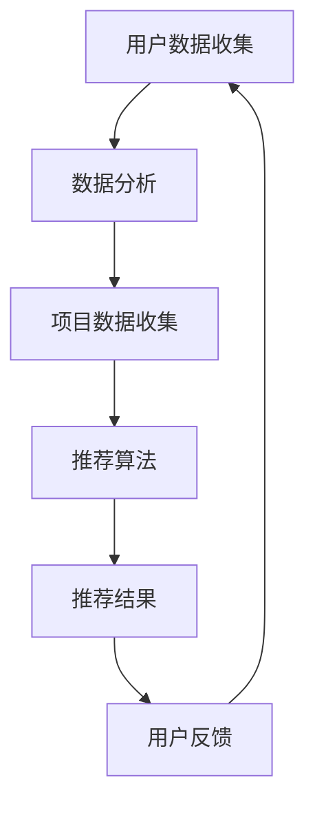

                 

推荐营销是现代商业世界中的一项关键技术，尤其是在一人公司这种小型企业环境中。通过精准的推荐系统，企业不仅可以提高客户满意度，还能有效地扩大客户基础。本文将深入探讨如何利用推荐营销策略来提升一人公司的业务增长。

## 关键词
- 推荐营销
- 一人公司
- 客户基础
- 数据分析
- 个性化推荐

## 摘要
本文将探讨一人公司如何通过推荐营销策略来扩大客户基础。我们将介绍推荐系统的基础原理，分析一人公司的特定需求，并提出具体的实施步骤。此外，还将讨论如何通过数据分析和技术工具实现个性化推荐，以提升客户体验和忠诚度。

## 1. 背景介绍
### 推荐营销的定义
推荐营销（Recommender Marketing）是一种利用算法和数据分析来预测用户兴趣，从而推荐相关产品或服务的一种营销手段。这种策略的核心是理解用户的偏好和行为，以提供更加个性化的体验。

### 一人公司的特点
一人公司通常意味着企业规模较小，资源有限，但市场机会和灵活性较高。由于缺乏大规模团队和资源，一人公司在营销和推广方面面临更多挑战，但同时也具备更快的决策速度和更灵活的市场响应能力。

### 推荐营销在小型企业中的应用
对于一人公司而言，推荐营销不仅可以帮助他们更好地理解客户需求，还可以减少市场推广成本，提高客户转化率和忠诚度。

## 2. 核心概念与联系
### 推荐系统的基本架构
为了实现推荐营销，一人公司需要构建一个推荐系统。该系统通常包括以下几个关键组件：
- 用户数据收集与分析
- 项目/产品数据收集与分析
- 推荐算法
- 用户反馈循环

### Mermaid 流程图


## 3. 核心算法原理 & 具体操作步骤
### 3.1 算法原理概述
推荐系统通常基于以下两种主要原理：
- **协同过滤**：通过分析用户之间的共同偏好来推荐产品。
- **基于内容的推荐**：通过分析产品或内容的特征来推荐类似的产品。

### 3.2 算法步骤详解
1. **数据收集**：收集用户的行为数据（如浏览记录、购买历史）和产品数据（如产品特征、分类信息）。
2. **预处理**：清洗数据，去除噪声，标准化处理。
3. **特征提取**：从用户和产品数据中提取关键特征。
4. **算法选择**：选择合适的推荐算法（如协同过滤、基于内容的推荐或混合推荐）。
5. **模型训练**：使用训练数据来训练推荐模型。
6. **预测与推荐**：使用训练好的模型对用户进行预测，生成个性化推荐。
7. **用户反馈**：收集用户对推荐结果的反馈，用于模型优化。

### 3.3 算法优缺点
- **协同过滤**：优点是能够提供个性化的推荐，缺点是可能产生数据稀疏性问题。
- **基于内容的推荐**：优点是推荐结果更加精准，缺点是用户兴趣变化时适应性较差。

### 3.4 算法应用领域
推荐算法广泛应用于电商、社交媒体、视频平台等多个领域，一人公司可以根据自身业务特点选择合适的算法。

## 4. 数学模型和公式 & 详细讲解 & 举例说明
### 4.1 数学模型构建
推荐系统中的数学模型通常包括用户相似度计算、评分预测等。
- **用户相似度计算**：
  $$ similarity(u_i, u_j) = \frac{1}{|I_{ij}|} \sum_{k \in I_{ij}} w_{ik} w_{jk} $$
  其中，$u_i$和$u_j$是两个用户，$I_{ij}$是他们的共同评分项目集，$w_{ik}$和$w_{jk}$是对应项目的权重。
- **评分预测**：
  $$ \hat{r_{ij}} = \sum_{k \in I_{i \cup j}} w_{ik} r_{kj} $$

### 4.2 公式推导过程
用户相似度和评分预测的推导基于线性回归和矩阵分解等数学方法。

### 4.3 案例分析与讲解
假设一人公司收集了用户A和用户B的浏览记录，以及相应产品的评分数据。通过协同过滤算法，可以计算出用户A和用户B的相似度，并根据相似度生成推荐列表。

## 5. 项目实践：代码实例和详细解释说明
### 5.1 开发环境搭建
- Python 3.8+
- Scikit-learn 库
- Pandas 库

### 5.2 源代码详细实现
以下是一个简单的基于协同过滤的推荐系统实现：

```python
import pandas as pd
from sklearn.metrics.pairwise import cosine_similarity

# 加载数据
data = pd.read_csv('user_item_data.csv')

# 计算用户相似度矩阵
user_similarity_matrix = cosine_similarity(data.values)

# 生成推荐列表
def recommend(user_id, similarity_matrix, top_n=5):
    user_vector = similarity_matrix[user_id]
    scores = user_vector.dot(data.values)
    top_n_indices = scores.argsort()[::-1][:top_n]
    return data.iloc[top_n_indices]

# 演示
user_id = 0
recommendations = recommend(user_id, user_similarity_matrix)
print(recommendations)
```

### 5.3 代码解读与分析
这段代码首先加载用户和项目的评分数据，然后使用余弦相似度计算用户相似度矩阵。最后，根据相似度矩阵生成个性化推荐列表。

### 5.4 运行结果展示
运行结果将输出用户A的推荐列表，包含与他相似的用户喜欢的项目。

## 6. 实际应用场景
### 6.1 电商行业
电商企业可以利用推荐系统为用户提供个性化商品推荐，提高转化率和用户满意度。

### 6.2 社交媒体
社交媒体平台可以利用推荐算法为用户提供相关内容推荐，增加用户粘性。

### 6.3 视频平台
视频平台可以通过推荐算法为用户推荐感兴趣的视频内容。

## 7. 工具和资源推荐
### 7.1 学习资源推荐
- 《推荐系统实践》
- Coursera 上的推荐系统课程

### 7.2 开发工具推荐
- Python
- Scikit-learn
- TensorFlow

### 7.3 相关论文推荐
- "Collaborative Filtering for the Web" by John Langford

## 8. 总结：未来发展趋势与挑战
### 8.1 研究成果总结
推荐系统技术在过去几年取得了显著进展，应用场景不断扩展。

### 8.2 未来发展趋势
随着人工智能和大数据技术的发展，推荐系统将更加智能化和个性化。

### 8.3 面临的挑战
数据隐私、算法公平性和可解释性是推荐系统面临的主要挑战。

### 8.4 研究展望
未来推荐系统将更加注重用户隐私保护和算法透明度，同时结合多种技术实现更精准的推荐。

## 9. 附录：常见问题与解答
### Q：如何处理数据稀疏性问题？
A：可以通过矩阵分解、聚类等方法来降低数据稀疏性。

### Q：推荐系统的评价标准是什么？
A：常用的评价标准包括准确率、召回率和F1分数。

作者：禅与计算机程序设计艺术 / Zen and the Art of Computer Programming
----------------------------------------------------------------

文章撰写完成，接下来可以根据这篇文章的内容制作相应的mindmap，以便更直观地理解和记忆文章的结构和内容。文章的关键词、摘要、章节标题和各个章节的核心内容都可以成为mindmap的节点，通过连接线表示章节之间的逻辑关系。这样的可视化工具有助于读者更好地掌握文章的整体架构和细节内容。

