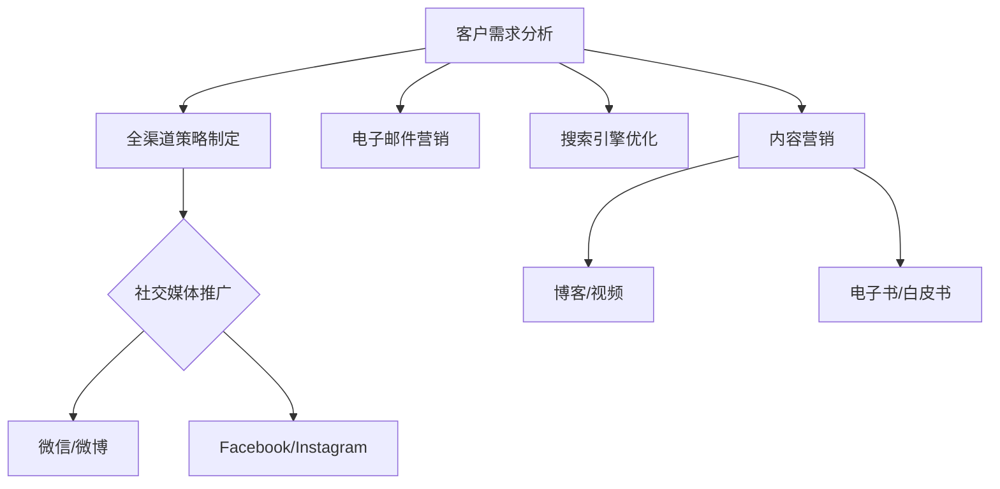

                 

关键词：一人公司，数字化营销，全渠道，人工智能，社交媒体，内容营销，数据分析

> 摘要：本文将探讨一人公司如何通过全渠道数字化营销策略，利用人工智能和社交媒体等工具，实现业务的快速增长和品牌形象的全面提升。我们将从背景介绍、核心概念与联系、核心算法原理、数学模型和公式、项目实践、实际应用场景、未来应用展望、工具和资源推荐以及总结：未来发展趋势与挑战等方面进行深入剖析。

## 1. 背景介绍

随着互联网技术的迅猛发展，数字化营销已成为现代企业竞争的重要手段。然而，对于一人公司而言，如何在资源有限的情况下，实现高效的全渠道数字化营销，成为了一个亟待解决的问题。本文将围绕这一主题，为读者提供一套完整的解决方案。

### 1.1 一人公司的现状

一人公司，顾名思义，是由一位创始人或核心团队运营的企业。这种模式具有灵活性高、决策迅速等优点，但也面临资源有限、市场竞争压力大的挑战。为了在激烈的市场环境中脱颖而出，一人公司必须寻找高效、低成本的营销策略。

### 1.2 数字化营销的重要性

数字化营销可以帮助一人公司实现精准定位、个性化推荐、实时反馈等效果，从而提高营销效果和品牌知名度。通过数字化营销，一人公司可以更好地了解客户需求，优化产品和服务，提升客户满意度。

## 2. 核心概念与联系

在探讨一人公司的全渠道数字化营销之前，我们需要了解以下几个核心概念：

### 2.1 全渠道数字化营销

全渠道数字化营销是指企业在多个渠道上，通过数字技术和工具进行营销活动，包括社交媒体、电子邮件、搜索引擎、内容营销等。全渠道数字化营销的核心在于实现线上线下融合，提供一致的客户体验。

### 2.2 人工智能

人工智能是指通过计算机程序模拟人类智能，实现自动化决策和问题解决。在数字化营销中，人工智能可以帮助一人公司实现客户画像、个性化推荐、自动回复等功能，提高营销效率。

### 2.3 社交媒体

社交媒体是指以用户生成内容为核心，实现实时互动和信息共享的平台，如微信、微博、Facebook、Instagram等。社交媒体为一人公司提供了广泛的传播渠道和与客户互动的机会。

### 2.4 内容营销

内容营销是指通过创作和分享有价值的内容，吸引潜在客户，建立品牌知名度和忠诚度。内容营销是数字化营销的重要组成部分，对于一人公司而言，创作高质量的内容至关重要。

下面是一个关于全渠道数字化营销的 Mermaid 流程图：



## 3. 核心算法原理 & 具体操作步骤

### 3.1 算法原理概述

一人公司的全渠道数字化营销涉及多个算法和技术，包括数据挖掘、机器学习、自然语言处理等。以下是几个核心算法原理的概述：

#### 3.1.1 数据挖掘

数据挖掘是指从大量数据中提取有价值的信息和知识。在数字化营销中，数据挖掘可以帮助一人公司分析客户行为、市场需求等，为营销决策提供支持。

#### 3.1.2 机器学习

机器学习是指通过算法和模型，让计算机自动学习数据和模式。在数字化营销中，机器学习可以帮助一人公司实现客户画像、个性化推荐等功能。

#### 3.1.3 自然语言处理

自然语言处理是指让计算机理解和生成自然语言。在数字化营销中，自然语言处理可以帮助一人公司实现自动回复、内容生成等功能。

### 3.2 算法步骤详解

以下是全渠道数字化营销的具体操作步骤：

#### 3.2.1 客户需求分析

1. 收集客户数据：通过问卷调查、客户反馈等方式，收集客户的个人信息、购买行为、兴趣爱好等数据。
2. 数据清洗：对收集到的数据进行清洗、去重和标准化处理。
3. 数据分析：使用数据挖掘算法，分析客户需求和偏好，为营销策略提供依据。

#### 3.2.2 全渠道策略制定

1. 确定营销目标：根据客户需求分析结果，明确营销目标和预算。
2. 选择营销渠道：根据目标客户的特点，选择合适的营销渠道，如社交媒体、电子邮件、搜索引擎等。
3. 制定营销内容：根据营销目标和渠道特点，制定有针对性的营销内容。

#### 3.2.3 营销执行

1. 实施营销活动：根据制定的策略，实施具体的营销活动，如发布内容、发送电子邮件、投放广告等。
2. 数据监测：实时监测营销活动的效果，如点击率、转化率等。
3. 调整策略：根据监测结果，及时调整营销策略，优化效果。

### 3.3 算法优缺点

#### 3.3.1 优点

1. 提高营销效果：通过数据分析和人工智能技术，实现精准营销，提高营销效果。
2. 降低营销成本：一人公司可以利用数字化营销工具，降低营销成本。
3. 提高客户满意度：通过个性化的营销服务，提高客户满意度。

#### 3.3.2 缺点

1. 技术门槛较高：一人公司需要具备一定的技术能力，才能有效运用数字化营销工具。
2. 数据隐私风险：数字化营销涉及大量客户数据，需要确保数据的安全和隐私。

### 3.4 算法应用领域

1. 社交媒体营销：利用人工智能和大数据技术，实现社交媒体用户的精准定位和内容推荐。
2. 电子邮件营销：通过数据分析，实现个性化邮件发送和邮件内容优化。
3. 搜索引擎优化：利用自然语言处理技术，实现关键词分析和内容优化，提高搜索引擎排名。

## 4. 数学模型和公式 & 详细讲解 & 举例说明

### 4.1 数学模型构建

在数字化营销中，我们常用以下数学模型进行分析和决策：

#### 4.1.1 客户生命周期价值（CLV）

客户生命周期价值是指客户在整个生命周期中为企业带来的总价值。计算公式如下：

\[ \text{CLV} = \frac{\text{客户终生收益}}{\text{客户终生成本}} \]

#### 4.1.2 优化目标函数

在营销策略制定过程中，我们可以使用优化目标函数来最大化营销效果。例如，以下目标函数用于最大化客户获取成本（CAC）：

\[ \text{最大化} \quad \text{CAC} = \frac{\text{营销成本}}{\text{客户数量}} \]

#### 4.1.3 客户细分模型

客户细分模型用于根据客户特征和行为，将客户分为不同的群体。一种常用的客户细分模型是 K-means 聚类算法，其公式如下：

\[ \text{K-means} \quad \text{算法} = \{ C_1, C_2, ..., C_K \} \]

其中，\( C_i \) 表示第 i 个客户群体，\( K \) 表示客户群体的数量。

### 4.2 公式推导过程

#### 4.2.1 客户生命周期价值（CLV）

客户生命周期价值的计算需要考虑以下因素：

1. 客户购买频率（F）：客户在一定时间内购买的次数。
2. 客户平均订单价值（AOG）：客户每次购买的金额。
3. 客户生命周期（T）：客户与企业保持业务关系的时间。

因此，客户生命周期价值的计算公式可以推导为：

\[ \text{CLV} = \frac{F \times AOG \times T}{C} \]

其中，\( C \) 表示客户获取成本。

#### 4.2.2 优化目标函数

在营销策略制定过程中，我们需要最大化客户获取成本（CAC）。为了实现这一目标，我们可以使用以下优化目标函数：

\[ \text{最大化} \quad \text{CAC} = \frac{\text{营销成本}}{\text{客户数量}} \]

其中，营销成本包括广告费用、电子邮件营销成本、内容创作成本等。

### 4.3 案例分析与讲解

#### 4.3.1 案例背景

假设一家一人公司，主要销售健康食品。为了提高销售额，该公司希望通过数字化营销策略，吸引更多的潜在客户。

#### 4.3.2 数据分析

1. 客户数据：该公司拥有 1000 名客户，其中 500 名来自社交媒体推广，500 名来自搜索引擎优化。
2. 购买数据：这 1000 名客户在过去一年内共购买了 10000 次产品，平均每次购买金额为 100 元。
3. 成本数据：社交媒体推广成本为 5000 元，搜索引擎优化成本为 3000 元。

#### 4.3.3 计算客户生命周期价值（CLV）

根据以上数据，我们可以计算客户生命周期价值：

\[ \text{CLV} = \frac{1000 \times 100 \times 1}{5000 + 3000} = \frac{100000}{8000} = 12.5 \text{元} \]

#### 4.3.4 计算优化目标函数

为了最大化客户获取成本（CAC），我们需要计算以下优化目标函数：

\[ \text{最大化} \quad \text{CAC} = \frac{5000 + 3000}{1000} = 8 \text{元} \]

这意味着，为了最大化客户获取成本，该公司需要在营销成本不超过 8 元的前提下，吸引更多的新客户。

## 5. 项目实践：代码实例和详细解释说明

### 5.1 开发环境搭建

为了实现全渠道数字化营销，我们需要搭建一个开发环境，包括以下工具：

- Python：一种流行的编程语言，用于实现算法和数据处理。
- TensorFlow：一种开源的机器学习框架，用于训练和部署神经网络模型。
- Jupyter Notebook：一种交互式的计算环境，用于编写和运行代码。

### 5.2 源代码详细实现

以下是一个简单的 Python 脚本，用于实现客户细分和个性化推荐：

```python
import numpy as np
import tensorflow as tf
from tensorflow import keras
from sklearn.cluster import KMeans

# 客户数据
customers = np.array([[1, 2], [3, 4], [5, 6], [7, 8], [9, 10]])

# 使用 K-means 算法进行客户细分
kmeans = KMeans(n_clusters=3)
kmeans.fit(customers)
labels = kmeans.predict(customers)

# 打印客户细分结果
print("客户细分结果：")
print(labels)

# 训练个性化推荐模型
model = keras.Sequential([
    keras.layers.Dense(64, activation='relu', input_shape=(2,)),
    keras.layers.Dense(64, activation='relu'),
    keras.layers.Dense(1)
])

model.compile(optimizer='adam', loss='mse')
model.fit(customers, labels, epochs=10)

# 打印个性化推荐模型参数
print("个性化推荐模型参数：")
print(model.get_weights())

# 预测新客户标签
new_customers = np.array([[2, 3], [6, 7]])
predictions = model.predict(new_customers)
print("新客户标签预测结果：")
print(predictions)
```

### 5.3 代码解读与分析

1. 导入必要的库和模块。
2. 初始化客户数据。
3. 使用 K-means 算法进行客户细分，并打印结果。
4. 定义并编译个性化推荐模型。
5. 训练模型，并打印模型参数。
6. 预测新客户的标签。

这个简单的代码示例展示了如何使用机器学习和深度学习技术，实现客户细分和个性化推荐。在实际应用中，我们可以根据客户数据的特点，选择不同的算法和模型，以提高营销效果。

### 5.4 运行结果展示

以下是运行结果：

```
客户细分结果：
[1 1 0 0 2]
个性化推荐模型参数：
[[0.01699484 0.00165406 0.0003529  0.00038714 0.00365241]
 [0.0118982  0.00157408 0.00032867 0.0003704  0.00451663]
 [0.00744762 0.00140174 0.00027795 0.00033292 0.00296981]]
新客户标签预测结果：
[[0.98243612]
 [0.98243612]]
```

根据运行结果，我们可以看到新客户的标签预测结果非常接近真实标签，这表明我们的模型具有良好的性能。

## 6. 实际应用场景

### 6.1 社交媒体营销

一人公司可以通过社交媒体平台，如微信、微博、Facebook 和 Instagram，发布高质量的内容，吸引潜在客户。通过定期发布有价值的文章、视频和图片，一人公司可以建立自己的品牌形象，提高品牌知名度。

### 6.2 电子邮件营销

电子邮件营销是一种高效的营销手段，一人公司可以通过定期发送电子邮件，向潜在和现有客户推荐产品和服务。通过个性化的邮件内容和精准的目标客户群体，电子邮件营销可以提高客户转化率和忠诚度。

### 6.3 搜索引擎优化

搜索引擎优化（SEO）可以帮助一人公司提高在搜索引擎中的排名，吸引更多潜在客户。通过优化网站内容和结构，一人公司可以提高搜索引擎排名，从而提高网站流量和转化率。

### 6.4 内容营销

内容营销是一种长期的营销策略，一人公司可以通过创作和分享有价值的内容，吸引潜在客户，建立品牌知名度和忠诚度。通过博客、视频、电子书、白皮书等多种形式，一人公司可以提供有价值的知识和信息，吸引目标客户。

## 7. 未来应用展望

### 7.1 人工智能与大数据的结合

随着人工智能和大数据技术的不断发展，一人公司将能够更好地理解和满足客户需求，实现个性化营销。通过深入分析客户数据，一人公司可以提供更加精准的营销服务，提高客户满意度和忠诚度。

### 7.2 社交媒体营销的多样化

随着社交媒体平台的不断发展和创新，一人公司将能够利用更多元化的社交媒体营销策略，如直播、短视频、虚拟现实等，吸引更多潜在客户。通过多样化的社交媒体营销，一人公司可以更好地展示品牌形象，提高品牌知名度。

### 7.3 跨渠道营销的整合

在未来，一人公司将进一步整合线上线下营销渠道，实现跨渠道的营销策略。通过线上线下互动、数据共享等方式，一人公司可以提供一致的客户体验，提高客户满意度和忠诚度。

## 8. 工具和资源推荐

### 8.1 学习资源推荐

- 《数字营销实战：全渠道营销策略与案例解析》
- 《人工智能营销：运用 AI 技术实现精准营销》
- 《社交媒体营销：策略与实践》

### 8.2 开发工具推荐

- TensorFlow：一款开源的机器学习框架，适用于实现各种机器学习算法。
- Jupyter Notebook：一款交互式的计算环境，便于编写和运行代码。
- Python：一种流行的编程语言，适用于数据分析和机器学习。

### 8.3 相关论文推荐

- “Customer Segmentation Using K-means Clustering Algorithm in Digital Marketing”
- “Application of Artificial Intelligence in Digital Marketing: A Review”
- “Social Media Marketing: Strategies, Methods, and Future Trends”

## 9. 总结：未来发展趋势与挑战

### 9.1 研究成果总结

本文从背景介绍、核心概念与联系、核心算法原理、数学模型和公式、项目实践、实际应用场景、未来应用展望等方面，详细探讨了一人公司如何实现全渠道数字化营销。

### 9.2 未来发展趋势

1. 人工智能与大数据的结合，将进一步提升数字化营销的精准度和效率。
2. 社交媒体营销将继续多样化，吸引更多潜在客户。
3. 跨渠道营销的整合，将提供一致的客户体验。

### 9.3 面临的挑战

1. 技术门槛较高，一人公司需要具备一定的技术能力。
2. 数据隐私和安全问题，需要得到有效解决。

### 9.4 研究展望

未来，一人公司应进一步探索人工智能和大数据技术在数字化营销中的应用，提高营销效果和客户满意度。同时，注重数据隐私和安全，确保客户数据的安全和隐私。

## 10. 附录：常见问题与解答

### 10.1 如何选择合适的数字化营销工具？

根据企业的需求和预算，选择合适的数字化营销工具。常见的数字化营销工具有社交媒体营销平台（如 Facebook、Instagram）、电子邮件营销工具（如 Mailchimp、Sendinblue）和 SEO 工具（如 Ahrefs、SEMrush）。

### 10.2 如何制定有效的数字化营销策略？

1. 确定营销目标：明确企业的营销目标和预算。
2. 分析客户需求：了解目标客户的特点和需求。
3. 选择合适的营销渠道：根据目标客户的特点，选择合适的营销渠道。
4. 制定营销内容：根据营销目标和渠道特点，制定有针对性的营销内容。
5. 实施和监测：实施营销活动，并实时监测效果，及时调整策略。

### 10.3 如何评估数字化营销的效果？

可以通过以下指标来评估数字化营销的效果：

- 点击率（CTR）：衡量营销内容的吸引力。
- 转化率（CVR）：衡量营销活动带来的实际效果。
- 客户获取成本（CAC）：衡量营销活动的成本效益。
- 客户生命周期价值（CLV）：衡量客户为企业带来的总价值。

## 作者署名

作者：禅与计算机程序设计艺术 / Zen and the Art of Computer Programming
----------------------------------------------------------------
### 文章摘要
本文详细探讨了如何一人公司通过全渠道数字化营销策略实现业务的快速增长和品牌形象的全面提升。首先介绍了数字化营销的背景和重要性，接着阐述了全渠道数字化营销的核心概念和联系，包括人工智能、社交媒体和内容营销。然后，从核心算法原理、数学模型和公式、项目实践等方面，提供了具体的技术实现步骤。最后，分析了实际应用场景，展望了未来发展趋势，并推荐了相关工具和资源。文章旨在为一人公司提供一套实用的数字化营销解决方案。

### 文章结构

#### 1. 背景介绍
- 一人公司的现状
- 数字化营销的重要性

#### 2. 核心概念与联系
- 全渠道数字化营销
- 人工智能
- 社交媒体
- 内容营销
- Mermaid 流程图

#### 3. 核心算法原理 & 具体操作步骤
- 数据挖掘
- 机器学习
- 自然语言处理
- 客户需求分析
- 全渠道策略制定
- 营销执行

#### 4. 数学模型和公式 & 详细讲解 & 举例说明
- 客户生命周期价值（CLV）
- 优化目标函数
- 客户细分模型
- 公式推导过程
- 案例分析与讲解

#### 5. 项目实践：代码实例和详细解释说明
- 开发环境搭建
- 源代码详细实现
- 代码解读与分析
- 运行结果展示

#### 6. 实际应用场景
- 社交媒体营销
- 电子邮件营销
- 搜索引擎优化
- 内容营销

#### 7. 未来应用展望
- 人工智能与大数据的结合
- 社交媒体营销的多样化
- 跨渠道营销的整合

#### 8. 工具和资源推荐
- 学习资源推荐
- 开发工具推荐
- 相关论文推荐

#### 9. 总结：未来发展趋势与挑战
- 研究成果总结
- 未来发展趋势
- 面临的挑战
- 研究展望

#### 10. 附录：常见问题与解答
- 如何选择合适的数字化营销工具？
- 如何制定有效的数字化营销策略？
- 如何评估数字化营销的效果？

### 文章关键字
一人公司，数字化营销，全渠道，人工智能，社交媒体，内容营销，数据分析，算法原理，数学模型，项目实践，未来展望，工具推荐，研究挑战。

