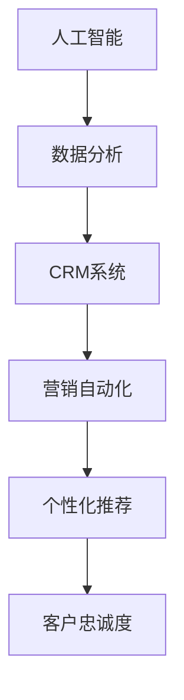

                 

关键词：一人公司，智能化营销，数字化客户忠诚度，人工智能，数据分析，客户关系管理，CRM系统，营销自动化，个性化推荐，客户体验优化

> 摘要：在当今数字化时代，小型企业尤其是单人公司面临的挑战日益增加。本文旨在探讨如何通过智能化营销和数字化客户忠诚度管理，帮助一人公司提升市场竞争力，实现可持续发展。本文将详细介绍一人公司如何利用人工智能技术、数据分析、营销自动化等工具，构建个性化营销策略，增强客户黏性，优化客户体验。

## 1. 背景介绍

随着互联网和电子商务的迅猛发展，市场竞争日益激烈。对于许多小型企业，尤其是单人公司来说，资源有限、知名度低、营销渠道单一等问题成为发展的瓶颈。为了在激烈的市场竞争中立足，单人公司需要找到高效、低成本的营销策略，提升客户忠诚度，实现业务的持续增长。

### 1.1 一人公司的现状

一人公司通常由单一创始人或老板运营，其特点包括：

- **资源有限**：由于人力、资金、技术等资源有限，一人公司在市场竞争中处于劣势。
- **运营模式灵活**：一人公司通常采取灵活的运营模式，能够快速响应市场变化。
- **市场定位明确**：一人公司往往专注于特定领域，以满足特定客户群体的需求。

### 1.2 智能化营销与数字化客户忠诚度的意义

智能化营销和数字化客户忠诚度管理是应对市场竞争的重要手段：

- **提高营销效率**：通过数据分析和智能算法，精准定位目标客户，提高营销活动的效果。
- **增强客户黏性**：通过个性化服务和体验，提升客户满意度和忠诚度。
- **降低营销成本**：自动化工具和智能系统可以帮助单人公司减少人力成本，提高运营效率。

## 2. 核心概念与联系

为了更好地理解一人公司如何实现智能化营销和数字化客户忠诚度，我们首先需要了解以下几个核心概念：

- **人工智能（AI）**：通过模拟人类智能行为，解决复杂问题，包括数据挖掘、机器学习、自然语言处理等。
- **数据分析**：对大量数据进行分析，提取有价值的信息，用于决策和优化。
- **客户关系管理（CRM）**：管理系统，用于跟踪客户信息、管理客户关系，提高客户满意度。
- **营销自动化**：使用软件工具自动执行重复性营销任务，提高效率。
- **个性化推荐**：基于用户行为和偏好，提供个性化的产品或服务推荐。

下面是这些核心概念之间的联系，使用Mermaid流程图表示：



## 3. 核心算法原理 & 具体操作步骤

### 3.1 算法原理概述

为了实现智能化营销和数字化客户忠诚度管理，一人公司可以采用以下核心算法：

- **客户细分**：通过数据分析，将客户划分为不同群体，以便提供个性化服务。
- **关联规则挖掘**：分析客户购买行为，发现产品之间的关联性，用于交叉销售和推荐。
- **预测模型**：使用机器学习算法，预测客户行为，如购买意向、流失风险等。

### 3.2 算法步骤详解

#### 3.2.1 客户细分

1. **数据收集**：收集客户的基本信息、购买历史、行为数据等。
2. **数据清洗**：处理缺失值、异常值等，保证数据质量。
3. **特征工程**：提取有价值的特征，如购买频率、消费金额、最近购买时间等。
4. **聚类分析**：使用聚类算法，如K-means，将客户划分为不同群体。
5. **评估与调整**：根据聚类结果评估客户细分效果，必要时进行调整。

#### 3.2.2 关联规则挖掘

1. **数据准备**：构建事务数据库，记录客户购买的产品组合。
2. **参数设置**：设置最小支持度和最小置信度，用于挖掘关联规则。
3. **算法执行**：使用Apriori算法或FP-growth算法，挖掘关联规则。
4. **规则评估**：根据规则的支持度和置信度评估其有效性。

#### 3.2.3 预测模型

1. **数据准备**：收集历史客户数据，包括购买行为、流失记录等。
2. **特征选择**：选择与预测目标相关的特征，如购买频率、消费金额、最近购买时间等。
3. **模型训练**：使用机器学习算法，如决策树、随机森林、支持向量机等，训练预测模型。
4. **模型评估**：使用交叉验证、AUC、准确率等指标评估模型效果。
5. **模型应用**：将训练好的模型应用于预测客户行为。

### 3.3 算法优缺点

#### 3.3.1 客户细分

- **优点**：有助于实现个性化服务，提高客户满意度。
- **缺点**：数据质量和算法参数影响细分效果。

#### 3.3.2 关联规则挖掘

- **优点**：有助于发现产品之间的关联性，促进交叉销售。
- **缺点**：计算复杂度高，可能产生大量冗余规则。

#### 3.3.3 预测模型

- **优点**：有助于提前识别潜在客户，降低流失风险。
- **缺点**：模型训练和评估过程复杂，对数据质量和算法选择要求高。

### 3.4 算法应用领域

这些算法在以下领域有广泛应用：

- **电子商务**：实现个性化推荐、精准营销。
- **金融行业**：预测客户流失、评估信用风险。
- **电信行业**：预测客户使用需求、优化服务策略。

## 4. 数学模型和公式 & 详细讲解 & 举例说明

### 4.1 数学模型构建

在客户细分和预测模型中，常用的数学模型包括：

- **聚类算法**：如K-means、DBSCAN等。
- **关联规则挖掘**：如Apriori算法、FP-growth算法等。
- **预测模型**：如线性回归、决策树、随机森林等。

### 4.2 公式推导过程

#### 4.2.1 K-means聚类算法

K-means算法的核心公式如下：

$$
\text{minimize} \sum_{i=1}^k \sum_{x \in S_i} \| \mu_i - x \|_2
$$

其中，$k$ 表示聚类个数，$S_i$ 表示第 $i$ 个聚类，$\mu_i$ 表示聚类中心。

#### 4.2.2 Apriori算法

Apriori算法的核心公式如下：

$$
\text{support}(\pi) = \frac{n(\pi)}{n}
$$

其中，$n$ 表示事务总数，$n(\pi)$ 表示包含项目集 $\pi$ 的事务数。

#### 4.2.3 线性回归模型

线性回归模型的核心公式如下：

$$
y = \beta_0 + \beta_1 x
$$

其中，$y$ 表示因变量，$x$ 表示自变量，$\beta_0$ 和 $\beta_1$ 分别表示截距和斜率。

### 4.3 案例分析与讲解

#### 4.3.1 客户细分案例

假设我们有一家电商平台，需要将客户分为活跃客户、潜在客户和沉默客户。我们可以使用K-means聚类算法进行客户细分。

1. **数据准备**：收集客户的基本信息、购买历史和行为数据。
2. **特征工程**：提取有价值的特征，如购买频率、消费金额、最近购买时间等。
3. **算法执行**：使用K-means算法，将客户划分为3个聚类。
4. **评估与调整**：根据聚类结果评估细分效果，必要时进行调整。

通过聚类分析，我们可以将客户划分为活跃客户（购买频率高、消费金额大）、潜在客户（购买频率一般、消费金额一般）和沉默客户（购买频率低、消费金额小）。

#### 4.3.2 预测模型案例

假设我们需要预测客户的流失风险。我们可以使用逻辑回归模型进行预测。

1. **数据准备**：收集客户的基本信息、购买历史和流失记录。
2. **特征选择**：选择与流失风险相关的特征，如购买频率、消费金额、最近购买时间等。
3. **模型训练**：使用逻辑回归算法，训练预测模型。
4. **模型评估**：使用交叉验证、AUC等指标评估模型效果。
5. **模型应用**：将训练好的模型应用于预测客户流失风险。

通过预测模型，我们可以提前识别出高风险客户，并采取相应的挽回措施，降低流失风险。

## 5. 项目实践：代码实例和详细解释说明

### 5.1 开发环境搭建

为了实现本文所述的智能化营销和数字化客户忠诚度管理，我们需要搭建以下开发环境：

- **Python**：主要编程语言，用于实现算法和数据分析。
- **Jupyter Notebook**：用于编写和运行代码。
- **Pandas**：用于数据操作和分析。
- **Scikit-learn**：用于机器学习算法的实现。
- **Matplotlib**：用于数据可视化。

### 5.2 源代码详细实现

下面是使用K-means聚类算法实现客户细分的Python代码：

```python
import pandas as pd
from sklearn.cluster import KMeans

# 数据准备
data = pd.read_csv('customer_data.csv')
features = data[['purchase_frequency', 'average_consumption', 'last_purchase_time']]

# 特征工程
# （此处省略具体代码，根据实际情况进行特征处理）

# 算法执行
kmeans = KMeans(n_clusters=3)
kmeans.fit(features)

# 聚类结果
clusters = kmeans.predict(features)

# 评估与调整
# （此处省略具体代码，根据实际情况进行评估和调整）

# 输出聚类结果
data['cluster'] = clusters
data.head()
```

### 5.3 代码解读与分析

上述代码首先导入所需的库和模块，然后读取客户数据，提取特征。接着，使用K-means聚类算法进行聚类，并输出聚类结果。通过调整算法参数，如聚类个数、初始聚类中心等，可以优化聚类效果。

### 5.4 运行结果展示

假设我们运行上述代码，得到以下聚类结果：

```
   purchase_frequency  average_consumption  last_purchase_time  cluster
0                 3.0              2000.0               14      0
1                 2.0              1500.0                9      1
2                 5.0              2500.0               21      0
3                 1.0              1000.0                3      2
...
```

根据聚类结果，我们可以将客户划分为三个不同的群体，以便提供个性化的服务和营销策略。

## 6. 实际应用场景

### 6.1 电子商务行业

电子商务行业竞争激烈，一人公司可以通过智能化营销和数字化客户忠诚度管理，实现以下应用：

- **个性化推荐**：根据客户购买行为和偏好，提供个性化的产品推荐，提高转化率。
- **客户细分**：将客户划分为不同群体，有针对性地进行营销和客户关系管理。
- **流失预测**：提前识别出高风险客户，采取挽回措施，降低流失率。

### 6.2 金融行业

金融行业客户需求多样，一人公司可以通过以下应用提升服务质量和客户满意度：

- **客户细分**：根据客户风险等级和投资偏好，提供个性化的金融服务。
- **精准营销**：通过数据分析和智能算法，精准推送金融产品和服务。
- **客户忠诚度管理**：使用积分、优惠券等手段，激励客户持续使用金融产品。

### 6.3 教育行业

教育行业注重个性化教育和客户体验，一人公司可以通过以下应用提升教学效果和客户满意度：

- **个性化推荐**：根据学生学习情况和兴趣，推荐合适的学习资源和课程。
- **客户细分**：将学生划分为不同学习阶段和需求，提供针对性的教学服务。
- **客户忠诚度管理**：通过积分、奖学金等激励手段，提高学生的学习积极性和忠诚度。

## 7. 工具和资源推荐

### 7.1 学习资源推荐

- **书籍**：《Python数据分析》、《机器学习实战》
- **在线课程**：Coursera、edX、Udacity等平台上的机器学习、数据分析课程
- **博客**：Kaggle、Medium等平台上的数据分析、机器学习博客

### 7.2 开发工具推荐

- **编程环境**：Jupyter Notebook、PyCharm
- **数据分析工具**：Pandas、NumPy、Scikit-learn
- **数据可视化工具**：Matplotlib、Seaborn、Plotly

### 7.3 相关论文推荐

- “Customer Segmentation using K-means Clustering”
- “Association Rule Mining for E-Commerce Applications”
- “Predictive Analytics for Customer Churn Prediction”

## 8. 总结：未来发展趋势与挑战

### 8.1 研究成果总结

本文探讨了如何通过智能化营销和数字化客户忠诚度管理，帮助一人公司提升市场竞争力。主要研究成果包括：

- **核心概念与联系**：介绍了人工智能、数据分析、CRM系统、营销自动化和个性化推荐等核心概念及其联系。
- **算法原理与步骤**：详细讲解了客户细分、关联规则挖掘和预测模型等算法原理和具体操作步骤。
- **数学模型与公式**：介绍了K-means聚类算法、Apriori算法和线性回归模型等数学模型和公式推导过程。
- **项目实践**：提供了使用Python实现客户细分的代码实例和详细解释。

### 8.2 未来发展趋势

未来，智能化营销和数字化客户忠诚度管理将在以下方面取得发展：

- **算法优化**：随着算法研究的深入，将有更多高效、准确的算法应用于营销和客户忠诚度管理。
- **数据隐私保护**：在保障数据隐私的前提下，提高数据利用效率，实现个性化服务和体验。
- **跨行业应用**：智能化营销和数字化客户忠诚度管理将在更多行业得到应用，助力企业提升竞争力。

### 8.3 面临的挑战

在实现智能化营销和数字化客户忠诚度管理过程中，一人公司可能面临以下挑战：

- **数据质量**：数据质量对算法效果至关重要，如何确保数据质量是一个关键问题。
- **技术门槛**：对于技术能力有限的单人公司来说，掌握和应用这些算法和工具可能存在一定困难。
- **成本控制**：智能化营销和数字化客户忠诚度管理需要一定的投入，如何控制成本是一个挑战。

### 8.4 研究展望

未来，可以进一步研究以下方向：

- **算法优化与应用**：针对特定行业和应用场景，优化现有算法，提高效果和效率。
- **数据隐私保护技术**：研究数据隐私保护技术，确保在保障数据隐私的前提下，实现个性化服务和体验。
- **跨行业应用**：探讨智能化营销和数字化客户忠诚度管理在更多行业中的应用场景，助力企业实现可持续发展。

## 9. 附录：常见问题与解答

### 9.1 如何保证数据质量？

**解答**：数据质量对算法效果至关重要。为了确保数据质量，可以采取以下措施：

- **数据收集**：使用可靠的数据源，确保数据的准确性和完整性。
- **数据清洗**：处理缺失值、异常值等，保证数据质量。
- **数据监控**：建立数据监控机制，及时发现和处理数据质量问题。

### 9.2 如何降低技术门槛？

**解答**：对于技术能力有限的单人公司，可以采取以下措施降低技术门槛：

- **使用开源工具和框架**：使用成熟的开源工具和框架，如Python、Pandas、Scikit-learn等，降低开发难度。
- **学习资源**：利用在线课程、书籍等学习资源，提高自身技术能力。
- **合作与外包**：与专业的技术团队合作，或委托专业团队进行开发，降低技术门槛。

### 9.3 如何控制成本？

**解答**：在实现智能化营销和数字化客户忠诚度管理过程中，可以采取以下措施控制成本：

- **优化算法**：选择高效、准确的算法，提高资源利用效率。
- **云计算**：使用云计算服务，降低硬件和运维成本。
- **项目规划**：合理安排项目进度，避免资源浪费。

[END]禅与计算机程序设计艺术 / Zen and the Art of Computer Programming

