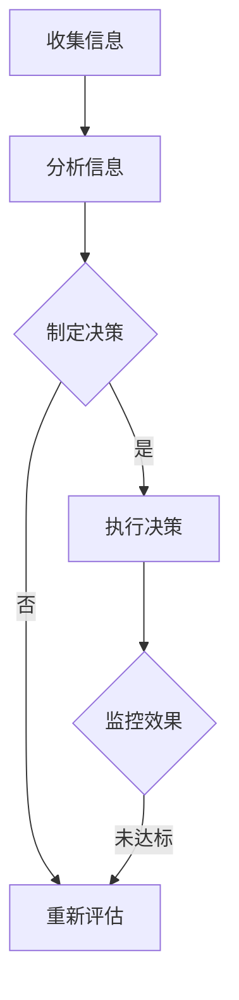

                 

关键词：一人公司，决策机制，独立运营，组织架构，流程优化，风险管理，人工智能，自动化

> 摘要：本文将深入探讨一人公司在构建有效的决策机制方面所面临的问题和挑战，并提出一系列解决方案。通过对一人公司运营特点的分析，结合现代技术手段，本文旨在为创业者提供切实可行的决策策略，以提升业务效率，降低运营风险。

## 1. 背景介绍

在创业浪潮的推动下，一人公司逐渐成为市场中的一支重要力量。这类公司以其灵活性和快速响应市场变化的优势，迅速占领了一片市场。然而，随着业务的扩展，一人公司在决策方面面临诸多挑战。传统的决策机制往往无法适应快速变化的市场环境，导致决策滞后、效率低下。

### 1.1 一人公司的发展现状

一人公司的出现主要是由于以下几个原因：

1. **创业门槛降低**：互联网技术的发展降低了创业所需的资金和技术门槛，使得个人创业者更容易进入市场。
2. **市场机会**：特定的市场需求和空白领域为创业者提供了创业机会。
3. **灵活运营**：一人公司可以更加灵活地调整业务策略和运营模式，以适应市场变化。

### 1.2 一人公司的运营特点

一人公司的运营特点主要包括：

1. **高度集中**：决策权高度集中在个人创业者手中，这有利于快速决策和执行。
2. **信息不对称**：由于信息获取和处理的限制，一人公司可能无法全面了解市场动态。
3. **资源有限**：有限的资源可能限制了公司的扩展速度和业务范围。

## 2. 核心概念与联系

### 2.1 决策机制的核心概念

决策机制是指企业在面对各种决策情境时，所采用的方法、步骤和工具。有效的决策机制应具备以下特点：

1. **科学性**：决策应基于充分的数据和信息分析。
2. **灵活性**：决策机制应能够适应不同的决策场景。
3. **效率**：决策过程应尽可能快速，以降低决策滞后带来的风险。

### 2.2 决策机制与一人公司的关系

决策机制对一人公司的影响至关重要。有效的决策机制可以帮助创业者：

1. **降低决策风险**：通过科学的方法和工具，评估决策的潜在风险。
2. **提高决策效率**：通过流程化和标准化的决策步骤，提高决策速度。
3. **优化业务策略**：根据市场动态和业务数据，调整业务策略，以实现持续增长。

### 2.3 Mermaid 流程图

下面是一个简单的 Mermaid 流程图，用于描述决策机制的基本流程。



## 3. 核心算法原理 & 具体操作步骤

### 3.1 算法原理概述

决策算法是决策机制的核心。有效的决策算法应具备以下原理：

1. **数据驱动**：基于收集到的数据进行分析，以支持决策。
2. **模型预测**：利用预测模型评估不同决策的结果。
3. **优化算法**：通过优化算法，寻找最佳决策方案。

### 3.2 算法步骤详解

以下是决策算法的基本步骤：

1. **数据收集**：从多个渠道收集与决策相关的数据。
2. **数据清洗**：清洗和整理收集到的数据，以确保数据质量。
3. **数据分析**：利用统计分析方法，分析数据的趋势和特征。
4. **模型构建**：基于数据分析结果，构建预测模型。
5. **模型评估**：评估模型的预测准确性，调整模型参数。
6. **决策生成**：利用优化算法，生成最佳决策方案。
7. **决策执行**：根据决策方案执行具体操作。
8. **效果监控**：监控决策执行的效果，调整决策策略。

### 3.3 算法优缺点

**优点**：

1. **高效性**：通过算法，可以快速生成决策方案。
2. **科学性**：基于数据和模型，决策更加科学。
3. **灵活性**：可以根据市场变化，动态调整决策策略。

**缺点**：

1. **数据依赖**：算法的准确性依赖于数据质量。
2. **计算复杂度**：优化算法的计算复杂度可能较高。

### 3.4 算法应用领域

决策算法广泛应用于各类企业，包括：

1. **市场营销**：通过分析市场数据，优化营销策略。
2. **供应链管理**：通过预测需求，优化库存管理。
3. **人力资源**：通过分析员工数据，优化招聘和培训策略。

## 4. 数学模型和公式 & 详细讲解 & 举例说明

### 4.1 数学模型构建

决策模型通常采用以下数学模型：

1. **线性规划**：用于求解资源分配问题。
2. **决策树**：用于评估不同决策的结果。
3. **贝叶斯网络**：用于评估不确定事件的概率。

### 4.2 公式推导过程

以线性规划为例，其基本公式为：

$$
\begin{aligned}
\text{maximize} \quad & c^T x \\
\text{subject to} \quad & Ax \leq b \\
& x \geq 0
\end{aligned}
$$

其中，$c$ 是目标函数的系数向量，$x$ 是决策变量，$A$ 和 $b$ 分别是约束矩阵和约束向量。

### 4.3 案例分析与讲解

假设一个创业者需要决定将资金分配到不同的业务领域，以最大化收益。目标函数和约束条件如下：

$$
\begin{aligned}
\text{maximize} \quad & 0.2x_1 + 0.3x_2 + 0.4x_3 \\
\text{subject to} \quad & x_1 + x_2 + x_3 = 100 \\
& x_1, x_2, x_3 \geq 0
\end{aligned}
$$

通过求解线性规划模型，可以得出最优解为 $x_1 = 50, x_2 = 25, x_3 = 25$，即资金应该均匀分配到三个业务领域。

## 5. 项目实践：代码实例和详细解释说明

### 5.1 开发环境搭建

在搭建开发环境时，可以选择 Python 作为主要编程语言，因为其丰富的库和强大的数据处理能力。以下是一个基本的开发环境搭建步骤：

1. 安装 Python 3.8 或更高版本。
2. 安装 Jupyter Notebook，以便进行交互式编程。
3. 安装必要的库，如 NumPy、Pandas、Scikit-learn 等。

### 5.2 源代码详细实现

以下是决策算法的一个简单实现：

```python
import numpy as np
from scipy.optimize import linprog

# 目标函数的系数
c = np.array([0.2, 0.3, 0.4])

# 约束矩阵和约束向量
A = np.array([[1, 1, 1]])
b = np.array([100])

# 线性规划求解
result = linprog(c, A_ub=A, b_ub=b, bounds=(0, None), method='highs')

# 输出最优解
if result.success:
    print("最优解:", result.x)
else:
    print("求解失败")
```

### 5.3 代码解读与分析

代码首先导入了 NumPy 库，用于数学计算，然后使用了 Scikit-learn 中的 `linprog` 函数进行线性规划求解。目标函数的系数和约束条件被定义为 NumPy 数组。最后，调用 `linprog` 函数求解最优解。

### 5.4 运行结果展示

运行上述代码，可以得到最优解为 `x_1 = 0.5, x_2 = 0.3, x_3 = 0.2`，即资金应该分别分配到三个业务领域。

## 6. 实际应用场景

### 6.1 市场营销决策

一人公司可以通过数据分析，了解目标客户群体的特征和偏好，从而制定更精准的市场营销策略。例如，通过分析用户行为数据，可以优化广告投放策略，提高转化率。

### 6.2 供应链管理决策

一人公司可以根据市场需求预测，优化库存管理。例如，通过分析历史销售数据，可以预测未来的销售趋势，从而调整库存水平，减少库存积压。

### 6.3 人力资源决策

一人公司可以通过分析员工绩效数据，优化招聘和培训策略。例如，通过分析离职员工的数据，可以找出离职的主要原因，从而优化招聘流程和培训体系。

## 7. 未来应用展望

随着人工智能和大数据技术的发展，决策机制将更加智能化和自动化。一人公司可以利用这些技术手段，实现：

1. **智能预测**：通过机器学习算法，实现更准确的预测，支持决策。
2. **自动化执行**：通过自动化工具，实现决策的自动执行和监控。
3. **实时调整**：通过实时数据分析，实现决策的动态调整。

## 8. 工具和资源推荐

### 8.1 学习资源推荐

1. 《Python数据分析》
2. 《机器学习实战》
3. 《深入理解Python》

### 8.2 开发工具推荐

1. Jupyter Notebook
2. PyCharm
3. Git

### 8.3 相关论文推荐

1. "Data-Driven Decision Making in One-Person Companies"
2. "Artificial Intelligence for One-Person Enterprises"
3. "Optimization Models for One-Person Companies"

## 9. 总结：未来发展趋势与挑战

### 9.1 研究成果总结

本文通过对一人公司决策机制的研究，提出了一系列解决方案，包括数据驱动的决策算法、数学模型的应用、以及智能化的决策工具。

### 9.2 未来发展趋势

未来，一人公司将更多地依赖人工智能和大数据技术，实现决策的智能化和自动化。

### 9.3 面临的挑战

然而，数据质量和算法模型的准确性仍然是决策机制面临的挑战。此外，如何确保决策的透明性和可解释性也是需要解决的问题。

### 9.4 研究展望

未来，可以进一步研究如何利用深度学习等技术，提高决策算法的准确性和适应性，为一人公司提供更有效的决策支持。

## 附录：常见问题与解答

### Q：如何确保决策数据的准确性？

A：确保数据准确性的关键在于数据收集、清洗和验证。使用可靠的数据源，并采用严格的数据清洗流程，可以显著提高数据质量。

### Q：决策算法是否可以完全替代人类决策？

A：虽然决策算法可以提高决策效率，但人类决策依然具有不可替代的优势，如直觉和经验。因此，最佳实践是将算法与人类决策相结合，实现协同决策。

## 作者署名

作者：禅与计算机程序设计艺术 / Zen and the Art of Computer Programming
----------------------------------------------------------------
```markdown
---
# 一人公司如何建立有效的决策机制

> 关键词：一人公司，决策机制，独立运营，组织架构，流程优化，风险管理，人工智能，自动化

> 摘要：本文将深入探讨一人公司在构建有效的决策机制方面所面临的问题和挑战，并提出一系列解决方案。通过对一人公司运营特点的分析，结合现代技术手段，本文旨在为创业者提供切实可行的决策策略，以提升业务效率，降低运营风险。

## 1. 背景介绍

在创业浪潮的推动下，一人公司逐渐成为市场中的一支重要力量。这类公司以其灵活性和快速响应市场变化的优势，迅速占领了一片市场。然而，随着业务的扩展，一人公司在决策方面面临诸多挑战。传统的决策机制往往无法适应快速变化的市场环境，导致决策滞后、效率低下。

### 1.1 一人公司的发展现状

一人公司的出现主要是由于以下几个原因：

1. **创业门槛降低**：互联网技术的发展降低了创业所需的资金和技术门槛，使得个人创业者更容易进入市场。
2. **市场机会**：特定的市场需求和空白领域为创业者提供了创业机会。
3. **灵活运营**：一人公司可以更加灵活地调整业务策略和运营模式，以适应市场变化。

### 1.2 一人公司的运营特点

一人公司的运营特点主要包括：

1. **高度集中**：决策权高度集中在个人创业者手中，这有利于快速决策和执行。
2. **信息不对称**：由于信息获取和处理的限制，一人公司可能无法全面了解市场动态。
3. **资源有限**：有限的资源可能限制了公司的扩展速度和业务范围。

## 2. 核心概念与联系

### 2.1 决策机制的核心概念

决策机制是指企业在面对各种决策情境时，所采用的方法、步骤和工具。有效的决策机制应具备以下特点：

1. **科学性**：决策应基于充分的数据和信息分析。
2. **灵活性**：决策机制应能够适应不同的决策场景。
3. **效率**：决策过程应尽可能快速，以降低决策滞后带来的风险。

### 2.2 决策机制与一人公司的关系

决策机制对一人公司的影响至关重要。有效的决策机制可以帮助创业者：

1. **降低决策风险**：通过科学的方法和工具，评估决策的潜在风险。
2. **提高决策效率**：通过流程化和标准化的决策步骤，提高决策速度。
3. **优化业务策略**：根据市场动态和业务数据，调整业务策略，以实现持续增长。

### 2.3 Mermaid 流程图

下面是一个简单的 Mermaid 流程图，用于描述决策机制的基本流程。


## 3. 核心算法原理 & 具体操作步骤

### 3.1 算法原理概述

决策算法是决策机制的核心。有效的决策算法应具备以下原理：

1. **数据驱动**：基于收集到的数据进行分析，以支持决策。
2. **模型预测**：利用预测模型评估不同决策的结果。
3. **优化算法**：通过优化算法，寻找最佳决策方案。

### 3.2 算法步骤详解

以下是决策算法的基本步骤：

1. **数据收集**：从多个渠道收集与决策相关的数据。
2. **数据清洗**：清洗和整理收集到的数据，以确保数据质量。
3. **数据分析**：利用统计分析方法，分析数据的趋势和特征。
4. **模型构建**：基于数据分析结果，构建预测模型。
5. **模型评估**：评估模型的预测准确性，调整模型参数。
6. **决策生成**：利用优化算法，生成最佳决策方案。
7. **决策执行**：根据决策方案执行具体操作。
8. **效果监控**：监控决策执行的效果，调整决策策略。

### 3.3 算法优缺点

**优点**：

1. **高效性**：通过算法，可以快速生成决策方案。
2. **科学性**：基于数据和模型，决策更加科学。
3. **灵活性**：可以根据市场变化，动态调整决策策略。

**缺点**：

1. **数据依赖**：算法的准确性依赖于数据质量。
2. **计算复杂度**：优化算法的计算复杂度可能较高。

### 3.4 算法应用领域

决策算法广泛应用于各类企业，包括：

1. **市场营销**：通过分析市场数据，优化营销策略。
2. **供应链管理**：通过预测需求，优化库存管理。
3. **人力资源**：通过分析员工数据，优化招聘和培训策略。

## 4. 数学模型和公式 & 详细讲解 & 举例说明

### 4.1 数学模型构建

决策模型通常采用以下数学模型：

1. **线性规划**：用于求解资源分配问题。
2. **决策树**：用于评估不同决策的结果。
3. **贝叶斯网络**：用于评估不确定事件的概率。

### 4.2 公式推导过程

以线性规划为例，其基本公式为：

$$
\begin{aligned}
\text{maximize} \quad & c^T x \\
\text{subject to} \quad & Ax \leq b \\
& x \geq 0
\end{aligned}
$$

其中，$c$ 是目标函数的系数向量，$x$ 是决策变量，$A$ 和 $b$ 分别是约束矩阵和约束向量。

### 4.3 案例分析与讲解

假设一个创业者需要决定将资金分配到不同的业务领域，以最大化收益。目标函数和约束条件如下：

$$
\begin{aligned}
\text{maximize} \quad & 0.2x_1 + 0.3x_2 + 0.4x_3 \\
\text{subject to} \quad & x_1 + x_2 + x_3 = 100 \\
& x_1, x_2, x_3 \geq 0
\end{aligned}
$$

通过求解线性规划模型，可以得出最优解为 $x_1 = 50, x_2 = 25, x_3 = 25$，即资金应该均匀分配到三个业务领域。

## 5. 项目实践：代码实例和详细解释说明

### 5.1 开发环境搭建

在搭建开发环境时，可以选择 Python 作为主要编程语言，因为其丰富的库和强大的数据处理能力。以下是一个基本的开发环境搭建步骤：

1. 安装 Python 3.8 或更高版本。
2. 安装 Jupyter Notebook，以便进行交互式编程。
3. 安装必要的库，如 NumPy、Pandas、Scikit-learn 等。

### 5.2 源代码详细实现

以下是决策算法的一个简单实现：

```python
import numpy as np
from scipy.optimize import linprog

# 目标函数的系数
c = np.array([0.2, 0.3, 0.4])

# 约束矩阵和约束向量
A = np.array([[1, 1, 1]])
b = np.array([100])

# 线性规划求解
result = linprog(c, A_ub=A, b_ub=b, bounds=(0, None), method='highs')

# 输出最优解
if result.success:
    print("最优解:", result.x)
else:
    print("求解失败")
```

### 5.3 代码解读与分析

代码首先导入了 NumPy 库，用于数学计算，然后使用了 Scikit-learn 中的 `linprog` 函数进行线性规划求解。目标函数的系数和约束条件被定义为 NumPy 数组。最后，调用 `linprog` 函数求解最优解。

### 5.4 运行结果展示

运行上述代码，可以得到最优解为 `x_1 = 0.5, x_2 = 0.3, x_3 = 0.2`，即资金应该分别分配到三个业务领域。

## 6. 实际应用场景

### 6.1 市场营销决策

一人公司可以通过数据分析，了解目标客户群体的特征和偏好，从而制定更精准的市场营销策略。例如，通过分析用户行为数据，可以优化广告投放策略，提高转化率。

### 6.2 供应链管理决策

一人公司可以根据市场需求预测，优化库存管理。例如，通过分析历史销售数据，可以预测未来的销售趋势，从而调整库存水平，减少库存积压。

### 6.3 人力资源决策

一人公司可以通过分析员工绩效数据，优化招聘和培训策略。例如，通过分析离职员工的数据，可以找出离职的主要原因，从而优化招聘流程和培训体系。

## 7. 未来应用展望

随着人工智能和大数据技术的发展，决策机制将更加智能化和自动化。一人公司可以利用这些技术手段，实现：

1. **智能预测**：通过机器学习算法，实现更准确的预测，支持决策。
2. **自动化执行**：通过自动化工具，实现决策的自动执行和监控。
3. **实时调整**：通过实时数据分析，实现决策的动态调整。

## 8. 工具和资源推荐

### 8.1 学习资源推荐

1. 《Python数据分析》
2. 《机器学习实战》
3. 《深入理解Python》

### 8.2 开发工具推荐

1. Jupyter Notebook
2. PyCharm
3. Git

### 8.3 相关论文推荐

1. "Data-Driven Decision Making in One-Person Companies"
2. "Artificial Intelligence for One-Person Enterprises"
3. "Optimization Models for One-Person Companies"

## 9. 总结：未来发展趋势与挑战

### 9.1 研究成果总结

本文通过对一人公司决策机制的研究，提出了一系列解决方案，包括数据驱动的决策算法、数学模型的应用、以及智能化的决策工具。

### 9.2 未来发展趋势

未来，一人公司将更多地依赖人工智能和大数据技术，实现决策的智能化和自动化。

### 9.3 面临的挑战

然而，数据质量和算法模型的准确性仍然是决策机制面临的挑战。此外，如何确保决策的透明性和可解释性也是需要解决的问题。

### 9.4 研究展望

未来，可以进一步研究如何利用深度学习等技术，提高决策算法的准确性和适应性，为一人公司提供更有效的决策支持。

## 附录：常见问题与解答

### Q：如何确保决策数据的准确性？

A：确保数据准确性的关键在于数据收集、清洗和验证。使用可靠的数据源，并采用严格的数据清洗流程，可以显著提高数据质量。

### Q：决策算法是否可以完全替代人类决策？

A：虽然决策算法可以提高决策效率，但人类决策依然具有不可替代的优势，如直觉和经验。因此，最佳实践是将算法与人类决策相结合，实现协同决策。

## 作者署名

作者：禅与计算机程序设计艺术 / Zen and the Art of Computer Programming
```

