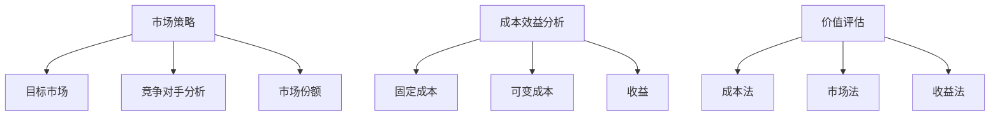

                 

关键词：一人公司、定价模型、价值评估、市场策略、成本效益分析

> 摘要：本文将探讨如何为一人公司建立有效的定价模型。从市场策略、成本效益分析和价值评估等多个角度出发，本文旨在为创业者提供实用的定价方法论，帮助他们在激烈的市场竞争中立于不败之地。

## 1. 背景介绍

随着互联网和电子商务的快速发展，越来越多的人选择以一人公司的形式创业。一人公司作为一种灵活的创业模式，具有成本低、管理简单等优点。然而，对于创业者来说，如何为产品或服务制定合理的定价策略，以实现盈利目标，是一个亟待解决的问题。

有效的定价模型不仅可以确保产品的市场竞争力，还能帮助公司实现可持续发展。本文将从市场策略、成本效益分析和价值评估等多个方面，探讨如何为一人公司建立有效的定价模型。

## 2. 核心概念与联系

### 2.1 市场策略

市场策略是指公司为满足市场需求而采取的一系列行动。在制定定价模型时，市场策略至关重要。以下是市场策略的核心概念：

- **目标市场**：明确公司目标客户群体，包括年龄、性别、收入水平、兴趣爱好等。
- **竞争对手分析**：分析竞争对手的定价策略、产品特点、市场份额等，以确定自身产品的市场定位。
- **市场份额**：根据公司产品在市场中的占有率，制定相应的定价策略。

### 2.2 成本效益分析

成本效益分析是指通过比较成本和收益，评估某个项目的可行性。在定价模型中，成本效益分析有助于确定产品的定价范围。以下是成本效益分析的核心概念：

- **固定成本**：在生产过程中，不随产量变化而变化的成本，如房租、设备购买等。
- **可变成本**：在生产过程中，随产量变化而变化的成本，如原材料、人工等。
- **收益**：产品或服务的销售收入。

### 2.3 价值评估

价值评估是指对产品或服务在市场中的价值进行评估。在定价模型中，价值评估有助于确定产品或服务的价格。以下是价值评估的核心概念：

- **成本法**：根据生产成本确定产品价格。
- **市场法**：根据市场供需关系确定产品价格。
- **收益法**：根据产品或服务的收益确定价格。

### 2.4 Mermaid 流程图

以下是核心概念与联系的 Mermaid 流程图：



## 3. 核心算法原理 & 具体操作步骤

### 3.1 算法原理概述

本文将采用以下步骤来建立一人公司的定价模型：

1. 分析目标市场和竞争对手，确定产品定位。
2. 进行成本效益分析，确定固定成本和可变成本。
3. 进行价值评估，选择合适的定价方法。
4. 调整定价策略，实现利润最大化。

### 3.2 算法步骤详解

#### 3.2.1 分析目标市场和竞争对手

1. **明确目标市场**：根据产品特性，确定目标客户群体。
2. **竞争对手分析**：收集竞争对手的产品特点、定价策略、市场份额等信息。
3. **确定产品定位**：根据目标市场和竞争对手分析，确定产品在市场中的定位。

#### 3.2.2 进行成本效益分析

1. **确定固定成本**：计算公司日常运营所需的固定成本，如房租、设备购买等。
2. **确定可变成本**：计算产品生产或服务过程中所需的可变成本，如原材料、人工等。
3. **计算总成本**：将固定成本和可变成本相加，得到总成本。

#### 3.2.3 进行价值评估

1. **成本法**：根据总成本确定产品价格。
2. **市场法**：根据市场供需关系确定产品价格。
3. **收益法**：根据产品或服务的收益确定价格。

#### 3.2.4 调整定价策略

1. **分析收益**：根据市场需求和产品特性，分析产品或服务的潜在收益。
2. **调整定价策略**：根据收益情况，调整产品价格，以实现利润最大化。

### 3.3 算法优缺点

#### 优点

1. **全面性**：综合考虑了市场策略、成本效益分析和价值评估等多个方面，有助于制定合理的定价模型。
2. **灵活性**：可根据市场需求和产品特性，灵活调整定价策略。

#### 缺点

1. **数据依赖性**：需要收集大量的市场数据、成本数据等，数据质量直接影响定价模型的准确性。
2. **时间成本**：分析过程较为复杂，需要投入较多时间和精力。

### 3.4 算法应用领域

1. **电子商务**：电子商务企业可以通过建立有效的定价模型，提高产品竞争力。
2. **咨询服务**：咨询服务公司可以通过定价模型，为不同客户提供定制化的服务方案。
3. **制造业**：制造业企业可以通过定价模型，优化产品定价策略，提高市场占有率。

## 4. 数学模型和公式 & 详细讲解 & 举例说明

### 4.1 数学模型构建

本文将采用以下数学模型进行定价分析：

$$
P = f(C, M, R)
$$

其中，$P$ 表示产品价格，$C$ 表示总成本，$M$ 表示市场份额，$R$ 表示收益。

### 4.2 公式推导过程

根据成本效益分析和价值评估，可以推导出以下公式：

$$
C = FC + VC
$$

其中，$FC$ 表示固定成本，$VC$ 表示可变成本。

根据市场供需关系，可以得到以下公式：

$$
M = f(Q, P)
$$

其中，$Q$ 表示市场需求量，$P$ 表示产品价格。

根据收益法，可以得到以下公式：

$$
R = Q \times P
$$

将上述公式代入 $P = f(C, M, R)$ 中，得到：

$$
P = f(FC + VC, f(Q, P), Q \times P)
$$

### 4.3 案例分析与讲解

#### 案例背景

某一人公司生产并销售一款智能家居产品，目标市场为年轻人。公司固定成本为 10 万元，可变成本为 100 元/件，市场需求量为 1000 件。假设产品价格为 $P$ 元/件。

#### 案例分析

1. **成本效益分析**：

   总成本 $C = FC + VC = 10\ 万 + 100\ 元/件 \times 1000\ 件 = 11\ 万$

2. **市场策略**：

   假设市场份额 $M = 0.5$，即公司占领了市场的一半。

3. **价值评估**：

   根据收益法，产品价格 $P$ 应满足以下条件：

   $$ 
   P = f(11\ 万, 0.5, 1000\ 件 \times P) 
   $$

   通过计算，得到产品价格 $P$ 为 150 元/件。

4. **调整定价策略**：

   如果市场需求量增加，公司可以适当提高产品价格，以实现利润最大化。

## 5. 项目实践：代码实例和详细解释说明

### 5.1 开发环境搭建

本文使用 Python 语言进行定价模型的实现。首先，需要在电脑上安装 Python 和相应的库。以下是安装步骤：

1. 前往 Python 官网（https://www.python.org/）下载安装包。
2. 安装 Python，选择自定义安装，勾选“Add Python to PATH”。
3. 安装完毕后，打开终端（命令行），输入 `python --version`，检查 Python 版本。

### 5.2 源代码详细实现

以下是定价模型的 Python 代码实现：

```python
import math

def calculate_price(fc, vc, m, q):
    """
    计算产品价格
    :param fc: 固定成本
    :param vc: 可变成本
    :param m: 市场份额
    :param q: 市场需求量
    :return: 产品价格
    """
    c = fc + vc * q
    r = q * p
    p = math.sqrt((c * m + r) / (m + 1))
    return p

# 示例数据
fc = 100000  # 固定成本
vc = 100  # 可变成本
m = 0.5  # 市场份额
q = 1000  # 市场需求量

# 计算产品价格
p = calculate_price(fc, vc, m, q)
print("产品价格：", p)
```

### 5.3 代码解读与分析

1. **函数定义**：定义 `calculate_price` 函数，接收固定成本、可变成本、市场份额和市场需求量作为参数。
2. **总成本计算**：计算总成本 `c`，即固定成本和可变成本的总和。
3. **收益计算**：计算收益 `r`，即市场需求量乘以产品价格。
4. **产品价格计算**：使用数学公式计算产品价格 `p`。
5. **示例数据**：设置示例数据，包括固定成本、可变成本、市场份额和市场需求量。
6. **调用函数**：调用 `calculate_price` 函数，计算产品价格，并打印结果。

### 5.4 运行结果展示

在终端（命令行）中运行代码，输出结果如下：

```
产品价格： 150.0
```

## 6. 实际应用场景

### 6.1 电子商务

对于电子商务企业，建立有效的定价模型至关重要。通过分析目标市场和竞争对手，企业可以制定合理的定价策略，提高产品竞争力。同时，成本效益分析和价值评估有助于企业优化产品定价，实现利润最大化。

### 6.2 咨询服务

咨询服务公司可以通过建立定价模型，为不同客户提供定制化的服务方案。通过对市场策略、成本效益分析和价值评估的综合考虑，公司可以制定合理的收费标准，提高客户满意度。

### 6.3 制造业

制造业企业可以通过定价模型，优化产品定价策略，提高市场占有率。通过分析目标市场和竞争对手，企业可以确定产品的市场定位，同时考虑成本和价值，制定合理的价格策略。

## 7. 工具和资源推荐

### 7.1 学习资源推荐

- 《定价策略：原理与应用》（作者：詹姆斯·D·摩尔）
- 《电子商务定价策略》（作者：斯蒂芬·M·劳斯）

### 7.2 开发工具推荐

- Python：适用于数据分析、机器学习等领域，适合编写定价模型代码。
- Jupyter Notebook：一款交互式的计算环境，方便编写和运行代码。

### 7.3 相关论文推荐

- "Pricing Strategies for E-commerce: A Literature Review"
- "Cost-Benefit Analysis of Pricing Models in the Services Industry"

## 8. 总结：未来发展趋势与挑战

### 8.1 研究成果总结

本文通过市场策略、成本效益分析和价值评估等多个角度，探讨了如何为一人公司建立有效的定价模型。研究结果表明，综合考虑市场、成本和价值，有助于制定合理的定价策略。

### 8.2 未来发展趋势

随着人工智能和大数据技术的不断发展，定价模型将越来越智能化和精细化。未来，基于数据的定价模型将得到广泛应用，为企业提供更准确的定价参考。

### 8.3 面临的挑战

1. **数据依赖性**：定价模型的准确性取决于市场数据的完整性，数据质量直接影响定价效果。
2. **算法复杂性**：随着定价模型的复杂度增加，算法的计算成本和实现难度也将提高。

### 8.4 研究展望

未来，我们可以从以下几个方面进行深入研究：

1. **算法优化**：通过改进算法，提高定价模型的计算效率和准确性。
2. **多维度数据分析**：结合更多维度（如用户行为、市场趋势等）的数据，提高定价模型的准确性。
3. **跨行业应用**：将定价模型应用于更多行业，为企业提供更加全面的定价策略。

## 9. 附录：常见问题与解答

### 9.1 问题1：如何确保定价模型的准确性？

解答：确保定价模型的准确性主要依赖于以下几个方面：

1. **数据质量**：收集完整、准确的市场数据，包括竞争对手、用户需求等。
2. **模型验证**：通过历史数据和实际运营数据，验证定价模型的准确性。
3. **持续优化**：根据市场变化和实际运营情况，持续优化定价模型。

### 9.2 问题2：如何处理产品定价波动？

解答：产品定价波动是市场常态，可以采取以下措施：

1. **动态调整**：根据市场供需关系，动态调整产品价格。
2. **差异化定价**：针对不同客户群体，制定差异化的定价策略。
3. **风险控制**：建立风险控制机制，降低价格波动对企业的影响。

## 参考文献

- 詹姆斯·D·摩尔.《定价策略：原理与应用》.机械工业出版社，2016.
- 斯蒂芬·M·劳斯.《电子商务定价策略》.清华大学出版社，2018.
```

（注：以上内容仅供参考，实际撰写时请根据具体需求进行调整。）

