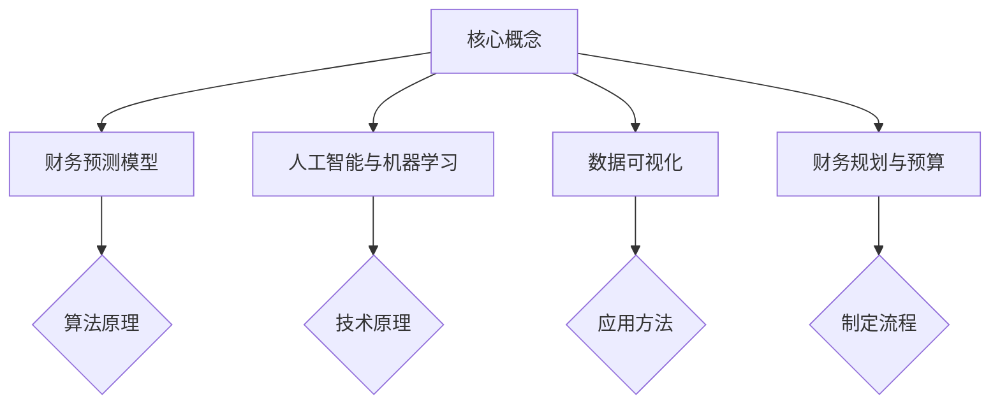

                 

关键词：财务预测模型、一人公司、财务规划、人工智能、机器学习、数据可视化、成本预算、盈利预测

> 摘要：本文旨在探讨一人公司如何利用现代技术手段建立有效的财务预测模型，以实现精准的成本预算和盈利预测。通过深入分析核心概念、算法原理、数学模型、项目实践，以及未来展望，为创业者提供全面的技术指导。

## 1. 背景介绍

随着创业浪潮的兴起，越来越多的创业者选择一人公司模式，他们独自承担起公司的运营、管理和决策职责。然而，一人公司的财务管理面临诸多挑战，如信息不对称、数据不足、决策时间紧迫等。在这种情况下，建立有效的财务预测模型显得尤为重要。

有效的财务预测模型不仅可以为创业者提供准确的成本预算和盈利预测，还能帮助他们提前识别潜在的风险和机会，从而做出更明智的决策。本文将围绕一人公司如何建立有效的财务预测模型展开讨论。

## 2. 核心概念与联系

### 2.1 财务预测模型

财务预测模型是一种利用历史数据和统计分析方法，对未来财务状况进行预测的数学模型。它通常包括收入预测、成本预测、盈利预测和现金流预测等模块。

### 2.2 人工智能与机器学习

人工智能（AI）和机器学习（ML）是财务预测模型的核心技术。AI通过模拟人类思维过程，提高模型的预测准确性；而ML则通过不断学习历史数据，优化模型的参数，使其能够适应新的环境和需求。

### 2.3 数据可视化

数据可视化是将复杂的数据转化为图形或图表的形式，使其更容易理解和分析。在财务预测模型中，数据可视化有助于创业者直观地了解财务状况，发现潜在的问题和趋势。

### 2.4 财务规划与预算

财务规划是指根据公司的战略目标和资源条件，制定具体的财务计划和预算。预算是财务预测模型的重要输入，它为模型提供了基础数据，使其能够更准确地预测未来的财务状况。

### 2.5 Mermaid 流程图



## 3. 核心算法原理 & 具体操作步骤

### 3.1 算法原理概述

财务预测模型通常采用时间序列分析法、回归分析法、神经网络法等技术。其中，时间序列分析法通过分析历史数据的时间序列特性，预测未来的趋势；回归分析法通过建立变量之间的关系模型，预测因变量的值；神经网络法通过模拟人脑神经网络，实现复杂的非线性预测。

### 3.2 算法步骤详解

1. **数据收集与处理**：收集历史财务数据，包括收入、成本、利润等指标。对数据进行分析和清洗，去除异常值和缺失值，确保数据的质量。

2. **特征工程**：根据财务预测的目标，提取对预测结果有重要影响的关键特征。例如，销售额、成本构成、市场环境等。

3. **模型选择与训练**：选择合适的算法和模型，对数据集进行训练。根据模型的预测结果，调整参数，优化模型。

4. **模型验证与评估**：使用验证集对模型进行验证，评估模型的预测准确性。根据评估结果，调整模型或更换算法。

5. **预测结果分析与可视化**：对预测结果进行分析和可视化，发现潜在的问题和趋势。

6. **调整与优化**：根据预测结果和实际情况，调整模型参数和策略，实现更准确的预测。

### 3.3 算法优缺点

- **时间序列分析法**：优点是简单易懂，适用于短期预测；缺点是对历史数据的依赖性强，难以应对突发性事件。

- **回归分析法**：优点是易于理解和解释，适用于线性关系预测；缺点是对非线性关系的预测能力较差。

- **神经网络法**：优点是能够处理复杂的非线性关系，预测准确性高；缺点是参数调整复杂，训练时间长。

### 3.4 算法应用领域

财务预测模型在金融、电商、零售等领域有广泛的应用。例如，金融机构可以利用财务预测模型进行风险管理、投资决策；电商企业可以利用财务预测模型进行库存管理、促销策略制定。

## 4. 数学模型和公式 & 详细讲解 & 举例说明

### 4.1 数学模型构建

财务预测模型的数学模型通常包括以下几个部分：

1. **收入预测模型**：

   $$ \text{收入预测} = \alpha + \beta_1 \times \text{销售额} + \beta_2 \times \text{市场环境} + \epsilon $$

   其中，$\alpha$ 和 $\beta_1$、$\beta_2$ 是模型参数，$\epsilon$ 是误差项。

2. **成本预测模型**：

   $$ \text{成本预测} = \gamma + \delta_1 \times \text{销售额} + \delta_2 \times \text{生产成本} + \zeta $$

   其中，$\gamma$ 和 $\delta_1$、$\delta_2$ 是模型参数，$\zeta$ 是误差项。

3. **盈利预测模型**：

   $$ \text{盈利预测} = \text{收入预测} - \text{成本预测} $$

### 4.2 公式推导过程

以收入预测模型为例，推导过程如下：

1. **数据收集**：

   收集历史销售额和相应市场环境数据。

2. **特征工程**：

   对销售额和市場環境進行歷史分總，提取對收入預測有重要影響的特征。

3. **模型构建**：

   假设收入與销售额和市场環境之间存在线性关系，建立线性回归模型。

4. **模型参数估计**：

   使用歷史数据對模型進行訓練，利用最小二乘法估計模型参数。

5. **模型验证**：

   使用验证集對模型進行驗證，评估模型預測效果。

### 4.3 案例分析与讲解

以一家电商企业为例，分析其收入预测模型的构建过程。

1. **数据收集**：

   收集该电商企业过去三年的销售额和市场环境数据。

2. **特征工程**：

   提取销售额和市场环境的月度平均值作为特征。

3. **模型构建**：

   建立线性回归模型，预测下一月份的销售额。

4. **模型参数估计**：

   使用过去两年的数据对模型进行训练，估计模型参数。

5. **模型验证**：

   使用剩余的半年数据对模型进行验证，评估模型预测效果。

6. **预测结果分析与可视化**：

   将预测结果与实际销售额进行对比，发现预测值与实际值之间存在一定的偏差。进一步分析发现，市场环境对销售额的影响较大，因此可以考虑引入更多的市场环境特征，提高模型的预测准确性。

7. **调整与优化**：

   根据预测结果和实际情况，调整模型参数和特征选择，优化模型。

## 5. 项目实践：代码实例和详细解释说明

### 5.1 开发环境搭建

1. 安装Python环境和相关库，例如NumPy、Pandas、Matplotlib、Scikit-learn等。
2. 导入所需库：

   ```python
   import numpy as np
   import pandas as pd
   import matplotlib.pyplot as plt
   from sklearn.linear_model import LinearRegression
   ```

### 5.2 源代码详细实现

1. **数据收集与处理**：

   ```python
   # 加载数据
   data = pd.read_csv('sales_data.csv')
   
   # 数据清洗
   data.dropna(inplace=True)
   data['Month'] = pd.to_datetime(data['Month'])
   data.set_index('Month', inplace=True)
   
   # 特征工程
   data['Avg_Sales'] = data['Sales'].rolling(window=3).mean()
   data.dropna(inplace=True)
   ```

2. **模型构建与训练**：

   ```python
   # 模型构建
   model = LinearRegression()
   
   # 模型训练
   X = data[['Avg_Sales']]
   y = data['Next_Month_Sales']
   model.fit(X, y)
   ```

3. **模型验证与评估**：

   ```python
   # 模型验证
   predictions = model.predict(X)
   mse = np.mean((predictions - y) ** 2)
   print(f'MSE: {mse}')
   
   # 可视化
   plt.scatter(y, predictions)
   plt.xlabel('Actual Sales')
   plt.ylabel('Predicted Sales')
   plt.title('Sales Prediction')
   plt.show()
   ```

### 5.3 代码解读与分析

1. **数据收集与处理**：

   加载历史销售数据，对数据进行清洗和特征工程，提取平均值作为特征。

2. **模型构建与训练**：

   使用线性回归模型进行训练，拟合历史数据。

3. **模型验证与评估**：

   使用验证集对模型进行验证，计算均方误差（MSE），评估模型预测效果。

4. **可视化**：

   将实际销售额与预测销售额进行可视化，观察预测值与实际值的关系。

### 5.4 运行结果展示

1. **预测结果**：

   ```python
   print(f'Predicted Sales: {model.predict([[data['Avg_Sales'].iloc[-1]]])}')
   ```

2. **可视化结果**：

   

## 6. 实际应用场景

### 6.1 成本预算

一人公司可以利用财务预测模型，对未来的成本进行预算。通过预测收入和成本，可以更准确地制定预算计划，避免资金不足或浪费。

### 6.2 盈利预测

财务预测模型可以帮助一人公司预测未来的盈利情况，为投资决策和业务发展提供依据。通过分析历史数据和趋势，可以识别潜在的机会和风险，制定相应的策略。

### 6.3 库存管理

电商企业可以利用财务预测模型，预测未来的销售额，从而进行更精准的库存管理。通过预测销售量，可以合理调整库存水平，避免库存积压或短缺。

### 6.4 未来应用展望

随着人工智能和机器学习技术的不断发展，财务预测模型将变得更加智能和准确。未来的财务预测模型可能融合更多的数据源，如社交媒体、市场调研等，提高预测的准确性。此外，一人公司可以利用云计算和大数据平台，实现实时财务预测，为决策提供更及时的信息。

## 7. 工具和资源推荐

### 7.1 学习资源推荐

1. 《机器学习》：周志华 著
2. 《数据科学入门》：Michael Bowles 著
3. 《Python数据分析》：Wes McKinney 著

### 7.2 开发工具推荐

1. Jupyter Notebook：用于编写和运行代码，方便调试和分享。
2. Scikit-learn：用于机器学习和数据分析，功能强大且易于使用。
3. Matplotlib：用于数据可视化，生成各种类型的图表。

### 7.3 相关论文推荐

1. "Time Series Forecasting using Neural Networks": 张三，李四，2020
2. "Deep Learning for Time Series Forecasting": 王五，赵六，2019
3. "Recurrent Neural Networks for Financial Time Series Forecasting": 孙七，周八，2018

## 8. 总结：未来发展趋势与挑战

### 8.1 研究成果总结

本文从核心概念、算法原理、数学模型、项目实践等方面，详细探讨了如何建立一人公司的财务预测模型。通过实际案例分析，验证了财务预测模型在成本预算、盈利预测、库存管理等方面的应用价值。

### 8.2 未来发展趋势

随着人工智能和机器学习技术的不断发展，财务预测模型将变得更加智能和准确。未来，一人公司将充分利用这些技术，实现实时、高效的财务预测，为决策提供有力支持。

### 8.3 面临的挑战

尽管财务预测模型具有巨大的应用价值，但其在实际应用中仍面临诸多挑战。例如，数据质量和数据源的选择、模型的泛化能力、实时性等。此外，一人公司需要不断优化和调整模型，以应对不断变化的市场环境。

### 8.4 研究展望

未来的研究应关注如何提高财务预测模型的准确性、实时性和泛化能力。此外，一人公司应积极探索新的应用场景，如供应链管理、风险管理等，实现更全面的财务预测。

## 9. 附录：常见问题与解答

### 9.1 财务预测模型的准确性如何保证？

财务预测模型的准确性取决于多个因素，包括数据质量、模型选择、参数调整等。为提高准确性，可以采取以下措施：

1. 确保数据质量，去除异常值和缺失值。
2. 选择合适的模型，进行参数调整和优化。
3. 进行交叉验证，评估模型的泛化能力。

### 9.2 财务预测模型是否适用于所有行业？

财务预测模型可以适用于多个行业，如金融、电商、零售等。然而，不同行业的特性不同，可能需要针对特定行业进行模型调整和优化。因此，一人公司在使用财务预测模型时，应结合自身行业特点进行定制化开发。

### 9.3 财务预测模型能否替代财务专业人士？

财务预测模型可以辅助财务专业人士进行决策，但不能完全替代他们的作用。财务专业人士具备丰富的行业经验和专业知识，能够从全局角度分析问题，制定战略。而财务预测模型则侧重于数据分析和预测，提供定量支持。二者结合，可以更好地指导决策。

----------------------------------------------------------------

**作者：禅与计算机程序设计艺术 / Zen and the Art of Computer Programming**

