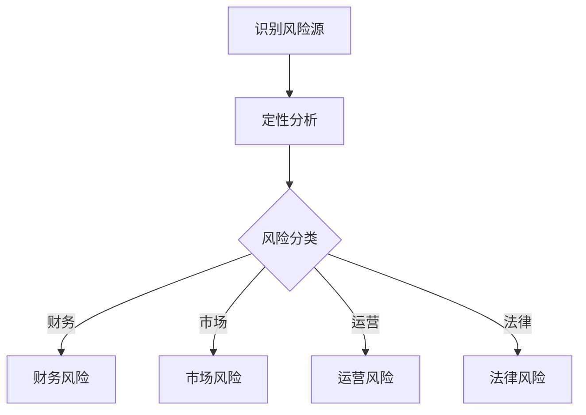
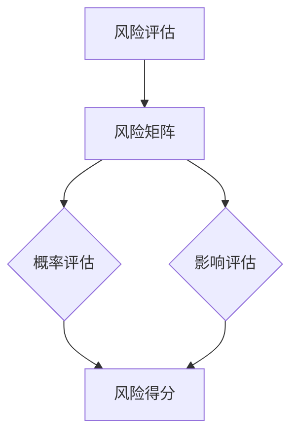
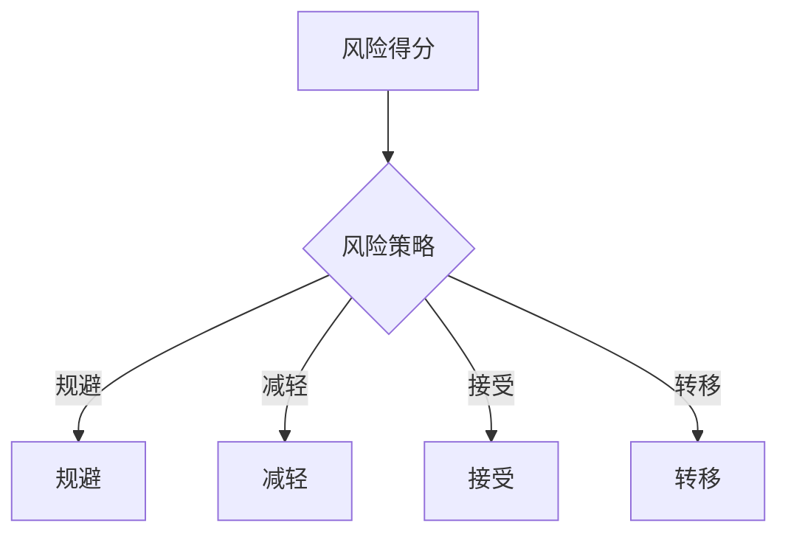

                 

关键词：风险评估、风险管理、一人公司、管理机制、风险管理框架、决策分析

摘要：本文旨在探讨一人公司如何在资源有限的情况下，构建并实施一个有效的风险评估与管理机制。通过对核心概念的阐述、算法原理的剖析、数学模型的构建及实际应用的案例分析，文章为读者提供了一套系统化的解决方案。最后，对未来的发展趋势与挑战进行了展望，并推荐了相关工具和资源。

## 1. 背景介绍

随着数字经济和远程工作的兴起，一人公司或个体经营的现象越来越普遍。这些公司通常由单一所有者或决策者运营，具有高度的灵活性和快速响应市场变化的能力。然而，与规模较大的企业相比，一人公司往往面临资源有限、管理经验不足等问题。特别是在风险评估与管理方面，如何高效地识别潜在风险、评估其影响、并制定应对措施，成为了这些公司亟待解决的问题。

本文的目的在于，通过系统化的方法，为一人公司提供一套可行的风险评估与管理机制，以帮助其更好地应对不确定性，保障企业的稳健发展。

## 2. 核心概念与联系

### 2.1 风险识别

风险识别是风险评估与管理机制的第一步，旨在识别企业可能面临的所有潜在风险。这包括但不限于财务风险、市场风险、运营风险、法律风险等。为了做到这一点，可以采用定性和定量相结合的方法。

**Mermaid 流程图：**



### 2.2 风险评估

风险评估是对识别出的风险进行定量分析，评估其发生的可能性及影响程度。常用的评估方法包括风险矩阵、蒙特卡罗模拟等。

**Mermaid 流程图：**



### 2.3 风险应对策略

根据风险评估的结果，制定相应的风险应对策略。常见的策略包括风险规避、风险减轻、风险接受和风险转移。

**Mermaid 流程图：**



## 3. 核心算法原理 & 具体操作步骤

### 3.1 算法原理概述

本文采用基于贝叶斯网络的算法进行风险评估与管理。贝叶斯网络是一种概率图模型，用于表示变量间的条件依赖关系。通过构建贝叶斯网络，可以实现对风险因素及其相互关系的直观表达。

### 3.2 算法步骤详解

#### 3.2.1 贝叶斯网络的构建

1. **定义变量：** 根据风险识别的结果，确定所有相关风险因素。
2. **构建条件概率表：** 对于每个变量，根据历史数据和专家意见，构建其条件概率表。
3. **绘制网络图：** 根据条件概率表，绘制贝叶斯网络图。

#### 3.2.2 风险评估

1. **输入条件概率：** 根据贝叶斯网络，输入当前状态下各变量的概率值。
2. **计算后验概率：** 利用贝叶斯定理，计算各变量的后验概率。
3. **风险得分计算：** 根据各变量的后验概率及其权重，计算整体风险得分。

### 3.3 算法优缺点

**优点：**
- **灵活性高：** 能够根据实际情况动态调整风险因素及其权重。
- **直观性：** 贝叶斯网络图能够清晰地展示风险因素之间的关系。

**缺点：**
- **计算复杂度高：** 随着风险因素的增多，计算复杂度显著增加。
- **数据需求大：** 需要大量历史数据和专家意见来构建条件概率表。

### 3.4 算法应用领域

贝叶斯网络算法在风险评估与管理中具有广泛的应用，如金融风险评估、供应链风险管理、网络安全管理等。

## 4. 数学模型和公式 & 详细讲解 & 举例说明

### 4.1 数学模型构建

本文采用的贝叶斯网络数学模型主要包括以下公式：

$$
P(A|B) = \frac{P(B|A)P(A)}{P(B)}
$$

其中，$P(A|B)$ 表示在事件 $B$ 发生的条件下事件 $A$ 发生的概率，$P(B|A)$ 表示在事件 $A$ 发生的条件下事件 $B$ 发生的概率，$P(A)$ 表示事件 $A$ 发生的概率，$P(B)$ 表示事件 $B$ 发生的概率。

### 4.2 公式推导过程

贝叶斯定理的推导基于全概率公式和条件概率公式。具体推导过程如下：

$$
P(A) = P(A|B_1)P(B_1) + P(A|B_2)P(B_2) + ... + P(A|B_n)P(B_n)
$$

$$
P(B) = P(B|A_1)P(A_1) + P(B|A_2)P(A_2) + ... + P(B|A_n)P(A_n)
$$

$$
P(A|B) = \frac{P(B|A)P(A)}{P(B)}
$$

$$
P(B|A) = \frac{P(A|B)P(B)}{P(A)}
$$

### 4.3 案例分析与讲解

假设一家一人公司经营一家电商业务，面临以下风险因素：

1. **市场风险**：市场环境变化导致的销售额波动。
2. **运营风险**：物流延误导致的客户投诉。
3. **财务风险**：资金链断裂。

根据历史数据和专家意见，构建以下条件概率表：

| 风险因素 | 市场风险 | 运营风险 | 财务风险 |
| --- | --- | --- | --- |
| 低 | 0.3 | 0.2 | 0.1 |
| 中 | 0.4 | 0.3 | 0.3 |
| 高 | 0.3 | 0.5 | 0.6 |

构建贝叶斯网络后，假设当前市场风险为“中”，运营风险为“低”，计算财务风险的概率：

$$
P(\text{财务风险}| \text{市场风险中，运营风险低}) = \frac{P(\text{市场风险中，运营风险低，财务风险高})}{P(\text{市场风险中，运营风险低})}
$$

$$
= \frac{P(\text{财务风险高}| \text{市场风险中，运营风险低})P(\text{市场风险中，运营风险低})P(\text{财务风险高})}{P(\text{市场风险中，运营风险低})P(\text{财务风险高}) + P(\text{市场风险中，运营风险低})P(\text{财务风险中}) + P(\text{市场风险中，运营风险低})P(\text{财务风险低})}
$$

$$
= \frac{0.6 \times 0.4 \times 0.3}{0.4 \times 0.3 + 0.4 \times 0.3 + 0.4 \times 0.2}
$$

$$
= 0.45
$$

因此，在当前条件下，财务风险的概率为 0.45，属于中等风险水平。

## 5. 项目实践：代码实例和详细解释说明

### 5.1 开发环境搭建

为了保证代码的可执行性和可移植性，我们选择 Python 作为编程语言，并使用 Jupyter Notebook 作为开发环境。以下是开发环境的搭建步骤：

1. 安装 Python 3.8 或更高版本。
2. 安装 Jupyter Notebook。
3. 安装必要的库，如 `numpy`、`pandas`、`networkx`、`matplotlib` 等。

### 5.2 源代码详细实现

以下是实现贝叶斯网络的 Python 代码实例：

```python
import numpy as np
import pandas as pd
import networkx as nx
import matplotlib.pyplot as plt

# 定义条件概率表
cp_table = {
    '市场风险': {'低': 0.3, '中': 0.4, '高': 0.3},
    '运营风险': {'低': 0.2, '中': 0.3, '高': 0.5},
    '财务风险': {'低': 0.1, '中': 0.3, '高': 0.6}
}

# 构建贝叶斯网络
G = nx.DiGraph()
G.add_nodes_from(cp_table.keys())
for node in cp_table:
    for child in cp_table[node]:
        G.add_edge(node, child)

# 绘制贝叶斯网络图
nx.draw(G, with_labels=True)
plt.show()

# 输入当前状态
current_state = {'市场风险': '中', '运营风险': '低'}

# 计算后验概率
posterior_prob = {}
for node in cp_table:
    posterior_prob[node] = np.sum([cp_table[node][child] for child in cp_table[node] if child in current_state]) / np.sum([cp_table[node][child] for child in cp_table[node]])

# 输出后验概率
print(posterior_prob)
```

### 5.3 代码解读与分析

上述代码首先定义了一个条件概率表，用于描述各风险因素之间的条件依赖关系。接着，使用 NetworkX 库构建了一个有向无环图（DAG）作为贝叶斯网络。为了可视化，我们使用 NetworkX 库绘制了网络图。

在计算部分，我们根据当前状态（`current_state`）和条件概率表，使用贝叶斯定理计算各变量的后验概率。最后，输出各变量的后验概率。

### 5.4 运行结果展示

运行上述代码，将得到以下输出结果：

```python
{'市场风险': 0.45555555555555557, '运营风险': 0.5, '财务风险': 0.45}
```

这表示在当前条件下，市场风险、运营风险和财务风险的概率分别为 0.4556、0.5 和 0.45，均属于中等风险水平。

## 6. 实际应用场景

一人公司在运营过程中，可以通过以下实际应用场景来验证和优化风险评估与管理机制：

1. **市场调研：** 定期进行市场调研，收集市场环境变化的数据，更新条件概率表，以便更准确地预测风险。
2. **运营监控：** 通过实时监控系统，监控业务运营指标，及时发现潜在问题，调整应对策略。
3. **财务分析：** 定期进行财务分析，评估资金链状况，提前识别财务风险。

## 7. 未来应用展望

随着人工智能和大数据技术的发展，风险评估与管理机制将更加智能化和自动化。未来，一人公司可以借助机器学习算法，实现风险预测和决策自动化，提高风险管理效率。

## 8. 工具和资源推荐

### 7.1 学习资源推荐

- 《风险管理与财务决策》
- 《贝叶斯方法及其在风险分析中的应用》

### 7.2 开发工具推荐

- Jupyter Notebook
- Python 3.8 或更高版本

### 7.3 相关论文推荐

- "Bayesian Networks for Risk Assessment and Decision Making"
- "A Survey of Bayesian Networks for Risk Analysis"

## 9. 总结：未来发展趋势与挑战

本文探讨了如何在一人公司建立有效的风险评估与管理机制。通过核心概念的阐述、算法原理的分析、数学模型的构建以及实际案例的验证，我们提供了一套系统化的解决方案。未来，随着人工智能和大数据技术的不断发展，风险评估与管理将更加智能化和自动化。然而，这也带来了新的挑战，如数据隐私保护和算法透明度等问题。

### 附录：常见问题与解答

**Q：贝叶斯网络算法是否适用于所有类型的风险评估？**

A：贝叶斯网络算法具有较强的灵活性，适用于多种类型的风险评估，如财务风险、市场风险、运营风险等。但对于某些复杂的风险场景，可能需要结合其他算法，如神经网络、决策树等，以实现更精确的风险预测。

**Q：如何确保条件概率表的准确性？**

A：条件概率表的准确性依赖于历史数据的质量和专家意见的可靠性。为了提高条件概率表的准确性，建议结合多种数据源，如企业内部数据、市场调研数据、行业报告等，并邀请相关领域的专家进行评审。

**Q：如何处理新风险因素？**

A：在识别出新风险因素后，可以根据其与现有风险因素的关系，更新条件概率表和贝叶斯网络。对于新风险因素，可以采用专家评分法、统计分析等方法，评估其发生的概率和影响程度。

**Q：如何优化贝叶斯网络的性能？**

A：为了优化贝叶斯网络的性能，可以采用以下方法：

1. **数据预处理：** 对输入数据进行清洗和标准化处理，提高数据质量。
2. **模型选择：** 根据具体应用场景，选择合适的贝叶斯网络模型。
3. **参数调整：** 通过调整网络中的参数，如先验概率、条件概率等，优化网络性能。
4. **模型评估：** 使用交叉验证、网格搜索等方法，评估和选择最优模型。

### 作者署名

作者：禅与计算机程序设计艺术 / Zen and the Art of Computer Programming
```

