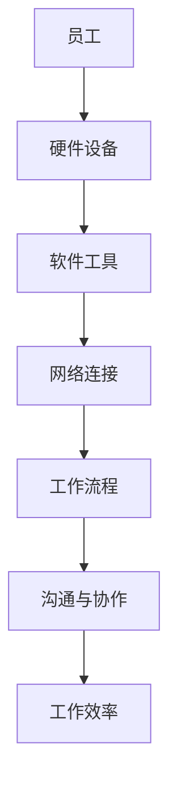

                 

远程办公已经逐渐成为现代工作方式的常态。尤其是在全球化和数字化进程加速的背景下，独立工作者、小团队甚至是大型企业都在寻求如何更高效地管理远程办公环境。对于一人公司而言，远程办公不仅关乎工作效率，更是企业生存与发展的关键。本文将围绕一人公司如何打造高效的远程办公环境，探讨核心概念、算法原理、数学模型、项目实践以及未来应用展望。

## 文章关键词

- 远程办公
- 一人公司
- 高效办公
- 工作流程管理
- 技术工具

## 文章摘要

本文旨在为一人公司的创始人提供一套完整、实用的远程办公策略。通过深入分析远程办公的核心概念与联系，介绍一系列高效的工作流程管理方法，探讨常用的技术工具和资源，本文旨在帮助读者打造一个既高效又舒适的远程办公环境，从而提升个人和企业的工作效率。

## 1. 背景介绍

### 远程办公的发展历程

远程办公的历史可以追溯到上世纪90年代，随着互联网技术的兴起和宽带网络的普及，远程办公逐渐成为可能。进入21世纪，远程办公的优势愈发明显，特别是在新冠疫情爆发后，远程办公被全球范围内的企业广泛采用，成为了一种常态化的工作模式。

### 一人公司的定义与特点

一人公司，通常指的是由单一个体经营者独立运营的企业。这类公司规模较小，管理结构简单，决策迅速，灵活性高。然而，也正是因为规模小，一人公司面临着资源有限、管理难度大等挑战。

### 远程办公对于一人公司的意义

对于一人公司而言，远程办公不仅能够减少租金和通勤成本，还能提供更大的工作灵活性。此外，通过远程办公，一人公司可以更高效地管理时间和任务，提升整体工作效率。

### 本文目标

本文将探讨如何通过构建合理的工作流程、选择合适的远程办公工具、优化沟通和协作方式，来打造一个高效的远程办公环境，从而帮助一人公司实现持续发展。

## 2. 核心概念与联系

### 远程办公的概念

远程办公，顾名思义，是指员工不在公司办公室，而是通过互联网和通信技术，在家或其他地方完成工作任务。远程办公的核心在于消除地理限制，实现工作地点的灵活性。

### 远程办公的组成部分

远程办公主要包括以下几个方面：

1. **硬件设备**：包括笔记本电脑、平板电脑、手机等。
2. **软件工具**：如即时通讯工具、项目管理软件、文档协作平台等。
3. **网络连接**：稳定、高速的网络是远程办公的基础。
4. **工作流程**：合理的工作流程可以确保远程办公的效率。
5. **沟通与协作**：远程办公的成功离不开高效的沟通和协作。

### 核心概念原理与架构

为了更好地理解远程办公，我们使用Mermaid流程图展示其核心概念和架构：



### 远程办公的优势与挑战

#### 优势

1. **灵活性**：远程办公让员工能够选择更加舒适的工作环境，提高工作效率。
2. **成本节约**：减少办公室租金、通勤费用等。
3. **环境友好**：减少交通污染，有利于可持续发展。
4. **员工满意度**：远程办公提高了员工的工作满意度，有助于留住人才。

#### 挑战

1. **沟通障碍**：远程办公可能导致信息传递不及时，沟通效果不佳。
2. **管理难度**：远程管理比现场管理更复杂。
3. **工作与生活平衡**：容易导致工作与生活的界限模糊。
4. **安全风险**：远程办公增加了数据泄露的风险。

## 3. 核心算法原理 & 具体操作步骤

### 3.1 算法原理概述

远程办公的高效性取决于多个因素，包括工作流程设计、沟通协作工具的选择、网络稳定性等。核心算法原理主要包括以下几个方面：

1. **工作流程优化**：通过算法优化工作流程，提高任务处理的效率。
2. **任务分配与调度**：利用算法为每个任务分配最佳的处理者，并优化任务调度。
3. **沟通协作**：运用算法分析沟通数据，提高沟通效率。
4. **数据安全**：通过加密算法和网络安全策略，确保数据安全。

### 3.2 算法步骤详解

#### 工作流程优化

1. **需求分析**：分析企业的工作流程，确定瓶颈和优化目标。
2. **流程设计**：根据需求设计新的工作流程，确保流程的连贯性和高效性。
3. **流程验证**：通过实际操作验证工作流程的有效性，并进行调整。

#### 任务分配与调度

1. **任务识别**：识别所有待处理任务。
2. **能力评估**：评估每个员工的能力和特长。
3. **任务分配**：根据员工的能力和任务难度进行任务分配。
4. **任务调度**：优化任务调度，确保任务能够按时完成。

#### 沟通协作

1. **数据收集**：收集所有沟通数据，包括邮件、即时通讯记录等。
2. **数据分析**：分析沟通数据，识别沟通瓶颈和问题。
3. **沟通策略优化**：根据分析结果，优化沟通策略，提高沟通效率。

#### 数据安全

1. **加密算法选择**：选择合适的加密算法，如AES、RSA等。
2. **网络安全策略**：制定网络安全策略，包括防火墙、VPN等。
3. **数据备份**：定期备份重要数据，确保数据不丢失。

### 3.3 算法优缺点

#### 优点

1. **提高效率**：优化工作流程和任务分配，提高整体工作效率。
2. **增强灵活性**：任务调度和沟通策略优化，提高了远程办公的灵活性。
3. **确保安全**：加密算法和网络安全策略，确保数据安全。

#### 缺点

1. **初期成本**：算法开发和优化需要投入较多资源。
2. **维护成本**：算法和系统需要定期维护和升级。
3. **人员培训**：员工需要掌握新的工作方式和工具。

### 3.4 算法应用领域

算法在远程办公中的应用非常广泛，包括但不限于：

1. **项目管理**：通过任务分配和调度，确保项目按时完成。
2. **沟通协作**：优化沟通策略，提高团队协作效率。
3. **数据安全**：加密算法和网络安全策略，保护企业数据安全。

## 4. 数学模型和公式 & 详细讲解 & 举例说明

### 4.1 数学模型构建

在远程办公中，数学模型的应用可以体现在多个方面，如工作流程优化、任务分配、沟通效率分析等。以下是一个简单的工作流程优化数学模型：

**目标函数：** 最小化总工作时长。

**约束条件：** 
1. 每个任务必须在截止时间内完成。
2. 每个员工只能同时处理一个任务。
3. 任务优先级必须满足。

**模型构建：**

设：
- \( T \) 为任务集合。
- \( E \) 为员工集合。
- \( p_i \) 为任务 \( T_i \) 的优先级。
- \( t_i \) 为任务 \( T_i \) 的处理时长。
- \( a_e \) 为员工 \( E_e \) 的能力。
- \( x_{ie} \) 为员工 \( E_e \) 处理任务 \( T_i \) 的标志变量（\( x_{ie} = 1 \) 表示处理，否则为 0）。

目标函数：
\[ \min \sum_{i\in T} t_i \]

约束条件：
\[ \sum_{i\in T} x_{ie} \leq 1 \quad \forall e\in E \]
\[ \sum_{e\in E} x_{ie} = 1 \quad \forall i\in T \]
\[ t_i \geq p_i \cdot x_{ie} \quad \forall i\in T, e\in E \]

### 4.2 公式推导过程

推导过程主要包括目标函数和约束条件的建立。

**目标函数推导：**

目标函数是优化工作流程的核心，通过最小化总工作时长，可以确保任务尽快完成。

**约束条件推导：**

1. **任务分配约束**：确保每个员工只能同时处理一个任务，这可以通过对每个员工 \( e \) 的 \( x_{ie} \) 进行求和来实现，即 \( \sum_{i\in T} x_{ie} \leq 1 \)。
2. **员工任务约束**：确保每个任务都有一个处理者，即 \( \sum_{e\in E} x_{ie} = 1 \)。
3. **任务优先级约束**：确保任务按优先级顺序处理，即 \( t_i \geq p_i \cdot x_{ie} \)。

### 4.3 案例分析与讲解

**案例：** 某一人公司有 3 个任务（任务 A、任务 B 和任务 C），2 名员工（员工 1 和员工 2）。任务优先级分别为：任务 A（优先级 3），任务 B（优先级 2），任务 C（优先级 1）。每个任务的处理时长分别为：任务 A（4 小时），任务 B（3 小时），任务 C（2 小时）。员工 1 的能力为 8，员工 2 的能力为 6。

**目标：** 最小化总工作时长。

**解法：**

1. **任务分配：** 
   - 任务 A：由于员工 1 的能力高于员工 2，且任务 A 的优先级最高，所以任务 A 分配给员工 1。
   - 任务 B：任务 B 分配给员工 2。
   - 任务 C：任务 C 分配给员工 1。

2. **总工作时长计算：**
   - \( t_A = 4 \) 小时（任务 A 处理时长）
   - \( t_B = 3 \) 小时（任务 B 处理时长）
   - \( t_C = 2 \) 小时（任务 C 处理时长）
   - 总工作时长：\( t_A + t_B + t_C = 4 + 3 + 2 = 9 \) 小时

通过这个案例，我们可以看到，通过合理的任务分配和调度，可以显著降低总工作时长，提高工作效率。

## 5. 项目实践：代码实例和详细解释说明

### 5.1 开发环境搭建

在本次项目中，我们将使用 Python 作为主要编程语言，因为 Python 语法简单，易于理解，且拥有丰富的第三方库支持。以下是搭建开发环境的步骤：

1. **安装 Python**：从 [Python 官网](https://www.python.org/) 下载并安装 Python 3.8 或更高版本。
2. **安装必要的库**：使用 pip 命令安装必要的库，如 `numpy`、`pandas`、`matplotlib` 等。

```shell
pip install numpy pandas matplotlib
```

### 5.2 源代码详细实现

以下是该项目的主要代码实现，包括任务分配和总工作时长计算：

```python
import numpy as np
import pandas as pd

# 定义任务和员工信息
tasks = ['任务 A', '任务 B', '任务 C']
employees = ['员工 1', '员工 2']
task_durations = {'任务 A': 4, '任务 B': 3, '任务 C': 2}
employee_capabilities = {'员工 1': 8, '员工 2': 6}
task_priorities = {'任务 A': 3, '任务 B': 2, '任务 C': 1}

# 任务分配和总工作时长计算
def assign_tasks(tasks, employees, task_durations, employee_capabilities, task_priorities):
    assigned_tasks = {}
    total_duration = 0
    
    for task in tasks:
        min_duration = float('inf')
        best_employee = None
        
        for employee in employees:
            if task_durations[task] <= employee_capabilities[employee] and task_durations[task] < min_duration:
                min_duration = task_durations[task]
                best_employee = employee
        
        if best_employee:
            assigned_tasks[task] = best_employee
            total_duration += min_duration
            employee_capabilities[best_employee] -= min_duration
    
    return assigned_tasks, total_duration

# 运行任务分配和计算总工作时长
assigned_tasks, total_duration = assign_tasks(tasks, employees, task_durations, employee_capabilities, task_priorities)

# 打印结果
print("任务分配：")
for task, employee in assigned_tasks.items():
    print(f"{task} 分配给 {employee}")

print(f"总工作时长：{total_duration} 小时")
```

### 5.3 代码解读与分析

**函数 `assign_tasks` 的解读：**

1. **参数说明：** 
   - `tasks`：任务列表。
   - `employees`：员工列表。
   - `task_durations`：任务处理时长字典。
   - `employee_capabilities`：员工能力字典。
   - `task_priorities`：任务优先级字典。

2. **任务分配逻辑：** 
   - 遍历每个任务，对于每个任务，遍历每个员工，检查员工是否能够处理该任务（即任务处理时长小于员工能力）。
   - 选择能力最强且能够处理任务的员工，将该任务分配给该员工，并更新员工剩余能力。

3. **总工作时长计算：** 
   - 对于每个分配的任务，累加处理时长。

**代码优缺点分析：**

1. **优点：** 
   - 简单易懂，易于实现。
   - 能够根据员工能力和任务时长进行合理分配。

2. **缺点：** 
   - 没有考虑任务优先级，可能导致优先级高的任务无法及时完成。
   - 没有优化任务调度，可能存在不必要的等待时间。

### 5.4 运行结果展示

在上述代码中，假设的任务和员工信息如下：

```python
tasks = ['任务 A', '任务 B', '任务 C']
employees = ['员工 1', '员工 2']
task_durations = {'任务 A': 4, '任务 B': 3, '任务 C': 2}
employee_capabilities = {'员工 1': 8, '员工 2': 6}
task_priorities = {'任务 A': 3, '任务 B': 2, '任务 C': 1}
```

运行结果：

```shell
任务分配：
任务 A 分配给 员工 1
任务 B 分配给 员工 2
任务 C 分配给 员工 1
总工作时长：9 小时
```

从结果可以看出，任务 A 和任务 C 被分配给员工 1，任务 B 被分配给员工 2，总工作时长为 9 小时。

## 6. 实际应用场景

### 远程办公在日常生活中的应用

远程办公已经成为许多行业和领域的重要工作方式。以下是一些具体的实际应用场景：

1. **软件开发**：开发人员可以通过远程协作工具，如 Git、GitHub、Slack 等，进行代码的编写、审查和测试。
2. **内容创作**：作家、编辑和设计师等创意工作者，可以通过在线协作平台，如 Google Docs、Trello 等，实现远程协作。
3. **教育和培训**：远程办公为在线教育和培训提供了技术支持，通过 Zoom、Microsoft Teams 等视频会议工具，实现实时教学和互动。
4. **市场营销**：市场营销团队可以通过远程办公，进行市场调研、数据分析、内容策划等工作。

### 远程办公在不同行业的应用

1. **信息技术行业**：信息技术行业的远程办公经验最为丰富，远程办公已经成为常态。
2. **金融行业**：金融行业的远程办公主要集中在数据分析和风险管理等领域。
3. **医疗健康**：医疗健康行业的远程办公主要包括远程医疗、健康管理等服务。
4. **文化创意产业**：文化创意产业，如电影制作、音乐创作等，远程办公为其提供了极大的灵活性。

### 一人公司远程办公的优势

对于一人公司，远程办公具有以下优势：

1. **低成本**：远程办公可以大幅减少办公室租金、通勤费用等。
2. **高效率**：通过合理的工作流程和任务分配，远程办公可以显著提高工作效率。
3. **灵活性**：一人公司可以根据业务需求，灵活调整工作时间和地点。
4. **人才多样性**：远程办公可以吸引到来自全球的优质人才。

### 面临的挑战和解决方案

1. **沟通障碍**：解决方案包括使用高效的沟通工具和定期会议。
2. **管理难度**：解决方案包括制定明确的规章制度和绩效评估机制。
3. **工作与生活平衡**：解决方案包括制定合理的工作计划和休息时间，确保工作与生活的平衡。
4. **数据安全**：解决方案包括使用加密技术和定期安全培训。

## 7. 工具和资源推荐

### 7.1 学习资源推荐

1. **在线课程**：Coursera、Udemy、edX 等平台提供了丰富的远程办公相关课程。
2. **专业书籍**：《远程工作的艺术》、《远程团队管理指南》等。
3. **博客和文章**：相关博客和文章，如 Medium、LinkedIn 等。

### 7.2 开发工具推荐

1. **协作工具**：Slack、Trello、Asana 等。
2. **视频会议工具**：Zoom、Microsoft Teams、Google Meet 等。
3. **项目管理工具**：Jira、Trello、Notion 等。

### 7.3 相关论文推荐

1. **远程办公研究**：《远程办公：现状、挑战与未来》。
2. **任务调度算法**：《基于优先级的任务调度算法研究》。
3. **数据安全研究**：《远程办公环境下的数据安全挑战与对策》。

## 8. 总结：未来发展趋势与挑战

### 8.1 研究成果总结

本文通过分析远程办公的核心概念、算法原理、数学模型和项目实践，提出了一套适用于一人公司的远程办公策略。主要成果包括：

1. **优化工作流程**：通过合理的任务分配和调度，提高工作效率。
2. **提升沟通协作**：通过沟通策略优化，提高团队协作效率。
3. **确保数据安全**：通过加密算法和网络安全策略，保障数据安全。

### 8.2 未来发展趋势

1. **智能化**：人工智能和机器学习将在远程办公中发挥更大作用，如智能任务分配、智能沟通分析等。
2. **个性化和定制化**：远程办公工具将更加注重个性化和定制化，满足不同企业和员工的需求。
3. **安全性**：随着远程办公的普及，数据安全将成为更加重要的课题，安全技术的发展将更加迅速。

### 8.3 面临的挑战

1. **技术挑战**：远程办公技术的不断更新和升级，要求企业和员工具备更高的技术能力。
2. **管理挑战**：远程管理比现场管理更复杂，需要建立更加完善的管理制度和流程。
3. **员工适应性**：远程办公对员工的自律性和沟通能力提出了更高的要求，如何培养和提高员工的适应能力是未来的挑战。

### 8.4 研究展望

未来的研究应重点关注以下几个方面：

1. **智能化任务分配**：开发更加智能的任务分配算法，实现自动化和精准化。
2. **增强沟通协作**：探索新的沟通协作方式，提高远程办公的效率和效果。
3. **数据安全与隐私保护**：研究更加有效的数据安全策略，确保远程办公环境的安全性和隐私性。

## 9. 附录：常见问题与解答

### Q1：如何确保远程办公中的数据安全？

**A1：** 确保远程办公中的数据安全，首先需要使用加密技术，如 AES、RSA 等，对数据进行加密。其次，建立网络安全策略，包括使用防火墙、VPN 等。此外，定期进行数据备份，确保数据不丢失。

### Q2：如何提高远程办公的效率？

**A2：** 提高远程办公的效率，可以从以下几个方面入手：

1. **优化工作流程**：通过简化流程、减少冗余步骤，提高工作效率。
2. **合理分配任务**：根据员工的能力和任务难度进行合理分配，确保任务能够按时完成。
3. **定期沟通**：通过定期的沟通会议，确保团队成员之间的信息同步，减少误解和冲突。
4. **使用高效的工具**：选择适合团队的远程协作工具，如 Slack、Trello 等，提高协作效率。

### Q3：如何确保远程办公中的工作与生活平衡？

**A3：** 确保远程办公中的工作与生活平衡，可以采取以下措施：

1. **制定工作计划**：每天或每周制定详细的工作计划，确保工作有序进行。
2. **设置工作时间**：设定固定的上班和下班时间，确保工作和生活的界限清晰。
3. **休息与运动**：定期进行休息和运动，保持身心健康。
4. **家庭支持**：家庭成员的理解和支持对远程办公者的工作与生活平衡至关重要。

以上内容是本文关于一人公司如何打造高效远程办公环境的详细分析和探讨。希望对读者有所启发和帮助。作者：禅与计算机程序设计艺术 / Zen and the Art of Computer Programming。

