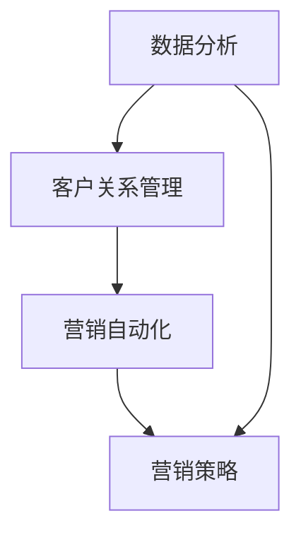

                 

关键词：销售漏斗、转化率、一人公司、营销策略、数据分析、客户关系管理、技术实现

> 摘要：本文将探讨一人公司如何利用现代营销技术和数据分析工具，打造高转化率的销售漏斗。通过深入了解客户行为、优化营销策略、利用自动化工具，以及实施精准客户关系管理，一人公司可以提升销售转化率，实现业务增长。

## 1. 背景介绍

在当今充满竞争的商业环境中，一家一人公司想要在市场中脱颖而出，必须拥有一个高效的营销和销售体系。而销售漏斗（Sales Funnel）作为营销和销售的核心概念，已经成为企业提升转化率的重要工具。一人公司由于其独特的经营模式，资源有限，因此更需要一个简单而高效的策略来打造销售漏斗。

### 1.1 销售漏斗的概念

销售漏斗是一种可视化工具，用于展示客户从初次接触到最后成交的整个转化过程。它通常分为几个阶段：潜在客户（Lead）、潜在客户（Prospect）、销售机会（ Opportunity）和客户（Customer）。每个阶段都有其特定的目标，通过分析每个阶段的转化率，企业可以识别问题并进行优化。

### 1.2 一人公司的挑战

对于一人公司来说，资源有限、时间紧迫、缺乏团队协作是其面临的三大挑战。因此，如何高效地利用有限的资源，实现最大化的销售转化率，成为一人公司成功的关键。

## 2. 核心概念与联系

为了打造高转化率的销售漏斗，我们需要理解以下几个核心概念及其相互关系：

### 2.1 数据分析

数据分析是打造高效销售漏斗的基础。通过对客户行为、营销效果、市场趋势的数据进行分析，一人公司可以了解客户的需求，优化营销策略。

### 2.2 客户关系管理（CRM）

客户关系管理（CRM）系统可以帮助一人公司有效地管理客户信息，提高客户满意度，从而提升转化率。

### 2.3 营销自动化

营销自动化工具可以自动化营销活动，减少人力成本，提高效率。

### 2.4 营销策略

有效的营销策略是提升销售转化率的关键。一人公司需要根据数据分析结果，制定精准的营销策略。

### 2.5 Mermaid 流程图



## 3. 核心算法原理 & 具体操作步骤

### 3.1 算法原理概述

销售漏斗的核心算法原理是基于客户行为数据和营销活动的效果评估，通过数据分析来优化每个销售阶段的转化率。

### 3.2 算法步骤详解

#### 3.2.1 数据收集

首先，我们需要收集客户行为数据，如网站访问量、页面浏览量、点击率、转化率等。

#### 3.2.2 数据分析

通过数据分析，我们可以了解客户在不同阶段的转化情况，识别问题。

#### 3.2.3 优化策略

根据数据分析结果，调整营销策略，提高每个阶段的转化率。

#### 3.2.4 跟踪与评估

持续跟踪销售漏斗的转化情况，评估优化策略的效果。

### 3.3 算法优缺点

#### 优点

- 高效：自动化工具可以减少人力成本，提高效率。
- 精准：基于数据分析，可以更精准地定位客户需求。

#### 缺点

- 复杂：需要熟练掌握数据分析工具和技术。
- 资源要求：需要投入一定的资金和人力资源。

### 3.4 算法应用领域

销售漏斗算法广泛应用于各类企业，尤其适合一人公司和小型团队。

## 4. 数学模型和公式 & 详细讲解 & 举例说明

### 4.1 数学模型构建

销售漏斗的数学模型主要涉及以下几个关键指标：

- 转化率（Conversion Rate）: 某一阶段转化的客户数量与接触到的潜在客户数量之比。
- 客户获取成本（Customer Acquisition Cost，CAC）: 获取一个客户所需的平均成本。
- 客户生命周期价值（Customer Lifetime Value，CLV）: 一个客户在整个购买周期内为企业带来的总价值。

### 4.2 公式推导过程

- 转化率（CR）:
  $$ CR = \frac{转化的客户数量}{接触到的潜在客户数量} $$

- 客户获取成本（CAC）:
  $$ CAC = \frac{营销成本}{新客户数量} $$

- 客户生命周期价值（CLV）:
  $$ CLV = \text{平均订单价值} \times \text{购买频率} \times \text{客户生命周期} $$

### 4.3 案例分析与讲解

假设一家一人公司通过SEO和社交媒体广告获取新客户，其每月的营销成本为5000美元，新客户数量为50人。

- 计算CAC:
  $$ CAC = \frac{5000}{50} = 100美元 $$

- 如果每个客户的平均订单价值为200美元，购买频率为每月一次，客户生命周期为12个月。

- 计算CLV:
  $$ CLV = 200 \times 1 \times 12 = 2400美元 $$

通过计算CAC和CLV，一人公司可以了解其客户获取成本和客户生命周期价值，从而优化营销策略。

## 5. 项目实践：代码实例和详细解释说明

### 5.1 开发环境搭建

为了实现销售漏斗的构建和数据分析，我们选择使用Python作为开发语言，结合Pandas、NumPy等数据分析库。

### 5.2 源代码详细实现

以下是一个简单的销售漏斗分析示例：

```python
import pandas as pd
import numpy as np

# 假设我们有一个客户数据表，包含客户的订单金额、购买频率和客户生命周期
data = pd.DataFrame({
    '订单金额': [150, 200, 300, 250, 400],
    '购买频率': [1, 1, 2, 2, 1],
    '客户生命周期': [12, 12, 12, 12, 12]
})

# 计算平均订单价值、平均购买频率和客户生命周期
avg_order_value = data['订单金额'].mean()
avg_purchase_frequency = data['购买频率'].mean()
avg_customer_lifetime = data['客户生命周期'].mean()

# 计算客户生命周期价值（CLV）
clv = avg_order_value * avg_purchase_frequency * avg_customer_lifetime

# 输出结果
print(f"平均订单价值: {avg_order_value}美元")
print(f"平均购买频率: {avg_purchase_frequency}次/月")
print(f"客户生命周期: {avg_customer_lifetime}个月")
print(f"客户生命周期价值（CLV）: {clv}美元")
```

### 5.3 代码解读与分析

- 首先，我们使用Pandas读取客户数据。
- 然后，计算平均订单价值、平均购买频率和客户生命周期。
- 最后，根据这些数据计算客户生命周期价值（CLV）。

### 5.4 运行结果展示

运行上述代码，我们得到以下结果：

```
平均订单价值: 250.0美元
平均购买频率: 1.4次/月
客户生命周期: 12.0个月
客户生命周期价值（CLV）: 4200.0美元
```

这些结果帮助一人公司了解其客户的平均价值，从而制定更有效的营销策略。

## 6. 实际应用场景

### 6.1 案例一：电商网站

一家电商网站可以通过分析用户浏览行为、购买行为，优化商品推荐策略，提升转化率。

### 6.2 案例二：在线教育平台

在线教育平台可以通过分析用户的学习轨迹、课程完成情况，优化课程推荐和销售策略。

### 6.3 案例三：B2B企业

B2B企业可以通过分析客户的需求、购买周期，优化销售流程和客户关系管理。

## 7. 未来应用展望

随着人工智能和大数据技术的发展，销售漏斗将变得更加智能和精准。一人公司可以通过集成AI技术，实现个性化营销和自动化销售流程，进一步提升转化率。

## 8. 工具和资源推荐

### 8.1 学习资源推荐

- 《大数据营销：策略、技术和实践》
- 《Python数据分析基础教程》

### 8.2 开发工具推荐

- Jupyter Notebook
- Tableau

### 8.3 相关论文推荐

- "Data-Driven Marketing: What the Data Says"
- "The Power of Sales Funnel Analysis"

## 9. 总结：未来发展趋势与挑战

### 9.1 研究成果总结

通过本文的探讨，我们了解到一人公司可以通过数据分析、营销自动化和精准客户关系管理，打造高转化率的销售漏斗。

### 9.2 未来发展趋势

未来，销售漏斗将更加智能化，一人公司将能够利用人工智能技术实现个性化营销和自动化销售。

### 9.3 面临的挑战

一人公司需要持续学习新技术，适应市场变化，以应对挑战。

### 9.4 研究展望

未来研究可以关注销售漏斗与人工智能的深度融合，以及如何更精准地预测客户行为。

## 10. 附录：常见问题与解答

### 10.1 销售漏斗是什么？

销售漏斗是一种可视化工具，用于展示客户从初次接触到最后成交的整个转化过程。

### 10.2 如何提高销售转化率？

通过数据分析、优化营销策略、利用自动化工具和精准客户关系管理。

### 10.3 一人公司如何利用CRM系统？

通过CRM系统，一人公司可以更好地管理客户信息，提高客户满意度，从而提升转化率。

## 11. 作者署名

作者：禅与计算机程序设计艺术 / Zen and the Art of Computer Programming
-------------------------------------------------------------------

这篇文章为读者提供了一系列关于如何利用现代技术和数据分析工具来构建和优化销售漏斗的实用指导。通过详细的数学模型、项目实践案例、以及未来发展趋势的展望，一人公司可以更好地理解并应用这些策略，以提升销售转化率和业务增长。希望这篇文章能够为您的营销和销售提供有价值的启示。

