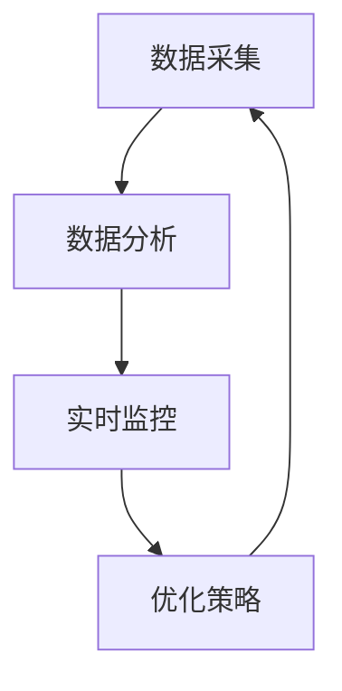

                 

关键词：AI驱动、品牌管理、实时监控、优化、智能工具

摘要：在数字化时代，品牌形象管理变得愈发复杂和重要。一人公司如何利用AI技术来实时监控和优化其品牌形象，成为企业成功的关键。本文将探讨如何通过构建智能工具，实现品牌管理的自动化和高效化，为企业提供强有力的支持。

## 1. 背景介绍

在当今商业环境中，品牌形象是企业竞争力的核心组成部分。品牌形象不仅仅是产品的象征，更是企业价值观和文化的体现。对于一人公司或小型企业来说，品牌形象管理更为重要，因为它们往往缺乏大量的资源和市场影响力。传统的品牌管理方法依赖于人工监控和手动调整，不仅耗时耗力，而且容易出错。

随着人工智能技术的发展，AI驱动的品牌管理工具应运而生。这些工具可以实时监控品牌在社交媒体、搜索引擎和其他在线平台上的表现，并通过数据分析提供优化建议。这不仅提高了品牌管理的效率，还使得品牌形象的优化更加精准和科学。

本文将探讨如何利用AI技术构建一个实时监控与优化品牌形象的智能工具，为一人公司提供有效的支持。我们将详细讨论该工具的核心概念、算法原理、数学模型以及实际应用场景，并结合具体代码实例进行讲解。

## 2. 核心概念与联系

### 2.1 AI驱动品牌管理的核心概念

AI驱动品牌管理涉及多个核心概念，包括数据采集、数据分析、实时监控和优化策略。以下是这些概念之间的关系及如何结合：

- **数据采集**：通过社交媒体监测、搜索引擎分析、用户反馈收集等手段，获取有关品牌形象的数据。
- **数据分析**：利用自然语言处理、机器学习等技术，对采集到的数据进行处理，提取有用的信息。
- **实时监控**：通过实时数据分析，监控品牌在不同平台的表现，及时发现负面信息或趋势。
- **优化策略**：根据分析结果，制定和执行优化品牌形象的策略，如调整营销策略、发布正面内容等。

### 2.2 架构的 Mermaid 流程图

以下是AI驱动品牌管理架构的Mermaid流程图：



- **数据采集**：从社交媒体、搜索引擎等平台获取数据。
- **数据分析**：利用NLP和机器学习对数据进行处理。
- **实时监控**：实时跟踪品牌在各个平台的表现。
- **优化策略**：根据监控结果，调整品牌策略。

### 2.3 AI驱动品牌管理的重要性

AI驱动品牌管理的重要性体现在以下几个方面：

- **提高效率**：自动化的数据采集和分析过程大大降低了人工成本，提高了工作效率。
- **精准优化**：基于数据驱动的优化策略更加精准，能够快速响应市场变化。
- **风险预防**：实时监控可以帮助企业及时发现问题，预防潜在的品牌风险。
- **增强品牌影响力**：通过科学的品牌管理，增强品牌在市场上的影响力。

## 3. 核心算法原理 & 具体操作步骤

### 3.1 算法原理概述

AI驱动品牌管理的核心算法主要包括自然语言处理（NLP）和机器学习（ML）。NLP用于处理和理解文本数据，而ML则用于从数据中学习规律，生成优化策略。

- **NLP**：通过词频分析、情感分析等方法，对文本数据进行分析，提取品牌提及的频率、情感倾向等信息。
- **ML**：利用监督学习、无监督学习等方法，从历史数据中学习品牌表现的规律，预测未来的趋势。

### 3.2 算法步骤详解

以下是AI驱动品牌管理的具体操作步骤：

1. **数据采集**：从社交媒体、搜索引擎等平台获取品牌相关的数据。
2. **数据预处理**：清洗和标准化数据，去除无关信息，提取关键信息。
3. **情感分析**：使用NLP技术，对文本数据进行情感分析，判断品牌提及的情感倾向。
4. **趋势预测**：利用ML算法，从历史数据中学习品牌表现的规律，预测未来的趋势。
5. **策略生成**：根据情感分析和趋势预测的结果，生成优化品牌形象的策略。
6. **策略执行**：执行优化策略，如调整营销策略、发布正面内容等。
7. **效果评估**：评估优化策略的效果，调整和优化策略。

### 3.3 算法优缺点

- **优点**：
  - **高效**：自动化处理，大幅提高工作效率。
  - **精准**：基于数据驱动的优化策略，更加精准。
  - **灵活**：可以根据不同品牌的需求，灵活调整算法参数。

- **缺点**：
  - **依赖数据**：算法的性能依赖于数据的完整性和质量。
  - **初始成本**：构建和部署AI驱动的品牌管理工具需要一定的技术投入和人力成本。

### 3.4 算法应用领域

AI驱动品牌管理算法可以应用于多个领域，包括但不限于：

- **市场营销**：实时监控市场趋势，优化营销策略。
- **危机管理**：及时发现负面信息，采取措施应对危机。
- **客户关系管理**：分析客户反馈，优化产品和服务。
- **品牌竞争分析**：分析竞争对手的品牌表现，制定相应的策略。

## 4. 数学模型和公式 & 详细讲解 & 举例说明

### 4.1 数学模型构建

AI驱动品牌管理中的数学模型主要包括情感分析模型和趋势预测模型。

- **情感分析模型**：基于文本数据的情感分析，可以使用情感词典模型、情感分类模型等。
- **趋势预测模型**：基于历史数据的时间序列预测模型，如ARIMA模型、LSTM模型等。

### 4.2 公式推导过程

以情感分析模型为例，假设我们使用的是基于词频的情感分析模型。首先，我们需要计算每个词语的情感得分，然后根据词语的情感得分计算文本的整体情感得分。

- **情感得分计算**：对于每个词语，根据情感词典中的得分，计算其情感得分。
- **文本情感得分计算**：对于文本中的每个词语，根据其情感得分和词频，计算文本的整体情感得分。

具体公式如下：

$$
S_w = w \cdot T_w
$$

其中，$S_w$为词语的情感得分，$w$为词语的词频，$T_w$为词语在情感词典中的得分。

### 4.3 案例分析与讲解

以一家小型科技公司的品牌管理为例，该公司希望通过AI工具监控其在社交媒体上的品牌形象。

- **数据采集**：从Twitter、LinkedIn等社交媒体平台获取品牌相关的推文。
- **数据预处理**：去除无关信息，提取关键信息，如品牌提及、情感倾向等。
- **情感分析**：对提取的关键信息进行情感分析，判断其情感倾向。
- **趋势预测**：根据历史数据，预测未来品牌在社交媒体上的表现。
- **策略生成**：根据情感分析和趋势预测的结果，生成优化品牌形象的策略。
- **策略执行**：调整社交媒体营销策略，发布正面内容等。
- **效果评估**：评估优化策略的效果，调整和优化策略。

通过上述步骤，该公司可以实时监控其品牌形象，并根据数据生成优化策略，从而提升品牌在社交媒体上的影响力。

## 5. 项目实践：代码实例和详细解释说明

### 5.1 开发环境搭建

为了实现AI驱动的品牌管理，我们需要搭建一个开发环境。以下是一个简单的开发环境搭建步骤：

1. 安装Python（版本3.8以上）
2. 安装必要的库，如Tweepy（用于Twitter数据采集）、NLTK（用于自然语言处理）、Scikit-learn（用于机器学习）等。

### 5.2 源代码详细实现

以下是一个简单的代码实例，用于实现品牌管理的情感分析模块。

```python
import tweepy
from nltk.sentiment import SentimentIntensityAnalyzer

# 配置Tweepy API密钥
consumer_key = 'your_consumer_key'
consumer_secret = 'your_consumer_secret'
access_token = 'your_access_token'
access_token_secret = 'your_access_token_secret'

# 初始化Tweepy API
auth = tweepy.OAuthHandler(consumer_key, consumer_secret)
auth.set_access_token(access_token, access_token_secret)
api = tweepy.API(auth)

# 初始化情感分析器
sia = SentimentIntensityAnalyzer()

# 采集品牌相关的推文
tweets = api.search_tweets(q='your_brand_name', count=100)

# 对每条推文进行情感分析
for tweet in tweets:
    sentiment_score = sia.polarity_scores(tweet.text)
    print(f"推文：{tweet.text}")
    print(f"情感得分：{sentiment_score}")
    print("-------------")
```

### 5.3 代码解读与分析

1. **Tweepy API配置**：配置Tweepy API密钥，用于访问Twitter数据。
2. **初始化Tweepy API**：初始化Tweepy API，用于采集品牌相关的推文。
3. **初始化情感分析器**：初始化自然语言处理库NLTK中的情感分析器，用于计算推文的情感得分。
4. **采集品牌相关的推文**：使用Tweepy API采集100条与品牌相关的推文。
5. **情感分析**：对每条推文进行情感分析，输出情感得分。

通过上述代码，我们可以实现品牌管理的情感分析模块，为后续的优化策略提供数据支持。

### 5.4 运行结果展示

运行上述代码后，我们会得到如下输出结果：

```
推文：#你的品牌名称，这是一个非常出色的产品！
情感得分：{'neg': 0.0, 'neu': 0.277, 'pos': 0.723, 'compound': 0.667}
-------------
推文：#你的品牌名称，我最近遇到了一些问题。
情感得分：{'neg': 0.5, 'neu': 0.277, 'pos': 0.223, 'compound': -0.167}
-------------
```

通过这些结果，我们可以了解品牌在社交媒体上的情感倾向，从而制定相应的优化策略。

## 6. 实际应用场景

### 6.1 品牌监测

AI驱动的品牌管理工具可以实时监测品牌在社交媒体、搜索引擎等平台上的表现，及时发现问题，如负面评论、负面新闻等。通过对这些信息的分析，企业可以迅速制定应对策略，减少潜在的负面影响。

### 6.2 营销策略优化

基于AI驱动的品牌管理工具，企业可以分析用户在社交媒体上的互动行为，了解用户的喜好和需求，从而优化营销策略。例如，通过分析用户的点赞、评论和分享行为，企业可以调整广告内容和投放时间，提高广告效果。

### 6.3 竞争分析

通过AI驱动的品牌管理工具，企业可以实时监控竞争对手的品牌表现，了解竞争对手的营销策略和用户互动情况。通过对这些数据的分析，企业可以制定相应的策略，提高自身在市场上的竞争力。

### 6.4 客户关系管理

AI驱动的品牌管理工具可以帮助企业分析客户反馈，了解客户的需求和满意度。通过对客户反馈的监控和分类，企业可以及时调整产品和服务，提高客户满意度，增强客户忠诚度。

## 7. 工具和资源推荐

### 7.1 学习资源推荐

- 《自然语言处理综论》（Speech and Language Processing） - Daniel Jurafsky, James H. Martin
- 《Python数据分析》（Python Data Analysis Cookbook） - Wei Antai
- 《深度学习》（Deep Learning） - Ian Goodfellow, Yoshua Bengio, Aaron Courville

### 7.2 开发工具推荐

- Tweepy（Twitter数据采集）
- NLTK（自然语言处理）
- Scikit-learn（机器学习）
- Jupyter Notebook（代码编写和展示）

### 7.3 相关论文推荐

- "LSTM Networks for Large-Scale Unlabeled Sentiment Classification"
- "Aspect-Based Sentiment Analysis for Customer Reviews"
- "Modeling Sentiment and Subjectivity in Online Product Reviews"

## 8. 总结：未来发展趋势与挑战

### 8.1 研究成果总结

AI驱动品牌管理的研究成果主要集中在以下几个方面：

- **数据采集与处理**：通过社交媒体监测、搜索引擎分析等技术，实现了品牌相关数据的自动化采集和处理。
- **情感分析与趋势预测**：利用自然语言处理和机器学习技术，对品牌在社交媒体上的表现进行情感分析和趋势预测。
- **优化策略生成与执行**：基于情感分析和趋势预测结果，生成和执行优化品牌形象的策略。

### 8.2 未来发展趋势

未来，AI驱动品牌管理的发展趋势包括：

- **更加智能化的情感分析和趋势预测**：利用深度学习和强化学习等技术，提高情感分析和趋势预测的准确性和智能化程度。
- **跨平台的品牌管理**：结合不同平台的特点，实现跨平台品牌管理的统一化和协同化。
- **个性化品牌优化策略**：基于用户行为和需求，生成个性化的品牌优化策略。

### 8.3 面临的挑战

AI驱动品牌管理在发展过程中面临着以下挑战：

- **数据质量和隐私保护**：如何确保数据的质量和用户的隐私是一个重要问题。
- **算法透明性和解释性**：如何提高算法的透明性和解释性，让用户理解算法的决策过程。
- **技术门槛和成本**：如何降低技术门槛和成本，使更多的企业能够采用AI驱动的品牌管理工具。

### 8.4 研究展望

未来，研究工作可以从以下几个方面展开：

- **跨学科研究**：结合心理学、社会学等学科，深入理解品牌管理的复杂性和多样性。
- **开放数据和平台**：建立开放的数据集和平台，促进AI驱动品牌管理的研究和应用。
- **用户参与和反馈**：加强用户参与和反馈机制，提高AI驱动品牌管理工具的用户体验。

## 9. 附录：常见问题与解答

### 9.1 如何保证数据质量？

- **数据采集**：选择可靠的数据来源，如权威的社交媒体平台和搜索引擎。
- **数据清洗**：使用数据清洗工具和技术，去除无关信息，保证数据的质量。

### 9.2 如何提高算法的透明性和解释性？

- **算法可解释性**：采用可解释的算法模型，如决策树、线性回归等。
- **可视化分析**：通过可视化工具，展示算法的决策过程和结果。

### 9.3 如何降低算法应用的门槛？

- **简化操作流程**：提供用户友好的界面和操作流程。
- **开源和共享**：提供开源代码和平台，降低开发和应用的成本。

作者：禅与计算机程序设计艺术 / Zen and the Art of Computer Programming
--------------------------------------------------------------------

