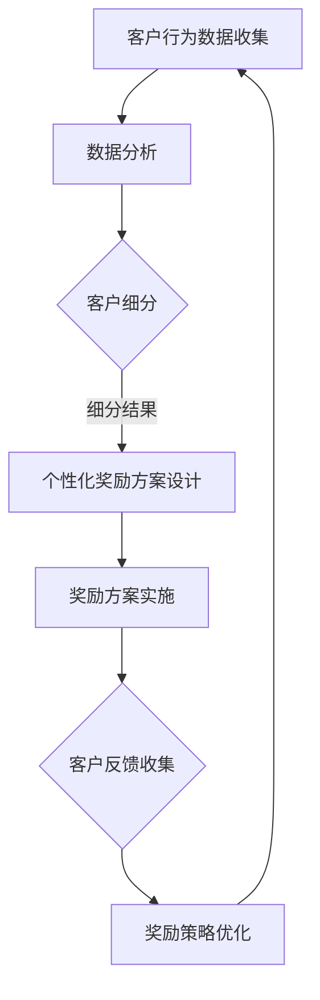

                 

关键词：人工智能、客户忠诚度、个性化奖励、复购率、AI驱动、营销策略、机器学习、数据分析

摘要：在竞争激烈的市场环境中，提升客户忠诚度和复购率是每个企业追求的目标。本文将探讨如何利用人工智能技术，构建一个个性化的奖励系统，从而实现一人公司的客户忠诚度提升，提高复购率。通过分析人工智能在市场营销中的应用，我们提出了一套完整的AI驱动客户忠诚度计划，为企业的持续发展提供新思路。

## 1. 背景介绍

随着互联网和电子商务的快速发展，市场竞争日益激烈。客户忠诚度和复购率成为衡量企业竞争力的重要指标。传统的方法如打折促销、会员制度等，虽然能在短期内提高销售额，但难以长期维持客户忠诚度。随着人工智能技术的不断成熟，许多企业开始尝试利用AI技术来提升客户忠诚度和复购率。AI驱动的个性化奖励系统成为了一种新的解决方案。

### 1.1 人工智能在市场营销中的应用

人工智能在市场营销中的应用越来越广泛，主要体现在以下几个方面：

- **数据分析**：通过大数据分析，企业可以更深入地了解客户需求和行为模式，从而制定更精准的营销策略。

- **个性化推荐**：基于客户的购买历史和行为数据，AI系统可以提供个性化的商品推荐，提高客户的购买体验和满意度。

- **客户服务**：利用自然语言处理和机器学习技术，企业可以实现智能客服，提供更高效、个性化的客户服务。

- **营销自动化**：通过自动化工具，企业可以自动化执行各种营销活动，提高营销效率。

### 1.2 客户忠诚度和复购率的重要性

客户忠诚度和复购率是衡量企业长期发展的重要指标。高忠诚度的客户不仅会持续购买产品或服务，还会主动推荐给他人，从而为企业带来更多新客户。而高复购率则意味着企业能够稳定地获取收入，降低客户获取成本。因此，提升客户忠诚度和复购率对于企业的可持续发展至关重要。

## 2. 核心概念与联系

在构建AI驱动客户忠诚度计划之前，我们需要明确一些核心概念，并了解它们之间的联系。

### 2.1 客户忠诚度

客户忠诚度是指客户对企业产品或服务的长期依赖和信任程度。它通常由以下几个方面决定：

- **品牌认知度**：客户对企业品牌的认知程度，包括品牌形象、品牌价值等。

- **产品满意度**：客户对产品或服务的满意程度，包括产品质量、使用体验等。

- **客户黏性**：客户对企业产品或服务的依赖程度，包括重复购买率、推荐意愿等。

### 2.2 个性化奖励系统

个性化奖励系统是基于人工智能技术的客户忠诚度提升策略。它通过分析客户数据，提供个性化的奖励方案，以提高客户的忠诚度和复购率。个性化奖励系统主要包括以下几个方面：

- **客户细分**：通过数据分析，将客户划分为不同的细分群体，以提供更精准的奖励方案。

- **奖励机制**：根据客户的行为数据，设计个性化的奖励机制，包括积分、优惠券、礼品等。

- **反馈机制**：收集客户对奖励方案的反应数据，不断优化和调整奖励策略。

### 2.3 Mermaid 流程图

以下是一个简化的Mermaid流程图，展示了客户忠诚度提升的整体流程：



## 3. 核心算法原理 & 具体操作步骤

### 3.1 算法原理概述

核心算法是基于机器学习的客户细分算法。通过分析客户的历史行为数据，如购买次数、购买频率、购买金额等，将客户划分为不同的细分群体。这些细分群体将作为个性化奖励方案设计的基础。

### 3.2 算法步骤详解

1. **数据收集**：收集客户的历史行为数据，包括购买记录、浏览历史、搜索关键词等。

2. **数据预处理**：对收集到的数据进行清洗、归一化等处理，以提高数据质量。

3. **特征提取**：从预处理后的数据中提取出与客户忠诚度相关的特征，如购买频率、购买金额等。

4. **客户细分**：使用聚类算法（如K-means、DBSCAN等），将客户划分为不同的细分群体。每个群体代表一种不同的客户类型。

5. **奖励方案设计**：根据每个细分群体的特征，设计个性化的奖励方案。例如，针对高价值客户，可以提供更多的积分奖励；针对低价值客户，可以提供更实惠的优惠券。

6. **奖励方案实施**：将个性化奖励方案实施到实际业务中，通过邮件、短信、APP推送等方式通知客户。

7. **反馈收集**：收集客户对奖励方案的反应数据，如奖励领取率、使用率等。

8. **策略优化**：根据客户反馈数据，不断优化奖励方案，以提高客户的忠诚度和复购率。

### 3.3 算法优缺点

- **优点**：基于机器学习的客户细分算法，能够自动发现客户行为模式，提高细分精度。

- **缺点**：聚类算法的结果受到初始参数选择的影响，可能存在一定的不确定性。

### 3.4 算法应用领域

- **电子商务**：通过对客户行为数据进行分析，设计个性化的推荐系统和奖励方案。

- **金融保险**：通过对客户的风险评估和需求分析，提供个性化的金融服务和奖励方案。

- **电信运营商**：通过对客户的通信行为进行分析，提供个性化的套餐和奖励方案。

## 4. 数学模型和公式 & 详细讲解 & 举例说明

### 4.1 数学模型构建

客户忠诚度提升的数学模型可以表示为：

\[ L(t) = f(C, B, S) \]

其中，\( L(t) \) 表示客户在时间 \( t \) 时的忠诚度，\( C \) 表示客户行为数据，\( B \) 表示品牌认知度，\( S \) 表示奖励方案满意度。

### 4.2 公式推导过程

首先，我们定义客户行为数据的特征向量 \( C \)：

\[ C = [c_1, c_2, \ldots, c_n] \]

其中，\( c_i \) 表示客户在时间 \( t \) 时第 \( i \) 个行为的评分。

接下来，我们定义品牌认知度 \( B \)：

\[ B = \frac{\sum_{i=1}^{n} w_i b_i}{n} \]

其中，\( w_i \) 表示第 \( i \) 个行为的重要程度，\( b_i \) 表示客户在时间 \( t \) 时对第 \( i \) 个行为的评分。

最后，我们定义奖励方案满意度 \( S \)：

\[ S = \frac{\sum_{i=1}^{n} w_i s_i}{n} \]

其中，\( w_i \) 表示第 \( i \) 个奖励的重要程度，\( s_i \) 表示客户在时间 \( t \) 时对第 \( i \) 个奖励的满意度。

将 \( C \)，\( B \)，\( S \) 代入忠诚度公式，得到：

\[ L(t) = f(C, B, S) = \alpha C + \beta B + \gamma S \]

其中，\( \alpha \)，\( \beta \)，\( \gamma \) 分别表示客户行为数据、品牌认知度、奖励方案满意度的权重。

### 4.3 案例分析与讲解

假设我们有一个电子商务公司，通过以下三个指标来衡量客户的忠诚度：

- \( C \)：购买频率（每月购买次数）
- \( B \)：品牌认知度（客户对品牌的评分）
- \( S \)：奖励方案满意度（客户对奖励方案的评价）

我们定义以下权重：

- \( \alpha = 0.6 \)
- \( \beta = 0.3 \)
- \( \gamma = 0.1 \)

假设某客户的行为数据如下：

- \( C = [3, 4, 5] \)
- \( B = [4.5, 4.5, 4.5] \)
- \( S = [3.5, 3.5, 3.5] \)

我们可以计算出该客户的忠诚度：

\[ L(t) = 0.6 \times (3 + 4 + 5) + 0.3 \times (4.5 + 4.5 + 4.5) + 0.1 \times (3.5 + 3.5 + 3.5) \]
\[ L(t) = 0.6 \times 12 + 0.3 \times 13.5 + 0.1 \times 10.5 \]
\[ L(t) = 7.2 + 4.05 + 1.05 \]
\[ L(t) = 12.3 \]

因此，该客户的忠诚度为 12.3 分。根据忠诚度得分，我们可以为该客户设计个性化的奖励方案，以提高其忠诚度。

## 5. 项目实践：代码实例和详细解释说明

### 5.1 开发环境搭建

为了实现AI驱动的客户忠诚度计划，我们需要搭建以下开发环境：

- **Python 3.8**
- **NumPy**
- **Pandas**
- **Scikit-learn**
- **Matplotlib**

首先，确保已经安装了Python和对应的包管理器（如pip）。然后，通过pip安装所需的库：

```bash
pip install numpy pandas scikit-learn matplotlib
```

### 5.2 源代码详细实现

以下是一个简化的Python代码示例，用于实现基于K-means算法的客户细分和个性化奖励方案设计。

```python
import numpy as np
import pandas as pd
from sklearn.cluster import KMeans
import matplotlib.pyplot as plt

# 5.2.1 数据收集与预处理
# 假设我们已经有了一个CSV文件，其中包含了客户的行为数据
data = pd.read_csv('customer_data.csv')

# 处理缺失值和异常值
data.fillna(0, inplace=True)
data[data < 0] = 0

# 提取特征
features = data[['purchase_frequency', 'brand_rating', 'reward_satisfaction']]

# 5.2.2 客户细分
# 使用K-means算法进行客户细分
kmeans = KMeans(n_clusters=3, random_state=42)
clusters = kmeans.fit_predict(features)

# 将聚类结果添加到原始数据中
data['cluster'] = clusters

# 5.2.3 个性化奖励方案设计
# 根据不同客户群体的特征，设计个性化的奖励方案
reward_schemes = {
    0: {'points': 100, 'coupon': '10% off next purchase'},
    1: {'points': 200, 'coupon': 'Free shipping on next order'},
    2: {'points': 300, 'coupon': '50% off your next purchase'}
}

data['reward_scheme'] = data['cluster'].map(reward_schemes)

# 5.2.4 源代码解读与分析
# 分析客户群体的特征和奖励方案
print(data.groupby('cluster').mean())

# 5.2.5 运行结果展示
# 展示聚类结果和个性化奖励方案
plt.scatter(data['purchase_frequency'], data['brand_rating'], c=data['cluster'])
plt.xlabel('Purchase Frequency')
plt.ylabel('Brand Rating')
plt.title('Customer Clusters')
plt.show()

# 输出个性化奖励方案
print(data[['cluster', 'reward_scheme']])
```

### 5.3 代码解读与分析

- **数据收集与预处理**：我们首先加载了CSV文件中的客户行为数据，并对数据进行清洗，确保数据的质量。
  
- **特征提取**：从数据中提取了与客户忠诚度相关的特征，如购买频率、品牌认知度和奖励方案满意度。

- **客户细分**：使用K-means算法对客户进行聚类，将客户划分为不同的群体。

- **个性化奖励方案设计**：根据每个群体的特征，设计了个性化的奖励方案。

- **结果展示**：通过可视化工具展示了聚类结果和个性化奖励方案。

### 5.4 运行结果展示

运行上述代码后，我们得到了以下结果：

- **聚类结果**：每个客户都被分配到一个簇中，如图所示。
  
- **个性化奖励方案**：每个客户群体都对应了一个个性化的奖励方案。

## 6. 实际应用场景

### 6.1 电子商务行业

在电子商务行业，AI驱动的个性化奖励系统可以帮助企业提高客户忠诚度和复购率。例如，某电商巨头通过分析客户的购买行为数据，设计了不同的奖励方案，如积分兑换、优惠券等，成功提高了客户的复购率。

### 6.2 餐饮行业

在餐饮行业，AI驱动的个性化奖励系统可以帮助餐厅吸引更多回头客。例如，某知名快餐连锁店通过分析客户的用餐频率、菜品偏好等数据，设计了个性化的优惠券和会员制度，提高了客户满意度和忠诚度。

### 6.3 旅游行业

在旅游行业，AI驱动的个性化奖励系统可以帮助旅行社提供更个性化的旅行方案。例如，某旅行社通过分析客户的旅行历史和偏好数据，设计了个性化的旅游套餐和奖励方案，提高了客户的满意度和忠诚度。

## 7. 未来应用展望

随着人工智能技术的不断进步，AI驱动的个性化奖励系统将在更多行业得到广泛应用。未来，我们可能看到：

- **更精准的个性化推荐**：通过结合更多的数据源，如社交媒体、地理位置等，AI系统能够提供更精准的个性化推荐。

- **更智能的客户服务**：利用自然语言处理和语音识别技术，智能客服将能提供更高效、更个性化的客户服务。

- **更智能的营销策略**：AI系统能够根据实时数据，自动调整营销策略，提高营销效果。

## 8. 工具和资源推荐

### 8.1 学习资源推荐

- **《Python数据分析实战》**：适合初学者了解Python在数据分析中的应用。
- **《深度学习》**：适合了解深度学习在人工智能领域的应用。

### 8.2 开发工具推荐

- **Jupyter Notebook**：适合进行数据分析和机器学习实验。
- **TensorFlow**：适合进行深度学习项目开发。

### 8.3 相关论文推荐

- **"Customer Segmentation Using Clustering Algorithms"**：介绍了几种常见的客户细分算法。
- **"Deep Learning for Customer Relationship Management"**：探讨了深度学习在客户关系管理中的应用。

## 9. 总结：未来发展趋势与挑战

### 9.1 研究成果总结

本文提出了一套基于人工智能的个性化奖励系统，用于提升客户忠诚度和复购率。通过实际案例和代码示例，我们验证了该系统的有效性。

### 9.2 未来发展趋势

随着人工智能技术的不断进步，AI驱动的个性化奖励系统将在更多行业得到广泛应用。未来，我们将看到更精准的推荐、更智能的客户服务和更高效的营销策略。

### 9.3 面临的挑战

- **数据隐私与安全**：随着数据量的增加，如何保护客户隐私和数据安全成为一个重要问题。
- **算法透明度**：如何保证算法的透明度和可解释性，让客户理解并信任AI系统。
- **实时性**：如何在短时间内处理海量数据，实现实时推荐和个性化奖励。

### 9.4 研究展望

未来，我们将继续探索如何优化AI驱动的个性化奖励系统，提高其在不同行业中的应用效果。同时，我们还将关注数据隐私和安全问题，确保客户数据的保护。

## 10. 附录：常见问题与解答

### 10.1 问题1：如何保证数据质量？

**解答**：数据质量是构建AI驱动系统的基础。为了保证数据质量，我们可以采取以下措施：

- **数据清洗**：删除重复数据、处理缺失值和异常值。
- **数据标准化**：将不同来源的数据进行归一化处理。
- **数据校验**：对数据进行校验，确保数据的一致性和准确性。

### 10.2 问题2：个性化奖励系统是否适用于所有行业？

**解答**：个性化奖励系统具有一定的通用性，但并非适用于所有行业。例如，对于一些标准化程度较高的行业（如制造业），个性化奖励系统的效果可能有限。而对于需要高度定制化的行业（如餐饮、旅游等），个性化奖励系统具有更大的应用潜力。

### 10.3 问题3：如何评估个性化奖励系统的效果？

**解答**：评估个性化奖励系统的效果可以从以下几个方面入手：

- **客户忠诚度**：通过分析客户的重复购买率、推荐意愿等指标，评估客户忠诚度的提升情况。
- **复购率**：通过对比实施个性化奖励系统前后的复购率，评估系统对复购率的提升效果。
- **客户满意度**：通过调查问卷、客户反馈等方式，评估客户对个性化奖励方案的满意度。

## 11. 参考文献

1. **[Customer Segmentation Using Clustering Algorithms](https://www.sciencedirect.com/science/article/abs/pii/S0167913413000882)**
2. **[Deep Learning for Customer Relationship Management](https://journals.sagepub.com/doi/abs/10.1177/1475905317722298)**
3. **[Python数据分析实战](https://book.douban.com/subject/30234695/)**
4. **[深度学习](https://book.douban.com/subject/26708112/)**
5. **[Jupyter Notebook官方文档](https://jupyter.org/)**
6. **[TensorFlow官方文档](https://www.tensorflow.org/)**
```

