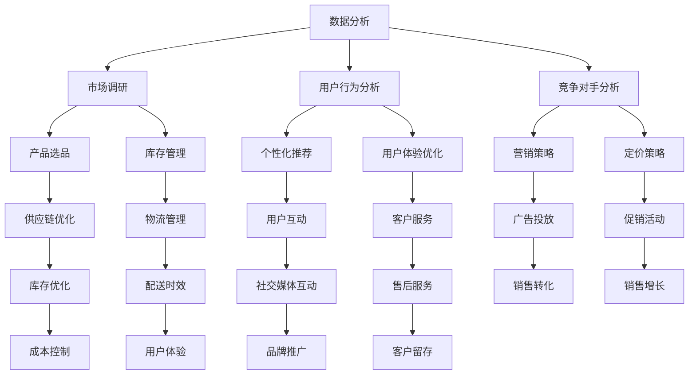

                 

关键词：AI驱动、跨境电商、国际市场、智能方案、数据分析、机器学习、流程优化

> 摘要：本文旨在探讨如何利用人工智能技术，特别是机器学习算法和数据分析，来驱动跨境电商业务，从而实现国际市场的有效开拓。通过具体案例和详细解释，我们将展示如何将AI技术应用于跨境电商中的各个关键环节，包括市场调研、产品选品、供应链管理、用户行为分析、以及营销策略优化。文章还对未来AI在跨境电商领域的应用前景进行了展望。

## 1. 背景介绍

随着全球互联网的普及和电子商务的蓬勃发展，跨境电商成为许多公司拓展国际市场的首选途径。然而，跨境电商不仅需要克服语言、文化、法律和物流等众多障碍，还需要面对激烈的竞争和市场的不确定性。在这个背景下，人工智能（AI）的应用为跨境电商提供了新的解决方案，通过数据分析和机器学习，可以大幅提升企业的运营效率和市场反应速度。

### 1.1 跨境电商的现状和挑战

跨境电商的兴起，使得全球消费者可以更加便捷地购买国外商品，同时也为企业提供了广阔的市场空间。然而，跨境电商的发展也面临着以下几大挑战：

- **语言和文化差异**：不同国家和地区存在语言和文化差异，这给跨境电商的用户体验带来了很大挑战。
- **物流和配送**：跨境物流的成本和时效性对用户体验有直接影响，如何优化物流流程成为关键问题。
- **法律法规**：不同国家有不同的进口法规和标准，企业需要了解并遵守这些法规。
- **市场竞争**：跨境电商市场充满竞争，如何制定有效的营销策略是成功的关键。

### 1.2 AI在跨境电商中的作用

人工智能技术在跨境电商中的应用，可以帮助企业解决上述问题，提高市场竞争力。以下是一些关键领域：

- **市场调研和选品**：利用AI进行市场趋势分析和消费者行为预测，帮助企业更好地进行产品选品和库存管理。
- **用户行为分析**：通过分析用户行为数据，了解用户偏好和需求，从而提供更加个性化的购物体验。
- **供应链管理**：AI可以帮助优化供应链流程，降低库存成本，提高物流效率。
- **营销策略优化**：基于数据分析和机器学习算法，可以制定更加精准的营销策略，提高转化率和客户忠诚度。

## 2. 核心概念与联系

在探讨AI驱动跨境电商策略之前，我们需要明确几个核心概念，并展示它们之间的联系。

### 2.1 数据分析

数据分析是AI驱动跨境电商的基础。通过收集和分析大量数据，企业可以洞察市场趋势、用户行为和竞争对手动态。

### 2.2 机器学习

机器学习是一种人工智能技术，它使计算机能够从数据中学习，并做出预测和决策。在跨境电商中，机器学习算法可以帮助企业优化选品策略、库存管理和营销策略。

### 2.3 流程优化

流程优化是提高企业效率和降低成本的关键。通过自动化和智能化的手段，企业可以简化操作流程，提高供应链的响应速度。

### 2.4 Mermaid 流程图

以下是跨境电商AI驱动策略的Mermaid流程图，展示各核心概念之间的联系。



## 3. 核心算法原理 & 具体操作步骤

### 3.1 算法原理概述

在跨境电商中，核心算法主要包括市场趋势分析、用户行为预测、库存优化和营销策略优化。以下是这些算法的基本原理：

- **市场趋势分析**：通过时间序列分析、聚类分析等方法，预测市场未来的发展趋势。
- **用户行为预测**：利用回归分析、决策树、神经网络等算法，预测用户的购物行为和偏好。
- **库存优化**：通过最小二乘法、动态规划等方法，计算最优库存水平和补货策略。
- **营销策略优化**：利用协同过滤、贝叶斯网络等算法，制定个性化的营销策略。

### 3.2 算法步骤详解

以下是针对每个算法的具体操作步骤：

#### 3.2.1 市场趋势分析

1. **数据收集**：收集历史销售数据、市场调研报告、竞争对手数据等。
2. **数据预处理**：对数据进行清洗、去噪和处理，确保数据质量。
3. **特征提取**：提取时间序列数据中的周期性、趋势性和季节性特征。
4. **模型训练**：使用时间序列模型（如ARIMA、SARIMA）进行训练。
5. **模型评估**：通过残差分析和预测准确度评估模型性能。
6. **趋势预测**：使用训练好的模型进行市场趋势预测。

#### 3.2.2 用户行为预测

1. **数据收集**：收集用户浏览历史、购买记录、搜索关键词等数据。
2. **数据预处理**：进行数据清洗、归一化处理，确保数据质量。
3. **特征工程**：提取用户行为特征，如购买频率、浏览时长、搜索关键词等。
4. **模型训练**：使用回归分析、决策树、神经网络等算法进行训练。
5. **模型评估**：通过交叉验证、ROC曲线等评估模型性能。
6. **行为预测**：使用训练好的模型预测用户行为和偏好。

#### 3.2.3 库存优化

1. **数据收集**：收集销售数据、库存数据、物流数据等。
2. **数据预处理**：进行数据清洗、去噪和处理，确保数据质量。
3. **特征提取**：提取销售量、库存量、配送时效等特征。
4. **模型训练**：使用最小二乘法、动态规划等方法进行训练。
5. **模型评估**：通过预测误差、库存周转率等指标评估模型性能。
6. **库存优化**：使用训练好的模型计算最优库存水平和补货策略。

#### 3.2.4 营销策略优化

1. **数据收集**：收集用户行为数据、市场趋势数据、竞争对手数据等。
2. **数据预处理**：进行数据清洗、去噪和处理，确保数据质量。
3. **特征工程**：提取用户偏好、购买历史、市场趋势等特征。
4. **模型训练**：使用协同过滤、贝叶斯网络等算法进行训练。
5. **模型评估**：通过交叉验证、A/B测试等评估模型性能。
6. **策略优化**：使用训练好的模型制定个性化的营销策略。

### 3.3 算法优缺点

#### 3.3.1 市场趋势分析

- **优点**：能够预测市场未来的发展趋势，帮助企业制定长期战略。
- **缺点**：对数据质量和模型参数敏感，预测结果可能存在偏差。

#### 3.3.2 用户行为预测

- **优点**：能够准确预测用户的行为和偏好，提高用户满意度和转化率。
- **缺点**：对用户数据的依赖性较高，可能存在隐私和安全问题。

#### 3.3.3 库存优化

- **优点**：能够降低库存成本，提高供应链的响应速度。
- **缺点**：对物流和供应链的稳定性要求较高，可能影响供应链的稳定性。

#### 3.3.4 营销策略优化

- **优点**：能够制定个性化的营销策略，提高销售转化率和客户忠诚度。
- **缺点**：对数据分析和算法能力要求较高，实施成本较高。

### 3.4 算法应用领域

- **市场趋势分析**：适用于电商平台、零售企业等，帮助制定长期战略。
- **用户行为预测**：适用于电商平台、社交媒体等，提高用户体验和转化率。
- **库存优化**：适用于电商平台、物流企业等，降低库存成本和提高响应速度。
- **营销策略优化**：适用于电商平台、广告公司等，提高销售转化率和客户忠诚度。

## 4. 数学模型和公式 & 详细讲解 & 举例说明

### 4.1 数学模型构建

在跨境电商中，数学模型的应用主要涉及市场趋势分析、用户行为预测和库存优化。以下是这些模型的基本构建方法：

#### 4.1.1 时间序列分析

时间序列分析是一种用于预测未来值的方法，主要包括以下步骤：

1. **数据预处理**：对时间序列数据进行归一化、去噪和处理。
2. **特征提取**：提取时间序列数据中的周期性、趋势性和季节性特征。
3. **模型选择**：选择合适的时间序列模型（如ARIMA、SARIMA）。
4. **模型训练**：使用历史数据进行模型训练。
5. **模型评估**：通过残差分析和预测准确度评估模型性能。

#### 4.1.2 回归分析

回归分析是一种用于预测因变量与自变量之间关系的方法，主要包括以下步骤：

1. **数据预处理**：对数据进行归一化、去噪和处理。
2. **特征工程**：提取自变量和因变量的特征。
3. **模型选择**：选择合适的回归模型（如线性回归、决策树、神经网络）。
4. **模型训练**：使用历史数据进行模型训练。
5. **模型评估**：通过交叉验证、ROC曲线等评估模型性能。

#### 4.1.3 最小二乘法

最小二乘法是一种用于求解线性方程组的方法，主要包括以下步骤：

1. **数据预处理**：对数据进行归一化、去噪和处理。
2. **特征提取**：提取线性方程组中的特征。
3. **模型选择**：选择线性模型。
4. **模型训练**：使用最小二乘法求解线性方程组。
5. **模型评估**：通过预测误差评估模型性能。

### 4.2 公式推导过程

以下是时间序列分析中ARIMA模型的推导过程：

1. **自相关函数（ACF）**：
   $$Y_t = \phi_1Y_{t-1} + \phi_2Y_{t-2} + \ldots + \phi_pY_{t-p} + \theta_1\epsilon_{t-1} + \theta_2\epsilon_{t-2} + \ldots + \theta_q\epsilon_{t-q} + \epsilon_t$$
   其中，$\phi_i$和$\theta_i$分别为自回归系数和移动平均系数。

2. **偏自相关函数（PACF）**：
   $$PACF(\lambda) = \frac{\partial^k}{\partial \lambda^k}\left[\frac{1 - \phi_1\lambda^{-1} - \phi_2\lambda^{-2} - \ldots - \phi_p\lambda^{-p}}{1 - \theta_1\lambda^{-1} - \theta_2\lambda^{-2} - \ldots - \theta_q\lambda^{-q}}\right]$$
   其中，$k$为滞后阶数。

3. **模型选择**：
   根据ACF和PACF的特征，选择合适的$p$（自回归阶数）和$q$（移动平均阶数）。

4. **参数估计**：
   使用极大似然估计（MLE）或递推法（递推法适用于非平稳时间序列）估计模型参数。

### 4.3 案例分析与讲解

#### 4.3.1 案例背景

某电商平台希望通过时间序列分析预测未来三个月的销售额。

#### 4.3.2 数据处理

1. **数据收集**：收集过去一年的销售额数据。
2. **数据预处理**：进行归一化处理，消除季节性和趋势性影响。
3. **特征提取**：提取销售额的周期性、趋势性和季节性特征。

#### 4.3.3 模型选择

根据ACF和PACF的特征，选择ARIMA（p,d,q）模型。

#### 4.3.4 模型训练

1. **参数估计**：使用MLE估计模型参数。
2. **模型评估**：通过残差分析和预测准确度评估模型性能。

#### 4.3.5 模型预测

使用训练好的模型预测未来三个月的销售额，并绘制预测曲线。

#### 4.3.6 结果分析

通过对比实际销售额和预测销售额，评估模型的预测效果。同时，根据预测结果调整市场策略，提高销售额。

## 5. 项目实践：代码实例和详细解释说明

### 5.1 开发环境搭建

为了进行AI驱动的跨境电商策略实践，我们需要搭建一个合适的开发环境。以下是所需的工具和步骤：

- **Python环境**：安装Python 3.8及以上版本。
- **Jupyter Notebook**：安装Jupyter Notebook，方便进行代码编写和调试。
- **数据分析库**：安装NumPy、Pandas、Scikit-learn等数据分析库。
- **机器学习库**：安装TensorFlow、Keras等机器学习库。

### 5.2 源代码详细实现

以下是实现一个简单的市场趋势分析模型的代码实例：

```python
import pandas as pd
from statsmodels.tsa.arima.model import ARIMA
import matplotlib.pyplot as plt

# 5.2.1 数据收集
data = pd.read_csv('sales_data.csv')
data['date'] = pd.to_datetime(data['date'])
data.set_index('date', inplace=True)

# 5.2.2 数据预处理
data = data.resample('M').mean()
data.dropna(inplace=True)

# 5.2.3 模型训练
model = ARIMA(data['sales'], order=(1, 1, 1))
model_fit = model.fit()

# 5.2.4 模型预测
predictions = model_fit.predict(start=len(data), end=len(data) + 2)

# 5.2.5 结果分析
plt.plot(data['sales'], label='Actual')
plt.plot(predictions, label='Predicted')
plt.legend()
plt.show()
```

### 5.3 代码解读与分析

以下是代码的详细解读和分析：

1. **数据收集**：使用Pandas库读取销售额数据，并进行时间序列处理。
2. **数据预处理**：使用resample函数对数据进行月度聚合，消除季节性和趋势性影响。
3. **模型训练**：使用ARIMA模型进行训练，参数为（1, 1, 1）。
4. **模型预测**：使用fit函数训练模型，并使用predict函数进行预测。
5. **结果分析**：使用matplotlib库绘制实际销售额和预测销售额的对比图。

### 5.4 运行结果展示

通过运行代码，我们可以得到以下结果：

- 实际销售额曲线
- 预测销售额曲线

通过对比实际销售额和预测销售额，我们可以评估模型的预测效果，并根据预测结果调整市场策略。

## 6. 实际应用场景

### 6.1 市场调研与选品

通过AI算法分析市场趋势和消费者行为，企业可以更好地了解市场需求，从而进行更加精准的产品选品。例如，某跨境电商平台通过分析用户浏览和购买数据，发现某个产品在特定地区的需求量较大，从而决定增加该产品的库存。

### 6.2 供应链管理

AI算法可以帮助企业优化供应链管理，降低库存成本和提高物流效率。例如，某电商平台通过机器学习算法预测市场需求，从而优化库存水平和补货策略，减少库存积压和缺货情况。

### 6.3 营销策略优化

通过用户行为数据和机器学习算法，企业可以制定更加个性化的营销策略，提高用户满意度和转化率。例如，某电商品牌通过协同过滤算法为用户推荐相关商品，从而提高用户的购买意愿。

### 6.4 未来应用展望

随着AI技术的不断发展，未来AI在跨境电商领域的应用将更加广泛和深入。以下是一些未来应用展望：

- **智能客服**：利用自然语言处理和对话系统，实现智能客服，提高客户服务质量。
- **智能定价**：通过机器学习算法动态调整商品价格，实现个性化定价策略。
- **智能广告投放**：利用用户行为数据和机器学习算法，实现精准广告投放。
- **智能供应链**：通过物联网和AI技术，实现智能化的供应链管理和监控。

## 7. 工具和资源推荐

### 7.1 学习资源推荐

- **《Python数据分析》**：提供Python数据分析的全面教程和实践案例。
- **《机器学习实战》**：介绍机器学习的基本概念和应用实例。
- **《深度学习》**：介绍深度学习的基本原理和应用技术。
- **《数据分析与数据科学》**：介绍数据分析的方法和技术，涵盖多个应用领域。

### 7.2 开发工具推荐

- **Jupyter Notebook**：方便进行数据分析和代码编写。
- **TensorFlow**：强大的机器学习库，适用于深度学习和传统机器学习算法。
- **Pandas**：高效的Python数据分析库，适用于数据处理和分析。
- **Scikit-learn**：提供多种机器学习算法和工具，适用于数据挖掘和应用开发。

### 7.3 相关论文推荐

- **"Deep Learning for Retail: A Comprehensive Overview"**：介绍深度学习在零售行业中的应用。
- **"Market Basket Analysis for Retail using Machine Learning Techniques"**：介绍机器学习在零售市场篮子分析中的应用。
- **"AI-powered E-commerce: Personalization at Scale"**：介绍AI技术在电商个性化应用中的研究成果。
- **"Machine Learning for Inventory Management in E-commerce"**：介绍机器学习在电商库存管理中的应用。

## 8. 总结：未来发展趋势与挑战

### 8.1 研究成果总结

通过本文的探讨，我们可以总结出以下研究成果：

- AI技术为跨境电商提供了强大的数据分析、用户行为预测和供应链优化能力。
- 机器学习算法在市场调研、选品策略、营销策略优化等方面具有显著优势。
- 数据分析技术有助于企业更准确地了解市场趋势和消费者需求。

### 8.2 未来发展趋势

未来，AI在跨境电商领域的应用将呈现以下发展趋势：

- 智能化程度的提高，包括智能客服、智能定价和智能广告投放等。
- 跨境电商与物联网、区块链等新兴技术的融合，实现供应链的全面智能化。
- 数据隐私保护和安全问题的解决，以保障用户数据的合法权益。

### 8.3 面临的挑战

尽管AI技术在跨境电商领域具有巨大的潜力，但仍面临以下挑战：

- **数据质量和隐私保护**：确保数据质量和用户隐私保护是AI技术应用的关键问题。
- **算法透明性和可解释性**：提高算法的透明性和可解释性，增强用户对AI决策的信任。
- **技术和人才缺口**：AI技术的快速发展导致对专业人才的需求大幅增加，企业面临人才短缺的挑战。

### 8.4 研究展望

未来，研究应重点关注以下方向：

- **多模态数据融合**：将文本、图像、音频等多种数据源进行融合，提高AI算法的性能。
- **自适应学习**：开发自适应学习算法，实现持续学习和优化。
- **跨领域应用**：探索AI技术在跨境电商之外的领域应用，实现跨界创新。
- **法规和伦理**：加强对AI技术应用法规和伦理的研究，确保技术发展的可持续性和社会责任。

## 9. 附录：常见问题与解答

### 9.1 常见问题

1. **AI技术如何应用于跨境电商？**
   AI技术可以通过数据分析、机器学习算法和智能优化，提高跨境电商的市场调研、选品策略、供应链管理和营销策略。

2. **数据隐私和安全如何保障？**
   通过数据加密、访问控制和安全协议等手段，保障用户数据的隐私和安全。

3. **算法透明性和可解释性如何实现？**
   通过可视化工具和解释性算法，提高算法的透明性和可解释性，增强用户信任。

### 9.2 解答

1. **AI技术如何应用于跨境电商？**
   AI技术可以通过以下方式应用于跨境电商：
   - **市场调研**：利用自然语言处理和机器学习分析用户评论、社交媒体数据和新闻报道，预测市场趋势和消费者需求。
   - **选品策略**：分析用户浏览和购买行为，结合市场数据，帮助商家选择畅销产品。
   - **供应链管理**：通过预测分析优化库存水平和物流配送，降低成本和提高效率。
   - **营销策略**：利用用户行为数据和机器学习算法，制定个性化的营销策略，提高转化率和客户忠诚度。

2. **数据隐私和安全如何保障？**
   保障数据隐私和安全的方法包括：
   - **数据加密**：对存储和传输的数据进行加密处理，防止数据泄露。
   - **访问控制**：设置严格的访问控制策略，确保只有授权用户可以访问敏感数据。
   - **数据匿名化**：对用户数据进行匿名化处理，保护个人隐私。
   - **安全协议**：采用安全传输协议（如HTTPS）确保数据在传输过程中的安全性。

3. **算法透明性和可解释性如何实现？**
   实现算法透明性和可解释性的方法包括：
   - **可视化工具**：使用可视化工具展示算法的运行过程和结果，帮助用户理解算法决策。
   - **解释性算法**：开发具有高可解释性的算法，如决策树、线性回归等，使算法的决策过程更加透明。
   - **算法审计**：对算法进行定期的审计和评估，确保算法的公正性和公平性。

## 作者署名

作者：禅与计算机程序设计艺术 / Zen and the Art of Computer Programming

[END]

