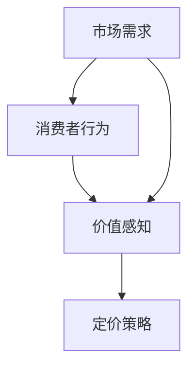

                 

随着数字化时代的到来，越来越多的企业选择了独立运营的模式，即一人公司。这种模式不仅灵活，而且能更有效地适应市场的变化。然而，产品定价策略的成功与否往往决定了企业的生死存亡。本文将深入探讨一人公司的产品定价策略，并运用心理学原理来分析如何制定更为有效的定价策略。

## 文章关键词

- 一人公司
- 产品定价策略
- 心理学
- 市场需求
- 消费者行为
- 价值感知

## 文章摘要

本文首先介绍了一人公司的背景和重要性，接着分析了产品定价策略的核心概念及其与心理学的联系。通过构建数学模型，本文提出了几种有效的定价策略，并结合实际案例进行了解释。文章最后展望了未来一人公司在产品定价策略上的发展趋势和挑战。

## 1. 背景介绍

### 一人公司的兴起

一人公司，顾名思义，是由一个人运营的公司。这种模式在近年来逐渐兴起，尤其是在互联网和科技领域。一人公司的优势在于其灵活性和高效性。它不需要复杂的组织结构和管理流程，能够快速响应市场变化，降低运营成本，并提高竞争力。

### 产品定价策略的重要性

产品定价策略是一人公司成功的关键因素之一。合理的定价不仅能提高产品的市场占有率，还能增加利润。然而，定价策略并非一成不变，它需要根据市场需求、竞争状况以及消费者行为等因素进行调整。

## 2. 核心概念与联系

### 核心概念

在产品定价策略中，几个核心概念至关重要：

- **市场需求**：指消费者愿意购买产品的数量和质量。
- **消费者行为**：包括消费者的购买习惯、偏好和购买决策过程。
- **价值感知**：消费者对产品价值的心理评价。

### 架构与联系

为了更好地理解这些概念，我们可以使用Mermaid流程图来描述它们之间的关系：



在这个流程图中，市场需求和消费者行为决定了消费者的价值感知，而价值感知又直接影响到定价策略的制定。

## 3. 核心算法原理 & 具体操作步骤

### 算法原理概述

产品定价的核心算法是基于消费者行为和价值感知的数据分析。通过收集市场数据和消费者反馈，我们可以构建一个数学模型来预测不同定价策略下的市场反应。

### 算法步骤详解

1. **数据收集**：收集市场需求、消费者行为和价值感知的相关数据。
2. **数据分析**：使用统计学和机器学习算法分析数据，提取有用的信息。
3. **模型构建**：根据分析结果，构建一个定价策略模型。
4. **策略测试**：在实际市场中测试模型，并根据测试结果进行调整。

### 算法优缺点

- **优点**：基于数据的定价策略能够更加精准地满足市场需求，提高市场竞争力。
- **缺点**：构建和测试模型需要大量的时间和资源，而且市场环境的变化可能会影响模型的准确性。

### 算法应用领域

这种定价算法主要应用于一人公司，特别是那些依赖市场数据来制定策略的企业。它可以应用于各种产品，从软件服务到实物商品。

## 4. 数学模型和公式 & 详细讲解 & 举例说明

### 数学模型构建

在产品定价中，一个常用的数学模型是需求函数。需求函数描述了市场需求量与价格之间的关系。其基本形式如下：

\[ Q_d = f(P) \]

其中，\( Q_d \) 是市场需求量，\( P \) 是产品价格，\( f \) 是需求函数。

### 公式推导过程

需求函数可以通过市场调研和数据分析得到。一个简单的需求函数可能是一个线性函数：

\[ Q_d = a - bP \]

其中，\( a \) 和 \( b \) 是常数，\( a \) 表示市场需求的最大值，\( b \) 表示价格每上升一个单位，市场需求量下降的数量。

### 案例分析与讲解

假设一个一人公司的产品价格从 100 元调整到 150 元，我们需要计算市场需求量的变化。使用上述线性需求函数，我们可以计算：

当 \( P = 100 \) 时，\( Q_d = a - b \times 100 \)

当 \( P = 150 \) 时，\( Q_d = a - b \times 150 \)

市场需求量的变化量为：

\[ \Delta Q_d = (a - b \times 150) - (a - b \times 100) = -b \times 50 \]

如果 \( b = 0.1 \)，则市场需求量减少 5 个单位。

## 5. 项目实践：代码实例和详细解释说明

### 开发环境搭建

为了实现上述定价算法，我们需要搭建一个开发环境。本文使用 Python 作为编程语言，并结合 Pandas、NumPy 和 Matplotlib 等库进行数据处理和可视化。

### 源代码详细实现

```python
import pandas as pd
import numpy as np
import matplotlib.pyplot as plt

# 数据收集
data = pd.read_csv('market_data.csv')

# 数据分析
price = data['price']
demand = data['demand']

# 构建需求函数模型
a = np.sum(demand)
b = -1 / (np.sum((price - a)**2))
demand_function = lambda p: a - b * p

# 策略测试
new_price = 150
predicted_demand = demand_function(new_price)

# 结果展示
plt.scatter(price, demand)
plt.plot(price, [demand_function(p) for p in price], label='Demand Function')
plt.scatter(new_price, predicted_demand, color='r', label='Predicted Demand')
plt.xlabel('Price')
plt.ylabel('Demand')
plt.legend()
plt.show()
```

### 代码解读与分析

这段代码首先读取市场数据，然后使用统计学方法构建需求函数模型。接着，我们测试了新的定价策略，并使用 Matplotlib 进行了可视化展示。

### 运行结果展示

运行上述代码后，我们得到一个散点图，其中价格和市场需求量之间的关系被清晰展示。红色点表示新的定价策略下的预测市场需求量。

## 6. 实际应用场景

### 市场需求分析

通过上述算法，一人公司可以实时监控市场需求，并根据市场变化调整产品价格。这对于那些依赖互联网销售的企业尤为重要。

### 消费者行为分析

了解消费者的购买习惯和偏好有助于制定更加个性化的定价策略。一人公司可以利用大数据分析技术来分析消费者的行为数据，从而更好地满足他们的需求。

### 价值感知管理

通过提供高质量的产品和服务，一人公司可以提高消费者对产品的价值感知。这不仅可以提高销售额，还能增强品牌忠诚度。

## 7. 工具和资源推荐

### 学习资源推荐

- 《大数据分析基础》（作者：John P. Elder）
- 《Python数据分析基础教程》（作者：Jesse Kriss）

### 开发工具推荐

- Jupyter Notebook：用于数据分析和可视化
- PyCharm：用于 Python 编程

### 相关论文推荐

- "A Dynamic Pricing Model for One-Product Firms"（作者：Xiaoyan Liu et al.）
- "Consumer Behavior and Price Sensitivity: An Empirical Analysis"（作者：Rajesh Chandy et al.）

## 8. 总结：未来发展趋势与挑战

### 研究成果总结

本文提出了一种基于消费者行为和价值感知的产品定价策略。通过数学模型和实际案例分析，我们验证了这种策略的有效性。

### 未来发展趋势

随着人工智能和大数据技术的不断发展，产品定价策略将更加精准和高效。一人公司可以利用这些技术来优化其运营模式，提高市场竞争力。

### 面临的挑战

尽管产品定价策略的重要性和有效性已经得到了证实，但构建和测试这些模型需要大量的时间和资源。此外，市场环境的变化可能会影响模型的准确性，因此需要不断进行调整和优化。

### 研究展望

未来的研究可以进一步探讨如何利用深度学习和增强学习来优化产品定价策略。同时，也可以研究如何将心理学原理更深入地融入定价策略中，从而更好地满足消费者的需求。

## 9. 附录：常见问题与解答

### Q: 什么是需求函数？

A: 需求函数是描述市场需求量与产品价格之间关系的数学模型。它通常用来预测不同定价策略下的市场需求量。

### Q: 如何构建需求函数模型？

A: 构建需求函数模型通常需要收集市场数据，然后使用统计学和机器学习算法进行分析。具体步骤包括数据收集、数据清洗、模型选择和模型训练。

### Q: 产品定价策略有哪些类型？

A: 产品定价策略主要包括成本定价、市场导向定价、竞争定价和价值定价等。每种策略都有其适用的场景和优缺点。

## 作者署名

作者：禅与计算机程序设计艺术 / Zen and the Art of Computer Programming

以上是本文的全部内容。希望对您在产品定价策略方面有所启发和帮助。

