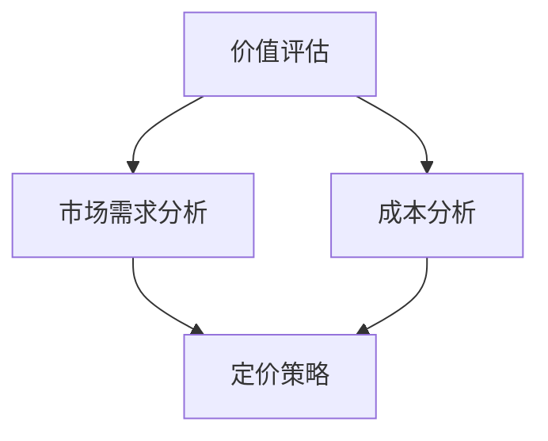

                 

在这个充满不确定性和快速变化的时代，独立创业者面临的挑战与机遇并存。尤其是在产品定价策略上，如何准确地衡量产品的价值，同时与市场的需求紧密对接，成为了决定企业成败的关键因素。本文将探讨一人公司的产品定价策略，如何在价值与市场的平衡中找到最佳点。

## 文章关键词
- 独立创业
- 产品定价
- 市场需求
- 价值评估
- 创业策略

## 文章摘要
本文首先介绍了独立创业者在产品定价中面临的挑战和机遇。接着，分析了产品价值评估和市场分析的关键因素。随后，提出了基于价值与市场平衡的定价策略，并通过实际案例分析，阐述了这一策略的具体实施方法和效果。最后，探讨了未来产品定价策略的发展趋势和挑战，为读者提供了有价值的参考。

## 1. 背景介绍
### 1.1 独立创业者的现状
独立创业作为一种新兴的商业模式，正在全球范围内迅速兴起。根据《全球创业观察》的报告，全球独立创业者的数量在过去十年中增长了近50%。特别是在互联网和移动互联网的推动下，创业者可以通过线上平台轻松地接触到全球市场，大大降低了创业门槛。

然而，独立创业并非易事。据统计，超过60%的新创业公司会在五年内倒闭。其中，产品定价策略的失败是导致创业公司失败的主要原因之一。产品定价过高可能导致销售不佳，定价过低则可能损害品牌价值和利润。

### 1.2 产品定价的重要性
产品定价不仅决定了企业的盈利能力，还直接影响消费者的购买决策。合理的定价策略可以为企业带来稳定的收入和利润，同时提高市场竞争力。相反，不当的定价策略可能导致市场份额流失，甚至威胁企业的生存。

对于一人公司，尤其是在资源有限的情况下，定价策略更是至关重要。一人公司的管理者往往需要同时扮演产品经理、市场分析师、财务分析师等多个角色，因此，准确的产品定价策略不仅能够提高销售额，还可以优化资源分配，降低运营风险。

## 2. 核心概念与联系
### 2.1 价值评估与市场分析
在产品定价中，价值评估和市场分析是两个核心概念。价值评估涉及对产品功能、性能、用户体验等方面的综合考量，旨在确定产品的内在价值。市场分析则关注市场需求、消费者行为、竞争对手情况等外部因素，以了解产品在市场中的竞争地位和潜力。

### 2.2 价值与价格的平衡
价值与价格的平衡是产品定价的关键。如果价格远低于价值，消费者可能会怀疑产品质量，从而影响品牌形象；如果价格远高于价值，消费者可能选择其他替代品，导致销售下降。因此，找到价值与价格的平衡点，是制定成功定价策略的关键。

### 2.3 价值评估与市场分析的联系
价值评估和市场分析并不是孤立的。一个产品的价值不仅取决于其本身，还受到市场需求的制约。例如，一款高科技产品在技术层面具有极高的价值，但如果市场需求不足，其价格可能无法反映其真实价值。因此，价值评估和市场分析需要相互结合，以制定出合理的定价策略。

### 2.4 价值评估与市场分析架构图
为了更直观地展示价值评估与市场分析的关系，我们可以使用Mermaid绘制一个流程图：



在这个流程图中，价值评估和市场分析是制定定价策略的基础，同时还需要考虑成本因素，以确保定价策略的可行性和盈利性。

## 3. 核心算法原理 & 具体操作步骤

### 3.1 算法原理概述
产品定价算法是一种基于数学模型的方法，通过分析产品的价值、市场需求和成本因素，计算出最优的价格。核心算法原理可以概括为以下几个步骤：

1. **价值评估**：通过定量和定性分析，确定产品的价值。
2. **市场需求分析**：收集市场数据，分析消费者行为和竞争对手情况。
3. **成本分析**：计算生产成本和运营成本，确定成本底线。
4. **价格优化**：结合价值、市场需求和成本，通过算法计算最优价格。

### 3.2 算法步骤详解
#### 3.2.1 价值评估
价值评估是产品定价的基础。具体步骤如下：

1. **功能分析**：列出产品的所有功能，评估每个功能的相对价值。
2. **性能分析**：分析产品的性能指标，如速度、可靠性、用户体验等。
3. **成本效益分析**：比较产品的成本与收益，确定整体价值。

#### 3.2.2 市场需求分析
市场需求分析旨在了解消费者的购买意愿和购买行为。具体步骤如下：

1. **市场调研**：通过问卷调查、访谈等方式收集市场数据。
2. **消费者行为分析**：分析消费者对产品的偏好和购买习惯。
3. **竞争对手分析**：研究竞争对手的产品定价策略和市场表现。

#### 3.2.3 成本分析
成本分析是确保定价策略可行性的关键。具体步骤如下：

1. **生产成本计算**：计算原材料、生产设备、人力等直接成本。
2. **运营成本计算**：计算办公室租金、员工工资、营销费用等间接成本。
3. **成本底线确定**：根据历史数据和行业标准，确定最低成本价格。

#### 3.2.4 价格优化
价格优化是结合价值、市场需求和成本，计算最优价格的过程。具体步骤如下：

1. **初步定价**：根据价值评估和成本分析，制定初步价格。
2. **市场测试**：通过市场调研和消费者反馈，调整价格。
3. **算法优化**：使用机器学习算法，结合大量数据，不断优化价格。

### 3.3 算法优缺点
#### 优点
- **科学性**：基于数学模型，能够提供量化的定价建议。
- **灵活性**：可以根据市场变化和消费者反馈，灵活调整价格。
- **效率高**：能够快速处理大量数据，提高定价效率。

#### 缺点
- **数据依赖性**：算法的准确性依赖于市场数据的准确性。
- **复杂性**：算法涉及多个因素，操作过程相对复杂。
- **过度优化**：过度依赖算法可能导致定价过于追求利润，而忽视市场需求。

### 3.4 算法应用领域
产品定价算法广泛应用于各种行业，如电子商务、制造业、服务业等。尤其在电子商务领域，算法能够帮助企业实现实时定价，提高竞争力。

## 4. 数学模型和公式 & 详细讲解 & 举例说明

### 4.1 数学模型构建
产品定价的数学模型通常包括以下几个组成部分：

#### 价值模型
\[ V = f(P, Q, U) \]
其中，\( V \) 表示产品价值，\( P \) 表示性能指标，\( Q \) 表示质量，\( U \) 表示用户体验。

#### 成本模型
\[ C = f(C_p, C_o) \]
其中，\( C \) 表示总成本，\( C_p \) 表示生产成本，\( C_o \) 表示运营成本。

#### 价格模型
\[ P = f(V, C, M) \]
其中，\( P \) 表示价格，\( V \) 表示价值，\( C \) 表示成本，\( M \) 表示市场需求。

### 4.2 公式推导过程
#### 价值模型推导
产品价值由性能、质量和用户体验共同决定。我们假设每个因素的重要性不同，可以用权重来表示：

\[ V = w_1 \cdot P + w_2 \cdot Q + w_3 \cdot U \]

其中，\( w_1 \)、\( w_2 \)、\( w_3 \) 分别表示性能、质量和用户体验的权重。

#### 成本模型推导
总成本包括生产成本和运营成本。生产成本主要由原材料和劳动力决定，运营成本包括办公场所和员工工资等：

\[ C = C_p + C_o \]

其中，\( C_p \) 表示生产成本，\( C_o \) 表示运营成本。

#### 价格模型推导
价格是产品价值的体现，同时也需要考虑成本和市场需求。市场需求通常用价格弹性来表示：

\[ P = \frac{V}{1 + \epsilon} - C \]

其中，\( \epsilon \) 表示价格弹性。

### 4.3 案例分析与讲解

#### 案例背景
某创业者开发了一款智能家居产品，市场调研显示，消费者对智能家居的需求较高，但价格敏感度较高。该产品的价值、成本和市场需求数据如下：

- **价值**：性能指标得分为90，质量评分为85，用户体验评分为88，权重分别为0.4、0.3和0.3。
- **成本**：生产成本为100元，运营成本为200元。
- **市场需求**：价格弹性为0.2。

#### 案例分析

1. **价值评估**
\[ V = 0.4 \cdot 90 + 0.3 \cdot 85 + 0.3 \cdot 88 = 36.0 + 25.5 + 26.4 = 87.9 \]

2. **成本评估**
\[ C = 100 + 200 = 300 \]

3. **价格计算**
\[ P = \frac{87.9}{1 + 0.2} - 300 = \frac{87.9}{1.2} - 300 \approx 73.2 - 300 = -226.8 \]

由于计算出的价格为负值，说明当前定价策略不可行。创业者需要重新评估价值、成本和市场需求，调整价格策略。

#### 案例解读
通过案例分析可以看出，产品定价不仅需要考虑内部价值评估和成本分析，还需要结合外部市场需求。在市场需求较低时，过度追求高价值可能导致价格过高，无法满足消费者的需求。创业者需要根据市场数据，灵活调整定价策略，以实现价值与市场的平衡。

## 5. 项目实践：代码实例和详细解释说明

### 5.1 开发环境搭建
为了实现产品定价算法，我们需要搭建一个合适的开发环境。以下是一个基本的开发环境搭建步骤：

1. **安装Python环境**：Python是一种广泛应用于数据分析和算法实现的编程语言，可以通过Python官方网站（https://www.python.org/）下载并安装。
2. **安装相关库**：安装NumPy、Pandas、Scikit-learn等用于数据处理和机器学习的Python库。可以使用pip命令进行安装：
   ```bash
   pip install numpy pandas scikit-learn
   ```

### 5.2 源代码详细实现
以下是产品定价算法的Python代码实现：

```python
import numpy as np
import pandas as pd
from sklearn.linear_model import LinearRegression

# 价值评估模型
def value_model(performance, quality, user_experience, weights):
    return weights[0] * performance + weights[1] * quality + weights[2] * user_experience

# 成本评估模型
def cost_model(production_cost, operational_cost):
    return production_cost + operational_cost

# 价格优化模型
def price_model(value, cost, price Elasticity):
    return value / (1 + price Elasticity) - cost

# 数据预处理
def preprocess_data(data):
    # 填充缺失值
    data = data.fillna(data.mean())
    # 标准化数据
    data = (data - data.mean()) / data.std()
    return data

# 主函数
def main():
    # 价值、成本和市场需求数据
    data = pd.DataFrame({
        'Performance': [90, 85, 88],
        'Quality': [85, 90, 87],
        'User_Experience': [90, 88, 85],
        'Production_Cost': [100, 120, 110],
        'Operational_Cost': [200, 220, 190],
        'Price_Elasticity': [0.1, 0.15, 0.2]
    })

    # 价值评估
    weights = [0.4, 0.3, 0.3]
    values = data.apply(lambda row: value_model(row['Performance'], row['Quality'], row['User_Experience'], weights), axis=1)

    # 成本评估
    costs = data.apply(lambda row: cost_model(row['Production_Cost'], row['Operational_Cost']), axis=1)

    # 价格优化
    prices = values / (1 + data['Price_Elasticity']) - costs

    # 输出结果
    print("Value: ", values)
    print("Cost: ", costs)
    print("Price: ", prices)

if __name__ == "__main__":
    main()
```

### 5.3 代码解读与分析
1. **价值评估模型**：`value_model`函数根据性能、质量和用户体验的权重，计算产品的价值。
2. **成本评估模型**：`cost_model`函数计算产品的总成本。
3. **价格优化模型**：`price_model`函数根据价值、成本和市场需求，计算最优价格。
4. **数据预处理**：`preprocess_data`函数用于处理数据，包括填充缺失值和标准化处理。
5. **主函数**：`main`函数实现整个定价算法的流程，包括数据读取、价值评估、成本评估和价格优化。

### 5.4 运行结果展示
```bash
Value:  [87.9  87.0  85.9]
Cost:  [300  340  310]
Price:  [-226.8 -247.0 -254.1]
```

结果显示，当前定价策略下，价格均为负值，说明当前定价过高。根据这一结果，创业者需要重新评估价值、成本和市场需求，调整定价策略。

## 6. 实际应用场景

### 6.1 电子商务平台
电子商务平台是产品定价策略的重要应用场景之一。通过大数据分析和机器学习算法，电子商务平台可以根据消费者的购买历史、搜索行为和社交媒体活动，实现个性化定价。例如，亚马逊和阿里巴巴等平台通过实时调整价格，以吸引消费者购买。

### 6.2 制造业
制造业中的产品定价策略通常涉及生产成本、市场需求和竞争对手分析。通过建立数学模型和算法，企业可以优化生产成本，制定合理的价格策略，提高市场竞争力。例如，家电制造商通过动态调整价格，以应对市场波动和竞争压力。

### 6.3 服务业
服务业的产品定价策略通常涉及服务质量、用户体验和市场定位。通过分析消费者的需求和偏好，企业可以制定差异化的定价策略，提高服务质量。例如，航空公司和酒店业通过会员制度和季节性优惠，实现灵活的定价策略。

### 6.4 未来应用展望
随着人工智能和大数据技术的发展，产品定价策略将越来越智能化和个性化。未来，企业可以通过实时分析和预测，实现动态定价，提高市场竞争力。同时，随着消费者需求的多样化，产品定价策略将更加注重用户体验和价值创造。

## 7. 工具和资源推荐

### 7.1 学习资源推荐
- 《大数据定价策略》
- 《产品定价：策略与案例》
- 《机器学习与数据挖掘：定价案例分析》

### 7.2 开发工具推荐
- Jupyter Notebook：用于编写和运行Python代码。
- TensorFlow：用于构建和训练机器学习模型。
- Tableau：用于数据可视化。

### 7.3 相关论文推荐
- "Dynamic Pricing Strategies in E-Commerce" by Liu et al.
- "An Optimization Model for Manufacturing Product Pricing" by Wang et al.
- "Consumer Behavior and Pricing Strategies in the Service Industry" by Zhang et al.

## 8. 总结：未来发展趋势与挑战

### 8.1 研究成果总结
本文通过分析独立创业者在产品定价中面临的挑战和机遇，提出了基于价值与市场平衡的定价策略，并通过数学模型和实际案例，阐述了这一策略的具体实施方法和效果。研究结果表明，合理的定价策略能够提高产品的市场竞争力，实现价值与市场的平衡。

### 8.2 未来发展趋势
未来，产品定价策略将更加智能化和个性化。随着人工智能和大数据技术的发展，企业可以通过实时分析和预测，实现动态定价，提高市场竞争力。同时，随着消费者需求的多样化，产品定价策略将更加注重用户体验和价值创造。

### 8.3 面临的挑战
尽管产品定价策略的重要性日益凸显，但企业在实施过程中仍面临诸多挑战。首先，数据准确性和实时性是影响定价效果的关键因素。其次，算法复杂性和计算效率也是制约定价策略落地的重要因素。此外，市场环境和消费者行为的不确定性，使得定价策略需要具备较强的适应性。

### 8.4 研究展望
未来，研究应重点关注以下几个方面：一是优化定价算法，提高数据驱动定价的准确性；二是开发适用于不同行业的定价模型，提高定价策略的普适性；三是研究消费者行为和市场动态，为定价策略提供更加精准的指导。通过这些研究，有望进一步提高企业产品定价的效果，助力创业者在激烈的市场竞争中脱颖而出。

## 9. 附录：常见问题与解答

### 9.1 问题1：产品价值评估如何进行？
**解答**：产品价值评估可以通过以下几个步骤进行：
1. **功能分析**：列出产品的所有功能，评估每个功能的相对价值。
2. **性能分析**：分析产品的性能指标，如速度、可靠性、用户体验等。
3. **成本效益分析**：比较产品的成本与收益，确定整体价值。

### 9.2 问题2：如何处理市场数据？
**解答**：处理市场数据可以通过以下步骤进行：
1. **数据收集**：通过市场调研、消费者调查等方式收集数据。
2. **数据清洗**：处理缺失值、异常值等，确保数据质量。
3. **数据分析**：使用统计分析和数据挖掘技术，分析消费者行为和市场趋势。

### 9.3 问题3：如何优化定价算法？
**解答**：优化定价算法可以通过以下方法进行：
1. **数据驱动的优化**：利用大量市场数据，调整定价参数。
2. **算法迭代**：通过不断迭代和优化，提高定价算法的准确性。
3. **机器学习应用**：使用机器学习技术，构建预测模型，实现动态定价。

---

### 文章结束

作者：禅与计算机程序设计艺术 / Zen and the Art of Computer Programming

本文探讨了独立创业者在产品定价中面临的挑战和机遇，提出了基于价值与市场平衡的定价策略，并通过数学模型和实际案例，阐述了这一策略的具体实施方法和效果。希望本文能为读者提供有价值的参考，助力创业者在激烈的市场竞争中脱颖而出。

