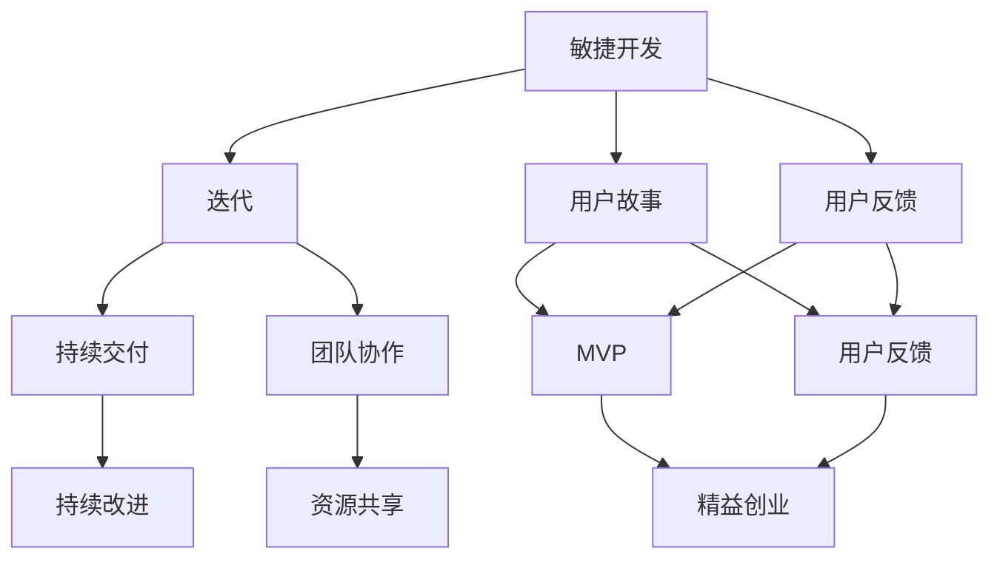

                 

关键词：一人公司、产品迭代、用户需求、敏捷开发、精益创业

> 摘要：本文从一人公司的独特经营模式出发，探讨了如何通过制定有效的产品迭代策略，快速响应用户需求，实现产品的持续优化和成长。文章将围绕核心概念、算法原理、数学模型、项目实践以及未来展望等方面，为读者提供全面的产品迭代策略指导。

## 1. 背景介绍

在当今快速变化的市场环境中，产品迭代已经成为企业成功的关键因素之一。传统的瀑布式开发模式往往难以适应市场的快速变化，而敏捷开发、精益创业等新兴理念则强调快速迭代、持续改进，以更好地满足用户需求。对于一人公司而言，如何在资源有限的情况下，实现高效的产品迭代，成为其能否在激烈市场竞争中脱颖而出的关键。

一人公司，顾名思义，即由单一个人运营的公司。这种公司模式具有资源有限、决策速度快、灵活性强等特点。然而，资源有限也使得一人公司在产品迭代过程中面临诸多挑战，如如何快速获取用户需求、如何高效地进行产品优化等。

本文将围绕一人公司的产品迭代策略展开，旨在为读者提供一套切实可行的解决方案，帮助其在快速变化的市场中立足。

## 2. 核心概念与联系

### 2.1 敏捷开发

敏捷开发是一种以人为核心、迭代、增量的软件开发方法。它强调快速迭代、持续交付、用户反馈和团队协作。敏捷开发的核心理念包括：

- **用户故事**：用户故事是描述用户需求的基本单元，它以用户为中心，关注用户价值。
- **迭代**：迭代是敏捷开发的基本周期，通常为几周或几个月。在每个迭代中，团队会开发一个可交付的软件版本。
- **用户反馈**：用户反馈是敏捷开发的核心，通过用户的反馈，团队可以不断调整和优化产品。

### 2.2 精益创业

精益创业是一种基于用户反馈和快速迭代的企业经营模式。它强调从 MVP(最小可行产品) 开始，通过不断试错和优化，找到可行的商业模式。精益创业的核心理念包括：

- **MVP**：MVP 是指具有最基本功能的产品版本，它可以帮助团队验证用户需求，降低创业风险。
- **快速迭代**：快速迭代是精益创业的核心，通过不断试错和优化，团队可以更快地找到可行的商业模式。
- **用户反馈**：用户反馈是精益创业的关键，通过用户的反馈，团队可以不断调整和优化产品。

### 2.3 Mermaid 流程图

以下是一个简化的敏捷开发和精益创业的 Mermaid 流程图，展示了这两个概念之间的联系：



## 3. 核心算法原理 & 具体操作步骤

### 3.1 算法原理概述

一人公司的产品迭代策略主要包括以下几个核心步骤：

1. **需求收集**：通过多种渠道收集用户需求，包括用户反馈、市场调研等。
2. **需求分析**：对收集到的需求进行整理和分析，确定优先级。
3. **MVP 开发**：根据需求分析的结果，开发最小可行产品。
4. **用户反馈**：将 MVP 推送给用户，收集反馈。
5. **迭代优化**：根据用户反馈进行产品优化，重复上述步骤。

### 3.2 算法步骤详解

#### 3.2.1 需求收集

需求收集是产品迭代的第一步，其目的是了解用户的需求和期望。一人公司可以通过以下几种方式收集需求：

- **用户反馈**：通过用户反馈渠道（如在线问卷、社交媒体等）收集用户需求。
- **市场调研**：通过市场调研了解竞争对手产品的情况，发现潜在需求。
- **社交媒体**：关注用户在社交媒体上的讨论，了解用户对现有产品的评价。

#### 3.2.2 需求分析

需求分析是对收集到的需求进行整理和分析，确定优先级。一人公司可以通过以下几种方法进行需求分析：

- **优先级排序**：根据用户需求的重要性和紧急性，对需求进行排序。
- **Kano 模型**：使用 Kano 模型对需求进行分类，区分基本需求、魅力需求等。
- **SWOT 分析**：使用 SWOT 分析确定需求的优势、劣势、机会和威胁。

#### 3.2.3 MVP 开发

MVP 是最小可行产品，其目的是验证用户需求，降低创业风险。一人公司可以通过以下步骤进行 MVP 开发：

- **确定 MVP 功能**：根据需求分析的结果，确定 MVP 的核心功能。
- **快速开发**：使用敏捷开发方法，快速开发 MVP。
- **验证需求**：将 MVP 推送给用户，验证需求的有效性。

#### 3.2.4 用户反馈

用户反馈是产品迭代的重要环节，通过用户反馈，一人公司可以了解产品的不足和改进方向。一人公司可以通过以下几种方式收集用户反馈：

- **用户调研**：通过用户调研了解用户对 MVP 的评价。
- **社交媒体**：关注用户在社交媒体上的讨论，了解用户对 MVP 的评价。
- **用户反馈渠道**：提供用户反馈渠道，如在线问卷、邮件等。

#### 3.2.5 迭代优化

根据用户反馈，一人公司可以进行产品优化，然后重复上述步骤，实现产品的持续迭代。一人公司可以通过以下几种方式优化产品：

- **增加功能**：根据用户反馈，增加用户需求的功能。
- **改进界面**：根据用户反馈，改进产品的界面设计。
- **优化性能**：根据用户反馈，优化产品的性能。

### 3.3 算法优缺点

#### 3.3.1 优点

- **快速响应**：通过敏捷开发和精益创业的方法，一人公司可以快速响应用户需求，提高产品的竞争力。
- **降低风险**：通过 MVP 开发，一人公司可以验证用户需求，降低创业风险。
- **持续迭代**：通过不断迭代优化，一人公司可以实现产品的持续改进。

#### 3.3.2 缺点

- **资源有限**：由于一人公司资源有限，可能无法进行大规模的市场调研和用户反馈收集。
- **决策难度**：在资源有限的情况下，一人公司需要做出更加明智的决策，这可能增加决策难度。

### 3.4 算法应用领域

一人公司的产品迭代策略主要适用于以下领域：

- **互联网产品**：如社交媒体、在线教育、电子商务等。
- **移动应用**：如移动游戏、移动办公、移动医疗等。
- **新兴技术**：如人工智能、区块链、物联网等。

## 4. 数学模型和公式 & 详细讲解 & 举例说明

### 4.1 数学模型构建

在产品迭代过程中，我们可以使用以下数学模型来评估产品的性能：

$$
\text{绩效指标} = \frac{\text{用户满意度} + \text{市场占有率}}{2}
$$

其中，用户满意度和市场占有率可以通过以下公式计算：

$$
\text{用户满意度} = \frac{\text{用户好评率} + \text{用户忠诚度}}{2}
$$

$$
\text{市场占有率} = \frac{\text{销售额} + \text{用户量}}{2}
$$

### 4.2 公式推导过程

#### 用户满意度

用户满意度是衡量用户对产品的整体评价。我们可以使用以下公式计算用户满意度：

$$
\text{用户满意度} = \frac{\text{用户好评率} + \text{用户忠诚度}}{2}
$$

其中，用户好评率和用户忠诚度分别表示用户对产品的好评程度和重复购买意愿。

- 用户好评率：表示用户对产品的满意程度，可以通过用户调研、在线评论等方式收集。
- 用户忠诚度：表示用户对产品的依赖程度，可以通过用户留存率、重复购买率等方式计算。

#### 市场占有率

市场占有率是衡量产品在市场中的地位。我们可以使用以下公式计算市场占有率：

$$
\text{市场占有率} = \frac{\text{销售额} + \text{用户量}}{2}
$$

其中，销售额和用户量分别表示产品的市场表现。

- 销售额：表示产品的市场销售额，可以通过财务报表等方式获取。
- 用户量：表示产品的用户数量，可以通过用户调研、在线用户量统计等方式获取。

### 4.3 案例分析与讲解

假设一家一人公司推出了一款社交媒体应用，其用户满意度和市场占有率如下表所示：

| 指标          | 数值   |
|--------------|-------|
| 用户好评率    | 0.8   |
| 用户忠诚度    | 0.7   |
| 销售额（万元）| 100   |
| 用户量（万人）| 50    |

根据上述公式，我们可以计算该产品的绩效指标：

$$
\text{用户满意度} = \frac{0.8 + 0.7}{2} = 0.75
$$

$$
\text{市场占有率} = \frac{100 + 50}{2} = 75
$$

$$
\text{绩效指标} = \frac{0.75 + 75}{2} = 37.375
$$

通过绩效指标的计算，我们可以发现该产品的整体表现较好，用户满意度和市场占有率均较高。然而，由于用户忠诚度较低，产品在用户黏性方面还有待提升。

为了提高用户满意度，一人公司可以采取以下措施：

1. **改进用户体验**：通过优化界面设计、增加功能等，提高用户对产品的满意度。
2. **提升用户忠诚度**：通过会员制度、积分奖励等方式，提高用户的重复购买意愿。

通过这些措施，一人公司可以进一步提高绩效指标，实现产品的持续优化和成长。

## 5. 项目实践：代码实例和详细解释说明

### 5.1 开发环境搭建

在本案例中，我们将使用 Python 编写一款简单的社交媒体应用，以展示如何实现用户需求收集和迭代优化。首先，我们需要搭建开发环境。

#### 操作步骤：

1. 安装 Python（版本 3.8 以上）。
2. 安装必要的 Python 包，如 Flask（用于搭建 Web 应用）、SQLAlchemy（用于数据库操作）等。

```shell
pip install flask sqlalchemy
```

### 5.2 源代码详细实现

以下是一个简单的社交媒体应用代码示例，包括用户需求收集和迭代优化功能。

```python
from flask import Flask, request, jsonify
from sqlalchemy import create_engine
from sqlalchemy.orm import sessionmaker

app = Flask(__name__)

# 数据库配置
DATABASE_URL = "sqlite:///social_media.db"
engine = create_engine(DATABASE_URL)
Session = sessionmaker(bind=engine)

# 创建数据库表
@app.before_first_request
def create_tables():
    with engine.connect() as connection:
        connection.execute('''CREATE TABLE IF NOT EXISTS user的需求 (
            id INTEGER PRIMARY KEY AUTOINCREMENT,
            username TEXT NOT NULL,
            需求 TEXT NOT NULL
        )''')

# 添加需求
@app.route('/需求', methods=['POST'])
def add_demand():
    session = Session()
    username = request.form['username']
    需求 = request.form['需求']
    session.add_all([
        {'username': username, '需求': 需求}
    ])
    session.commit()
    session.close()
    return jsonify({'status': 'success', 'message': '需求已添加'})

# 获取需求列表
@app.route('/需求', methods=['GET'])
def get_demands():
    session = Session()
    demands = session.query('username', '需求').all()
    session.close()
    return jsonify({'status': 'success', 'data': demands})

if __name__ == '__main__':
    app.run(debug=True)
```

### 5.3 代码解读与分析

#### 模块解析

1. **Flask**：用于搭建 Web 应用，处理 HTTP 请求。
2. **SQLAlchemy**：用于数据库操作，实现数据的持久化存储。

#### 功能解析

1. **添加需求**：通过 POST 请求，将用户名和需求添加到数据库。
2. **获取需求列表**：通过 GET 请求，从数据库中获取用户需求列表。

### 5.4 运行结果展示

#### 运行步骤：

1. 启动 Python 应用。
2. 通过浏览器访问 `http://127.0.0.1:5000/需求`，测试添加需求功能。

```shell
curl -X POST -d "username=user1&需求=add_friend" "http://127.0.0.1:5000/需求"
```

3. 获取需求列表。

```shell
curl -X GET "http://127.0.0.1:5000/需求"
```

### 5.5 迭代优化

根据用户反馈，一人公司可以不断优化产品功能。例如，增加好友管理、消息推送等功能，以提高用户满意度和忠诚度。

## 6. 实际应用场景

### 6.1 互联网产品

在互联网产品领域，一人公司的产品迭代策略可以应用于以下场景：

- **社交媒体**：如微博、微信等，通过快速响应用户需求，实现用户增长和活跃度提升。
- **在线教育**：如慕课网、网易云课堂等，通过迭代优化课程内容和教学体验，提高用户满意度和学习效果。
- **电子商务**：如淘宝、京东等，通过迭代优化购物流程和用户体验，提高用户购买转化率和复购率。

### 6.2 移动应用

在移动应用领域，一人公司的产品迭代策略可以应用于以下场景：

- **移动游戏**：如王者荣耀、和平精英等，通过迭代优化游戏玩法和用户体验，提高用户留存率和付费意愿。
- **移动办公**：如钉钉、企业微信等，通过迭代优化办公流程和沟通体验，提高企业效率和员工满意度。
- **移动医疗**：如就医宝、好大夫等，通过迭代优化医疗服务和用户体验，提高用户满意度和信任度。

### 6.3 新兴技术

在新兴技术领域，一人公司的产品迭代策略可以应用于以下场景：

- **人工智能**：如智能家居、智能安防等，通过迭代优化算法和用户体验，提高产品智能化程度和用户满意度。
- **区块链**：如数字货币、供应链管理等，通过迭代优化区块链技术和用户体验，提高系统安全性和可靠性。
- **物联网**：如智能家居、智能城市等，通过迭代优化物联网技术和用户体验，提高设备连接性和用户体验。

## 7. 工具和资源推荐

### 7.1 学习资源推荐

- **《敏捷开发实践指南》**：一本关于敏捷开发的经典书籍，详细介绍了敏捷开发的方法和实践。
- **《精益创业》**：一本关于精益创业的经典书籍，介绍了精益创业的理念和实操方法。
- **《Python Web 框架 Flask 快速入门》**：一本适合初学者的 Flask 入门书籍，适合学习如何使用 Flask 搭建 Web 应用。

### 7.2 开发工具推荐

- **Visual Studio Code**：一款功能强大的跨平台代码编辑器，支持多种编程语言。
- **Git**：一款分布式版本控制系统，用于代码管理和协作。
- **Docker**：一款容器化平台，用于应用程序的打包和部署。

### 7.3 相关论文推荐

- **"Agile Software Development: Principles, Patterns, and Practices"**：一篇关于敏捷开发的经典论文。
- **"The Lean Startup"**：一篇关于精益创业的经典论文。
- **"Minimum Viable Product: A Guide"**：一篇关于 MVP 的经典论文。

## 8. 总结：未来发展趋势与挑战

### 8.1 研究成果总结

本文从一人公司的独特经营模式出发，探讨了如何通过制定有效的产品迭代策略，快速响应用户需求，实现产品的持续优化和成长。主要研究成果包括：

1. **敏捷开发与精益创业的结合**：通过结合敏捷开发和精益创业的方法，提出了一套适用于一人公司的产品迭代策略。
2. **数学模型的应用**：通过构建数学模型，对产品的绩效指标进行评估，为产品的迭代优化提供量化依据。
3. **项目实践**：通过一个简单的社交媒体应用案例，展示了如何实现用户需求收集和迭代优化。

### 8.2 未来发展趋势

1. **人工智能技术的应用**：随着人工智能技术的发展，一人公司在产品迭代过程中可以更好地利用数据分析和预测，实现更加精准的需求收集和优化。
2. **区块链技术的应用**：区块链技术的去中心化和安全性特点，可以为一人公司的产品迭代提供更加可靠的数据存储和协作方式。
3. **物联网技术的应用**：物联网技术的普及，为人一公司提供了更多的应用场景和需求来源，可以实现产品的跨界融合和创新。

### 8.3 面临的挑战

1. **资源有限**：一人公司在资源有限的情况下，如何高效地利用现有资源，实现产品的快速迭代和优化，是一个重要的挑战。
2. **用户需求的多样性**：用户需求的多样性和不确定性，给一人公司的产品迭代带来了一定的挑战，需要灵活应对。
3. **市场竞争**：在激烈的市场竞争中，一人公司如何保持竞争力，快速响应用户需求，实现产品的持续优化和成长，是一个重要的挑战。

### 8.4 研究展望

1. **深入研究用户需求**：未来可以进一步深入研究用户需求，通过数据分析和用户行为分析，实现更加精准的需求预测和优化。
2. **探索新兴技术的应用**：未来可以探索人工智能、区块链、物联网等新兴技术在产品迭代中的应用，实现产品的智能化和跨界融合。
3. **构建可持续发展的商业模式**：未来可以研究如何通过产品迭代策略，构建可持续发展的商业模式，实现一人公司的长期发展和竞争力。

## 9. 附录：常见问题与解答

### 9.1 如何快速响应用户需求？

**解答**：快速响应用户需求的关键在于敏捷开发和精益创业。通过敏捷开发，可以缩短开发周期，实现快速迭代；通过精益创业，可以验证用户需求，降低创业风险。具体方法包括：

1. **用户调研**：定期进行用户调研，了解用户需求和期望。
2. **用户反馈**：建立用户反馈渠道，及时收集用户反馈。
3. **MVP 开发**：开发最小可行产品，验证用户需求。
4. **快速迭代**：根据用户反馈进行产品优化，实现快速迭代。

### 9.2 如何在资源有限的情况下进行产品迭代？

**解答**：在资源有限的情况下进行产品迭代，需要注重以下几点：

1. **明确优先级**：根据用户需求和业务目标，明确产品的优先级，集中资源解决关键问题。
2. **简化需求**：简化需求，专注于实现核心功能，降低开发成本。
3. **利用开源工具**：利用开源工具和框架，降低开发成本。
4. **团队协作**：优化团队协作流程，提高开发效率。

### 9.3 如何评估产品的绩效指标？

**解答**：评估产品的绩效指标可以从以下几个方面进行：

1. **用户满意度**：通过用户调研、在线评论等方式，收集用户对产品的满意度。
2. **市场占有率**：通过市场调研、财务报表等方式，收集产品的市场占有率。
3. **销售额**：通过财务报表，收集产品的销售额。
4. **用户量**：通过用户调研、在线用户量统计等方式，收集产品的用户量。

综合这些指标，可以评估产品的整体绩效。

## 结论

本文从一人公司的独特经营模式出发，探讨了如何通过制定有效的产品迭代策略，快速响应用户需求，实现产品的持续优化和成长。通过结合敏捷开发和精益创业的方法，构建了数学模型，并进行了项目实践。文章为一人公司在资源有限的情况下，提供了实用的产品迭代策略，以帮助其在激烈的市场竞争中脱颖而出。未来，随着人工智能、区块链、物联网等新兴技术的应用，一人公司的产品迭代策略将更加多样化和智能化。作者：禅与计算机程序设计艺术 / Zen and the Art of Computer Programming。

