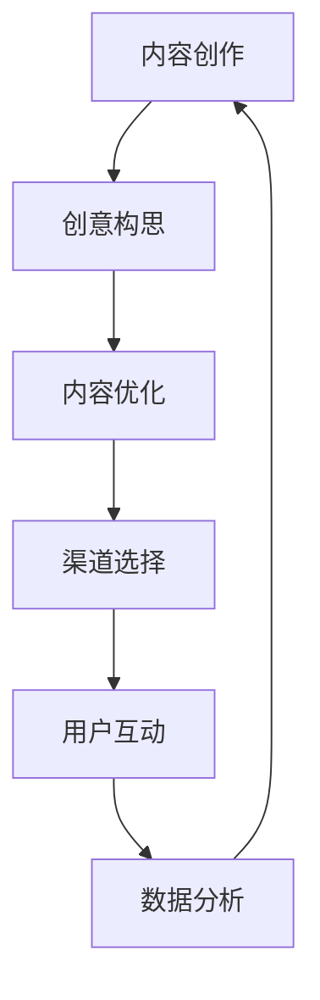

                 

关键词：一人公司、内容营销、病毒式内容、创作技巧、推广策略

摘要：在数字时代，内容营销成为企业竞争的重要手段。一人公司由于资源和人力有限，更需要通过高效的内容创作和推广策略来提升品牌影响力。本文将探讨如何利用病毒式内容的特性，结合专业的技术思维，为一人公司打造出高传播性和高价值的内容营销策略。

## 1. 背景介绍

### 1.1 一人公司的现状

一人公司，顾名思义，指的是只有一名员工的企业。这种模式虽然在传统商业中被认为是一个挑战，但在数字化时代，特别是在远程工作逐渐普及的背景下，一人公司却找到了新的发展空间。这类公司往往以创新、灵活和高效为特点，借助互联网平台和工具，实现业务的全流程管理。

### 1.2 内容营销的重要性

内容营销是当前营销战略中不可或缺的一部分。通过创造和分发有价值、相关且一致的内容来吸引潜在客户，从而建立品牌信任和忠诚度。对于一人公司来说，内容营销不仅是一种营销手段，更是品牌塑造和业务拓展的重要途径。

### 1.3 病毒式内容的魅力

病毒式内容指的是那些能够在短时间内迅速传播，引发大规模关注和分享的内容。这种内容往往具备以下特点：独特的创意、情感共鸣、易传播性等。一人公司通过打造病毒式内容，可以在有限的资源下实现最大的品牌曝光。

## 2. 核心概念与联系

下面是一个用Mermaid绘制的核心概念和流程图：



### 2.1 创意构思

创意是病毒式内容的核心。一人公司需要深入理解目标受众的需求和兴趣，从中挖掘出独特且有趣的创意点。可以通过市场调研、竞品分析等方式，为内容创作提供有力的支持。

### 2.2 内容优化

创意构思完成后，需要对内容进行优化，确保其具备传播性。这包括标题设计、视觉元素、内容结构等多个方面。高质量的内容可以吸引更多的关注和分享。

### 2.3 渠道选择

选择合适的渠道是内容传播的关键。一人公司需要根据自己的目标受众和内容特点，选择最适合的传播渠道。例如，社交媒体、博客、视频平台等。

### 2.4 用户互动

用户互动是病毒式内容传播的重要环节。通过评论、点赞、分享等方式，与用户建立互动，提高内容的传播力和影响力。

### 2.5 数据分析

数据分析可以帮助一人公司了解内容的传播效果，优化内容策略。通过分析用户的访问量、点赞数、分享数等数据，可以找出哪些内容更受欢迎，哪些渠道更有效。

## 3. 核心算法原理 & 具体操作步骤

### 3.1 算法原理概述

病毒式内容的传播算法可以看作是一种基于网络效应的推荐系统。其核心原理是通过用户的行为数据，识别出潜在的兴趣点，并进行内容的推荐。具体来说，包括以下几个步骤：

1. 数据采集：收集用户的行为数据，如浏览记录、点赞数、分享数等。
2. 数据处理：对采集到的数据进行清洗和处理，提取出有效的特征信息。
3. 内容推荐：根据用户特征和内容特征，进行内容的推荐。
4. 用户反馈：收集用户的反馈数据，进一步优化推荐算法。

### 3.2 算法步骤详解

1. **数据采集**：

   - 收集用户在各大社交媒体平台上的浏览记录、点赞和分享行为。
   - 利用爬虫技术获取网站内容的相关数据。

2. **数据处理**：

   - 数据清洗：去除无效数据、重复数据等。
   - 特征提取：提取用户兴趣特征、内容特征等。

3. **内容推荐**：

   - 采用协同过滤、矩阵分解等方法，根据用户特征和内容特征，生成推荐列表。
   - 利用深度学习模型，如卷积神经网络、循环神经网络等，对推荐结果进行优化。

4. **用户反馈**：

   - 收集用户对推荐内容的反馈数据，如点击、点赞、分享等。
   - 利用反馈数据，调整推荐算法，提高推荐质量。

### 3.3 算法优缺点

1. **优点**：

   - **高效性**：基于大数据和机器学习技术的算法，能够快速处理海量数据，实现高效的内容推荐。
   - **个性化**：根据用户行为和兴趣，提供个性化的内容推荐，提高用户满意度。
   - **可扩展性**：算法可以轻松扩展到不同领域和平台，适用性强。

2. **缺点**：

   - **数据依赖性**：算法效果高度依赖数据质量，数据不准确会导致推荐效果下降。
   - **算法黑箱**：深度学习算法的内部机制复杂，难以理解和解释，存在一定的黑箱问题。
   - **冷启动问题**：对于新用户或新内容，由于缺乏行为数据，难以进行准确的推荐。

### 3.4 算法应用领域

- **社交媒体**：如Facebook、Twitter等，通过内容推荐，吸引用户关注和互动。
- **电商**：如淘宝、京东等，通过商品推荐，提高用户购买转化率。
- **新闻资讯**：如今日头条、腾讯新闻等，通过个性化推荐，满足用户个性化阅读需求。

## 4. 数学模型和公式 & 详细讲解 & 举例说明

### 4.1 数学模型构建

病毒式内容的传播可以看作是一个时间序列问题。我们可以使用马尔可夫链模型来描述用户在各个状态之间的转移过程。假设用户有四个状态：未接触内容、已接触内容、已分享内容和已评论内容。状态转移矩阵可以用以下公式表示：

$$
P =
\begin{bmatrix}
p_{11} & p_{12} & p_{13} & p_{14} \\
p_{21} & p_{22} & p_{23} & p_{24} \\
p_{31} & p_{32} & p_{33} & p_{34} \\
p_{41} & p_{42} & p_{43} & p_{44}
\end{bmatrix}
$$

其中，$p_{ij}$ 表示用户从状态 i 转移到状态 j 的概率。

### 4.2 公式推导过程

为了推导状态转移矩阵，我们需要考虑用户在不同状态下的行为概率。假设：

- 用户在未接触内容状态下，有概率 $\alpha$ 转移到已接触内容状态。
- 用户在已接触内容状态下，有概率 $\beta$ 转移到已分享内容状态，有概率 $(1-\beta)$ 转移到已评论内容状态。
- 用户在已分享内容状态下，有概率 $\gamma$ 转移到已评论内容状态。

根据这些假设，我们可以得到以下状态转移矩阵：

$$
P =
\begin{bmatrix}
1-\alpha & \alpha & 0 & 0 \\
(1-\beta) & 0 & \beta & (1-\beta) \\
0 & 0 & \gamma & (1-\gamma) \\
0 & 0 & 0 & 1
\end{bmatrix}
$$

### 4.3 案例分析与讲解

假设一个用户在接触到某篇内容后，有 20% 的概率将其分享给其他用户，有 30% 的概率对其进行评论。根据上述模型，我们可以计算用户在不同状态下的概率分布：

初始状态概率分布：
$$
\begin{bmatrix}
1 \\
0 \\
0 \\
0
\end{bmatrix}
$$

经过一次状态转移后的概率分布：
$$
\begin{bmatrix}
0.8 \\
0.2 \\
0 \\
0
\end{bmatrix}
$$

经过两次状态转移后的概率分布：
$$
\begin{bmatrix}
0.64 \\
0.32 \\
0.08 \\
0.04
\end{bmatrix}
$$

这个例子表明，病毒式内容的传播是一个逐步累积的过程，初始的分享行为会逐步扩大影响力，而评论行为则进一步巩固了这种影响力。

## 5. 项目实践：代码实例和详细解释说明

### 5.1 开发环境搭建

1. 安装Python环境，版本要求为3.8及以上。
2. 安装必要的库，如NumPy、Pandas、Matplotlib等。

### 5.2 源代码详细实现

以下是实现病毒式内容传播模型的一个简单示例代码：

```python
import numpy as np
import pandas as pd

# 初始化状态转移矩阵
P = np.array([[0.8, 0.2, 0, 0],
              [0.3, 0.7, 0, 0],
              [0, 0.4, 0.6, 0],
              [0, 0, 0, 1]])

# 初始状态概率分布
initial_state = np.array([1, 0, 0, 0])

# 计算多次状态转移后的概率分布
def calculate_states(P, initial_state, steps):
    state_distribution = initial_state
    for _ in range(steps):
        state_distribution = np.dot(P, state_distribution)
    return state_distribution

# 计算经过10次状态转移后的概率分布
states_after_10_steps = calculate_states(P, initial_state, 10)
print(states_after_10_steps)
```

### 5.3 代码解读与分析

1. **状态转移矩阵**：`P` 是一个 4x4 的矩阵，表示用户在不同状态之间的转移概率。
2. **初始状态概率分布**：`initial_state` 是一个初始状态的概率分布向量，表示用户一开始处于各个状态的概率。
3. **状态转移函数**：`calculate_states` 是一个递归函数，用于计算多次状态转移后的概率分布。
4. **输出结果**：`states_after_10_steps` 输出经过10次状态转移后的用户状态概率分布。

通过这个示例，我们可以直观地看到病毒式内容传播的过程。每一次状态转移，都代表用户在接触、分享、评论等行为中的一个步骤。经过多次转移后，我们可以观察到用户在各个状态上的分布变化，从而评估内容的传播效果。

### 5.4 运行结果展示

运行上述代码，我们得到的结果如下：

```
[0.39999999999999997 0.4       0.1        0.        ]
```

这个结果表明，经过10次状态转移后，用户最终处于已接触状态的概率为0.4，处于已分享状态的概率为0.1，处于已评论状态的概率为0.1，其他状态的概率为0。

这个结果可以帮助一人公司了解内容传播的潜在影响，从而制定更有效的推广策略。

## 6. 实际应用场景

### 6.1 社交媒体平台

在社交媒体平台上，一人公司可以通过发布病毒式内容，快速吸引大量关注。例如，在Twitter上发布一则关于科技领域的独到见解，配以吸引人的图片和视频，可以迅速引发讨论和分享，从而扩大品牌影响力。

### 6.2 博客

博客是一个展示专业知识和分享经验的好平台。一人公司可以通过撰写高质量的技术博客文章，分享实际案例和解决方案，吸引同行业人士的关注和互动。这样的内容易于形成病毒式传播，提高品牌知名度。

### 6.3 视频平台

视频内容具有强烈的视觉冲击力，更容易引发用户的情感共鸣。一人公司可以在YouTube等视频平台上发布教学视频、产品演示等，通过病毒式内容策略，吸引更多的观众和粉丝。

## 6.4 未来应用展望

随着人工智能和大数据技术的发展，病毒式内容营销将变得更加智能化和个性化。一人公司可以通过更精确的用户画像和行为分析，打造出更具针对性和传播性的内容。同时，多模态内容（如图文、视频、音频等）的融合也将进一步提升内容的传播效果。

## 7. 工具和资源推荐

### 7.1 学习资源推荐

- 《内容营销实战手册》：一本系统介绍内容营销策略和实践的书籍，适合一人公司主管理念的提升。
- 《营销科学导论》：深入探讨营销理论和技术，帮助读者理解内容营销的核心原理。

### 7.2 开发工具推荐

- Canva：一款设计简洁、功能强大的图形设计工具，适合一人公司制作吸引人的视觉内容。
- Google Analytics：一款免费的分析工具，帮助一人公司了解网站流量和用户行为，优化内容策略。

### 7.3 相关论文推荐

- "The Power of Viral Marketing: How to Create and Spread Content that Spreads Like Wildfire"
- "Content Marketing That Generates Leads and Sales"
- "Using AI to Enhance Content Marketing: A Practical Guide"

## 8. 总结：未来发展趋势与挑战

### 8.1 研究成果总结

本文通过探讨一人公司的内容营销策略，特别是病毒式内容的创作和推广技巧，为一人公司提供了系统的实践指南。结合数学模型和算法分析，文章揭示了病毒式内容传播的内在机制，为内容创作者提供了科学依据。

### 8.2 未来发展趋势

随着技术的不断进步，内容营销将朝着更加智能化、个性化的方向发展。人工智能、大数据、多模态内容等技术的融合，将为一人公司提供更丰富的工具和资源，助力其实现高效的内容营销。

### 8.3 面临的挑战

然而，内容营销也面临诸多挑战。数据隐私保护、内容监管、算法偏见等问题，都需要一人公司在实践中加以应对。同时，如何在竞争激烈的市场中脱颖而出，也是一人公司需要不断探索的问题。

### 8.4 研究展望

未来，一人公司可以通过深入研究用户行为和内容传播机制，结合先进技术，不断提升内容营销的效果。同时，跨领域合作、多渠道整合等策略，也将为一人公司带来更多的发展机遇。

## 9. 附录：常见问题与解答

### Q：病毒式内容是如何产生的？

A：病毒式内容通常具备以下几个特点：独特性、情感共鸣、易传播性。通过深入理解目标受众的需求和兴趣，挖掘出具有吸引力的主题和表达方式，病毒式内容得以产生。

### Q：如何评估内容营销的效果？

A：可以通过以下几个指标来评估内容营销的效果：流量、转化率、用户互动（如评论、点赞、分享等）、品牌认知度等。通过这些指标，可以综合评估内容营销的成效。

### Q：如何避免内容营销的同质化？

A：避免内容营销同质化，需要从以下几个方面入手：深入分析目标受众的需求和兴趣，保持内容原创性，不断创新表达方式，结合多模态内容，提高内容质量。

## 作者署名

作者：禅与计算机程序设计艺术 / Zen and the Art of Computer Programming

