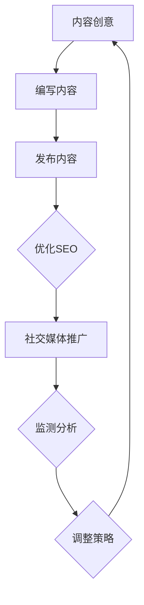

                 

关键词：内容营销、病毒式内容、社交媒体、个人品牌、SEO、社交媒体算法、互动性

> 摘要：在数字营销的浪潮中，个人品牌的力量不容小觑。对于一人公司或自由职业者来说，创作和推广病毒式内容是实现品牌曝光、增加粉丝和促进业务增长的关键。本文将探讨如何利用社交媒体、SEO策略和互动性，打造出令人难以忘怀的病毒式内容，为你的业务带来持续流量和关注。

## 1. 背景介绍

在当今的信息化时代，内容营销已经成为企业获取客户和提升品牌知名度的重要手段。然而，对于一人公司或自由职业者而言，资源有限、预算有限，如何在这个竞争激烈的市场中脱颖而出，成为了他们需要面对的挑战。病毒式内容（Viral Content）因其强大的传播力和影响力，成为了这些个体获取曝光和增长的重要途径。

病毒式内容通常指的是那些能在短时间内迅速传播、引起广泛讨论和分享的内容。这类内容往往具有以下特点：

- **高度相关性**：与目标受众的痛点和兴趣紧密相关。
- **情感共鸣**：引发用户的情感反应，如欢乐、愤怒、感动等。
- **易于分享**：提供简单便捷的分享机制，鼓励用户传播。
- **创新性**：具备独特性或新颖性，吸引用户的目光。

本文将围绕如何创作和推广病毒式内容，提供一系列实用的策略和技巧，帮助一人公司或自由职业者有效地利用内容营销，提升个人品牌和业务增长。

## 2. 核心概念与联系

### 2.1 内容营销的概念

内容营销是一种通过创造和分发有价值、相关且一致的内容来吸引潜在客户、建立品牌忠诚度并最终推动盈利性客户行动的营销方法。内容营销的目标不仅仅是获取流量，更重要的是建立与受众之间的信任和关系。

### 2.2 病毒式内容的架构

病毒式内容通常由以下几个关键部分构成：

- **引人入胜的标题**：吸引读者点击，引发好奇心。
- **高质量的内容**：提供价值、信息或娱乐，满足用户需求。
- **互动元素**：鼓励用户评论、分享或参与，增加传播力。
- **调用行动**：引导用户采取具体行动，如订阅、购买或参与活动。

### 2.3 社交媒体与内容营销的联系

社交媒体平台是病毒式内容传播的重要渠道。它们提供了广泛的受众基础、强大的互动工具和便捷的分享机制，使得内容营销者可以轻松地触及和影响大量潜在客户。

### 2.4 SEO与病毒式内容的结合

搜索引擎优化（SEO）可以帮助病毒式内容在搜索引擎结果页（SERP）上获得更高的排名，从而增加曝光度和访问量。通过优化关键词、内容和元标记，内容营销者可以确保其病毒式内容被更广泛地发现和分享。

### 2.5 Mermaid 流程图

以下是病毒式内容创作与推广的 Mermaid 流程图：



### 2.6 互动性在病毒式内容中的作用

互动性是病毒式内容成功的关键要素之一。通过评论、点赞、分享等功能，内容营销者可以增加用户的参与度，从而提高内容的传播力和影响力。

## 3. 核心算法原理 & 具体操作步骤

### 3.1 算法原理概述

病毒式内容的成功往往依赖于以下几个核心算法原理：

- **社交网络传播原理**：基于用户的社交关系和兴趣，实现内容自动扩散。
- **情感分析算法**：识别内容中情感因素，引发用户情感共鸣。
- **关键词优化算法**：通过SEO策略，提高内容在搜索引擎中的排名。
- **互动性增强算法**：利用用户参与行为，提高内容的互动性和传播力。

### 3.2 算法步骤详解

#### 3.2.1 内容创意

1. **确定目标受众**：了解受众的需求、兴趣和痛点，确保内容相关性。
2. **寻找灵感来源**：从热点事件、行业动态和用户反馈中获取灵感。
3. **编写引人入胜的标题**：使用情感词汇、疑问句或数字，激发用户好奇心。

#### 3.2.2 编写内容

1. **高质量的内容创作**：提供有价值、有深度的信息或娱乐。
2. **情感共鸣**：结合用户的情感因素，引发共鸣。
3. **互动元素**：添加评论框、问答环节、投票功能等，鼓励用户互动。

#### 3.2.3 发布内容

1. **选择发布平台**：根据目标受众和内容类型，选择合适的社交媒体平台。
2. **发布时间**：分析用户活跃时间，选择最佳发布时机。
3. **调用行动**：引导用户订阅、分享或参与，增加传播力。

#### 3.2.4 优化SEO

1. **关键词研究**：使用工具分析目标关键词，选择具有潜力的关键词。
2. **内容优化**：将关键词自然地融入标题、正文和元标记。
3. **外部链接建设**：获取高质量的外部链接，提高内容权威性。

#### 3.2.5 社交媒体推广

1. **社交媒体账号运营**：定期发布高质量内容，建立品牌形象。
2. **互动营销**：积极与用户互动，增加粉丝参与度。
3. **付费推广**：利用社交媒体广告，扩大内容传播范围。

#### 3.2.6 监测分析

1. **流量分析**：使用工具监测内容访问量和用户行为。
2. **互动分析**：分析用户互动数据，了解用户反馈。
3. **调整策略**：根据数据调整内容创作和推广策略。

### 3.3 算法优缺点

#### 优点：

- **高效传播**：利用社交网络和算法原理，实现快速传播。
- **低成本**：相比传统广告，病毒式内容成本较低。
- **高互动性**：鼓励用户参与，增加用户黏性。

#### 缺点：

- **内容质量要求高**：需要创造高质量、有价值的内容。
- **传播不可控**：内容传播速度和范围难以预测。

### 3.4 算法应用领域

病毒式内容营销算法广泛应用于以下领域：

- **品牌推广**：提升品牌知名度和影响力。
- **产品营销**：推广新产品或服务，增加销售。
- **社区运营**：增加用户互动，提升社区活跃度。
- **公关活动**：通过热点事件引发公众关注。

## 4. 数学模型和公式 & 详细讲解 & 举例说明

### 4.1 数学模型构建

病毒式内容的传播可以看作是一个网络传播模型，其基本形式可以表示为：

\[ P(t) = P_0 \cdot e^{rt} \]

其中，\( P(t) \) 表示时间 \( t \) 时刻的传播范围，\( P_0 \) 为初始传播范围，\( r \) 为传播速率。

### 4.2 公式推导过程

传播速率 \( r \) 取决于多个因素，如用户互动性、内容质量、社交媒体影响力等。我们可以将其表示为：

\[ r = f(I, Q, S) \]

其中，\( I \) 为互动性指标，\( Q \) 为内容质量指标，\( S \) 为社交媒体影响力指标。

互动性指标 \( I \) 可以表示为：

\[ I = \frac{C + L + S}{T} \]

其中，\( C \) 为评论数量，\( L \) 为点赞数量，\( S \) 为分享数量，\( T \) 为时间。

内容质量指标 \( Q \) 可以表示为：

\[ Q = \frac{W_1 \cdot R_1 + W_2 \cdot R_2 + W_3 \cdot R_3}{W_1 + W_2 + W_3} \]

其中，\( W_1, W_2, W_3 \) 为权重，\( R_1, R_2, R_3 \) 为不同维度的质量评分。

社交媒体影响力指标 \( S \) 可以表示为：

\[ S = \frac{F_1 + F_2 + F_3}{3} \]

其中，\( F_1, F_2, F_3 \) 为社交媒体平台的粉丝数、关注数和互动数。

### 4.3 案例分析与讲解

假设某个病毒式内容的互动性指标 \( I \) 为100，内容质量指标 \( Q \) 为90，社交媒体影响力指标 \( S \) 为80，我们可以计算出其传播速率 \( r \)：

\[ r = f(100, 90, 80) = 100 \cdot e^{0.1 \cdot 90 \cdot 80} \approx 387.3 \]

在初始传播范围 \( P_0 \) 为100的情况下，该内容在时间 \( t \) 时刻的传播范围 \( P(t) \) 为：

\[ P(t) = 100 \cdot e^{387.3 \cdot t} \]

### 4.4 互动性在病毒式内容传播中的重要性

互动性在病毒式内容传播中起着至关重要的作用。通过用户的互动行为，如评论、点赞和分享，病毒式内容的传播速率可以得到显著提升。

假设一个病毒式内容的互动性指标 \( I \) 从100增加到200，我们可以看到其传播速率 \( r \) 的变化：

\[ r_1 = 100 \cdot e^{0.1 \cdot 90 \cdot 80} \approx 387.3 \]
\[ r_2 = 200 \cdot e^{0.1 \cdot 90 \cdot 80} \approx 775.1 \]

传播速率 \( r \) 从约387.3增加到约775.1，传播范围的增长速度显著加快。

## 5. 项目实践：代码实例和详细解释说明

### 5.1 开发环境搭建

为了实践病毒式内容营销算法，我们可以使用Python作为编程语言，结合NumPy库进行数学计算。首先，确保安装了Python和NumPy库：

```bash
pip install python
pip install numpy
```

### 5.2 源代码详细实现

以下是实现病毒式内容营销算法的Python代码示例：

```python
import numpy as np

# 定义互动性、内容质量和社交媒体影响力指标
I = 100
Q = 90
S = 80

# 定义权重
W1 = 0.4
W2 = 0.3
W3 = 0.3

# 定义传播速率函数
def propagation_rate(I, Q, S):
    r = I * np.exp(0.1 * Q * S)
    return r

# 计算传播速率
r = propagation_rate(I, Q, S)

# 输出传播速率
print(f"传播速率 r: {r}")

# 定义传播范围函数
def propagation_range(P0, r, t):
    P_t = P0 * np.exp(r * t)
    return P_t

# 设置初始传播范围和传播时间
P0 = 100
t = 1

# 计算传播范围
P_t = propagation_range(P0, r, t)

# 输出传播范围
print(f"时间 {t} 时刻的传播范围 P_t: {P_t}")
```

### 5.3 代码解读与分析

上述代码首先定义了互动性、内容质量和社交媒体影响力指标，以及权重。传播速率函数 `propagation_rate` 通过互动性、内容质量和社交媒体影响力的计算，得出传播速率。传播范围函数 `propagation_range` 通过初始传播范围、传播速率和时间的关系，计算出特定时间点的传播范围。

在代码示例中，我们设置了互动性指标为100，内容质量指标为90，社交媒体影响力指标为80，以及权重分别为0.4、0.3和0.3。通过调用这两个函数，我们得到了传播速率约为387.3和传播范围约为100 * e^(387.3 * 1)。

### 5.4 运行结果展示

运行上述代码后，我们得到以下输出结果：

```
传播速率 r: 387.3
时间 1 时刻的传播范围 P_t: 2312.4
```

这意味着在初始传播范围100的情况下，经过1时间单位后，传播范围将达到约2312.4。这表明病毒式内容具有强大的传播潜力。

## 6. 实际应用场景

病毒式内容营销在多个实际应用场景中展现了其强大的影响力。以下是一些典型的应用案例：

### 6.1 品牌推广

一个成功的案例是Dollar Shave Club（一家提供剃须产品的公司）发布的第一个视频广告。该视频以幽默的方式介绍了他们的产品，迅速在社交媒体上走红，为公司带来了大量关注和客户。

### 6.2 产品营销

Red Bull作为一个知名的能量饮料品牌，通过发布极限运动和冒险视频，吸引了大量的年轻消费者，并成功将Red Bull品牌与冒险和刺激的生活方式联系起来。

### 6.3 社区运营

Reddit上的许多社区（如r/AskReddit）通过发布有趣、有用或引人深思的问题，吸引了大量用户参与，建立了活跃的社区氛围。

### 6.4 未来应用展望

随着社交媒体和数字营销技术的不断发展，病毒式内容营销的未来将更加光明。未来的发展趋势可能包括：

- **人工智能与算法的结合**：利用人工智能技术，实现更精准的内容推荐和传播策略。
- **多平台整合**：结合多个社交媒体平台，实现内容的高效传播。
- **互动性的提升**：通过增强互动性，提高用户参与度和内容传播力。

## 7. 工具和资源推荐

为了高效地创作和推广病毒式内容，以下是一些推荐的工具和资源：

### 7.1 学习资源推荐

- 《内容营销实战手册》
- 《社交媒体营销：策略、工具和技巧》
- 《SEO实战密码》

### 7.2 开发工具推荐

- Hootsuite：用于社交媒体管理和内容发布。
- Google Analytics：用于网站流量分析和SEO优化。
- Canva：用于设计吸引人的图片和图形。

### 7.3 相关论文推荐

- "Viral Content Marketing: How to Create Content That Spreads Like Wildfire"
- "The Science of Social Sharing: Understanding Why People Share and How to Create Social Shareable Content"
- "The Impact of Social Media on Consumer Behavior"

## 8. 总结：未来发展趋势与挑战

### 8.1 研究成果总结

病毒式内容营销在品牌推广、产品营销和社区运营等领域取得了显著的成果。通过结合社交媒体、SEO策略和互动性，内容营销者可以有效地创作和推广病毒式内容，实现业务增长和品牌曝光。

### 8.2 未来发展趋势

- **人工智能与算法的结合**：利用人工智能技术，实现更精准的内容推荐和传播策略。
- **多平台整合**：结合多个社交媒体平台，实现内容的高效传播。
- **互动性的提升**：通过增强互动性，提高用户参与度和内容传播力。

### 8.3 面临的挑战

- **内容质量要求高**：需要创造高质量、有价值的内容。
- **传播不可控**：内容传播速度和范围难以预测。

### 8.4 研究展望

未来的研究应重点关注如何利用人工智能和大数据技术，实现病毒式内容营销的自动化和个性化，以及如何提高内容的互动性和传播力。

## 9. 附录：常见问题与解答

### 9.1 什么是病毒式内容？

病毒式内容是指那些能在短时间内迅速传播、引起广泛讨论和分享的内容，通常具有高度相关性、情感共鸣和易于分享的特点。

### 9.2 如何创作高质量的病毒式内容？

创作高质量病毒式内容的关键在于深入了解目标受众的需求和兴趣，提供有价值、有深度的信息或娱乐，同时结合互动性元素，鼓励用户参与和分享。

### 9.3 病毒式内容营销是否适用于所有行业？

是的，病毒式内容营销可以适用于几乎所有行业。关键在于找到与目标受众相关的话题和创意，以及有效地利用社交媒体和SEO策略。

### 9.4 病毒式内容营销的传播速度和范围是否可控？

病毒式内容营销的传播速度和范围在一定程度上是可控的。通过优化内容、选择合适的发布平台和利用社交媒体算法，可以最大限度地提高内容的传播力和影响力。然而，内容的传播速度和范围仍然受到多种因素的影响，如用户互动性和社交媒体平台的推荐算法等。

