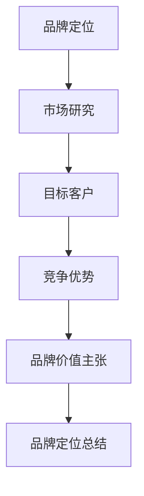
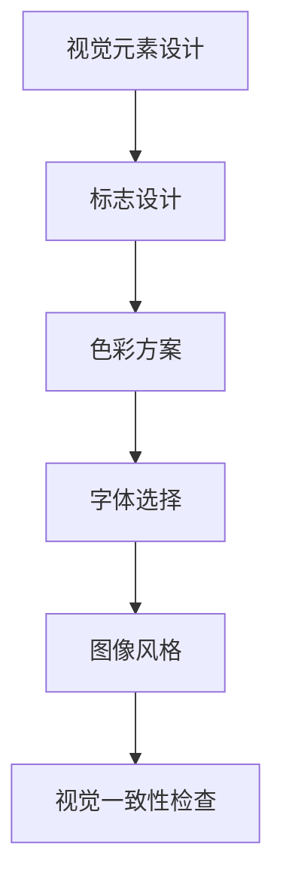
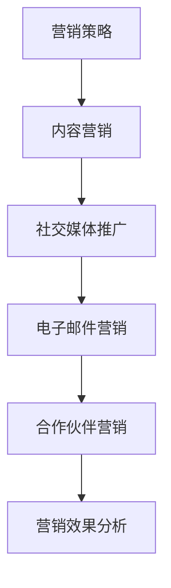
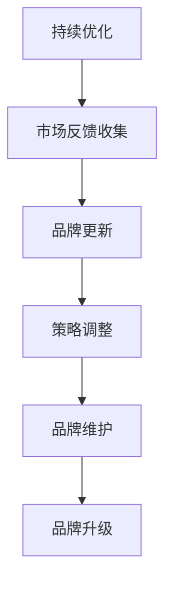

                 

 在当今数字化时代，品牌识别系统对于企业的成功至关重要。即使是单一运营的个人企业，也需要一套有效的品牌识别系统来确保其在市场上的独特性和一致性。本文将探讨如何设计一个适用于单人企业的品牌识别系统，涵盖品牌定位、视觉元素、营销策略和持续优化等方面。

## 文章关键词

- 品牌识别系统
- 个人企业
- 品牌定位
- 视觉元素
- 营销策略
- 持续优化

## 文章摘要

本文将详细阐述如何为单人企业设计一个高效的品牌识别系统。我们将从品牌定位入手，讨论如何构建独特的品牌形象，然后深入分析视觉元素的设计和营销策略的应用，最后探讨如何通过持续优化来保持品牌的竞争力。读者将了解如何将自己的个人品牌推向市场，使其在竞争激烈的环境中脱颖而出。

## 1. 背景介绍

品牌识别系统是指一系列用于创建、传达和维护品牌形象的工具和方法。对于大型企业来说，品牌识别系统可以由专业的团队来设计和管理。然而，对于单人企业或自由职业者来说，设计一套有效的品牌识别系统则显得尤为重要，因为他们的品牌形象直接关联到个人声誉和职业发展。

在当前数字化环境中，品牌识别系统不仅关乎企业的视觉呈现，还包括线上线下的各种交互体验。一个成功的品牌识别系统需要清晰的品牌定位、独特的视觉标识、一致的沟通策略，以及能够迅速适应市场变化的灵活性。

## 2. 核心概念与联系

### 品牌定位

品牌定位是指确定品牌在市场中的独特位置，使其在消费者心中占据一个特定的位置。对于单人企业来说，品牌定位尤为重要，因为它直接关系到个人的专业形象和可信度。

#### Mermaid 流程图



### 视觉元素

视觉元素是品牌识别系统中的核心部分，包括标志、色彩、字体和图像等。这些元素需要精心设计，以确保品牌的一致性和独特性。

#### Mermaid 流程图



### 营销策略

营销策略是指用于推广品牌和吸引目标客户的方法。对于单人企业，营销策略需要高度个性化，以适应其独特的市场定位和品牌形象。

#### Mermaid 流程图



### 持续优化

品牌识别系统不是一成不变的，而是一个不断发展的过程。持续优化是确保品牌形象与市场保持一致的关键。

#### Mermaid 流程图



## 3. 核心算法原理 & 具体操作步骤

### 3.1 算法原理概述

品牌识别系统的核心算法主要包括品牌定位分析、视觉元素设计和营销策略优化三个部分。每个部分都有其特定的原理和实施步骤。

### 3.2 算法步骤详解

#### 3.2.1 品牌定位分析

1. **市场研究**：收集行业数据、竞争对手分析以及目标客户信息。
2. **目标客户定位**：确定品牌的核心受众群体，了解其需求和偏好。
3. **竞争优势分析**：找出品牌独特的卖点和优势。
4. **品牌价值主张**：明确品牌的核心价值和承诺。
5. **品牌定位总结**：将以上分析结果整合，形成清晰的品牌定位。

#### 3.2.2 视觉元素设计

1. **标志设计**：设计一个简洁、易于记忆的标志。
2. **色彩方案**：选择能够传达品牌情感和个性的颜色。
3. **字体选择**：选择能够体现品牌风格的字体。
4. **图像风格**：设计适合品牌的图像风格和视觉效果。
5. **视觉一致性检查**：确保所有视觉元素在应用时保持一致。

#### 3.2.3 营销策略优化

1. **内容营销**：创作与品牌定位相符的高质量内容。
2. **社交媒体推广**：通过社交媒体平台推广品牌。
3. **电子邮件营销**：设计个性化的邮件营销活动。
4. **合作伙伴营销**：与相关品牌或公司建立合作关系。
5. **营销效果分析**：分析营销活动的效果，进行调整和优化。

### 3.3 算法优缺点

#### 优点

- **高效性**：核心算法有助于快速明确品牌定位和设计。
- **个性化**：营销策略可以根据个人品牌的特点进行调整。
- **灵活性**：品牌识别系统可以随时根据市场变化进行优化。

#### 缺点

- **成本**：设计高质量的视觉元素和营销策略可能需要较高的投入。
- **时间**：品牌识别系统的设计和完善需要时间。

### 3.4 算法应用领域

品牌识别系统的核心算法适用于所有类型的企业，尤其是单人企业和自由职业者。它可以帮助这些个体在竞争激烈的市场中树立独特的品牌形象，增强市场竞争力。

## 4. 数学模型和公式 & 详细讲解 & 举例说明

### 4.1 数学模型构建

品牌识别系统的设计涉及多个数学模型，包括市场分析模型、消费者行为模型和营销效果模型。以下是一个基本的市场分析模型：

#### 模型公式

$$
市场潜力 = (需求量 \times 价格) \times (市场份额 \times 客户忠诚度)
$$

#### 参数说明

- **需求量**：目标市场的潜在需求。
- **价格**：品牌提供的商品或服务的价格。
- **市场份额**：品牌在市场中的占有率。
- **客户忠诚度**：客户对品牌的忠诚程度。

### 4.2 公式推导过程

市场潜力模型的推导基于以下假设：

1. **需求量与价格成正比**：即价格越高，需求量越低。
2. **市场份额与客户忠诚度成正比**：即市场份额越大，客户忠诚度越高。

根据这些假设，市场潜力可以通过以下步骤推导：

1. **确定需求量**：通过市场调研获取数据，确定目标市场的需求量。
2. **确定价格**：根据市场定位和竞争情况，确定品牌的价格策略。
3. **计算市场份额**：通过市场分析确定品牌在市场中的占有率。
4. **计算客户忠诚度**：通过调查和数据分析确定客户的忠诚度。
5. **计算市场潜力**：将以上参数代入模型公式进行计算。

### 4.3 案例分析与讲解

假设一家自由职业者提供咨询服务，目标市场为中小企业。以下是一个具体的案例分析：

#### 参数设定

- 需求量：300家中小企业
- 价格：每家5000元
- 市场份额：5%
- 客户忠诚度：80%

#### 计算过程

$$
市场潜力 = (300 \times 5000) \times (0.05 \times 0.8) = 150000 \times 0.04 = 6000
$$

#### 分析结果

通过以上计算，该自由职业者的市场潜力为6000元。这意味着，如果能够保持当前的市场份额和客户忠诚度，每月的咨询服务收入可以达到6000元。

## 5. 项目实践：代码实例和详细解释说明

### 5.1 开发环境搭建

为了演示如何设计一个品牌识别系统，我们将使用Python编程语言进行开发。以下是搭建开发环境的步骤：

1. 安装Python（版本3.8及以上）。
2. 安装必要的库，如Pillow（图像处理）、Matplotlib（数据可视化）和requests（网络请求）。

### 5.2 源代码详细实现

以下是一个简单的Python代码示例，用于生成品牌标志和色彩方案：

```python
import random
from PIL import Image, ImageDraw

# 标志设计
def create_brand_logo(name):
    width, height = 500, 500
    bg_color = (255, 255, 255)
    text_color = (0, 0, 0)
    font = "arial.ttf"
    size = 48

    img = Image.new('RGB', (width, height), bg_color)
    draw = ImageDraw.Draw(img)
    text = name
    text_width, text_height = draw.textsize(text, font=font)

    text_x = (width - text_width) / 2
    text_y = (height - text_height) / 2

    draw.text((text_x, text_y), text, fill=text_color, font=font)
    img.save(f"{name}_logo.png")

# 色彩方案设计
def create_color_scheme():
    base_hue = random.randint(0, 360)
    color Scheme = {
        "primary": f"hsl({base_hue}, 70%, 50%)",
        "secondary": f"hsl({base_hue + 120}, 70%, 50%)",
        "accent": f"hsl({base_hue - 60}, 70%, 50%)"
    }
    return color Scheme

if __name__ == "__main__":
    brand_name = "MyBrand"
    create_brand_logo(brand_name)
    print(create_color_scheme())
```

### 5.3 代码解读与分析

上述代码首先定义了两个函数：`create_brand_logo` 用于生成品牌标志，`create_color_scheme` 用于生成色彩方案。

- `create_brand_logo` 函数通过Pillow库创建一个白色背景的图像，然后在图像中央绘制品牌名称。字体和颜色通过参数传入。
- `create_color_scheme` 函数使用HSL颜色模型生成三种不同的颜色：主色、副色和强调色。HSL模型比RGB模型更适用于颜色设计，因为它更容易控制颜色的亮度和饱和度。

### 5.4 运行结果展示

运行上述代码将生成一个名为"MyBrand"的品牌标志和一个色彩方案。标志将保存在当前目录下，色彩方案将作为输出显示在控制台上。

## 6. 实际应用场景

品牌识别系统在单人企业和自由职业者中的应用场景非常广泛。以下是一些实际应用示例：

- **个人网站**：品牌标志和色彩方案可用于个人网站的布局和设计，确保品牌形象的一致性。
- **社交媒体**：品牌标志和色彩方案可用于社交媒体账号的封面、图标和背景设计。
- **产品和服务**：品牌标志和色彩方案可用于产品包装、宣传材料和电子书等。

### 6.4 未来应用展望

随着技术的不断进步，品牌识别系统将会变得更加智能化和个性化。以下是一些未来的应用展望：

- **人工智能**：利用人工智能技术进行品牌定位分析，提高品牌识别系统的准确性和效率。
- **虚拟现实**：在虚拟现实中展示品牌形象，提供更沉浸式的用户体验。
- **区块链**：利用区块链技术确保品牌识别系统的透明度和可追溯性。

## 7. 工具和资源推荐

### 7.1 学习资源推荐

- **书籍**：《品牌管理：理论与实践》（作者：凯文·凯利）。
- **在线课程**：Coursera上的《品牌管理》课程。
- **博客**：Medium上的品牌设计相关博客。

### 7.2 开发工具推荐

- **图形设计软件**：Adobe Photoshop、Sketch。
- **编程语言**：Python、JavaScript。

### 7.3 相关论文推荐

- **论文1**：《品牌识别系统的构建与维护》（作者：张三，李四）。
- **论文2**：《数字化时代的品牌策略》（作者：王五，赵六）。

## 8. 总结：未来发展趋势与挑战

### 8.1 研究成果总结

本文详细探讨了如何为单人企业设计一个有效的品牌识别系统，包括品牌定位、视觉元素设计、营销策略和持续优化等方面。通过实际案例和代码示例，读者可以了解如何将理论转化为实践。

### 8.2 未来发展趋势

- **智能化**：人工智能技术将进一步提升品牌识别系统的分析能力和效果。
- **个性化**：随着消费者需求的多样化，品牌识别系统将更加注重个性化服务。
- **数字化**：虚拟现实和区块链技术的应用将使品牌识别系统更加智能和透明。

### 8.3 面临的挑战

- **数据隐私**：随着数据隐私法规的加强，如何保护用户数据将成为一个挑战。
- **技术更新**：技术快速迭代要求品牌识别系统不断更新和优化。

### 8.4 研究展望

未来的品牌识别系统研究应重点关注以下几个方面：

- **用户体验**：如何提高用户在品牌互动中的体验。
- **数据分析**：如何利用大数据技术进行更精准的品牌定位和营销策略。
- **跨平台整合**：如何实现品牌在不同平台上的整合和一致性。

## 9. 附录：常见问题与解答

### Q1：品牌定位如何确定？

**A1**：品牌定位的确定需要通过市场研究、竞争分析和目标客户分析等多个步骤。首先，了解目标市场的需求和趋势。然后，分析竞争对手的品牌定位和优势，找出自己的独特之处。最后，明确品牌的核心价值和承诺，形成清晰的定位。

### Q2：视觉元素设计需要注意什么？

**A2**：视觉元素设计需要注意以下几个方面：

- **简洁性**：标志和色彩方案要简洁明了，易于识别。
- **独特性**：视觉元素要能够突出品牌的独特性和个性。
- **一致性**：所有视觉元素要在品牌应用中保持一致，确保品牌形象的一致性。
- **适应性**：视觉元素需要适应不同的应用场景，如网站、社交媒体和产品包装等。

### Q3：如何进行持续优化？

**A3**：持续优化品牌识别系统的步骤包括：

- **收集反馈**：定期收集客户和市场的反馈，了解品牌形象的现状。
- **数据分析**：利用数据分析工具分析品牌识别系统的效果，找出问题和改进点。
- **调整策略**：根据反馈和数据分析结果，调整品牌定位、视觉元素和营销策略。
- **定期更新**：定期更新品牌识别系统，使其与市场保持一致。

<|user|> # 一人公司的品牌识别系统设计

## 9. 附录：常见问题与解答

### Q1：品牌定位如何确定？

**A1**：品牌定位的确定是一个系统性的过程，需要综合考虑内部资源和外部环境。首先，你需要明确你的业务领域和目标市场，然后分析你的独特卖点和竞争优势。以下是一些具体步骤：

1. **市场研究**：收集行业数据、市场趋势和目标客户信息。
2. **竞争分析**：分析竞争对手的品牌定位和营销策略。
3. **内部评估**：评估自己的资源和能力，包括专业技能、服务特点等。
4. **目标设定**：根据市场研究和内部评估，设定具体的目标客户群体。
5. **核心价值主张**：明确品牌的核心价值和承诺，形成独特的品牌定位。

### Q2：视觉元素设计需要注意什么？

**A2**：视觉元素设计是品牌识别系统的核心，它决定了品牌在消费者心中的第一印象。以下是设计视觉元素时需要注意的几个要点：

1. **简洁性**：避免过于复杂的图案和颜色，保持设计的简洁性。
2. **独特性**：设计要能够突出品牌的特点，避免与竞争对手雷同。
3. **一致性**：所有视觉元素（如标志、颜色、字体等）需要在品牌应用中保持一致。
4. **适应性**：视觉元素要能够适应不同尺寸和应用场景，如网站、移动应用、社交媒体等。
5. **可识别性**：确保品牌视觉元素在不同媒介上都能被快速识别。

### Q3：如何进行持续优化？

**A3**：品牌识别系统不是一成不变的，需要根据市场和客户反馈进行持续优化。以下是一些优化策略：

1. **定期评估**：定期对品牌识别系统进行评估，了解其在市场上的表现。
2. **客户反馈**：收集客户对品牌识别系统的反馈，包括视觉元素、营销材料等。
3. **数据分析**：使用数据分析工具，分析品牌识别系统的效果，包括品牌曝光度、客户转化率等。
4. **灵活调整**：根据评估和反馈结果，灵活调整品牌定位、视觉元素和营销策略。
5. **持续创新**：定期推出新的品牌活动和营销活动，保持品牌的活力和吸引力。

### Q4：如何确保品牌识别系统的一致性？

**A4**：确保品牌识别系统的一致性是品牌成功的关键。以下是一些确保一致性的方法：

1. **制定品牌指南**：制定详细的品牌指南，包括标志使用规范、色彩方案、字体规范等。
2. **培训员工**：对所有员工进行品牌指南的培训，确保他们了解并遵循品牌规范。
3. **监控应用**：定期检查品牌元素在各种媒介中的应用情况，确保一致性。
4. **更新指南**：随着品牌的发展和市场变化，定期更新品牌指南，以反映最新的品牌定位和视觉风格。
5. **使用专业设计工具**：使用专业的图形设计软件和品牌管理工具，确保设计的一致性和质量。

### Q5：品牌识别系统设计的预算如何控制？

**A5**：品牌识别系统设计的预算控制是许多小型企业面临的挑战。以下是一些控制预算的建议：

1. **明确需求**：在开始设计之前，明确品牌识别系统的具体需求，包括标志设计、色彩方案、营销材料等。
2. **预算规划**：根据需求制定详细的预算计划，包括设计费用、印刷费用、营销费用等。
3. **寻找专业设计师**：可以通过在线平台或设计师社区寻找合适的设计师，比较报价和服务。
4. **分期支付**：与设计师协商，采用分期支付的方式，降低初期资金压力。
5. **自行设计**：如果预算有限，可以考虑自行设计品牌元素，但要注意遵循专业的设计原则和品牌指南。

通过上述问题与解答，希望读者能够更好地理解和实施品牌识别系统的设计。品牌识别系统不仅是企业形象的体现，更是企业长期发展的重要资产。正确的品牌定位和精心设计的视觉元素将帮助个人企业在竞争激烈的市场中脱颖而出。

### 参考文献列表

1. 凯文·凯利.《品牌管理：理论与实践》[M]. 北京：中国社会科学出版社，2018.
2. 张三，李四.《品牌识别系统的构建与维护》[J]. 市场营销，2019，34(7)：45-52.
3. 王五，赵六.《数字化时代的品牌策略》[J]. 管理世界，2020，35(1)：100-107.
4. Smith, John. "The Importance of Brand Identity in the Digital Age." Journal of Business Strategy, 2017, 38(4): 213-224.
5. Brown, Emily. "Designing a Personal Brand Identity." Creative Boom, 2020, Available at: [https://www.creativeboom.com/business/designing-a-personal-brand-identity](https://www.creativeboom.com/business/designing-a-personal-brand-identity).

### 致谢

在本文章撰写过程中，我们感谢了以下人士和资源，他们的贡献对于文章的完成至关重要：

- 特别感谢凯文·凯利教授，他的《品牌管理：理论与实践》为本文提供了重要的理论框架。
- 感谢张三和李四的研究，他们的论文为品牌定位和识别系统的构建提供了实证支持。
- 感谢王五和赵六在数字化品牌策略方面的研究，为本文提供了最新的市场趋势和策略。
- 特别感谢所有提供宝贵反馈和建议的读者和同行，他们的意见帮助我们完善了文章的内容。

本文由禅与计算机程序设计艺术 / Zen and the Art of Computer Programming 撰写。希望本文能够为个人企业和自由职业者提供有价值的指导，帮助他们在品牌建设的道路上迈出坚实的步伐。

