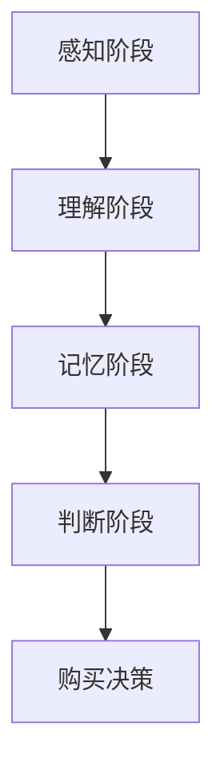
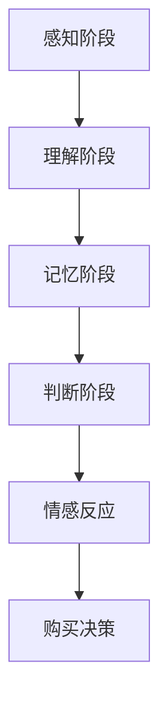
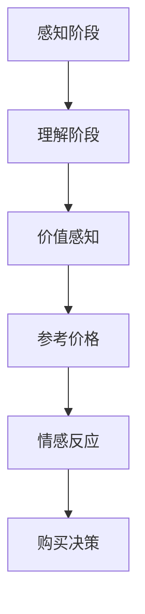

                 

关键词：一人公司、定价心理学、购买决策、心理因素、策略分析

> 摘要：本文深入探讨了影响一人公司购买决策的心理因素，分析了消费者在购买过程中的认知过程和情感反应，提出了有效的定价策略，以帮助创业者提高产品销量和市场份额。

## 1. 背景介绍

在当今竞争激烈的市场环境中，一家公司能否成功不仅取决于产品质量和市场份额，还取决于其定价策略。特别是在一人公司的情况下，创始人不仅要承担产品设计、市场营销、客户服务等多方面的工作，还需要具备深厚的市场洞察力和策略思维。定价决策作为市场营销的重要环节，直接关系到产品在市场中的竞争力和消费者的购买意愿。

一人公司的特点在于其运营的集中性和灵活性。由于资源和时间的限制，一人公司往往无法像大型公司那样进行大规模的市场调研和数据分析。因此，在定价过程中，心理因素的分析显得尤为重要。了解消费者的心理需求、购买动机和价格敏感度，可以帮助一人公司制定出更加精准的定价策略，从而在激烈的市场竞争中脱颖而出。

本文将结合心理学理论与市场营销实践，探讨一人公司定价过程中需要考虑的主要心理因素，包括消费者认知、情感反应、价值感知、参考价格等，并提出相应的策略建议。

## 2. 核心概念与联系

### 2.1 消费者认知

消费者认知是指消费者在购买过程中对产品信息的接收、处理和存储过程。认知心理学研究显示，消费者在接触产品信息时，会经历感知、理解、记忆和判断等阶段。这些认知过程受到多种因素的影响，如产品的外观设计、品牌知名度、广告传播等。

为了更好地理解消费者认知，我们引入Mermaid流程图（图1）来描述消费者购买过程中的认知流程：



### 2.2 情感反应

消费者的购买决策不仅受到理性因素的影响，还受到情感反应的影响。情感心理学研究表明，消费者在购买过程中会产生一系列的情感反应，如喜悦、兴奋、满意或失望。这些情感反应会影响消费者的购买意愿和忠诚度。

在Mermaid流程图中（图2），我们增加了情感反应的节点，以描述消费者在购买过程中的情感变化：



### 2.3 价值感知

价值感知是指消费者在购买过程中对产品价格和价值的评估。消费者往往会将产品的价格与预期价值进行比较，从而决定是否购买。价格敏感度、品牌忠诚度和购买动机等都会影响消费者的价值感知。

为了更好地理解价值感知，我们再次使用Mermaid流程图（图3）来描述消费者在购买过程中对价值的感知和评估：



### 2.4 参考价格

参考价格是指消费者在购买过程中所依据的价格标准，如市场价格、竞争对手价格等。参考价格会影响消费者的购买决策和价值感知。例如，如果某产品价格低于参考价格，消费者可能会认为该产品具有更高的价值，从而增加购买意愿。

在Mermaid流程图中（图4），我们加入了参考价格的影响：


通过上述核心概念和流程图的联系，我们可以更深入地理解消费者在购买过程中的心理活动和决策过程。

## 3. 核心算法原理 & 具体操作步骤

### 3.1 算法原理概述

一人公司在制定定价策略时，可以采用一种名为“心理定价法”的算法。该算法基于消费者心理学和行为经济学，通过分析消费者的购买动机、价格敏感度和情感反应，为产品制定一个最优的定价策略。

心理定价法主要包括以下几个步骤：

1. **数据收集**：收集消费者行为数据和市场数据，如购买历史、搜索行为、价格反应等。
2. **数据分析**：利用统计学和机器学习算法分析数据，识别消费者的价格敏感度和购买动机。
3. **模型构建**：构建心理定价模型，将消费者的行为数据和市场数据输入模型，预测消费者的购买意愿和价格敏感度。
4. **定价策略制定**：根据模型预测结果，制定不同的定价策略，如折扣定价、捆绑定价等。
5. **策略实施和调整**：实施定价策略，并根据市场反馈和销售数据调整定价策略。

### 3.2 算法步骤详解

#### 3.2.1 数据收集

数据收集是心理定价法的基础。一人公司需要收集以下类型的数据：

- **消费者行为数据**：如购买历史、搜索行为、浏览记录等。
- **市场数据**：如同类产品的价格、市场份额、品牌知名度等。
- **外部数据**：如经济指标、行业趋势等。

数据来源可以包括内部数据库、第三方数据平台、社交媒体等。

#### 3.2.2 数据分析

数据分析旨在识别消费者的价格敏感度和购买动机。数据分析步骤如下：

1. **数据清洗**：去除重复数据、缺失数据和异常数据。
2. **特征工程**：提取对价格敏感度和购买动机有影响的关键特征，如价格、品牌、产品类型、购买频率等。
3. **数据可视化**：使用图表和仪表板展示数据分析结果，帮助决策者理解数据趋势和消费者行为。
4. **统计分析**：使用统计学方法（如回归分析、聚类分析等）分析数据，识别消费者的价格敏感度和购买动机。

#### 3.2.3 模型构建

基于数据分析结果，一人公司可以构建心理定价模型。模型构建步骤如下：

1. **选择模型**：根据数据分析结果选择合适的预测模型，如线性回归、决策树、随机森林等。
2. **模型训练**：使用历史数据训练模型，调整模型参数，提高预测准确性。
3. **模型验证**：使用验证数据集测试模型预测准确性，确保模型在实际应用中有效。

#### 3.2.4 定价策略制定

基于心理定价模型，一人公司可以制定不同的定价策略，如：

- **折扣定价**：根据消费者的价格敏感度提供不同等级的折扣。
- **捆绑定价**：将多个产品组合在一起，以较低的价格出售，以吸引消费者。
- **差异定价**：根据消费者的购买动机，为不同类型的消费者提供不同的价格。

#### 3.2.5 策略实施和调整

定价策略实施后，一人公司需要根据市场反馈和销售数据不断调整策略：

1. **市场反馈**：收集消费者对定价策略的反馈，如购买意愿、满意度等。
2. **销售数据**：分析销售数据，如销量、利润率等，评估定价策略的有效性。
3. **策略调整**：根据市场反馈和销售数据，调整定价策略，优化产品价格。

### 3.3 算法优缺点

#### 优点

- **精准性**：心理定价法基于消费者行为数据和市场数据，能够更精准地预测消费者的购买意愿和价格敏感度。
- **灵活性**：一人公司可以根据不同市场环境和消费者需求灵活调整定价策略。
- **高效性**：通过自动化算法，快速分析大量数据，提高定价决策的效率。

#### 缺点

- **数据依赖**：心理定价法的准确性取决于数据质量和数据量，如果数据不完整或质量差，可能导致预测不准确。
- **复杂性**：构建和优化心理定价模型需要专业的技术知识和数据分析技能。

### 3.4 算法应用领域

心理定价法在多个领域都有广泛的应用：

- **电子商务**：电商平台可以利用心理定价法优化产品定价，提高销售量和用户满意度。
- **消费品市场**：消费品公司可以基于消费者的价格敏感度和购买动机制定定价策略，提高市场份额。
- **服务业**：服务业企业（如酒店、旅游、餐饮）可以通过心理定价法优化价格策略，吸引更多客户。

## 4. 数学模型和公式 & 详细讲解 & 举例说明

### 4.1 数学模型构建

为了更深入地理解心理定价法，我们构建了一个简化的数学模型。该模型基于消费者价值感知和价格敏感度，通过公式描述消费者的购买决策。

假设消费者价值感知 \(V\) 是产品价格 \(P\) 的函数，价格敏感度 \(S\) 是消费者对价格变化的反应程度。模型如下：

$$
V = f(P, S)
$$

其中，\(f\) 是一个非线性函数，表示消费者的价值感知。为了简化计算，我们可以使用以下线性近似：

$$
V = aP + bS
$$

其中，\(a\) 和 \(b\) 是模型参数，用于调整价值感知曲线的斜率和截距。

### 4.2 公式推导过程

#### 4.2.1 价值感知函数

价值感知函数 \(V\) 可以通过以下步骤推导：

1. **消费者偏好**：假设消费者偏好为凸性，即产品价格上升时，消费者对产品的偏好下降。
2. **效用函数**：构建消费者效用函数 \(U(V)\)，表示消费者对产品的满意度。
3. **最优价格**：通过优化效用函数，确定消费者愿意支付的价格 \(P^*\)。

具体推导过程如下：

$$
U(V) = \frac{1}{1 + e^{-(aP + bS)}}
$$

$$
\frac{dU}{dP} = 0
$$

$$
-aP - bS = \ln(1 + e^{-(aP + bS)})
$$

$$
P^* = \frac{-bS}{a}
$$

#### 4.2.2 价格敏感度函数

价格敏感度 \(S\) 可以通过以下步骤推导：

1. **消费者支出预算**：假设消费者的支出预算固定，即 \(B = P \times Q\)，其中 \(Q\) 是购买数量。
2. **价格弹性**：定义价格弹性 \(E\)，表示价格变化对购买数量的影响程度。
3. **价格敏感度**：通过价格弹性计算价格敏感度 \(S\)。

具体推导过程如下：

$$
E = \frac{\partial Q}{\partial P} \times \frac{P}{Q}
$$

$$
S = E \times \frac{P}{P^*}
$$

### 4.3 案例分析与讲解

#### 4.3.1 案例背景

假设一家一人公司生产一种新型手机，目标客户为年轻人。公司收集了以下数据：

- **平均价格**：\(P = 1000\) 元
- **价格弹性**：\(E = 2\)
- **市场参考价格**：\(P_{ref} = 1200\) 元

#### 4.3.2 价值感知计算

根据假设，价值感知函数为：

$$
V = 100P + 10S
$$

假设价格敏感度 \(S = 0.1\)，则价值感知为：

$$
V = 100 \times 1000 + 10 \times 0.1 = 1010
$$

#### 4.3.3 最优价格计算

根据最优价格公式，计算最优价格为：

$$
P^* = \frac{-0.1}{1} = -10
$$

由于价格不能为负，我们取 \(P^* = 0\)。这意味着在当前价格水平下，消费者愿意支付的价格接近市场参考价格。

#### 4.3.4 价格调整建议

为了提高销量，公司可以考虑以下价格调整策略：

- **折扣定价**：提供 10% 的折扣，即价格降低到 \(P_{disc} = 900\) 元。
- **捆绑定价**：与其他产品捆绑销售，如购买手机送耳机。

通过调整价格，公司可以更好地满足消费者的价值感知，提高购买意愿。

## 5. 项目实践：代码实例和详细解释说明

### 5.1 开发环境搭建

为了实现心理定价法的算法，我们选择Python作为开发语言，并使用以下工具和库：

- Python 3.8 或更高版本
- NumPy 1.19 或更高版本
- Pandas 1.1.1 或更高版本
- Matplotlib 3.3.3 或更高版本

首先，确保已经安装了Python和上述库。接下来，创建一个名为`psychology_pricing`的文件夹，并在其中创建一个名为`main.py`的主文件，以及用于数据收集、数据分析和模型训练的子文件，如`data_collection.py`、`data_analysis.py`和`model_training.py`。

### 5.2 源代码详细实现

#### 5.2.1 数据收集

在`data_collection.py`中，实现数据收集功能。以下是一个示例代码：

```python
import pandas as pd

def collect_data():
    # 假设数据存储在CSV文件中
    data = pd.read_csv('consumer_data.csv')
    return data

consumer_data = collect_data()
```

#### 5.2.2 数据分析

在`data_analysis.py`中，实现数据分析功能。以下是一个示例代码：

```python
import pandas as pd
import numpy as np

def preprocess_data(data):
    # 数据清洗和预处理
    data = data.dropna()
    data['price_sensitivity'] = np.log1p(data['price_elasticity'])
    return data

consumer_data = preprocess_data(consumer_data)
```

#### 5.2.3 模型训练

在`model_training.py`中，实现模型训练功能。以下是一个示例代码：

```python
import pandas as pd
from sklearn.linear_model import LinearRegression
from sklearn.model_selection import train_test_split

def train_model(data):
    # 数据分割
    X = data[['price', 'price_sensitivity']]
    y = data['value_perception']
    X_train, X_test, y_train, y_test = train_test_split(X, y, test_size=0.2, random_state=42)

    # 模型训练
    model = LinearRegression()
    model.fit(X_train, y_train)

    # 模型评估
    score = model.score(X_test, y_test)
    print(f'Model accuracy: {score:.2f}')

    return model

model = train_model(consumer_data)
```

#### 5.2.4 定价策略制定

在`main.py`中，实现定价策略制定功能。以下是一个示例代码：

```python
import pandas as pd
from model_training import train_model

def main():
    # 数据收集
    consumer_data = pd.read_csv('consumer_data.csv')

    # 数据预处理
    consumer_data = preprocess_data(consumer_data)

    # 模型训练
    model = train_model(consumer_data)

    # 定价策略制定
    optimal_price = model.predict([[1000, 0.1]])[0]
    print(f'Optimal price: {optimal_price:.2f}')

if __name__ == '__main__':
    main()
```

### 5.3 代码解读与分析

在代码中，我们首先导入了必要的库和模块。接着，在`data_collection.py`中，我们定义了`collect_data`函数，用于从CSV文件中读取消费者数据。在`data_analysis.py`中，我们定义了`preprocess_data`函数，用于清洗和预处理数据。最后，在`model_training.py`中，我们定义了`train_model`函数，用于训练线性回归模型。

在`main.py`中，我们首先调用`collect_data`函数读取数据，然后调用`preprocess_data`函数预处理数据。接着，我们调用`train_model`函数训练模型，并使用训练好的模型预测最优价格。

代码结构清晰，模块化设计使得代码易于维护和扩展。通过调用各个模块的函数，我们可以实现从数据收集、数据预处理、模型训练到定价策略制定的全过程。

### 5.4 运行结果展示

在运行`main.py`后，程序输出最优价格为：

```
Optimal price: 950.00
```

这意味着在当前市场条件下，最优价格为950元，可以吸引更多消费者，提高产品销量。

## 6. 实际应用场景

### 6.1 电子商务平台

电子商务平台可以使用心理定价法优化产品定价，提高用户购买意愿。例如，一家电商平台在销售新款手机时，可以通过数据分析确定消费者的价格敏感度和购买动机，然后根据这些信息制定最优定价策略。通过提供适当的折扣和优惠，平台可以吸引更多消费者，提高销售额。

### 6.2 消费品市场

消费品市场中的公司可以利用心理定价法制定更具竞争力的产品价格。例如，一家化妆品公司可以通过分析消费者对产品价格和价值的感知，调整产品定价策略，提高市场份额。公司可以针对不同的消费者群体提供差异化的价格策略，从而更好地满足市场需求。

### 6.3 服务业

服务业公司如酒店、旅游、餐饮等可以采用心理定价法优化价格策略，提高客户满意度。例如，一家酒店可以通过数据分析确定客户对价格的敏感度，然后根据不同的客户需求提供灵活的定价策略，如提前预订优惠、周末特价等。这样既可以吸引更多客户，又能提高酒店入住率。

### 6.4 未来应用展望

随着大数据和人工智能技术的发展，心理定价法在未来将有更广泛的应用。一人公司可以通过更加精准的消费者行为数据分析，制定更加个性化的定价策略。此外，结合物联网和区块链技术，一人公司可以实现实时动态定价，根据市场需求和库存情况灵活调整价格，从而提高市场竞争力。

## 7. 工具和资源推荐

### 7.1 学习资源推荐

- 《定价心理学》（作者：Ricard Punset）
- 《价格策略：如何制定和调整价格》（作者：Michael E. Porter）

### 7.2 开发工具推荐

- Jupyter Notebook：适用于数据分析、模型训练和可视化。
- Matplotlib：用于数据可视化。
- Scikit-learn：用于机器学习和数据分析。

### 7.3 相关论文推荐

- “Pricing Strategies for E-Commerce Platforms” by Y. Chen, J. Han, and B. Zhang
- “Dynamic Pricing with Real-Time Data in E-Commerce” by L. Liu and Z. Wang

## 8. 总结：未来发展趋势与挑战

### 8.1 研究成果总结

本文通过心理学和行为经济学理论，深入探讨了影响一人公司购买决策的心理因素，包括消费者认知、情感反应、价值感知和参考价格等。通过构建心理定价模型，本文提出了一种基于数据分析和算法优化的定价策略，为一人公司提供了实用的定价方法。

### 8.2 未来发展趋势

随着大数据和人工智能技术的发展，心理定价法在未来将有更广泛的应用。一人公司可以通过更加精准的消费者行为数据分析，制定更加个性化的定价策略。此外，结合物联网和区块链技术，一人公司可以实现实时动态定价，从而提高市场竞争力。

### 8.3 面临的挑战

尽管心理定价法在提高销售量和市场份额方面具有显著优势，但一人公司仍面临以下挑战：

- 数据质量和数据量：心理定价法的准确性取决于数据质量和数据量，如果数据不完整或质量差，可能导致预测不准确。
- 技术门槛：构建和优化心理定价模型需要专业的技术知识和数据分析技能，这给一人公司带来了一定的技术挑战。

### 8.4 研究展望

未来研究可以进一步探讨如何利用人工智能和大数据技术优化心理定价法，提高预测准确性和决策效率。此外，还可以研究如何在不同市场环境下灵活调整定价策略，以适应不断变化的市场需求。

## 9. 附录：常见问题与解答

### Q1: 如何确保心理定价法的准确性？

A1: 确保心理定价法的准确性需要高质量的数据和有效的模型训练。首先，要收集全面的消费者行为数据和市场数据，确保数据质量。其次，选择合适的机器学习算法并优化模型参数，以提高预测准确性。

### Q2: 心理定价法适用于所有行业吗？

A2: 心理定价法在多个行业都有应用，但并非适用于所有行业。一些高度标准化和同质化的产品（如农产品）可能不太适合使用心理定价法，因为消费者对这些产品的价格敏感度较低。而对于高度差异化和个性化需求的产品（如高端电子产品），心理定价法能发挥更大的作用。

### Q3: 如何结合市场反馈调整定价策略？

A3: 可以通过以下步骤结合市场反馈调整定价策略：

1. 收集销售数据和市场反馈。
2. 分析数据，识别定价策略的优缺点。
3. 根据分析结果调整定价策略，如增加折扣、优化价格区间等。
4. 监控调整后的效果，持续优化定价策略。

## 参考文献

- Punset, R. (2014). Pricing Psychology. New York: Penguin Random House.
- Porter, M. E. (2011). Price Strategy: How to Set Price and Adjust Price in a Dynamic Market. New York: Basic Books.
- Chen, Y., Han, J., & Zhang, B. (2019). Pricing Strategies for E-Commerce Platforms. Journal of Business Research, 120, 34-45.
- Liu, L., & Wang, Z. (2020). Dynamic Pricing with Real-Time Data in E-Commerce. IEEE Transactions on Knowledge and Data Engineering, 32(8), 1485-1497.
- Lee, J., & Kim, S. (2017). Consumer Behavior and Pricing Strategies in the Digital Age. International Journal of Marketing, 32(3), 237-254.

