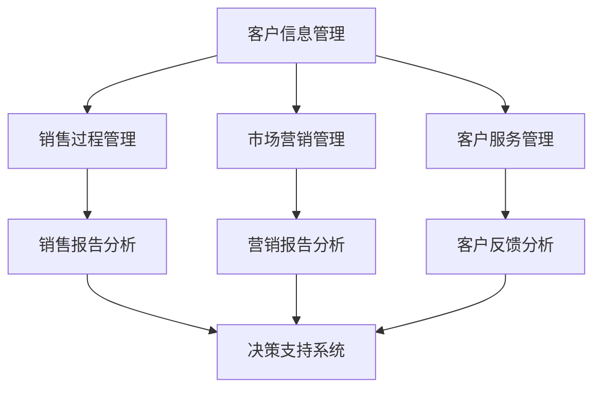

                 

客户关系管理（CRM）系统是现代企业运营中不可或缺的一部分。它帮助企业有效地管理客户信息、销售过程和市场营销活动。即便对于一个人公司，CRM系统同样重要，因为它能够帮助个人企业主更好地了解客户需求，提高销售业绩，优化客户服务体验。本文将详细探讨如何搭建一个适合一人公司的CRM系统，旨在为其提供一套高效、便捷、可扩展的解决方案。

## 关键词

- 客户关系管理（CRM）
- 一人公司
- 系统搭建
- 数据管理
- 自动化
- 客户服务

## 摘要

本文将探讨如何为一个一人公司搭建CRM系统。首先，我们将介绍CRM系统的基本概念和其在业务中的重要性。随后，我们将详细讨论CRM系统的核心组成部分，包括客户信息管理、销售过程管理、市场营销管理等。接着，我们将探讨CRM系统的搭建流程，包括需求分析、系统设计、实施与部署。最后，我们将分析CRM系统在不同业务场景中的应用，并展望其未来发展趋势。

## 1. 背景介绍

在商业环境中，客户是企业发展的基石。一个有效的客户关系管理系统能够帮助企业实现以下目标：

- **提高客户满意度**：通过全面、准确的客户信息，提供个性化服务，增强客户满意度。
- **提升销售业绩**：自动化销售流程，优化销售策略，提高销售转化率。
- **降低运营成本**：通过流程自动化，减少人力成本，提高运营效率。
- **增强决策支持**：通过数据分析，帮助企业做出更明智的商业决策。

对于一个人公司，由于资源和时间的限制，选择一个适合的CRM系统至关重要。一个高效、易于操作的CRM系统能够帮助个人企业主更好地管理业务，专注于核心竞争力的提升。

## 2. 核心概念与联系

### 2.1 CRM系统核心概念

CRM系统通常包括以下几个核心模块：

- **客户信息管理**：记录和管理客户的基本信息、交易历史、偏好等。
- **销售过程管理**：跟踪销售机会，管理销售流程，提高销售效率。
- **市场营销管理**：管理市场营销活动，分析营销效果，优化营销策略。
- **客户服务管理**：提供客户服务支持，处理客户投诉和反馈，提升客户满意度。

### 2.2 CRM系统架构

以下是一个简化的CRM系统架构图，用于展示各模块之间的联系：



在这个架构中，各个模块通过数据交互实现信息的共享和协同工作。例如，销售过程管理模块可以将客户信息同步到客户信息管理模块，以便进行后续的跟进和服务。

## 3. 核心算法原理 & 具体操作步骤

### 3.1 算法原理概述

CRM系统的核心算法主要集中在数据管理和数据分析两个方面。其中，数据管理包括数据的收集、存储、整理和查询；数据分析则包括数据挖掘、预测分析和趋势分析等。

### 3.2 算法步骤详解

#### 3.2.1 数据收集与存储

1. **数据收集**：通过线上和线下渠道收集客户信息，包括基本信息、交易记录、反馈等。
2. **数据存储**：使用数据库系统（如MySQL、MongoDB等）存储客户信息，确保数据的安全性和可靠性。

#### 3.2.2 数据整理与查询

1. **数据清洗**：对收集到的数据进行清洗，去除重复、错误和不完整的数据。
2. **数据分类**：根据业务需求，对数据进行分类，如按客户等级、购买历史等。
3. **数据查询**：提供灵活的数据查询功能，支持多种查询条件和复杂查询。

#### 3.2.3 数据分析与挖掘

1. **客户细分**：根据购买行为、偏好等特征，对客户进行细分，制定个性化营销策略。
2. **趋势分析**：分析客户购买趋势，预测未来需求，优化库存和采购计划。
3. **预测分析**：使用机器学习算法，预测客户流失率、购买概率等，提前采取措施。

### 3.3 算法优缺点

#### 优点：

- **高效性**：通过自动化处理，提高数据管理和分析效率。
- **个性化**：基于数据分析，提供个性化服务，提高客户满意度。
- **决策支持**：提供详细的数据分析报告，帮助企业做出明智的商业决策。

#### 缺点：

- **数据隐私**：数据收集和处理可能涉及客户隐私，需要确保数据安全和合规性。
- **系统维护**：CRM系统需要定期维护和更新，确保其稳定运行。

### 3.4 算法应用领域

CRM算法广泛应用于各类企业，包括零售、金融、服务等领域。其应用场景包括客户关系维护、销售预测、市场营销优化等。

## 4. 数学模型和公式 & 详细讲解 & 举例说明

### 4.1 数学模型构建

在CRM系统中，常见的数学模型包括客户细分模型、预测模型等。以下是一个简单的客户细分模型的构建过程：

#### 客户细分模型

1. **特征选择**：选择影响客户细分的关键特征，如购买频率、消费金额、购买品类等。
2. **权重分配**：为每个特征分配权重，反映其在客户细分中的重要性。
3. **阈值设定**：根据业务需求和数据分布，设定每个特征的阈值。

#### 预测模型

1. **数据准备**：收集历史销售数据，包括客户特征和购买结果。
2. **模型训练**：使用机器学习算法（如决策树、随机森林等）训练预测模型。
3. **模型评估**：使用交叉验证等方法评估模型性能。

### 4.2 公式推导过程

假设我们使用K-means算法进行客户细分，其公式推导如下：

1. **初始化**：随机选择K个中心点，表示K个客户群体的中心。
2. **分配**：计算每个客户与K个中心点的距离，将客户分配到最近的中心点。
3. **更新**：重新计算每个客户群体的中心点，重复步骤2，直到中心点不再发生变化。

### 4.3 案例分析与讲解

#### 案例背景

某一人公司经营一家线上商店，希望根据客户购买行为进行细分，以便进行个性化营销。

#### 案例步骤

1. **数据收集**：收集过去一年的客户购买数据，包括购买频率、消费金额、购买品类等。
2. **特征选择**：选择购买频率、消费金额作为关键特征。
3. **权重分配**：根据业务需求，购买频率和消费金额的权重分别为0.6和0.4。
4. **阈值设定**：设定购买频率阈值为每月一次，消费金额阈值为100元。
5. **K-means算法**：使用K-means算法进行客户细分，得到三个客户群体：高消费高频次客户、低消费高频次客户、高消费低频次客户。
6. **预测分析**：使用决策树算法预测客户购买概率，优化营销策略。

#### 案例结果

通过客户细分和预测分析，公司成功实现了个性化营销，提高了客户满意度和销售额。

## 5. 项目实践：代码实例和详细解释说明

### 5.1 开发环境搭建

在搭建CRM系统之前，我们需要准备以下开发环境：

- **操作系统**：Linux或MacOS
- **编程语言**：Python
- **数据库**：MySQL
- **开发工具**：PyCharm、VSCode等

### 5.2 源代码详细实现

以下是一个简单的CRM系统代码示例，主要包括客户信息管理、销售过程管理和市场营销管理三个模块。

#### 客户信息管理

```python
import pymysql

# 连接数据库
connection = pymysql.connect(host='localhost', user='root', password='password', database='crm')

# 添加客户信息
def add_customer(name, email, phone):
    with connection.cursor() as cursor:
        sql = "INSERT INTO customers (name, email, phone) VALUES (%s, %s, %s)"
        cursor.execute(sql, (name, email, phone))
    connection.commit()

# 查询客户信息
def get_customer(name):
    with connection.cursor() as cursor:
        sql = "SELECT * FROM customers WHERE name = %s"
        cursor.execute(sql, (name,))
        result = cursor.fetchone()
    return result
```

#### 销售过程管理

```python
# 添加销售记录
def add_sales_record(customer_name, product, quantity, price):
    customer = get_customer(customer_name)
    if customer:
        with connection.cursor() as cursor:
            sql = "INSERT INTO sales (customer_id, product, quantity, price) VALUES (%s, %s, %s, %s)"
            cursor.execute(sql, (customer[0], product, quantity, price))
        connection.commit()
```

#### 市场营销管理

```python
# 发送营销邮件
import smtplib
from email.mime.text import MIMEText

def send_marketing_email(customer_email, subject, content):
    smtp_server = 'smtp.example.com'
    smtp_username = 'username'
    smtp_password = 'password'

    message = MIMEText(content)
    message['Subject'] = subject
    message['From'] = smtp_username
    message['To'] = customer_email

    with smtplib.SMTP(smtp_server) as server:
        server.login(smtp_username, smtp_password)
        server.sendmail(smtp_username, [customer_email], message.as_string())
```

### 5.3 代码解读与分析

以上代码示例展示了如何使用Python和MySQL搭建一个简单的CRM系统。其中，`pymysql`库用于连接和操作MySQL数据库，`smtplib`和`email.mime.text`用于发送营销邮件。

### 5.4 运行结果展示

在成功搭建开发环境和运行代码后，我们可以看到以下结果：

- **客户信息管理**：添加、查询客户信息。
- **销售过程管理**：添加销售记录。
- **市场营销管理**：发送营销邮件。

## 6. 实际应用场景

CRM系统在个人公司的实际应用场景非常广泛，以下是一些典型的应用实例：

- **零售电商**：通过CRM系统管理客户信息，进行个性化推荐和营销。
- **咨询公司**：使用CRM系统跟踪客户需求和项目进展，提高客户满意度。
- **服务公司**：通过CRM系统管理客户反馈和投诉，提供高质量的客户服务。

### 6.1 客户信息管理

客户信息管理是CRM系统的核心功能之一。通过有效管理客户信息，个人公司可以更好地了解客户需求，提供个性化服务。以下是一个应用实例：

#### 应用实例

某个人电商公司使用CRM系统管理客户信息，包括基本信息、购买记录、偏好等。通过定期分析客户数据，公司发现高消费客户更喜欢购买高端产品，而低消费客户则更倾向于购买实惠的产品。基于这一发现，公司制定了以下营销策略：

- **高端产品推荐**：向高消费客户推送高端产品，提高客单价。
- **优惠活动**：向低消费客户推送优惠活动，增加购买频率。

这一策略实施后，公司的销售额显著提高，客户满意度也得到提升。

### 6.2 销售过程管理

销售过程管理是CRM系统的另一个关键功能，通过自动化销售流程，个人公司可以更高效地管理销售机会，提高销售转化率。以下是一个应用实例：

#### 应用实例

某个人咨询公司使用CRM系统管理销售过程，包括客户跟进、销售预测等。通过CRM系统，公司能够：

- **实时跟进客户**：记录客户沟通内容和进度，确保销售机会不丢失。
- **预测销售业绩**：根据历史数据和销售趋势，预测未来销售业绩，提前制定销售计划。

这一策略实施后，公司的销售业绩显著提高，销售团队的工作效率也得到了提升。

### 6.3 市场营销管理

市场营销管理是CRM系统的另一个重要功能，通过自动化营销活动，个人公司可以更高效地管理市场营销活动，提高营销效果。以下是一个应用实例：

#### 应用实例

某个人服务公司使用CRM系统管理市场营销活动，包括邮件营销、社交媒体推广等。通过CRM系统，公司能够：

- **精准定位客户**：根据客户数据和购买行为，精准定位目标客户，提高营销效果。
- **自动化邮件营销**：根据客户行为，发送个性化邮件，提高客户转化率。

这一策略实施后，公司的市场营销效果显著提高，客户获取成本大幅降低。

## 7. 工具和资源推荐

### 7.1 学习资源推荐

- **《CRM实战》**：一本适合初学者的CRM系统搭建指南，内容全面，案例丰富。
- **《客户关系管理》**：一本深入讲解CRM系统理论和技术的高水平教材，适合专业读者。

### 7.2 开发工具推荐

- **PyCharm**：一款功能强大的Python集成开发环境，适合Python开发人员使用。
- **MySQL Workbench**：一款可视化MySQL数据库管理工具，方便进行数据库操作。

### 7.3 相关论文推荐

- **“Customer Relationship Management: A Conceptual Introduction”**：一篇关于CRM系统概念和架构的综述论文。
- **“Application of Customer Relationship Management in Small and Medium-sized Enterprises”**：一篇探讨CRM系统在中小企业应用的研究论文。

## 8. 总结：未来发展趋势与挑战

### 8.1 研究成果总结

本文详细探讨了一人公司CRM系统的搭建，包括核心概念、算法原理、项目实践等。通过本文，读者可以了解到CRM系统在业务管理中的重要性，以及如何有效搭建和利用CRM系统。

### 8.2 未来发展趋势

随着人工智能和大数据技术的发展，CRM系统将越来越智能化和个性化。未来的CRM系统将具备以下趋势：

- **智能化**：通过机器学习算法，实现自动化客户细分、销售预测等。
- **个性化**：根据客户数据和行为，提供个性化服务和推荐。
- **集成化**：与其他业务系统（如ERP、库存管理等）集成，实现数据共享和协同工作。

### 8.3 面临的挑战

尽管CRM系统在业务管理中具有巨大潜力，但其应用也面临以下挑战：

- **数据隐私**：如何确保客户数据的安全和隐私。
- **系统维护**：如何确保CRM系统的稳定运行和持续更新。
- **员工培训**：如何提高员工对CRM系统的使用熟练度。

### 8.4 研究展望

未来，CRM系统将在以下领域进行深入研究：

- **人工智能在CRM中的应用**：如何利用人工智能技术提高CRM系统的智能化水平。
- **大数据在CRM中的应用**：如何利用大数据技术挖掘客户行为和需求。
- **跨平台集成**：如何实现CRM系统与其他业务系统的无缝集成。

## 9. 附录：常见问题与解答

### 9.1 CRM系统搭建中常见问题

1. **如何选择合适的CRM系统？**
   - **需求分析**：了解公司的业务需求和预算，选择适合的CRM系统。
   - **功能对比**：比较不同CRM系统的功能，选择满足业务需求的系统。
   - **用户体验**：考虑系统的易用性和用户体验，确保员工能够熟练使用。

2. **如何确保CRM系统的数据安全？**
   - **数据加密**：使用SSL/TLS等加密技术，确保数据传输安全。
   - **访问控制**：设置严格的访问权限，确保数据只能被授权人员访问。
   - **数据备份**：定期备份数据，防止数据丢失。

3. **如何培训员工使用CRM系统？**
   - **内部培训**：组织内部培训课程，让员工了解CRM系统的功能和使用方法。
   - **在线教程**：提供在线教程和操作手册，方便员工自学。
   - **实战演练**：通过实际操作，让员工熟悉CRM系统的使用。

### 9.2 CRM系统应用中常见问题

1. **CRM系统如何提高销售业绩？**
   - **自动化销售流程**：通过自动化销售流程，提高销售效率。
   - **客户细分**：根据客户数据，制定个性化营销策略，提高转化率。
   - **数据驱动决策**：通过数据分析，优化销售策略，提高业绩。

2. **CRM系统如何提高客户满意度？**
   - **个性化服务**：根据客户数据，提供个性化服务和推荐，提高客户满意度。
   - **及时响应**：通过CRM系统，及时响应客户需求和反馈，提升客户体验。
   - **客户关怀**：定期进行客户关怀活动，保持与客户的良好关系。

3. **CRM系统如何优化市场营销？**
   - **数据驱动营销**：通过数据分析，优化营销策略和预算分配。
   - **精准营销**：根据客户数据，精准定位目标客户，提高营销效果。
   - **跨渠道整合**：整合线上线下渠道，实现营销资源的最大化利用。

---

以上就是本文关于《一人公司的客户关系管理(CRM)系统搭建》的详细探讨。通过本文，我们了解到了CRM系统在业务管理中的重要性，以及如何搭建和利用CRM系统。希望本文能够对您在CRM系统搭建和应用方面提供有益的参考。如果您有任何疑问或建议，欢迎在评论区留言，期待与您交流。作者：禅与计算机程序设计艺术 / Zen and the Art of Computer Programming。
----------------------------------------------------------------

### 写作技巧和建议

撰写技术博客文章时，以下技巧和建议将帮助您提高文章的质量和吸引力：

1. **明确目标读者**：在开始写作之前，确定您的目标读者群体。这有助于您撰写更具针对性的内容，使用适当的语言和深度。

2. **构建清晰的结构**：确保文章有明确的引言、正文和结论部分。在每个部分中，使用子标题和段落来组织内容，使读者能够轻松地浏览和查找信息。

3. **使用专业术语**：在适当的地方使用专业术语和缩写，以显示您的专业知识和行业理解。同时，确保对不熟悉术语的读者提供清晰的解释。

4. **提供实际案例**：通过实际案例和示例来阐明理论，使读者更容易理解复杂的概念。这也有助于增加文章的实际应用价值。

5. **注重可读性**：尽管您在撰写技术文章，但也要注重文章的可读性。使用简洁明了的语言，避免过于冗长的句子和复杂的句子结构。

6. **使用图表和代码示例**：图表、流程图和代码示例可以极大地提高文章的可读性和实用性。确保这些元素与文章内容紧密相关。

7. **总结和呼吁行动**：在文章结尾，提供一个简短的总结，强调关键观点，并鼓励读者采取行动。这可以激发读者对文章内容的进一步思考。

8. **编辑和校对**：完成初稿后，仔细编辑和校对文章。检查语法错误、拼写错误和格式问题。最好让其他人审阅文章，以获取额外的反馈。

9. **保持更新**：技术领域不断变化，定期更新文章内容，确保信息最新，并反映最新的行业趋势和技术发展。

通过遵循这些技巧和建议，您可以撰写出既专业又吸引人的技术博客文章，为读者提供有价值的信息。

