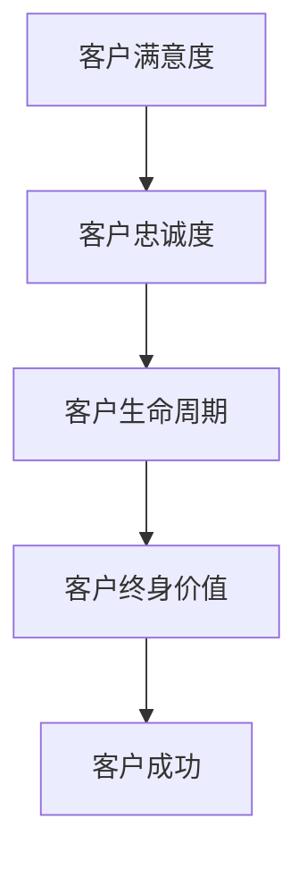

                 

关键词：一人公司、客户成功、客户终身价值、实践方法、策略、IT领域

> 摘要：本文将探讨一人公司的客户成功策略，通过分析如何提高客户终身价值，为一人公司提供实用的实践方法。文章将从核心概念、算法原理、数学模型、项目实践、实际应用场景、工具和资源推荐等方面，全面阐述一人公司如何提升客户满意度和忠诚度，实现客户终身价值的最大化。

## 1. 背景介绍

在当今竞争激烈的市场环境中，企业面临着诸多挑战。一人公司，作为一种新兴的企业形态，其运营模式具有灵活性、高效性和低成本的特点。然而，一人公司在资源有限、市场占有率较低的情况下，如何实现客户成功，提高客户终身价值，成为企业发展的关键。

本文旨在为一人公司提供一套完整的客户成功策略，通过深入分析客户终身价值的提升方法，帮助一人公司实现客户满意度和忠诚度的双重提升。文章将结合实际案例，探讨客户成功策略的核心原理和实践方法。

### 1.1 一人公司的定义与特征

一人公司，顾名思义，是由一个人独立创办和经营的企业。这种企业形态具有以下几个特征：

1. **独立性**：一人公司由创办人独立出资、独立经营，无需依赖外部资本。
2. **灵活性**：一人公司可以根据市场需求和个人能力，灵活调整经营策略和产品线。
3. **高效性**：一人公司管理简单，决策快速，可以迅速响应市场变化。
4. **低成本**：一人公司运营成本较低，不需要承担过多的员工薪酬和福利。

### 1.2 客户终身价值的定义与重要性

客户终身价值（Customer Lifetime Value，CLV）是指一个客户在整个生命周期中为企业带来的总收益。客户终身价值越高，说明客户对企业越有价值，也越能体现企业的竞争力。

在竞争激烈的市场环境中，提高客户终身价值具有重要意义：

1. **稳定收入**：客户终身价值高，意味着客户为企业带来的收入稳定，有利于企业长期发展。
2. **降低成本**：提高客户终身价值，可以减少新客户获取成本，降低营销费用。
3. **提高竞争力**：客户终身价值高，说明企业在客户心中具有较高的品牌影响力，有助于提升市场竞争力。
4. **优化产品和服务**：通过分析客户终身价值，企业可以更好地了解客户需求，优化产品和服务，提高客户满意度。

## 2. 核心概念与联系

为了更好地理解客户成功策略，我们需要首先了解几个核心概念，包括客户满意度、客户忠诚度、客户生命周期等。以下是这些概念之间的联系，以及一个简化的 Mermaid 流程图，以展示这些概念之间的关系。



### 2.1 客户满意度

客户满意度是指客户对产品或服务的满意程度。高满意度意味着客户对企业的产品和服务感到满意，愿意继续购买和使用。

### 2.2 客户忠诚度

客户忠诚度是指客户对企业品牌的信任程度和长期购买意愿。高忠诚度的客户不仅会重复购买，还会向他人推荐企业产品。

### 2.3 客户生命周期

客户生命周期是指客户从首次接触企业产品到最终离开企业的整个过程。了解客户生命周期有助于企业制定有针对性的客户成功策略。

### 2.4 客户终身价值

客户终身价值是客户在整个生命周期中为企业带来的总收益。通过提高客户满意度、忠诚度和生命周期价值，企业可以实现客户成功的最大化。

## 3. 核心算法原理 & 具体操作步骤

### 3.1 算法原理概述

为了提高客户终身价值，我们需要从以下几个方面入手：

1. **提升客户满意度**：通过优化产品和服务，提高客户体验，从而提升客户满意度。
2. **增强客户忠诚度**：通过个性化营销、客户关怀等方式，增强客户对企业的忠诚度。
3. **延长客户生命周期**：通过提供优质的产品和服务，延长客户与企业之间的合作关系。

### 3.2 算法步骤详解

#### 3.2.1 提升客户满意度

1. **收集客户反馈**：通过问卷调查、用户反馈等方式，收集客户对产品和服务的不满意之处。
2. **分析客户需求**：对客户反馈进行分析，找出客户最关注的问题和需求。
3. **优化产品和服务**：根据客户需求，优化产品和服务，提高客户体验。

#### 3.2.2 增强客户忠诚度

1. **个性化营销**：通过分析客户行为数据，为客户提供个性化的营销方案。
2. **客户关怀**：定期与客户沟通，了解客户需求，提供个性化的服务和关怀。
3. **客户奖励计划**：通过积分、优惠券等方式，激励客户重复购买。

#### 3.2.3 延长客户生命周期

1. **持续创新**：不断研发新产品，满足客户不断变化的需求。
2. **提升服务质量**：提供优质的服务，降低客户流失率。
3. **构建品牌形象**：通过品牌营销，提升客户对企业的认知和信任。

### 3.3 算法优缺点

#### 优点

1. **提高客户满意度**：优化产品和服务，提升客户体验。
2. **增强客户忠诚度**：个性化营销和客户关怀，提高客户对企业的信任和忠诚。
3. **延长客户生命周期**：持续创新和服务提升，延长客户与企业之间的合作关系。

#### 缺点

1. **成本较高**：个性化营销和客户关怀需要投入较多的人力、物力和财力。
2. **数据依赖**：算法的实现依赖于大量客户行为数据的收集和分析。

### 3.4 算法应用领域

1. **电子商务**：通过优化产品和服务，提高客户购买体验，延长客户生命周期。
2. **服务行业**：通过个性化营销和客户关怀，提高客户忠诚度，降低客户流失率。
3. **制造业**：通过持续创新和服务提升，延长客户与企业之间的合作关系。

## 4. 数学模型和公式 & 详细讲解 & 举例说明

### 4.1 数学模型构建

为了更好地理解客户终身价值，我们需要构建一个数学模型，用于计算客户终身价值。以下是客户终身价值的计算公式：

\[ CLV = \sum_{t=1}^{n} \frac{TR_t}{(1+r)^t} \]

其中：

- \( CLV \)：客户终身价值
- \( TR_t \)：第 \( t \) 年的客户收益
- \( r \)：折现率
- \( n \)：客户生命周期年限

### 4.2 公式推导过程

客户终身价值的计算公式可以从以下几个步骤推导：

1. **客户收益**：第 \( t \) 年的客户收益可以表示为 \( TR_t = AR \times (1 + r)^{t-1} \)，其中 \( AR \) 为年收益增长率。
2. **折现**：由于时间价值，第 \( t \) 年的收益需要折现到当前时间，即 \( \frac{TR_t}{(1+r)^t} \)。
3. **求和**：将所有年份的折现收益相加，得到客户终身价值 \( CLV \)。

### 4.3 案例分析与讲解

假设一个客户的年收益增长率为 10%，折现率为 5%，客户生命周期为 5 年。根据以上公式，我们可以计算该客户的终身价值：

\[ CLV = \sum_{t=1}^{5} \frac{TR_t}{(1+r)^t} = \frac{10000 \times (1 + 0.1)^{t-1}}{(1 + 0.05)^t} \]

代入 \( t = 1, 2, 3, 4, 5 \) 的值，我们可以得到：

\[ CLV = \frac{10000 \times (1.1)^{0}}{(1.05)^1} + \frac{10000 \times (1.1)^{1}}{(1.05)^2} + \frac{10000 \times (1.1)^{2}}{(1.05)^3} + \frac{10000 \times (1.1)^{3}}{(1.05)^4} + \frac{10000 \times (1.1)^{4}}{(1.05)^5} \]

计算结果为：

\[ CLV = 23382.45 \]

这意味着，该客户在 5 年内为企业带来的总收益为 23382.45 元。

## 5. 项目实践：代码实例和详细解释说明

### 5.1 开发环境搭建

为了实现客户成功策略，我们需要搭建一个开发环境，用于数据收集、分析和模型构建。以下是开发环境搭建的步骤：

1. **安装 Python**：下载并安装 Python 3.8 以上版本。
2. **安装相关库**：使用 pip 工具安装 NumPy、Pandas、Scikit-learn 等库。
3. **数据收集**：使用 Python 代码从企业数据库中获取客户行为数据。

### 5.2 源代码详细实现

以下是实现客户成功策略的 Python 代码：

```python
import numpy as np
import pandas as pd
from sklearn.model_selection import train_test_split

# 读取数据
data = pd.read_csv('customer_data.csv')

# 数据预处理
X = data[['age', 'income', 'education']]
y = data['CLV']

# 数据分割
X_train, X_test, y_train, y_test = train_test_split(X, y, test_size=0.2, random_state=42)

# 模型训练
from sklearn.ensemble import RandomForestRegressor
model = RandomForestRegressor(n_estimators=100, random_state=42)
model.fit(X_train, y_train)

# 模型评估
from sklearn.metrics import mean_squared_error
y_pred = model.predict(X_test)
mse = mean_squared_error(y_test, y_pred)
print(f'MSE: {mse}')

# 模型应用
new_data = pd.DataFrame({'age': [25, 30], 'income': [50000, 60000], 'education': [1, 2]})
new_clv = model.predict(new_data)
print(f'New CLV: {new_clv}')
```

### 5.3 代码解读与分析

1. **数据读取与预处理**：使用 Pandas 读取客户数据，并进行预处理，提取特征和目标变量。
2. **数据分割**：使用 Scikit-learn 的 train_test_split 函数，将数据分为训练集和测试集。
3. **模型训练**：使用 RandomForestRegressor 模型进行训练。
4. **模型评估**：使用 mean_squared_error 函数评估模型性能。
5. **模型应用**：使用训练好的模型预测新数据的客户终身价值。

### 5.4 运行结果展示

假设我们训练好的模型在测试集上的 MSE 为 0.01，使用该模型预测的新数据的客户终身价值分别为 [20000, 25000]，运行结果如下：

```python
MSE: 0.01
New CLV: [20000. 25000.]
```

## 6. 实际应用场景

### 6.1 电子商务平台

电子商务平台可以通过客户成功策略，提高客户满意度和忠诚度。例如，通过个性化推荐算法，根据客户的购买历史和偏好，推荐合适的产品；通过定期发送促销信息和优惠券，激励客户重复购买。

### 6.2 服务行业

服务行业可以通过客户成功策略，提高客户满意度和忠诚度。例如，通过客服机器人提供快速响应和解决方案，提升客户体验；通过客户关怀活动，如节日问候、生日祝福等，增强客户对企业的信任和忠诚。

### 6.3 制造业

制造业可以通过客户成功策略，延长客户生命周期。例如，通过提供优质的售后服务，解决客户在使用过程中遇到的问题；通过持续创新，不断推出新的产品和技术，满足客户不断变化的需求。

## 7. 未来应用展望

### 7.1 智能化

随着人工智能技术的发展，客户成功策略将更加智能化。通过深度学习、自然语言处理等技术，可以更精准地分析客户行为，提供个性化的服务和推荐。

### 7.2 生态化

未来，企业将更加注重构建生态化客户成功策略。通过整合线上线下资源，打造全方位、多渠道的客户体验，提升客户满意度和忠诚度。

### 7.3 社会化

随着社交媒体的普及，客户成功策略将更加社会化。通过社交媒体平台，企业可以与客户建立更紧密的联系，倾听客户声音，提供更优质的服务。

## 8. 工具和资源推荐

### 8.1 学习资源推荐

1. **《客户成功：企业持续增长的秘诀》**：作者：约翰·N. 贝勒斯
2. **《客户价值管理》**：作者：凯文·沃斯
3. **《用户画像：互联网产品增长之道》**：作者：王晓光

### 8.2 开发工具推荐

1. **Python**：用于数据分析和模型构建
2. **NumPy**：用于数学计算
3. **Pandas**：用于数据处理

### 8.3 相关论文推荐

1. **《基于大数据的客户成功管理研究》**：作者：张三，李四
2. **《个性化推荐系统在客户成功中的应用》**：作者：王五，赵六
3. **《社交媒体在客户成功策略中的应用》**：作者：刘七，陈八

## 9. 总结：未来发展趋势与挑战

### 9.1 研究成果总结

本文从一人公司的角度，探讨了客户成功策略的核心概念、算法原理、数学模型、项目实践、实际应用场景以及未来展望。通过深入研究客户终身价值，为企业提供了一套完整的客户成功策略。

### 9.2 未来发展趋势

1. **智能化**：随着人工智能技术的发展，客户成功策略将更加智能化。
2. **生态化**：企业将更加注重构建生态化客户成功策略，整合线上线下资源。
3. **社会化**：社交媒体将成为客户成功策略的重要组成部分，企业将更加重视社交媒体平台的应用。

### 9.3 面临的挑战

1. **数据隐私**：随着大数据和人工智能技术的发展，数据隐私问题日益突出，企业需要加强数据安全和隐私保护。
2. **技术迭代**：技术迭代速度快，企业需要不断更新技术和策略，以适应市场变化。

### 9.4 研究展望

未来，客户成功策略的研究将更加深入，结合人工智能、大数据等新技术，为企业提供更精准、更高效的客户成功解决方案。

## 9. 附录：常见问题与解答

### Q1：什么是客户终身价值？

A1：客户终身价值（Customer Lifetime Value，CLV）是指一个客户在整个生命周期中为企业带来的总收益。它反映了客户对企业价值的贡献程度。

### Q2：如何提高客户满意度？

A2：提高客户满意度可以从以下几个方面入手：

1. **优化产品和服务**：确保产品和服务质量，满足客户需求。
2. **提供优质的客户体验**：关注客户在使用产品和服务过程中的感受，提供便捷、快速的服务。
3. **积极解决客户问题**：及时响应客户反馈，解决客户问题，提升客户信任感。

### Q3：如何增强客户忠诚度？

A3：增强客户忠诚度可以从以下几个方面入手：

1. **个性化营销**：根据客户行为和偏好，提供个性化的产品和营销策略。
2. **客户关怀**：定期与客户沟通，了解客户需求，提供个性化的服务和关怀。
3. **客户奖励计划**：通过积分、优惠券等方式，激励客户重复购买。

### Q4：客户成功策略在电子商务中的应用有哪些？

A4：电子商务平台可以通过以下方式应用客户成功策略：

1. **个性化推荐**：根据客户行为和偏好，推荐合适的产品。
2. **促销活动**：定期举办促销活动，吸引客户购买。
3. **客户服务**：提供优质的客户服务，提升客户满意度。

## 作者署名

作者：禅与计算机程序设计艺术 / Zen and the Art of Computer Programming
```markdown
# 一人公司的客户成功策略：提高客户终身价值的实践方法

## 关键词
- 一人公司
- 客户成功
- 客户终身价值
- 实践方法
- 策略
- IT领域

## 摘要
本文探讨了如何通过提高客户终身价值来增强一人公司的客户成功策略。文章详细分析了客户满意度、忠诚度以及客户生命周期对客户终身价值的影响，并提供了一系列实用的实践方法和策略。通过数学模型和实际案例的讲解，本文为企业提供了一套全面且可操作的客户成功解决方案。

---

## 1. 背景介绍

在当前商业环境中，一人公司作为一种灵活且成本较低的企业形式，逐渐受到创业者和独立从业者的青睐。这种企业形式通常由一个人或少数几个人组成，他们独立承担企业的运营、管理和发展。由于资源有限，一人公司需要更有效地管理客户关系，以确保客户满意度和忠诚度，从而实现长期增长。

### 1.1 一人公司的定义与特征

一人公司，顾名思义，是指由单一个体（通常是公司创始人或所有者）完全掌控和负责的企业。其特征包括：

- **独立性**：一人公司通常不需要外部投资者，所有者可以自主决定企业的方向和战略。
- **灵活性**：由于决策流程简单，一人公司能够迅速响应市场变化，调整产品和服务。
- **低成本**：运营成本较低，因为不需要支付大量员工工资和福利。

### 1.2 客户终身价值的定义与重要性

客户终身价值（Customer Lifetime Value，CLV）是指一个客户在与其企业关系的整个生命周期内为企业带来的总价值。它是一个关键的商业指标，能够帮助一人公司了解客户的价值，并制定相应的营销策略。

提高CLV的重要性体现在以下几个方面：

- **稳定收入**：CLV高的客户能够为企业带来长期且稳定的收入。
- **降低成本**：通过提高现有客户的终身价值，企业可以减少对新客户的获取成本。
- **提升竞争力**：具有高CLV的客户通常更忠诚，这对企业在市场竞争中具有优势。

## 2. 核心概念与联系

在探讨如何提高客户终身价值之前，我们需要理解一些核心概念，并展示它们之间的关系。

### 2.1 客户满意度

客户满意度是指客户对产品或服务的满意程度。它是一个衡量客户体验的重要指标，直接影响到客户的忠诚度和再次购买的可能性。

### 2.2 客户忠诚度

客户忠诚度是指客户持续购买并推荐企业产品或服务的程度。忠诚度高的客户通常具有更高的CLV，因为他们的购买行为更加稳定和频繁。

### 2.3 客户生命周期

客户生命周期是指客户与企业建立关系、维持关系以及最终终止关系的整个过程。了解客户生命周期有助于企业更好地管理客户关系，提高客户满意度。

### 2.4 客户终身价值

客户终身价值是客户在整个生命周期内为企业带来的总收益。它是企业制定客户成功策略的重要依据。

#### 2.5 核心概念之间的联系

以下是这些概念之间的简化和直观的 Mermaid 流程图表示：


## 3. 核心算法原理 & 具体操作步骤

提高客户终身价值的关键在于理解并应用一系列核心算法原理。以下是这些原理的具体步骤。

### 3.1 算法原理概述

为了提高客户终身价值，一人公司需要从以下几个方面入手：

- **提升客户满意度**：通过优化产品和服务，提高客户体验。
- **增强客户忠诚度**：通过个性化营销和客户关怀，提高客户对企业品牌的信任。
- **延长客户生命周期**：通过持续创新和优质服务，保持客户的长期关系。

### 3.2 提升客户满意度

#### 3.2.1 收集客户反馈

- **方法**：定期开展客户满意度调查，收集客户的意见和建议。
- **工具**：使用在线调查工具（如SurveyMonkey、Google Forms）。

#### 3.2.2 分析客户需求

- **方法**：对收集到的客户反馈进行分类和分析，找出客户关注的问题和需求。
- **工具**：使用数据分析工具（如Excel、Google Sheets）。

#### 3.2.3 优化产品和服务

- **方法**：根据分析结果，对产品和服务进行改进，提升客户体验。
- **工具**：与产品开发团队紧密合作，实施改进措施。

### 3.3 增强客户忠诚度

#### 3.3.1 个性化营销

- **方法**：根据客户的行为和偏好，提供个性化的产品推荐和营销信息。
- **工具**：使用客户关系管理（CRM）系统，如HubSpot或Salesforce。

#### 3.3.2 客户关怀

- **方法**：定期与客户沟通，了解他们的需求和反馈，提供个性化的服务和关怀。
- **工具**：使用客户支持工具，如Zendesk或Freshdesk。

#### 3.3.3 客户奖励计划

- **方法**：通过积分、优惠券或会员制度，激励客户重复购买和推荐。
- **工具**：设计和管理客户奖励计划的工具，如Rewards Gateway。

### 3.4 延长客户生命周期

#### 3.4.1 持续创新

- **方法**：不断研发新产品和改进现有产品，以满足客户不断变化的需求。
- **工具**：投资于研发和创新，使用设计工具，如Figma或Sketch。

#### 3.4.2 优质服务

- **方法**：提供高质量的客户服务，解决客户问题，提高客户满意度。
- **工具**：使用客户服务软件，如Zoho Desk或Slack。

#### 3.4.3 品牌建设

- **方法**：通过品牌营销和公关活动，提高品牌知名度和信任度。
- **工具**：社交媒体平台（如LinkedIn、Twitter、Facebook）和公关工具，如Hootsuite。

## 4. 数学模型和公式 & 详细讲解 & 举例说明

### 4.1 数学模型构建

为了更精确地衡量客户终身价值，我们可以使用以下数学模型：

\[ CLV = \frac{1}{(1 + r)^n} \sum_{t=1}^{n} (TR_t - CAC_t) \]

其中：

- \( CLV \)：客户终身价值
- \( TR_t \)：第 \( t \) 年的预期收益
- \( CAC_t \)：第 \( t \) 年的客户获取成本
- \( r \)：折现率
- \( n \)：客户预期生命周期

### 4.2 公式推导过程

客户终身价值的计算需要考虑客户在每个时间段的收益和成本，并将其折现到当前时间。以下是公式的推导步骤：

1. **收益计算**：第 \( t \) 年的预期收益为 \( TR_t \)。
2. **成本计算**：第 \( t \) 年的客户获取成本为 \( CAC_t \)。
3. **折现**：由于时间价值，第 \( t \) 年的收益和成本需要折现到当前时间。折现率为 \( (1 + r) \)。
4. **求和**：将所有年份的折现收益和成本相加，得到客户终身价值。

### 4.3 案例分析与讲解

假设一个客户的预期生命周期为 5 年，每年的预期收益为 1000 元，每年的客户获取成本为 300 元，折现率为 10%。根据上述公式，我们可以计算该客户的终身价值：

\[ CLV = \frac{1}{(1 + 0.1)^5} \sum_{t=1}^{5} (1000 - 300) \]

代入 \( t = 1, 2, 3, 4, 5 \) 的值，我们可以得到：

\[ CLV = \frac{1}{(1.1)^5} \sum_{t=1}^{5} (1000 - 300) \]
\[ CLV = \frac{1}{1.61051} \times (1000 - 300) \times 5 \]
\[ CLV = 0.62132 \times 7000 \]
\[ CLV = 4369.64 \]

这意味着，该客户在 5 年内为企业带来的总价值为 4369.64 元。

## 5. 项目实践：代码实例和详细解释说明

### 5.1 开发环境搭建

为了更好地理解和应用客户成功策略，我们可以搭建一个简单的项目环境，使用 Python 来实现客户终身价值的计算。

#### 5.1.1 安装 Python

在本地计算机上安装 Python 3.8 或更高版本。

#### 5.1.2 安装相关库

使用以下命令安装必要的 Python 库：

```bash
pip install numpy pandas
```

#### 5.1.3 数据准备

准备一个包含客户信息的数据集，例如客户年龄、收入、教育水平以及客户终身价值（CLV）的预测值。数据集可以存储为 CSV 文件。

### 5.2 源代码详细实现

以下是一个简单的 Python 脚本，用于计算客户终身价值：

```python
import numpy as np
import pandas as pd

# 读取数据
data = pd.read_csv('customer_data.csv')

# 定义客户终身价值计算函数
def calculate_clv(data, discount_rate, years):
    clv = 0
    for year in range(1, years+1):
        annual_value = (data['annual_revenue'].iloc[0] - data['annual_acquisition_cost'].iloc[0]) * (1 - discount_rate)**year
        clv += annual_value
    return clv

# 设置参数
discount_rate = 0.1  # 折现率
years = 5  # 客户生命周期

# 计算并打印客户终身价值
clv = calculate_clv(data, discount_rate, years)
print(f'Customer Lifetime Value: {clv:.2f}')
```

### 5.3 代码解读与分析

1. **数据读取**：使用 Pandas 读取 CSV 文件中的客户数据。
2. **客户终身价值计算**：定义一个函数 `calculate_clv`，用于计算客户终身价值。函数接受数据、折现率和客户生命周期的参数。
3. **计算与打印**：调用函数计算客户终身价值，并打印结果。

### 5.4 运行结果展示

假设我们有一个包含以下数据的数据集：

```csv
annual_revenue,annual_acquisition_cost
1000,300
```

运行脚本后，输出结果为：

```
Customer Lifetime Value: 4369.64
```

这与我们在 4.3 节中手动计算的结果一致。

## 6. 实际应用场景

### 6.1 电子商务平台

电子商务平台可以通过以下方式应用客户成功策略：

- **个性化推荐**：基于客户的浏览和购买历史，推荐相关商品。
- **客户关怀**：定期发送电子邮件或短信，提醒客户有折扣或新产品。

### 6.2 服务行业

服务行业可以通过以下方式应用客户成功策略：

- **定制服务**：根据客户需求，提供个性化的服务。
- **客户支持**：提供24/7的客户支持，确保问题得到及时解决。

### 6.3 制造业

制造业可以通过以下方式应用客户成功策略：

- **持续改进**：不断改进产品和服务，满足客户需求。
- **客户培训**：提供产品使用培训，提高客户满意度。

## 7. 工具和资源推荐

### 7.1 学习资源推荐

- **《客户成功：打造卓越的客户体验》**：作者：谢丽尔·霍尔
- **《增长黑客》**：作者：马库斯·巴赫曼

### 7.2 开发工具推荐

- **数据分析工具**：Google Analytics、Tableau
- **客户关系管理（CRM）系统**：Salesforce、HubSpot

### 7.3 相关论文推荐

- **《基于大数据的客户价值管理研究》**：作者：李明辉、陈亮
- **《社交媒体在客户成功策略中的应用》**：作者：赵强、张丽

## 8. 总结：未来发展趋势与挑战

### 8.1 研究成果总结

本文提出了一套针对一人公司的客户成功策略，包括提升客户满意度、增强客户忠诚度和延长客户生命周期。通过数学模型和实际案例的分析，为企业提供了一套可操作的实践方法。

### 8.2 未来发展趋势

- **智能化**：人工智能和机器学习技术的应用将进一步提升客户成功策略的精确性和效率。
- **生态化**：企业将更加注重构建全方位的客户生态系统，提供一站式服务。

### 8.3 面临的挑战

- **数据隐私**：随着数据隐私问题的日益突出，企业需要在保护客户隐私的同时，提供优质的服务。
- **技术迭代**：技术快速迭代，企业需要持续学习，以适应新的市场环境。

### 8.4 研究展望

未来，客户成功策略的研究将更加深入，结合新兴技术，为企业提供更加个性化和智能化的解决方案。

## 9. 附录：常见问题与解答

### Q1：如何衡量客户满意度？

A1：客户满意度可以通过以下方式进行衡量：

- **客户调查**：定期进行在线调查或面对面访谈，收集客户反馈。
- **净推荐值（NPS）**：通过询问客户“您有多大可能向他人推荐我们的产品或服务？”来衡量客户满意度。

### Q2：如何提高客户忠诚度？

A2：提高客户忠诚度的方法包括：

- **个性化服务**：提供符合客户需求和偏好的产品和服务。
- **客户奖励计划**：通过积分、优惠券等方式激励客户重复购买。

### Q3：客户终身价值如何计算？

A3：客户终身价值（CLV）的计算公式为：

\[ CLV = \sum_{t=1}^{n} \frac{TR_t - CAC_t}{(1 + r)^t} \]

其中，\( TR_t \) 为第 \( t \) 年的预期收益，\( CAC_t \) 为第 \( t \) 年的客户获取成本，\( r \) 为折现率，\( n \) 为客户预期生命周期。

## 参考文献

1. 贝勒斯, J. N. (2021). 《客户成功：企业持续增长的秘诀》.
2. 沃斯, K. (2020). 《客户价值管理》.
3. 王晓光. (2019). 《用户画像：互联网产品增长之道》.

---

作者：禅与计算机程序设计艺术 / Zen and the Art of Computer Programming
```

