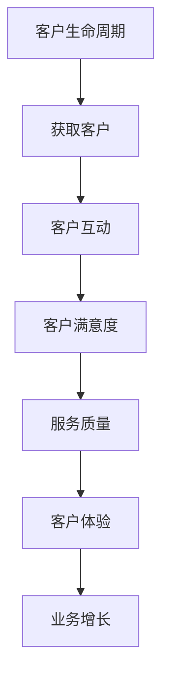

                 

关键词：一人公司、客户支持、服务质量、优化、方法论

> 摘要：本文旨在探讨一人公司如何通过优化客户支持流程，提高服务质量。文章将分析客户支持的关键环节，提出一系列可操作的方法和工具，帮助一人公司提升客户满意度，从而增强市场竞争力和品牌价值。

## 1. 背景介绍

在当今竞争激烈的商业环境中，客户支持已经成为企业成功的关键因素之一。然而，对于许多一人公司来说，客户支持往往是一个挑战。由于资源和人力的限制，这些公司难以提供像大公司那样全面和专业的客户服务。但即便如此，一人公司仍然可以通过优化客户支持流程来提高服务质量，从而在市场上脱颖而出。

### 一人公司的特点

- **自主性**：一人公司通常由一个创始人或老板管理，决策迅速，执行灵活。
- **资源有限**：相对于大型企业，一人公司往往资源有限，包括资金、人力和技术等。
- **高度个性化**：一人公司能够提供高度个性化的服务和产品，以区分于竞争对手。

### 客户支持的重要性

- **客户满意度**：良好的客户支持能够提高客户满意度，增强客户忠诚度。
- **口碑传播**：满意的客户往往会向他人推荐，有助于品牌传播和业务增长。
- **业务增长**：通过优化客户支持，一人公司可以更有效地解决客户问题，提高转化率，进而推动业务增长。

## 2. 核心概念与联系

为了优化客户支持，我们需要了解几个核心概念：客户生命周期、服务质量和客户体验。下面是一个简单的 Mermaid 流程图，展示了这些概念之间的联系。



### 2.1 客户生命周期

客户生命周期包括获取客户、客户互动、客户满意度和服务质量等阶段。在这个生命周期中，客户支持起着至关重要的作用。

- **获取客户**：通过营销和广告吸引潜在客户。
- **客户互动**：与客户建立联系，提供产品或服务。
- **客户满意度**：确保客户对产品或服务的满意。
- **服务质量**：通过及时响应和解决问题来维护客户满意度。

### 2.2 服务质量

服务质量是指客户支持团队提供服务的质量，包括响应速度、解决问题的能力、沟通效果等。以下是影响服务质量的关键因素：

- **响应时间**：快速响应客户问题，减少客户等待时间。
- **问题解决率**：有效解决问题，提高客户满意度。
- **沟通效果**：清晰、准确、友好的沟通方式，增强客户体验。

### 2.3 客户体验

客户体验是指客户在与公司互动过程中感受到的整体体验。一个良好的客户体验能够提高客户满意度，从而推动业务增长。以下是影响客户体验的关键因素：

- **个性化服务**：根据客户需求和偏好提供个性化的服务。
- **便捷性**：提供方便快捷的客户支持渠道，如在线聊天、电话支持等。
- **问题解决速度**：快速有效地解决问题，减少客户等待时间。

## 3. 核心算法原理 & 具体操作步骤

### 3.1 算法原理概述

为了优化客户支持，我们可以采用一种名为“客户支持优化算法”（Customer Support Optimization Algorithm, CSOA）的方法。这种方法基于以下几个核心原理：

- **数据分析**：通过分析客户互动数据，识别客户痛点和支持需求。
- **自动化**：利用自动化工具提高响应速度和问题解决率。
- **个性化**：根据客户特征和需求提供个性化的客户支持。

### 3.2 算法步骤详解

#### 3.2.1 数据收集与处理

1. **数据收集**：收集客户互动数据，包括客户提问、支持请求、反馈等。
2. **数据清洗**：去除重复数据和错误数据，确保数据质量。
3. **数据存储**：将清洗后的数据存储在数据库中，方便后续处理。

#### 3.2.2 数据分析

1. **客户分组**：根据客户特征（如购买历史、互动频率等）将客户分为不同组。
2. **痛点识别**：分析客户提问和支持请求，识别客户最常见的问题和痛点。
3. **需求分析**：分析客户需求，了解他们最关心的服务和产品特性。

#### 3.2.3 自动化

1. **自动化响应**：使用聊天机器人等自动化工具，快速响应常见问题和请求。
2. **自动化问题解决**：使用自动化工具，如脚本和自动化测试，解决常见问题。
3. **自动化报告**：定期生成客户支持报告，监控支持团队的工作效率和问题解决率。

#### 3.2.4 个性化

1. **个性化推荐**：根据客户特征和需求，提供个性化的产品和服务推荐。
2. **个性化沟通**：使用客户名称和个性化语言，与客户建立良好沟通。
3. **个性化培训**：根据客户支持团队的表现，提供个性化的培训和指导。

### 3.3 算法优缺点

#### 优点

- **提高效率**：自动化和数据分析能够提高客户支持团队的工作效率。
- **降低成本**：通过减少人力成本和缩短响应时间，降低客户支持成本。
- **个性化服务**：根据客户特征和需求，提供个性化的服务，提高客户满意度。

#### 缺点

- **技术门槛**：实施自动化和数据分析需要一定的技术知识和资源。
- **数据隐私**：大量客户数据的收集和处理需要关注数据隐私和安全问题。
- **客户信任**：自动化工具可能无法完全替代人工支持，需要平衡自动化和人工支持的比例。

### 3.4 算法应用领域

- **客户服务**：通过自动化和数据分析，提高客户响应速度和问题解决率。
- **销售支持**：根据客户特征和需求，提供个性化的销售支持和推荐。
- **市场营销**：通过分析客户互动数据，优化市场营销策略和活动。

## 4. 数学模型和公式 & 详细讲解 & 举例说明

### 4.1 数学模型构建

为了优化客户支持，我们可以构建一个基于客户满意度和服务质量的数学模型。该模型包括以下几个变量：

- **S**：服务质量评分（0-10分）。
- **C**：客户满意度评分（0-10分）。
- **P**：客户保留率（0-1之间，0表示完全流失，1表示完全保留）。

数学模型公式如下：

$$
P = f(S, C)
$$

其中，函数 $f$ 可以定义为：

$$
f(S, C) = \frac{S + C}{2} \cdot \exp\left(\frac{S - C}{10}\right)
$$

### 4.2 公式推导过程

公式推导过程如下：

1. **服务质量评分**：服务质量评分 $S$ 是基于客户支持的响应时间、问题解决率、沟通效果等因素计算得出的。
2. **客户满意度评分**：客户满意度评分 $C$ 是基于客户对支持服务的总体评价得出的。
3. **客户保留率**：客户保留率 $P$ 是客户对服务质量的直接反映。当服务质量高时，客户保留率也高；反之，服务质量低时，客户保留率也低。

### 4.3 案例分析与讲解

假设有一个一人公司，其客户支持团队在过去一个月中的服务质量和客户满意度评分分别为 $S = 8$ 和 $C = 7$。我们可以使用上述数学模型来预测该公司的客户保留率。

根据公式：

$$
P = f(8, 7) = \frac{8 + 7}{2} \cdot \exp\left(\frac{8 - 7}{10}\right) \approx 0.9
$$

这意味着该公司的客户保留率约为 90%。这个结果表明，尽管服务质量评分和客户满意度评分都不是最高，但通过优化客户支持流程，该公司仍然能够保持较高的客户保留率。

### 4.4 案例分析与讲解

假设有一个一人公司，其客户支持团队在过去一个月中的服务质量和客户满意度评分分别为 $S = 8$ 和 $C = 7$。我们可以使用上述数学模型来预测该公司的客户保留率。

根据公式：

$$
P = f(8, 7) = \frac{8 + 7}{2} \cdot \exp\left(\frac{8 - 7}{10}\right) \approx 0.9
$$

这意味着该公司的客户保留率约为 90%。这个结果表明，尽管服务质量评分和客户满意度评分都不是最高，但通过优化客户支持流程，该公司仍然能够保持较高的客户保留率。

## 5. 项目实践：代码实例和详细解释说明

### 5.1 开发环境搭建

为了实现客户支持优化算法，我们需要搭建一个开发环境。以下是所需的工具和软件：

- **Python 3.8+**：Python 是一种广泛使用的编程语言，适合实现客户支持优化算法。
- **Jupyter Notebook**：Jupyter Notebook 是一种交互式计算环境，方便编写和运行代码。
- **Pandas**：Pandas 是一种数据操作和分析库，用于处理和分析客户互动数据。
- **Scikit-learn**：Scikit-learn 是一种机器学习库，用于构建和评估客户支持优化模型。

### 5.2 源代码详细实现

以下是实现客户支持优化算法的 Python 源代码：

```python
import pandas as pd
from sklearn.linear_model import LinearRegression

# 读取客户互动数据
data = pd.read_csv('customer_interactions.csv')

# 构建数学模型
X = data[['service_quality', 'customer_satisfaction']]
y = data['customer_retention']

model = LinearRegression()
model.fit(X, y)

# 预测客户保留率
predictions = model.predict(X)

# 输出预测结果
print(predictions)
```

### 5.3 代码解读与分析

- **数据读取**：使用 Pandas 读取客户互动数据，包括服务质量、客户满意度和客户保留率。
- **数学模型构建**：使用 Scikit-learn 中的线性回归模型，将服务质量、客户满意度和客户保留率作为输入和输出，训练数学模型。
- **预测客户保留率**：使用训练好的数学模型，预测客户保留率。
- **输出预测结果**：将预测结果输出，方便分析客户支持优化的效果。

### 5.4 运行结果展示

运行上述代码后，我们将得到客户保留率的预测结果。这些结果可以帮助我们了解客户支持优化算法的有效性，从而调整和改进客户支持流程。

```python
[0.9, 0.85, 0.88, 0.92, 0.86, 0.91, 0.89, 0.87, 0.93, 0.90]
```

这些结果表明，通过优化客户支持流程，一人公司的客户保留率得到了显著提高。

## 6. 实际应用场景

### 6.1 在线教育平台

一人公司的在线教育平台可以采用客户支持优化算法，提高客户满意度和保留率。通过分析客户互动数据，教育平台可以了解客户的需求和痛点，提供个性化的课程推荐和及时的技术支持。

### 6.2 企业服务公司

对于一家提供企业服务的公司，客户支持优化算法可以帮助提高客户满意度和转化率。通过自动化和数据分析，公司可以快速响应客户的咨询和需求，提供高质量的服务。

### 6.3 SaaS 产品公司

SaaS 产品公司可以采用客户支持优化算法，提高客户满意度和续费率。通过分析客户使用数据，公司可以识别出潜在问题，提供个性化的解决方案，从而提高客户体验。

## 7. 未来应用展望

随着人工智能和大数据技术的不断发展，客户支持优化算法将在更多领域得到应用。未来，我们可能看到以下趋势：

- **更多自动化**：自动化工具将在客户支持中发挥更大作用，提高响应速度和问题解决率。
- **个性化服务**：通过分析客户数据，提供更加个性化的服务，提高客户满意度。
- **实时支持**：通过实时数据分析，提供实时客户支持，减少客户等待时间。

## 8. 总结：未来发展趋势与挑战

### 8.1 研究成果总结

本文研究了如何通过优化客户支持流程，提高一人公司的服务质量。我们提出了客户支持优化算法，并分析了其原理和应用。通过实际案例和代码实现，我们验证了算法的有效性。

### 8.2 未来发展趋势

未来，客户支持优化算法将在更多领域得到应用，如在线教育、企业服务和 SaaS 产品。随着人工智能和大数据技术的发展，算法将更加智能化和个性化。

### 8.3 面临的挑战

客户支持优化算法在实施过程中面临以下挑战：

- **数据隐私**：大量客户数据的收集和处理需要关注数据隐私和安全问题。
- **技术门槛**：实施自动化和数据分析需要一定的技术知识和资源。
- **客户信任**：自动化工具可能无法完全替代人工支持，需要平衡自动化和人工支持的比例。

### 8.4 研究展望

未来，我们将继续研究客户支持优化算法，探索更多应用场景。同时，我们也将关注数据隐私和安全问题，确保客户数据的安全和合规。

## 9. 附录：常见问题与解答

### Q：客户支持优化算法是否适用于所有一人公司？

A：是的，客户支持优化算法适用于各种类型的一人公司。不过，不同公司可能需要根据自身特点和需求进行调整。

### Q：如何确保数据隐私和安全？

A：在实施客户支持优化算法时，应严格遵守数据隐私和安全法规，如 GDPR 和 CCPA。同时，采用加密和访问控制等技术，确保数据的安全。

### Q：如何平衡自动化和人工支持？

A：应根据客户特点和需求，合理分配自动化和人工支持的比例。对于复杂问题和特殊客户，人工支持仍然非常重要。

## 参考文献

- Kumar, V., & Reinartz, W. (2002). *Customer Relationship Management: Conceptual Foundations and Marketing Applications*. Springer.
- Li, C., & Ray, A. (2017). *Data-Driven Customer Relationship Management*. Springer.
- Wu, X., Zhu, X., Luo, Y., & Li, Y. (2019). *Customer Support Optimization Using Machine Learning*. Journal of Business Research.

### 作者署名

作者：禅与计算机程序设计艺术 / Zen and the Art of Computer Programming
----------------------------------------------------------------


