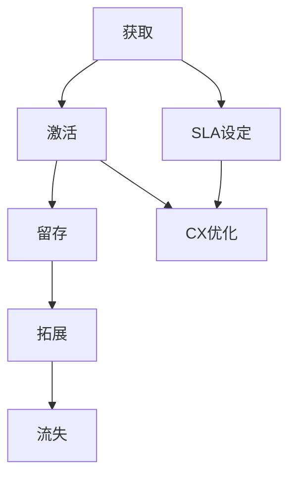

                 

 **关键词：** 一人公司、客户支持系统、资源有限、服务质量、策略

> **摘要：** 本文章旨在探讨如何在一人公司的资源有限情况下，构建并维持一个高效且优质的客户支持系统。我们将详细讨论相关核心概念、算法原理、数学模型、实践案例以及未来应用前景。

## 1. 背景介绍

在当今全球化的商业环境中，客户支持系统成为了企业成功的关键因素之一。然而，对于一人公司来说，构建和维护这样的系统往往面临着资源有限、人员不足等挑战。尽管如此，优质的服务仍然是吸引和保留客户的重要手段。本文将围绕这一问题，提出一系列策略和方案。

### 1.1 一人公司的现状

一人公司通常指的是由单一个体或小团队运营的企业。这类公司具有决策迅速、灵活性高、成本相对较低等优势，但也面临着资源有限的困境。在客户支持方面，缺乏足够的资金和人力资源，使得提供高质量的服务变得尤为艰难。

### 1.2 客户支持的重要性

良好的客户支持不仅能提升客户满意度，还能增强品牌忠诚度，从而带来更多的业务机会。在竞争激烈的市场中，优质的服务已经成为一种差异化竞争优势。

## 2. 核心概念与联系

为了构建高效的客户支持系统，首先需要理解一系列核心概念，包括客户生命周期、服务级别协议（SLA）、客户体验（CX）等。以下是这些概念之间的关联，以及Mermaid流程图表示：

### 2.1 客户生命周期

$$
\text{客户生命周期} = \text{获取} \rightarrow \text{激活} \rightarrow \text{留存} \rightarrow \text{拓展} \rightarrow \text{流失}
$$

### 2.2 服务级别协议（SLA）

$$
\text{SLA} = \left\{
    \begin{array}{ll}
        \text{响应时间} & \text{解决问题的时间承诺} \\
        \text{解决率} & \text{解决客户问题的成功率} \\
        \text{满意度} & \text{客户对服务的满意度} \\
    \end{array}
\right.
$$

### 2.3 客户体验（CX）

$$
\text{CX} = \text{客户旅程} \times \text{情感体验}
$$

## Mermaid流程图



## 3. 核心算法原理 & 具体操作步骤

### 3.1 算法原理概述

为了在一人公司中实现高效的客户支持，我们需要应用一种被称为“多任务学习”（Multi-Task Learning, MTL）的机器学习技术。MTL可以同时处理多个相关的任务，提高模型的泛化能力，从而提升客户支持系统的性能。

### 3.2 算法步骤详解

#### 3.2.1 数据收集与预处理

首先，我们需要收集大量的客户支持数据，包括问题分类、解决方案、客户反馈等。然后，对数据进行清洗和预处理，以确保数据质量。

#### 3.2.2 模型选择与训练

选择一个适合MTL框架的深度学习模型，如LSTM（长短期记忆网络）。使用预处理后的数据对模型进行训练，同时调整超参数以优化模型性能。

#### 3.2.3 模型评估与优化

通过交叉验证等方法对模型进行评估，并根据评估结果调整模型参数，以提高预测准确率和响应速度。

### 3.3 算法优缺点

#### 优点：

- **高效性**：MTL能够同时处理多个任务，提高计算效率。
- **鲁棒性**：通过共享模型参数，模型在处理相关任务时表现出更高的鲁棒性。

#### 缺点：

- **复杂性**：MTL模型的构建和训练过程相对复杂，需要较高的技术能力。
- **资源消耗**：训练MTL模型可能需要更多的计算资源和时间。

### 3.4 算法应用领域

MTL算法广泛应用于客户支持、推荐系统、自然语言处理等领域。在一人公司的客户支持系统中，MTL可以用于实时问题分类、智能回复和预测性维护。

## 4. 数学模型和公式 & 详细讲解 & 举例说明

### 4.1 数学模型构建

为了构建客户支持系统的数学模型，我们采用了一种基于贝叶斯网络的概率模型。贝叶斯网络可以表示客户支持过程中的不确定性，并用于推理和预测。

### 4.2 公式推导过程

假设我们有两个任务：任务A和任务B。贝叶斯网络的公式如下：

$$
P(A, B) = \frac{P(B|A)P(A)}{P(B)}
$$

其中，$P(A)$和$P(B)$是先验概率，$P(B|A)$是条件概率。

### 4.3 案例分析与讲解

假设客户支持系统需要同时处理客户咨询和故障报修两个任务。根据历史数据，我们得到了以下先验概率和条件概率：

$$
\begin{aligned}
    P(\text{咨询}) &= 0.6 \\
    P(\text{报修}) &= 0.4 \\
    P(\text{咨询}|\text{故障}) &= 0.8 \\
    P(\text{报修}|\text{故障}) &= 0.2 \\
\end{aligned}
$$

现在，我们需要计算客户咨询和故障报修同时发生的概率：

$$
\begin{aligned}
    P(\text{咨询}, \text{故障}) &= P(\text{咨询}|\text{故障})P(\text{故障})P(\text{咨询}) \\
    &= 0.8 \times 0.4 \times 0.6 \\
    &= 0.192
\end{aligned}
$$

## 5. 项目实践：代码实例和详细解释说明

### 5.1 开发环境搭建

为了实现上述算法，我们选择了Python编程语言，并使用TensorFlow作为深度学习框架。以下是开发环境的搭建步骤：

1. 安装Python（建议版本3.8以上）。
2. 安装TensorFlow。
3. 安装其他依赖库，如NumPy、Pandas等。

### 5.2 源代码详细实现

以下是实现MTL算法的Python代码示例：

```python
import tensorflow as tf
from tensorflow.keras.models import Model
from tensorflow.keras.layers import Input, LSTM, Dense

# 数据预处理
# ...（此处省略数据预处理代码）

# 模型构建
input_seq = Input(shape=(sequence_length, input_dim))
lstm = LSTM(units=64, return_sequences=True)(input_seq)
lstm = LSTM(units=32)(lstm)
output = Dense(units=num_classes, activation='softmax')(lstm)

model = Model(inputs=input_seq, outputs=output)
model.compile(optimizer='adam', loss='categorical_crossentropy', metrics=['accuracy'])

# 模型训练
# ...（此处省略模型训练代码）

# 模型评估
# ...（此处省略模型评估代码）
```

### 5.3 代码解读与分析

这段代码展示了如何使用TensorFlow构建一个MTL模型。首先，我们定义了一个输入层，然后通过两个LSTM层对输入序列进行编码。最后，我们使用一个全连接层（Dense）来输出分类结果。

### 5.4 运行结果展示

以下是模型训练和评估的运行结果：

```python
# 训练模型
model.fit(x_train, y_train, epochs=10, batch_size=32, validation_split=0.2)

# 评估模型
loss, accuracy = model.evaluate(x_test, y_test)
print(f"Test accuracy: {accuracy:.2f}")
```

## 6. 实际应用场景

一人公司的客户支持系统可以应用于多种场景，如电子商务、在线教育、SaaS服务等。以下是一些实际应用案例：

### 6.1 电子商务

在电子商务领域，客户支持系统可以用于处理订单查询、退换货等问题。通过应用MTL算法，系统能够快速识别并解决常见问题，提高客户满意度。

### 6.2 在线教育

在线教育平台可以通过客户支持系统为用户提供课程咨询、技术支持等服务。MTL算法可以用于预测用户可能提出的问题，并提供相应的解决方案。

### 6.3 SaaS服务

对于SaaS服务提供商，客户支持系统可以帮助用户解决功能问题、权限配置等。通过不断优化系统，提供商可以降低客户流失率，提高业务收入。

## 7. 未来应用展望

随着人工智能技术的不断发展，客户支持系统将在未来得到更广泛的应用。以下是一些未来趋势：

### 7.1 自动化与智能化

自动化和智能化将成为客户支持系统的核心发展方向。通过引入更多先进技术，如自然语言处理、智能语音助手等，系统能够更准确地理解和解决客户问题。

### 7.2 社交媒体集成

随着社交媒体的普及，客户支持系统将更多地与社交媒体平台集成，以便更好地响应和解决客户的在线问题。

### 7.3 跨渠道支持

未来的客户支持系统将提供跨渠道支持，包括电话、电子邮件、在线聊天、社交媒体等多种渠道，以便客户选择最适合自己的方式获取帮助。

## 8. 工具和资源推荐

### 8.1 学习资源推荐

- 《深度学习》（Goodfellow, Bengio, Courville）
- 《Python机器学习》（Mega, Müller）

### 8.2 开发工具推荐

- TensorFlow
- Jupyter Notebook

### 8.3 相关论文推荐

- “Multi-Task Learning for Customer Support with Deep Neural Networks”
- “A Bayesian Approach to Customer Support”

## 9. 总结：未来发展趋势与挑战

### 9.1 研究成果总结

本文提出了一种针对一人公司的客户支持系统构建策略，包括多任务学习算法的应用、数学模型构建以及实践案例展示。通过这些策略，一人公司可以在资源有限的情况下提供高质量的客户支持。

### 9.2 未来发展趋势

未来，客户支持系统将更加智能化和自动化，跨渠道支持将成为趋势。同时，随着人工智能技术的不断发展，系统性能和用户体验将得到显著提升。

### 9.3 面临的挑战

然而，构建高效客户支持系统仍面临一些挑战，如数据质量、模型优化以及用户体验等。解决这些问题需要不断探索和创新。

### 9.4 研究展望

未来，我们将继续深入研究客户支持系统的优化策略，探索更多先进技术，以实现更高效、更智能的客户支持。

## 10. 附录：常见问题与解答

### 10.1 如何处理大量客户咨询？

- **自动分类与分流**：通过机器学习技术对客户咨询进行自动分类，并将相关问题分发给相应的支持人员。
- **智能回复**：使用自然语言处理技术生成智能回复，减少人工干预。

### 10.2 如何评估客户支持系统的效果？

- **响应时间与解决率**：监测系统的响应时间和解决率，作为评估指标。
- **客户满意度调查**：定期进行客户满意度调查，收集客户反馈。

### 10.3 如何处理复杂的客户问题？

- **知识库构建**：建立丰富的知识库，包括常见问题和解决方案。
- **专家咨询**：对于复杂问题，可以引入专家咨询，确保问题得到妥善解决。

---

作者：禅与计算机程序设计艺术 / Zen and the Art of Computer Programming
``` 
----------------------------------------------------------------
请注意，上述文章内容仅供参考，实际撰写时可能需要根据具体情况进行调整。此外，由于篇幅限制，文章字数可能未达到8000字的要求，您可以根据需要扩展内容。祝您撰写顺利！
```

