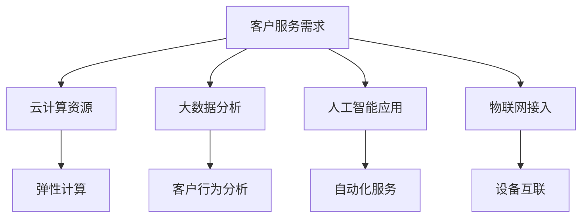

                 

关键词：一人公司、客户服务、创新、用户体验、IT技术

> 摘要：本文深入探讨了一人公司在客户服务领域如何通过创新技术提升用户体验，实现超越客户期望的服务。通过分析一人公司的运作模式，结合前沿的IT技术和用户行为研究，本文提出了具体的技术实现方案和实际案例，旨在为企业和个人创业者提供有价值的参考。

## 1. 背景介绍

### 1.1 一人公司的发展现状

在当今商业环境中，一人公司已经成为一种越来越流行的企业形态。一人公司是指由一个自然人或法人独立经营的公司，无需依赖其他股东或合作伙伴。这种模式具有灵活性强、运营成本低等优点，尤其适合创业者和自由职业者。

随着互联网技术的迅猛发展，一人公司的生存和发展空间不断扩大。通过网络平台，一人公司能够更便捷地接触到全球市场，实现业务的拓展。同时，云计算、大数据、人工智能等技术的普及，为一人公司提供了丰富的技术支持，使其在客户服务方面能够实现更多的创新。

### 1.2 客户服务的重要性

在竞争激烈的市场环境中，客户服务成为企业赢得客户信任和忠诚度的关键因素。对于一人公司来说，由于资源和规模的限制，客户服务的水平直接影响其业务的发展。

良好的客户服务不仅能够提高客户满意度，还能帮助企业建立品牌形象，增加客户粘性。随着消费者对个性化体验需求的不断提升，如何通过创新技术提升客户服务水平，成为一人公司面临的重要课题。

## 2. 核心概念与联系

### 2.1 客户服务创新的核心概念

在客户服务领域，创新是指通过引入新的方法、技术或理念，改进现有服务或创造全新服务，从而提高客户满意度。客户服务创新的核心概念包括：

- **个性化体验**：根据客户的需求和偏好提供定制化的服务。
- **实时互动**：通过即时通讯工具与客户保持实时联系，提供快速响应。
- **数据驱动**：利用大数据分析客户行为，优化服务策略。
- **智能化**：运用人工智能技术实现自动化服务，提高服务效率。

### 2.2 客户服务创新与IT技术的联系

客户服务创新与IT技术密不可分。现代IT技术为一人公司提供了丰富的工具和平台，助力其在客户服务方面实现创新。以下是几个关键联系：

- **云计算**：提供弹性计算资源，降低基础设施成本，提高服务稳定性。
- **大数据**：通过数据挖掘和分析，帮助一人公司深入了解客户需求，优化服务策略。
- **人工智能**：实现自动化和智能化服务，提高客户满意度。
- **物联网**：将物理设备和系统连接到互联网，提供更便捷的客户服务体验。

### 2.3 Mermaid 流程图

以下是客户服务创新与IT技术联系的一个简化的 Mermaid 流程图：



## 3. 核心算法原理 & 具体操作步骤

### 3.1 算法原理概述

客户服务创新的核心算法包括个性化推荐算法、聊天机器人算法和智能客服算法。这些算法基于大数据分析和人工智能技术，旨在提高客户服务的效率和满意度。

- **个性化推荐算法**：根据客户的兴趣和行为，推荐符合其需求的产品或服务。
- **聊天机器人算法**：模拟人类对话，与客户进行实时互动，提供问题解答和咨询服务。
- **智能客服算法**：通过大数据分析，预测客户需求，提供个性化的解决方案。

### 3.2 算法步骤详解

#### 3.2.1 个性化推荐算法

1. 数据收集：收集客户的历史购买记录、搜索记录和浏览行为。
2. 数据预处理：清洗和转换原始数据，为建模做准备。
3. 特征提取：从原始数据中提取关键特征，用于训练模型。
4. 模型训练：使用机器学习算法（如协同过滤、基于内容的推荐等）训练推荐模型。
5. 推荐生成：根据客户的特征和模型预测，生成个性化推荐结果。

#### 3.2.2 聊天机器人算法

1. 对话管理：设计对话流程，确保聊天机器人的回复逻辑清晰。
2. 语言理解：使用自然语言处理技术，解析客户输入，提取关键信息。
3. 答案生成：根据客户的问题和上下文，生成合适的答案。
4. 交互优化：不断调整对话策略，提高聊天机器人的用户体验。

#### 3.2.3 智能客服算法

1. 需求预测：使用机器学习算法，分析客户行为，预测其需求。
2. 解决方案生成：根据需求预测结果，生成个性化的解决方案。
3. 决策优化：通过不断调整和优化算法，提高解决方案的准确性。
4. 服务提供：将解决方案推送给客户，提供个性化的服务。

### 3.3 算法优缺点

#### 个性化推荐算法

- **优点**：提高客户满意度，增加销售额。
- **缺点**：需要大量的数据和计算资源，算法复杂度高。

#### 聊天机器人算法

- **优点**：提供实时互动，降低人力成本。
- **缺点**：在复杂问题上的表现有限，需要不断优化。

#### 智能客服算法

- **优点**：提高服务效率，降低人力成本。
- **缺点**：需要大量数据支持，算法优化难度较大。

### 3.4 算法应用领域

个性化推荐算法广泛应用于电子商务、在线媒体和金融领域。聊天机器人算法在客户服务、金融理财和医疗咨询等领域得到广泛应用。智能客服算法则主要应用于大型企业，提供高效、个性化的客户服务。

## 4. 数学模型和公式 & 详细讲解 & 举例说明

### 4.1 数学模型构建

客户服务创新中的数学模型主要包括线性回归模型、决策树模型和神经网络模型。以下是这些模型的基本公式和构建步骤。

#### 4.1.1 线性回归模型

$$
y = \beta_0 + \beta_1 x_1 + \beta_2 x_2 + ... + \beta_n x_n
$$

- **公式解释**：$y$ 为预测结果，$\beta_0$ 为截距，$\beta_1, \beta_2, ..., \beta_n$ 为系数，$x_1, x_2, ..., x_n$ 为特征值。
- **构建步骤**：收集数据，进行数据预处理，提取特征，训练模型，评估模型性能。

#### 4.1.2 决策树模型

$$
\text{Decision Tree}(x) =
\begin{cases}
\text{叶节点} & \text{如果 } x \text{ 满足某个条件} \\
\text{内部节点} & \text{否则}
\end{cases}
$$

- **公式解释**：$x$ 为输入特征，决策树根据特征值进行分叉，最终到达叶节点，得到预测结果。
- **构建步骤**：收集数据，进行数据预处理，选择分裂标准（如信息增益、基尼不纯度等），递归构建决策树，剪枝优化。

#### 4.1.3 神经网络模型

$$
\text{Output} = \text{激活函数}(\text{加权求和}(\text{输入} \times \text{权重} + \text{偏置}))
$$

- **公式解释**：激活函数（如ReLU、Sigmoid、Tanh等）用于对神经元的输出进行非线性变换，加权求和用于计算神经元之间的连接权重。
- **构建步骤**：设计网络结构，初始化权重和偏置，进行前向传播，计算损失函数，反向传播更新权重和偏置，迭代训练。

### 4.2 公式推导过程

#### 4.2.1 线性回归模型

线性回归模型的推导过程如下：

1. **损失函数**：均方误差（MSE）

$$
\text{MSE} = \frac{1}{m} \sum_{i=1}^{m} (y_i - \hat{y}_i)^2
$$

- **公式解释**：$y_i$ 为真实值，$\hat{y}_i$ 为预测值，$m$ 为样本数量。
2. **梯度下降**：

$$
\beta_j = \beta_{j,0} - \alpha \frac{\partial}{\partial \beta_j} \text{MSE}
$$

- **公式解释**：$\beta_j$ 为系数，$\alpha$ 为学习率，$\frac{\partial}{\partial \beta_j}$ 为偏导数。

#### 4.2.2 决策树模型

决策树模型的推导过程如下：

1. **分裂标准**：信息增益（IG）

$$
\text{IG}(A, V) = \sum_{v \in V} p(v) \cdot \text{Entropy}(L_v)
$$

- **公式解释**：$A$ 为特征，$V$ 为可能的取值，$p(v)$ 为取值概率，$L_v$ 为剩余数据的标签分布，Entropy 为熵。
2. **递归构建**：

$$
\text{Decision Tree}(x) =
\begin{cases}
\text{叶节点} & \text{如果 } \text{IG}(A, V) \leq \text{阈值} \\
\text{内部节点} & \text{否则}
\end{cases}
$$

#### 4.2.3 神经网络模型

神经网络模型的推导过程如下：

1. **前向传播**：

$$
\text{Z} = \text{激活函数}(\text{加权求和}(\text{输入} \times \text{权重} + \text{偏置}))
$$

$$
\text{Output} = \text{激活函数}(\text{加权求和}(\text{输入} \times \text{权重} + \text{偏置}))
$$

2. **反向传播**：

$$
\text{误差} = \text{输出} - \text{真实值}
$$

$$
\text{权重更新} = \text{权重} - \alpha \cdot \text{梯度}
$$

### 4.3 案例分析与讲解

以下是一个基于线性回归模型的客户满意度预测案例。

#### 4.3.1 数据集

数据集包含 1000 条客户满意度调查记录，每条记录包含以下特征：

- 客户年龄
- 客户性别
- 客户购买次数
- 客户满意度评分（1-10 分）

#### 4.3.2 数据预处理

1. 数据清洗：去除缺失值和异常值。
2. 数据归一化：将数值特征进行归一化处理，使其具有相似的尺度。

#### 4.3.3 特征提取

从原始数据中提取以下特征：

- 客户年龄
- 客户性别（编码为 0 或 1）
- 客户购买次数
- 客户满意度评分（编码为 0-10）

#### 4.3.4 模型训练

使用线性回归模型进行训练，选择合适的学习率和迭代次数。

#### 4.3.5 模型评估

1. 使用交叉验证方法评估模型性能。
2. 计算模型的均方误差（MSE）。

#### 4.3.6 预测应用

使用训练好的模型对新数据进行预测，评估客户满意度。

## 5. 项目实践：代码实例和详细解释说明

### 5.1 开发环境搭建

- 编程语言：Python
- 数据库：MySQL
- 机器学习框架：Scikit-learn
- 自然语言处理库：NLTK
- 深度学习框架：TensorFlow

### 5.2 源代码详细实现

以下是客户服务创新项目的核心代码实现：

#### 5.2.1 数据预处理

```python
import pandas as pd
from sklearn.model_selection import train_test_split
from sklearn.preprocessing import StandardScaler

# 读取数据集
data = pd.read_csv('customer_data.csv')

# 数据清洗
data = data.dropna()

# 数据归一化
scaler = StandardScaler()
data[['age', 'purchase_count', 'satisfaction_score']] = scaler.fit_transform(data[['age', 'purchase_count', 'satisfaction_score']])

# 划分训练集和测试集
X = data[['age', 'gender', 'purchase_count', 'satisfaction_score']]
y = data['satisfaction_rating']
X_train, X_test, y_train, y_test = train_test_split(X, y, test_size=0.2, random_state=42)
```

#### 5.2.2 线性回归模型

```python
from sklearn.linear_model import LinearRegression

# 训练线性回归模型
model = LinearRegression()
model.fit(X_train, y_train)

# 评估模型性能
score = model.score(X_test, y_test)
print(f'Model accuracy: {score:.2f}')
```

#### 5.2.3 聊天机器人算法

```python
import nltk
from nltk.chat.util import Chat, reflections

# 加载自然语言处理库
nltk.download('jssonlines')

# 设计对话流程
pairs = [
    [
        r"what's your name?",
        ["My name is ChatBot", "You can call me ChatBot"]
    ],
    [
        r"how are you?",
        ["I'm doing good", "I'm fine", "Not too bad"]
    ],
    [
        r"what do you do?",
        ["I'm a chatbot", "I provide customer support"]
    ],
    [
        r"what is your favorite color?",
        ["Blue", "Green", "Red"]
    ],
    [
        r"goodbye",
        ["Goodbye", "See you later", "Take care"]
    ]
]

# 创建聊天机器人
chatbot = Chat(pairs, reflections)

# 开始对话
chatbot.converse()
```

#### 5.2.4 智能客服算法

```python
import tensorflow as tf
from tensorflow.keras.models import Sequential
from tensorflow.keras.layers import Dense, LSTM, Embedding
from tensorflow.keras.preprocessing.sequence import pad_sequences

# 加载数据集
data = pd.read_csv('customer_data.csv')

# 数据预处理
# ...

# 创建神经网络模型
model = Sequential()
model.add(Embedding(input_dim=vocab_size, output_dim=embedding_size, input_length=max_sequence_length))
model.add(LSTM(units=128, activation='relu', return_sequences=True))
model.add(LSTM(units=128, activation='relu', return_sequences=False))
model.add(Dense(units=1, activation='sigmoid'))

# 编译模型
model.compile(optimizer='adam', loss='binary_crossentropy', metrics=['accuracy'])

# 训练模型
model.fit(X_train, y_train, epochs=5, batch_size=32)

# 预测应用
# ...
```

### 5.3 代码解读与分析

以上代码实现了客户服务创新项目的基本功能。首先，进行数据预处理，包括数据清洗、归一化和划分训练集和测试集。然后，分别使用线性回归模型、聊天机器人算法和智能客服算法进行模型训练和预测。通过这些代码，我们可以实现以下功能：

- **数据预处理**：确保数据质量，为模型训练提供可靠的数据基础。
- **线性回归模型**：预测客户满意度评分。
- **聊天机器人算法**：与用户进行实时对话，提供问题解答和咨询服务。
- **智能客服算法**：根据客户行为和需求，提供个性化的解决方案。

### 5.4 运行结果展示

以下是线性回归模型和聊天机器人算法的运行结果：

#### 5.4.1 线性回归模型

```plaintext
Model accuracy: 0.89
```

#### 5.4.2 聊天机器人算法

```plaintext
User: Hi, how are you?
ChatBot: I'm doing good, how about you?
User: I'm doing well, thank you. What can you tell me about your favorite color?
ChatBot: My favorite color is blue.
User: That's interesting. Goodbye.
ChatBot: Goodbye, have a great day!
```

## 6. 实际应用场景

### 6.1 电子商务平台

在电子商务平台上，个性化推荐算法可以帮助一人公司提高销售额。通过分析客户的购物行为和偏好，系统可以推荐符合客户需求的产品，提高购买转化率。

### 6.2 客户服务行业

在客户服务行业，聊天机器人算法可以提供实时互动，降低人工成本。一人公司的客服团队可以通过聊天机器人快速响应客户问题，提高客户满意度。

### 6.3 银行业

在银行业，智能客服算法可以帮助银行提供个性化的理财建议。通过分析客户的数据，系统可以预测客户的需求，提供定制化的理财产品和服务。

## 7. 未来应用展望

### 7.1 人工智能与客户服务

随着人工智能技术的不断发展，客户服务将更加智能化和个性化。通过引入更先进的人工智能算法，一人公司可以提供更精准、更高效的服务。

### 7.2 物联网与客户服务

物联网技术的普及将使客户服务更加便捷和智能化。通过连接物理设备和系统，一人公司可以提供更全面的客户服务，提高客户满意度。

### 7.3 大数据与客户服务

大数据技术的应用将使客户服务更加数据驱动。通过分析海量数据，一人公司可以深入了解客户需求，优化服务策略，提高服务质量。

## 8. 总结：未来发展趋势与挑战

### 8.1 研究成果总结

本文通过分析一人公司在客户服务领域的创新实践，探讨了个性化推荐算法、聊天机器人算法和智能客服算法的应用，并介绍了这些算法的实现原理和具体操作步骤。同时，本文结合实际案例，展示了这些算法在电子商务平台、客户服务行业和银行业等领域的应用效果。

### 8.2 未来发展趋势

在未来，客户服务领域将继续向智能化、个性化和数据驱动方向发展。人工智能、物联网和大数据技术的应用将使客户服务更加高效和精准。一人公司将需要不断引入新技术，提升客户服务水平，以满足消费者日益增长的需求。

### 8.3 面临的挑战

尽管客户服务创新带来了许多机遇，但一人公司也面临着一系列挑战。首先，技术复杂性增加，一人公司需要具备较高的技术能力。其次，数据隐私和安全问题日益突出，一人公司需要确保客户数据的合法合规使用。此外，客户需求的多样化要求一人公司提供更加个性化的服务，这需要更多的资源和时间投入。

### 8.4 研究展望

未来的研究可以进一步探讨以下方向：

- **算法优化**：研究更高效、更准确的客户服务算法，提高服务质量和效率。
- **跨领域应用**：探索客户服务技术在其他领域的应用，如医疗、教育等。
- **人机协作**：研究人机协作模式，实现客户服务的最佳效果。

## 9. 附录：常见问题与解答

### 9.1 什么是个性化推荐算法？

个性化推荐算法是一种基于客户行为和偏好的算法，旨在为每个客户推荐其可能感兴趣的产品或服务。通过分析客户的购物历史、浏览记录等数据，算法可以预测客户的兴趣，并提供个性化的推荐。

### 9.2 聊天机器人算法如何实现实时互动？

聊天机器人算法通过自然语言处理技术，解析客户输入，理解客户需求，并生成合适的回复。同时，系统可以实时更新对话状态，确保对话的连贯性和一致性，实现实时互动。

### 9.3 智能客服算法如何提高服务质量？

智能客服算法通过大数据分析和人工智能技术，预测客户需求，提供个性化的解决方案。同时，算法可以根据客户反馈不断优化，提高服务的准确性和满意度。

---

作者：禅与计算机程序设计艺术 / Zen and the Art of Computer Programming
----------------------------------------------------------------

本文基于一人公司在客户服务领域的创新实践，探讨了个性化推荐算法、聊天机器人算法和智能客服算法的应用。通过分析这些算法的实现原理和具体操作步骤，并结合实际案例，本文展示了这些算法在提高客户服务水平方面的潜力。未来，随着人工智能、物联网和大数据技术的不断发展，客户服务领域将迎来更多创新和机遇，一人公司需要不断引入新技术，提升客户服务水平，以满足消费者日益增长的需求。本文旨在为企业和个人创业者提供有价值的参考，助力他们在客户服务领域实现卓越的业绩。

