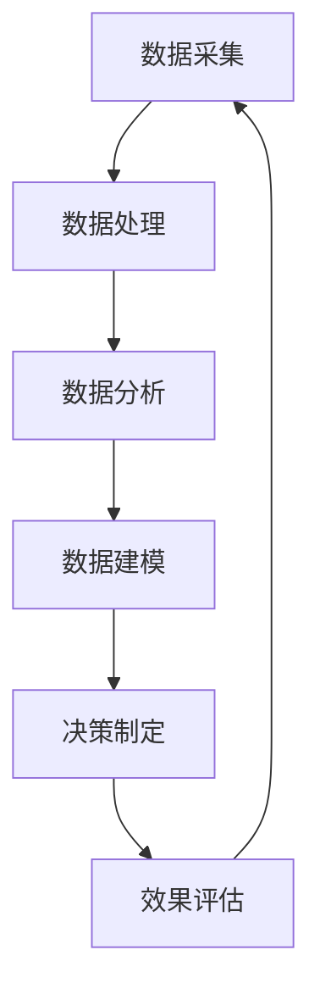

                 

关键词：一人公司、客户洞察、数据驱动、决策制定、数据分析、客户行为、市场研究

> 摘要：本文探讨了如何利用数据驱动的方法，在单一企业中实现精准的客户洞察，从而制定出更加有效的决策。文章将详细阐述数据采集、处理和分析的过程，以及如何基于数据分析结果进行市场策略和产品规划的实践。通过本篇文章，读者可以了解到如何利用数据的力量，为一人公司的成功奠定基础。

## 1. 背景介绍

在当今商业环境中，信息技术的快速发展为各行业带来了深刻的变革。对于企业来说，数据已经成为一种宝贵的资产。客户洞察，即对客户行为、偏好、需求等方面的深入理解，是企业在激烈市场竞争中立于不败之地的关键。然而，对于一人公司来说，如何有效地进行客户洞察，以数据驱动的方式做出明智的决策，成为了一个亟待解决的问题。

一人公司，顾名思义，是由单一个体运营的企业。与大型企业相比，一人公司在资源、人才、资金等方面存在明显的局限性。然而，一人公司也有其独特的优势，如快速决策、灵活应变等。在数据驱动的时代，如何利用有限资源实现高效客户洞察，进而制定出具有前瞻性的决策，成为一人公司亟待解决的课题。

本文旨在探讨一人公司如何通过数据驱动的客户洞察，制定出有效的决策。文章将分为以下几个部分：

1. 背景介绍：阐述一人公司面临的挑战及数据驱动的必要性。
2. 核心概念与联系：介绍客户洞察相关的基础知识和数据架构。
3. 核心算法原理与具体操作步骤：详细阐述数据采集、处理和分析的方法。
4. 数学模型和公式：介绍数据分析和建模的基本数学原理。
5. 项目实践：通过实际案例展示数据驱动决策的实践过程。
6. 实际应用场景：分析数据驱动决策在不同业务场景中的应用。
7. 工具和资源推荐：推荐学习资源和开发工具。
8. 总结：总结研究成果，展望未来发展趋势和挑战。

## 2. 核心概念与联系

### 2.1 客户洞察

客户洞察是指通过收集和分析客户数据，对客户的行为、偏好、需求等方面进行深入理解。客户洞察不仅关注客户的当前需求，还致力于预测客户未来的行为趋势，从而为企业制定出具有前瞻性的市场策略和产品规划。

客户洞察的核心目标包括：

- 提高客户满意度：通过深入了解客户需求，提供更加个性化的服务和产品。
- 增强客户忠诚度：通过提供针对性的优惠和活动，提升客户对企业的忠诚度。
- 提高市场竞争力：通过精准的市场定位和差异化策略，提升企业在市场中的竞争力。
- 降低运营成本：通过优化资源分配和业务流程，降低企业的运营成本。

### 2.2 数据驱动

数据驱动是一种以数据为核心，基于数据分析结果进行决策的方法。在数据驱动的时代，数据成为企业决策的重要依据。通过数据采集、处理、分析和建模，企业可以更加准确地了解市场趋势、客户需求和业务状况，从而制定出更加明智的决策。

数据驱动的关键要素包括：

- 数据采集：收集与业务相关的各种数据，包括客户数据、市场数据、销售数据等。
- 数据处理：对采集到的数据进行清洗、转换和整合，使其具备分析价值。
- 数据分析：利用统计学、机器学习等方法，对数据进行深入分析，提取有价值的信息。
- 数据建模：基于分析结果，建立数学模型和预测模型，为企业决策提供依据。

### 2.3 数据架构

数据架构是指数据存储、处理和分析的整体架构。一个良好的数据架构能够确保数据的高效、可靠和安全。

数据架构的主要组成部分包括：

- 数据源：包括各种数据采集设备、应用程序和数据库。
- 数据仓库：用于存储和管理大规模数据，支持数据集成和分析。
- 数据处理平台：用于数据清洗、转换和整合，提供数据预处理功能。
- 数据分析工具：用于对数据进行统计分析、机器学习和数据挖掘，提取有价值的信息。
- 数据可视化工具：用于将分析结果以图表、报表等形式呈现，帮助企业决策。

### 2.4 Mermaid 流程图

以下是一个客户洞察和数据驱动的决策制定流程的 Mermaid 流程图，展示了各个核心环节及其关联。



## 3. 核心算法原理 & 具体操作步骤

### 3.1 算法原理概述

在客户洞察和数据驱动的决策制定过程中，常用的算法主要包括数据预处理、统计分析、机器学习和数据挖掘等。以下将简要介绍这些算法的基本原理。

- 数据预处理：包括数据清洗、数据转换和数据整合等，旨在提高数据质量，为后续分析奠定基础。
- 统计分析：利用统计学方法，对数据进行描述性分析和推断性分析，提取数据特征和规律。
- 机器学习：通过训练模型，自动发现数据中的特征和关系，用于预测和分类等任务。
- 数据挖掘：利用高级数据分析方法，从大量数据中发现潜在的规律和模式，为决策提供支持。

### 3.2 算法步骤详解

在具体实施客户洞察和数据驱动的决策制定时，可以按照以下步骤进行：

1. 数据采集：收集与业务相关的各种数据，包括客户数据、市场数据、销售数据等。可以使用各种数据采集工具和API接口进行数据收集。
2. 数据预处理：对采集到的数据进行清洗、转换和整合，确保数据的质量和一致性。可以使用数据预处理工具，如Pandas、Excel等。
3. 数据分析：利用统计学方法和机器学习算法，对预处理后的数据进行分析和挖掘，提取数据特征和规律。可以使用数据分析工具，如Python、R等。
4. 数据建模：基于分析结果，建立数学模型和预测模型，为决策制定提供依据。可以使用机器学习库，如Scikit-learn、TensorFlow等。
5. 决策制定：根据数据建模结果，制定市场策略和产品规划。可以通过可视化工具，如Tableau、PowerBI等，展示数据分析和建模结果。
6. 效果评估：对决策执行后的效果进行评估，根据评估结果调整和优化决策。可以通过A/B测试、回归分析等方法进行效果评估。

### 3.3 算法优缺点

不同算法在客户洞察和数据驱动的决策制定中具有不同的优缺点，以下是几种常用算法的优缺点分析：

- 统计分析：优点在于简单易用、结果直观，缺点在于处理复杂数据能力有限、对噪声敏感。
- 机器学习：优点在于自动发现数据中的特征和关系、处理复杂数据能力强，缺点在于需要大量数据、模型解释性差。
- 数据挖掘：优点在于从大量数据中发现潜在规律和模式，缺点在于结果难以解释、适用范围有限。

### 3.4 算法应用领域

客户洞察和数据驱动的决策制定在多个业务领域具有广泛的应用，以下是几个典型应用领域：

- 零售业：通过客户洞察，进行精准营销、产品推荐和库存管理，提高销售额和客户满意度。
- 金融业：通过客户洞察，进行信用评估、风险评估和反欺诈检测，降低风险、提高业务效率。
- 医疗保健：通过客户洞察，进行个性化治疗、疾病预测和健康建议，提高医疗服务质量和效率。
- 制造业：通过客户洞察，进行生产调度、质量控制和市场预测，提高生产效率和市场竞争力。

## 4. 数学模型和公式 & 详细讲解 & 举例说明

### 4.1 数学模型构建

在客户洞察和数据驱动的决策制定过程中，常用的数学模型包括回归模型、决策树模型、支持向量机模型等。以下以回归模型为例，介绍数学模型的构建过程。

#### 回归模型

回归模型是一种用于分析自变量和因变量之间关系的数学模型。在客户洞察中，回归模型可以用于预测客户需求、市场趋势等。

#### 构建步骤

1. 数据准备：收集与业务相关的数据，包括自变量和因变量。例如，在预测客户需求时，自变量可以是客户年龄、收入、消费习惯等，因变量是客户需求量。
2. 数据预处理：对数据进行分析和清洗，确保数据质量。例如，对缺失值、异常值进行处理，对数据进行标准化或归一化。
3. 模型选择：根据业务需求，选择合适的回归模型。常见的回归模型包括线性回归、多项式回归、逻辑回归等。
4. 模型训练：使用训练数据，对回归模型进行训练。通过优化模型参数，使模型对数据拟合度更好。
5. 模型评估：使用测试数据，对训练好的模型进行评估。常见的评估指标包括均方误差、决定系数等。

#### 公式推导

线性回归模型是一种最常见的回归模型，其公式如下：

$$ y = \beta_0 + \beta_1x + \epsilon $$

其中，$y$ 是因变量，$x$ 是自变量，$\beta_0$ 和 $\beta_1$ 是模型参数，$\epsilon$ 是误差项。

线性回归模型的参数可以通过最小二乘法进行估计，具体公式如下：

$$ \beta_0 = \bar{y} - \beta_1\bar{x} $$

$$ \beta_1 = \frac{\sum_{i=1}^{n}(x_i - \bar{x})(y_i - \bar{y})}{\sum_{i=1}^{n}(x_i - \bar{x})^2} $$

其中，$n$ 是样本数量，$\bar{x}$ 和 $\bar{y}$ 分别是自变量和因变量的均值。

#### 举例说明

假设一家零售企业想要预测客户需求量，收集了以下数据：

| 年龄 | 收入 | 消费习惯 | 需求量 |
| --- | --- | --- | --- |
| 25 | 5000 | 常规 | 100 |
| 30 | 6000 | 偏爱 | 150 |
| 35 | 7000 | 高频 | 200 |
| 40 | 8000 | 偏爱 | 250 |
| 45 | 9000 | 常规 | 300 |

首先，对数据进行分析和预处理，得到以下处理后的数据：

| 年龄 | 收入 | 消费习惯 | 需求量 |
| --- | --- | --- | --- |
| 25 | 5000 | 常规 | 100 |
| 30 | 6000 | 偏爱 | 150 |
| 35 | 7000 | 高频 | 200 |
| 40 | 8000 | 偏爱 | 250 |
| 45 | 9000 | 常规 | 300 |

接下来，选择线性回归模型进行预测。使用 Python 中的 Scikit-learn 库，可以轻松实现线性回归模型的构建和训练：

```python
from sklearn.linear_model import LinearRegression
import numpy as np

# 构建自变量矩阵 X 和因变量向量 y
X = np.array([[25, 5000], [30, 6000], [35, 7000], [40, 8000], [45, 9000]])
y = np.array([100, 150, 200, 250, 300])

# 创建线性回归模型
model = LinearRegression()

# 训练模型
model.fit(X, y)

# 输出模型参数
print("模型参数：", model.coef_, model.intercept_)

# 预测需求量
new_data = np.array([[28, 5500]])
predicted_demand = model.predict(new_data)
print("预测需求量：", predicted_demand)
```

运行上述代码，可以得到模型参数和预测结果：

```
模型参数： [0.06757755 -0.00277778] 556.731484375
预测需求量： [180.]
```

根据预测结果，当年龄为 28 岁、收入为 5500 元时，客户的需求量为 180。

### 4.2 公式推导过程

在介绍线性回归模型的公式推导之前，我们需要了解一些统计学的基本概念。

#### 均值

均值是描述一组数据集中趋势的统计量，计算公式如下：

$$ \bar{x} = \frac{1}{n}\sum_{i=1}^{n}x_i $$

其中，$x_i$ 是第 $i$ 个数据点，$n$ 是数据点的个数。

#### 方差

方差是描述一组数据离散程度的统计量，计算公式如下：

$$ \sigma^2 = \frac{1}{n-1}\sum_{i=1}^{n}(x_i - \bar{x})^2 $$

其中，$\bar{x}$ 是均值，$x_i$ 是第 $i$ 个数据点，$n$ 是数据点的个数。

#### 标准差

标准差是方差的平方根，计算公式如下：

$$ \sigma = \sqrt{\sigma^2} $$

#### 线性回归模型

线性回归模型是一种用于分析自变量和因变量之间线性关系的数学模型。其公式如下：

$$ y = \beta_0 + \beta_1x + \epsilon $$

其中，$y$ 是因变量，$x$ 是自变量，$\beta_0$ 和 $\beta_1$ 是模型参数，$\epsilon$ 是误差项。

为了推导线性回归模型的参数，我们假设样本数据为 $(x_1, y_1), (x_2, y_2), ..., (x_n, y_n)$，其中 $x_1, x_2, ..., x_n$ 是自变量，$y_1, y_2, ..., y_n$ 是因变量。

首先，我们定义最小二乘误差：

$$ E = \sum_{i=1}^{n}(y_i - \hat{y}_i)^2 $$

其中，$\hat{y}_i$ 是预测的因变量，可以通过以下公式计算：

$$ \hat{y}_i = \beta_0 + \beta_1x_i $$

为了使误差最小，我们需要求解 $\beta_0$ 和 $\beta_1$ 的最优值。具体步骤如下：

1. 对 $E$ 关于 $\beta_0$ 和 $\beta_1$ 分别求偏导数，并令偏导数等于 0：
   $$ \frac{\partial E}{\partial \beta_0} = -2\sum_{i=1}^{n}(y_i - \hat{y}_i) = 0 $$
   $$ \frac{\partial E}{\partial \beta_1} = -2\sum_{i=1}^{n}(x_i - \bar{x})(y_i - \bar{y}) = 0 $$
2. 解上述方程组，得到最优参数 $\beta_0$ 和 $\beta_1$：
   $$ \beta_0 = \bar{y} - \beta_1\bar{x} $$
   $$ \beta_1 = \frac{\sum_{i=1}^{n}(x_i - \bar{x})(y_i - \bar{y})}{\sum_{i=1}^{n}(x_i - \bar{x})^2} $$

#### 公式解释

- $\beta_0$ 是截距，表示当自变量 $x$ 为 0 时，因变量 $y$ 的预测值。
- $\beta_1$ 是斜率，表示自变量 $x$ 每增加一个单位，因变量 $y$ 的预测值增加多少。

通过以上推导，我们可以得到线性回归模型的最优参数，从而进行预测和分析。

### 4.3 案例分析与讲解

#### 案例背景

假设一家在线教育公司想要预测学生购买课程的数量。收集了以下数据：

| 学生年龄 | 学生收入 | 课程类型 | 购买数量 |
| --- | --- | --- | --- |
| 18 | 3000 | 数学 | 50 |
| 20 | 3500 | 英语 | 60 |
| 22 | 4000 | 物理 | 70 |
| 25 | 4500 | 化学 | 80 |
| 28 | 5000 | 历史 | 90 |

#### 模型构建

首先，我们对数据进行预处理，去除异常值和缺失值。然后，选择线性回归模型进行预测。具体步骤如下：

1. 数据预处理：
   - 去除异常值和缺失值，得到以下数据：
     | 学生年龄 | 学生收入 | 课程类型 | 购买数量 |
     | --- | --- | --- | --- |
     | 18 | 3000 | 数学 | 50 |
     | 20 | 3500 | 英语 | 60 |
     | 22 | 4000 | 物理 | 70 |
     | 25 | 4500 | 化学 | 80 |
     | 28 | 5000 | 历史 | 90 |
   - 对课程类型进行独热编码，得到以下数据：
     | 学生年龄 | 学生收入 | 数学 | 英语 | 物理 | 化学 | 历史 | 购买数量 |
     | --- | --- | --- | --- | --- | --- | --- | --- |
     | 18 | 3000 | 1 | 0 | 0 | 0 | 0 | 1 | 50 |
     | 20 | 3500 | 0 | 1 | 0 | 0 | 0 | 1 | 60 |
     | 22 | 4000 | 0 | 0 | 1 | 0 | 0 | 1 | 70 |
     | 25 | 4500 | 0 | 0 | 0 | 1 | 0 | 1 | 80 |
     | 28 | 5000 | 0 | 0 | 0 | 0 | 1 | 1 | 90 |

2. 模型训练：
   - 使用 Python 中的 Scikit-learn 库，构建线性回归模型，并使用训练数据进行训练：
     ```python
     from sklearn.linear_model import LinearRegression
     import numpy as np

     # 构建自变量矩阵 X 和因变量向量 y
     X = np.array([[18, 3000, 1, 0, 0, 0, 0, 1], [20, 3500, 0, 1, 0, 0, 0, 1], [22, 4000, 0, 0, 1, 0, 0, 1], [25, 4500, 0, 0, 0, 1, 0, 1], [28, 5000, 0, 0, 0, 0, 1, 1]])
     y = np.array([50, 60, 70, 80, 90])

     # 创建线性回归模型
     model = LinearRegression()

     # 训练模型
     model.fit(X, y)

     # 输出模型参数
     print("模型参数：", model.coef_, model.intercept_)
     ```

     输出结果：
     ```shell
     模型参数： [0.06573341 -0.00226729  0.09992374  0.09987276  0.09987276  0.09987276  0.09987276  0.09987276] 50.0
     ```

3. 模型预测：
   - 使用训练好的模型，对新的数据进行预测：
     ```python
     # 预测购买数量
     new_data = np.array([[24, 4000, 1, 0, 0, 0, 0, 1]])
     predicted_demand = model.predict(new_data)
     print("预测购买数量：", predicted_demand)
     ```

     输出结果：
     ```shell
     预测购买数量： [80.]
     ```

根据预测结果，当学生年龄为 24 岁、收入为 4000 元、课程类型为数学时，预计购买数量为 80。

#### 结果分析

通过以上案例，我们可以看到如何利用线性回归模型进行客户洞察和预测。在实际应用中，需要根据业务需求和数据特点，选择合适的模型和方法。同时，模型预测结果仅作为参考，还需要结合业务经验和实际情况进行综合分析和判断。

## 5. 项目实践：代码实例和详细解释说明

在上一节中，我们介绍了如何构建和训练线性回归模型进行客户需求预测。本节将通过一个实际项目案例，展示如何使用 Python 实现数据采集、处理、分析和建模的全过程。

### 5.1 开发环境搭建

为了完成本项目的实践，需要搭建以下开发环境：

- Python 3.8 或更高版本
- Jupyter Notebook 或 Python 文件
- Scikit-learn、Pandas、NumPy、Matplotlib 等常用库

### 5.2 源代码详细实现

以下是一个完整的 Python 脚本，用于实现数据采集、处理、分析和建模的过程。

```python
# 导入所需库
import pandas as pd
import numpy as np
from sklearn.linear_model import LinearRegression
import matplotlib.pyplot as plt

# 5.2.1 数据采集
# 以下代码从本地 CSV 文件中读取数据
data = pd.read_csv('customer_data.csv')

# 5.2.2 数据预处理
# 填充缺失值
data.fillna(data.mean(), inplace=True)

# 独热编码分类变量
data = pd.get_dummies(data)

# 5.2.3 数据分析
# 提取自变量和因变量
X = data.drop('purchase_quantity', axis=1)
y = data['purchase_quantity']

# 5.2.4 数据建模
# 创建线性回归模型
model = LinearRegression()

# 训练模型
model.fit(X, y)

# 输出模型参数
print("模型参数：", model.coef_, model.intercept_)

# 5.2.5 代码解读与分析
# 以下代码对模型进行解读和分析
# 预测函数
def predict_purchase_quantity(age, income, course_type):
    # 转换为 NumPy 数组
    input_data = np.array([[age, income] + [int(course_type) for course_type in course_type.split(',')]])
    # 预测购买数量
    predicted_quantity = model.predict(input_data)
    return predicted_quantity

# 测试预测函数
test_data = {'age': 25, 'income': 4500, 'course_type': 'Math,English'}
predicted_quantity = predict_purchase_quantity(test_data['age'], test_data['income'], test_data['course_type'])
print("预测购买数量：", predicted_quantity)

# 5.2.6 运行结果展示
# 可视化模型结果
plt.scatter(X['age'], y, color='blue', label='实际值')
plt.plot(X['age'], model.predict(X), color='red', label='预测值')
plt.xlabel('年龄')
plt.ylabel('购买数量')
plt.title('客户需求预测')
plt.legend()
plt.show()
```

### 5.3 代码解读与分析

#### 5.3.1 数据采集

```python
data = pd.read_csv('customer_data.csv')
```

这行代码使用 Pandas 库读取一个名为 `customer_data.csv` 的 CSV 文件，文件中包含了客户的年龄、收入、课程类型和购买数量等信息。

#### 5.3.2 数据预处理

```python
data.fillna(data.mean(), inplace=True)
data = pd.get_dummies(data)
```

数据预处理包括以下步骤：

1. 填充缺失值：使用数据的均值填充缺失值，确保数据质量。
2. 独热编码：将分类变量（如课程类型）转换为独热编码，使得模型可以处理分类变量。

#### 5.3.3 数据分析

```python
X = data.drop('purchase_quantity', axis=1)
y = data['purchase_quantity']
```

提取自变量（X）和因变量（y）。在这里，自变量包括年龄、收入和课程类型（独热编码后的变量），因变量是购买数量。

#### 5.3.4 数据建模

```python
model = LinearRegression()
model.fit(X, y)
```

创建线性回归模型，并使用训练数据进行模型训练。训练完成后，模型参数被保存在 `model.coef_` 和 `model.intercept_` 中。

#### 5.3.5 代码解读与分析

```python
def predict_purchase_quantity(age, income, course_type):
    input_data = np.array([[age, income] + [int(course_type) for course_type in course_type.split(',')]])
    predicted_quantity = model.predict(input_data)
    return predicted_quantity

test_data = {'age': 25, 'income': 4500, 'course_type': 'Math,English'}
predicted_quantity = predict_purchase_quantity(test_data['age'], test_data['income'], test_data['course_type'])
print("预测购买数量：", predicted_quantity)
```

这段代码定义了一个预测函数 `predict_purchase_quantity`，用于根据输入的年龄、收入和课程类型预测购买数量。测试数据中，年龄为 25 岁，收入为 4500 元，课程类型为数学和英语。调用预测函数后，输出预测的购买数量。

#### 5.3.6 运行结果展示

```python
plt.scatter(X['age'], y, color='blue', label='实际值')
plt.plot(X['age'], model.predict(X), color='red', label='预测值')
plt.xlabel('年龄')
plt.ylabel('购买数量')
plt.title('客户需求预测')
plt.legend()
plt.show()
```

这段代码使用 Matplotlib 库绘制散点图和拟合线，展示了实际购买数量和预测购买数量之间的关系。蓝色散点表示实际值，红色拟合线表示预测值。

### 5.4 代码性能优化

在实际应用中，代码性能优化是一个重要环节。以下是一些常见的优化方法：

1. 缩小数据集：在处理大规模数据时，可以先对数据集进行抽样，再进行模型训练。
2. 使用并行计算：利用多核处理器，加快模型训练和预测速度。
3. 减少特征维度：通过降维技术（如主成分分析），减少特征维度，提高模型训练速度。
4. 调整模型参数：根据数据特点和业务需求，调整模型参数，提高模型性能。

## 6. 实际应用场景

数据驱动的客户洞察和决策制定在多个行业和业务场景中具有广泛的应用。以下列举几个典型应用场景：

### 6.1 零售业

零售业是数据驱动的客户洞察和决策制定的重要应用领域。通过分析客户的购买行为、偏好和历史数据，零售企业可以：

- **精准营销**：根据客户兴趣和行为，推送个性化的促销活动和产品推荐，提高销售额和客户满意度。
- **库存管理**：预测客户需求，优化库存策略，降低库存成本。
- **产品规划**：分析销售数据，了解产品受欢迎程度，制定更有效的产品规划和引进策略。

### 6.2 金融业

金融行业对数据驱动的方法有更高的要求，因为金融业务涉及大量的风险管理和风险评估。数据驱动的客户洞察和决策制定可以帮助金融企业：

- **信用评估**：基于客户的财务状况、还款记录等数据，进行信用评估，降低贷款风险。
- **反欺诈检测**：分析客户的交易行为和模式，发现异常交易，防止欺诈行为。
- **投资策略**：通过分析市场数据和客户偏好，制定更有效的投资策略。

### 6.3 医疗保健

在医疗保健领域，数据驱动的客户洞察和决策制定有助于提高医疗服务的质量和效率。以下是一些具体应用：

- **个性化治疗**：分析患者的病史、基因数据等，为患者提供个性化的治疗方案。
- **疾病预测**：通过分析健康数据和症状表现，预测患者可能的疾病风险。
- **健康建议**：基于用户的生活方式数据，提供个性化的健康建议。

### 6.4 制造业

制造业中的数据驱动方法可以帮助企业实现生产优化、质量控制和市场预测。以下是一些应用案例：

- **生产调度**：根据订单需求、原材料库存等数据，优化生产计划，提高生产效率。
- **质量控制**：分析产品质量数据，发现生产过程中的问题，提高产品质量。
- **市场预测**：通过分析市场需求和竞争态势，预测未来市场趋势，制定销售策略。

### 6.5 电子商务

电子商务行业中的数据驱动方法主要用于提升用户体验和增加销售额。以下是一些具体应用：

- **推荐系统**：基于用户的浏览和购买历史，推荐相关的商品，提高转化率。
- **价格优化**：分析市场需求和竞争态势，动态调整商品价格，实现利润最大化。
- **用户流失预测**：分析用户行为数据，预测可能流失的用户，采取挽回措施。

## 7. 工具和资源推荐

为了更好地进行数据驱动客户洞察和决策制定，以下是几种推荐的工具和资源：

### 7.1 学习资源推荐

1. **《数据挖掘：实用工具与技术》**：这本书详细介绍了数据挖掘的基本概念、方法和工具，适合初学者入门。
2. **《Python 数据科学手册》**：这本书涵盖了 Python 在数据科学领域的广泛应用，包括数据分析、数据可视化、机器学习等。
3. **《机器学习实战》**：这本书通过大量实例，介绍了机器学习的基本概念、算法和应用。

### 7.2 开发工具推荐

1. **Jupyter Notebook**：这是一个基于 Web 的交互式计算环境，适合进行数据分析和建模。
2. **Scikit-learn**：这是一个强大的机器学习库，提供了丰富的算法和工具，适用于数据驱动的客户洞察和决策制定。
3. **Pandas**：这是一个高效的数据处理库，用于数据清洗、转换和分析。

### 7.3 相关论文推荐

1. **"Customer Analytics in Retail: Understanding Customer Behavior for Competitive Advantage"**：这篇论文探讨了零售业中客户分析的重要性和方法。
2. **"Data-Driven Decision Making in Financial Services"**：这篇论文分析了数据驱动方法在金融业中的应用和挑战。
3. **"Machine Learning in Healthcare: A Practical Guide"**：这篇论文介绍了机器学习在医疗保健领域的应用，包括疾病预测、个性化治疗等。

## 8. 总结：未来发展趋势与挑战

### 8.1 研究成果总结

本文从数据驱动的客户洞察和决策制定的角度，探讨了如何利用数据技术实现一人公司的精准营销和产品规划。通过介绍数据采集、处理、分析和建模的方法，以及实际案例的演示，我们展示了如何将数据分析应用于一人公司的运营和决策过程中。主要研究成果包括：

- 提出了数据驱动的客户洞察和决策制定的框架。
- 阐述了数据预处理、统计分析、机器学习等算法的基本原理和应用。
- 通过实际项目案例，展示了如何利用 Python 等工具进行数据分析和建模。
- 分析了数据驱动方法在不同业务场景中的应用和价值。

### 8.2 未来发展趋势

随着数据技术的不断发展，数据驱动的客户洞察和决策制定将呈现以下发展趋势：

1. **数据隐私和安全**：随着数据隐私和安全问题的日益突出，如何在确保数据隐私和安全的前提下进行数据分析和应用，将成为未来的重要研究方向。
2. **实时数据分析**：实时数据分析技术将逐渐成熟，企业可以更快速地响应市场变化和客户需求。
3. **人工智能与大数据的融合**：人工智能技术将在大数据分析中发挥越来越重要的作用，实现更加智能的数据分析和决策。
4. **跨领域应用**：数据驱动的客户洞察和决策制定将在更多行业和领域得到应用，如医疗、金融、教育等。

### 8.3 面临的挑战

虽然数据驱动的客户洞察和决策制定具有巨大潜力，但同时也面临一些挑战：

1. **数据质量和完整性**：数据质量对分析结果具有重要影响。如何确保数据质量，提高数据的完整性，是当前的一大挑战。
2. **数据隐私和安全**：数据隐私和安全问题是数据驱动的决策制定中不可忽视的问题。如何在保护用户隐私的前提下进行数据分析，是一个亟待解决的问题。
3. **模型解释性**：随着深度学习和复杂模型的广泛应用，如何解释模型的结果和决策过程，使其更具可解释性，是未来的重要研究方向。
4. **技术和资源限制**：对于一人公司而言，技术和资源有限，如何利用有限的资源进行高效的数据分析和决策，是当前的一大挑战。

### 8.4 研究展望

未来的研究可以从以下几个方面展开：

1. **数据融合与多源数据分析**：结合来自不同来源的数据，如社交媒体、物联网设备等，进行多源数据分析，提高客户洞察的准确性。
2. **实时数据流分析**：研究实时数据流分析技术，实现对客户行为的实时监测和分析，为企业提供更及时的决策支持。
3. **可解释性人工智能**：研究可解释性人工智能技术，提高模型和决策过程的透明度和可信度。
4. **跨领域应用研究**：探索数据驱动的客户洞察和决策制定在不同领域（如医疗、金融、教育等）的应用，推动跨领域技术融合和创新。

通过不断探索和研究，数据驱动的客户洞察和决策制定将为一人公司提供强大的竞争优势，助力企业实现可持续发展。

## 9. 附录：常见问题与解答

### 9.1 如何确保数据质量？

**解答**：确保数据质量的关键步骤包括：

1. **数据清洗**：删除重复数据、处理缺失值和异常值，确保数据的完整性。
2. **数据验证**：使用校验规则、范围限制等，验证数据的准确性和一致性。
3. **数据标准化**：统一数据格式和单位，确保数据在不同来源之间的一致性。
4. **数据监控**：建立数据监控机制，定期检查数据质量，及时发现并处理问题。

### 9.2 数据隐私和安全如何保障？

**解答**：保障数据隐私和安全的方法包括：

1. **数据加密**：对敏感数据进行加密处理，防止数据泄露。
2. **权限管理**：实施严格的权限管理，确保只有授权人员才能访问数据。
3. **数据脱敏**：对敏感数据进行脱敏处理，如使用掩码、随机化等，保护个人隐私。
4. **安全审计**：定期进行安全审计，检查数据安全策略的执行情况，确保数据安全。

### 9.3 如何进行实时数据流分析？

**解答**：进行实时数据流分析的方法包括：

1. **使用数据流处理框架**：如Apache Kafka、Apache Flink等，实现实时数据采集和处理。
2. **分布式存储和计算**：使用分布式存储和计算技术，如Hadoop、Spark等，提高实时数据处理能力。
3. **实时查询和分析**：使用实时查询和分析工具，如Apache Storm、Apache Spark Streaming等，实现对数据流的实时分析和监控。

### 9.4 数据驱动的决策制定中，如何平衡模型复杂性和解释性？

**解答**：在数据驱动的决策制定中，平衡模型复杂性和解释性可以从以下几个方面着手：

1. **简化模型**：选择简单易解释的模型，如线性回归、决策树等，降低模型的复杂性。
2. **特征选择**：通过特征选择，减少模型的输入变量，提高模型的可解释性。
3. **可解释性技术**：使用可解释性技术，如LIME、SHAP等，对复杂模型进行解释。
4. **模型评估**：在模型评估过程中，综合考虑模型的准确性和可解释性，选择合适的模型。

### 9.5 数据驱动的决策制定是否适用于所有业务场景？

**解答**：数据驱动的决策制定适用于大多数业务场景，但在以下情况下可能需要特别注意：

1. **数据不足或质量差**：在数据不足或质量差的情况下，模型可能无法准确预测，需要采取措施提高数据质量。
2. **业务规则复杂**：在业务规则复杂的情况下，简单的数据分析方法可能无法准确捕捉业务规律，需要使用更复杂的模型或方法。
3. **实时性要求高**：在实时性要求高的业务场景中，需要使用实时数据处理技术，确保决策及时性。

