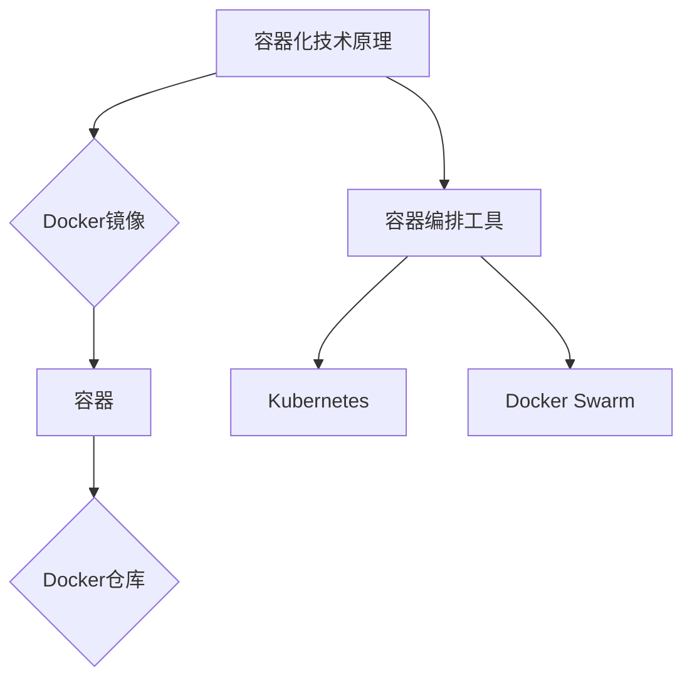

                 

在当今数字化时代，容器化技术的应用已经成为企业数字化转型的重要组成部分。尤其对于“一人公司”或小型团队来说，容器化不仅可以提高开发效率，还能确保部署的一致性和可移植性。本文将探讨容器化部署的最佳实践，帮助一人公司的开发者或小型团队更高效地管理和部署应用程序。

## 文章关键词

- 容器化
- DevOps
- 一人公司
- 应用部署
- 微服务架构

## 文章摘要

本文将首先介绍容器化技术的核心概念，然后详细探讨一人公司在容器化部署中的应用，包括开发环境配置、容器编排工具的使用、微服务架构的优势以及安全与性能优化策略。最后，我们将展望容器化技术的未来发展趋势，以及一人公司在这一领域面临的挑战。

## 1. 背景介绍

### 容器化技术的兴起

容器化技术的兴起源于软件开发和运维的复杂性。传统的虚拟机技术虽然可以提供隔离的环境，但启动速度慢、资源占用大，而且不同环境之间的差异常常导致部署问题。容器技术通过轻量级的虚拟化方式，提供了更高效、更灵活的解决方案。

Docker作为容器化技术的代表，自从2008年诞生以来，迅速获得了广泛的应用。其核心思想是将应用程序及其运行时环境打包成一个统一的容器镜像，确保在任何环境下都能一致运行。这种“一次编写，到处运行”的理念，极大地简化了应用的部署和运维过程。

### DevOps文化的推广

随着容器化技术的发展，DevOps文化也逐渐深入人心。DevOps强调软件开发与运维团队的合作，通过持续集成（CI）和持续交付（CD）流程，实现更快的迭代和更可靠的应用部署。容器化技术为DevOps实践提供了强有力的支持，使得开发者可以更快地反馈问题，运维人员可以更高效地部署和维护应用。

### 一人公司的挑战与机遇

对于“一人公司”或小型团队来说，资源有限、经验不足往往是面临的主要挑战。然而，容器化技术为他们提供了一种高效的解决方案。通过容器化，开发者可以轻松管理应用环境，确保在不同环境中的一致性和可移植性。此外，容器编排工具的出现，使得即使是小型团队，也能像大型企业一样高效地管理容器化应用。

## 2. 核心概念与联系

### 容器技术原理

容器是一种轻量级的虚拟化技术，通过操作系统的Namespace和Cgroups机制，实现了资源隔离和限制。容器共享宿主机的操作系统内核，因此启动速度快，资源占用小。容器的核心概念包括：

- **Docker镜像**：Docker镜像是一个只读的模板，用来创建容器。它包含了应用程序运行所需的所有文件和依赖。
- **Docker容器**：容器是镜像运行时的实例。可以通过启动容器来运行应用程序。
- **Docker仓库**：仓库用于存储和管理Docker镜像。

### 容器编排工具

容器编排工具用于管理和自动化容器的部署、扩展和运维。目前，最流行的容器编排工具包括：

- **Kubernetes**：Kubernetes是开源的容器编排平台，提供了自动化部署、扩展和管理容器化应用的功能。
- **Docker Swarm**：Docker Swarm是Docker内置的容器编排工具，可以轻松地将多个Docker容器编排成一个应用集群。

### Mermaid流程图



## 3. 核心算法原理 & 具体操作步骤

### 3.1 算法原理概述

容器化部署的核心算法是容器镜像的构建和容器编排。容器镜像的构建是将应用程序及其依赖打包成统一格式的过程，而容器编排则是管理和调度容器的过程。

### 3.2 算法步骤详解

#### 3.2.1 Docker镜像构建

1. 编写Dockerfile：Dockerfile是一个包含构建镜像指令的文本文件。
2. 构建镜像：使用Docker build命令构建镜像。
3. 镜像推送：将镜像推送到Docker仓库。

#### 3.2.2 容器编排

1. 定义部署配置：编写Kubernetes配置文件，定义应用的部署、扩展策略。
2. 部署应用：使用Kubernetes API部署应用。
3. 监控和管理：通过Kubernetes Dashboard或CLI监控和管理应用。

### 3.3 算法优缺点

#### 优点：

- **高效性**：容器化部署提高了应用部署的效率和灵活性。
- **一致性**：容器镜像确保了应用程序在任何环境中的一致性。
- **可移植性**：容器镜像可以轻松地移植到不同的环境中。

#### 缺点：

- **学习成本**：容器化和编排工具的学习曲线较高。
- **资源占用**：容器虽然轻量级，但多个容器仍会占用一定的资源。

### 3.4 算法应用领域

容器化部署广泛应用于微服务架构、持续集成和持续交付（CI/CD）、云原生应用等领域。

## 4. 数学模型和公式 & 详细讲解 & 举例说明

### 4.1 数学模型构建

容器化部署中的数学模型主要涉及资源调度和优化问题。一个基本的模型可以表示为：

\[ \text{Minimize} \quad C(X) = \sum_{i=1}^{n} \sum_{j=1}^{m} c_{ij} x_{ij} \]

其中，\( C(X) \)表示总成本，\( c_{ij} \)表示第\( i \)个容器在第\( j \)个节点上的运行成本，\( x_{ij} \)表示第\( i \)个容器是否在第\( j \)个节点上运行。

### 4.2 公式推导过程

假设有\( n \)个容器和\( m \)个节点，每个容器的资源需求可以表示为\( R_i \)，每个节点的资源容量为\( C_j \)。目标是最小化总成本，同时满足资源约束：

\[ \sum_{j=1}^{m} x_{ij} = 1 \quad \forall i \]
\[ \sum_{i=1}^{n} x_{ij} \leq C_j \quad \forall j \]

通过线性规划方法，可以求解最优的容器部署方案。

### 4.3 案例分析与讲解

假设有一个三人团队，需要在两个节点上部署三个应用程序。每个应用程序的资源需求如下：

| 应用名称 | CPU需求 | 内存需求 |
|----------|---------|---------|
| App1     | 2       | 4 GB    |
| App2     | 1       | 2 GB    |
| App3     | 3       | 6 GB    |

两个节点的资源容量如下：

| 节点名称 | CPU容量 | 内存容量 |
|----------|---------|---------|
| Node1    | 4       | 8 GB    |
| Node2    | 4       | 8 GB    |

我们可以使用线性规划方法，求解最优的部署方案。通过计算，我们得到以下部署方案：

- App1部署在Node1
- App2部署在Node2
- App3部署在Node1

这样，资源利用达到了最大化，同时满足资源约束。

## 5. 项目实践：代码实例和详细解释说明

### 5.1 开发环境搭建

在开始容器化部署之前，我们需要搭建一个开发环境。以下是一个基本的开发环境搭建步骤：

1. 安装Docker：在Linux系统中，可以使用以下命令安装Docker：

```bash
sudo apt-get update
sudo apt-get install docker.io
```

2. 安装Kubernetes：在Linux系统中，可以使用以下命令安装Kubernetes：

```bash
sudo apt-get update
sudo apt-get install kubectl
```

3. 启动Docker和Kubernetes服务：

```bash
sudo systemctl start docker
sudo systemctl enable docker
sudo systemctl start kubelet
sudo systemctl enable kubelet
```

### 5.2 源代码详细实现

以下是一个简单的Docker镜像构建示例：

```Dockerfile
# 基础镜像
FROM python:3.8-slim

# 设置工作目录
WORKDIR /app

# 复制源代码
COPY . .

# 安装依赖
RUN pip install -r requirements.txt

# 暴露端口
EXPOSE 8080

# 运行应用程序
CMD ["python", "app.py"]
```

### 5.3 代码解读与分析

Dockerfile中的每一行都有特定的作用：

- `FROM python:3.8-slim`：指定基础镜像，这里使用了Python 3.8的slim版镜像，以减小镜像体积。
- `WORKDIR /app`：设置工作目录，确保所有操作都在这个目录下进行。
- `COPY . .`：复制当前目录下的所有文件到容器的工作目录。
- `RUN pip install -r requirements.txt`：安装应用程序所需的依赖。
- `EXPOSE 8080`：暴露8080端口，使外部访问应用程序。
- `CMD ["python", "app.py"]`：指定启动容器的命令，这里是运行应用程序的主进程。

### 5.4 运行结果展示

在完成Dockerfile的编写后，我们可以使用以下命令构建镜像并运行容器：

```bash
docker build -t myapp .
docker run -d -p 8080:8080 myapp
```

运行成功后，可以通过访问本地8080端口来访问应用程序。

## 6. 实际应用场景

### 6.1 单机部署

对于单机部署，容器化技术可以帮助开发者快速搭建开发环境，并确保环境的一致性。例如，在本地开发环境中，可以使用Docker镜像来管理应用环境，确保不同环境之间的差异。

### 6.2 分布式部署

在分布式部署中，容器编排工具如Kubernetes可以发挥重要作用。通过Kubernetes，开发者可以轻松地部署、扩展和管理分布式应用。例如，在一个分布式系统中，可以使用Kubernetes将应用程序部署到多个节点上，并自动处理故障转移和负载均衡。

### 6.3 云原生部署

云原生部署是容器化技术的应用方向之一。通过在云平台上部署容器化应用，可以充分利用云资源的弹性和可扩展性。例如，在AWS或Azure上，可以使用EKS或AKS来部署和管理容器化应用。

## 7. 工具和资源推荐

### 7.1 学习资源推荐

- 《Docker实战》
- 《Kubernetes权威指南》
- Kubernetes官方文档

### 7.2 开发工具推荐

- Visual Studio Code
- Docker Desktop
- Kubernetes Dashboard

### 7.3 相关论文推荐

- “Docker: Lightweight Linux Containers for Developing, Deploying, and Running Applications”
- “Kubernetes: A System for Automating Deployment, Scaling, and Operations of Containerized Applications”

## 8. 总结：未来发展趋势与挑战

### 8.1 研究成果总结

容器化技术自2008年Docker诞生以来，取得了显著的研究成果。容器编排工具如Kubernetes的广泛应用，使得容器化部署变得更加高效和灵活。此外，云原生技术的兴起，也为容器化部署提供了新的应用场景。

### 8.2 未来发展趋势

未来，容器化技术将继续向云原生、服务网格和智能编排方向发展。容器化技术的进一步普及，将推动企业数字化转型，提高软件开发的效率和质量。

### 8.3 面临的挑战

容器化技术面临的挑战主要包括安全性、资源管理和复杂性的增加。随着容器化应用的普及，如何确保容器环境的安全性，如何高效地管理容器资源，以及如何处理复杂的容器编排问题，都是需要解决的问题。

### 8.4 研究展望

未来，容器化技术的研究将重点关注以下几个方面：

- **安全性**：加强容器镜像的安全验证和容器运行时的安全防护。
- **资源管理**：优化容器资源的分配和使用，提高资源利用率。
- **智能编排**：利用机器学习和人工智能技术，实现更智能的容器编排和管理。

## 9. 附录：常见问题与解答

### 9.1 如何解决容器部署的环境不一致问题？

解决容器部署的环境不一致问题，可以通过以下方法：

- 使用Docker镜像来封装应用程序及其运行时环境，确保容器在任何环境中的一致性。
- 使用持续集成和持续交付（CI/CD）流程，确保每次部署都是基于最新的代码和依赖。

### 9.2 容器编排工具Kubernetes如何处理故障转移？

Kubernetes通过以下机制处理故障转移：

- **Pod自愈**：当Pod失败时，Kubernetes会自动重启Pod。
- **Replication Controller**：确保Pod在多个节点上运行，当一个节点故障时，其他节点会自动启动新的Pod。
- **Horizontal Pod Autoscaler**：根据工作负载自动扩展Pod的数量，确保应用的高可用性。

## 结束语

容器化部署技术为“一人公司”或小型团队提供了高效的解决方案，提高了开发效率和部署质量。通过本文的介绍，读者应该对容器化部署有了更深入的理解，并能够根据自身需求选择合适的工具和策略。在未来的数字化转型过程中，容器化技术将继续发挥重要作用，助力企业实现高效、可靠的软件开发和运维。

作者：禅与计算机程序设计艺术 / Zen and the Art of Computer Programming

----------------------------------------------------------------

以上便是《一人公司的容器化部署最佳实践》的文章正文部分，感谢您的阅读。希望这篇文章能够对您在容器化部署方面有所帮助。如果您有任何问题或建议，欢迎在评论区留言。再次感谢您的关注！

