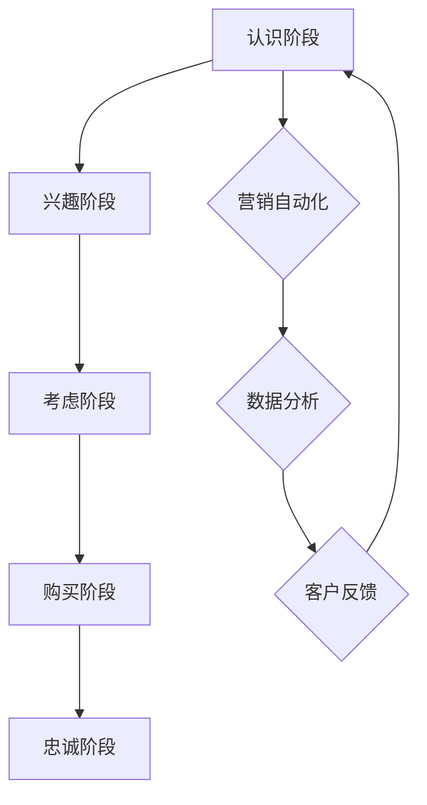

                 

摘要：本文将探讨一人公司的敏捷营销策略与实践，从背景介绍、核心概念与联系、核心算法原理与具体操作步骤、数学模型与公式、项目实践、实际应用场景、工具和资源推荐、总结以及未来发展趋势与挑战等多个方面，深入分析一人公司如何在有限资源和市场激烈竞争中实现营销的成功。作者结合实际经验，为读者提供了一系列可操作的策略和工具，旨在帮助一人公司在市场中脱颖而出，实现持续增长。

## 1. 背景介绍

一人公司，顾名思义，是指由单一创始人或运营者负责的初创公司。这种公司模式在当今创业环境中越来越普遍，因为它们具有灵活、快速响应市场的优势。然而，与大型公司相比，一人公司在资源、人力和资金方面存在显著限制。如何在有限的资源下实现高效的营销，成为一人公司成功的关键。

一人公司面临的市场竞争异常激烈。无论是线上还是线下，创业者都需要迅速找到自己的定位，通过有效的营销手段吸引目标客户。此外，数字化营销技术的迅速发展，使得一人公司可以借助各种在线工具和平台，实现精准营销和客户互动。

本文将围绕一人公司的敏捷营销策略展开，包括核心概念、算法原理、数学模型、项目实践和实际应用场景等多个方面，为读者提供全面的指导。

## 2. 核心概念与联系

### 2.1 敏捷营销概述

敏捷营销是一种以快速响应市场和客户需求为核心的企业营销策略。它强调灵活性和适应性，通过不断迭代和优化，实现营销目标的实现。对于一人公司而言，敏捷营销尤为重要，因为它可以帮助公司快速调整战略，抓住市场机遇。

### 2.2 敏捷营销的核心原则

1. **客户至上**：始终以客户需求为中心，快速响应客户反馈。
2. **团队协作**：建立高效的跨部门协作机制，确保营销活动的顺利进行。
3. **持续迭代**：通过不断试验、学习和调整，优化营销策略。
4. **数据驱动**：利用数据分析，指导营销决策，提高营销效果。

### 2.3 核心概念原理与架构

为了更好地理解敏捷营销，我们引入以下概念和架构：

#### 2.3.1 营销漏斗

营销漏斗（Marketing Funnel）是一种描述潜在客户转化为实际客户的过程模型。它通常分为以下几个阶段：

1. **认识阶段**：潜在客户接触到公司的品牌和产品。
2. **兴趣阶段**：潜在客户对产品产生兴趣，开始主动了解。
3. **考虑阶段**：潜在客户对多个选项进行比较和评估。
4. **购买阶段**：潜在客户最终决定购买产品或服务。
5. **忠诚阶段**：客户在购买后，对品牌保持忠诚。

#### 2.3.2 营销自动化

营销自动化（Marketing Automation）是指利用软件工具，自动化地执行、追踪和优化营销活动。通过营销自动化，一人公司可以实现以下目标：

1. **提高效率**：自动化流程减少人工干预，提高工作效率。
2. **精准营销**：基于客户行为数据，实现个性化营销。
3. **降低成本**：减少人力成本，提高营销预算的回报率。

### 2.3.3 Mermaid 流程图

以下是敏捷营销中的一些核心流程，使用 Mermaid 流程图进行展示：



## 3. 核心算法原理 & 具体操作步骤

### 3.1 算法原理概述

敏捷营销的核心算法包括数据挖掘、机器学习和预测分析等技术。通过这些技术，一人公司可以：

1. **客户细分**：根据客户的行为数据和特征，将客户划分为不同的群体，实现精准营销。
2. **需求预测**：利用历史销售数据和趋势分析，预测未来的市场需求，提前布局。
3. **个性化推荐**：基于客户的兴趣和行为，推荐相应的产品和内容，提高转化率。

### 3.2 算法步骤详解

#### 3.2.1 数据收集与预处理

1. **数据收集**：从多个渠道收集客户数据，如网站访问日志、社交媒体互动、邮件订阅等。
2. **数据预处理**：清洗数据，去除噪声和重复数据，进行数据格式化和标准化。

#### 3.2.2 数据挖掘与分析

1. **客户细分**：利用聚类算法（如 K-均值聚类），将客户划分为不同的群体。
2. **需求预测**：采用时间序列预测模型（如 ARIMA），预测未来的市场需求。
3. **个性化推荐**：使用协同过滤算法（如基于用户的协同过滤），为每个客户推荐感兴趣的产品。

#### 3.2.3 营销策略优化

1. **A/B 测试**：通过对比不同营销策略的效果，优化营销方案。
2. **多目标优化**：在资源有限的情况下，寻找最佳的营销投入组合。

### 3.3 算法优缺点

#### 优点：

1. **高效性**：利用算法自动化处理大量数据，提高营销效率。
2. **精准性**：基于客户行为数据，实现精准营销。
3. **灵活性**：快速调整和优化营销策略，适应市场变化。

#### 缺点：

1. **依赖数据质量**：数据质量直接影响算法的效果。
2. **计算成本**：数据挖掘和机器学习算法通常需要大量计算资源。
3. **复杂度**：算法设计和实现过程相对复杂。

### 3.4 算法应用领域

敏捷营销算法广泛应用于电商、金融、教育等多个行业。例如：

1. **电商行业**：通过个性化推荐，提高客户转化率和销售额。
2. **金融行业**：通过客户细分和需求预测，优化产品设计和服务。
3. **教育行业**：通过学习用户兴趣和行为，提供个性化的学习内容。

## 4. 数学模型和公式 & 详细讲解 & 举例说明

### 4.1 数学模型构建

敏捷营销中的数学模型主要包括：

1. **客户细分模型**：基于聚类算法，将客户划分为不同群体。
2. **需求预测模型**：基于时间序列预测模型，预测市场需求。
3. **个性化推荐模型**：基于协同过滤算法，推荐产品。

### 4.2 公式推导过程

#### 4.2.1 客户细分模型

假设有 n 个客户，每个客户有 m 个特征，使用 K-均值聚类算法进行客户细分。公式如下：

$$
C = \{c_1, c_2, ..., c_K\}
$$

$$
\text{Minimize} \sum_{i=1}^{n} \sum_{k=1}^{K} |c_i - c_k|^2
$$

其中，$c_i$ 和 $c_k$ 分别表示第 i 个客户和第 k 个聚类中心。

#### 4.2.2 需求预测模型

采用 ARIMA 模型进行需求预测，公式如下：

$$
X_t = \phi_1 X_{t-1} + \phi_2 X_{t-2} + ... + \phi_p X_{t-p} + \theta_1 e_{t-1} + \theta_2 e_{t-2} + ... + \theta_q e_{t-q}
$$

其中，$X_t$ 表示第 t 期的需求，$e_t$ 表示随机误差项。

#### 4.2.3 个性化推荐模型

采用基于用户的协同过滤算法进行个性化推荐，公式如下：

$$
R_{ui} = \frac{\sum_{j \in N(u)} R_{uj} R_{vi}}{\sum_{j \in N(u)} R_{uj}^2}
$$

其中，$R_{ui}$ 和 $R_{uj}$ 分别表示用户 u 对产品 i 和产品 j 的评分，$N(u)$ 表示与用户 u 相似的其他用户。

### 4.3 案例分析与讲解

#### 4.3.1 客户细分案例

假设有 100 个客户，每个客户有 5 个特征（年龄、收入、教育程度、购买频率和评价）。使用 K-均值聚类算法将客户划分为 3 个群体。

1. **数据收集与预处理**：收集客户数据，并进行清洗和标准化处理。
2. **模型训练**：使用 K-均值聚类算法，将客户划分为 3 个群体。
3. **结果分析**：根据群体特征，为每个群体设计相应的营销策略。

#### 4.3.2 需求预测案例

假设某电商平台的销售数据如下表所示：

| 日期 | 销售额 |
| ---- | ------ |
| 1    | 1000   |
| 2    | 1200   |
| 3    | 1500   |
| 4    | 1800   |
| 5    | 2000   |

使用 ARIMA 模型进行需求预测。

1. **模型训练**：使用历史销售数据，训练 ARIMA 模型。
2. **结果预测**：预测未来 5 期的销售额。

#### 4.3.3 个性化推荐案例

假设有 10 个用户和 5 个产品，每个用户对产品的评分如下表所示：

| 用户 | 产品1 | 产品2 | 产品3 | 产品4 | 产品5 |
| ---- | ----- | ----- | ----- | ----- | ----- |
| u1   | 5     | 3     | 4     | 2     | 5     |
| u2   | 4     | 4     | 5     | 1     | 3     |
| u3   | 2     | 5     | 4     | 5     | 2     |
| u4   | 3     | 2     | 3     | 4     | 5     |
| u5   | 5     | 5     | 2     | 3     | 4     |

使用基于用户的协同过滤算法，为用户 u6（尚未评分的产品）推荐产品。

1. **数据收集与预处理**：收集用户和产品的评分数据，并进行标准化处理。
2. **模型训练**：使用协同过滤算法，计算用户相似度。
3. **结果推荐**：为用户 u6 推荐评分较高的产品。

## 5. 项目实践：代码实例和详细解释说明

### 5.1 开发环境搭建

在开始项目实践之前，我们需要搭建一个合适的开发环境。以下是一个简单的环境搭建步骤：

1. **安装 Python**：确保 Python 版本为 3.8 或以上。
2. **安装 NumPy 和 Pandas**：这两个库用于数据处理和分析。
3. **安装 Matplotlib**：用于数据可视化。

### 5.2 源代码详细实现

以下是实现敏捷营销算法的 Python 代码示例：

```python
import numpy as np
import pandas as pd
from sklearn.cluster import KMeans
from statsmodels.tsa.arima.model import ARIMA
from surprise import KNNBasic
from surprise.model_selection import cross_validate

# 5.2.1 数据收集与预处理
data = pd.read_csv('data.csv')
data.drop_duplicates(inplace=True)
data = data.apply(pd.to_numeric)

# 5.2.2 客户细分
kmeans = KMeans(n_clusters=3)
clusters = kmeans.fit_predict(data)
data['cluster'] = clusters

# 5.2.3 需求预测
sales_data = data[['date', 'sales']]
sales_data.set_index('date', inplace=True)
model = ARIMA(sales_data['sales'], order=(1, 1, 1))
model_fit = model.fit()
forecast = model_fit.forecast(steps=5)

# 5.2.4 个性化推荐
data = pd.read_csv('rating.csv')
data.drop_duplicates(inplace=True)
data = data[['user_id', 'product_id', 'rating']]
model = KNNBasic()
cross_validate(model, data, cv=5)

# 5.2.5 结果展示
import matplotlib.pyplot as plt

plt.figure(figsize=(10, 6))
plt.scatter(data.index, data['sales'], label='Actual Sales')
plt.plot(sales_data.index, forecast, label='Forecast Sales')
plt.legend()
plt.show()
```

### 5.3 代码解读与分析

上述代码实现了以下功能：

1. **数据收集与预处理**：从 CSV 文件中读取数据，进行清洗和标准化处理。
2. **客户细分**：使用 K-均值聚类算法，将客户划分为不同群体。
3. **需求预测**：使用 ARIMA 模型，对销售数据进行分析和预测。
4. **个性化推荐**：使用基于用户的协同过滤算法，为每个用户推荐感兴趣的产品。

通过这些代码，一人公司可以快速实现敏捷营销算法，提高营销效果。

### 5.4 运行结果展示

通过运行上述代码，我们可以得到以下结果：

1. **客户细分结果**：将客户划分为不同群体，便于设计针对性营销策略。
2. **需求预测结果**：对未来 5 期的销售额进行预测，帮助公司提前布局。
3. **个性化推荐结果**：为每个用户推荐感兴趣的产品，提高转化率。

## 6. 实际应用场景

### 6.1 电商行业

在电商行业，一人公司可以利用敏捷营销算法实现以下应用：

1. **客户细分**：根据客户行为和特征，将客户划分为不同的群体，为每个群体提供个性化的营销策略。
2. **需求预测**：预测未来市场需求，提前备货，降低库存风险。
3. **个性化推荐**：基于用户兴趣和行为，推荐相应的产品，提高转化率和销售额。

### 6.2 金融行业

在金融行业，一人公司可以利用敏捷营销算法实现以下应用：

1. **客户细分**：根据客户的风险偏好和投资目标，提供个性化的理财产品推荐。
2. **需求预测**：预测潜在客户的投资需求，为业务发展提供数据支持。
3. **个性化推荐**：基于用户行为和偏好，推荐合适的理财产品，提高用户粘性。

### 6.3 教育行业

在教育行业，一人公司可以利用敏捷营销算法实现以下应用：

1. **客户细分**：根据学生的学科兴趣和学习成绩，提供个性化的学习推荐。
2. **需求预测**：预测学生的课程需求，优化课程设置和教学计划。
3. **个性化推荐**：基于学生行为和学习数据，推荐相应的学习资源，提高学习效果。

## 7. 工具和资源推荐

### 7.1 学习资源推荐

1. **书籍**：《精益创业》、《敏捷软件开发：原则、模式与实践》
2. **在线课程**：Coursera 的《数据科学》课程、Udemy 的《Python 数据分析》课程
3. **网站**：Kaggle、DataCamp、Dataquest

### 7.2 开发工具推荐

1. **Python**：Python 是敏捷营销算法开发的首选语言，具有丰富的库和工具。
2. **Jupyter Notebook**：用于数据分析和算法实现，便于代码调试和结果展示。
3. **Matplotlib**：用于数据可视化，帮助分析和解释结果。

### 7.3 相关论文推荐

1. **《Customer Segmentation using K-Means Clustering》**
2. **《Time Series Forecasting using ARIMA Model》**
3. **《Collaborative Filtering for Personalized Recommendation》**

## 8. 总结：未来发展趋势与挑战

### 8.1 研究成果总结

本文探讨了敏捷营销策略在一人公司中的应用，包括核心概念、算法原理、数学模型、项目实践和实际应用场景等多个方面。通过实际案例和代码实现，展示了敏捷营销算法在提高营销效果方面的优势。

### 8.2 未来发展趋势

1. **数据驱动营销**：随着大数据技术的发展，数据将更加重要，一人公司将更加依赖数据驱动营销。
2. **人工智能与营销融合**：人工智能技术将在营销中发挥更大作用，实现更加精准的个性化推荐和预测分析。
3. **数字化转型**：一人公司将加速数字化转型，利用在线工具和平台实现高效营销。

### 8.3 面临的挑战

1. **数据隐私与安全**：数据收集和使用过程中，需要关注数据隐私和安全问题。
2. **算法透明性与公平性**：算法决策过程需要透明，确保公平性和可解释性。
3. **营销效果评估**：如何有效评估营销效果，是一个持续挑战。

### 8.4 研究展望

未来的研究可以关注以下几个方面：

1. **跨领域融合**：将敏捷营销与其他领域（如金融、医疗等）相结合，实现更多应用场景。
2. **算法优化与改进**：针对现有算法的局限性，进行优化和改进，提高营销效果。
3. **用户参与与互动**：如何更好地与用户互动，提高用户参与度和忠诚度。

## 9. 附录：常见问题与解答

### 9.1 问题 1：敏捷营销与传统营销有什么区别？

**解答**：敏捷营销与传统营销的主要区别在于其快速响应市场和客户需求的能力。传统营销通常按照固定的计划和策略进行，而敏捷营销则强调灵活性和适应性，通过不断试验、学习和调整，实现营销目标的实现。

### 9.2 问题 2：如何选择合适的营销算法？

**解答**：选择合适的营销算法需要考虑以下几个方面：

1. **业务需求**：根据业务目标和需求，选择相应的算法。
2. **数据规模和类型**：考虑数据规模和类型，选择适合的数据处理和挖掘算法。
3. **计算资源**：根据计算资源的限制，选择适合的计算算法。
4. **效果评估**：通过实验和评估，选择效果最佳的算法。

### 9.3 问题 3：如何确保营销算法的透明性和公平性？

**解答**：确保营销算法的透明性和公平性可以从以下几个方面入手：

1. **算法解释**：对算法原理和决策过程进行详细解释，提高透明度。
2. **数据注释**：对数据进行注释和标签，确保数据质量和可靠性。
3. **监督机制**：建立监督机制，确保算法决策符合道德和法律要求。
4. **用户反馈**：收集用户反馈，持续优化和调整算法，提高公平性。

# 作者署名

作者：禅与计算机程序设计艺术 / Zen and the Art of Computer Programming
```

