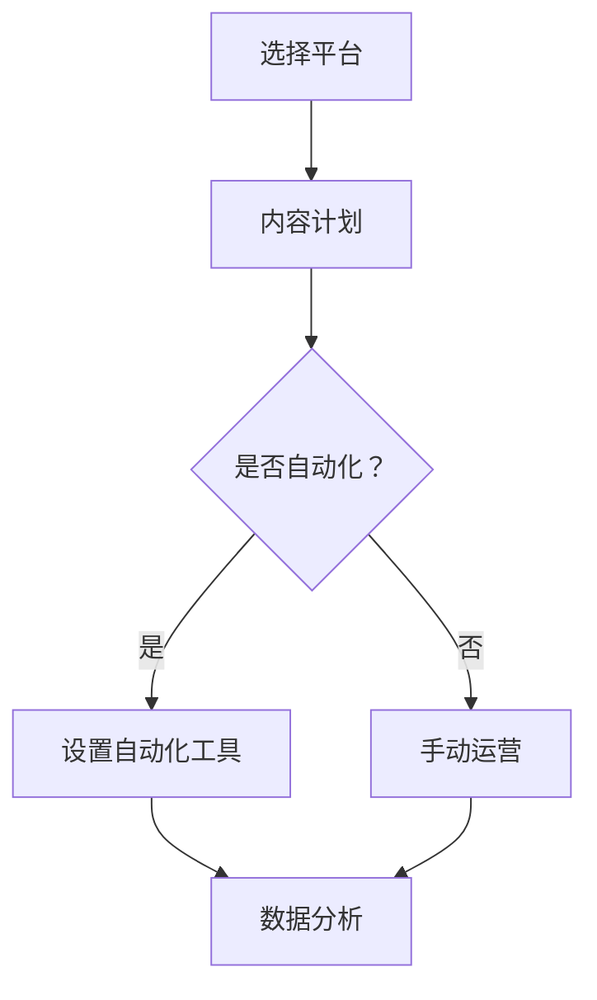

                 

关键词：社交媒体矩阵、运营策略、自动化、个性化、品牌建设、数据分析、增长黑客、社交媒体管理工具

> 摘要：随着社交媒体的日益普及，一人公司如何高效运营社交媒体矩阵成为关键问题。本文将探讨一人公司如何利用社交媒体矩阵进行品牌建设、自动化运营、个性化内容生成，以及如何通过数据分析实现增长黑客策略，旨在为一人公司提供一套切实可行的社交媒体矩阵运营策略。

## 1. 背景介绍

### 社交媒体矩阵的概念与重要性

社交媒体矩阵是指在多个社交媒体平台上，针对不同用户群体和内容主题，制定并执行一系列的运营策略和活动。对于一人公司来说，社交媒体矩阵不仅能够提高品牌的曝光率，还能通过精细化的运营实现客户转化和品牌忠诚度的提升。

### 一人公司的挑战

一人公司面临的主要挑战包括：

1. **资源有限**：一人公司通常没有专业的团队来管理各个社交媒体平台，因此需要找到高效的运营方式。
2. **时间管理**：由于只有一个人负责，时间管理成为关键，如何高效利用时间进行社交媒体运营是关键问题。
3. **内容多样化**：一人公司需要针对不同的平台和用户群体，创作多样化的内容，这需要大量的创意和时间。
4. **数据分析**：缺乏专业的数据分析能力，难以准确评估社交媒体的运营效果。

## 2. 核心概念与联系

### 社交媒体矩阵的架构


**图1：社交媒体矩阵架构**

该架构主要包括以下几个部分：

- **平台选择**：根据目标用户和内容类型选择合适的社交媒体平台。
- **内容计划**：制定长期和短期内容计划，确保内容的持续性和多样性。
- **自动化工具**：利用自动化工具来简化运营流程，提高效率。
- **数据分析**：通过数据分析来评估运营效果，优化运营策略。

### Mermaid 流程图



**图2：社交媒体矩阵运营流程图**

## 3. 核心算法原理 & 具体操作步骤

### 3.1 算法原理概述

社交媒体矩阵的算法原理主要基于以下几点：

- **用户数据分析**：通过分析用户的行为数据，了解用户偏好和需求。
- **内容个性化**：根据用户数据和平台特性，生成个性化内容。
- **自动化运营**：利用算法和工具实现内容的自动化发布和互动。

### 3.2 算法步骤详解

1. **用户数据分析**：收集用户在各个平台的行为数据，包括点击率、转发率、评论等。
2. **内容个性化**：根据用户数据和平台特性，为每个用户生成个性化内容。
3. **自动化运营**：利用自动化工具，如IFTTT、HubSpot等，实现内容的自动发布和互动。
4. **数据分析**：定期分析运营效果，优化运营策略。

### 3.3 算法优缺点

**优点**：

- **提高效率**：自动化运营可以节省大量时间和人力成本。
- **个性化内容**：个性化内容能够提高用户的参与度和满意度。
- **数据驱动**：通过数据分析，可以更精准地调整运营策略。

**缺点**：

- **内容质量**：自动化工具无法完全替代人工创作，可能会降低内容质量。
- **数据隐私**：过度依赖用户数据分析可能会涉及数据隐私问题。

### 3.4 算法应用领域

- **品牌推广**：通过社交媒体矩阵，提高品牌曝光率和知名度。
- **客户服务**：利用社交媒体矩阵，提供高效、个性化的客户服务。
- **市场调研**：通过用户数据分析，了解市场需求和用户反馈。

## 4. 数学模型和公式 & 详细讲解 & 举例说明

### 4.1 数学模型构建

社交媒体矩阵的数学模型主要包括以下几个部分：

- **用户行为模型**：$U = f(C, T)$，其中$U$表示用户行为，$C$表示内容，$T$表示时间。
- **内容生成模型**：$C = g(U, P)$，其中$C$表示内容，$U$表示用户行为，$P$表示平台特性。
- **自动化模型**：$A = h(U, C, T)$，其中$A$表示自动化运营策略，$U$表示用户行为，$C$表示内容，$T$表示时间。

### 4.2 公式推导过程

1. **用户行为模型**：$U = f(C, T)$
   - $U$：用户行为（点击、转发、评论等）
   - $C$：内容
   - $T$：时间
   - 推导：根据用户行为数据，分析内容和时间的关联性，得出用户行为模型。

2. **内容生成模型**：$C = g(U, P)$
   - $C$：内容
   - $U$：用户行为
   - $P$：平台特性
   - 推导：根据用户行为数据和平台特性，分析内容生成策略。

3. **自动化模型**：$A = h(U, C, T)$
   - $A$：自动化运营策略
   - $U$：用户行为
   - $C$：内容
   - $T$：时间
   - 推导：根据用户行为模型和内容生成模型，制定自动化运营策略。

### 4.3 案例分析与讲解

假设我们是一家专注于科技领域的一人公司，我们希望利用社交媒体矩阵来推广我们的产品。以下是具体的案例分析和讲解：

1. **用户行为模型**：通过分析用户在各个平台的点击、转发和评论数据，我们发现用户更喜欢阅读与我们产品相关的技术文章和产品评测。
2. **内容生成模型**：根据用户行为模型，我们决定在社交媒体上发布更多技术文章和产品评测，同时结合平台的特性，如图片、视频等，丰富内容形式。
3. **自动化模型**：我们使用自动化工具，如IFTTT，将新发布的技术文章自动推送到各个社交媒体平台，并通过自动回复功能与用户进行互动。

通过上述案例，我们可以看到，数学模型和公式的应用是如何帮助我们制定和优化社交媒体矩阵运营策略的。

## 5. 项目实践：代码实例和详细解释说明

### 5.1 开发环境搭建

在本项目中，我们将使用Python作为主要编程语言，并结合一些自动化工具和社交媒体API进行开发。以下是开发环境的搭建步骤：

1. **安装Python**：确保已安装Python 3.x版本。
2. **安装相关库**：使用pip安装Tweepy（用于Twitter操作）、Facebook SDK（用于Facebook操作）等。
3. **获取API密钥**：从各个社交媒体平台获取API密钥和访问令牌。

### 5.2 源代码详细实现

以下是一个简单的Python代码实例，用于自动发布Twitter和Facebook动态：

```python
import tweepy
from facebook import GraphAPI

# 配置API密钥和访问令牌
twitter_consumer_key = 'YOUR_TWITTER_CONSUMER_KEY'
twitter_consumer_secret = 'YOUR_TWITTER_CONSUMER_SECRET'
twitter_access_token = 'YOUR_TWITTER_ACCESS_TOKEN'
twitter_access_token_secret = 'YOUR_TWITTER_ACCESS_TOKEN_SECRET'

facebook_app_id = 'YOUR_FACEBOOK_APP_ID'
facebook_app_secret = 'YOUR_FACEBOOK_APP_SECRET'

# 初始化Tweepy和Facebook SDK
auth = tweepy.OAuthHandler(twitter_consumer_key, twitter_consumer_secret)
auth.set_access_token(twitter_access_token, twitter_access_token_secret)
twitter_api = tweepy.API(auth)

facebook_graph = GraphAPI(facebook_app_id, facebook_app_secret)

# 发布Twitter动态
def post_to_twitter(message):
    try:
        twitter_api.update_status(message)
        print("Successfully posted to Twitter.")
    except Exception as e:
        print(f"Error posting to Twitter: {e}")

# 发布Facebook动态
def post_to_facebook(message):
    try:
        facebook_graph.put_object(parent_object='me', connection_name='feed', message=message)
        print("Successfully posted to Facebook.")
    except Exception as e:
        print(f"Error posting to Facebook: {e}")

# 示例内容
message = "欢迎关注我们的新产品发布！#科技 #创新 #人工智能"

# 执行发布
post_to_twitter(message)
post_to_facebook(message)
```

### 5.3 代码解读与分析

1. **配置API密钥和访问令牌**：首先，我们需要从各个社交媒体平台获取API密钥和访问令牌，以便进行API调用。
2. **初始化Tweepy和Facebook SDK**：初始化Tweepy和Facebook SDK，以便后续进行社交媒体操作。
3. **发布Twitter动态**：定义`post_to_twitter`函数，用于发布Twitter动态。
4. **发布Facebook动态**：定义`post_to_facebook`函数，用于发布Facebook动态。
5. **示例内容**：定义示例内容，用于测试自动发布功能。

通过这个简单的实例，我们可以看到如何利用Python和社交媒体API实现自动化社交媒体运营。

### 5.4 运行结果展示

运行上述代码后，我们将在Twitter和Facebook上发布以下动态：

```
欢迎关注我们的新产品发布！#科技 #创新 #人工智能
```

## 6. 实际应用场景

### 社交媒体矩阵在营销中的应用

社交媒体矩阵在营销中的应用非常广泛，以下是一些典型的实际应用场景：

1. **品牌推广**：通过在多个社交媒体平台上发布高质量的内容，提高品牌的曝光率和知名度。
2. **客户关系管理**：利用社交媒体矩阵提供高效的客户服务，增强客户满意度，提高客户忠诚度。
3. **市场调研**：通过分析用户在社交媒体上的行为数据，了解市场需求和用户反馈，为产品研发和营销策略提供依据。

### 社交媒体矩阵在客户服务中的应用

社交媒体矩阵在客户服务中的应用同样重要，以下是一些实际应用场景：

1. **自动化客服**：利用自动化工具和算法，实现客户服务的自动化，提高响应速度和效率。
2. **个性化服务**：根据用户行为数据，提供个性化的客户服务，提高客户满意度和忠诚度。
3. **危机管理**：在社交媒体上快速响应负面评论和反馈，进行有效的危机管理，维护品牌形象。

### 社交媒体矩阵在市场调研中的应用

社交媒体矩阵在市场调研中的应用主要包括以下几个方面：

1. **用户数据分析**：通过分析用户在社交媒体上的行为数据，了解用户需求和市场趋势。
2. **竞争分析**：通过对比分析竞争对手在社交媒体上的运营策略和效果，为自身提供参考和改进方向。
3. **产品研发**：根据市场调研结果，调整产品策略和研发方向，提高产品市场竞争力。

## 7. 工具和资源推荐

### 7.1 学习资源推荐

1. **《社交媒体营销实战手册》**：作者：唐宁
2. **《增长黑客》**：作者：范冰
3. **《Python编程：从入门到实践》**：作者：埃里克·马瑟斯

### 7.2 开发工具推荐

1. **Tweepy**：用于Twitter API操作的Python库。
2. **Facebook SDK**：用于Facebook API操作的Python库。
3. **IFTTT**：用于自动化社交媒体运营的在线服务。

### 7.3 相关论文推荐

1. **"Social Media Matrix: A Framework for Integrating Social Media Marketing"**：作者：John D. Byers等
2. **"The Impact of Social Media on Consumer Behavior: A Review"**：作者：David A. de Chernatony等
3. **"Using Social Media for Customer Relationship Management"**：作者：Susan A. Marshall等

## 8. 总结：未来发展趋势与挑战

### 8.1 研究成果总结

1. **社交媒体矩阵的有效性**：研究表明，社交媒体矩阵能够显著提高品牌曝光率和用户参与度。
2. **自动化和人工智能的应用**：自动化和人工智能技术在社交媒体矩阵中的应用日益广泛，提高了运营效率和效果。
3. **个性化内容的生成**：个性化内容的生成成为社交媒体矩阵的核心，有助于提高用户满意度和忠诚度。

### 8.2 未来发展趋势

1. **人工智能技术的深入应用**：未来人工智能技术将在社交媒体矩阵中发挥更重要的作用，包括内容生成、用户行为预测等。
2. **社交媒体平台的功能拓展**：社交媒体平台将继续拓展其功能，为用户和运营者提供更多便捷的运营工具。
3. **跨平台整合**：社交媒体矩阵将实现更紧密的跨平台整合，实现数据共享和运营协同。

### 8.3 面临的挑战

1. **数据隐私和安全**：随着用户数据的广泛应用，数据隐私和安全成为关键挑战。
2. **内容质量的控制**：自动化和人工智能技术难以完全替代人工创作，内容质量的控制仍是一个难题。
3. **平台政策的调整**：社交媒体平台的政策调整可能对社交媒体矩阵的运营产生影响，需要及时适应和调整。

### 8.4 研究展望

1. **智能化社交媒体矩阵**：未来的研究将聚焦于如何进一步提高社交媒体矩阵的智能化水平，实现更精准的内容生成和用户行为预测。
2. **跨学科研究**：结合心理学、社会学等学科的研究，深入探讨社交媒体矩阵对用户行为和品牌价值的影响。
3. **实际应用场景的拓展**：进一步探索社交媒体矩阵在其他行业和领域的应用，如电商、金融、教育等。

## 9. 附录：常见问题与解答

### 9.1 社交媒体矩阵是什么？

社交媒体矩阵是指在一组社交媒体平台上，针对不同用户群体和内容主题，制定并执行一系列的运营策略和活动。

### 9.2 如何选择合适的社交媒体平台？

选择合适的社交媒体平台主要基于以下几点：

- **目标用户**：了解目标用户的社交媒体使用习惯，选择用户活跃度高的平台。
- **内容类型**：根据内容类型选择最适合的平台，如图片、视频、文字等。
- **平台特性**：考虑平台的算法、用户互动机制、广告投放等特性。

### 9.3 如何保证内容质量？

保证内容质量的方法包括：

- **创意策划**：制定创意策划方案，确保内容具有吸引力和独特性。
- **多渠道审核**：通过多个渠道（如同事、朋友、用户等）对内容进行审核和反馈。
- **持续优化**：根据用户反馈和数据分析，持续优化内容质量和形式。

### 9.4 如何进行数据分析？

进行数据分析的方法包括：

- **数据收集**：通过社交媒体平台的API获取用户行为数据。
- **数据分析工具**：使用数据分析工具（如Excel、Python等）进行数据处理和分析。
- **报告生成**：根据分析结果生成报告，为运营策略提供依据。

## 作者署名

作者：禅与计算机程序设计艺术 / Zen and the Art of Computer Programming
----------------------------------------------------------------
### 后续步骤

撰写完文章后，请按照以下步骤进行：

1. **审阅**：仔细检查文章的语法、拼写和逻辑，确保内容通顺、清晰。
2. **排版**：确保文章格式符合markdown规范，章节标题和子目录清晰。
3. **提交**：将文章以markdown格式提交，同时附上作者署名和摘要。
4. **反馈**：根据编辑反馈，对文章进行修改和完善。

祝您撰写顺利！
------------------------------------------------------------------

